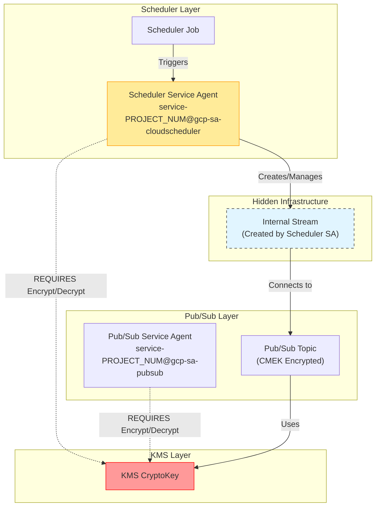

# Pub/Sub CMEK & Cloud Scheduler `NOT_FOUND` Error Summary

## 1. 核心问题分析 (Core Problem Analysis)

**症状 (Symptom)**:
执行 `gcloud scheduler jobs resume` 时，遇到以下错误：
```text
ERROR: (gcloud.scheduler.jobs.resume) NOT_FOUND: Resource 'parent resource not found for .../retryPolicies/...'
```

**根本原因 (Root Cause)**:
这个错误并不是指 Scheduler Job 本身不存在，而是指 **Scheduler 指向 Pub/Sub 的内部后端连接（Internal Stream）不存在**。

在 GCP 组织策略 `constraints/gcp.restrictNonCmekServices` 强制启用 CMEK 的环境下：
1.  Cloud Scheduler 尝试创建一个内部 Stream 来连接目标 Pub/Sub Topic。
2.  因为 Topic 启用了 CMEK（且受组织策略保护），**创建这个 Stream 的 Service Agent (Scheduler SA)** 必须拥有该 Topic 所使用的 KMS Key 的 `cloudkms.cryptoKeyEncrypterDecrypter` 权限。
3.  如果权限缺失，Stream 创建失败（静默失败或在 Job 创建时未抛出明显阻断错误）。
4.  当您尝试 `resume` 一个处于这种 "半吊子" 状态的 Job 时，它试图激活那个从未成功创建的 Stream，因此报错 `NOT_FOUND` (找不到父级 Stream 资源)。

---

## 2. 为什么是 NOT_FOUND？(Why NOT_FOUND?)

这是一个误导性的错误消息。它掩盖了真正的权限问题。

*   **直观理解**: `NOT_FOUND` 让您以为是 Job 没了，或者 Topic 没了。
*   **实际情况**: Job 还在，Topic 也在。但是从 Job 到 Topic 的 **"桥梁" (Internal Stream)** 没建起来。
*   **Resume 的行为**: `Resume` 操作仅仅是把 Job 的开关打开。它假设 "桥梁" 已经存在。如果 "桥梁" 不存在，它就找不到这就报错 `NOT_FOUND`。

---

## 3. 信任链与权限模型 (Trust Chain & Permissions)

要成功打通 Cloud Scheduler -> Pub/Sub (CMEK)，必须满足以下信任链，特别是 **Cloud Scheduler Service Agent** 的角色常被忽略。



### 关键权限矩阵

| Service Agent | 角色 | 必须性 | 原因 |
| :--- | :--- | :--- | :--- |
| **Scheduler SA** | `roles/cloudkms.cryptoKeyEncrypterDecrypter` | **必须** | 它负责创建连接到加密 Topic 的内部 Stream。 |
| **Pub/Sub SA** | `roles/cloudkms.cryptoKeyEncrypterDecrypter` | **必须** | 它负责实际的消息加密存储和解密投递。 |

---

## 4. 解决方案 (Solution)

**注意**: 即使修复了权限，也就是现在的 `NOT_FOUND` 状态的 Job 也是**无法修复**的。必须**删除重建**。

### Step 1: 准备环境变量
```bash
export PROJECT_ID="your-project-id"
export PROJECT_NUMBER="your-project-number" # e.g., 445194165188
export KEY_PROJECT="your-kms-project"       # KMS Key 所在项目
export KEY_RING="your-key-ring"
export KEY_NAME="your-key-name"
export LOCATION="europe-west2"              # 必须与资源一致
export TOPIC_NAME="your-topic-name"
```

### Step 2: 授予权限 (Fix Permissions)
必须同时给两个 Service Agent 授权。

```bash
# 1. 授权 Cloud Scheduler Service Agent
SCHEDULER_SA="service-${PROJECT_NUMBER}@gcp-sa-cloudscheduler.iam.gserviceaccount.com"

gcloud kms keys add-iam-policy-binding ${KEY_NAME} \
    --project ${KEY_PROJECT} \
    --location ${LOCATION} \
    --keyring ${KEY_RING} \
    --member "serviceAccount:${SCHEDULER_SA}" \
    --role "roles/cloudkms.cryptoKeyEncrypterDecrypter"

# 2. 授权 Pub/Sub Service Agent
PUBSUB_SA="service-${PROJECT_NUMBER}@gcp-sa-pubsub.iam.gserviceaccount.com"

gcloud kms keys add-iam-policy-binding ${KEY_NAME} \
    --project ${KEY_PROJECT} \
    --location ${LOCATION} \
    --keyring ${KEY_RING} \
    --member "serviceAccount:${PUBSUB_SA}" \
    --role "roles/cloudkms.cryptoKeyEncrypterDecrypter"
```

### Step 3: 删除并重建 Job (Delete & Recreate)

```bash
# 1. 删除损坏的 Job
gcloud scheduler jobs delete job-lex-eg-test-001 \
    --location ${LOCATION} \
    --project ${PROJECT_ID} \
    --quiet

# 2. 重新创建 Job
gcloud scheduler jobs create pubsub job-lex-eg-test-001 \
    --schedule="0 * * * *" \
    --topic=${TOPIC_NAME} \
    --message-body='{"status":"check"}' \
    --location ${LOCATION} \
    --project ${PROJECT_ID}
```

**验证**:
创建后，Job 应该直接处于 `ENABLED` 状态。如果再次需要 Resume，将不会报错。

---

## 5. 参考文档
*   [Troubleshoot Scheduler Resume Failure](./schedule-job-resume.md)
*   [Cloud Scheduler + CMEK Complete Guide](./schedule-job-cmek-kms.md)
