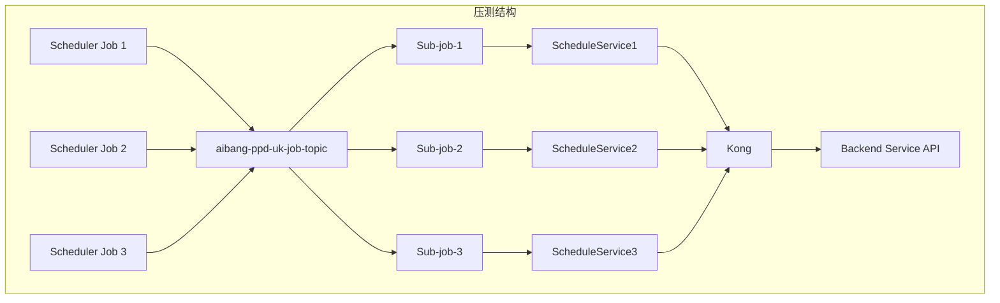

列出特定区域（Location）的任务

gcloud scheduler jobs list --location=<location>

例如，查看 us-central1 区域的任务：

gcloud scheduler jobs list --location=us-central1

gcloud pubsub subscriptions describe your-sub-name
虽然能看到 Subscription 的配置（如 topic、ack deadline），但：

- **不会展示消息堆积量（backlog）**
    
- 也不会展示消费延迟、未 Ack 消息数等 **运行时指标**


你可以使用 gcloud scheduler jobs create pubsub 命令来创建调度任务，将消息发布到你指定的 Pub/Sub 主题（例如 aibang-ppd-uk-job-topic）。下面是详细的创建步骤和示例命令。

---

## **✅ 创建一个调度任务发送消息到 Pub/Sub Topic**

  

### **🔧 示例命令**

```
gcloud scheduler jobs create pubsub job-ppd-uk-test-001 \
  --schedule="*/1 * * * *" \
  --time-zone="Asia/Shanghai" \
  --topic="aibang-ppd-uk-job-topic" \
  --message-body='{"job":"ppd-uk","type":"test"}' \
  --description="PPD UK test job" \
  --project="your-gcp-project-id" \
  --location="your-region"  # 如 asia-east1
```

---

## **✅ 参数说明**

|**参数**|**含义**|
|---|---|
|job-ppd-uk-test-001|Scheduler Job 名称，需全局唯一|
|--schedule="*/1 * * * *"|Cron 表达式，表示每分钟执行一次|
|--time-zone="Asia/Shanghai"|指定时区，便于本地时间对齐|
|--topic="aibang-ppd-uk-job-topic"|你要发送消息的 Pub/Sub Topic 名称|
|--message-body='{}'|消息体，可为 JSON 字符串，传入你要调度的信息|
|--project|指定 GCP 项目 ID|
|--location|Scheduler Job 所在区域（建议和 Pub/Sub、GKE 服务相同区域）|

---

## **✅ 创建多个 Job（批量脚本）**

  

你可以用下面的 shell 脚本批量生成多个 job：

```
#!/bin/bash

PROJECT_ID="your-gcp-project-id"
TOPIC="aibang-ppd-uk-job-topic"
REGION="asia-east1"

for i in $(seq -w 1 100); do
  JOB_NAME="job-ppd-uk-load-${i}"
  MESSAGE="{\"job\":\"ppd-uk-${i}\", \"type\":\"load-test\"}"

  gcloud scheduler jobs create pubsub $JOB_NAME \
    --schedule="*/1 * * * *" \
    --time-zone="Asia/Shanghai" \
    --topic="$TOPIC" \
    --message-body="$MESSAGE" \
    --description="PPD UK load test job $i" \
    --project="$PROJECT_ID" \
    --location="$REGION"
done
```

---

## **✅ 补充权限说明**

  

确保 Scheduler 有权限向该 Pub/Sub topic 发布消息。默认使用的 Service Account 是：

```
[PROJECT_NUMBER]@gcp-sa-cloudscheduler.iam.gserviceaccount.com
```

你可以为它授予 Pub/Sub Publisher 权限：

```
gcloud pubsub topics add-iam-policy-binding aibang-ppd-uk-job-topic \
  --member="serviceAccount:[PROJECT_NUMBER]@gcp-sa-cloudscheduler.iam.gserviceaccount.com" \
  --role="roles/pubsub.publisher"
```

---

是否需要我也帮你生成一个 Terraform 或 YAML 的批量配置模板？还是你准备用 shell 脚本直接创建压测？


是的，你的目标 **完全可以实现**，架构上也合理：

**一个 Topic + 多个 Subscription（每个 Job 绑定一个 Sub）+ 同一个 Backend API。**

---

## **✅ 架构目标总结**



---

## **✅ 关键技术点说明**

  

### **1.** 

### **Pub/Sub 支持一对多消费**

- 一个 Topic 可以绑定多个 Subscription；
    
- 每个 Subscription 收到的消息是彼此**独立的副本**；
    
- 所以你可以让每个 Cloud Scheduler Job 对应一个 Sub，通过 Pub/Sub -> Schedule Service -> Backend。
    

  

### **2.** 

### **如何实现多 Sub 消费同一个 Topic？**

  

#### **Step A: 创建多个 Subscription（独立名字）**

```
for i in $(seq -w 1 100); do
  gcloud pubsub subscriptions create sub-job-${i} \
    --topic=aibang-ppd-uk-job-topic \
    --ack-deadline=60 \
    --message-retention-duration=600s \
    --project=your-project-id
done
```

#### **Step B: 每个 Schedule Service 实例监听一个 Subscription（或配置消费多个）**

- 你可以部署多个实例，或 Schedule Service 内部用并发线程分别订阅；
    
- 或者同一个服务接收多个 Subscription 的消息（需要异步处理）；
    
- **建议方式**：每个 Sub 对应一个 Kubernetes Job 或 Deployment 处理逻辑。
    

---

## **✅ JMeter 压测建议**

  

你不需要 JMeter 直接调用 Backend API，而是间接通过 Cloud Scheduler 发送 Pub/Sub 消息来压测：

|**工具**|**目标**|
|---|---|
|gcloud scheduler jobs create pubsub|模拟用户任务调度，批量触发消息|
|GCP Pub/Sub|同一个 Topic + 多个 Subscription 实现 fan-out 并发处理|
|Schedule Service (GKE)|实际消费并调用 Backend API（评估处理与重试能力）|
|Backend API|被压测目标，通过 GKE HPA 自动扩容|
|JMeter（可选）|模拟外部高频 Job 创建或监控 Backend 响应性能（如你还想模拟 HTTP 请求）|

---

## **✅ 建议监控指标**

|**层级**|**指标**|**说明**|
|---|---|---|
|Pub/Sub|num_undelivered_messages|检查是否存在消息 backlog|
|Pub/Sub|ack_latency|消息消费延迟|
|Scheduler|job execution count|是否定时稳定触发|
|Schedule Service|CPU / memory / request latency|是否存在处理瓶颈|
|Backend API|响应时间 / HPA Pod 数|是否扩容及时，是否请求撑爆|
|Kong|超时 / 5xx|转发失败或响应过慢|

---

## **✅ 后续可扩展策略**

- 若要彻底隔离不同团队影响，可以考虑：
    
    - 每个团队一个 Topic；
        
    - 或者同一个 Topic + Filtered Subscription（Pub/Sub 支持过滤器）；
        
    
- 可在消息中加上 apiName/teamName/traceId 字段，方便日志追踪；
    
- 可通过 Cloud Logging + BigQuery 分析每条链路的处理耗时。
    

---

是否需要我帮你生成：

- 多 Subscription 自动创建脚本
    
- Schedule Service 消费多个 Sub 的代码模板（Java）
    
- 监控指标 YAML 或 Grafana 图表模板？
    

  

你选哪一个我就直接给。

明白了，你现在的压测目标是：

- ✅ 用 **Cloud Scheduler 创建 100 个 Job**
    
- ✅ 所有 Job 发送到同一个 **Pub/Sub Topic**
    
- ✅ 不用 JMeter，而是通过 Cloud Scheduler 的频繁触发来模拟高并发
    
- ✅ 每条消息被 Schedule Service 处理后，转发请求到一个简单的 Backend（比如 /health）
    

---

## **✅ Message Body 要怎么写？**

  

**完全取决于你的 Schedule Service 如何解析 Pub/Sub 的 message。**

  

如果你的 Schedule Service 是 Java 写的，通常会对 PubsubMessage.getData() 进行 Base64 解码，再反序列化成某种结构（比如 JSON 对象）——那么你就应该构造这个格式的消息。

  

### **🔧 假设 Schedule Service 只需要一个 URL 参数（访问 Backend 的** 

### **/health**

### **）**

  

你可以这样构造 message body（JSON 格式）：

```
{
  "url": "http://backend-service.default.svc.cluster.local/health",
  "method": "GET",
  "team": "team-a",
  "api": "health-check"
}
```

---

## **✅ Shell 脚本：批量创建 100 个 Job**

```
#!/bin/bash

PROJECT_ID="your-gcp-project-id"
REGION="asia-east1"
TOPIC="aibang-ppd-uk-job-topic"
URL="http://backend-service.default.svc.cluster.local/health"

for i in $(seq -w 1 100); do
  JOB_NAME="job-health-check-${i}"
  MESSAGE_BODY=$(jq -c -n \
    --arg url "$URL" \
    --arg team "team-a" \
    --arg api "health-check-$i" \
    '{url: $url, method: "GET", team: $team, api: $api}')
  
  gcloud scheduler jobs create pubsub "$JOB_NAME" \
    --schedule="*/1 * * * *" \
    --time-zone="Asia/Shanghai" \
    --topic="$TOPIC" \
    --message-body="$MESSAGE_BODY" \
    --description="Health check job $i" \
    --project="$PROJECT_ID" \
    --location="$REGION"
done
```

> 如果你本地没有安装 jq，你也可以用简单的 bash 字符串拼接：

```
MESSAGE_BODY="{\"url\":\"$URL\",\"method\":\"GET\",\"team\":\"team-a\",\"api\":\"health-check-$i\"}"
```

---

## **✅ Schedule Service 如何处理？**

  

假设你的 Schedule Service 逻辑是这样（简化）：

```
String raw = new String(pubsubMessage.getData().toByteArray(), StandardCharsets.UTF_8);
JsonObject json = new Gson().fromJson(raw, JsonObject.class);
String url = json.get("url").getAsString();
String method = json.get("method").getAsString();
```

然后构造请求发给你 GKE 内的 Backend Deployment。

---

## **✅ 模拟一个最简单的 Backend** 

## **/health**

##  **API**

  

如果你只是为了让 Schedule Service 发请求，可以先部署一个最简单的 /health 服务，比如：

```
kubectl create deployment health-api --image=nginx
kubectl expose deployment health-api --port=80 --target-port=80 --name=health-api
```

然后 Schedule Service 的 URL 就是：

```
http://health-api.default.svc.cluster.local/
```

或者你在容器里跑个返回 200 OK 的简单 Spring Boot 或 Flask /health 接口。

---

## **✅ 推荐你监控这些内容 during test：**

|**组件**|**关注点**|**指标建议**|
|---|---|---|
|Pub/Sub|堆积是否增加|num_undelivered_messages, oldest_unacked_message_age|
|Schedule Service|是否有消费堵塞 / 重试|Pod CPU、日志、是否有 timeout、ack 速率|
|Backend Service|响应是否撑爆 HPA|请求 QPS、响应时间、错误率、Pod 数量变化|
|总链路|是否稳定|Stackdriver Trace + Logging（可选）|

---

需要我：

- 帮你写一个 Schedule Service 消费者 Java 示例？
    
- 帮你生成 Stackdriver 监控 Dashboard 模板？
    

  

你告诉我目标，我马上配好。
