下面是对你提到的 3 个 GCP 命令（Pub/Sub Topics、Subscriptions、Cloud Scheduler Jobs）及其相互关系的简洁说明，并附带流程图帮助理解：


---

## **🔹 概念说明**

| **名称**                   | **命令**                           | **说明**                                                | Mark                                                                                                                             |
| ------------------------ | -------------------------------- | ----------------------------------------------------- | -------------------------------------------------------------------------------------------------------------------------------- |
| **Pub/Sub Topic**        | gcloud pubsub topics list        | Topic 是消息的“主题”，用于接收消息发布。生产者向 Topic 发送消息。              |                                                                                                                                  |
| **Pub/Sub Subscription** | gcloud pubsub subscriptions list | Subscription 是“订阅者”的配置。它绑定到某个 Topic，决定消息如何被拉取/推送到消费者。 | 如果默认没有 DLQ 那么 messageRetentionDuration 7 天<br>ackDeadlineSeconds<br>实际就是你整个 E2E 链路中，从 Pub/Sub 发送消息 到 你（后端服务）确认消息处理完毕 之间允许的最大时间窗口 |
| **Cloud Scheduler Job**  | gcloud scheduler jobs list       | 定时触发任务，可以配置为定时向某个 Pub/Sub Topic 发布消息。                 |                                                                                                                                  |

---

## **🔄 三者之间的关系**

你可以将它们理解为一个“定时触发流程”：

- **Cloud Scheduler** 是定时器，定时 **发布消息到 Pub/Sub Topic**；
- **Pub/Sub Topic** 是消息的管道；
- **Pub/Sub Subscription** 是监听 Topic 的消费者配置（比如 GKE 服务或 Cloud Run）。

---

## **✅ 举个实际例子**

比如你有一个每日自动清理数据库的任务，可以这么配置：

1. 创建一个 daily-cleanup 的 **Pub/Sub Topic**；
2. 创建一个订阅 cleanup-service-sub，连接到 Topic；
3. 创建一个 Cloud Scheduler Job，**每天触发一次消息发送到 Topic**；
4. GKE 或 Cloud Run 的服务通过 Subscription 接收到消息并执行任务。

---

## **📈 Mermaid 流程图**

```mermaid
sequenceDiagram
    participant Scheduler as Cloud Scheduler Job
    participant Topic as Pub/Sub Topic
    participant Sub as Pub/Sub Subscription
    participant Worker as GKE/Cloud Run Service

    Scheduler->>+Topic: 定时发布消息
    Topic->>+Sub: 消息投递
    Sub->>+Worker: 拉/推消息并触发业务逻辑
```



---

## **🧠 总结一句话**

> **Cloud Scheduler** 是“定时触发器”，负责触发 **Pub/Sub Topic** 产生消息，消息通过绑定的 **Subscription** 被消费，通常由后端服务如 GKE 或 Cloud Run 来处理。

# pub/sub subscriptions

当然，这里是 gcloud pubsub subscriptions describe 的一个**示例输出**，以及对每一行的逐项详细解释说明。

---

## **🔧 示例命令**

```
gcloud pubsub subscriptions describe my-subscription
```

---

## **📄 示例输出**

```
ackDeadlineSeconds: 10
expirationPolicy:
  ttl: 2678400s
messageRetentionDuration: 604800s
name: projects/my-gcp-project/subscriptions/my-subscription
pushConfig:
  pushEndpoint: https://my-service.example.com/push-endpoint
topic: projects/my-gcp-project/topics/my-topic
```

---

## **🧠 字段解释（逐行）**

| **字段**                       | **示例值**                                               | **说明**                                                                   |
| ---------------------------- | ----------------------------------------------------- | ------------------------------------------------------------------------ |
| **ackDeadlineSeconds**       | 10                                                    | 订阅者在这段时间（秒）内确认消息，否则消息将重新投递。默认是 10 秒。最大 600 秒。                            |
| **expirationPolicy.ttl**     | 2678400s                                              | 如果订阅在这段时间内没有被使用（即无连接或无活动），则会自动删除。单位是秒（此处为 31 天）。                         |
| **messageRetentionDuration** | 604800s                                               | Topic 中的消息会被保留的时长，即使已经被消费（7 天 = 604800 秒）。这可用于“迟到的订阅者”接收历史消息。            |
| **name**                     | projects/my-gcp-project/subscriptions/my-subscription | 完整的订阅资源名称，包括项目 ID 和订阅名。                                                  |
| **pushConfig.pushEndpoint**  | https://my-service.example.com/push-endpoint          | 如果是 Push 模式订阅，Pub/Sub 会将消息 **以 HTTP POST 的形式推送到此 URL**。如果是 Pull 模式则此项为空。 |
| **topic**                    | projects/my-gcp-project/topics/my-topic               | 当前订阅绑定的 Topic，也就是它接收消息的来源。                                               |

---

## **📌 补充说明**

- 如果是 **Pull 类型订阅**（即服务主动拉取消息），pushConfig 字段将为空或缺失。
- 想查看是 Pull 还是 Push，可以加上 --format=json 查看结构体中的 pushConfig 是否有设置 pushEndpoint。
- 配置 messageRetentionDuration 和 expirationPolicy 有助于保证消息可靠性和订阅生命周期控制。

---

如需我帮你解释某个真实输出，可以贴上你的结果我来解析。

如需示例命令或 YAML 配置，也可以继续提问。

列出特定区域（Location）的任务

gcloud scheduler jobs list --location=<location>

例如，查看 us-central1 区域的任务：

gcloud scheduler jobs list --location=us-central1

gcloud pubsub subscriptions describe your-sub-name
虽然能看到 Subscription 的配置（如 topic、ack deadline），但：

- **不会展示消息堆积量（backlog）**
- 也不会展示消费延迟、未 Ack 消息数等 **运行时指标**

DLQ 规则附带到原始的订阅 然后可以设置对应的规则

```bash
# 为每个用户创建专用的DLQ Topic
gcloud pubsub topics create schedule-dlq-user-a
gcloud pubsub topics create schedule-dlq-user-b

# 创建带DLQ的订阅
create schedule-service-user-a \
  --topic=schedule-topic \
  --dead-letter-topic=schedule-dlq-user-a \
  --max-delivery-attempts=3 \
  --ack-deadline=60s \
  --message-filter='attributes.user_id="user-a"'
```

- 

你可以使用 gcloud scheduler jobs create pubsub 命令来创建调度任务，将消息发布到你指定的 Pub/Sub 主题（例如 aibang-lex-eg-job-topic）。下面是详细的创建步骤和示例命令。

---

## **✅ 创建一个调度任务发送消息到 Pub/Sub Topic**

### **🔧 示例命令**

```
gcloud scheduler jobs create pubsub job-lex-eg-test-001 \
  --schedule="*/1 * * * *" \
  --time-zone="Asia/Shanghai" \
  --topic="aibang-lex-eg-job-topic" \
  --message-body='{"job":"lex-eg","type":"test"}' \
  --description="PPD UK test job" \
  --project="your-gcp-project-id" \
  --location="your-region"  # 如 asia-east1
```

---

## **✅ 参数说明**

| **参数**                          | **含义**                                                   |
| --------------------------------- | ---------------------------------------------------------- |
| job-lex-eg-test-001               | Scheduler Job 名称，需全局唯一                             |
| --schedule="_/1 _ \* \* \*"       | Cron 表达式，表示每分钟执行一次                            |
| --time-zone="Asia/Shanghai"       | 指定时区，便于本地时间对齐                                 |
| --topic="aibang-lex-eg-job-topic" | 你要发送消息的 Pub/Sub Topic 名称                          |
| --message-body='{}'               | 消息体，可为 JSON 字符串，传入你要调度的信息               |
| --project                         | 指定 GCP 项目 ID                                           |
| --location                        | Scheduler Job 所在区域（建议和 Pub/Sub、GKE 服务相同区域） |

---

## **✅ 创建多个 Job（批量脚本）**

你可以用下面的 shell 脚本批量生成多个 job：

```
#!/bin/bash

PROJECT_ID="your-gcp-project-id"
TOPIC="aibang-lex-eg-job-topic"
REGION="asia-east1"

for i in $(seq -w 1 100); do
  JOB_NAME="job-lex-eg-load-${i}"
  MESSAGE="{\"job\":\"lex-eg-${i}\", \"type\":\"load-test\"}"

  gcloud scheduler jobs create pubsub $JOB_NAME \
    --schedule="*/1 * * * *" \
    --time-zone="Asia/Shanghai" \
    --topic="$TOPIC" \
    --message-body="$MESSAGE" \
    --description="PPD UK load test job $i" \
    --project="$PROJECT_ID" \
    --location="$REGION"
done
```

---

## **✅ 补充权限说明**

确保 Scheduler 有权限向该 Pub/Sub topic 发布消息。默认使用的 Service Account 是：

```
[PROJECT_NUMBER]@gcp-sa-cloudscheduler.iam.gserviceaccount.com
```

你可以为它授予 Pub/Sub Publisher 权限：

```
gcloud pubsub topics add-iam-policy-binding aibang-lex-eg-job-topic \
  --member="serviceAccount:[PROJECT_NUMBER]@gcp-sa-cloudscheduler.iam.gserviceaccount.com" \
  --role="roles/pubsub.publisher"
```

---

是否需要我也帮你生成一个 Terraform 或 YAML 的批量配置模板？还是你准备用 shell 脚本直接创建压测？

是的，你的目标 **完全可以实现**，架构上也合理：

**一个 Topic + 多个 Subscription（每个 Job 绑定一个 Sub）+ 同一个 Backend API。**

---

## **✅ 架构目标总结**


---

## **✅ 关键技术点说明**

### **1.** 

### **Pub/Sub 支持一对多消费**

- 一个 Topic 可以绑定多个 Subscription；
- 每个 Subscription 收到的消息是彼此**独立的副本**；
- 所以你可以让每个 Cloud Scheduler Job 对应一个 Sub，通过 Pub/Sub -> Schedule Service -> Backend。

### **2.** 

### **如何实现多 Sub 消费同一个 Topic？**

#### **Step A: 创建多个 Subscription（独立名字）**

```
for i in $(seq -w 1 100); do
  gcloud pubsub subscriptions create sub-job-${i} \
    --topic=aibang-lex-eg-job-topic \
    --ack-deadline=60 \
    --message-retention-duration=600s \
    --project=your-project-id
done
```

#### **Step B: 每个 Schedule Service 实例监听一个 Subscription（或配置消费多个）**

- 你可以部署多个实例，或 Schedule Service 内部用并发线程分别订阅；
- 或者同一个服务接收多个 Subscription 的消息（需要异步处理）；
- **建议方式**：每个 Sub 对应一个 Kubernetes Job 或 Deployment 处理逻辑。

---

## **✅ JMeter 压测建议**

你不需要 JMeter 直接调用 Backend API，而是间接通过 Cloud Scheduler 发送 Pub/Sub 消息来压测：

| **工具**                            | **目标**                                                               |
| ----------------------------------- | ---------------------------------------------------------------------- |
| gcloud scheduler jobs create pubsub | 模拟用户任务调度，批量触发消息                                         |
| GCP Pub/Sub                         | 同一个 Topic + 多个 Subscription 实现 fan-out 并发处理                 |
| Schedule Service (GKE)              | 实际消费并调用 Backend API（评估处理与重试能力）                       |
| Backend API                         | 被压测目标，通过 GKE HPA 自动扩容                                      |
| JMeter（可选）                      | 模拟外部高频 Job 创建或监控 Backend 响应性能（如你还想模拟 HTTP 请求） |

---

## **✅ 建议监控指标**

| **层级**         | **指标**                       | **说明**                   |
| ---------------- | ------------------------------ | -------------------------- |
| Pub/Sub          | num_undelivered_messages       | 检查是否存在消息 backlog   |
| Pub/Sub          | ack_latency                    | 消息消费延迟               |
| Scheduler        | job execution count            | 是否定时稳定触发           |
| Schedule Service | CPU / memory / request latency | 是否存在处理瓶颈           |
| Backend API      | 响应时间 / HPA Pod 数          | 是否扩容及时，是否请求撑爆 |
| Kong             | 超时 / 5xx                     | 转发失败或响应过慢         |

---

## **✅ 后续可扩展策略**

- 若要彻底隔离不同团队影响，可以考虑：
    - 每个团队一个 Topic；
    - 或者同一个 Topic + Filtered Subscription（Pub/Sub 支持过滤器）；
- 可在消息中加上 apiName/teamName/traceId 字段，方便日志追踪；
- 可通过 Cloud Logging + BigQuery 分析每条链路的处理耗时。

---

是否需要我帮你生成：

- 多 Subscription 自动创建脚本
- Schedule Service 消费多个 Sub 的代码模板（Java）
- 监控指标 YAML 或 Grafana 图表模板？

你选哪一个我就直接给。

明白了，你现在的压测目标是：

- ✅ 用 **Cloud Scheduler 创建 100 个 Job**
- ✅ 所有 Job 发送到同一个 **Pub/Sub Topic**
- ✅ 不用 JMeter，而是通过 Cloud Scheduler 的频繁触发来模拟高并发
- ✅ 每条消息被 Schedule Service 处理后，转发请求到一个简单的 Backend（比如 /health）

---

## **✅ Message Body 要怎么写？**

**完全取决于你的 Schedule Service 如何解析 Pub/Sub 的 message。**

如果你的 Schedule Service 是 Java 写的，通常会对 PubsubMessage.getData() 进行 Base64 解码，再反序列化成某种结构（比如 JSON 对象）——那么你就应该构造这个格式的消息。

### **🔧 假设 Schedule Service 只需要一个 URL 参数（访问 Backend 的** 

### **/health**

### **）**

你可以这样构造 message body（JSON 格式）：

```
{
  "url": "http://backend-service.default.svc.jiqun.local/health",
  "method": "GET",
  "team": "team-a",
  "api": "health-check"
}
```

---

## **✅ Shell 脚本：批量创建 100 个 Job**

```
#!/bin/bash

PROJECT_ID="your-gcp-project-id"
REGION="asia-east1"
TOPIC="aibang-lex-eg-job-topic"
URL="http://backend-service.default.svc.jiqun.local/health"

for i in $(seq -w 1 100); do
  JOB_NAME="job-health-check-${i}"
  MESSAGE_BODY=$(jq -c -n \
    --arg url "$URL" \
    --arg team "team-a" \
    --arg api "health-check-$i" \
    '{url: $url, method: "GET", team: $team, api: $api}')

  gcloud scheduler jobs create pubsub "$JOB_NAME" \
    --schedule="*/1 * * * *" \
    --time-zone="Asia/Shanghai" \
    --topic="$TOPIC" \
    --message-body="$MESSAGE_BODY" \
    --description="Health check job $i" \
    --project="$PROJECT_ID" \
    --location="$REGION"
done
```

> 如果你本地没有安装 jq，你也可以用简单的 bash 字符串拼接：

```
MESSAGE_BODY="{\"url\":\"$URL\",\"method\":\"GET\",\"team\":\"team-a\",\"api\":\"health-check-$i\"}"
```

---

## **✅ Schedule Service 如何处理？**

假设你的 Schedule Service 逻辑是这样（简化）：

```
String raw = new String(pubsubMessage.getData().toByteArray(), StandardCharsets.UTF_8);
JsonObject json = new Gson().fromJson(raw, JsonObject.class);
String url = json.get("url").getAsString();
String method = json.get("method").getAsString();
```

然后构造请求发给你 GKE 内的 Backend Deployment。

---

## **✅ 模拟一个最简单的 Backend** 

## **/health**

##  **API**

如果你只是为了让 Schedule Service 发请求，可以先部署一个最简单的 /health 服务，比如：

```
kubectl create deployment health-api --image=nginx
kubectl expose deployment health-api --port=80 --target-port=80 --name=health-api
```

然后 Schedule Service 的 URL 就是：

```
http://health-api.default.svc.jiqun.local/
```

或者你在容器里跑个返回 200 OK 的简单 Spring Boot 或 Flask /health 接口。

---

## **✅ 推荐你监控这些内容 during test：**

| **组件**         | **关注点**            | **指标建议**                                         |
| ---------------- | --------------------- | ---------------------------------------------------- |
| Pub/Sub          | 堆积是否增加          | num_undelivered_messages, oldest_unacked_message_age |
| Schedule Service | 是否有消费堵塞 / 重试 | Pod CPU、日志、是否有 timeout、ack 速率              |
| Backend Service  | 响应是否撑爆 HPA      | 请求 QPS、响应时间、错误率、Pod 数量变化             |
| 总链路           | 是否稳定              | Stackdriver Trace + Logging（可选）                  |

---

需要我：

- 帮你写一个 Schedule Service 消费者 Java 示例？
- 帮你生成 Stackdriver 监控 Dashboard 模板？

你告诉我目标，我马上配好。
