- [command](#command)
    - [**🔹 概念说明**](#-概念说明)
    - [**🔄 三者之间的关系**](#-三者之间的关系)
    - [**✅ 举个实际例子**](#-举个实际例子)
    - [**📈 Mermaid 流程图**](#-mermaid-流程图)
    - [**🧠 总结一句话**](#-总结一句话)
- [job](#job)
- [pub/sub subscriptions](#pubsub-subscriptions)
    - [**🔧 示例命令**](#-示例命令)
    - [**📄 示例输出**](#-示例输出)
    - [**🧠 字段解释（逐行）**](#-字段解释逐行)
    - [**📌 补充说明**](#-补充说明)
    - [**✅ 创建一个调度任务发送消息到 Pub/Sub Topic**](#-创建一个调度任务发送消息到-pubsub-topic)
        - [**🔧 示例命令**](#-示例命令-1)
    - [**✅ 参数说明**](#-参数说明)
    - [**✅ 创建多个 Job（批量脚本）**](#-创建多个-job批量脚本)
    - [**✅ 补充权限说明**](#-补充权限说明)
    - [**✅ 架构目标总结**](#-架构目标总结)
    - [**✅ 关键技术点说明**](#-关键技术点说明)
        - [**1.** ](#1)
        - [**Pub/Sub 支持一对多消费**](#pubsub-支持一对多消费)
        - [**2.** ](#2)
        - [**如何实现多 Sub 消费同一个 Topic？**](#如何实现多-sub-消费同一个-topic)
            - [**Step A: 创建多个 Subscription（独立名字）**](#step-a-创建多个-subscription独立名字)
            - [**Step B: 每个 Schedule Service 实例监听一个 Subscription（或配置消费多个）**](#step-b-每个-schedule-service-实例监听一个-subscription或配置消费多个)
    - [**✅ JMeter 压测建议**](#-jmeter-压测建议)
    - [**✅ 建议监控指标**](#-建议监控指标)
    - [**✅ 后续可扩展策略**](#-后续可扩展策略)
    - [**✅ Message Body 要怎么写？**](#-message-body-要怎么写)
        - [**🔧 假设 Schedule Service 只需要一个 URL 参数（访问 Backend 的** ](#-假设-schedule-service-只需要一个-url-参数访问-backend-的)
        - [**/health**](#health)
        - [**）**](#)
    - [**✅ Shell 脚本：批量创建 100 个 Job**](#-shell-脚本批量创建-100-个-job)
    - [**✅ Schedule Service 如何处理？**](#-schedule-service-如何处理)
    - [**✅ 模拟一个最简单的 Backend** ](#-模拟一个最简单的-backend)
    - [**/health**](#health-1)
    - [ **API**](#api)
    - [**✅ 推荐你监控这些内容 during test：**](#-推荐你监控这些内容-during-test)
- [topic](#topic)
    - [**✅ 命令示例**](#-命令示例)
    - [**📄 输出示例（表格格式）**](#-输出示例表格格式)
    - [**🔍 字段解释**](#-字段解释)
    - [**💡 拆解说明**](#-拆解说明)
    - [**📌 说明要点**](#-说明要点)
    - [**🧪 高级格式化输出（JSON）**](#-高级格式化输出json)
    - [**✅ 命令示例**](#-命令示例-1)
    - [**📄 输出示例（YAML 格式）**](#-输出示例yaml-格式)
    - [**🔍 字段解释**](#-字段解释-1)
    - [**💡 常见用途**](#-常见用途)
    - [**🧪 补充命令**](#-补充命令)
    - [**✅** ](#-1)
    - [**messageStoragePolicy**](#messagestoragepolicy)
        - [**📌 含义：**](#-含义)
        - [**🔐 安全场景应用（Tier 0 要求）：**](#-安全场景应用tier-0-要求)
    - [**✅** ](#-2)
    - [**satisfiesPzs**](#satisfiespzs)
        - [**📌 含义：**](#-含义-1)
        - [**🔐 安全场景应用（Tier 0 要求）：**](#-安全场景应用tier-0-要求-1)
        - [**🛠 相关命令检查：**](#-相关命令检查)
    - [**✅ 总结建议（针对 Tier 0）**](#-总结建议针对-tier-0)

# command

下面是对你提到的 3 个 GCP 命令（Pub/Sub Topics、Subscriptions、Cloud Scheduler Jobs）及其相互关系的简洁说明，并附带流程图帮助理解：

---

## **🔹 概念说明**

| **名称** | **命令** | **说明** | **Mark** |
| --- | --- | --- | --- |
| **Pub/Sub Topic** | gcloud pubsub topics list | Topic 是消息的“主题”，用于接收消息发布。生产者向 Topic 发送消息。 | | 
| **Pub/Sub Subscription** | gcloud pubsub subscriptions list | Subscription 是“订阅者”的配置。它绑定到某个 Topic，决定消息如何被拉取/推送到消费者。 | 如果默认没有 DLQ 那么 messageRetentionDuration 7 天<br>ackDeadlineSeconds<br>实际就是你整个 E2E 链路中，从 Pub/Sub 发送消息 到 你（后端服务）确认消息处理完毕 之间允许的最大时间窗口 | 
| **Cloud Scheduler Job** | gcloud scheduler jobs list | 定时触发任务，可以配置为定时向某个 Pub/Sub Topic 发布消息。 | | 

---

## **🔄 三者之间的关系**

你可以将它们理解为一个“定时触发流程”：

- **Cloud Scheduler** 是定时器，定时 **发布消息到 Pub/Sub Topic**；
- **Pub/Sub Topic** 是消息的管道；
- **Pub/Sub Subscription** 是监听 Topic 的消费者配置（比如 GKE 服务或 Cloud Run）。

---

## **✅ 举个实际例子**

比如你有一个每日自动清理数据库的任务，可以这么配置：

1. 创建一个 daily-cleanup 的 **Pub/Sub Topic**；
2. 创建一个订阅 cleanup-service-sub��连接到 Topic；
3. 创建一个 Cloud Scheduler Job，**每天触发一次消息发送到 Topic**；
4. GKE 或 Cloud Run 的服务通过 Subscription 接收到消息并执行任务。

---

## **📈 Mermaid 流程图**

```mermaid
sequenceDiagram
    participant Scheduler as Cloud Scheduler Job
    participant Topic as Pub/Sub Topic
    participant Sub as Pub/Sub Subscription
    participant Worker as GKE/Cloud Run Service

    Scheduler->>+Topic: 定时发布消息
    Topic->>+Sub: 消息投递
    Sub->>+Worker: 拉/推消息并触发业务逻辑
```



---

## **🧠 总结一句话**

> **Cloud Scheduler** 是“定时触发器”，负责触发 **Pub/Sub Topic** 产生消息，消息通过绑定的 **Subscription** 被消费，通常由后端服务如 GKE 或 Cloud Run 来处理。

# job

gcloud scheduler jobs 的频率设置是通过 --schedule 参数指定的，**支持标准的 UNIX Cron 格式**，用于定义任务的执行频率。

---

## **✅ 支持的 Cron 表达式格式**

```
┌───────────── 分钟（0-59）
│ ┌───────────── 小时（0-23）
│ │ ┌───────────── 每月的哪一天（1-31）
│ │ │ ┌───────────── 月份（1-12）
│ │ │ │ ┌───────────── 每周的星期几（0-6，0 是星期日）
│ │ │ │ │
│ │ │ │ │
- * * * *
```

> Cloud Scheduler 使用 **UTC 时间**。

---

## **📌 示例 Cron 表达式**

| **Cron 表达式** | **含义** |
| --- | --- |
| * * * * * | 每分钟执行一次 |
| 0 * * * * | 每小时的第 0 分钟执行一次 |
| 0 9 * * * | 每天上午 9 点执行 |
| 0 22 * * 1-5 | 每周一到周五晚上 10 点执行 |
| 15 10 15 * * | 每月 15 日上午 10:15 执行 |
| 0 0 _/2 _ * | 每两天执行一次（UTC 零点） |

---

## **⚠️ 限制和注意事项**

| **限制类型** | **说明** |
| --- | --- |
| 最小间隔 | **1 分钟**（无法小于 1 分钟） |
| 最大间隔 | 理论上无限，只要符合 cron 语法 |
| 时间区 | **UTC**，如需用本地时间需自行换算 |
| 格式限制 | 不支持 @hourly / @daily / @reboot 等简写 |
| 高级表达式 | 支持 */N, 1-5, 1,3,5 等标准 Cron 范式 |

---

## **🧪 示例命令：每小时运行一次作业**

```bash
gcloud scheduler jobs create pubsub my-job \
  --schedule "0 * * * *" \
  --topic=my-topic \
  --message-body="trigger"
```

---

### **🛠 实用小技巧**

- 使用在线工具帮助验证 Cron 表达式：如 [crontab.guru](https://crontab.guru/)
- 配合 --time-zone 参数可以设置本地时区（例如：Asia/Tokyo）

```
--time-zone="Asia/Tokyo"
```

---

是的，**Cloud Scheduler 的最小时间粒度是分钟级（1 分钟一次）**，**不能设置为秒级调度**。

---

### **✅ 支持的最小频率**

```
- * * * *    → 每分钟执行一次（最频繁）
```

- 即使你写成类似 _/30 _ * * *（每 30 分钟）是合法的，
- 但像 * * * * * *（带秒字段）或尝试秒级间隔都是 **不支持的**，会报错：

```
ERROR: (gcloud.scheduler.jobs.create) INVALID_ARGUMENT: Schedule has more than 5 fields
```

---

### **🚫 不支持的场景**

| **类型** | **举例** | **说明** |
| --- | --- | --- |
| 秒级调度 | 每 10 秒执行 | ❌ 不支持 |
| 亚分钟调度 | 每 45 秒执行 | ❌ 不支持 |
| 秒字段 | * * * * * * | ❌ 无效，Cloud Scheduler 只接受 5 字段 Cron |

---

### **✅ 替代方案（需要亚分钟调度）**

如果你确实需要 “**秒级**” 或 “**高频调用**”：

| **替代方案** | **说明** |
| --- | --- |
| 🛠 使用自建 GKE + CronJob 或 Cloud Run + Timer Loop | 你可以在容器中自己实现精细的 loop timer |
| 🔄 使用 Cloud Tasks + 自我调用队列 | 通过任务回调方式实现 sub-minute 级别的调用链（需要精细控制队列速率） |
| 🔔 由外部系统驱动（例如外部消息队列/定时器） | 如果你有自建平台，可从外部发起更高频调用 |

---

### **✅ 总结**

| **特性** | **Cloud Scheduler 支持？** |
| --- | --- |
| 秒级调度 | ❌ 不支持 |
| 最小间隔 | ✅ 每分钟一次 |
| 时区支持 | ✅ 通过 --time-zone 设置 |
| Cron 格式 | ✅ 标准 5 字段（分钟 ~ 星期） |

---

是否需要我帮你构建一个「每分钟调用 Cloud Function / Pub/Sub 并执行 N 次任务」的变通方案？可绕过分钟粒度限制。

# pub/sub subscriptions

当然，这里是 gcloud pubsub subscriptions describe 的一个**示例输出**，以及对每一行的逐项详细解释说明。

---

## **🔧 示例命令**

```bash
gcloud pubsub subscriptions describe my-subscription
```

---

## **📄 示例输出**

```
ackDeadlineSeconds: 10
expirationPolicy:
  ttl: 2678400s
messageRetentionDuration: 604800s
name: projects/my-gcp-project/subscriptions/my-subscription
pushConfig:
  pushEndpoint: https://my-service.example.com/push-endpoint
topic: projects/my-gcp-project/topics/my-topic
```

---

## **🧠 字段解释（逐行）**

| **字段** | **示例值** | **说明** |
| --- | --- | --- |
| **ackDeadlineSeconds** | 10 | 订阅者在这段时间（秒）内确认消息，否则消息将重新投递。默认是 10 秒。最大 600 秒。 |
| **expirationPolicy.ttl** | 2678400s | 如果订阅在这段时间内没有被使用（即无连接或无活动），则会自动删除。单位是秒（此处为 31 天）。 |
| **messageRetentionDuration** | 604800s | Topic 中的消息会被保留的时长，即使已经被消费（7 天 = 604800 秒）。这可用于“迟到的订阅者”接收历史消息。 |
| **name** | projects/my-gcp-project/subscriptions/my-subscription | 完整的订阅资源名称，包括项目 ID 和订阅名。 |
| **pushConfig.pushEndpoint** | https://my-service.example.com/push-endpoint | 如果是 Push 模式订阅，Pub/Sub 会将消息 **以 HTTP POST 的形式推送到此 URL**。如果是 Pull 模式则此项为空。 |
| **topic** | projects/my-gcp-project/topics/my-topic | 当前订阅绑定的 Topic，也就是它接收消息的来源。 |

---

## **📌 补充说明**

- 如果是 **Pull 类型订阅**（即服务主动拉取消息），pushConfig 字段将为空或缺失。
- 想查看是 Pull 还是 Push，可以加上 --format=json 查看结构体中的 pushConfig 是否有设置 pushEndpoint。
- 配置 messageRetentionDuration 和 expirationPolicy 有助于保证消息可靠性和订阅生命周期控制。

---

��需我帮你解释某个真实输出，可以贴上你的结果我来解析。

如需示例命令或 YAML 配置，也可以继续提问。

列出特定区域（Location）的任务

```bash
gcloud scheduler jobs list --location=<location>
```

例如，查看 us-central1 区域的任务：

```bash
gcloud scheduler jobs list --location=us-central1
```

```bash
gcloud pubsub subscriptions describe your-sub-name
```
虽然能看到 Subscription 的配置（如 topic、ack deadline），但：

- **不会展示消息堆积量（backlog）**
- 也不会展示消费延迟、未 Ack 消息数等 **运行时指标**

DLQ 规则附带到原始的订阅 然后可以设置对应的规则

```bash
# 为每个用户创建专用的DLQ Topic
gcloud pubsub topics create schedule-dlq-user-a
gcloud pubsub topics create schedule-dlq-user-b

# 创建带DLQ的订阅
gcloud pubsub subscriptions create schedule-service-user-a \
  --topic=schedule-topic \
  --dead-letter-topic=schedule-dlq-user-a \
  --max-delivery-attempts=3 \
  --ack-deadline=60s \
  --message-filter='attributes.user_id="user-a"'
```

- 

你可以使用 gcloud scheduler jobs create pubsub 命令来创建调度任务，将消息发布到你指定的 Pub/Sub 主题（例如 aibang-lex-eg-job-topic）。下面是详细的创建步骤���示例命令。

---

## **✅ 创建一个调度任务发送消息到 Pub/Sub Topic**

### **🔧 示例命令**

```bash
gcloud scheduler jobs create pubsub job-lex-eg-test-001 \
  --schedule="*/1 * * * *" \
  --time-zone="Asia/Shanghai" \
  --topic="aibang-lex-eg-job-topic" \
  --message-body='{"job":"lex-eg","type":"test"}' \
  --description="PPD UK test job" \
  --project="your-gcp-project-id" \
  --location="your-region"  # 如 asia-east1
```

---

## **✅ 参数说明**

| **参数** | **含义** |
| --- | --- |
| job-lex-eg-test-001 | Scheduler Job 名称，需全局唯一 |
| --schedule="_/1 _ * * *" | Cron 表达式，表示每分钟执行一次 |
| --time-zone="Asia/Shanghai" | 指定时区，便于本地时间对齐 |
| --topic="aibang-lex-eg-job-topic" | 你要发送消息的 Pub/Sub Topic 名称 |
| --message-body='{}' | 消息体，可为 JSON 字符串，传入你要调度的信息 |
| --project | 指定 GCP 项目 ID |
| --location | Scheduler Job 所在区域（建议和 Pub/Sub、GKE 服务相同区域） |

---

## **✅ 创建多个 Job（批量脚本）**

你可以用下面的 shell 脚本批量生成多个 job：

```bash
#!/bin/bash

PROJECT_ID="your-gcp-project-id"
TOPIC="aibang-lex-eg-job-topic"
REGION="asia-east1"

for i in $(seq -w 1 100); do
  JOB_NAME="job-lex-eg-load-${i}"
  MESSAGE="{\"job\":\"lex-eg-${i}\", \"type\":\"load-test\"}"

  gcloud scheduler jobs create pubsub $JOB_NAME \
    --schedule="*/1 * * * *" \
    --time-zone="Asia/Shanghai" \
    --topic="$TOPIC" \
    --message-body="$MESSAGE" \
    --description="PPD UK load test job $i" \
    --project="$PROJECT_ID" \
    --location="$REGION"
done
```

---

## **✅ 补充权限说明**

确保 Scheduler 有权限向该 Pub/Sub topic 发布消息。默认使用的 Service Account 是：

```
[PROJECT_NUMBER]@gcp-sa-cloudscheduler.iam.gserviceaccount.com
```

你可以为它授予 Pub/Sub Publisher 权限：

```bash
gcloud pubsub topics add-iam-policy-binding aibang-lex-eg-job-topic \
  --member="serviceAccount:[PROJECT_NUMBER]@gcp-sa-cloudscheduler.iam.gserviceaccount.com" \
  --role="roles/pubsub.publisher"
```

---

是否需要我也帮你生成一个 Terraform 或 YAML 的批量配置模板？还是你准备用 shell 脚本直接创建压测？

是的，你的目标 **完全可以实现**，架构上也合理：

**一个 Topic + 多个 Subscription（每个 Job 绑定一个 Sub）+ 同一个 Backend API。**

---

## **✅ 架构目标总结**


---

## **✅ 关键技术点说明**

### **1.** 

### **Pub/Sub 支持一对多消费**

- 一个 Topic 可以绑定多个 Subscription；
- 每个 Subscription 收到的消息是彼此**独立的副本**；
- 所以你可以让每个 Cloud Scheduler Job 对应一个 Sub，通过 Pub/Sub -> Schedule Service -> Backend。

### **2.** 

### **如何实现多 Sub 消费同一个 Topic？**

#### **Step A: 创建多个 Subscription（独立名字）**

```bash
for i in $(seq -w 1 100); do
  gcloud pubsub subscriptions create sub-job-${i} \
    --topic=aibang-lex-eg-job-topic \
    --ack-deadline=60 \
    --message-retention-duration=600s \
    --project=your-project-id
done
```

#### **Step B: 每个 Schedule Service 实例监听一个 Subscription（或配置消费多个）**

- 你可以部署多个实例，或 Schedule Service 内部用并发线程分别订阅；
- 或者同一个服务接收多个 Subscription 的消息（需要异步处理）；
- **建议方式**：每个 Sub 对应一个 Kubernetes Job 或 Deployment 处理逻辑。

---

## **✅ JMeter 压测建议**

你不需要 JMeter 直接调用 Backend API，而是间接通过 Cloud Scheduler 发送 Pub/Sub 消息来压测：

| **工具** | **目标** |
| --- | --- |
| gcloud scheduler jobs create pubsub | 模拟用户任务调度，批量触发消息 |
| GCP Pub/Sub | 同一个 Topic + 多个 Subscription 实现 fan-out 并发处理 |
| Schedule Service (GKE) | 实际消费并调用 Backend API（评估处理与重试能力） |
| Backend API | 被压测目标，通过 GKE HPA 自动扩容 |
| JMeter（可选） | 模拟外部高频 Job 创建或监控 Backend 响应性能（如你还想模拟 HTTP 请求） |

---

## **✅ 建议监控指标**

| **层级** | **指标** | **说明** |
| --- | --- | --- |
| Pub/Sub | num_undelivered_messages | 检查是否存在消息 backlog |
| Pub/Sub | ack_latency | 消息消费延迟 |
| Scheduler | job execution count | 是否定时稳定触发 |
| Schedule Service | CPU / memory / request latency | 是否存在处理瓶颈 |
| Backend API | 响应时间 / HPA Pod 数 | 是否扩容及时，是否请求撑爆 |
| Kong | 超时 / 5xx | 转发失败或响应过慢 |

---

## **✅ 后续可扩展策略**

- 若要彻底隔离不同团队影响，可以考虑：
    - 每个团队一个 Topic；
    - 或者同一个 Topic + Filtered Subscription（Pub/Sub 支持过滤器）；
- 可在消息中加上 apiName/teamName/traceId 字段，方便日志追踪；
- 可通过 Cloud Logging + BigQuery 分析每条链路的处理耗时。

---

是否需要我帮你生成：

- 多 Subscription 自动创建脚本
- Schedule Service 消费多个 Sub 的代码模板（Java）
- 监控指标 YAML 或 Grafana 图表模板？

你选哪一个我就直接给。

明白了，你现在的压测目标是：

- ✅ 用 **Cloud Scheduler 创建 100 个 Job**
- ✅ 所有 Job 发送到同一个 **Pub/Sub Topic**
- ✅ 不用 JMeter，而是通过 Cloud Scheduler 的频繁触发来模拟高并发
- ✅ 每条消息被 Schedule Service 处理后，转发请求到一个简单的 Backend（比如 /health）

---

## **✅ Message Body 要怎么写？**

**完全取决于你的 Schedule Service 如何解析 Pub/Sub 的 message。**

如果你的 Schedule Service 是 Java 写的，通常会对 PubsubMessage.getData() 进行 Base64 解码，再反序列��成某种结构（比如 JSON 对象）——那么你就应该构造这个格式的消息。

### **🔧 假设 Schedule Service 只需要一个 URL 参数（访问 Backend 的** 

### **/health**

### **）**

你可以这样构造 message body（JSON 格式）：

```json
{
  "url": "http://backend-service.default.svc.clusters.local/health",
  "method": "GET",
  "team": "team-a",
  "api": "health-check"
}
```

---

## **✅ Shell 脚本：批量创建 100 个 Job**

```bash
#!/bin/bash

PROJECT_ID="your-gcp-project-id"
REGION="asia-east1"
TOPIC="aibang-lex-eg-job-topic"
URL="http://backend-service.default.svc.clusters.local/health"

for i in $(seq -w 1 100); do
  JOB_NAME="job-health-check-${i}"
  MESSAGE_BODY=$(jq -c -n \
    --arg url "$URL" \
    --arg team "team-a" \
    --arg api "health-check-$i" \
    '{url: $url, method: "GET", team: $team, api: $api}')

  gcloud scheduler jobs create pubsub "$JOB_NAME" \
    --schedule="*/1 * * * *" \
    --time-zone="Asia/Shanghai" \
    --topic="$TOPIC" \
    --message-body="$MESSAGE_BODY" \
    --description="Health check job $i" \
    --project="$PROJECT_ID" \
    --location="$REGION"
done
```

> 如果你本地没有安装 jq，你也可以用简单的 bash 字符串拼接：

```bash
MESSAGE_BODY="{\"url\":\"$URL\",\"method\":\"GET\",\"team\":\"team-a\",\"api\":\"health-check-$i\"}"
```

---

## **✅ Schedule Service 如何处理？**

假设你的 Schedule Service 逻辑是这样（简化）：

```java
String raw = new String(pubsubMessage.getData().toByteArray(), StandardCharsets.UTF_8);
JsonObject json = new Gson().fromJson(raw, JsonObject.class);
String url = json.get("url").getAsString();
String method = json.get("method").getAsString();
```

然后构造请求发给你 GKE 内的 Backend Deployment。

---

## **✅ 模拟一个最简单的 Backend** 

## **/health**

##  **API**

如果你只是为了让 Schedule Service 发请求，可以先部署一个最简单的 /health 服务，比如：

```bash
kubectl create deployment health-api --image=nginx
kubectl expose deployment health-api --port=80 --target-port=80 --name=health-api
```

然后 Schedule Service 的 URL 就是：

```
http://health-api.default.svc.clusters.local/
```

或者你在容器里跑个返回 200 OK 的简单 Spring Boot 或 Flask /health 接口。

---

## **✅ 推荐你监控这些内容 during test：**

| **组件** | **关注点** | **指标建议** |
| --- | --- | --- |
| Pub/Sub | 堆积是否增加 | num_undelivered_messages, oldest_unacked_message_age |
| Schedule Service | 是否有消费堵塞 / 重试 | Pod CPU、日志、是否有 timeout、ack 速率 |
| Backend Service | 响应是否撑爆 HPA | 请求 QPS、响应时间、错误率、Pod 数量变化 |
| 总链路 | 是否稳定 | Stackdriver Trace + Logging（可选） |

---

需要我：

- 帮你写一个 Schedule Service 消费者 Java 示例？
- 帮你生成 Stackdriver 监控 Dashboard 模板？

# topic

下面是 gcloud pubsub topics list 命令的一个典型输出示例，并附上每列字段的解释：

---

### **✅ 命令示例**

```bash
gcloud pubsub topics list --project=my-gcp-project
```

---

### **📄 输出示例（表格格式）**

```
NAME
projects/my-gcp-project/topics/user-signup
projects/my-gcp-project/topics/payment-events
projects/my-gcp-project/topics/alerts
```

---

### **🔍 字段解释**

| **字段名** | **示例值** | **说明** |
| --- | --- | --- |
| NAME | projects/my-gcp-project/topics/user-signup | 每个 Topic 的全限定名称（Fully-qualified name） |

---

### **💡 拆解说明**

例如：

```
projects/my-gcp-project/topics/user-signup
```

该字段结构可以拆解为：

| **部分** | **含义** |
| --- | --- |
| projects/ | 固定前缀 |
| my-gcp-project | GCP 项目 ID（Project ID） |
| /topics/ | 表示这是 Pub/Sub 中的 Topic 类型资源 |
| user-signup | Topic 名称，由用户定义，用于发布消息 |

---

### **📌 说明要点**

- gcloud pubsub topics list 默认只列出 Topic 名称（可加 --format=json/yaml 获取更多元数据）。
- 每个 Topic 都是 Pub/Sub 中的一个消息通道，Producer 可以向该 Topic 发送消息，Subscriber 订阅 Topic 接收消息。
- 若使用 --filter 参数可指定过滤条件，例如按前缀过滤 topic 名称：

```bash
gcloud pubsub topics list --filter="name:payment"
```

---

### **🧪 高级格式化输出（JSON）**

你也可以使用如下命令查看详细结构：

```bash
gcloud pubsub topics list --format=json
```

示例输出：

```json
[
  {
    "name": "projects/my-gcp-project/topics/user-signup",
    "kmsKeyName": "projects/my-gcp-project/locations/global/keyRings/my-kr/cryptoKeys/my-key"
  }
]
```

字段说明：

| **字段名** | **含义** |
| --- | --- |
| name | Topic 全名 |
| kmsKeyName | 如果开启了加密，表示所使用的 Cloud KMS 密钥 |

---

如果你希望查看某个 Topic 的详细信息，可以使用：

```bash
gcloud pubsub topics describe projects/my-gcp-project/topics/user-signup
```

是否需要我也给这个 describe 命令的输出示例和解释？

好的，下面是 gcloud pubsub topics describe 命令的示例输出及详细解释。

---

### **✅ 命令示例**

```bash
gcloud pubsub topics describe projects/my-gcp-project/topics/user-signup
```

---

### **📄 输出示例（YAML 格式）**

```yaml
name: projects/my-gcp-project/topics/user-signup
kmsKeyName: projects/my-gcp-project/locations/global/keyRings/my-kr/cryptoKeys/my-key
labels:
  environment: prod
  team: growth
messageStoragePolicy:
  allowedPersistenceRegions:
  - asia-east1
  - us-central1
schemaSettings:
  encoding: JSON
  schema: projects/my-gcp-project/schemas/UserSignupSchema
satisfiesPzs: true
```

---

### **🔍 字段解释**

| **字段** | **示例值** | **说明** |
| --- | --- | --- |
| name | projects/my-gcp-project/topics/user-signup | Topic 的全限定资源名称 |
| kmsKeyName | projects/.../cryptoKeys/my-key | 如果启用了 **客户管理的加密密钥（CMEK）**，这里会显示所用的 Cloud KMS 密钥 |
| labels | environment: prodteam: growth | 自定义标签（key-value），用于资源管理和过滤 |
| messageStoragePolicy.allowedPersistenceRegions | ["asia-east1", "us-central1"] | 指定 **允许消息存储** 的 GCP 区域，默认允许所有区域 |
| schemaSettings.encoding | JSON | 消息使用的编码方式（可为 JSON 或 BINARY） |
| schemaSettings.schema | projects/my-gcp-project/schemas/UserSignupSchema | 与此 Topic 绑定的 **Schema 定义名称**（用于结构验证） |
| satisfiesPzs | true | 是否符合 Google 的 **“受限区域”策略（PZS）** 要求（通常用于合规） |

---

### **💡 常见用途**

- 🔐 **kmsKeyName**：开启 Customer-Managed Key（CMEK）加密后的 Topic 会显示此字段。
- 🏷️ **labels**：标签适合团队/环境/用途区分，例如用于 IAM、计费、或资源追踪。
- 📜 **schemaSettings**：绑定 schema 后，可以强制 publisher 推送结构化数据。

---

### **🧪 补充命令**

如需查看 Schema 详细内容，可运行：

```bash
gcloud pubsub schemas describe UserSignupSchema
```

---

需要我也输出 schema 的例子和解释吗？或者你对其中某个字段（如 messageStoragePolicy 或 satisfiesPzs）想更深入了解也可以直接说。

非常好，以下是对 messageStoragePolicy 和 satisfiesPzs 这两个字段的详细解释，特别是针对 **提供 Tier 0 服务的安全与合规要求场景**：

---

## **✅** 

## **messageStoragePolicy**

```yaml
messageStoragePolicy:
  allowedPersistenceRegions:
    - asia-east1
    - us-central1
```

### **📌 含义：**

该字段控制 **Pub/Sub 消息实际物理数据的存储区域（region）**。Google Pub/Sub 是一个全球服���，默认情况下 Google 可能会将消息存储在任何区域。你可以通过此字段限制 **允许消息存储的区域** 来满足数据驻留（Data Residency）或合规性要求。

---

### **🔐 安全场景应用（Tier 0 要求）：**

| **需求类型** | **应用说明** |
| --- | --- |
| **数据驻留要求** | 某些国家或客户（如金融、医疗）要求数据不能离开指定地区（例如仅存储在 asia-east1 或 europe-west4） |
| **合规性政策** | 如 GDPR、FISC、APRA、HDS 要求指定地区存储数据 |
| **政府客户或行业隔离** | 对于 Tier 0，往往限制只使用日本地区（如 asia-northeast1），避免数据跨境 |

你可以在创建 topic 时指定：

```bash
gcloud pubsub topics create user-signup \
  --message-storage-policy-allowed-regions=asia-northeast1,us-central1
```

---

## **✅** 

## **satisfiesPzs**

```
satisfiesPzs: true
```

### **📌 含义：**

**PZS = Per-Zone Service perimeter（分区服务边界）**

这是 Google Cloud 对资源安全边界策略的一个标记，指示该资源是否满足：

- 你的项目启用了 VPC Service Controls（VPC SC）
- 资源部署或配置方式是否支持 **保护区（Perimeter Zone Services, PZS）合规性**

---

### **🔐 安全场景应用（Tier 0 要求）：**

| **应用场景** | **解释** |
| --- | --- |
| **VPC Service Controls 合规** | 如果你的服务需要运行在受控边界内（Service Perimeter），此字段必须为 true，否则数据可能会被访问穿透 perimeter |
| **防止数据越权访问** | VPC SC 可以防止来自项目外部的服务访问内部数据（例如 GCF、Cloud Run、BigQuery 不在 perimeter 内时无法访问该 Pub/Sub） |
| **强制安全隔离** | 在金融/政务类场景中，需要确保所有服务都满足 PZS，保障 tenant 间和系统边界内外的数据不会混淆或泄露 |

如果 satisfiesPzs: false，则说明该资源（比如 topic）不满足 perimeter 安全性要求，建议不要纳入 Tier 0 服务范围。

---

### **🛠 相关命令检查：**

查看项目是否启用了 VPC Service Controls：

```bash
gcloud access-context-manager perimeters list --policy=YOUR_ORG_POLICY_ID
```

查看 Pub/Sub topic 是否支持 PZS：

```bash
gcloud pubsub topics describe projects/xxx/topics/yyy
```

如果某些资源不支持 satisfiesPzs，需要你**重新创建或调整权限策略**来使其符合。

---

## **✅ 总结建议（针对 Tier 0）**

| **安全措施** | **操作建议** |
| --- | --- |
| 限制存储区域 | 使用 --message-storage-policy-allowed-regions 限定只在合规区域持久化消息 |
| VPC SC 合规 | 检查 satisfiesPzs: true，确保资源在 Perimeter 内 |
| 加密控制 | 搭配使用 kmsKeyName，启用 **Customer-Managed Encryption Key（CMEK）** |
| IAM 限权 | 配合 Pub/Sub Admin, Publisher, Subscriber 等角色进行最小权限控制 |

---

是否需要我帮你生成一个 **符合 Tier 0 安全要求的 Topic 创建脚本模板**？可以包含：区域限制 + CMEK 加密 + 标签标识。