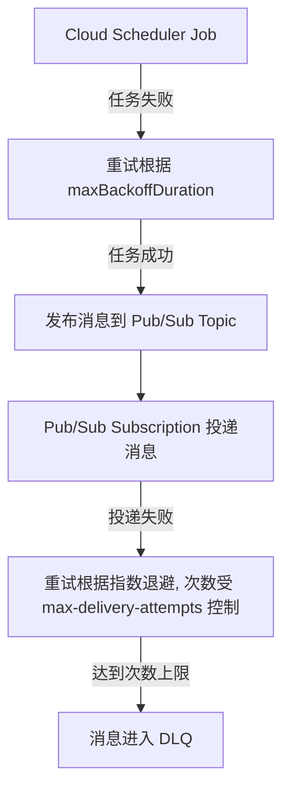

- [Summary](#summary)
- [**max-delivery-attempts** **与** **maxBackoffDuration** **的关系与区别**](#max-delivery-attempts-与-maxbackoffduration-的关系与区别)
- [`max-delivery-attempts` 与 `maxBackoffDuration` 的关系与区别](#max-delivery-attempts-与-maxbackoffduration-的关系与区别-1)
  - [1. `max-delivery-attempts`（Pub/Sub）](#1-max-delivery-attemptspubsub)
    - [定义与作用](#定义与作用)
    - [工作机制](#工作机制)
    - [与时间的间接关系](#与时间的间接关系)
  - [2. `maxBackoffDuration`（Cloud Scheduler）](#2-maxbackoffdurationcloud-scheduler)
    - [定义与作用](#定义与作用-1)
    - [工作机制](#工作机制-1)
    - [与时间的直接关系](#与时间的直接关系)
  - [3. 两者的关系与区别](#3-两者的关系与区别)
    - [区别](#区别)
    - [关系](#关系)
    - [图示说明](#图示说明)
  - [4. 总结与建议](#4-总结与建议)
- [Pub/Sub 消息投递失败与 `max-delivery-attempts` 的处理机制](#pubsub-消息投递失败与-max-delivery-attempts-的处理机制)
  - [1. 未配置 DLQ 时如何拿到投递失败的消息](#1-未配置-dlq-时如何拿到投递失败的消息)
    - [未配置 DLQ 时的行为](#未配置-dlq-时的行为)
    - [手动拉取积压消息的示例](#手动拉取积压消息的示例)
    - [配置临时 DLQ（建议）](#配置临时-dlq建议)
  - [2. 未配置 DLQ 时消息多久会看不到（生命周期）](#2-未配置-dlq-时消息多久会看不到生命周期)
    - [消息保留期限](#消息保留期限)
    - [订阅积压与消息不可见](#订阅积压与消息不可见)
  - [3. 什么情况会导致 Pub/Sub 出现投递失败的消息](#3-什么情况会导致-pubsub-出现投递失败的消息)
    - [1. 订阅者处理失败或超时](#1-订阅者处理失败或超时)
    - [2. 订阅者离线或不可用](#2-订阅者离线或不可用)
    - [3. 消息内容或格式错误](#3-消息内容或格式错误)
    - [4. Pub/Sub 配置问题](#4-pubsub-配置问题)
    - [5. 资源限制或负载过高](#5-资源限制或负载过高)
    - [6. 网络问题](#6-网络问题)
    - [示例场景](#示例场景)
  - [4. 总结与建议](#4-总结与建议-1)

# Summary

Job 的 maxBackoffDuration with pubsub subscriptions `maxBackoffDuration` 没有直接关系

# **max-delivery-attempts** **与** **maxBackoffDuration** **的关系与区别**

# `max-delivery-attempts` 与 `maxBackoffDuration` 的关系与区别

感谢您的提问！您提到 Google Cloud Pub/Sub 中的 `max-delivery-attempts` 参数（用于控制消息进入死信队列 DLQ 的时机）以及 Google Cloud Scheduler 中的 `maxBackoffDuration` 参数（用于控制调度任务的重试间隔）。这两个参数虽然都与重试机制相关，但它们属于不同的服务，适用于不同的场景，之间没有直接的关联关系。

在本回答中，我将详细解释这两个参数的作用、适用场景以及它们之间是否存在联系，帮助您更清晰地理解它们的区别与应用。

---

## 1. `max-delivery-attempts`（Pub/Sub）

### 定义与作用

- **位置**：`max-delivery-attempts` 是 `gcloud pubsub subscriptions` 命令中的一个参数，用于配置 Pub/Sub 订阅的死信队列（DLQ）策略。
- **功能**：指定消息投递失败的最大尝试次数。当订阅者未能在指定次数内成功确认（ACK）消息时，消息将被转发到指定的 DLQ 主题。
- **时间相关性**：虽然参数本身是“次数”而非“时间”，但每次投递尝试之间会有一个基于指数退避（exponential backoff）的延迟间隔，延迟时间逐渐增加（从几秒到几分钟不等），直到达到最大尝试次数。
- **典型值**：通常设置为 `5` 或更高，避免因临时问题导致消息过早进入 DLQ。
- **命令示例**：
    ```bash
    gcloud pubsub subscriptions update my-subscription \
      --dead-letter-topic=my-dlq-topic \
      --max-delivery-attempts=5
    ```

### 工作机制

1. 订阅者未能在 `ackDeadlineSeconds` 时间内确认消息，投递被视为失败。
2. Pub/Sub 根据指数退避策略等待一段时间后重试投递。
3. 如果重试次数达到 `max-delivery-attempts` 指定的值，消息将被转发到 DLQ。

### 与时间的间接关系

`max-delivery-attempts` 本身不直接控制时间，而是控制尝试次数。但由于每次重试之间的间隔时间是动态的（基于指数退避），总的重试时间可能从几秒到几小时不等。例如，如果设置为 `5` 次尝试，总耗时可能在几分钟到十几分钟之间，具体取决于 `ackDeadlineSeconds` 和指数退避的延迟。

---

## 2. `maxBackoffDuration`（Cloud Scheduler）

### 定义与作用

- **位置**：`maxBackoffDuration` 是 Cloud Scheduler 中任务（job）配置的一个参数，通常在 `gcloud scheduler jobs describe` 输出中可见，或通过 `gcloud scheduler jobs create/update` 设置。
- **功能**：指定任务失败重试时，指数退避策略的最大间隔时间（即重试等待时间的上限）。当任务执行失败时，Scheduler 会根据指数退避策略逐渐增加重试间隔，直到达到 `maxBackoffDuration` 设置的值为止。
- **时间相关性**：这是一个明确的时间参数，单位为秒（例如 `3600s` 表示 1 小时）。
- **典型值**：默认值通常为 `3600s`（1 小时），可以根据任务需求调整。
- **命令示例**（设置任务时）：
    ```bash
    gcloud scheduler jobs create http my-job \
      --schedule="every 5 minutes" \
      --uri="https://example.com/endpoint" \
      --max-backoff-duration=1800s
    ```

### 工作机制

1. Cloud Scheduler 任务执行失败时（例如目标 HTTP 端点返回非 2xx 状态码），任务会进入重试状态。
2. 重试间隔从一个较小的值开始（例如几秒），根据指数退避策略逐渐增加。
3. 间隔时间增长到 `maxBackoffDuration` 指定的值后，将不再增加，而是保持在这个最大间隔进行重试（直到达到总重试次数上限 `maxRetryCount`，如果设置了的话）。
4. 如果任务持续失败且达到重试上限（由 `maxRetryCount` 控制，默认无上限），任务将被标记为失败。

### 与时间的直接关系

`maxBackoffDuration` 是一个明确的时间参数，直接控制每次重试之间的最大等待时间。它影响任务失败后的重试节奏，但不决定重试总次数或总时长（总时长还取决于 `maxRetryCount` 或任务的调度频率）。

---

## 3. 两者的关系与区别

### 区别

- **所属服务**：
    - `max-delivery-attempts` 属于 Google Cloud Pub/Sub，用于消息订阅的投递重试机制。
    - `maxBackoffDuration` 属于 Google Cloud Scheduler，用于调度任务的失败重试机制。
- **参数类型**：
    - `max-delivery-attempts` 是次数（count），决定重试次数上限。
    - `maxBackoffDuration` 是时间（duration），决定重试间隔时间的上限。
- **适用场景**：
    - `max-delivery-attempts` 适用于消息队列中订阅者处理消息失败的场景，控制消息是否进入 DLQ。
    - `maxBackoffDuration` 适用于定时任务失败的场景，控制任务重试的节奏。
- **时间控制方式**：
    - `max-delivery-attempts` 间接影响总重试时间（通过指数退避的隐式延迟）。
    - `maxBackoffDuration` 直接定义每次重试之间的最大时间间隔。

### 关系

- **无直接关联**：这两个参数之间没有直接的关联，它们服务于不同的 Google Cloud 产品和场景。即使您的 Cloud Scheduler 任务的目标是发布消息到 Pub/Sub 主题（例如通过 HTTP 请求触发 Pub/Sub 发布），两者的重试机制也是独立运作的。
- **可能的间接联系**：
    - **场景结合**：如果您使用 Cloud Scheduler 定时触发一个任务，而该任务的目标是发布消息到 Pub/Sub 主题或处理 Pub/Sub 消息，那么 Scheduler 的任务失败重试（受 `maxBackoffDuration` 控制）和 Pub/Sub 的消息投递重试（受 `max-delivery-attempts` 控制）可能在业务流程上形成上下游关系。
        - 例如，Scheduler 任务失败时会根据 `maxBackoffDuration` 重试任务，而任务成功后触发的 Pub/Sub 消息投递失败时会根据 `max-delivery-attempts` 决定是否进入 DLQ。
    - **指数退避策略相似**：两者都采用指数退避策略来管理重试节奏（即失败后逐渐增加重试间隔），但实现细节和参数控制方式不同。

### 图示说明

以下是一个简单的流程图，使用 Mermaid 格式展示两者在结合场景中的独立性和潜在上下游关系：



- Cloud Scheduler 的 `maxBackoffDuration` 控制任务重试间隔（A 到 B）。
- Pub/Sub 的 `max-delivery-attempts` 控制消息投递重试次数（D 到 E 到 F）。
- 两者在流程上可能有上下游关系（任务触发消息发布），但参数本身无直接关联。

---

## 4. 总结与建议

- **无直接关联**：`max-delivery-attempts` 和 `maxBackoffDuration` 属于不同服务（Pub/Sub 和 Scheduler），参数之间没有直接联系，前者控制次数，后者控制时间。
- **独立运作**：即使在业务流程中两者可能串联（例如 Scheduler 任务触发 Pub/Sub 消息发布），它们的重试机制也是独立运作的。
- **配置建议**：
    - 对于 Pub/Sub 的 `max-delivery-attempts`，建议根据消息处理的复杂性和订阅者的可靠性设置一个合理的次数（例如 `5` 到 `10`），避免消息因临时故障过早进入 DLQ。
    - 对于 Scheduler 的 `maxBackoffDuration`，建议根据任务的重要性和失败恢复时间需求设置一个合适的最大间隔（例如 `1800s` 或 `3600s`），避免重试过于频繁或间隔过长。
- **监控与调试**：建议为 Pub/Sub 的 DLQ 和 Scheduler 的任务失败设置监控告警，以便及时发现问题。

如果您有具体的业务场景（例如 Scheduler 任务与 Pub/Sub 消息处理的结合），或者希望进一步探讨如何优化重试策略，请分享更多细节，我会提供更具针对性的建议！

# Pub/Sub 消息投递失败与 `max-delivery-attempts` 的处理机制

对于对于 Pub/Sub 的 max-delivery-attempts 我有办法拿到这些投递失败的消息么?目前我没有配置 DLQ 的情况下,这些消息多久会看不到.还是会一直在队列里面,什么情况回造成 PUB SUB 出现类似这种投递失败的消息?

感谢您的提问！关于 Google Cloud Pub/Sub 中的 `max-delivery-attempts` 参数以及投递失败的消息处理，我将详细解答您的问题，包括如何获取投递失败的消息、在未配置 DLQ 的情况下消息的生命周期、以及导致投递失败的常见原因。

---

## 1. 未配置 DLQ 时如何拿到投递失败的消息

在未配置死信队列（DLQ）的情况下，如果消息投递失败次数达到 `max-delivery-attempts` 的上限，Pub/Sub **不会将消息转发到任何 DLQ 主题**，但这并不意味着消息会立即消失或被删除。以下是具体情况及如何获取这些消息：

### 未配置 DLQ 时的行为

- 如果订阅未配置 DLQ（即未设置 `--dead-letter-topic`），即使设置了 `max-delivery-attempts`，Pub/Sub 在达到最大尝试次数后 **不会将消息移动到其他地方**，而是继续保留在订阅的队列中。
- Pub/Sub 会停止尝试投递该消息给订阅者（即不再进行重试），但消息仍会保留在订阅的消息积压（backlog）中，直到消息的保留期限（retention period）到期。
- 您可以通过其他方式查看或处理这些消息，例如：
    - **手动拉取消息**：如果订阅是 Pull 模式，您可以使用 `gcloud pubsub subscriptions pull` 命令或 Pub/Sub API 手动拉取积压的消息。
    - **订阅者重试**：如果订阅者重新上线或修复了问题，可以重新处理积压的消息（需确保 `ackDeadlineSeconds` 足够长）。
    - **监控积压**：通过 Google Cloud Monitoring 查看订阅的积压消息数量（`subscription/backlog_bytes` 或 `subscription/num_undelivered_messages` 指标），以便了解是否有大量投递失败的消息。

### 手动拉取积压消息的示例

假设您有一个订阅 `my-subscription`，可以尝试手动拉取消息以查看投递失败的消息：

```bash
gcloud pubsub subscriptions pull my-subscription \
  --auto-ack=false \
  --limit=10
```

- `--auto-ack=false`：避免自动确认消息，以便您检查内容后决定是否确认。
- `--limit=10`：限制拉取的消息数量。

如果您确认这些消息需要处理，可以在检查后手动确认：

```bash
gcloud pubsub subscriptions ack my-subscription \
  --ack-ids=<ack-id-1>,<ack-id-2>,...
```

### 配置临时 DLQ（建议）

如果您希望明确隔离投递失败的消息，强烈建议为订阅配置 DLQ。即使是临时配置，也可以通过以下步骤实现：

1. 创建一个 DLQ 主题：
    ```bash
    gcloud pubsub topics create my-dlq-topic
    ```
2. 更新订阅以使用 DLQ：
    ```bash
    gcloud pubsub subscriptions update my-subscription \
      --dead-letter-topic=my-dlq-topic \
      --max-delivery-attempts=5
    ```
3. 为 DLQ 主题创建一个订阅以查看死信消息：
    ```bash
    gcloud pubsub subscriptions create my-dlq-subscription \
      --topic=my-dlq-topic
    ```
4. 拉取 DLQ 订阅的消息：
    ```bash
    gcloud pubsub subscriptions pull my-dlq-subscription \
      --auto-ack=false \
      --limit=10
    ```

通过这种方式，您可以明确分离并查看投递失败的消息，而无需担心它们在原订阅中被覆盖或丢失。

---

## 2. 未配置 DLQ 时消息多久会看不到（生命周期）

在 Pub/Sub 中，消息的可见性及保留时间受 **消息保留期限（message retention duration）** 和 **订阅积压（backlog）** 机制的影响。以下是未配置 DLQ 时投递失败消息的生命周期：

### 消息保留期限

- Pub/Sub 主题（Topic）有一个可配置的 `messageRetentionDuration` 参数，定义了消息在主题中的最长保留时间，默认值为 **7 天**。我们的配置是 604800s
- 即使消息投递失败且未被确认（ACK），只要未达到保留期限，消息仍会保留在主题中，并可能继续存在于订阅的积压中。
- 查看主题的保留期限：
    ```bash
    gcloud pubsub topics describe my-topic
    ```
    输出中会包含类似 `messageRetentionDuration: 604800s` 的字段（表示 7 天）。
- 如果需要延长保留期限，可以更新主题配置：
    ```bash
    gcloud pubsub topics update my-topic \
      --message-retention-duration=14d
    ```

### 订阅积压与消息不可见

- 如果投递失败的消息未被确认，且达到 `max-delivery-attempts`（配置了的情况下），Pub/Sub 会停止尝试投递，但消息仍然存在于订阅的积压中。
- 消息不会“消失”，但如果积压的消息数量过多，新的消息可能会覆盖旧的消息（取决于订阅的处理能力和积压大小）。不过，Pub/Sub 的积压存储能力非常大，通常不会因为积压导致消息丢失。
- 消息真正“看不到”的时间取决于：
    1. **主题的 `messageRetentionDuration`**：到期后，消息会被 Pub/Sub 系统自动删除，无论是否被确认。
    2. **订阅者是否处理积压**：如果订阅者长时间不处理积压消息，旧消息可能在到期前一直不可见（但仍存在）。
- 因此，未配置 DLQ 的情况下，消息不会一直在队列中“无限期”存在，最长存在时间由 `messageRetentionDuration` 决定，默认是 7 天。

---

## 3. 什么情况会导致 Pub/Sub 出现投递失败的消息

投递失败通常是指订阅者未能在指定时间内确认（ACK）消息，导致 Pub/Sub 将其视为失败并进行重试。以下是常见导致投递失败的原因：

### 1. 订阅者处理失败或超时

- **原因**：订阅者（应用程序）在处理消息时遇到错误（例如代码异常、逻辑错误），未能调用 `acknowledge` 方法确认消息。
- **解决建议**：在订阅者代码中添加异常处理，确保即使处理失败也能记录日志并决定是否确认消息。如果消息不需要重试，可以显式确认；如果需要重试，可以不确认，允许 Pub/Sub 自动重试。
- **与 `ackDeadlineSeconds` 的关系**：如果 `ackDeadlineSeconds` 设置过短（例如默认 10 秒），而订阅者处理时间较长（例如 30 秒），会导致即使处理成功也未能及时确认，Pub/Sub 认为投递失败。

### 2. 订阅者离线或不可用

- **原因**：订阅者应用程序宕机、网络中断或未运行，导致 Pub/Sub 无法投递消息（Push 模式）或订阅者未主动拉取消息（Pull 模式）。
- **解决建议**：确保订阅者高可用，例如通过 Kubernetes 部署多个副本，并设置监控告警以便及时发现订阅者不可用的问题。

### 3. 消息内容或格式错误

- **原因**：消息的内容或元数据（如属性）不符合订阅者的预期，导致订阅者拒绝处理并故意不确认（例如消息缺少必要字段）。
- **解决建议**：发布者应确保消息格式正确，并与订阅者约定一致；订阅者可以记录无效消息并确认（避免重试），或者配置 DLQ 隔离无效消息。

### 4. Pub/Sub 配置问题

- **原因**：
    - `ackDeadlineSeconds` 设置过短，订阅者来不及处理。
    - Push 订阅的端点配置错误（例如目标 URL 不可达或返回非 2xx 状态码）。
- **解决建议**：检查订阅配置，确保 `ackDeadlineSeconds` 足够长（例如设置为 `60s` 或更长）；验证 Push 端点的可用性及状态码返回。

### 5. 资源限制或负载过高

- **原因**：订阅者处理能力不足（例如 CPU/内存不足、并发限制），导致无法及时处理消息；或者 Pub/Sub 推送速率过高，订阅者处理不过来。
- **解决建议**：增加订阅者实例或处理能力，调整 Pub/Sub 的流控参数（例如 `maxOutstandingMessages` 和 `maxOutstandingBytes`）以限制投递速率。

### 6. 网络问题

- **原因**：订阅者与 Pub/Sub 之间的网络延迟或中断，导致 Push 模式投递失败或 Pull 模式无法拉取消息。
- **解决建议**：确保网络稳定，考虑在订阅者端实现重试逻辑，或使用 DLQ 隔离失败消息以便后续处理。

### 示例场景

假设一个订阅的 `ackDeadlineSeconds` 为 10 秒，订阅者处理消息时因代码异常崩溃，未确认消息：

1. Pub/Sub 在 10 秒后未收到确认，认为投递失败。
2. 根据指数退避策略，Pub/Sub 在稍后（例如 20 秒）重试投递。
3. 如果订阅者仍未恢复，投递继续失败，直到达到 `max-delivery-attempts`（如果设置了）。
4. 未配置 DLQ 时，消息留在积压中；配置了 DLQ 时，消息进入 DLQ 主题。

---

## 4. 总结与建议

- **如何拿到投递失败的消息**：
    - 未配置 DLQ 时，消息仍在订阅积压中，可以通过 `gcloud pubsub subscriptions pull` 或 API 手动拉取查看。
    - 建议配置 DLQ，将投递失败的消息隔离到独立主题中，便于查看和处理。
- **消息多久会看不到**：
    - 未配置 DLQ 时，消息不会主动消失，最长保留时间由主题的 `messageRetentionDuration` 决定（默认 7 天）。
    - 消息可能因积压未被处理而“不可见”，但仍在系统中，直到到期删除。
- **导致投递失败的原因**：
    - 订阅者处理失败、超时或离线。
    - 消息内容错误、配置不当、资源限制或网络问题。
- **最佳实践建议**：
    1. **配置 DLQ**：为订阅配置死信队列，隔离投递失败消息，便于后续分析和处理。
    2. **设置合理的 `ackDeadlineSeconds`**：确保确认截止时间足够长，匹配订阅者的处理能力。
    3. **监控积压消息**：通过 Google Cloud Monitoring 监控订阅的积压消息数量（`subscription/num_undelivered_messages`），及时发现投递失败问题。
    4. **日志与告警**：在订阅者代码中记录处理失败的详细日志，并配置告警以便及时响应。

如果您有具体的场景（例如订阅者代码或 Pub/Sub 配置），或者希望进一步探讨如何处理投递失败的消息，请分享更多细节，我会提供更具针对性的建议!