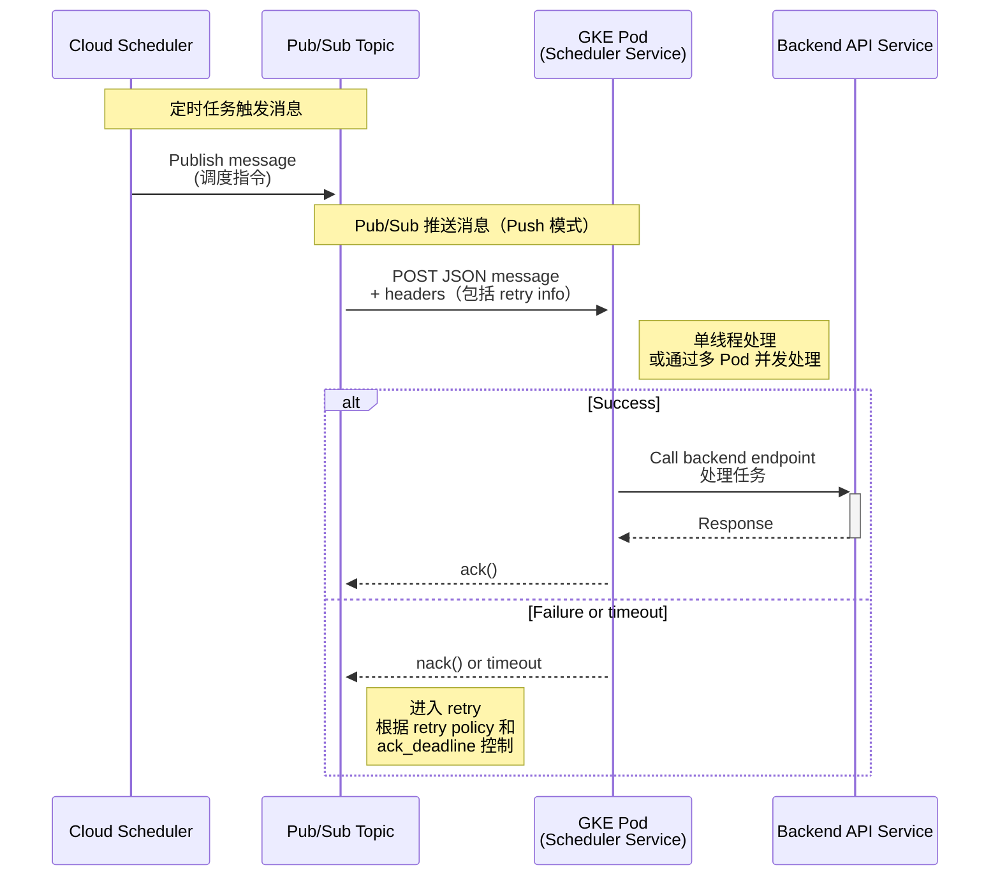
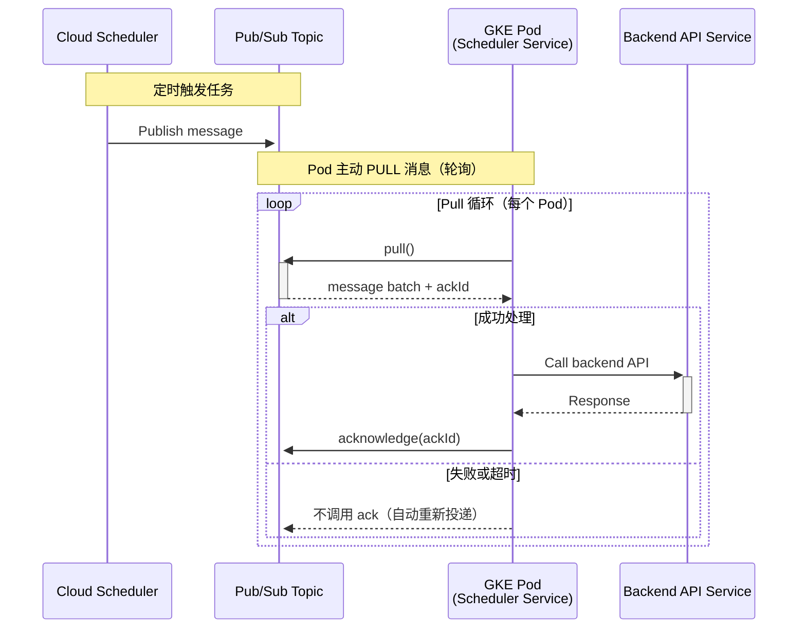

(1) 详细解释 Pub/Sub 的核心概念和端到端延迟分段，以定位瓶颈：
(a) 查找 `ackDeadlineSeconds` 的官方定义，明确其计时起点（从 Pub/Sub 将消息成功投递给订阅者客户端开始）和终点（订阅者客户端发送确认 ack 之前）。
(b) 将整个流程分解为可度量的延迟阶段：1. Cloud Scheduler 触发到 Pub/Sub 发布；2. 消息在 Pub/Sub 中排队等待投递；3. Pub/Sub 投递到 Schedule Service 接收；4. Schedule Service 内部处理（解析消息、调用后端）；5. 后端服务处理并响应；6. Schedule Service 发送 ack。利用 `publish_to_ack_delta` 和 `pull_to_ack_delta` 指标分析整体和客户端处理延迟。

(2) 深入分析 Schedule Service 的性能瓶颈和设计缺陷：
(a) 调查 Schedule Service 的 Pub/Sub 客户端库实现，确定其消息处理是单线程还是多线程。搜索相关语言（如 Java, Go, Python）的 Pub/Sub 客户端并发配置最佳实践。
(b) 分析同步处理模式的弊端：当前“接收 -> 调用后端 -> 等待响应 -> 确认”的模式下，后端服务的缓慢或失败会直接阻塞消息处理线程，导致无法处理新消息，从而引发 `unacked_messages` 积压。
(c) 评估当前的重试策略（间隔 0s, 10s, 20s）：分析该策略在后端服务持续不可用时，如何长时间占用处理线程，并加剧同一 Topic 下其他任务的延迟。

(3) 提供针对 Schedule Service 的详细优化配置和最佳实践方案：
(a) 查找并提供关于如何为 Pub/Sub 订阅者配置并发处理（增加处理线程数）的具体指南。
(b) 搜索并提出异步处理架构的建议，例如“快速确认”模式：服务接收到消息后，先将其存入内部队列或数据库，并立即 ack 消息，然后由另外的工作线程异步调用后端服务。这能将 Pub/Sub 消费与后端调用解耦。
(c) 查找关于超时设置的最佳实践：建议在 Schedule Service 的 HTTP 客户端中设置一个远小于 `ackDeadlineSeconds` 和 Kong 超时（6分钟）的请求超时，以便在后端无响应时能快速失败并进行重试或错误处理。
(d) 搜索并推荐更优的重试机制，如使用带“抖动”（Jitter）的指数退避策略，并探讨使用 Pub/Sub 的死信队列（Dead-Letter Queue）来处理最终失败的消息，而不是在服务内部无限重试。

(4) 分析外部依赖（Kong 网关和 Backend Service）可能引入的问题：
(a) 分析 Kong 的 6 分钟超时设置如何与 Schedule Service 的 `ackDeadlineSeconds` 相互作用，指出过长的后端处理时间是导致消息积压的直接原因。
(b) 调查 Backend Service 的性能表现，包括检查其自身的延迟、错误率指标，以及其 HPA（水平 Pod 自动扩缩）配置是否合理、是否在负载增加时有效触发了扩容。

(5) 识别并解决因共享 Pub/Sub Topic 带来的“吵闹邻居”问题：
(a) 搜索关于 Pub/Sub 多租户场景下的设计模式，解释共享 Topic 的风险：单个团队（租户）的后端服务出现问题，会拖慢整个消息流，影响所有其他团队。
(b) 提出解决方案：建议的长期方案是为每个团队或服务隔离使用独立的 Topic。短期方案则是在 Schedule Service 内部实现基于消息属性（例如 `team_id`）的路由和资源隔离，例如为不同团队分配不同的处理线程池，防止交叉影响。

(6) 总结并提供一份完整的系统性排查和优化清单：
(a) 整合上述分析，形成一份从监控指标入手，到代码逻辑、再到架构设计的完整排查步骤。
(b) 查找关于 Pub/Sub 订阅者流控制（Flow Control）的配置，如 `maxOutstandingMessages` 和 `maxOutstandingBytes`，并解释如何通过调整这些参数来防止客户端被突发流量压垮，从而稳定处理速率。

当然可以。根据你最近的问题内容，你的 Pub/Sub 使用场景大致包括：

- 由 **Cloud Scheduler** 触发某个 **Pub/Sub Topic**
    
- 消息被推送到一个 **GKE Deployment**（我们可以叫它 Scheduler Service）
    
- 该 Deployment 处理完消息后，调用某个 **Backend API**
    
- 你还提到每秒 ack_message_count、send_message_count、单线程消费，以及通过多 Pod 并发处理来减少积压
    
- 你也分析了 delivery metrics，例如 oldest_unacked_message_age 等
    

  

描述整个 Pub/Sub 调度和处理流程：Push


pull 
---

# 针对GCP Pub/Sub消息积压的全栈式诊断与优化架构报告

## 第1节：当前架构与性能瓶颈分析

本报告旨在对您当前基于Google Cloud Platform (GCP) 的调度任务处理系统进行一次全面而深入的诊断。当前系统观察到的核心问题是Google Cloud Pub/Sub订阅中的消息积压，具体表现为`unacked_messages_by_region`指标的持续性堆积。此问题表明消费者（即`Schedule Service`）的处理能力远低于消息的发布速率，导致了显著的端到端延迟。本节将首先解构完整的消息生命周期，随后深入分析关键延迟指标，并最终定位导致性能瓶NE颈的根本架构缺陷。

### 1.1. 解构端到端消息生命周期

为了精确地定位延迟源头，必须首先清晰地描绘出一条消息从创建到最终确认的全过程。您当前的系统架构涉及多个独立的组件，每个组件都为总延迟贡献了一部分时间。

以下是消息在您系统中的完整旅程：

- 阶段1：源起 (Cloud Scheduler)
    
    用户通过gcloud scheduler jobs定义的调度任务在预定时间被触发。这是整个工作流的起点。
    
- 阶段2：发布 (Pub/Sub)
    
    Cloud Scheduler作为发布者（Publisher），将一个包含任务载荷的消息发布到您指定的、由多个团队共享的Pub/Sub主题（Topic）1。
    
- 阶段3：投递 (Pub/Sub to Schedule Service)
    
    Pub/Sub服务将该消息从主题推送（Push）到一个或多个订阅了该主题的Schedule Service实例3。
    
    **关键点：** 从Pub/Sub成功将消息投递到您的`Schedule Service`那一刻起，该消息的`ackDeadline`（确认截止时间）计时器正式开始计时。
    
- 阶段4：同步处理 (Schedule Service)
    
    部署在Google Kubernetes Engine (GKE) 上的Schedule Service实例在其某个处理线程中接收到该HTTP Push请求。服务开始解析消息内容，提取所需信息，并构建一个准备发往后端服务的HTTP请求。
    
- 阶段5：下游通信 (Schedule Service -> Kong -> Backend Service)
    
    Schedule Service使用HTTP客户端（如cURL或库）通过Kong API网关，向Backend Service发起一个阻塞式的HTTP调用。这是系统中最关键的潜在延迟点，因为处理线程在此刻被完全占用，等待下游响应。
    
- 阶段6：内部重试逻辑 (Schedule Service)
    
    如果对Backend Service的调用失败（例如，由于网络问题、后端服务不可用或Kong超时），Schedule Service内部的RetryTemplate机制被激活。根据您描述的配置（0秒、10秒、20秒的间隔），该处理线程将进入一个“休眠-重试”循环，进一步延长了对当前消息的持有时间，并在此期间完全阻塞。
    
- 阶段7：确认 (Acknowledgment)
    
    只有在Backend Service成功返回响应（或内部重试次数耗尽并最终失败）后，Schedule Service才会向Pub/Sub发送确认回执。在Push订阅模式下，这通常是通过向上游的Pub/Sub投递请求返回一个HTTP 2xx状态码来隐式完成的5。如果
    
    `Schedule Service`在`ackDeadline`内未能返回成功的HTTP状态码，Pub/Sub会认为消息处理失败3。
    
- 阶段8：重新投递 (Redelivery)
    
    如果在可配置的ackDeadline内，Pub/Sub没有收到来自Schedule Service的成功确认，它会假定消费者已经崩溃或处理失败。因此，Pub/Sub会将同一条消息重新投递给订阅中的另一个可用消费者实例，从而导致消息的重复处理3。
    

### 1.2. 延迟分解与关键指标解读

您的监控指标提供了诊断问题的直接证据。通过将这些指标映射到上述生命周期的各个阶段，我们可以精确地量化瓶颈所在。

#### 1.2.1. 深入理解 `ackDeadlineSeconds`

在深入分析指标之前，必须澄清一个核心概念：`ackDeadlineSeconds`（确认截止时间）。

`ackDeadlineSeconds`是您在创建或更新Pub/Sub**订阅**时可以配置的一个属性。它定义了从Pub/Sub将一条消息**投递**给您的订阅者（即`Schedule Service`）开始，到订阅者必须**确认**（Acknowledge, `ack`）该消息之间的时间窗口3。

- **计时起点**：消息成功通过网络到达您的`Schedule Service` Pod。
    
- **计时终点**：您的`Schedule Service`成功处理消息，并向Pub/Sub的推送请求返回一个成功的HTTP状态码（如200 OK），且Pub/Sub成功处理了该响应。
    
- **配置范围**：该值最小为10秒，最大为600秒（10分钟）8。
    
- **后果**：如果在这个时间窗口内未能成功`ack`，Pub/Sub将认为消息处理失败并会尝试重新投递。
    

一个常见的误区是将`ackDeadlineSeconds`视为一个可以无限调大的“万能解药”，以适应耗时较长的任务。然而，这是一种反模式。虽然一个较长的截止时间可以防止因处理时间略长而被过早重投，但它也带来了严重弊端：如果一个消息确实处理失败（例如，消费者进程崩溃），系统将不得不等待整个漫长的`ackDeadline`耗尽后，才能将该消息重新投递给一个健康的消费者，从而造成不必要的处理延迟9。现代的Pub/Sub高级客户端库通过一种称为“租约管理”（Lease Management）的特性解决了这个问题，它们会自动在后台为正在处理的消息延长租约，从而动态管理确认时限，而不是依赖一个固定的、一刀切的静态值9。您当前架构的问题，正是由于其处理模式的缺陷，使得系统对这个静态截止时间变得异常敏感。

#### 1.2.2. 解读您的性能指标

- `publish_to_ack_delta` (650秒): 这个指标衡量的是从消息被发布到Topic，到它最终被消费者确认的**端到端总延迟**4。650秒的惊人时长（超过10分钟）清晰地表明，整个系统存在着极其严重的延迟。
    
- `pull_to_ack_delta` (520秒): 这个指标更为关键，它隔离了**消费者内部的处理延迟**，即从`Schedule Service`拉取（或接收）到消息，到它最终完成确认的耗时4。这个值高达520秒，并且与端到端延迟（650秒）非常接近。这无可辩驳地证明了，绝大部分的延迟（
    
    `520 / 650 ≈ 80%`）都发生在您的`Schedule Service`内部以及它所依赖的下游服务中。Pub/Sub本身的投递延迟（`650 - 520 = 130`秒）虽然也存在，但并非主要矛盾。
    
- `oldest_unacked_message_age` (450秒): 该指标显示，在当前所有已被投递但尚未确认的消息中，最“老”的一条已经“悬挂”了450秒（7.5分钟）。这提供了“铁证”，直接指向一个或多个`Schedule Service`的处理线程被长时间卡住或处理速度极其缓慢。这个卡住的线程，正是导致消息积压的直接原因。
    
- `unacked_messages_by_region` (23条): 这是问题的最终表现形式——积压。它代表了有23条消息已经被Pub/Sub投递出去，但由于消费者处理不过来，它们正占用着处理槽位，等待被确认。这个数字是`pull_to_ack_delta`过高所导致的直接后果。
    
- `publish_message_count` (2.00/秒) vs. `ack_message_count` (1.75/秒): 发布速率持续高于确认速率，这是消息积压的数学证明。系统每秒钟净增加`2.00 - 1.75 = 0.25`条未确认消息，不断加剧`unacked_messages_by_region`的堆积。
    

下表将这些指标与您的系统流程清晰地对应起来：

**表 1.2.1: 延迟指标与消息生命周期的映射**

|指标名称 (Metric Name)|描述|在您系统中的具体含义|典型问题指示|
|---|---|---|---|
|`publish_message_count`|向Topic发布消息的速率。|Cloud Scheduler触发任务并发布到共享Topic的频率。|-|
|`send_message_count`|Pub/Sub向订阅者发送消息的速率。|Pub/Sub向您的`Schedule Service`实例推送消息的频率。|-|
|`ack_message_count`|成功确认消息的速率。|`Schedule Service`成功处理完后端调用并返回2xx状态码的频率。|**确认速率低于发布速率是积压的根本原因。**|
|`oldest_unacked_message_age`|最老一条未确认消息的年龄。|某个`Schedule Service`线程处理一条消息已经花费的时间。**高值（450s）表明线程被严重阻塞。**|消费者处理逻辑耗时过长、线程阻塞、下游服务无响应。|
|`unacked_messages_by_region`|未被确认的消息总数。|已投递给`Schedule Service`但尚未处理完成的消息队列。**这是您观察到的积压现象。**|消费能力不足，处理流程存在瓶颈。|
|`pull_to_ack_delta`|从拉取到确认的耗时。|`Schedule Service`从接收到消息到完成确认的总处理时间。**高值（520s）表明瓶颈在消费者侧。**|业务逻辑复杂、同步调用下游服务缓慢、内部重试阻塞。|
|`publish_to_ack_delta`|从发布到确认的总耗时。|从Cloud Scheduler触发到`Schedule Service`完成确认的完整端到端延迟。**高值（650s）表明整个系统响应缓慢。**|整个处理链路中存在一个或多个严重延迟环节。|

### 1.3. 定位主要瓶颈：同步“处理后确认”的反模式

综合以上分析，问题的根源并非Pub/Sub本身，也不是网络延迟，而是您的`Schedule Service`所采用的一种架构性反模式：**同步的“处理后确认”（Process-then-Ack）模型**。

- **阻塞式消费者的问题**: 您当前的设计将消息的接收、对下游`Backend Service`的调用、潜在的多次重试以及最终的`ack`操作，全部捆绑在一个同步的、线性的执行流程中。这意味着，`Schedule Service`中处理该消息的线程，其生命周期被下游`Backend Service`和Kong的性能与可用性完全“绑架”了2。当
    
    `Backend Service`响应缓慢时，该线程就被迫等待，无法处理订阅中的任何其他新消息，造成了“队头阻塞”（Head-of-Line Blocking）。
    
- **重试逻辑的“死亡螺旋”**: 您内部的`RetryTemplate`（间隔0s, 10s, 20s）极大地加剧了这个问题。当一次下游调用失败后，该线程不仅要承受HTTP请求本身的超时，还要额外地、同步地等待`10 + 20 = 30`秒。在这整个过程中，它完全是空闲等待，却占用了宝贵的处理资源。更糟糕的是，如果与Kong的6分钟超时结合，一次失败的消息处理可能导致一个线程被锁定长达`3次重试 * (6分钟超时 + 等待时间)`，这对于一个高吞吐的消息系统来说是致命的。这正是`oldest_unacked_message_age`高达450秒的直接原因：一个线程被一个“坏”消息卡住，无法自拔。
    
- **超时配置的错位**: 整个调用链的超时设置缺乏协调。`Schedule Service`的HTTP客户端似乎没有设置一个比Kong更短的超时时间，导致它被动地等待Kong的6分钟超时。这种被动等待是资源浪费，并且使得故障恢复周期变得不可预测和过长。
    

总而言之，您当前面临的并非一个简单的参数调优问题，而是一个由消费者服务的设计缺陷所引发的系统性性能瓶颈。接下来的章节将提供一系列从战术优化到战略重构的解决方案，以彻底解决此问题。

## 第2节：`Schedule Service`的战术性优化

要解决消息积压问题，首要任务是将`Schedule Service`从当前的瓶颈转变为一个高吞吐、高弹性的现代化消费者。本节将提供一系列具体的、可操作的战术优化方案，包括代码级别的并发配置、架构模式的改进以及健壮的错误处理机制。

### 2.1. 实现高吞吐并发处理

您描述的`Schedule Service`行为强烈暗示了其消息处理可能是单线程或低并发的。默认的Pub/Sub客户端库配置通常较为保守，需要显式配置才能发挥多核处理器的优势，实现真正的并行处理10。

#### 2.1.1. Java (`spring-cloud-gcp-pubsub` / `google-cloud-pubsub`)

对于Java生态，特别是使用Spring框架的场景，并发控制主要通过配置`Subscriber` bean来实现。核心在于两个参数：并行拉取数和执行器线程池。

- **`setParallelPullCount(int count)`**: 此方法配置`Subscriber`客户端向Pub/Sub服务打开多少个并行的gRPC StreamingPull流。每个流可以独立地拉取消息。增加这个数量可以提高消息的下载带宽，适用于消息量非常大的场景。默认值为110。
    
- **`setExecutorProvider(ExecutorProvider provider)`**: 这是更关键的配置。它定义了用于**执行消息处理回调逻辑**（即您的`MessageReceiver`或`@PubSubListener`注解的方法）的线程池。默认的`ExecutorProvider`线程数可能不足（例如，`5 * CPU核心数`，但可能被其他因素限制）。通过自定义`ExecutorProvider`，您可以精确控制并发度10。
    

**并发计算**: 总的并发处理能力是这两个参数的乘积。例如，设置`setParallelPullCount(2)`和`setExecutorThreadCount(8)`，系统将打开2个消息流，并使用一个包含8个线程的池来处理来自这两个流的消息，总共能并行处理8个消息13。

**推荐配置示例 (使用原生`google-cloud-pubsub`库):**

Java

```
import com.google.api.gax.core.ExecutorProvider;
import com.google.api.gax.core.InstantiatingExecutorProvider;
import com.google.cloud.pubsub.v1.MessageReceiver;
import com.google.cloud.pubsub.v1.Subscriber;
import com.google.pubsub.v1.ProjectSubscriptionName;

//...

public Subscriber buildSubscriber() {
    String projectId = "your-gcp-project-id";
    String subscriptionId = "your-subscription-id";
    ProjectSubscriptionName subscriptionName = ProjectSubscriptionName.of(projectId, subscriptionId);

    // 1. 定义消息处理逻辑
    MessageReceiver receiver = (message, consumer) -> {
        //... 您的消息处理代码...
        // 在这里，我们将采用更高级的模式，但暂时保留占位符
        System.out.println("Processing message: " + message.getMessageId());
        // 最终需要调用 consumer.ack() 或 consumer.nack()
        consumer.ack();
    };

    // 2. 配置一个强大的执行器线程池
    // 根据您的GKE Pod的CPU核心数和任务类型（CPU密集型 vs I/O密集型）来调整
    // 对于I/O密集型任务，线程数可以设置为核心数的2-4倍
    ExecutorProvider executorProvider =
        InstantiatingExecutorProvider.newBuilder().setExecutorThreadCount(16).build();

    // 3. 构建Subscriber，并应用并发和流控设置
    Subscriber subscriber =
        Subscriber.newBuilder(subscriptionName, receiver)
           .setParallelPullCount(2) // 打开2个并行流以增加消息获取吞吐
           .setExecutorProvider(executorProvider) // 使用16个线程来处理消息
           .build();
            
    // 在应用启动时调用 subscriber.startAsync().awaitRunning();
    // 在应用关闭时调用 subscriber.stopAsync().awaitTerminated();
    
    return subscriber;
}
```

对于`spring-cloud-gcp-pubsub`，您可以在`application.properties`或`application.yml`中配置这些属性12：

YAML

```
spring:
  cloud:
    gcp:
      pubsub:
        subscriber:
          # 控制并发处理消息的线程数
          executor-threads: 16
          # 控制并行拉取流的数量
          parallel-pull-count: 2
```

#### 2.1.2. Python (`google-cloud-pubsub`)

Python客户端通过在`subscribe()`方法中提供一个自定义的`Scheduler`来控制并发。通常，这个调度器会包装一个`ThreadPoolExecutor`。

- **`concurrent.futures.ThreadPoolExecutor(max_workers=N)`**: 这是Python标准库中的线程池。`max_workers`参数直接决定了可以同时执行消息回调函数的最大线程数13。
    
- **`google.cloud.pubsub_v1.subscriber.scheduler.ThreadScheduler`**: 这是Pub/Sub库提供的、与`ThreadPoolExecutor`适配的调度器。
    

**推荐配置示例:**

Python

```
from concurrent import futures
from google.cloud import pubsub_v1

#...

def process_message_callback(message: pubsub_v1.subscriber.message.Message) -> None:
    print(f"Received message: {message.message_id}")
    #... 您的消息处理代码...
    message.ack()

# 1. 配置一个拥有足够工作线程的执行器
# 对于I/O密集型任务，可以设置比CPU核心数更多的线程
executor = futures.ThreadPoolExecutor(max_workers=16)

# 2. 创建一个基于该执行器的调度器
scheduler = pubsub_v1.subscriber.scheduler.ThreadScheduler(executor)

# 3. 创建Subscriber客户端并使用调度器进行订阅
project_id = "your-gcp-project-id"
subscription_id = "your-subscription-id"
subscriber_client = pubsub_v1.SubscriberClient()
subscription_path = subscriber_client.subscription_path(project_id, subscription_id)

streaming_pull_future = subscriber_client.subscribe(
    subscription_path, 
    callback=process_message_callback,
    scheduler=scheduler
)

print(f"Listening for messages on {subscription_path} with 16 concurrent workers...")

# 保持主线程运行以接收消息
try:
    streaming_pull_future.result()
except TimeoutError:
    streaming_pull_future.cancel()
    streaming_pull_future.result()
```

#### 2.1.3. Go (`cloud.google.com/go/pubsub`)

Go客户端通过`ReceiveSettings`结构体来精细控制并发行为。

- **`sub.ReceiveSettings.NumGoroutines`**: 控制客户端库将启动多少个goroutine来从Pub/Sub服务拉取消息。这类似于Java的`parallelPullCount`，用于提高消息获取的并行度13。
    
- **`sub.ReceiveSettings.MaxOutstandingMessages`**: 这是并发控制的核心。它限制了客户端在任何时刻可以持有的、正在被回调函数处理的未确认消息的最大数量。这直接定义了您的并发处理能力13。
    

**推荐配置示例:**

Go

```
package main

import (
	"context"
	"fmt"
	"log"
	"sync/atomic"
	"time"

	"cloud.google.com/go/pubsub"
)

func pullMsgsConcurrently(projectID, subID string) error {
	ctx := context.Background()
	client, err := pubsub.NewClient(ctx, projectID)
	if err!= nil {
		return fmt.Errorf("pubsub.NewClient: %w", err)
	}
	defer client.Close()

	sub := client.Subscription(subID)

	// 1. 配置并发和流控设置
	sub.ReceiveSettings.NumGoroutines = 4      // 使用4个goroutine来拉取消息
	sub.ReceiveSettings.MaxOutstandingMessages = 32 // 最多同时处理32条消息

	log.Printf("Listening for messages on %s with MaxOutstandingMessages=%d...", subID, sub.ReceiveSettings.MaxOutstandingMessages)

	var received int32
	ctx, cancel := context.WithCancel(ctx)

	// 2. 启动接收循环
	err = sub.Receive(ctx, func(ctx context.Context, msg *pubsub.Message) {
		atomic.AddInt32(&received, 1)
		log.Printf("Processing message: %s", msg.ID)
		//... 您的消息处理代码...
		msg.Ack()
	})

	if err!= nil {
		return fmt.Errorf("sub.Receive returned error: %w", err)
	}

	return nil
}
```

### 2.2. 高级流控与租约管理

仅仅增加并发是不够的。一个健壮的消费者还需要能够自我保护，防止在突发流量下被压垮，并能优雅地处理长时间运行的任务。

- **订阅者侧流控 (Subscriber-Side Flow Control)**: 这是消费者的一种**反压**（Back-pressure）机制15。它允许您限制客户端在内存中缓冲的未确认消息的数量和总大小，防止在消息洪峰到来时耗尽内存。
    
    - **`maxOutstandingMessages`**: (所有语言) 如上所述，这不仅是并发控制，也是流控的关键。它限制了在途消息的数量。
        
    - **`maxOutstandingBytes`**: (所有语言) 限制在途消息的总字节数。这对于防止单个大消息或大量小消息耗尽Pod内存至关重要。
        
    - **配置建议**: 将`maxOutstandingMessages`设置为您线程池大小的2-4倍，并根据Pod的内存限制（`resources.limits.memory`）估算一个合理的`maxOutstandingBytes`值。例如，如果每个消息平均10KB，您有1GB内存可用，那么`maxOutstandingBytes`可以设置为`500 * 1024 * 1024`（500MB），为应用本身和其他开销留出余地16。
        
- **自动租约管理 (Automatic Lease Management)**: 这是现代高级客户端库的一个核心优势。当您的处理线程正在处理一条消息时，客户端库会在后台自动定期调用`modifyAckDeadline` API，延长该消息的确认期限9。
    
    - **工作原理**: 只要您的处理线程是活跃的，并且没有被完全阻塞（例如，长时间的`Thread.sleep()`），客户端库就能确保消息的租约不会意外过期。
        
    - **带来的好处**: 您不再需要将订阅的`ackDeadlineSeconds`设置为一个非常大的静态值（如600秒）。您可以将其保持在默认的10秒或一个较小值（如60秒），然后完全依赖客户端的自动租约管理来处理那些偶尔耗时较长的任务。这使得系统在处理正常任务时能快速响应，在处理失败任务时也能快速进入重试流程，实现了两全其美9。
        

### 2.3. 架构重塑：采用“先确认，后异步处理”模式

这是解决您核心瓶颈的最根本、最有效的架构性变革。当前的“处理后确认”模式将Pub/Sub的确认机制与不确定的下游服务处理时间紧密耦合，是问题的根源。**“先确认，后异步处理”（Ack-First, Asynchronous Worker）模式**则彻底解耦了这两者。

模式原理:

该模式的核心思想是，让与Pub/Sub直接交互的消费者（Listener）的职责变得极其单一和轻量：尽快地接收消息，并立即确认，然后将真正的处理工作移交给一个独立的、可靠的内部工作系统6。

**实施步骤**:

1. **轻量级监听器**: Pub/Sub消息监听器（`MessageReceiver`或`@PullSubscription`方法）接收到消息。
    
2. **立即确认 (`ack`)**: 监听器**不执行任何耗时的业务逻辑**。它的第一个动作就是将消息放入一个内部队列，然后**立即调用`consumer.ack()`**。这会立刻告知Pub/Sub：“这条消息我已经安全收到，请不要再投递了”。此举将`pull_to_ack_delta`降至毫秒级别，彻底消除Pub/Sub端的积压。
    
3. **移交工作负载**: 消息的载荷（payload）被放入一个内部工作队列中。
    
4. **异步工作池 (Worker Pool)**: 一个独立的、与Pub/Sub监听器线程池完全隔离的**工作线程池**，从这个内部队列中取出任务并执行真正的业务逻辑（即调用Kong和`Backend Service`）。
    

**内部工作队列的选择**:

- **选项A：内存队列 (In-Memory Queue)**
    
    - **实现**: 使用语言内置的线程安全队列，例如Java的`java.util.concurrent.BlockingQueue`。
        
    - **优点**: 实现简单，速度极快，无外部依赖。
        
    - **缺点**: **数据非持久化**。如果`Schedule Service`的Pod在消息被`ack`但尚未被工作池处理完时崩溃或被重启，这部分数据将**永久丢失**。
        
    - **适用场景**: 适用于那些可以容忍少量数据丢失的、非关键性的调度任务。
        
- **选项B：持久化队列 (Persistent Queue - 推荐)**
    
    - **实现**: 使用一个外部的、轻量级的、持久化的消息队列，**Redis是一个绝佳选择**。可以使用Redis的列表（Lists）数据结构和`LPUSH`/`BRPOP`命令来构建一个可靠的分布式工作队列19。
        
    - **优点**:
        
        - **持久性**: 消息在`ack`后被存入Redis，即使所有`Schedule Service`的Pod都崩溃，任务也不会丢失。当Pod恢复后，可以继续从Redis中拉取任务。
            
        - **分布式协调**: 如果您的`Schedule Service`本身也配置了HPA进行水平扩展，所有实例可以共享同一个Redis队列，天然实现了任务的分布式处理。
            
        - **高可用**: Redis本身可以配置为高可用集群，进一步增强系统可靠性21。
            
    - **缺点**: 引入了一个新的外部依赖（Redis），增加了架构的复杂性和维护成本。
        
    - **适用场景**: 适用于绝大多数生产环境，特别是那些对任务执行的可靠性有较高要求的场景。
        

模式带来的变革:

采纳此模式后，您与Pub/Sub的交互模型发生了根本性的转变。Pub/Sub不再是一个需要您小心翼翼管理其复杂重试和超时逻辑的“工作队列”，而变成了一个极其可靠和高效的“事件投递总线”。所有复杂的、与业务相关的重试、并发控制、错误处理逻辑，都从受Pub/Sub约束的监听器中解放出来，转移到了您完全掌控的内部工作池和队列中。这使得逻辑更清晰、更易于测试和监控。

### 2.4. 在Kubernetes中实现健壮的错误处理与优雅停机

无论采用何种处理模式，当应用运行在像GKE这样的动态环境中时，Pod随时可能因为部署、扩缩容或节点故障而被终止。防止在此过程中丢失正在处理的消息是保障系统可靠性的最后一道防线。特别是当采用“先确认，后异步处理”模式并使用内存队列时，优雅停机（Graceful Shutdown）变得至关重要。

- **问题所在**: 当Kubernetes决定终止一个Pod时，它会向Pod中的所有容器发送一个`SIGTERM`信号。如果应用程序收到信号后立即退出，那么任何正在处理的、或者还在内存队列中等待处理的消息都将丢失23。
    
- 解决方案：优雅停机钩子 (Graceful Shutdown Hooks)
    
    您需要在Schedule Service中实现一个停机钩子，它会在收到SIGTERM信号时触发，并执行一系列清理操作，而不是立即退出。
    
    - **Java**: 使用`Runtime.getRuntime().addShutdownHook(...)`或在Spring中为bean添加`@PreDestroy`注解23。
        
    - **Python**: 使用`signal`模块注册`SIGTERM`信号的处理器。
        
    - **Go**: 监听`os.Signal`通道中的`syscall.SIGTERM`。
        
    
    **优雅停机逻辑步骤**:
    
    1. **停止接收新消息**: 在停机钩子中，第一步是调用Pub/Sub `Subscriber`客户端的`stopAsync()`方法。这将关闭与Pub/Sub的连接，确保不会再有新消息被拉取到这个即将关闭的Pod中26。
        
    2. **等待在途任务完成**: 等待当前正在被工作池（Worker Pool）执行的任务完成。可以调用工作池的`shutdown()`方法（它会拒绝新任务但会完成已在队列中的任务），然后使用`awaitTermination()`并设置一个合理的超时时间来等待26。
        
    3. **处理内部队列**:
        
        - 如果使用的是**持久化队列（Redis）**，则无需特殊处理。因为任务仍在Redis中，其他健康的Pod或重启后的本Pod可以继续处理。
            
        - 如果使用的是**内存队列**，这是最关键的一步。您需要遍历队列中剩余的所有任务。对于这些任务，您有两个选择：
            
            - **重新排队（推荐）**: 将这些任务重新发布回一个专门的“重试”或“待处理”Pub/Sub主题。
                
            - **持久化状态**: 将这些任务的状态写入一个持久化存储（如数据库），并由一个后台进程负责在未来重新调度它们。
                
            - **Nack消息**: 这是一个备选方案，但可能更复杂。在`stopAsync()`之前，快速地将内存队列中的消息取出来并调用`nack()`。但这存在竞态条件，因为在调用`stopAsync()`和`nack()`之间可能仍有消息被`ack`26。
                
    4. **安全退出**: 在所有清理工作完成后，允许应用程序进程正常退出。
        
- Kubernetes配置协同:
    
    为了让您的应用程序有足够的时间执行上述优雅停机逻辑，您必须在GKE的Deployment YAML中配置terminationGracePeriodSeconds。这个值应该大于您预估的最长停机处理时间24。
    
    YAML
    
    ```
    apiVersion: apps/v1
    kind: Deployment
    metadata:
      name: schedule-service
    spec:
      template:
        spec:
          # 设置一个足够长的优雅停机宽限期，例如90秒
          terminationGracePeriodSeconds: 90
          containers:
          - name: schedule-service-container
            image: your-image
            #... 其他配置...
            lifecycle:
              # preStop钩子提供了一个额外的延迟，确保在SIGTERM发送前
              # 负载均衡器已经将Pod从服务中移除，停止新流量进入
              preStop:
                exec:
                  command: ["/bin/sh", "-c", "sleep 20"]
    ```
    
    在这个例子中，当Pod被删除时，Kubernetes会先执行`preStop`钩子，等待20秒。这给了Ingress、Service等组件足够的时间来更新其端点列表。然后，Kubernetes发送`SIGTERM`信号，您的应用将有`90`秒的时间来执行其内部的优雅停机逻辑。
    

通过结合内部的并发优化、架构模式的革新以及与Kubernetes生命周期的深度整合，您的`Schedule Service`将从一个脆弱的瓶颈，演变为一个能够应对生产环境复杂性的、健壮且高效的核心服务。

## 第3节：加固下游生态系统

在对`Schedule Service`进行深度优化后，消息处理的瓶颈将会向下游转移。一个高并发的消费者会像洪水一样，将之前被抑制的请求压力全部释放到`Backend Service`及其前端的Kong网关上。因此，必须同步加固下游生态系统，确保它们能够承受住即将到来的流量冲击，并建立一个全局协调的超时与重试策略。

### 3.1. 优化`Backend Service`及其HPA配置

之前，由于`Schedule Service`的阻塞，您的`Backend Service`可能从未真正经历过高并发的考验，其HPA（Horizontal Pod Autoscaler）配置可能也处于“休眠”状态。现在，必须重新审视并强化它。

- **HPA的角色：被动响应而非主动预测**: 必须明确，HPA是根据**已发生**的负载指标进行响应式扩容，而非预测未来负载28。之前的瓶颈使得
    
    `Backend Service`接收到的流量平缓且稀疏，HPA自然不会触发。优化后的`Schedule Service`将提供一个真实的、脉冲式的负载，这是检验和调优HPA配置的绝佳机会。
    
- **HPA配置最佳实践**:
    
    - **资源请求与限制 (`resources.requests` and `limits`)**: 这是HPA正常工作的**绝对前提**。如果您希望基于CPU或内存利用率进行扩缩容，那么Deployment中**每一个容器**都**必须**定义`resources.requests.cpu`或`resources.requests.memory`。HPA控制器通过以下公式计算利用率：`利用率 = Pod当前实际使用量 / Pod中所有容器的请求量总和`。如果缺少`requests`定义，分母为零，HPA将无法计算指标，导致扩容失败30。
        
        YAML
        
        ```
        # 在您的 Backend Service Deployment 中
        spec:
          template:
            spec:
              containers:
              - name: backend-service-container
                image: your-backend-image
                resources:
                  requests:
                    cpu: "500m"    # 必须定义，HPA计算的基准
                    memory: "512Mi"  # 必须定义
                  limits:
                    cpu: "1000m"
                    memory: "1Gi"
        ```
        
    - **选择正确的扩缩容指标**:
        
        - **CPU利用率**: 对于计算密集型服务是很好的指标。
            
        - **内存利用率**: 通常**不推荐**作为主要的扩缩容指标。因为很多应用的内存使用量与负载不成线性关系，且内存释放缓慢，可能导致Pod无法有效缩容31。
            
        - **自定义或外部指标 (推荐)**: 对于像您这样的I/O密集型服务（主要处理HTTP请求），基于“每秒请求数”（RPS）的自定义指标通常比CPU更有效。您可以利用Prometheus Adapter或Stackdriver Custom Metrics将应用的RPS指标暴露给HPA。
            
        - **GKE流量基准扩缩容**: GKE提供了一种更原生的方式，可以直接根据关联到服务的后端容量（如来自负载均衡器的流量）进行扩缩容，使用`autoscaling.googleapis.com|gclb-capacity-fullness`这类指标，这非常适合您的场景32。
            
    - **调优目标利用率 (`targetAverageUtilization`)**: 建议将目标值设置在一个相对保守的水平，例如60%到70%。这为系统提供了缓冲空间：当流量激增时，现有Pod可以在利用率从60%攀升到100%的这段时间内继续处理请求，同时HPA有时间启动新的Pod来分担负载29。设置过高（如90%）会导致系统在应对突发流量时反应迟缓，容易过载。
        
- HPA故障排查:
    
    如果HPA没有按预期工作，可以使用以下命令进行诊断30：
    
    - `kubectl get hpa`: 查看HPA的当前状态、目标、当前副本数和指标。如果`TARGETS`列显示`<unknown>`，通常意味着指标服务器（Metrics Server）有问题或`requests`未定义。
        
    - `kubectl describe hpa <hpa-name>`: 这是最有用的命令。查看其`Events`部分，可以发现详细的错误信息，如`FailedGetResourceMetric`（无法获取指标）、`FailedComputeMetricsReplicas`（计算副本数失败）或`SuccessfulRescale`（成功扩缩容事件）。
        
    - `kubectl top pods`: 检查Metrics Server是否正常工作。如果此命令没有返回数据，说明Metrics Server本身可能存在问题，需要重新安装或排查。
        

### 3.2. 建立全局协调的超时与重试策略

当前系统中，`Schedule Service`、Kong和`Backend Service`的超时与重试策略各自为政，导致了混乱和不可预测的故障行为。必须建立一个全局的、协调一致的策略，遵循“客户端快速失败”原则。

- **失败快速原则 (Fail Fast Principle)**: 链路上游的客户端应该比下游的服务端有更短的超时时间。这样，由客户端（`Schedule Service`）来主动控制请求的生命周期和重试逻辑，而不是被动地等待下游组件（Kong）超时，从而避免资源被长时间无效占用。
    
- **推荐的超时配置链**:
    
    1. **`Schedule Service` HTTP客户端**: 在调用Kong的代码中，设置一个明确且相对较短的超时时间。例如，连接超时5秒，读取超时30秒。这应该是整个调用链中最严格的超时。
        
    2. **Kong网关**: Kong的`connect_timeout`、`write_timeout`和`read_timeout`应设置为一个比`Schedule Service`客户端超时**略高**的值，例如45-60秒。这确保了Kong不会在`Schedule Service`还在等待时就提前切断连接，同时也能防止请求在Kong层无限期挂起。
        
    3. **`Backend Service`**: `Backend Service`的Web服务器（如Tomcat, Netty）也应有其超时设置，但只要`Schedule Service`的客户端超时更短，这些设置就变得不那么关键。
        
- **废弃内部`RetryTemplate`**: 应当**彻底移除**`Schedule Service`中那个阻塞式的、简单的`RetryTemplate`。它的功能应该被Pub/Sub订阅自身的、更强大且非阻塞的重试机制所取代。
    

### 3.3. 实施订阅级别的重试策略与死信队列

将重试逻辑从应用层下沉到平台层（Pub/Sub），是构建弹性系统的关键一步。Pub/Sub提供了强大的原生工具来处理瞬时故障和永久性“毒丸消息”（Poison Pill Messages）。

- 指数退避重试策略 (Exponential Backoff Retry Policy):
    
    当Schedule Service无法处理某条消息（例如，因为它调用的Backend Service返回了5xx错误）并因此返回了一个非2xx的状态码给Pub/Sub（这在Push模式下相当于nack），Pub/Sub不会立即重试，而是会根据指数退避策略等待一段时间后再重新投递33。
    
    - **工作原理**: 首次失败后，Pub/Sub会等待一个`min-retry-delay`（最小重试延迟），然后再次投递。如果再次失败，等待时间会以指数级增长，直到达到`max-retry-delay`（最大重试延迟）15。
        
    - **优点**: 这种机制可以有效防止因下游服务暂时过载而导致的“重试风暴”。它给了下游服务喘息和恢复的时间。
        
    - **配置 (`gcloud`示例)**:
        
        Bash
        
        ```
        gcloud pubsub subscriptions update your-subscription-id \
            --min-retry-delay=15s \
            --max-retry-delay=600s
        ```
        
        此命令将订阅配置为：首次失败后至少等待15秒，后续失败等待时间逐渐增加，最长不超过600秒33。
        
- 死信主题 (Dead-Letter Topic, DLT):
    
    指数退避策略能很好地处理瞬时性问题。但如果某条消息本身有问题（例如，格式错误导致解析失败），它会永远处理失败，反复重试只会浪费资源。DLT就是为了解决这类持久性问题而设计的33。
    
    - **工作原理**: 您可以为订阅配置一个DLT和一个`max-delivery-attempts`（最大投递尝试次数）。当Pub/Sub尝试向您的`Schedule Service`投递某条消息的次数达到了这个上限后，它会停止重试，并将这条“死信”转发到您指定的DLT中，以便进行离线分析和处理33。
        
    - **配置步骤**:
        
        1. **创建DLT**: 创建一个新的Pub/Sub主题作为死信主题。
            
            Bash
            
            ```
            gcloud pubsub topics create schedule-service-dlt
            ```
            
        2. **为DLT创建订阅**: 为了能够查看和处理死信，需要为DLT创建一个订阅。
            
            Bash
            
            ```
            gcloud pubsub subscriptions create schedule-service-dlt-sub --topic=schedule-service-dlt
            ```
            
        3. **更新主订阅**: 将原始订阅与DLT关联，并设置最大尝试次数。
            
            Bash
            
            ```
            gcloud pubsub subscriptions update your-subscription-id \
                --dead-letter-topic=schedule-service-dlt \
                --max-delivery-attempts=5
            ```
            
            这里设置为5次，意味着一条消息在连续5次处理失败后，将被移入DLT33。
            
        4. **授予IAM权限**: 这是非常关键且容易被忽略的一步。Pub/Sub服务本身需要权限才能将消息从您的主订阅发布到DLT。您需要为GCP项目特有的Pub/Sub服务账号 (`service-{project-number}@gcp-sa-pubsub.iam.gserviceaccount.com`) 授予DLT的`pubsub.publisher`角色，以及主订阅的`pubsub.subscriber`角色（以确认和移除原始消息）33。
            

通过这种方式，您建立了一个强大的、双层的故障处理体系：指数退避处理瞬时故障，死信队列隔离持久故障。这使得您的主处理流程更加健壮，不会被少数问题消息所阻塞。

## 第4节：多租户架构的战略性建议

您当前“一个共享Topic服务所有团队”的架构，虽然在初期简化了部署，但随着业务增长，其固有的“邻里嘈杂”（Noisy Neighbor）问题已经成为系统稳定性和性能的主要风险。本节将深入分析此问题，并提出更具隔离性、可扩展性和治理性的多租户架构模式，作为系统的长期演进方向。

### 4.1. 当前架构中的“邻里嘈杂”问题

“邻里嘈杂”问题是指在一个共享资源的多租户环境中，一个租户（在这里是“一个团队”）的异常行为或高负载，会不成比例地消耗共享资源，从而对其他租户的服务质量产生负面影响39。

在您当前的架构中，这个问题体现在以下几个方面：

- **故障蔓延 (Failure Contagion)**: 假设A团队的`Backend Service`出现故障或响应极其缓慢。发送给A团队的消息将在`Schedule Service`中超时并反复重试。由于所有团队共享同一个`Schedule Service`部署（或共享同一个消费者线程池）和同一个Pub/Sub订阅，这些为A团队消息所阻塞的线程将无法处理B团队或C团队的正常消息。结果是，A团队的局部故障通过共享的消费者和消息队列，蔓延成了整个系统的全局性服务降级。
    
- **资源争抢 (Resource Contention)**: 假设B团队突然安排了大量高频次的调度任务。这些任务的消息会瞬间涌入共享的Pub/Sub订阅。如果`Schedule Service`的并发处理能力有限，这些消息可能会迅速占满所有可用的处理线程和内存缓冲区。此时，即使C团队只有一个低优先级的、重要的定时任务需要执行，其消息也可能因为B团队的流量洪峰而被长时间延迟处理，即“饿死”。
    
- **缺乏隔离性 (Lack of Isolation)**: 整个系统缺乏明确的故障域边界。一个团队的错误配置（例如，发布了一条格式错误的“毒丸”消息）可能会导致`Schedule Service`的解析逻辑持续崩溃。由于共享订阅，这条毒丸消息会被反复投递，可能会瘫痪整个消费者集群，影响所有团队的业务。同样，所有团队共享同一个`ackDeadline`、重试策略和（可能没有的）DLT，无法根据各自业务的特定需求进行差异化配置。
    

### 4.2. Pub/Sub多租户设计模式评估

为了解决上述问题，需要引入更强的租户隔离机制。借鉴多租户数据库设计的思想42，我们可以为Pub/Sub设计几种不同的多租户模式。

#### 4.2.1. 模式A：单一主题，多个订阅 (推荐)

- **描述**: 保持所有Cloud Scheduler任务发布到同一个中心Topic。然而，为**每一个团队（租户）创建一个独立的Pub/Sub订阅**。相应地，您可以为每个订阅部署一组专用的`Schedule Service`实例，或者让一个`Schedule Service`集群能够动态地消费来自多个订阅的消息。
    
- **优点**:
    
    - **出色的性能隔离**: 这是此模式最大的优势。每个团队拥有自己独立的消息队列（订阅）。A团队的订阅发生消息积压，完全不会影响B团队的订阅3。这是一种经典的扇出（Fan-out）模式，天然地创建了故障隔离域。
        
    - **策略定制化**: 每个订阅都可以拥有自己独立的`ackDeadline`、指数退避重试策略和死信主题（DLT）。A团队的关键任务可以配置更长的超时和更少的重试次数，而B团队的非关键任务可以配置得更激进。
        
    - **清晰的监控与归属**: 可以清晰地监控每个团队（订阅）的消息积压、延迟等指标，便于问题定位和容量规划。
        
- **缺点**:
    
    - **更高的运营开销**: 需要创建和管理更多的Pub/Sub订阅和（可能）更多的GKE Deployment。需要自动化脚本（如Terraform）来简化租户的上线流程。
        
- **实现考量**: 这种模式与GCP的基于项目的租户模型非常契合43。每个团队的订阅可以创建在他们各自的GCP项目中，这不仅提供了技术隔离，还实现了清晰的成本归属和IAM权限管理。这不仅仅是一个技术决策，更是一个支持团队自治和精细化治理的组织性决策。
    

#### 4.2.2. 模式B：多个主题

- **描述**: 为每个团队创建一个专用的Pub/Sub Topic（例如，`team-a-jobs`, `team-b-jobs`）。Cloud Scheduler任务需要被配置为发布到对应团队的Topic。每个Topic再拥有自己的订阅和消费者。
    
- **优点**:
    
    - **最强的隔离性**: 在发布和订阅两端都实现了完全隔离。从数据源头就分开了，提供了最清晰的边界。
        
    - **明确的所有权**: 每个团队对自己的Topic和订阅有完全的控制权。
        
- **缺点**:
    
    - **最高的运营开销**: 不仅需要管理多个订阅和消费者，还需要管理多个Topic。
        
    - **发布端复杂性**: 需要修改上游的发布逻辑（Cloud Scheduler），使其能够动态地将任务路由到正确的Topic。这可能会增加发布端的复杂性。
        

#### 4.2.3. 模式C：共享主题与消息属性过滤

- **描述**: 维持现状，即共享Topic和共享订阅。但在每条消息发布时，为其添加一个`attributes`，如`"team_id": "team-a"`。`Schedule Service`在收到消息后，读取这个属性，然后根据`team_id`在**应用内部**执行不同的逻辑，例如使用不同的线程池、应用不同的速率限制等。
    
- **优点**:
    
    - **最低的基础设施成本**: 无需额外的Topic或订阅。
        
- **缺点**:
    
    - **最弱的隔离性**: 这是此模式的致命缺陷。它只提供了**逻辑隔离**，而没有提供**性能隔离**39。虽然应用内部可以尝试用不同的线程池处理，但所有团队的消息仍然在争抢同一个Pod的CPU、内存和网络连接。一个行为不端的租户（如导致CPU飙升或内存泄漏）仍然会影响到在同一个Pod上运行的其他租户的处理逻辑。最重要的是，它
        
        **没有解决核心的队头阻塞问题**：所有消息仍在同一个订阅队列中排队，一个处理缓慢的A团队消息依然会阻塞B团队消息的获取。
        
    - **不推荐**: 此模式不能解决您当前面临的核心性能瓶颈，因此不作为主要推荐方案。
        

#### 4.2.4. 架构决策矩阵

为了帮助您做出战略决策，下表对各种模式进行了综合比较。

**表 4.2.1: 多租户Pub/Sub架构决策矩阵**

|架构模式|性能隔离|成本|运营开销|团队自治度|推荐场景|
|---|---|---|---|---|---|
|**当前: 共享一切**|**极差**|最低|最低|极差|适用于早期原型或租户极少且行为相似的场景。|
|**模式A: 1个Topic, N个订阅 (推荐)**|**优秀**|中等|中等|**优秀**|**企业级多租户环境的最佳实践。** 平衡了隔离性、成本和可管理性。|
|**模式B: N个Topic, N个订阅**|**最佳**|较高|较高|最佳|适用于租户数量少、需要极强安全或合规隔离、且能控制发布端的场景。|
|**模式C: 属性过滤**|**差**|低|低|差|仅适用于对性能隔离要求不高的逻辑区分，不能解决资源争抢问题。|

延伸思考：GKE层的隔离

需要注意的是，“邻里嘈杂”问题也存在于GKE计算层。即使您采用模式A，为每个团队部署了独立的Schedule Service，如果这些服务都运行在同一个无差别的GKE节点池上，一个行为不端的消费者（如CPU密集型bug）仍然可能抢占节点资源，影响其他消费者的性能39。因此，一个完整的、真正健壮的多租户解决方案，应当将Pub/Sub层的隔离（模式A）与GKE层的逻辑隔离相结合，例如：

- 为每个团队使用独立的**Kubernetes命名空间（Namespace）**。
    
- 在每个命名空间上应用**资源配额（ResourceQuota）**，限制该团队所有Pod能使用的CPU和内存总量，防止资源滥用。
    

## 第5节：综合最佳实践与配置参考

本节旨在提供一个浓缩的、可操作的参考指南，汇总前述章节的关键配置和最佳实践，以便您的团队能够快速查阅和实施。

### 5.1. Pub/Sub订阅核心配置参考

下表总结了针对您当前用例，Pub/Sub订阅中最关键的配置参数及其推荐值。

|参数|默认值|推荐值|理由与说明|
|---|---|---|---|
|**Delivery type**|Push|**Pull (推荐)** 或 Push|**Pull模式**给予消费者端最大的流控和并发控制能力，是构建高吞吞吐系统的首选。若坚持Push模式，需确保消费者能极速响应4。|
|**`ackDeadlineSeconds`**|10秒|**60秒**|配合客户端的自动租约管理，无需设置过高。60秒提供足够缓冲，同时能让真正失败的消息较快进入重试8。|
|**`retryPolicy`**|Immediate Redelivery|**Exponential Backoff**|避免因下游瞬时故障导致重试风暴，给予下游系统恢复时间33。|
|`minRetryDelay`|(N/A)|**10秒**|设置一个初始的最小退避延迟33。|
|`maxRetryDelay`|(N/A)|**600秒**|设置退避延迟的上限，防止等待时间过长33。|
|**`deadLetterPolicy`**|Disabled|**Enabled**|启用死信策略以隔离无法处理的“毒丸”消息，保障主流程通畅33。|
|`deadLetterPolicy.deadLetterTopic`|(N/A)|一个专用的DLT Topic|必须创建一个独立的Topic来接收死信，以便后续分析33。|
|`deadLetterPolicy.maxDeliveryAttempts`|(N/A)|**5**|经过5次失败尝试后，将消息移入DLT。这是一个在快速隔离和容忍瞬时故障之间的合理平衡点33。|

### 5.2. `Schedule Service`客户端库配置速查

下表为您的开发团队提供了在不同语言中配置Pub/Sub客户端以实现高性能的关键参数。

|语言|并发控制 (参数/方法)|流控 (参数/方法)|推荐起始值/示例|
|---|---|---|---|
|**Java**|setExecutorThreadCount(int)<br><br>setParallelPullCount(int)|setMaxOutstandingElementCount(long)<br><br>setMaxOutstandingRequestBytes(long)|executorThreads: 16<br><br>parallelPullCount: 2<br><br>maxOutstandingElementCount: 64<br><br>maxOutstandingRequestBytes: 524288000 (500MB)|
|**Python**|`ThreadPoolExecutor(max_workers=N)`|`FlowControl(max_messages=N, max_bytes=N)`|max_workers=16<br><br>FlowControl(max_messages=64, max_bytes=500*1024*1024)|
|**Go**|ReceiveSettings.MaxOutstandingMessages<br><br>ReceiveSettings.NumGoroutines|`ReceiveSettings.MaxOutstandingBytes`|MaxOutstandingMessages: 32<br><br>NumGoroutines: 4<br><br>MaxOutstandingBytes: 500*1024*1024|

_注意：以上数值为推荐的**起始值**，最佳配置需要根据您的具体工作负载、消息大小和GKE Pod资源（CPU/内存）进行压力测试和持续调优。_

### 5.3. 关于Pub/Sub与Pub/Sub Lite的说明

为了提供一个更完整的技术视野，并为未来的成本优化决策提供参考，有必要简要对比一下GCP的两个主要消息服务：标准版Pub/Sub和Pub/Sub Lite。

- **标准版Pub/Sub (您当前使用的)**:
    
    - **定位**: 一个功能齐全、完全托管的“无服务器”消息服务，为可靠性、可扩展性和易用性而设计46。
        
    - **核心特性**:
        
        - **自动扩缩容**: 无需预先配置容量，系统会根据您的流量自动扩展，您只需按实际使用量付费47。
            
        - **高可靠性**: 消息数据同步复制到至少两个可用区，并尽力复制到第三个区，提供极高的可用性保障46。
            
        - **全局路由**: Topic是全局资源，发布者和订阅者可以位于全球任何区域，服务会自动优化路由47。
            
        - **丰富功能**: 支持Push/Pull/StreamingPull多种模式、死信队列、过滤、Schema等高级功能。
            
    - **结论**: **对于您当前需要解决性能瓶颈、保障任务可靠执行的场景，标准版Pub/Sub是绝对正确的选择。** 它的托管特性和丰富的弹性功能正是您所需要的。
        
- **Pub/Sub Lite**:
    
    - **定位**: 一个为**成本敏感型**的大规模流式处理场景设计的、轻量级的、分区式的消息服务46。
        
    - **核心特性**:
        
        - **手动容量管理**: 您必须**预先购买和配置**吞吐量（MiB/s）和存储容量（GiB），并为Topic分配分区数。这需要您对负载有较好的预估47。
            
        - **较低成本**: 其定价模型基于预配置的容量，对于稳定的、高流量的负载，通常比标准版Pub/Sub更经济49。
            
        - **区域性资源**: Lite Topic是区域或可用区资源，发布者和订阅者通常需要在同一区域内以获得最佳性能47。
            
        - **较低的可靠性保证**: 区域级Lite Topic数据异步复制到第二个可用区，可用性低于标准版47。
            
        - **功能简化**: 主要支持基于分区的流式拉取，功能集比标准版少。
            
    - **结论**: Pub/Sub Lite不适合您当前的场景。但在未来，如果您的系统演进出需要处理海量、容忍度较高（如日志、遥测数据）且成本是首要考虑因素的流数据时，Pub/Sub Lite可以作为一个有价值的备选方案。
        

### 最终结论与建议

您系统当前面临的Pub/Sub消息积压问题，其根源在于`Schedule Service`采用了同步阻塞式的处理模型，并被不恰当的内部重试逻辑所放大，而非Pub/Sub服务本身或`ackDeadlineSeconds`参数的简单配置问题。

为彻底解决此问题并构建一个健壮、可扩展的未来架构，建议采取以下分阶段的行动计划：

1. **短期战术优化 (立即执行)**:
    
    - **提升并发**: 立即为您的`Schedule Service`配置多线程并发处理（参考2.1节），打破单点处理瓶颈。
        
    - **实施流控**: 配置客户端流控参数（`maxOutstandingMessages`, `maxOutstandingBytes`）以防止消费者在流量高峰时被压垮（参考2.2节）。
        
    - **加固下游**: 审查并强化`Backend Service`的HPA配置，确保其定义了资源请求（`requests`）并设置了合理的扩容目标（参考3.1节）。
        
    - **建立平台级重试**: 立即为您的主订阅配置**指数退避重试策略**和**死信主题(DLT)**，并将应用内的阻塞式`RetryTemplate`移除，将故障处理能力下沉到平台层（参考3.3节）。
        
2. **中期架构重构 (核心改进)**:
    
    - **采纳“先确认，后异步处理”模式**: 重构`Schedule Service`，采用此模式（参考2.3节）。强烈建议使用**Redis作为持久化内部队列**，以在解耦的同时保证任务的可靠性。
        
    - **实现优雅停机**: 为`Schedule Service`实现健壮的优雅停机逻辑，并配合GKE的`terminationGracePeriodSeconds`配置，确保在Pod终止时不丢失任何正在处理或排队的任务（参考2.4节）。
        
3. **长期战略演进 (多租户隔离)**:
    
    - **迁移至“单一主题，多个订阅”模式**: 为了实现真正的租户隔离和长期的系统稳定性，规划将架构迁移至为每个团队提供独立订阅的模式（参考4.2.1节）。这不仅能解决“邻里嘈杂”问题，还能带来清晰的成本归属和治理边界。
        
    - **结合GKE层隔离**: 在实施多订阅模式的同时，在GKE中为不同团队的消费者工作负载规划独立的命名空间和资源配额，实现端到端的资源隔离。
        

通过遵循这一从战术到战略的综合性优化路径，您的调度系统将不仅能解决当前的性能危机，更能演进为一个高度可靠、可观测且能从容应对未来业务增长的现代化分布式架构。


