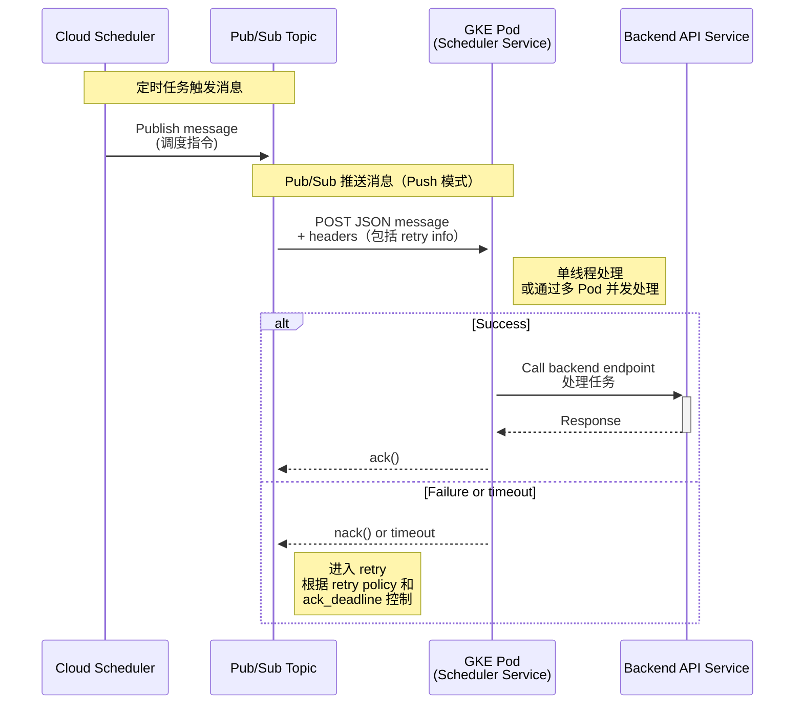
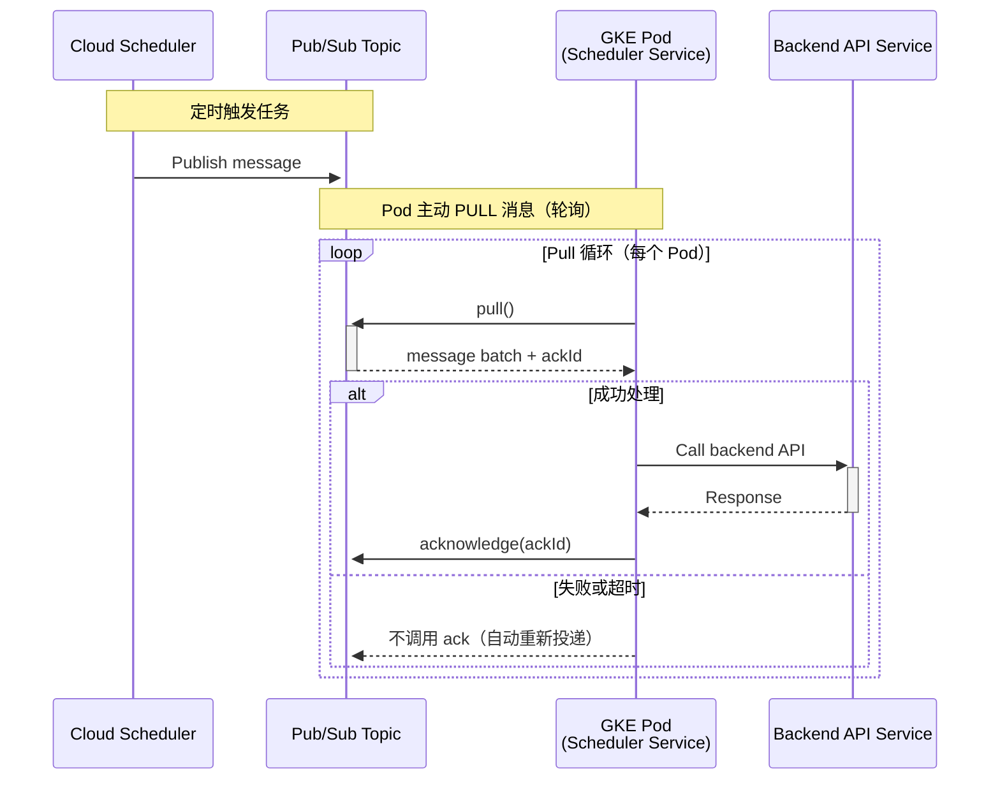
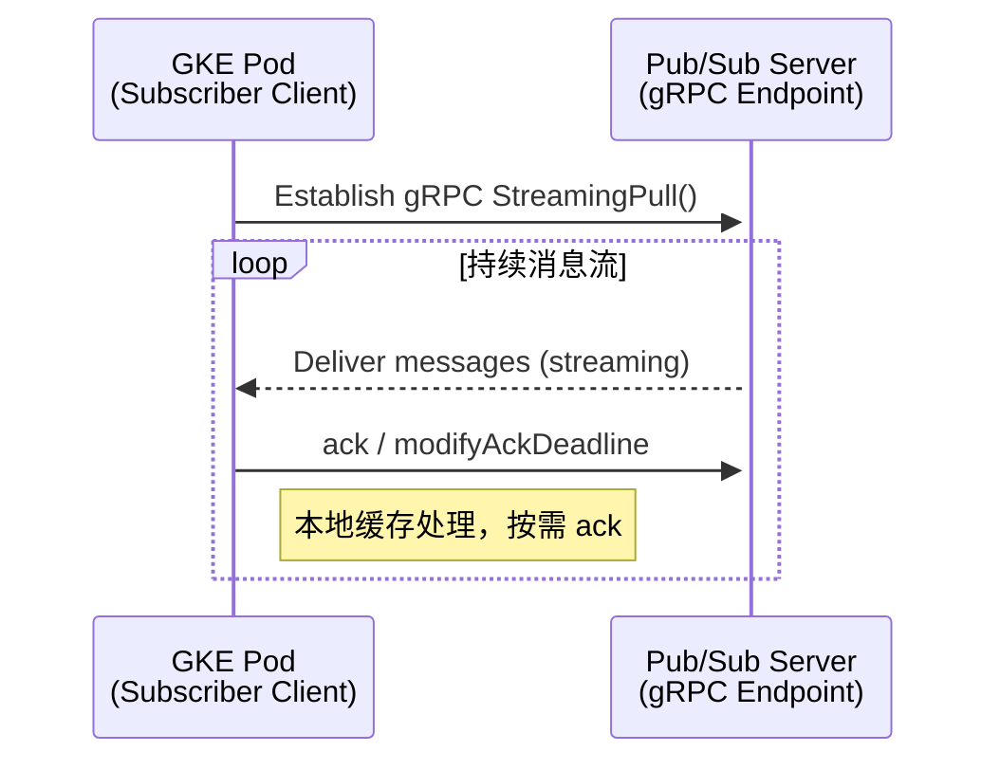
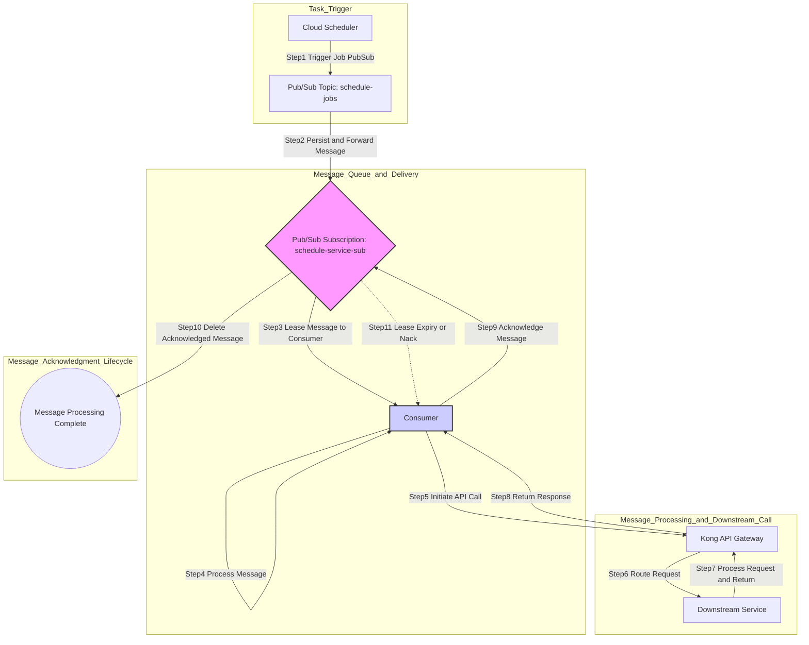

# Maybe Flow

描述整个 Pub/Sub 调度和处理流程：Push



pull
---



StreamingPull 的底层流程


(1) 绘制并分析端到端消息流转流程图： 
	(a) 使用Markdown创建一个流程图，清晰展示从GCP Cloud Scheduler触发，到消息经过Pub/Sub、GKE中的Schedule Service、Kong网关，最终到达Backend Service的完整路径。 (b) 结合您提供的监控指标（如 `publish_to_ack_delta`, `pull_to_ack_delta`），分阶段解释每个环节可能产生的延迟，以初步定位瓶颈所在。
(2) 深入解析Pub/Sub积压问题与核心配置： 
	(a) 详细阐述 `ackDeadlineSeconds` 的确切含义：即从Pub/Sub将消息推送给订阅者（Schedule Service）开始，到订阅者必须完成确认（ack）的最长时限，超时未确认则消息会被重新投递。 
	(b) 针对 `unacked_messages_by_region` 积压问题，分析其根本原因，如消费者处理能力不足或处理逻辑耗时过长。 (c) 提出Pub/Sub的最佳实践，包括配置死信队列（DLQ）以隔离处理失败的消息，以及调整订阅的流控制设置（Flow Control）以防止压垮消费者。
(3) 评估并优化Schedule Service的性能： 
	(a) 探究Schedule Service的消息处理模型。若为单线程，则研究并提供在GKE环境中实现并发消费Pub/Sub消息的最佳实践，以显著提升吞吐量。 
	(b) 分析当前的重试策略（RetryTemplate，间隔0s, 10s, 20s）与 `ackDeadlineSeconds` 及Kong超时之间的相互影响，并提出更优的方案，如带抖动的指数退避（Exponential Backoff with Jitter）。 
(4) 审查后端服务（Backend Service）的自动伸缩能力： 
	(a) 检查部署在GKE中的Backend Service的水平Pod自动伸缩（HPA）配置。 
	(b) 评估其伸缩所依赖的指标（如CPU、内存或自定义指标）是���合理，以及阈值设置是否足够灵敏以应对来自Schedule Service的突发请求。 
(5) 分析Kong网关的超时配置及其影响： 
	(a) 详细说明Kong的6分钟超时如何与Schedule Service的三次重试（可能长达18分钟）相互作用，并解释这为何会阻塞后续消息的处理。 
	(b) 提供针对处理长耗时任务的Kong超时配置（如 `connect_timeout`, `read_timeout`）的最佳实践。 
(6) 综合提出架构性改进建议： 
	(a) 评估当前多团队共享一个Pub/Sub Topic的模式的利弊，并与为每个团队或服务设置专用Topic的方案进行对比。 
	(b) 整合前述所有分析，提出一套全面的优化方案，涵盖从消息队列、服务实现到网关配置的调整，构建一个更具弹性和高性能的系统。
(7) 建立主动式监控与告警体系： 
	(a) 梳理流程中每个关键组件的核心性能指标（KPIs），例如Pub/Sub积压消息数、消息年龄、Schedule Service处理延迟、后端服务响应时间及错误率、Kong网关5xx错误率等。 
	(b) 指导如何在Google Cloud Monitoring中创建仪表盘以实现对这些KPIs的可视化监控，并设置告警策略，以便在问题发生初期就能主动发现并介入。


# 一份针对GCP调度系统的性能分析与优化策略报告

## I. 执行摘要与系统概��

### A. 发现摘要

本报告旨在深入分析一个基于Google Cloud Platform (GCP)的调度系统所面临的性能瓶颈。系统的核心问题表现为Cloud Pub/Sub订阅中出现显著的消息积压，具体体现在`unacked_messages_by_region`指标持续偏高。分析表明，此现象并非Pub/Sub服务本身的功能缺陷，而是下游消费者——GKE调度服务（Schedule Service）处理能力不足的直接症状。

根本原因可归结为几个相互关联的因素：首先，GKE调度服务内部的消息处理逻辑可能耗时过长；其次，请求链路上各组件的超时设置（尤其是Kong API网关）未能协同一致，导致上游服务过早放弃等待；最后，系统的自动伸缩（Autoscaling）策略和重试机制尚不完善，无法有效应对负载波动和暂时性故障。

本报告将提供一套全面的、端到端的优化策略，旨在解决这些瓶颈。策略内容包括：通过配置死信主题（Dead-Letter Topics, DLTs）和指数退避（Exponential Backoff）重试策略来增强系统韧性；调整并统一整个调用链路的超时设置；以及建立一套基于关键指标的、主动式的监控与告警体系，从而将系统从被动应对故障转变为主动健康管理。

### B. 系统数据流

为了建立对系统架构的共识，以下流程图清���地展示了单条调度消息从触发到最终确认的完整生命周期。



## II. 根因分析：解构Pub/Sub消息积压

### A. 主要症状：高企的 `unacked_messages_by_region`

**定义**：`unacked_messages_by_region`（或`subscription/num_unacked_messages_by_region`）是Cloud Monitoring中的一个关键指标，它代表已被Pub/Sub投递给订阅者、但尚未被确认（`ack`）或否定式确认（`nack`）的消息数量 1。该指标直接反映了消费者应用集群正在处理的工作队列（work-in-progress queue）的大小。

**解读**：一个持续偏高或不断增长的`unacked_messages_by_region`值明确表明，消息的确认速率低于消息的投递速率。这是系统性能瓶颈的核心外在表现。需要强调的是，Pub/Sub本身在这种情况下是按预期工作的；问题的症结在于下游消费者，即GKE调度服务，无法及时处理并确认消息 3。

### B. 确认时限（Acknowledgment Deadline）：一次关键的深度剖析

#### 1. 作为消息租约的 `ackDeadlineSeconds`

此参数在Pub/Sub订阅层面进行配置，它定义了Pub/Sub在投递一条消息后，等待订阅者发送确认回执的初始时长 5。这并非一个处理超时，而更应被理解为一个消息的

**租约（lease）**。当一个订阅者持有某条消息的租约时，Pub/Sub不会尝试将同一条消息投递给该订阅下的其他订阅者 7。该值的默认设置为10秒，最大可配置为600秒（10分钟）5。

#### 2. 租约到期的后果：消息重投

如果租约在到期前未能收到确认，Pub/Sub会将其视为一次隐性的否定式确认（`nack`）。此时，租约被撤销，该消息重新变为可投递状态，等待被系统再次分发给某个可用的订阅者 7。这种重投机制正是导致

`unacked_messages`指标居高不下的直接原因——同样的消息被反复投递，却始终无法被成功确认。

#### 3. 静态时限与动态租约管理的认知偏差

一个常见的误区在于，开发者可能简单地将订阅的`ackDeadlineSeconds`设置为600秒，并认为他们的应用有整整10分钟的时间来处理消息 5。然而，GCP提供的高级Pub/Sub客户端库（例如Java, Python, Go等）实现了一项名为**租约管理（lease management）**的智能特性 8。

该特性会在后台自动地、周期性地为那些仍在处理中的消息发送`modifyAckDeadline`请求，从而延长其确认时限。客户端库通常会依据历史上99%的消息确认延迟来智能地决定每次延长的时长 8。这意味着，对于长时间运行的任务，真正控制有效确认时限的，是客户端库的租约管理配置，而非订阅上的静态

`ackDeadlineSeconds`设置。例如，在Spring Cloud GCP中，`spring.cloud.gcp.pubsub.subscriber.max-ack-extension-period`属性就是这种客户端控制能力的直接体现 9。

因此，完全依赖静态的`ackDeadlineSeconds`是不足够且具有误导性的。真正的“超时”是由客户端库的租约管理配置所决定的。一条消息未能被确认，其原因往往是消费者进程崩溃，或因负载过高而无法及时发送后台的租约延长请求，而不仅仅是业务处理时间超过了静态设定的时限。

### C. 确认失败的假设性根因

#### 1. 消息处理逻辑缓慢

GKE调度服务自身的业务逻辑执行时间，超过了由客户端库管理的有效确认时限。这可能是由于代码效率低下、数据库调用缓慢或复杂的计算任务所致。

#### 2. 下游超时引发的级联失败（潜在的隐形元凶）

一个最可能但又最容易被忽视的原因，是下游依赖项的超时。整个请求链条的分析揭示了这一潜在的故障模式：

1. GKE调度服务（消费者）调用Kong API网关 10。
    
2. Kong自身对其上游服务（即GKE Backend Service）的调用设有超时，包括`connect_timeout`, `read_timeout`, 和 `write_timeout`，这些值的默认设置通常为60000毫秒（60秒）13。
    
3. 如果GKE Backend Service处理请求的时间超过60秒，Kong将会超时，并向其调用方（GKE调度服务）返回一个`504 Gateway Timeout`错误 15。
    
4. GKE调度服务在收到这个错误后，其中断了对当前Pub/Sub消息的处理循环，并且关键地，**没有调用`ack()`方法**来确认该消息。
    
5. 最终，该消息的租约到期，Pub/Sub将其重新投递。这个循环不断重复，导致那些因下游超时而暂时无法处理的“毒丸”消息（poisoned message）在队列中积压。
    

结论是，问题虽然在Pub/Sub的监控指标上（`unacked_messages`）显现，但其根源很可能在于Kong网关的超时配置不当。这凸显了建立端到端可观测性和统一超时策略的极端重要性。

#### 3. 消费者容量不足与处理节流

GKE调度服务的Pod实例数量相对于消息的流入速率来说过低。这导致消息在客户端库的内部缓冲区中排队等待。虽然流控机制（flow control）可以防止单个Pod因过载而崩溃 16，但它会导致整体处理延迟增加，最终可能超过确认时限，引发重投和积压 3。

#### 4. 消费者崩溃或Pod不健康

Pod因内存溢出（OOM）、未捕获的异常而崩溃，或者在能够确认其正在处理的消息之前就被GKE的调度器终止。缺乏优雅停机（graceful shutdown）处理逻辑（例如，对`SIGTERM`信号的响应）会加剧此问题。

## III. 优化GKE调度服务：从瓶颈到吞吐量引擎

### A. 订阅者并发与并行度调优（客户端调优）

**概念**：Pub/Sub客户端库能够在一个订阅者进程内部，利用线程池并发处理多条���息 17。

**Java客户端配置**：

- `setParallelPullCount(N)`：此方法用于开启N个并行的gRPC流来从Pub/Sub拉取消息。如果单个流的带宽（约10 MBps）成为瓶颈，可以增加此值。对于典型的调度作业，这并不常见，但对极高吞吐量的场景很有用 17。
    
- `setExecutorProvider(...)`：这是最关键的设置之一。它定义了用于执行消息处理逻辑的线程池。默认的线程数通常很小（例如5个）。对于I/O密集型任务（如调用Kong API），应显著增加此值以提高吞吐量 17。
    

客户端线程与Pod资源的协同：

一个常见的优化陷阱是，开发者可能会为了提升吞吐量而大幅增加客户端的线程数（例如，setExecutorThreadCount(50)），但承载应用的GKE Pod却只配置了1个vCPU的限制。在这种情况下，50个并发线程将为争夺单个vCPU而产生严重的线程上下文切换开销，这不仅不会加速处理，反而可能导致整体性能下降。

因此，客户端的并发设置必须与Pod的资源请求和限制（`spec.containers.resources`）协同调整。对于CPU密集型工作，线程数应接近于分配的vCPU核心数。对于I/O密集型工作，线程数可以设置得更高，但必须密切监控内存使用情况，以防OOM Kill。

### B. 实施订阅者流控（��我保护机制）

**概念**：流控（Flow Control）可以防止单个订阅者客户端拉取超过其处理能力的消息量，从而避免因内存耗尽或负载过高而变得不稳定 3。它扮演着客户端缓冲区上限的角色。

**配置**：

- `setMaxOutstandingElementCount(N)`：限制客户端内存中持有的最大消息数量（例如，1000条）16。
    
- `setMaxOutstandingRequestBytes(B)`：限制客户端内存中持有的消息总字节大小（例如，100 MiB）16。
    

**价值**：流控是一个至关重要的稳定性模式。它能确保即使面对包含数百万条消息的巨大积压，每个Pod也只承接其能力范围内的、可管理的工作量，从而防止因资源耗尽而引发的级联故障。

### C. 一套稳健的水平Pod自动伸缩器（HPA）策略

**从滞后指标到领先指标**：基于CPU或内存利用率进行扩缩容是一种**滞后**指标——只有在系统已经承受压力后才会触发扩容。相反，基于Pub/Sub积压消息数进行扩缩容是一种**领先**指标——在工作负载到达时即进行扩容，从而在延迟问题出现**之前**就采取行动 20。

**使用外部指标实施HPA**：

- GKE的HPA支持基于Cloud Monitoring中的外部指标进行伸缩 20。
    
- 此场景下的关键指标是`pubsub.googleapis.com|subscription|num_undelivered_messages`（注意：`num_undelivered_messages`是积压消息的现代名称，常与`num_unacked_messages`互换使用）24。
    
- HPA会计算`currentReplicas * targetAverageValue`，并调整Pod数量，以使每个Pod的实际平均指标值接近目标值。
    

**最佳实践：多指标自动伸缩**：

- 单纯依赖积压消息数可能会在消息处理速度极快时导致过度配置 21。
    
- Google官方推荐的最佳实践是使用**多于一个的信号**来进行伸缩决策 1。
    
- 一个稳健的HPA配置应该结合外部的Pub/Sub积压指标和标准的资源指标（如`cpu.utilization`）。这创造了一种平衡的策略：根据积压消息数主动扩容，同时确保Pod确实在努力工作，并在积压和CPU利用率都较低时进行缩容。
    

**HPA v2配置清单示例**：

```yaml
apiVersion: autoscaling/v2
kind: HorizontalPodAutoscaler
metadata:
  name: schedule-service-hpa
spec:
  scaleTargetRef:
    apiVersion: apps/v1
    kind: Deployment
    name: gke-schedule-service
  minReplicas: 2 # 始终保持至少2个副本以实现高可用
  maxReplicas: 20
  metrics:
  - type: External
    external:
      metric:
        name: pubsub.googleapis.com|subscription|num_undelivered_messages
        selector:
          matchLabels:
            resource.labels.subscription_id: "schedule-service-sub"
      target:
        type: AverageValue
        averageValue: "100" # 目标为每个Pod处理100条积压消息
  - type: Resource
    resource:
      name: cpu
      target:
        type: Utilization
        averageUtilization: 75 # 目标CPU利用率为75%
  behavior:
    scaleDown:
      stabilizationWindowSeconds: 300
      policies:
      - type: Percent
        value: 100
        periodSeconds: 15
```

### D. 确保优雅停机与幂等性

**优雅停机**：当GKE缩容时，它会向Pod发送一个`SIGTERM`信号。应用程序**必须**捕获此信号，并在被`SIGKILL`强制终止前（默认30秒）的这段时间内，完成对正在处理的消息的业务逻辑并调用`ack()`进行确认。若未能做到这一点，每次缩容事件都将导致消息被重新投递。

**幂等性**：后端服务**必须**被设计成幂等的。这意味着多次接收到相同的请求与单次接收该请求所产生的效果是完全相同的 26。这是最终的安全保障。无论因何种故障导致消息被重投，一个幂等的消费者都能确保不会创建重复数据或执行重复操作。这在可靠���消息驱动系统中是不可或缺的。

## IV. 统一的超时与重试策略，构筑系统韧性

### A. Pub/Sub订阅重试策略：指数退避

**立即重试的问题**：Pub/Sub的默认重试策略是“立即重试” 28。如果GKE Backend Service宕机或过载，此策略会制造一场“重试风暴”，持续冲击本已脆弱的服务，使其难以恢复 29。

**解决方案：带抖动的指数退避**：

- 应将订阅配置为使用**指数退避（exponential backoff）**重试策略 28。对于一条被
    
    `nack`的消息，该策略会逐步增加其重投之间的延迟（例如，10秒、20秒、40秒，直至达到最大值600秒）。
    
- 该策略是**按消息**应用的。当一条有问题的消息处于其退避等待期时，Pub/Sub会继续投递来自该主题的**其他**消息 28。这隔离了单个失败消息或暂时性下游问题的影响，使得系统的其余部分能够继续正常运作。而“抖动”（Jitter）的概念，无论是分布式系统固有的随机性还是客户端可以明确添加的随机延迟，都有助于防止“惊群效应”，即大量被退避的客户端在同一精确时刻发起重试 29。
    

### B. 死信主题（DLT）：终极安全阀

**概念**：死信主题（Dead-Letter Topic, DLT）是一个独立的Pub/Sub主题。当一条消息在达到配置的最大投递尝试次数（`max_delivery_attempts`）后仍未被成功确认时，Pub/Sub会将其发送到这个DLT中 28。

**配置步骤**：

1. 创建一个独立的Pub/Sub主题作为DLT（例如，`schedule-jobs-dlt`）35。
    
2. 为这个DLT创建一个订阅（例如，`schedule-jobs-dlt-sub`），以便后续可以检查失败的消息 35。
    
3. 编辑主订阅（`schedule-service-sub`），启用死信功能，将其指向刚刚创建的DLT，并设置`max_delivery_attempts`（最小值5，最大值100）6。
    

关键的IAM权限：

一个常见的配置错误是，用户正确配置了DLT，却发现消息并未如期被转发。他们检查了自己应用程序的服务账号权限，确认其拥有对DLT的pubsub.publisher角色，但问题依旧。

其原因是，执行消息转移操作的实体是**Pub/Sub服务本身**，而非用户的应用程序。因此，必须为Google管理的Pub/Sub服务账号（格式为`service-<project-number>@gcp-sa-pubsub.iam.gserviceaccount.com`）授予必要的权限：在DLT上需要`roles/pubsub.publisher`角色，在原始订阅上需要`roles/pubsub.subscriber`角色（以便确认它正在转移的消息）28。这是一个非常重要但容易被忽略的细节。

**价值**：DLT可以防止“毒丸”消息无限期地阻塞队��。它为离线分析、手动重处理或丢弃无法修复的损坏消息提供了一套有效的机制。

### C. 对齐全栈的超时设置

**超时链原则**：在一个同步请求链中（如`GKE Service -> Kong -> Backend`），端到端操作的耐心程度取决于其中最没耐心的那个组件。最先触发的超时将决定整个链条的行为。

**Kong上游超时**：

- Kong允许为与上游（后端）服务的通信设置超时 10。
    
- `connect_timeout`：与后端Pod建立连接的超时时间。默认60000毫秒。
    
- `write_timeout`：向后端发送请求时，两次连续写入操作之间的超时。默认60000毫秒。
    
- `read_timeout`：从后端读取响应时，两次连续读取操作之间的超时。**这是对于长耗时作业最关键的参数**。它定义了Kong在发送请求后等待响应的最长时间。默认60000毫秒 13。
    

**表格：端到端超时配置建议**

下表提供了一个统一的参考，用于协调整个分布式系统中的超时设置。不一致的超时是导致难以诊断的级联故障的常见原因。此表将一个复杂的配置问题转化为一个清晰的、分层的检查清单。

|组件|参数|推荐值|理由|
|---|---|---|---|
|**Pub/Sub 订阅**|`ackDeadlineSeconds` (静态)|600 秒|设置一个宽裕的初始租约时长。客户端库将负责后续的延长管理。|
|**GKE Schedule Service**|`max-ack-extension-period` (客户端库)|900 秒 (15 分钟)|**(核心)** 这是单条消息可被处理的绝对最长时间。它必须是整个链条中最长的超时。 8|
|**Kong Service/Route**|`read_timeout`|840000 毫秒 (14 分钟)|必须小于客户端的最大延长周期，以便客户端能优雅处理Kong的超时；但需长于后端的预期处理时间。|
|**GKE Backend Service**|应用级处理时间 (P99)|< 13 分钟|实际工作必须在其上游网关（Kong）的`read_timeout`之内完成。|
|**Pub/Sub 订阅**|`message_retention_duration`|7 天|这是一个安全保障，用于防止在整个消费者集群长时间宕机的情况下丢失消息。 6|

## V. 架构最佳实践与增强的可观测性

### A. 一套主动式的监控与告警策略

**超越积压数量**：`num_unacked_messages_by_region`告诉你**是否**存在问题，而`subscription/oldest_unacked_message_age`则告诉你问题的**严重程度** 1。

**积压时长 vs. 积压数量**：

1. 一个包含10,000条消息的积压，如果最老消息的时长只有30秒，这通常意味着容量问题。系统只是暂时落后，但消息仍在流动。解决方案是HPA扩容消费者。
    
2. 一个仅有100条消息的积压，但最老消息的时长已达2小时，这表明存在处理失败。消息被“卡住”了。这可能是毒丸消息、下游服务中断或消费者代码中的bug。此时的解决方案是调查和调试，而不仅仅是扩容。
    

因此，监控`oldest_unacked_message_age`对于正确诊断积压问题的**类型**并触发适当的响应至关重要。

**表格：关键监控指标与告警策略**

下表将帮助团队从被动解决问题转向主动的系统健康管理。它提供了一套可立即实施的告警，针对特定的故障模式。

|指标|阈值|严重性|行动 / 解读|
|---|---|---|---|
|`subscription/oldest_unacked_message_age`|> 15 分钟|严重|消息被卡住。可能是毒丸消息或持续的下游故障。调查消费者日志和DLT。 2|
|`subscription/num_unacked_messages_by_region`|> 10,000 (持续5分钟)|警告|系统处理速度跟不上。验证HPA是否正常扩容。 1|
|`topic/send_request_count` (按 `response_code` 分组)|`error` 计数 > 0|警告|发布者（Cloud Scheduler或其他服务）向主题发布消息失败。检查发布者日志和IAM权限。 42|
|`subscription/num_undelivered_messages` (在DLT上)|> 0|严重|消息已达到最大重投次数。这表明存在持久性错误。需要立即调查。 34|
|GKE Pods|`Restart Count` > 0|警告|消费者Pod正在崩溃。检查Pod日志以确定是OOM还是应用程序异常。|
|Kong Latency|`kong_latency_ms` (P99) > `read_timeout`|严重|Kong自身出现高延迟，这可能是导致上游超时的原因。|

### B. 主题与订阅设计

**单一主题 vs. 多个主题**：对于当前这个专用的调度工作流，使用单一主题是正确且最简单的设计 7。多个主题通常用于隔离不同

**类型**的、不相关的事件 44。

**成本考量**：需要注意的是，即使使用了订阅过滤器，您仍然需要为那些最终被过滤掉的消息的入口流量付费。对于一个高流量主题，如果其上有多个订阅，且每个订阅都过滤掉大量消息，这可能会导致显著的成本。在这种场景下，使用多个主题可能更具成本效益 44。这一点虽不直接适用于当前场景，但却是一个重要的架构决策考量。

## VI. 建议总结

### A. 优先行动计划

#### 立即行动（分类与稳定）

1. **提高Kong的`read_timeout`**：立即将Kong Service/Route的`read_timeout`调整为一个大于后端P99处理时间的值（例如，5分钟），以阻止超时级联失败。
    
2. **实施死信主题（DLT）**：配置一个DLT，并设置`max_delivery_attempts=5`，以捕获并隔离任何真正无法处理的消息。务必为Pub/Sub服务账号授予必要��IAM角色。
    
3. **设置关键告警**：创建针对`oldest_unacked_message_age` > 15分钟以及DLT `num_undelivered_messages` > 0的告警。
    

#### 中期行动（优化与自动化）

1. **配置HPA**：基于`num_undelivered_messages`积压指标和CPU利用率，实施水平Pod自动伸缩器。
    
2. **启用指数退避**：将订阅的重试策略更改为指数退避，以优雅地处理暂时性的下游故障。
    
3. **调优订阅者客户端**：对GKE调度服务进行性能分析，并调整`ExecutorProvider`的线程数和流控设置，以在不引起资源争用的前提下实现最佳吞吐量。
    

#### 长期行动（加固与完善）

1. **确保幂等性**：审计并重构GKE Backend Service，使其完全幂等，从而使重试操作绝对安全。
    
2. **实施优雅停机**：为GKE调度服务添加`SIGTERM`信号处理逻辑，以防止在Pod终止和部署期间丢失消息。
    
3. **实施分布式追踪**：在整个服务链（Schedule Service -> Kong -> Backend Service）中集成Cloud Trace或其他追踪工具，以获得对请求生命周期和延迟归因的深度可见性。
    

### B. 表格：Pub/Sub订阅者客户端配置最佳实践（Java/Spring示例）

下表为配置消费者服务的开发者提供了一份快速参考备忘单，��结了最具影响力的客户端设置。

| 参数 (Spring Property) | 推荐设置 | 目的 |
| --- | --- | --- |
| `spring.cloud.gcp.pubsub.subscriber.parallel-pull-count` | 1 (默认) 或 2 | 并行gRPC流的数量。仅在单个流的网络带宽被证实为瓶颈时才增加。 9 |
| `spring.cloud.gcp.pubsub.subscriber.executor-threads` | (I/O密集型: 每CPU 8-16), (CPU密集型: CPU核心数) | **性能关键。** 用于消息处理的线程池大小。必须与Pod的CPU资源相平衡。 |
| `spring.cloud.gcp.pubsub.subscriber.max-ack-extension-period` | 900 (15 分钟) | 客户端延长租约的最长时间。这是有效的处理超时。 9 |
| `spring.cloud.gcp.pubsub.subscriber.flow-control.max-outstanding-element-count` | 1000 | 防止Pod被消息**数量**压垮。 9 |
| `spring.cloud.gcp.pubsub.subscriber.flow-control.max-outstanding-request-bytes` | 104,857,600 (100 MiB) | 防止Pod被消息**大小**压垮。 9 |
| `spring.cloud.gcp.pubsub.subscription.<sub-name>.retry.total-timeout-seconds` | 不适用 (使用订阅策略) | 客户端gRPC调用重试。不要与消息重投混淆。应使用订阅上的服务器端指数退避策略来处理消息重投。 9 |
