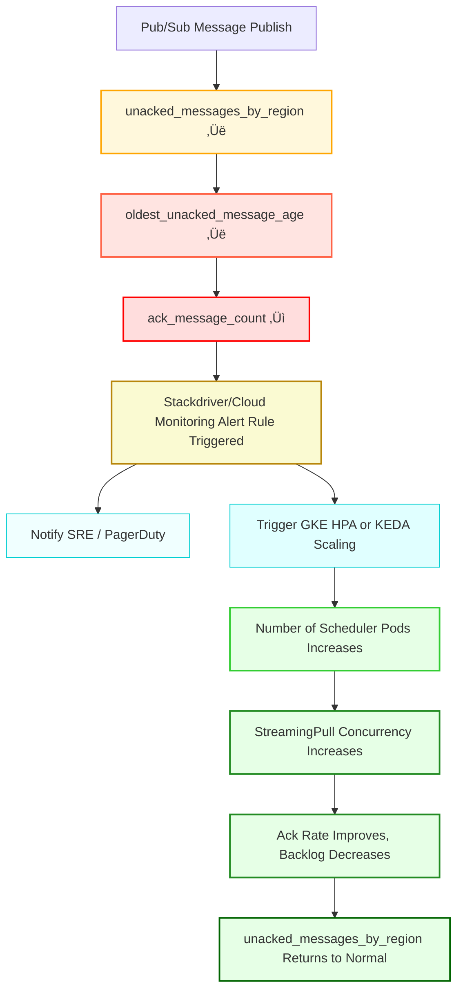

- [**Core Metrics for Pub/Sub Consumer Performance**](#core-metrics-for-pubsub-consumer-performance)
  - [**‚úÖ Detailed Pub/Sub Metrics Table**](#-detailed-pubsub-metrics-table)
  - [**‚úÖ Detailed Explanation of GCP Pub/Sub Consumer Monitoring Metrics**](#-detailed-explanation-of-gcp-pubsub-consumer-monitoring-metrics)
    - [Overview](#overview)
    - [Delivery Latency Health Score Metrics](#delivery-latency-health-score-metrics)
    - [Pull](#pull)
    - [StreamingPull](#streamingpull)
- [unacked_messages_by_region](#unacked_messages_by_region)
  - [**üîç Metric:**](#-metric)
  - [**unacked_messages_by_region**](#unacked_messages_by_region-1)
    - [**‚úÖ**](#)
    - [**Metric Definition**](#metric-definition)
    - [**⚠️**](#️)
    - [**Typical Meaning When This Metric Increases**](#typical-meaning-when-this-metric-increases)
    - [**üìä Anomaly Threshold Reference**](#-anomaly-threshold-reference)
    - [**‚úÖ**](#-1)
    - [**Suggested Optimization Directions**](#suggested-optimization-directions)
    - [**üìå Optional Diagram**](#-optional-diagram)
  - [StreamingPull](#streamingpull-1)
    - [**‚úÖ**](#-2)
    - [**Scaling the Number of Scheduler Pods == Increasing StreamingPull Concurrency**](#scaling-the-number-of-scheduler-pods--increasing-streamingpull-concurrency)
    - [**üìå Reasons:**](#-reasons)
    - [**‚úÖ Additional Details (Tunable):**](#-additional-details-tunable)
      - [**If you are using the official GCP Client (e.g., Java, Go), you can further enhance concurrency:**](#if-you-are-using-the-official-gcp-client-eg-java-go-you-can-further-enhance-concurrency)
    - [**‚úÖ Summary:**](#-summary)
- [streaming_pull_response_count](#streaming_pull_response_count)
    - [Method 1: Via Cloud Monitoring Metrics (Most Recommended)](#method-1-via-cloud-monitoring-metrics-most-recommended)
    - [Method 2: Network Analysis Inside the GKE Pod (Direct Evidence)](#method-2-network-analysis-inside-the-gke-pod-direct-evidence)
    - [Method 3: Enable Advanced gRPC Logging (Advanced Debugging)](#method-3-enable-advanced-grpc-logging-advanced-debugging)
- [send_message_count](#send_message_count)
  - [**‚úÖ First, an Explanation:**](#-first-an-explanation)
  - [**send_message_count = 8**](#send_message_count--8)
  - [**What does it mean?**](#what-does-it-mean)
  - [**‚úÖ Background**](#-background)
  - [**‚úÖ Current Problem: Single Pod with Single-Threaded Processing**](#-current-problem-single-pod-with-single-threaded-processing)
  - [**‚úÖ If You Scale Horizontally to 10 Pods (Still Single-Threaded)**](#-if-you-scale-horizontally-to-10-pods-still-single-threaded)
  - [**‚úÖ Best Practice Recommendations**](#-best-practice-recommendations)
  - [**‚úÖ Final Summary (Backlog = Delivery Rate vs. Consumption Capacity)**](#-final-summary-backlog--delivery-rate-vs-consumption-capacity)
    - [**üìå Additional Notes**](#-additional-notes)
  - [**‚úÖ**](#-3)
  - [**Pub/Sub Consumer Metrics Evolution + Alert Response + Pod Autoscaling Workflow**](#pubsub-consumer-metrics-evolution--alert-response--pod-autoscaling-workflow)
    - [**üîç Flow Interpretation:**](#-flow-interpretation)
    - [**‚úÖ Recommended Cloud Monitoring Alert Policies**](#-recommended-cloud-monitoring-alert-policies)

# **Core Metrics for Pub/Sub Consumer Performance**
---
### **‚úÖ Detailed Pub/Sub Metrics Table**

Below is the **completed core monitoring metrics table for GCP Pub/Sub consumers**, based on the provided metric names, units, sample values, and subcategories. It is formatted as a Markdown table for easy copying and pasting.

---

### **‚úÖ Detailed Explanation of GCP Pub/Sub Consumer Monitoring Metrics**

#### Overview

| **Metric Name** | **Unit** | **Sample Value** | **Description** | **Typical Issues or Anomalies** | **Optimization Suggestions** |
|---|---|---|---|---|---|
| oldest_unacked_message_age | Seconds (s) | 450s | The age of the **oldest unacknowledged message** in the subscription (since delivery). | Severe consumption lag, insufficient threads, or long-running business logic. | Increase consumer threads / Reduce processing time / Speed up acks. |
| unacked_messages_by_region | Count | 23 | The number of **unacknowledged messages** in the current region (delivered but not confirmed). | Indicates insufficient consumer capacity in the region, leading to message backlog. | Scale out consumer replicas / Optimize processing logic / Load balance traffic across regions. |
| Delivery metrics | | | | | |
| ack_message_count | Count/sec | 1.75/s | The number of successfully acknowledged messages (can be observed as a rate trend). | Low ack rate ‚áí May lead to backlog. | Increase processing threads / Improve processing rate / Optimize error handling. |
| publish_message_count | Count/sec | 2.00/s | The rate of messages published to the topic. | If publish rate is much higher than consumption rate ‚áí Backlog will occur. | Match consumption capacity with publish rate. |
| send_message_count | Count/sec | 1.95/s | The number of messages sent from Pub/Sub to subscribers (Note: sent ≠ acked). | Slow consumer reception, flow control, or errors can prevent full processing. | Configure flow control, scale server or client. |
| ack_message_count_by_delivery_type.pull | Count/sec | 1.58/s | The number of messages successfully acked via Pull mode. | Insufficient Pull consumption capacity or lost acks. | Increase threads / Optimize client logic. |
| publish_to_ack_delta | Seconds (s) | 650s | The total time from **message publication** to final **acknowledgment** (end-to-end latency). | High overall system latency, possibly due to slow message processing. | Shorten business logic, improve processing capacity, control publish rate. |
| pull_to_ack_delta | Seconds (s) | 520s | The time from when a client **pulls a message** to its final acknowledgment (excludes publish time). | Indicates slow client-side processing or delayed acks. | Optimize message processing logic, ack promptly. |
| bailable_bytes_by_region.retained_acked | Bytes | 1.2MB | The total size of acked messages that are still retained (before retention period expires). | Normal caching metric, reflects storage in the topic/region. | Useful for storage cost estimation or topic settings optimization. |
| bailable_bytes_by_region.unacked | Bytes | 2.8MB | The byte size of currently unacknowledged messages (delivered but not confirmed). | Severe message backlog ‚áí Memory pressure or delayed acks. | Control maxOutstandingBytes / Increase consumption rate. |

---
In Google Cloud Pub/Sub, two important monitoring metrics are:

- Publish to Ack Delta ==> The time difference from message publication to immediate ACK.
- Pull to Ack Delta ==> The time difference from when a message is pulled to its immediate ACK.

These metrics reflect latency within the message lifecycle and are presented relative to the current time. Therefore, you will see positive and negative values based on a zero baseline. This is not a bug but a feature of these metrics.

**1. Basic Definitions (Conceptual)**

| Metric Name | Meaning (Conceptual) |
|---|---|
| Publish to Ack Delta | The time difference (relative to now) between when a message is published to a Pub/Sub Topic and when it is acknowledged by the client. |
| Pull to Ack Delta | The time difference (relative to now) between when a message is pulled by the client and when it is acknowledged by the client. |

**Key Point:** These metrics are "delta to now," measured in seconds. They represent "how long ago" or "how soon in the future" an ack might occur.

**2. Explanation with Practical Data**

‚úÖ **Example:** Current time is 12:00:00

üìå **Scenario 1:** A message was published at 11:59:58 and acked at 12:00:01.

| Operation | Timestamp |
|---|---|
| publish | 11:59:58 |
| ack | 12:00:01 |
| now | 12:00:00 |

Publish to Ack Delta = ack_time - publish_time = 3s

But on the monitoring chart, you would see:
`publish_to_ack_delta = -3s` (meaning the ack is still 1 second away from now)

Because Cloud Monitoring measures the delta as: `current_time - event_timestamp`.
- If the message is already acked, the delta is negative (it happened in the past).
- If the message is not yet acked, the delta is positive (you might ack it in the future).

üìå **Scenario 2:** A message was published at 11:59:30 but has not been acked yet.

In this case:
- `Publish to Ack Delta ≈ +30s` (The system estimates how long until the ack, or the message is still pending).

**3. Practical Uses of These Metrics**

‚úÖ **1. Verifying the Efficiency of the "Acknowledge on Receipt" Model**

-   In this model, `publish_to_ack_delta` and `pull_to_ack_delta` should theoretically be **very small and stable** (e.g., in the millisecond range).
-   If these values **increase**, it indicates that the **consumer client (ScheduleService) is experiencing a bottleneck in the message reception and acknowledgment phase itself**, such as network latency or insufficient client resources, rather than slow business logic processing.

‚úÖ **2. Monitoring Client Health**

-   A sustained increase in `pull_to_ack_delta` directly points to a health problem with the consumer Pod itself, not the Backend API it calls.

**4. Combined Analysis with Message Backlog**

In your "Acknowledge on Receipt" architecture:

-   If `unacked_message_count` continuously increases.
-   And `publish_to_ack_delta` or `pull_to_ack_delta` trends upwards.

The only reason is that **your consumer client (ScheduleService) cannot keep up**; it is unable to pull messages from Pub/Sub and send the ACK in a timely manner. This is completely unrelated to the subsequent Backend API call. You need to investigate:

-   Are the client's `FlowControlSettings` too conservative?
-   Is the `executorThreadCount` insufficient?
-   Have the Pod's CPU/memory resources reached their limit?

**5. Summary**

| Metric | Description | Monitoring Chart Behavior | Interpretation |
| --- | --- | --- | --- |
| `publish_to_ack_delta` | Latency from publish to **immediate ack**. | Should be a very small and stable negative value. | An increase indicates a bottleneck in the client's reception or ACK pathway. |
| `pull_to_ack_delta` | Latency from client pull to **immediate ack**. | Should be a very small and stable negative value. | An increase indicates the consumer Pod itself has resource or network issues preventing it from quickly completing the "receive-acknowledge" action. |

If you have screenshots of Cloud Monitoring charts or abnormal value fluctuations, feel free to share them for a joint analysis.

---

The following table shows key metrics from the Google Cloud Pub/Sub monitoring Overview page, along with their meanings and recommendations.

| Metric Name | Unit | Sample Value | Description | Typical Issues or Anomalies | Optimization Suggestions |
|---|---|---|---|---|---|
| Oldest unacked message age | s | 0 | The age of the oldest unacknowledged message in the subscription. | A high value indicates subscribers are failing to process and acknowledge messages in time, potentially leading to backlogs and processing delays. | Check subscriber application performance, error logs, and resource availability. Consider increasing subscriber instances or processing concurrency. Verify that the Ack deadline is set appropriately. |
| Unacked messages by region | (Count) | 0 | The number of unacknowledged messages, aggregated by region. | A high number of unacknowledged messages in a specific region may indicate insufficient processing capacity or issues with subscribers in that region. | Focus on troubleshooting and optimizing subscribers in the region with the backlog. |
| **Delivery metrics** | | | **A collection of metrics related to message delivery, including the following three sub-metrics:** | | |
| - Ack message count | /s | 0.058/s | The number of messages acknowledged by subscribers per second. | If this value is much lower than "Sent message count," it means messages are being sent but not acknowledged, possibly due to slow processing or acknowledgment failures. | Check if the subscriber's acknowledgment logic is correct and efficient. Ensure acknowledgments are sent promptly after successful processing. Troubleshoot subscriber errors. |
| - Publish message count | /s | 0.058/s | The number of messages published to the Topic per second. | This value represents the publisher's throughput. If it's lower than expected, the publisher's sending speed may be limited. | Check the publisher application's logic and performance. Confirm that network connections and permissions are normal. |
| - Sent message count | /s | 0.058/s | The number of messages sent from the Topic to subscribers per second. | This value represents the throughput of Pub/Sub successfully sending messages to subscribers. If this value is much lower than "Publish message count," there may be connection or configuration issues between Pub/Sub and the subscribers. | Check if the subscription is configured correctly and that subscribers are running and able to receive messages. Ensure the Pub/Sub service account has permission to send messages to the subscription endpoint (for Push subscriptions). |
| Ack message count by delivery type | /s | 0.0467/s | The number of acknowledged messages, broken down by delivery type (Pull, Push, etc.). The screenshot shows the count for the Pull method. | A low acknowledgment count for a specific delivery type indicates issues with the processing or acknowledgment of subscribers using that method. | For Pull subscriptions, check the pulling and acknowledgment logic. For Push subscriptions, check the availability and processing capacity of the Push endpoint. |
| Publish to ack delta | s | 0 | The average time interval from when a message is published to when it is _first_ acknowledged by a subscriber. | A high value indicates high end-to-end latency for the entire message lifecycle (publish, transport, subscriber processing, acknowledgment). | Analyze other metrics (Unacked age, Ack count vs. Sent count, Pull/Push to ack delta) to pinpoint where the delay is occurring (publishing, transport, or subscriber processing). |
| Pull to ack delta | s | 0 | The average time interval from when a message is pulled by a Pull subscriber to when it is acknowledged by that subscriber. | A high value specifically points to a delay on the Pull subscriber's end, meaning the message is not being processed and acknowledged in a timely manner after being pulled. | Focus on optimizing the Pull subscriber's message processing logic to improve speed and concurrency. Ensure acknowledgments are sent immediately after processing is complete. |
| Billable bytes by region | B | N/A | The number of billable bytes, aggregated by region (includes data volume for both publishing and subscribing). | An abnormal increase in billable bytes may indicate an unexpected increase in data volume, such as erroneously republishing or subscribing to a large number of messages. | Monitor data volume growth trends and investigate whether the application has logic errors causing duplicate publishing or consumption. Consider whether message bodies need to be compressed. |

#### Delivery Latency Health Score Metrics

| **Metric Name** | **Unit** | **Sample Value** | **Description** | **Typical Issues or Anomalies** | **Optimization Suggestions** |
|---|---|---|---|---|---|
| **Delivery latency health score** | | | **A collection of metrics, including the following 5 sub-metrics:** | | |
| ack_latency | Milliseconds | 1 | The acknowledgment latency of a message, representing the processing time after successful receipt. | Long delays can lead to slow message processing. | Optimize processing logic to reduce processing time. |
| expired_ack_deadlines | Count | 1 | The number of expired Ack deadlines, representing messages not acknowledged within the specified time. | The user is ignoring message processing, causing messages to be redelivered. | Adjust Ack deadline and processing speed. |
| nack_requests | Count | 1 | The count of failed acknowledgment requests, representing messages not successfully acknowledged. | Failure to acknowledge messages may indicate processing failures. | Check processing logic to ensure proper acknowledgment. |
| seek_requests | Count | 1 | The count of seek requests, representing the number of times a client requests a specific message. | Frequent client requests to find messages can cause performance issues. | Limit the frequency of seek requests or optimize seek logic. |
| utilization | Percentage | 1 | The utilization of message processing resources, representing the percentage of resources used. | High utilization indicates that resources are under pressure. | Scale resources or perform load balancing. |
| Backlog bytes | Bytes | 0 | The current number of bytes of messages waiting to be processed. | If this value continues to grow, it may lead to performance degradation. | Increase the number of subscribers to improve message processing speed. |
| Expired ack deadlines count | Count | 0 | The count of expired Ack deadlines. | An excessive number of expired deadlines indicates that messages are not being processed in a timely manner. | Adjust subscriber processing speed to optimize for latency. |
| **Ack latencies** | Milliseconds | 51.76ms (50th) | The percentile of acknowledgment latency. | Higher latency can lead to overall performance degradation. | Identify and optimize slow request paths. |
| REDUCE_PERCENTILE_50 ack_latencies | Milliseconds | 51.76ms | The 50th percentile of Ack latency. | If this value exceeds the set threshold, it may affect processing performance. | Perform performance monitoring and analysis to optimize processing time. |
| REDUCE_PERCENTILE_95 ack_latencies | Milliseconds | 117.91ms | The 95th percentile of Ack latency. | Higher latency indicates a performance bottleneck. | Adjust system resource configuration to improve performance. |
| REDUCE_PERCENTILE_99 ack_latencies | Milliseconds | 133.48ms | The 99th percentile of Ack latency. | This represents the latency in extreme cases and requires immediate attention. | Respond to the worst-case scenario and find the root cause. |
| Seek request count | Count | 0 | The count of seek requests. | Frequent requests can lead to performance issues. | Reduce unnecessary seek requests. |

#### pull
- 

| **Metric Name** | **Unit** | **Sample Value** | **Description** | **Typical Issues or Anomalies** | **Optimization Suggestions** |
|---|---|---|---|---|---|
| Pull ack requests | req/s | 0.0233 | The rate of successful ack requests, indicating the number of successfully acknowledged messages. | A low request rate may lead to message backlog. | Check network connection and processing logic to ensure successful requests. |
| StreamingPull response | resp/s | 0.0233 | The count of successful StreamingPull responses, indicating the number of received responses. | Response delays or failures can cause slow consumer processing. | Optimize processing logic to ensure timely response handling. |
| Open StreamingPull streams | Count | 2 | The current count of open StreamingPull streams. | Too many streams can strain system resources. | Limit the number of concurrent streams to ensure performance. |

#### StreamingPull
Number of open StreamingPull streams. If many streams are suspended, this could be a sign of throughput being limited due to quota limits or flow control from too many outstanding messages.


---

# unacked_messages_by_region

| | | | | |
|---|---|---|---|---|
| unacked_messages_by_region | Count | 23 | The number of **unacknowledged messages** in the current region (i.e., messages delivered to the client but not yet confirmed). | Indicates that the consumer processing capacity in the region is insufficient, leading to a message backlog. | Scale out consumer replicas / Optimize the processing flow / Load balance traffic in the region. |

## **üîç Metric:**

## **unacked_messages_by_region**

---

### **‚úÖ**

### **Metric Definition**

| **Item** | **Description** |
|---|---|
| **Name** | unacked_messages_by_region |
| **Meaning** | The number of messages in a region that are **currently in the "delivered but not yet acked" state**. |
| **Applicable Scenarios** | Used to monitor consumer processing capacity in Pull or StreamingPull mode. |
| **Unit** | Message count |

These messages are still in memory or a queue and have not yet been removed from the system (not acknowledged).

---

### **⚠️**

### **Typical Meaning When This Metric Increases**

| **Problem** | **Description** |
|---|---|
| ‚úÖ **Consumption Speed < Delivery Speed** | The consumer is processing too slowly, and the backlog is increasing. |
| ‚úÖ **ack() Not Called / Timeout Before ack** | The consumer logic is abnormal, crashing, forgetting to call ack, or failing to ack after a processing failure. |
| ‚úÖ **Insufficient Pod Capacity / Consumer Thread Blocking** | For example, single-threaded logic, blocking network calls, or a full queue. |
| ‚úÖ **Message Processing Exceeds ackDeadline** | This leads to message redelivery, creating a "repeated backlog" phenomenon. |
| ‚úÖ **Application Logic Bug / Crash Without ack** | An exception occurs after receiving a message, but there is no failover mechanism. |

---

### **üìä Anomaly Threshold Reference**

| **Situation** | **Criteria** |
|---|---|
| üü° **Mild Backlog** | The number is gradually increasing, but the processing rate is also increasing. |
| 🔴 **Severe Backlog** | `unacked_messages_by_region` is rapidly increasing, and `ack_message_count` is significantly lagging. |
| üî• **Persistent Backlog** | The value does not decrease for several hours, and `oldest_unacked_message_age` has exceeded the `ackDeadline` multiple times. |

---

### **‚úÖ**

### **Suggested Optimization Directions**

| **Optimization Item** | **Suggestion** |
|---|---|
| **Increase Pod Concurrency** | Scale out the number of Pod replicas in GKE (horizontal scaling). |
| **Enable Concurrent StreamingPull** | Set up multiple StreamingPull streams (e.g., `parallelPullCount` in Java). |
| **Optimize Message Processing Logic** | Reduce blocking operations, use asynchronous I/O, thread pools, queue buffering, etc. |
| **Shorten Processing Time per Message** | Reduce unnecessary remote calls, improve business processing efficiency. |
| **Set a Reasonable ackDeadline** | Set the `ackDeadline` based on the actual processing time (default is 10s, can be adjusted). |
| **Enable Dead Letter Topic (DLT)** | Transfer continuously failing messages to avoid constant redelivery. |
| **Add Metrics Alerts** | Set threshold alerts for `unacked_messages_by_region` and `oldest_unacked_message_age`. |
| **Use Flow Control to Limit Pull Rate** | Limit the pull rate to prevent overwhelming the backend service or causing OOM (supported by some clients). |

---

### **üìå Optional Diagram**

You can also use a sequence diagram in your documentation to represent the "unacknowledged message backlog" scenario:


---

## StreamingPull
Does enabling concurrent StreamingPull actually mean that scaling the number of scheduler Pods increases concurrency?

In your current architecture (with one StreamingPull client running inside each GKE Pod):

---

### **‚úÖ**

### **Scaling the Number of Scheduler Pods == Increasing StreamingPull Concurrency**

---

### **üìå Reasons:**

1.  **Each Pod** typically runs one Subscriber client (or multiple streams, depending on the specific settings).
    üëâ Each client establishes an **independent gRPC StreamingPull connection** with Pub/Sub.

2.  **More Pods = More Connections = Increased Concurrent Processing Capacity**
    üëâ Each connection continuously pulls and processes messages, naturally achieving parallel processing.

3.  **Actual Effect:**
    - If you can currently only ack 5 messages per second, scaling to 3 Pods could theoretically allow you to ack up to 15 messages/s (depending on CPU, I/O, and backend response).
    - This can significantly reduce `unacked_messages_by_region` and `oldest_unacked_message_age`.

---

### **‚úÖ Additional Details (Tunable):**

#### **If you are using the official GCP Client (e.g., Java, Go), you can further enhance concurrency:**

| **Client Setting** | **Meaning** | **Example** |
|---|---|---|
| parallelPullCount | The number of parallel StreamingPull streams within each Pod. | `setParallelPullCount(4)` |
| maxAckExtensionPeriod | The maximum ack extension period (to avoid erroneous redeliveries). | Can be set to 60s or longer. |
| flowControl.maxOutstandingMessages | Controls the maximum number of unprocessed messages. | Prevents OOM. |
| executorThreadCount | The number of message processing threads (internal pool). | Controls the processing speed of each message. |

---

### **‚úÖ Summary:**

> **Scaling GKE Scheduler Pods = Horizontally Scaling StreamingPull Concurrency**, which is the most effective and non-intrusive optimization method in your current architecture.

---

Would you like me to integrate the point about "scaling Pods to increase StreamingPull concurrency" into the previous flow diagram? I can add a visual explanation for scaling.

Your statement is mostly correct. Let me explain, clarify, and add a more precise understanding for each point:

---

‚úÖ **Your statements, point by point:**

---

‚úÖ **"Each Pod is an independent client"**

‚úî **Correct**
- Each Pod runs an independent Pub/Sub Subscriber client.
- Each client establishes an independent gRPC StreamingPull session with Pub/Sub.
- They do not share connections, ack buffers, or stream states.

---

‚úÖ **"Each Pod has its own ackDeadline"**

‚úî **Correct (with a slight expansion of understanding)**
- The `ackDeadline` is set **per message**, not per Pod.
- However, since each Pod processes the messages it pulls individually, you can think of each Pod as managing its own set of `ackDeadline` timers.

For example:
- Pod A pulls message X, and its default `ackDeadline` is 10s (or whatever you have configured).
- Pod B pulls message Y, and it starts a separate 10s timer.

Each Pod is responsible for managing the ack timing and extension (`modAckDeadline`) for the messages it has pulled.

---

‚úÖ **"If one Pod fails, other Pods can continue to process messages"**

‚úî **Correct**
- Pub/Sub is fault-tolerant across multiple clients. If one Pod crashes or gets stuck, it only affects the messages it has not yet acknowledged.
- The gRPC connections of other Pods remain active, and they can continue to consume messages.
- When a failure occurs, the messages pulled by the failed Pod will become available for redelivery after the `ackDeadline` expires and will be picked up by other Pods.

---

‚úÖ **"This will reduce subscription blockage"**

‚úî **Correct**
- If you only have one Pod, any processing delay or exception can block the consumption of the entire subscription.
- Consuming messages concurrently with multiple Pods can effectively reduce the risk of backlogs, decrease the number of unacknowledged messages, and improve the overall resilience and availability of the system.

---

‚úÖ **Summary (Enhanced)**

| Feature | Status | Description |
|---|---|---|
| Each Pod is an independent Subscriber client | ‚úÖ | Establishes an independent StreamingPull session. |
| Each message has its own ackDeadline, managed by the Pod | ‚úÖ | Acknowledgment is per-message, logically managed by the Pod. |
| A Pod crash does not affect other Pods | ‚úÖ | The impact is limited to its unacknowledged messages. |
| Concurrent consumption with multiple Pods prevents blockages and backlogs | ‚úÖ | This is the recommended way to scale StreamingPull concurrency. |

---

If you'd like, I can add this summary to the notes section of the Mermaid diagram to make the overall logic more complete and suitable for documentation. Would you like me to update it?

# streaming_pull_response_count

A dedicated scheduling service (called Schedule Service) is deployed in GKE. This service subscribes to Pub/Sub messages and processes their content. It currently uses a pull model. How does it know when there are new messages in the Pub/Sub subscription that it needs to pull and process?

This touches on the core of how modern Pub/Sub client libraries work. The "pull model" you described might intuitively suggest that the Schedule Service needs to periodically "poll" Pub/Sub to see if there are new messages. However, the actual process is much more efficient.

Your Schedule Service knows almost in real-time that there are new messages to process because the advanced GCP Pub/Sub client library it uses (e.g., the Java, Go, or Python library) employs a mechanism called **"Streaming Pull"** ¬π.

Here's how this mechanism works:

1.  **Establish a Persistent Connection**: When your Schedule Service starts, its embedded Pub/Sub client library actively establishes one or more persistent, long-lived gRPC connections with the Google Pub/Sub backend service (think of it as a continuously open data channel)². This connection remains active, rather than being temporarily established each time a message is needed.

2.  **Real-time Streaming of Messages**: As soon as a new message is published to your topic and enters the subscription that your Schedule Service is subscribed to, the Pub/Sub service **immediately** "streams" the message to your client library through this already established persistent connection¬π.

3.  **Client-Side Internal Processing**: After the client library receives these streamed messages, it places them in an internal buffer and uses a dedicated thread pool to invoke your business logic (i.e., parsing the message, calling Kong, etc.)².

**A Simple Analogy:**

*   **Traditional Polling** is like going to your post office box every five minutes to check for new mail. You have to actively and repeatedly check.
*   **Streaming Pull** is more like having a dedicated pneumatic tube between you and the post office. As soon as the post office receives a letter for you, it's immediately sent to you through the tube. You don't need to keep asking; the mail arrives in near real-time.

Therefore, your Schedule Service **does not need to guess or poll** for when new messages are available. By maintaining an "always-ready" open connection, it allows the Pub/Sub service to proactively push messages to it the moment they arrive¬π.

The "pull" in this "pull model" refers to the fact that it is your client (the Schedule Service) that initiates the establishment of this connection, and the client can control how many messages it is willing to receive and process at once through **Flow Control** settings, thus preventing it from being overwhelmed by a sudden burst of messages³. This is in contrast to the "Push" model, where the Pub/Sub service actively sends messages to a public HTTP(S) endpoint that you specify¹.

We are using the GCP Pub/Sub advanced client library for Java. Is there a way for me to verify this persistent connection?

This gets to the core of how the client library interacts efficiently with GCP services. "Seeing" the status of this persistent connection at the application or GKE level is not as straightforward as looking at a simple HTTP request log, but you can absolutely verify its existence and activity through several methods.

Here are three main methods you can use, from the simplest and most recommended to more advanced debugging techniques:

### Method 1: Via Cloud Monitoring Metrics (Most Recommended)

This is the simplest, most reliable, and non-intrusive way to verify that the Streaming Pull connection is active. If your client is receiving data through a persistent connection, the corresponding metrics will be continuously updated.

1.  **Key Metric**: `subscription/streaming_pull_response_count`
    *   **Meaning**: This metric counts the number of times the Pub/Sub service sends a response (i.e., one or more batches of messages) to your subscriber client via the Streaming Pull connection¬π.
    *   **How to Verify**: As long as the count for this metric is continuously increasing, it provides strong evidence that there is an active, working Streaming Pull (gRPC) connection between your Schedule Service and Pub/Sub. If the connection is broken or not working, this count will stop increasing.

2.  **How to View**:
    *   Go to the Google Cloud Console and navigate to **Monitoring** > **Metrics Explorer**.
    *   In "Select a metric," choose the resource type `Pub/Sub Subscription`, and then select the metric `Streaming pull response count` (`subscription/streaming_pull_response_count`).
    *   Filter by your `subscription_id`.
    *   You should see a chart showing the response count over time. A stable or increasing chart indicates that the connection is healthy.

### Method 2: Network Analysis Inside the GKE Pod (Direct Evidence)

This method provides direct, network-level evidence of the connection's existence. You will need to access the Pod running the Schedule Service and check its network connections.

1.  **Locate and Access the Pod**:
    *   First, get the name of your Schedule Service Pod:
        ```bash
        kubectl get pods -l app=<your-app-label>
        ```
    *   Use the `kubectl exec` command to get a shell inside the Pod:
        ```bash
        kubectl exec -it <your-pod-name> -- /bin/bash
        ```

2.  **Check Network Connections**:
    *   Inside the Pod, use a network utility (like `netstat` or `ss`, which you may need to install first with `apt-get update && apt-get install -y net-tools` or `iproute2`) to view established TCP connections.
    *   Run the following command:
        ```bash
        # Using netstat
        netstat -anp | grep ESTABLISHED

        # Or with the more modern ss
        ss -t -p
        ```
    *   **What you are looking for**: A connection in the `ESTABLISHED` state to a Pub/Sub gRPC endpoint. This endpoint is typically `pubsub.googleapis.com:443` or a regional variant (e.g., `us-central1-pubsub.googleapis.com:443`)². Seeing such a connection record is direct proof that your Java application has successfully established and is maintaining a persistent TCP connection with Pub/Sub.

### Method 3: Enable Advanced gRPC Logging (Advanced Debugging)

This is a more in-depth debugging method, suitable for when you need to troubleshoot specific connection issues (like frequent disconnects, handshake failures, etc.). The Java Pub/Sub client library is built on top of gRPC, and you can configure Java's logging framework to display low-level logs from the gRPC library.

1.  **Configure Log Levels**:
    *   In your application's logging configuration file (e.g., `logback.xml` or `log4j2.xml`), set a more detailed log level (like `DEBUG` or `TRACE`) for gRPC-related packages (e.g., `io.grpc`).
    *   This will output a large amount of information about the gRPC connection lifecycle, including connection establishment, keepalive heartbeats, GoAway signals, and connection closures.

2.  **Analyze Log Output**:
    *   When your application starts, you will see the creation and connection process of the gRPC channel in the logs.
    *   During normal operation, you may see periodic keepalive activity, which proves that the connection is being actively maintained³.

While powerful, this method generates a large volume of logs and is typically used only for in-depth troubleshooting. For routine health checks, the first two methods are more practical.

**Summary**:

*   **Preferred Method**: Use **Cloud Monitoring** to view the `streaming_pull_response_count` metric. This is the simplest and most indicative of business activity.
*   **Direct Verification**: When you want conclusive proof, using **`netstat` or `ss` inside the Pod** is the best method, as it directly shows the active TCP connection.
*   **In-depth Debugging**: When you suspect a problem with the connection itself, you can enable **gRPC logging** to get the most detailed diagnostic information.

# send_message_count

The meaning of `send_message_count = 8`, its relationship with your single-threaded processing model, and why **increasing the number of Pods can indeed solve the backlog problem**.

---

## **‚úÖ First, an Explanation:**

## **send_message_count = 8**

## **What does it mean?**

This metric indicates:

> The rate at which the **Pub/Sub service** successfully "sends messages" to your **Subscription's client (i.e., your Schedule Service instance)**, for example, 8 messages/second.

Note:
- It does not represent the number of messages you `ack`.
- It does not represent the number of messages you `publish`.
- It is the rate at which "the Pub/Sub service successfully pushes messages to the client for consumption."

---

## **‚úÖ Background**

| **Item** | **Configuration** |
|---|---|
| Service Name | Schedule Service |
| Consumption Model | Pull Mode + Streaming Pull |
| Each Service Instance | Single-threaded processing (i.e., 1 worker) |
| Current Instance Count | 1 Pod |
| `send_message_count` | 8 msg/sec |

---

## **‚úÖ Current Problem: Single Pod with Single-Threaded Processing**

This means your Schedule Service:
- **Can only process 1 message at a time.**
- Even if Pub/Sub sends you 8 messages/second, you may not be able to keep up.
- Messages that exceed your processing capacity will:
  - **Accumulate in the client's internal memory queue.**
  - If the queue is full, it will cause Pub/Sub to stop delivering more messages (flow control).
  - Ultimately, this leads to an **increase in `Unacked` messages and `oldest_unacked_age`**.

---

## **‚úÖ If You Scale Horizontally to 10 Pods (Still Single-Threaded)**

| **Metric** | **Before Scaling (1 Pod)** | **After Scaling (10 Pods)** |
|---|---|---|
| Total Threads | 1 | 10 |
| Theoretical Max Consumption Rate | ~1 msg/sec | ~10 msg/sec |
| Message Backlog | Will have a backlog | Alleviated or resolved |
| Pub/Sub Delivery Rate | Limited by client capacity | Service can deliver continuously |

üëâ **You have configured 10 Pods, each independently connected to the Pub/Sub Subscription, and they will consume in parallel.** Therefore:

> ‚úÖ As long as your `send_message_count` (e.g., 8 msg/sec) is **less than or equal to the total processing capacity of the Pods (10 msg/sec)**, the backlog problem will significantly decrease or even disappear.

---

## **‚úÖ Best Practice Recommendations**

| **Item** | **Recommendation** |
|---|---|
| Concurrency within a single instance | Consider setting `executorThreadCount > 1` to enable multi-threading. |
| Horizontal Pod Scaling | If the service is single-threaded, it is recommended to increase the number of Pods to scale horizontally. |
| Configure `maxOutstandingMessages` | Prevent OOM in each instance when there is a backlog. |
| Set up alerts on metrics | For example, alert when `oldest_unacked_age > 300s`. |
| Enable DLQ (Dead Letter Queue) | Prevent problematic messages from being repeatedly pulled and affecting other normal processing. |

---

## **‚úÖ Final Summary (Backlog = Delivery Rate vs. Consumption Capacity)**


---

If you want to further optimize performance, I can help you:
- Compare the throughput models of multi-threading vs. multiple instances.
- Recommend an automatic HPA scaling strategy.
- Provide an observable Prometheus Dashboard template.

Shall I continue?

---

### **üìå Additional Notes**

- **`unacked` and `bailable`** are key metrics for measuring system backlog.
- **`pull_to_ack delta`** is an important reference for the performance bottleneck of your Schedule Service.
- **`oldest_unacked_message_age`** is an alert signal for "long-unprocessed messages."

---

Great, I will now **add a supplementary diagram** for you, describing:

> **The complete evolution process of how metrics change, how alerts are triggered, and how auto-scaling of the scheduling service (Pod) is triggered when Pub/Sub consumption capacity decreases.**

---

## **‚úÖ**

## **Pub/Sub Consumer Metrics Evolution + Alert Response + Pod Autoscaling Workflow**



---

### **üîç Flow Interpretation:**

| **Node** | **Meaning** |
|---|---|
| B, C, D | Represent common backlog metrics: **unacked messages increase, oldest unacked message age increases, ack count decreases**. |
| E | The alert trigger point, where thresholds can be set in Cloud Monitoring. |
| F | Notifies the on-call personnel. |
| G | Can also trigger **GKE HPA (Horizontal Pod Autoscaler) or KEDA**. |
| H ‚Üí I | Scaling Pods increases StreamingPull concurrency. |
| J ‚Üí K | The ack rate recovers, the backlog subsides, and the system stabilizes. |

---

### **‚úÖ Recommended Cloud Monitoring Alert Policies**

| **Metric Name** | **Suggested Threshold** | **Alert Severity** |
|---|---|---|
| unacked_messages_by_region | ‚â• 500 (for 5 minutes) | High |
| oldest_unacked_message_age | ‚â• 60 seconds | High |
| ack_message_count vs send_message_count | ack/send ratio < 0.6 | Medium |
| scheduler pod CPU usage | < 40% (without triggering scaling) | Warning (check for flow control limits) |

---

If you would like me to combine the **sequenceDiagram and flow diagram into a single Markdown document snippet** or export it as a **team Wiki template format**, I can do that for you. Shall I proceed?