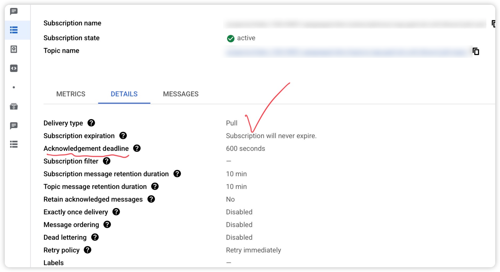

- [**Pub/Sub 消费性能相关核心指标**](#pubsub-消费性能相关核心指标)
    - [**✅ Pub/Sub 指标详细说明表格**](#-pubsub-指标详细说明表格)
    - [**✅ GCP Pub/Sub 消费监控指标详解**](#-gcp-pubsub-消费监控指标详解)
      - [Overview](#overview)
      - [Delivery Latency Health Score 各项指标](#delivery-latency-health-score-各项指标)
      - [pull](#pull)
- [unacked\_messages\_by\_region](#unacked_messages_by_region)
  - [**🔍 指标：**](#-指标)
  - [**unacked\_messages\_by\_region**](#unacked_messages_by_region-1)
    - [**✅** ](#)
    - [**指标定义说明**](#指标定义说明)
    - [**⚠️** ](#️)
    - [**当该指标不断增长时，典型含义**](#当该指标不断增长时典型含义)
    - [**📊 异常判断阈值参考**](#-异常判断阈值参考)
    - [**✅** ](#-1)
    - [**建议优化方向**](#建议优化方向)
    - [**📌 补充图示（可选）**](#-补充图示可选)
  - [StreamingPull](#streamingpull)
    - [**✅** ](#-2)
    - [**扩展 Scheduler Pod 的数量 == 增加 StreamingPull 并发能力**](#扩展-scheduler-pod-的数量--增加-streamingpull-并发能力)
    - [**📌 原因如下：**](#-原因如下)
    - [**✅ 补充一点细节（可调优）：**](#-补充一点细节可调优)
      - [**如果你已经用了 GCP 官方 Client（如 Java、Go 等），可以进一步增强并发：**](#如果你已经用了-gcp-官方-client如-javago-等可以进一步增强并发)
    - [**✅ 总结一句话：**](#-总结一句话)
- [streaming\_pull\_response\_count](#streaming_pull_response_count)
    - [方法一：通过Cloud Monitoring指标（最推荐）](#方法一通过cloud-monitoring指标最推荐)
    - [方法二：在GKE Pod内部进行网络分析（直接证据）](#方法二在gke-pod内部进行网络分析直接证据)
    - [方法三：启用高级gRPC日志记录（高级调试）](#方法三启用高级grpc日志记录高级调试)
- [send\_message\_count](#send_message_count)
  - [**✅ 先解释：**](#-先解释)
  - [**send\_message\_count = 8**](#send_message_count--8)
  - [ **表示什么？**](#表示什么)
  - [**✅ 情况背景**](#-情况背景)
  - [**✅ 当前问题：单个 Pod 是单线程处理**](#-当前问题单个-pod-是单线程处理)
  - [**✅ 如果你水平扩展为 10 个 Pod（仍是单线程处理）**](#-如果你水平扩展为-10-个-pod仍是单线程处理)
  - [**✅ 最佳实践建议**](#-最佳实践建议)
  - [**✅ 最后总结（是否堆积 = 投递速率 vs 消费能力）**](#-最后总结是否堆积--投递速率-vs-消费能力)
    - [**📌 补充说明**](#-补充说明)

# **Pub/Sub 消费性能相关核心指标** 
---
### **✅ Pub/Sub 指标详细说明表格**

以下是根据你提供的指标名称、单位、示例数值和细分类别，**完善后的 GCP Pub/Sub 消费端核心监控指标表格**，已按照 Markdown 表格格式整理，便于复制粘贴使用。

---

### **✅ GCP Pub/Sub 消费监控指标详解**

#### Overview

| **Metric 名称**                         | **单位**      | **示例值** | **指标说明**                                                       | **典型问题或异常含义**                       | **优化建议**                                           |
| --------------------------------------- | ------------- | ---------- | ------------------------------------------------------------------ | -------------------------------------------- | ------------------------------------------------------ |
| oldest_unacked_message_age              | 秒（s）       | 450s       | 当前订阅中**最老一条尚未 ack 的消息**的年龄（从被投递开始计）      | 消费严重滞后、线程不足或业务逻辑耗时过长     | 增加消费线程 / 缩短耗时 / 加快 ack                     |
| unacked_messages_by_region              | 条数          | 23         | 当前 region 内 **未被 ack 的消息数量**，即消息投递到客户端但未确认 | 表明 region 消费者处理能力不足，消息堆积     | 扩容消费者副本数 / 优化处理流程 / 负载均衡 region 流量 |
| Delivery metrics                        |               |            |                                                                    |                                              |
| ack_message_count                       | 条数/秒       | 1.75/s     | 成功 ack 的消息数量统计（可作为速率趋势观察）                      | ack 速率过低 ⇒ 可能导致积压                  | 增加处理线程 / 提升处理速率 / 优化错误处理             |
| publish_message_count                   | 条数/秒       | 2.00/s     | 向 topic 发布的消息速率                                            | 如果发布远快于消费速率 ⇒ 会堆积              | 评估消费能力与发布速率是否匹配                         |
| send_message_count                      | 条数/秒       | 1.95/s     | Pub/Sub 向订阅者发送的消息数（注意：发送 ≠ ack）                   | 消费者接收慢、限流或异常可能导致无法完整处理 | 配置流控、扩容服务端或客户端                           |
| ack_message_count_by_delivery_type.pull | 条数/秒       | 1.58/s     | 通过 Pull 模式成功 ack 的消息数量（只统计客户端 pull 的场景）      | Pull 消费能力不足或 ack 丢失                 | 增加线程数 / 优化客户端逻辑                            |
| publish_to_ack_delta                    | 秒（s）       | 650s       | 从 **消息发布** 到最终被 **ack** 的总耗时（端到端延迟）            | 整体系统处理延迟高，可能是消息处理流程慢     | 缩短业务流程、提升处理能力、控制消息发布速率           |
| pull_to_ack_delta                       | 秒（s）       | 520s       | 从客户端 **拉取消息** 到最终 ack 的耗时（排除 Pub 时间）           | 说明客户端处理慢或 ack 被延迟                | 优化消息处理逻辑，尽快 ack                             |
| bailable_bytes_by_region.retained_acked | 字节（Bytes） | 1.2MB      | 已被 ack 的消息但仍被保留的总数据大小（未过保留期）                | 正常缓存指标，仅反映 topic/region 存量       | 可用于存储成本估算或 topic 设置优化                    |
| bailable_bytes_by_region.unacked        | 字节（Bytes） | 2.8MB      | 当前未被 ack 的消息所占字节数（已投递到客户端，未确认）            | 消息堆积严重 ⇒ 内存压力或延迟 ack            | 控制 maxOutstandingBytes / 提升消费速率                |

---
在 Google Cloud Pub/Sub 中，监控中出现的两个重要指标：

- Publish to Ack Delta
- Pull to Ack Delta

这两个指标反映的是 消息生命周期内的延迟情况，并且以「相对当前时间为基准」来呈现，因此你会看到「以 0 为基线的正负值」，这不是 bug，而是这两个 metric 本身的特点。

一、基础定义（非字面）

|                      |                                                                                      |
| -------------------- | ------------------------------------------------------------------------------------ |
| 指标名称             | 含义（非字面）                                                                       |
| Publish to Ack Delta | 表示一条消息从被发布到 Pub/Sub Topic 到被客户端确认（ack）之间的时间差（相对现在）。 |
| Pull to Ack Delta    | 表示一条消息从被客户端拉取（pull）到被客户端确认（ack）之间的时间差（相对现在）。    |

关键点：这两个指标是“delta to now”，单位是秒，是相对现在的“负数”或“正数”表示“过去多久”或者“将来多久可能 ack”。

二、结合实际数据说明

✅ 举例：当前时间为

12:00:00

📌 情况 1：消息在 11:59:58 被发布，在 12:00:01 被 ack

|             |          |
| ----------- | -------- |
| 操作        | 时间戳   |
| publish     | 11:59:58 |
| ack（确认） | 12:00:01 |
| now（当前） | 12:00:00 |

Publish to Ack Delta = ack_time - publish_time = 3s

但实际监控图上你看到的 delta 是：

publish_to_ack_delta = -3s（代表距离现在 ack 还差 1 秒）

因为 Cloud Monitoring 是以“当前时间点 - 该消息生命周期事件的时间点”来衡量 delta，所以：

- 如果消息已经 ack，那么 delta 是负值（说明是过去发生的事）
- 如果消息还没 ack，那么 delta 是正值（代表你可能在未来某时间点 ack）

📌 情况 2：消息在 11:59:30 被 publish，但还没有被 ack

此时：

- Publish to Ack Delta ≈ +30s（还没 ack，系统预估还要多久 ack，或该消息还滞留中）

三、这两个指标的实际用途

✅ 1. 排查订阅者处理延迟（Subscriber Lag）

- publish_to_ack_delta 越大（比如 > 60s） → 表示订阅者处理消息存在明显延迟
- 正常的业务应该这个值是集中在某个负值段，比如 -3s ~ -10s 表示发布后几秒就 ack

✅ 2. 排查 Subscriber pull 后处理变慢

- pull_to_ack_delta 增大 → 表示你的 consumer 拉取到消息后处理时间变长，比如重试次数多、业务慢、线程池堵塞等

四、和消息堆积结合分析

如果你发现：

- unacked_message_count 持续增加
- publish_to_ack_delta 趋势往右上（变正，表示堆积时间拉长）
- pull_to_ack_delta 也在增加

则说明你的消费端能力不足、或者某些消息无法及时 ack，需要：

- 增加 pod 或线程池（提高并发消费）
- 检查代码中是否有长时间阻塞的逻辑
- 是否 ack 前存在异常、重试机制等

五、总结

|                      |                                     |                                |                                        |
| -------------------- | ----------------------------------- | ------------------------------ | -------------------------------------- |
| 指标                 | 描述                                | 监控图形态                     | 解读建议                               |
| publish_to_ack_delta | 从发布到被 ack 的延迟               | 负值为过去发生，正值为未来估算 | 持续增大可能有消费延迟或堆积           |
| pull_to_ack_delta    | 从客户端 pull 到 ack 的处理时间延迟 | 负值常见                       | 持续增大可能表示线程池耗尽、业务处理慢 |

如果你有 Cloud Monitoring 图像或值波动异常的截图，也可以贴给我一起分析具体指标异常趋势。


---

以下表格展示了 Google Cloud Pub/Sub 监控 Overview 页面中的关键指标及其含义和建议。

| Metric 名称                        | 单位    | 示例值   | 指标说明                                                                              | 典型问题或异常含义                                                                                                                    | 优化建议                                                                                                                                 |
| :--------------------------------- | :------ | :------- | :------------------------------------------------------------------------------------ | :------------------------------------------------------------------------------------------------------------------------------------ | :--------------------------------------------------------------------------------------------------------------------------------------- |
| Oldest unacked message age         | s       | 0        | 订阅中未确认（Unacknowledged）的最旧消息的年龄。                                      | 高值表明订阅者未能及时处理和确认消息，可能导致消息积压、延迟处理。                                                                    | 检查订阅者应用性能、错误日志、资源是否充足。考虑增加订阅者实例数量或提高处理并发度。检查订阅的确认截止时间（Ack deadline）设置是否合理。 |
| Unacked messages by region         | (Count) | 0        | 按区域统计的未确认消息数量。                                                          | 某个特定区域的未确认消息数量高，可能表明该区域的订阅者处理能力不足或存在问题。                                                        | 关注出现积压的区域，针对该区域的订阅者进行排查和优化。                                                                                   |
| **Delivery metrics**               |         |          | **消息传输相关指标集合，包含以下三个子指标：**                                        |                                                                                                                                       |                                                                                                                                          |
| - Ack message count                | /s      | 0.058/s  | 每秒被订阅者确认的消息数量。                                                          | 如果此值远低于“Sent message count”，表示消息虽然被发送但未被订阅者确认，可能存在处理慢或确认失败。                                    | 检查订阅者确认消息的逻辑是否正确高效，确保在成功处理后及时发送确认。排查订阅者错误。                                                     |
| - Publish message count            | /s      | 0.058/s  | 每秒发布到 Topic 的消息数量。                                                         | 此值代表消息生产者（Publisher）的吞吐量。如果低于预期，可能是生产者端发布速度受限。                                                   | 检查生产者应用的发布逻辑和性能，确认网络连接和授权是否正常。                                                                             |
| - Sent message count               | /s      | 0.058/s  | 每秒从 Topic 发送给订阅者的消息数量。                                                 | 此值代表 Pub/Sub 成功将消息发送给订阅者的吞吐量。如果此值远低于“Publish message count”，可能 Pub/Sub 到订阅者之间存在连接或配置问题。 | 检查订阅是否配置正确，订阅者是否处于运行状态并能接收消息。确保 Pub/Sub 服务帐户有权限发送消息给订阅端点（对于 Push 订阅）。              |
| Ack message count by delivery type | /s      | 0.0467/s | 按消息投递方式（Pull, Push 等）统计的确认消息数量。截图显示的是 Pull 方式的确认数量。 | 针对特定投递方式的确认数量低，表明该投递方式的订阅者处理或确认存在问题。                                                              | 如果是 Pull 订阅，检查拉取和确认逻辑；如果是 Push 订阅，检查 Push 端点的可用性和处理能力。                                               |
| Publish to ack delta               | s       | 0        | 消息从发布到被订阅者 _第一次_ 确认的平均时间间隔。                                    | 高值表示整个消息生命周期（发布、传输、订阅者处理、确认）的端到端延迟较高。                                                            | 综合分析其他指标（Unacked age, Ack count vs Sent count, Pull/Push to ack delta）来定位延迟发生的环节（发布、传输、订阅者处理）。         |
| Pull to ack delta                  | s       | 0        | 消息从被 Pull 订阅者拉取到被该订阅者确认的平均时间间隔。                              | 高值特别指出延迟发生在 Pull 订阅者端，即消息被拉取后未被及时处理和确认。                                                              | 重点优化 Pull 订阅者的消息处理逻辑，提高处理速度和并发度。确保在处理完成后立即发送确认。                                                 |
| Billable bytes by region           | B       | N/A      | 按区域统计的计费字节数（包括发布和订阅的数据量）。                                    | 计费字节数异常升高可能表明数据量意外增加，例如错误地重复发布或订阅大量消息。                                                          | 监控数据量增长趋势，排查应用是否存在重复发布或消费逻辑错误。评估是否需要压缩消息体。                                                     |

#### Delivery Latency Health Score 各项指标

| **Metric 名称**                    | **单位** | **示例值**     | **指标说明**                                              | **典型问题或异常含义**                         | **优化建议**                        |
| ---------------------------------- | -------- | -------------- | --------------------------------------------------------- | ---------------------------------------------- | ----------------------------------- |
| **Delivery latency health score**  |          |                | **指标集合，包含以下 5 个子指标：**                       |                                                |
| ack_latency                        | 毫秒     | 1              | 消息的确认延迟，表示消息被成功接收到后的处理时间          | 长时间延迟可能导致消息处理缓慢                 | 优化处理逻辑，减少处理时间          |
| expired_ack_deadlines              | 次       | 1              | 撤回过期的 Ack 截止时间，表示未在规定时间内确认的消息数量 | 使用者忽略了消息的处理，导致消息被撤回         | 调整 Ack 截止时间和处理速度         |
| nack_requests                      | 次       | 1              | 失败的确认请求计数，表示未成功确认的消息数量              | 消息未能得到确认可能表明处理失败               | 检查处理逻辑，确保正常确认          |
| seek_requests                      | 次       | 1              | 查找请求计数，表示客户端请求获取指定消息的数量            | 客户端在尝试查找消息时频繁请求可能导致性能问题 | 限制查找请求频率或优化查找逻辑      |
| utilization                        | 百分比   | 1              | 消息处理资源的利用率，表示资源使用的百分比                | 过高的利用率表明资源面临压力                   | 扩展资源或进行负载均衡              |
| Backlog bytes                      | 字节     | 0              | 当前待处理的消息字节数                                    | 如果该值持续增长，可能会导致性能下降           | 增加订阅者数量，改善消息处理速度    |
| Expired ack deadlines count        | 次       | 0              | 撤回过期的 Ack 截止时间计数                               | 过多的过期计数表示消息未被及时处理             | 调整订阅者处理速度，优化延迟        |
| **Ack latencies**                  | 毫秒     | 51.76ms (50th) | 确认延迟的百分位数                                        | 较高的延迟可导致整体性能下降                   | 识别并优化慢请求路径                |
| REDUCE_PERCENTILE_50 ack_latencies | 毫秒     | 51.76ms        | 50 百分位的 Ack 延迟                                      | 如果大于设定阈值，可能影响处理性能             | 进行性能监控和分析以优化处理时间    |
| REDUCE_PERCENTILE_95 ack_latencies | 毫秒     | 117.91ms       | 95 百分位的 Ack 延迟                                      | 较高的延迟表明出现性能瓶颈                     | 调整系统资源配置以改善性能          |
| REDUCE_PERCENTILE_99 ack_latencies | 毫秒     | 133.48ms       | 99 百分位的 Ack 延迟                                      | 表示极端情况下的延迟状况，需立即关注           | 对最差情况作出响应，查找 root cause |
| Seek request count                 | 次       | 0              | 查找请求的计数                                            | 频繁的请求可能导致性能问题                     | 减少不必要的查找请求                |

#### pull
- 

| **Metric 名称**            | **单位** | **示例值** | **指标说明**                                        | **典型问题或异常含义**               | **优化建议**                         |
| -------------------------- | -------- | ---------- | --------------------------------------------------- | ------------------------------------ | ------------------------------------ |
| Pull ack requests          | 次       | 0.0233     | 成功的 ack 请求计数，表示成功确认的消息数量         | 请求频繁失败可能导致消息未被确认     | 检查网络连接与处理逻辑，确保请求成功 |
| StreamingPull response     | 次/秒    | 0.0233     | 成功的 StreamingPull 响应计数，表示接收到的响应数量 | 响应延迟或失败可能导致消费者处理缓慢 | 优化处理逻辑，确保及时处理响应       |
| Open StreamingPull streams | 次       | 2          | 当前打开的 StreamingPull 流计数                     | 数量过多可能导致系统资源紧张         | 限制并发流数，确保性能               |
Number of open StreamingPull streams. If many streams are suspended, this could be a sign of throughput being limited due to quota limits or flow control from too many outstanding messages.
打开的StreamingPull流的数量。如果许多流被挂起，这可能是由于配额限制或太多未完成消息的流控制导致吞吐量受限的迹象。


---

# unacked_messages_by_region 

 unacked_messages_by_region              | 条数          | 23         | 当前 region 内 **未被 ack 的消息数量**，即消息投递到客户端但未确认 | 表明 region 消费者处理能力不足，消息堆积     | 扩容消费者副本数 / 优化处理流程 / 负载均衡 region 流量 |

## **🔍 指标：**

## **unacked_messages_by_region**

---

### **✅** 

### **指标定义说明**

|**项目**|**说明**|
|---|---|
|**名称**|unacked_messages_by_region|
|**含义**|某个 Region 中 **当前处于“已投递但尚未 ack”状态的消息数量**|
|**适用场景**|Pull 或 StreamingPull 模式下，用于监控消费者处理能力|
|**单位**|消息数|

这类消息仍然处于内存或 queue 中，尚未从系统中移除（未 acknowledge）。

---

### **⚠️** 

### **当该指标不断增长时，典型含义**

|**问题**|**说明**|
|---|---|
|✅ **消费速度 < 投递速度**|消费者处理太慢，积压增加|
|✅ **ack() 未被调用 / 超时未 ack**|消费者逻辑异常、崩溃、忘记调用 ack 或处理失败后未 ack|
|✅ **Pod 容量不足 / 消费线程阻塞**|例如单线程逻辑、网络调用阻塞、队列塞满|
|✅ **消息处理超出 ackDeadline**|导致消息重投，形成“反复堆积”现象|
|✅ **应用逻辑 Bug / 崩溃未 ack**|收到消息后处理异常但没有 failover 机制|

---

### **📊 异常判断阈值参考**

|**情况**|**判断依据**|
|---|---|
|🟡 **轻度积压**|数量逐渐增长，但处理率也在提升|
|🔴 **严重积压**|unacked_messages_by_region 快速增长，且 ack_message_count 明显滞后|
|🔥 **持续堆积**|数值数小时不下降，结合 oldest_unacked_message_age 已超过 ackDeadline 多轮|

---

### **✅** 

### **建议优化方向**

| **优化项**                       | **建议**                                                           |
| ----------------------------- | ---------------------------------------------------------------- |
| **增加 Pod 并发数量**               | 扩大 GKE 中 Pod 副本数（横向扩展）                                           |
| **开启并发 StreamingPull**        | 设置多个 StreamingPull stream（如 Java 中的 parallelPullCount）           |
| **优化消息处理逻辑**                  | 减少阻塞操作，使用异步 I/O、线程池、队列缓冲等                                        |
| **缩短每个消息处理时间**                | 减少不必要的远程调用、提高业务处理效率                                              |
| **合理设置 ackDeadline**          | 根据实际处理时间设置 ackDeadline（默认 10s，可调整）                               |
| **启用 Dead Letter Topic（DLT）** | 对连续失败的消息转移，避免不断重投                                                |
| **增加 metrics 报警**             | 设置 unacked_messages_by_region 和 oldest_unacked_message_age 的阈值报警 |
| **使用 flow control 限速拉取**      | 限制 pull 速率防止压垮后端服务或 OOM（部分客户端支持）                                 |

---

### **📌 补充图示（可选）**

  

你也可以在文档中用时序图表示 “未 ack 消息堆积” 的场景：


---


## StreamingPull
开启并发 StreamingPull 其实单独扩展schedule Pod的数量也就是扩展了并发能力?

在你当前架构中（每个 GKE Pod 内运行一个 StreamingPull 客户端）：

---

### **✅** 

### **扩展 Scheduler Pod 的数量 == 增加 StreamingPull 并发能力**

---

### **📌 原因如下：**

1. **每个 Pod** 一般会运行一个 Subscriber 客户端（或多个 stream，视具体设置）
    
    👉 每个客户端会与 Pub/Sub 建立一个 **独立的 gRPC StreamingPull 连接**
    
2. **更多 Pod = 更多连接 = 并发处理能力提升**
    
    👉 每个连接都会不断拉取并处理消息，天然实现并行处理
    
3. **实际效果：**
    
    - 如果你当前每秒只能 ack 5 条，扩展到 3 个 Pod 后，理论上可以 ack 到 15 条/s（取决于 CPU、I/O 和 backend 响应）
        
    - 可以显著减少 unacked_messages_by_region 和 oldest_unacked_message_age
        
    

---

### **✅ 补充一点细节（可调优）：**

  

#### **如果你已经用了 GCP 官方 Client（如 Java、Go 等），可以进一步增强并发：**

|**客户端设置项**|**含义**|**示例**|
|---|---|---|
|parallelPullCount|每个 Pod 内并行的 StreamingPull 流数量|setParallelPullCount(4)|
|maxAckExtensionPeriod|最大 ack 延长期限（避免误重试）|可设成 60s 或更长|
|flowControl.maxOutstandingMessages|控制未处理消息最大数|防止 OOM|
|executorThreadCount|消息处理线程数（内部 pool）|控制每条消息处理速度|

---

### **✅ 总结一句话：**

  

> **扩容 GKE Scheduler Pod = 水平扩展 StreamingPull 并发能力**，是你当前架构下最有效、无侵入的优化方法。

---

是否需要我把「扩容 Pod 增加 StreamingPull 并发」这个点整合进之前的 flow 图中？可以加一个可视化扩展解释。


你这个说法 基本是正确的，我来逐条解释、澄清，并补充更准确的理解：

⸻

✅ 你的说法逐条判断：

⸻

✅ 「每个 Pod 都是一个独立的客户端」

✔ 正确
	•	每个 Pod 都运行独立的 Pub/Sub Subscriber client
	•	每个 client 会与 Pub/Sub 建立独立的 gRPC StreamingPull 会话
	•	彼此之间不共享连接、ack buffer、stream 状态

⸻

✅ 「每个 Pod 都有自己的 ackDeadline」

✔ 正确（但理解略微拓展）
	•	ackDeadline 是 针对每条消息设置的，不是针对 Pod
	•	但由于每个 Pod 拉到的消息是各自处理的，因此你可以理解为每个 Pod 有自己一组 ackDeadline 在运行

例如：
	•	Pod A 拉到 message X，默认 ackDeadline 是 10s（或你设置的值）
	•	Pod B 拉到 message Y，另起一个 10s timer

每个 Pod 都负责自己拉到的消息的 ack 计时和续期（modAckDeadline）。

⸻

✅ 「如果一个 Pod 处理失败，其他 Pod 仍然可以继续处理消息」

✔ 正确
	•	Pub/Sub 是多客户端容错的，一个 Pod 崩溃或卡住，只影响它尚未 ack 的消息
	•	其他 Pod 的 gRPC 连接仍然活跃，可以继续消费
	•	出现失败时，该 Pod 拉到的消息会在 ackDeadline 超时后，重新变为可投递状态，交由其他 Pod 重新拉取

⸻

✅ 「这样会减少 subscription 的阻塞」

✔ 正确
	•	如果你只有一个 Pod，任何处理延迟、异常都可能阻塞整个 subscription 的消费
	•	多 Pod 并发消费，可以有效降低堆积风险、减少 unacked 消息数量，提高整体系统的弹性和可用性

⸻

✅ 总结（加强版）

| 特性 | 状态 | 说明 |
|------|------|------|
| 每个 Pod 是独立的 Subscriber 客户端 | ✅ | 建立独立 StreamingPull 会话 |
| 每条消息有自己的 ackDeadline，Pod 负责自己的消息 | ✅ | ack 是 per-message 的，逻辑上由 Pod 管理 |
| Pod 崩溃不影响其他 Pod | ✅ | 影响范围只限其未 ack 消息 |
| 多 Pod 并发能防止阻塞和堆积 | ✅ | 是扩展 StreamingPull 并发的推荐做法 |


⸻

如果你需要，我可以将这部分总结也加进前面那张 Mermaid 图中的注释区（Note），让整张图逻辑更完整、适合文档化引用。是否需要我再更新？

# streaming_pull_response_count

GKE 中部署一个专门用于处理调度的服务（称为 Schedule Service）。该服务订阅 Pub/Sub 消息并处理其中的内容 目前是pull的模式 他怎么知道的Pub Sub中subscription 有了对应的消息 需要他去pull 并处理？
这恰好触及了现代Pub/Sub客户端库工作方式的核心。您描述的“pull模式”在直觉上可能会让人以为Schedule Service需要定期去“轮询”Pub/Sub，看看有没有新消息。然而，实际情况要高效得多。

您的Schedule Service之所以能够近乎实时地知道有新消息需要处理，是因为它所使用的GCP Pub/Sub高级客户端库（例如Java、Go、Python等库）采用了一种称为**“流式拉取”（Streaming Pull）**的机制 1。

这个机制的工作流程如下：

1. **建立持久连接**：当您的Schedule Service启动时，其内嵌的Pub/Sub客户端库会主动与Google Pub/Sub后端服务建立一个或多个持久的、长轮询的gRPC连接（可以理解为一条持续开放的数据通道）2。这个连接会一直保持活跃状态，而不是每次需要消息时才临时建立。
    
2. **消息的实时流式传输**：一旦有新的消息发布到您的主题（Topic）并进入到Schedule Service所订阅的订阅（Subscription）中，Pub/Sub服务会**立即**通过这条已经建立好的持久连接，将消息主动地“流式”发送给您的客户端库 1。
    
3. **客户端内部处理**：客户端库接收到这些流式传输过来的消息后，会将它们放入一个内部的缓冲区，并使用一个专门的线程池来调用您编写的业务处理逻辑（即解析消息、调用Kong等操作）2。
    

**一个简单的类比：**

- **传统的轮询（Polling）**就像您每隔五分钟去邮局的信箱查看一次有没有新信件。您需要主动、反复地去检查。
    
- **流式拉取（Streaming Pull）**则更像是您和邮局之间有一条专用的气动管道。只要邮局一收到您的信件，就会立刻通过管道直接送到您手中。您不需要反复询问，信件会近乎实时地到达。
    

因此，您的Schedule Service**并不需要去猜测或轮询**何时有新消息。它通过维持一个“时刻准备着”的开放连接，让Pub/Sub服务能够在消息到达的第一时间就主动将消息推送过来 1。

这种“拉取”模式的“拉”体现在：是由您的客户端（Schedule Service）主动发起了这个连接的建立，并且客户端通过**流控（Flow Control）**设置，可以控制自己一次性最多愿意接收和处理多少消息，从而防止被突发的大量消息压垮 3。这与“推送”（Push）模式形成对比，在推送模式下，是Pub/Sub服务主动向一个您指定的公开HTTP(S)端点发送消息 1。

我们使用的是GCP Pub/Sub高级客户端库Java 那么有什么办法 我能核对到我这个持久链接
它触及了客户端库如何与GCP服务高效交互的核心。直接在应用或GKE层面“看到”这个持久连接的状态，不像查看一个简单的HTTP请求日志那么直观，但您完全可以通过几种方法来核实和验证它的存在与活动状态。

以下是您可以采用的三种主要方法，从最简单、最推荐的方法到更高级的调试技术：

### 方法一：通过Cloud Monitoring指标（最推荐）

这是验证流式拉取（Streaming Pull）连接是否活跃的最简单、最可靠且非侵入性的方式。如果您的客户端正在通过持久连接接收数据，相应的指标就会持续更新。

1. **关键指标**：`subscription/streaming_pull_response_count`
    
    - **含义**：这个指标统计了Pub/Sub服务通过流式拉取连接向您的订阅者客户端发送响应（即一批或多批消息）的次数 1。
        
    - **如何验证**：只要这个指标的计数在持续增加，就强有力地证明了您的Schedule Service与Pub/Sub之间存在一个活跃的、正在工作的流式拉取（gRPC）连接。如果连接断开或不工作，这个计数就会停止增长。
        
2. **如何查看**：
    
    - 前往Google Cloud控制台的 **Monitoring** > **Metrics Explorer**。
        
    - 在“Select a metric”中，选择资源类型为 `Pub/Sub Subscription`，然后选择指标 `Streaming pull response count` (`subscription/streaming_pull_response_count`)。
        
    - 按您的 `subscription_id` 进行筛选。
        
    - 您应该能看到一个图表，显示了随时间变化的响应计数。一个平稳或增长的图表就意味着连接是健康的。
        

### 方法二：在GKE Pod内部进行网络分析（直接证据）

这种方法可以提供连接存在的直接网络层面证据。您需要进入正在运行Schedule Service的Pod，并检查其网络连接。

1. **定位Pod并进入**：
    
    - 首先，获取您的Schedule Service Pod的名称：
        
        Bash
        
        ```
        kubectl get pods -l app=<your-app-label> 
        ```
        
    - 使用 `kubectl exec` 命令进入Pod的shell环境：
        
        Bash
        
        ```
        kubectl exec -it <your-pod-name> -- /bin/bash
        ```
        
2. **检查网络连接**：
    
    - 在Pod内部，使用网络工具（如 `netstat` 或 `ss`，您可能需要先通过`apt-get update && apt-get install -y net-tools`或`iproute2`来安装它们）来查看已建立的TCP连接。
        
    - 运行以下命令：
        
        Bash
        
        ```
        # 使用 netstat
        netstat -anp | grep ESTABLISHED
        
        # 或者使用更现代的 ss
        ss -t -p
        ```
        
    - **您要寻找的是**：一个到Pub/Sub gRPC端点的 `ESTABLISHED`（已建立）状态的连接。这个端点通常是 `pubsub.googleapis.com:443` 或其区域性变体（例如 `us-central1-pubsub.googleapis.com:443`）2。看到这样一条连接记录，就直接证明了您的Java应用已经成功与Pub/Sub建立并维持着一个持久的TCP连接。
        

### 方法三：启用高级gRPC日志记录（高级调试）

这是一种更深入的调试方法，适用于您需要排查具体连接问题（如频繁断开、握手失败等）的场景。Java Pub/Sub客户端库建立在gRPC之上，您可以配置Java的日志框架来显示来自gRPC库的底层日志。

1. **配置日志级别**：
    
    - 在您应用的日志配置文件中（例如 `logback.xml` 或 `log4j2.xml`），为gRPC相关的包（如 `io.grpc`）设置更详细的日志级别（如 `DEBUG` 或 `TRACE`）。
        
    - 这会输出大量关于gRPC连接生命周期的信息，包括连接建立、Keepalive心跳包、GoAway信号以及连接关闭等细节。
        
2. **分析日志输出**：
    
    - 当您的应用启动时，您会在日志中看到gRPC通道（channel）的创建和连接过程。
        
    - 在正常运行期间，您可能会看到周期性的Keepalive活动，这证明了连接正在被积极维护 3。
        

这种方法虽然强大，但会产生大量日志，通常仅在进行深度问题排查时使用。对于日常的健康状态验证，前两种方法更为实用。

**总结**：

- **首选方法**：使用 **Cloud Monitoring** 查看 `streaming_pull_response_count` 指标。这是最简单且最能反映业务活动的方式。
    
- **直接验证**：当您想获得确凿证据时，**在Pod内部使用 `netstat` 或 `ss`** 是最好的方法，它可以直接显示出活动的TCP连接。
    
- **深度调试**：当您怀疑连接本身存在问题时，可以启用 **gRPC日志** 来获取最详细的诊断信息。


# send_message_count

send_message_count = 8 的含义、它和你的单线程处理模型之间的关系，以及为什么**增加 Pod 数量确实可以解决堆积问题**。

---

## **✅ 先解释：**

## **send_message_count = 8**

##  **表示什么？**

这个指标表示：

> **Pub/Sub 服务端**向你的 **Subscription 的客户端（即你的 Schedule Service 实例）** 成功“发送消息”的速率，例如 8 条/秒。

注意：

- 它不代表你 ack 的数量
- 它不代表你 publish 的数量
- 它是 “Pub/Sub 服务端成功 push 给 client 进行消费”的速率

---

## **✅ 情况背景**

| **项目**           | **配置**                     |
| ------------------ | ---------------------------- |
| 服务名称           | Schedule Service             |
| 消费模型           | Pull 模式 + Streaming Pull   |
| 每个服务实例       | 单线程处理（即 1 个 worker） |
| 当前实例数         | 1 个 Pod                     |
| send_message_count | 8 msg/sec                    |

---

## **✅ 当前问题：单个 Pod 是单线程处理**

这意味着你 Schedule Service：

- **每次只能处理 1 条消息**
- 即使 Pub/Sub 向你发送了 8 条消息/秒，你也可能来不及处理
- 超出处理能力的消息会：
  - **积压在客户端内部内存队列**
  - 如果队列满了，还会导致 Pub/Sub 不再继续投递（流控）
  - 最终导致 **Unacked 增长，oldest_unacked_age 增长**

---

## **✅ 如果你水平扩展为 10 个 Pod（仍是单线程处理）**

| **指标**         | **扩容前（1 Pod）** | **扩容后（10 Pod）** |
| ---------------- | ------------------- | -------------------- |
| 总线程数         | 1                   | 10                   |
| 理论最大消费速率 | ~1 msg/sec          | ~10 msg/sec          |
| 消息积压情况     | 会积压              | 缓解或解决           |
| Pub/Sub 投递速率 | 受客户端能力影响    | 服务端可持续投递     |

👉 **你配置了 10 个 Pod，每个独立连接 Pub/Sub Subscription，会并行消费**，因此：

> ✅ 只要你的 send_message_count（例如 8 msg/sec） **小于等于 Pod 总处理能力（10 msg/sec）**，堆积问题就会显著下降甚至消失。

---

## **✅ 最佳实践建议**

| **项目**                      | **建议**                                        |
| ----------------------------- | ----------------------------------------------- |
| 单实例内并发处理              | 考虑设置 executorThreadCount > 1，启用多线程    |
| Pod 水平扩容                  | 如果服务是单线程的，建议增加 Pod 数量以水平扩容 |
| 配置 maxOutstandingMessages   | 每个实例避免积压时 OOM                          |
| 指标设置告警                  | 例如 oldest_unacked_age > 300s 告警             |
| 开启 DLQ（Dead Letter Queue） | 避免问题消息反复拉取影响其他正常处理            |

---

## **✅ 最后总结（是否堆积 = 投递速率 vs 消费能力）**


---

如果你希望继续优化性能，我可以帮你：

- 对比多线程 vs 多实例的吞吐模型
- 推荐一个自动 HPA 扩容策略
- 提供可观测的 Prometheus Dashboard 模板

是否需要我继续？

---

### **📌 补充说明**

- **unacked 和 bailable** 是衡量系统是否积压的关键指标。
- **pull_to_ack delta** 是你 Schedule Service 性能瓶颈的重要参考。
- **oldest_unacked_message_age** 是“长时间未处理消息”的告警信号。

---

太好了，下面我为你**新增一张补充图**，描述：

  

> **当 Pub/Sub 消费能力下降时，指标如何变化、告警如何触发、如何触发自动扩容调度服务（Pod）的完整演化流程**

---

## **✅** 

## **Pub/Sub 消费指标演化 + 告警响应 + Pod 扩容自动修复流程**


---

### **🔍 流程解读：**

|**节点**|**含义**|
|---|---|
|B C D|代表常见问题堆积指标：**消息未 ack 数上升、最老未 ack 时间增长、ack 数下降**|
|E|告警触发点，可在 Cloud Monitoring 中设定阈值|
|F|通知值班人员|
|G|同时可触发 **GKE HPA（Horizontal Pod Autoscaler）或 KEDA**|
|H → I|Pod 扩容即增加 StreamingPull 并发能力|
|J → K|ack rate 恢复，堆积减缓，系统稳定|

---

### **✅ 推荐设置的 Cloud Monitoring 告警项**

|**指标名**|**建议阈值**|**告警等级**|
|---|---|---|
|unacked_messages_by_region|≥ 500（持续 5 分钟）|高|
|oldest_unacked_message_age|≥ 60 秒|高|
|ack_message_count vs send_message_count|ack/send 比例 < 0.6|中|
|scheduler pod CPU usage|< 40%（未触发扩容）|提醒（需检查限流）|

---

如你希望我将 **sequenceDiagram 和 flow diagram 合成一个 Markdown 文档片段** 或导出为 **团队 Wiki 模板格式**，也可以帮你生成。是否继续？