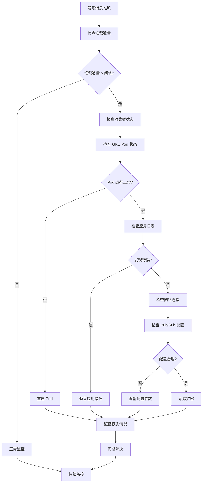

# summary

- Streaming Pull：使用 Streaming Pull 时，消息以流式方式交付 是不是这种情况下 只能通过 Java Client 的方式来 ACK 消息.gcloud 命令就不行了

# About Streaming Pull + Ack

在 **使用 Pub/Sub 的 Streaming Pull 模式时**，**确实只能通过客户端代码（如 Java 客户端）来执行 ACK 操作**，而 **gcloud 命令是无法用于 ACK 这类消息的**。

---

## **✅ 原因说明：**

### **📌 Streaming Pull 特性：**

- 是通过 gRPC 长连接持续接收消息的机制。
- 一般用于 GKE、Cloud Run 等服务端容器持续消费场景。
- 消息在被客户端处理后，需由客户端 **显式调用 ack() 方法** 进行确认。

---

## **❌ 为什么** 

## **gcloud**

##  **命令不适用：**

gcloud pubsub subscriptions pull 是针对 **Pull 模式的订阅者**，它：

- 通过 REST API 发起一次性拉取请求；
- 只处理当前请求中返回的消息；
- 不感知 gRPC Streaming Pull 的连接上下文；
- 无法获取 Streaming Pull 已缓存/处理中的 ackId 列表。

> 因此无法通过 gcloud 命令去 ack Streaming Pull 模式下接收到的消息。

---

## **✅ 正确做法（以 Java 为例）：**

```
subscriber = Subscriber.newBuilder(subscriptionName, (message, consumer) -> {
    try {
        // 处理消息
        System.out.println("Received: " + message.getData().toStringUtf8());

        // 确认成功
        consumer.ack();  // ✅ 只此处有效
    } catch (Exception e) {
        // 处理失败（可选）
        consumer.nack(); // ❌ 会导致消息重投
    }
}).build();

subscriber.startAsync().awaitRunning();
```

---

## **🔄 补充：**

| **操作**                                | **Pull 模式支持** | **Streaming Pull 支持** |
| --------------------------------------- | ----------------- | ----------------------- |
| gcloud pubsub subscriptions pull        | ✅ 是             | ❌ 否                   |
| gcloud pubsub subscriptions ack         | ✅ 是（需 ackId） | ❌ 否                   |
| 客户端 ack/nack 方法（Java、Python 等） | ✅ 是             | ✅ 是                   |
| Metrics (ack_count 等) 监控支持         | ✅ 是             | ✅ 是                   |

---

如你正在使用 GKE + Java，确保设置合适的：

- executorThreads（并发线程数）
- maxAckExtensionPeriod（最大延长时间）
- ackDeadline（订阅配置的 ack 超时）

可以帮你自动生成完整配置示例或 dashboard 面板模板，如有需要可继续告知。

## Grok

是的，在使用 **Streaming Pull** 的场景下，消息的确认（ACK）主要通过 **Pub/Sub 客户端库**（如 Java Client）来实现，`gcloud` 命令无法直接用于确认（ACK）或处理 Streaming Pull 的消息。以下是详细分析和说明：

### 为什么 `gcloud` 命令无法直接 ACK 消息？

1. **Streaming Pull 的工作机制**：

    - Streaming Pull 是通过 Pub/Sub 客户端库建立一个长期的 gRPC 流式连接，从订阅中实时拉取消息。
    - 客户端库负责接收消息、处理消息，并通过 API 调用（如 `acknowledge` 方法）确认消息（ACK）或拒绝消息（NACK）。
    - 消息的确认逻辑是动态的，依赖于客户端的处理结果，而 `gcloud` 命令是静态的命令行工具，主要用于管理和配置 Pub/Sub 资源（如主题、订阅、快照等），不适合处理实时消息流。

2. **gcloud 的局限性**：
    - `gcloud pubsub` 命令主要用于管理 Pub/Sub 资源（如创建/删除主题、订阅，调整配置，使用 `seek` 重放消息等）。
    - 没有提供直接操作消息内容或确认消息的命令，因为这些操作需要实时交互，而 `gcloud` 更适合批量或配置管理任务。

### Streaming Pull 下如何确认（ACK）消息？

在 Streaming Pull 模式下，确认消息需要通过 Pub/Sub 客户端库（如 Java 客户端）实现。以下是 Java 客户端的典型流程：

1. **设置 Streaming Pull 订阅**：

    - 使用 Google Cloud Pub/Sub Java 客户端库配置订阅。
    - 示例代码（Java）：

        ```java
        import com.google.cloud.pubsub.v1.AckReplyConsumer;
        import com.google.cloud.pubsub.v1.MessageReceiver;
        import com.google.cloud.pubsub.v1.Subscriber;
        import com.google.pubsub.v1.ProjectSubscriptionName;
        import com.google.pubsub.v1.PubsubMessage;

        public class StreamingPullExample {
            public static void main(String... args) throws Exception {
                String projectId = "your-project-id";
                String subscriptionId = "your-subscription-id";
                ProjectSubscriptionName subscriptionName = ProjectSubscriptionName.of(projectId, subscriptionId);

                MessageReceiver receiver =
                    (PubsubMessage message, AckReplyConsumer consumer) -> {
                        // 处理消息
                        System.out.println("Received message: " + message.getData().toStringUtf8());
                        // 确认消息
                        consumer.ack();
                    };

                Subscriber subscriber = null;
                try {
                    subscriber = Subscriber.newBuilder(subscriptionName, receiver).build();
                    subscriber.startAsync().awaitRunning();
                    System.out.println("Subscriber is running");
                    // 保持运行以接收消息
                    Thread.sleep(60000);
                } finally {
                    if (subscriber != null) {
                        subscriber.stopAsync();
                    }
                }
            }
        }
        ```

    - 在 `MessageReceiver` 的回调中，通过 `consumer.ack()` 确认消息已处理，或 `consumer.nack()` 拒绝消息（重新排队）。

2. **多线程环境**：

    - 在您的场景（GKE + Java + Streaming Pull + 多线程），Java 客户端会自动处理多线程并发拉取消息。
    - 确保线程安全，例如使用线程池或同步机制，避免竞争条件导致消息未被正确确认。
    - 示例配置多线程：
        ```java
        Subscriber subscriber = Subscriber.newBuilder(subscriptionName, receiver)
            .setParallelPullCount(4) // 设置并发拉取线程数
            .build();
        ```

3. **错误处理**：
    - 如果消息处理失败，建议通过 `consumer.nack()` 将消息重新排队，或结合死信主题（dead-letter topic）处理无法处理的消息。
    - 示例设置死信主题（通过 `gcloud` 配置）：
        ```
        gcloud pubsub subscriptions create SUBSCRIPTION_ID --topic=TOPIC_ID --dead-letter-topic=DEAD_LETTER_TOPIC_NAME --max-delivery-attempts=5
        ```

### 什么时候使用 `gcloud` 命令？

虽然 `gcloud` 无法直接 ACK 消息，但在以下场景中可以辅助管理 Streaming Pull 的消息堆积：

1. **查看堆积消息数量**：

    - 使用 Cloud Monitoring 检查未确认消息数量：
        ```
        fetch pubsub_subscription
        | metric 'pubsub.googleapis.com/subscription/num_undelivered_messages'
        | filter (resource.subscription_id == 'YOUR_SUBSCRIPTION_ID')
        | group_by 1m, [value_num_undelivered_messages_sum: sum(value.num_undelivered_messages)]
        ```
    - 这可以帮助判断 Streaming Pull 是否因处理延迟导致消息堆积。

2. **重放或清除消息（Seek）**：

    - 如果需要批量清除未确认消息，可以使用 `seek` 命令将订阅时间戳设置为未来时间：
        ```
        gcloud pubsub subscriptions seek SUBSCRIPTION_ID --time=2025-07-04T12:00:00Z
        ```
    - 注意：此操作会将所有未确认消息标记为已确认，需谨慎使用。

3. **调整订阅配置**：
    - 修改重试策略：
        ```
        gcloud pubsub subscriptions update SUBSCRIPTION_ID --min-retry-delay=10s --max-retry-delay=600s
        ```
    - 配置死信主题：
        ```
        gcloud pubsub subscriptions update SUBSCRIPTION_ID --dead-letter-topic=DEAD_LETTER_TOPIC_NAME --max-delivery-attempts=5
        ```

### 总结

- **Streaming Pull 下确认消息**：必须通过 Pub/Sub 客户端库（如 Java Client）的 `ack()` 方法实现，`gcloud` 命令无法直接 ACK 消息。
- **gcloud 的作用**：用于管理 Pub/Sub 资源（如主题、订阅配置、快照）或批量操作（如 `seek` 清除消息），适合诊断和配置调整。
- **建议**：
    - 在 Java 应用中，确保正确实现 `ack()` 和 `nack()` 逻辑，结合死信主题处理失败消息。
    - 使用 Cloud Monitoring 定期检查消息堆积情况。
    - 在 GKE 多线程环境中，调整 `setParallelPullCount` 和线程池大小以优化性能。

如果您需要更具体的 Java 代码示例（例如处理死信主题或错误重试逻辑），请告诉我，我可以进一步提供代码或优化建议！

# Gemini Deepsearch

# GCP Pub/Sub 消息队列运维与深度诊断权威指南

本报告旨在为在 Google Kubernetes Engine (GKE) 环境中，使用 Java 和 Streaming Pull 模式管理 Google Cloud Pub/Sub 的开发与运维团队，提供一份详尽的操作与诊断指南。内容涵盖从基础命令到高级故障排查的全链路技术，重点解决消息积压的识别、分析与清理，并结合您的技术栈提供针对性的优化建议。

## 第一部分：基础 `gcloud pubsub` 操作：命令行入门

在深入探讨复杂场景之前，必须先建立一套坚实的 `gcloud` 命令行操作基础。这部分将回顾 Pub/Sub 的核心概念，并提供管理其基本资源（Topic 和 Subscription）的标准命令。

### 核心概念回顾

- **Topic (主题):** 发布者（Publisher）发送消息的命名资源。可以将其理解为一个消息通道或信息源 1。
- **Subscription (订阅):** 代表从一个特定主题流向订阅者应用程序的消息流的命名资源。一个主题可以有多个订阅，从而实现消息的扇出（fan-out）分发 1。
- **Message (消息):** 发布者发送到主题，并最终投递给订阅者的数据单元，由数据本身和可选的属性（attributes）组成 6。

### 管理 Topic (消息通道)

- **列出 Topic:** 查看项目中的所有主题，是进行资源盘点和编写自动化脚本的基础。
    - 命令: `gcloud pubsub topics list` 1。
    - 高级用法: 当主题数量庞大时，可使用 `--limit`、`--page-size` 和 `--filter` 标志进行分页和筛选 9。
- **描述 Topic:** 获取单个主题的详细信息，包括其配置、关联的 schema 以及标签等。
    - 命令: `gcloud pubsub topics describe TOPIC_ID` 10。
- **创建 Topic:**
    - 命令: `gcloud pubsub topics create TOPIC_ID` 1。
    - 背景: 这是构建任何新消息流的第一步。在创建时可以配置消息保留时长、客户管理的加密密钥（CMEK）等高级属性 3。
- **删除 Topic:**
    - 命令: `gcloud pubsub topics delete TOPIC_ID` 10。
    - 注意: 删除一个仍有关联订阅的主题，会导致这些订阅进入“游离”状态，其 `topic` 字段会变为 `_deleted-topic_`。这种情况可能引发混淆，需要对这些订阅进行额外的手动清理 12。

### 管理 Subscription (消费者入口)

- **列出 Subscription:** 查看项目中的所有订阅，或与特定主题关联的订阅。
    - 命令 (项目内所有): `gcloud pubsub subscriptions list` 4。
    - 命令 (特定主题): `gcloud pubsub topics list-subscriptions TOPIC_ID` 10。
- **描述 Subscription:** 这是一个至关重要的诊断命令。它能揭示订阅的详细配置，如确认截止时间（`ackDeadlineSeconds`）、推送/拉取模式、重试策略以及死信队列设置 5。
    - 命令: `gcloud pubsub subscriptions describe SUBSCRIPTION_ID`。
- **创建 Subscription:**
    - 命令: `gcloud pubsub subscriptions create SUBSCRIPTION_ID --topic=TOPIC_ID` 1。
    - 背景: 针对您的使用场景（Streaming Pull），主要创建的是拉取型订阅。创建时的关键标志包括 `--ack-deadline` 以及后续将详述的死信策略相关标志 16。
- **更新 Subscription:** 修改现有订阅的属性，例如调整确认截止时间或更新死信策略。
    - 命令: `gcloud pubsub subscriptions update SUBSCRIPTION_ID --ack-deadline=30` 17。
- **删除 Subscription:**
    - 命令: `gcloud pubsub subscriptions delete SUBSCRIPTION_ID` 18。
    - 注意: 删除操作是永久性的，无法撤销。订阅中所有未确认的消息都将永久丢失 18。在考虑将此操作作为“清空队列”的手段时，必须充分认识到其不可逆的后果。

### 关于 IAM (身份与访问管理)

所有 `gcloud` 命令的执行都需要适当的 IAM 权限。`roles/pubsub.editor` 角色提供了广泛的管理权限，而 `roles/pubsub.viewer` 则提供只读访问权限 4。在生产环境中，应遵循最小权限原则。例如，一个只负责发布消息的服务账号仅需

`roles/pubsub.publisher` 角色，而一个只消费消息的服务账号仅需 `roles/pubsub.subscriber` 角色 20。

### `gcloud pubsub` 命令快速参考

下表汇总了最常用的 `gcloud pubsub` 命令，以便快速查阅。

| 资源         | 操作     | `gcloud` 命令示例                                                                 |
| ------------ | -------- | --------------------------------------------------------------------------------- |
| Topic        | 列出     | `gcloud pubsub topics list`                                                       |
| Topic        | 描述     | `gcloud pubsub topics describe my-topic`                                          |
| Topic        | 创建     | `gcloud pubsub topics create my-topic`                                            |
| Topic        | 删除     | `gcloud pubsub topics delete my-topic`                                            |
| Topic        | 发布消息 | `gcloud pubsub topics publish my-topic --message "Hello"`                         |
| Subscription | 列出     | `gcloud pubsub subscriptions list`                                                |
| Subscription | 描述     | `gcloud pubsub subscriptions describe my-subscription`                            |
| Subscription | 创建     | `gcloud pubsub subscriptions create my-subscription --topic=my-topic`             |
| Subscription | 删除     | `gcloud pubsub subscriptions delete my-subscription`                              |
| Subscription | 拉取消息 | `gcloud pubsub subscriptions pull my-subscription --limit=10`                     |
| Subscription | 确认消息 | `gcloud pubsub subscriptions ack my-subscription --ack-ids="ack_id_1,ack_id_2"`   |
| Subscription | 重置积压 | `gcloud pubsub subscriptions seek my-subscription --time=...` 或 `--snapshot=...` |
| Snapshot     | 列出     | `gcloud pubsub snapshots list`                                                    |
| Snapshot     | 创建     | `gcloud pubsub snapshots create my-snapshot --subscription=my-subscription`       |
| Snapshot     | 删除     | `gcloud pubsub snapshots delete my-snapshot`                                      |

## 第二部分：诊断消息积压：量化积压状况

本节旨在提供一套完整的工具和知识体系，用于监控订阅的健康状况，识别消息积压的形成，并理解不同积压模式背后的根本原因。这是进行有效故障排查的核心诊断步骤。

### 两个关键指标

消息积压并非单一维度的问题，它同时具有“规模”和“时效性”两个维度。Cloud Monitoring 提供了两个核心指标来精确度量这两个方面 21。

- **`pubsub.googleapis.com/subscription/num_undelivered_messages`**: 订阅积压中未确认消息的数量。这个指标反映了积压的**规模**。一个持续高企的数值表明消费者的处理速度跟不上消息的发布速度 24。
- **`pubsub.googleapis.com/subscription/oldest_unacked_message_age`**: 积压中最早一条未确认消息的年龄（以秒为单位）。这个指标反映了积压的**陈旧程度**。一个持续很高或不断增长的数值是一个严重的警告信号，表明某些消息可能被“卡住”无法处理，或者整体处理延迟极高 24。

### 查询指标的方法

- **通过 Cloud Console:** 在 Pub/Sub 订阅的详情页面，有一个“指标”标签页，其中提供了针对上述关键指标的预构建图表，可以进行快速的目视检查 30。
- **通过 Metrics Explorer 和 MQL:** 对于更深入的分析，可以使用 Metrics Explorer 构建自定义图表，或使用监控查询语言 (MQL) 进行精确查询 21。
    - **示例 MQL 查询 (获取特定订阅的未投递消息数):**
        代码段
        ```
        fetch pubsub_subscription

        ```

| metric 'pubsub.googleapis.com/subscription/num_undelivered_messages'

| filter (resource.subscription_id == 'your-subscription-id')

| group_by 1m, [value_num_undelivered_messages_mean: mean(value.num_undelivered_messages)]

| every 1m

26

### 解读积压模式的因果链

指标本身只是数据，真正的价值在于解读它们。如果 `num_undelivered_messages` 很高但 `oldest_unacked_message_age` 很低，这意味着什么？如果两者都持续增长，又意味着什么？通过综合分析，可以构建一个诊断流程图。

- **场景一: `num_undelivered_messages` 和 `oldest_unacked_message_age` 同时增长**
    - **诊断:** 系统性的消费者性能瓶颈。订阅者的整体处理能力已无法跟上消息的发布速率。
    - **可能原因 (结合您的 GKE/Java 技术栈):**
        1. **消费者资源不足:** GKE Pod 遭遇了 CPU 或内存的限制与节流 (throttling)，导致处理能力下降（详见第六部分）27。
        2. **下游依赖瓶颈:** Java 应用程序在等待一个缓慢的数据库查询或外部 API 调用，阻塞了消息处理线程。
        3. **代码效率低下:** 近期部署的代码变更引入了性能回归，降低了消息处理逻辑的效率 25。
- **场景二: `num_undelivered_messages` 稳定在较高水平，而 `oldest_unacked_message_age` 持续增长**
    - **诊断:** “毒丸”消息 (Poison Pill) 或特定消息处理失败。大部分消息都能被正常处理，但有一条或几条特定的消息导致消费者程序出错、主动 `nack()` 消息，或使其确认超时。随后 Pub/Sub 会重新投递该消息，形成恶性循环。
    - **可能原因:**
        1. 消息体格式错误，例如一个畸形的 JSON，导致 Java 代码无法解析。
        2. 某条消息的内容触发了消费者逻辑中的一个特定 bug 或未处理的异常。
        3. 消费者代码反复对某条消息调用 `nack()`，这明确地指示 Pub/Sub 重新投递该消息 27。
- **场景三: `num_undelivered_messages` 出现短暂尖峰后恢复正常**
    - **诊断:** 瞬时流量突增。这通常是正常现象，也正是 Pub/Sub 这类消息系统设计的目的所在——削峰填谷。系统吸收了流量洪峰，消费者随着时间推移会逐步赶上处理进度。
    - **应对:** 通常无需干预，除非恢复时间超出了业务的服务等级目标 (SLO)。通过调整消费者客户端的流控设置可以更好地应对这种情况 25。

### 建立主动告警

利用 Cloud Monitoring 为关键指标创建告警策略。例如，当 `oldest_unacked_message_age` 超过一个设定的阈值（如 600 秒）时触发告警，因为这几乎总是问题的征兆 30。

### 关键 Pub/Sub 监控指标

| 指标名称             | MQL 标识符                                                         | 描述                                             | 运维洞察                                                                                       |
| -------------------- | ------------------------------------------------------------------ | ------------------------------------------------ | ---------------------------------------------------------------------------------------------- |
| 未确认消息数         | `pubsub.googleapis.com/subscription/num_undelivered_messages`      | 订阅中未被确认的消息总数。                       | **积压规模**：反映消费者是否能跟上发布速率。持续增长表示处理能力不足。                         |
| 最老未确认消息年龄   | `pubsub.googleapis.com/subscription/oldest_unacked_message_age`    | 订阅中最老一条未确认消息的年龄（秒）。           | **积压健康度**：反映消息处理的停滞情况。持续增长是严重警报，可能存在“毒丸”消息或处理完全阻塞。 |
| 推送请求计数         | `pubsub.googleapis.com/subscription/push_request_count`            | （适用于 Push 订阅）按响应码分组的推送尝试次数。 | **推送端点健康度**：高错误码率（如 5xx）直接导致消息积压。                                     |
| 投递延迟健康分       | `pubsub.googleapis.com/subscription/delivery_latency_health_score` | 一个综合分数，衡量订阅的投递延迟健康状况。       | **延迟根因分析**：帮助识别导致投递延迟增加的因素 30。                                          |
| 确认截止日期过期计数 | `pubsub.googleapis.com/subscription/expired_ack_deadlines_count`   | 消息因超出确认截止时间而过期的次数。             | **处理超时**：该值非零表示消费者处理消息过慢，或客户端流控设置不当，导致消息被重复投递。       |

## 第三部分：窥探队列内部：手动消息检查

本节将提供安全有效的方法，用于手动拉取和检查订阅中的单个消息。这对于调试在上一节中识别出的“毒丸”消息场景至关重要。

### `gcloud pubsub subscriptions pull` 命令深度解析

该命令是进行手动检查的主要工具 1。

- **默认行为:** 默认情况下，`pull` 命令**不会**确认消息。它会返回消息的数据、属性以及一个唯一的 `ackId` 1。消息在订阅中保持未确认状态，并在其确认截止时间（ack deadline）到期后被重新投递。这对于检查至关重要，因为它允许您在不“消费”消息的情况下“窥视”其内容。
    - 命令: `gcloud pubsub subscriptions pull YOUR_SUBSCRIPTION_ID --limit=1`
- **自动确认:** `--auto-ack` 标志用于在一个步骤中完成拉取和消费。这对于简单的消费脚本很有用，但在生产订阅上进行调试时应谨慎使用 1。
    - 命令: `gcloud pubsub subscriptions pull YOUR_SUBSCRIPTION_ID --limit=1 --auto-ack`
- **格式化输出:** 使用 `--format` 标志可以仅提取消息数据，以便于查看或处理。请注意，返回的数据是 Base64 编码的，需要进行解码 35。
    - 获取解码后数据的命令: `gcloud pubsub subscriptions pull YOUR_SUBSCRIPTION_ID --format="value(message.data)" | base64 -d`

### “间谍订阅”技术：实现安全的实时调试

在调试实时系统时，一个主要挑战是检查消息（即拉取它）会暂时将其从队列中移除，从而阻止了真正的消费者接收它。这会干扰您正在尝试调试的系统。要解决这个问题，可以利用 Pub/Sub 主题向其所有订阅广播消息的特性。通过为同一主题创建一个临时的、额外的订阅，可以实现对消息流的无侵入式观察。这个“间谍”订阅将接收到自其创建之后发布的所有消息的副本，从而允许安全地拉取和检查，而不会影响主应用程序的订阅 36。

- **分步操作流程:**
    1. 识别问题订阅的主题:

        gcloud pubsub subscriptions describe PRIMARY_SUB_ID --format="value(topic)"

    2. 为该主题创建一个临时的“间谍”订阅:

        gcloud pubsub subscriptions create spy-subscription --topic=TOPIC_ID 36

    3. 发布一条测试消息，或等待一条有问题的消息被发布。
    4. 从间谍订阅中安全地拉取消息进行检查:

        gcloud pubsub subscriptions pull spy-subscription --limit=1

    5. 调试完成后，删除间谍订阅，以避免不必要的资源消耗和消息积压:

        gcloud pubsub subscriptions delete spy-subscription

### 精确控制：手动确认消息

在使用不带 `--auto-ack` 的 `pull` 命令检查消息后，您可能会决定需要从队列中移除它。这可以通过 `ack` 命令和从 `pull` 响应中获取的 `ackId` 来完成。

- 命令: `gcloud pubsub subscriptions ack YOUR_SUBSCRIPTION_ID --ack-ids=ACK_ID_FROM_PULL_COMMAND` 1
- **应用场景:** 此方法非常适合在通过检查识别出一条已知的“毒丸”消息后，手动将其移除。

## 第四部分：清理与清除消息积压的策略

本节旨在提供清晰、可操作的策略，用于清除订阅中积压的所有未确认消息，并对两种主要方法及其影响进行深入比较。

### 注意：Pub/Sub 没有直接的 `purge` 命令

一个常见的误解是寻找一个类似 `purge` 或 `clear` 的命令来清空队列。然而，Pub/Sub 并未提供这样的直接命令 37。清除积压消息的机制是间接但功能强大的。主要有两种方法：使用

`seek` 操作重置到某个时间点，以及删除并重建订阅。理解这两种策略的差异至关重要。

### 方法一：使用 `gcloud pubsub subscriptions seek` 进行精确清除

- **概念:** `seek` 操作可以修改订阅中消息的确认状态。通过 `seek` 到一个特定的时间戳，您可以有效地将所有在该时间点之前发布的消息标记为“已确认”，从而将它们从待投递的积压中移除 37。
- **清除所有未确认消息:** `seek` 到当前时间或未来的某个时间点。这个操作的语义是：“将截至此刻收到的所有消息都视为已确认，不要再投递它们。”
    - 命令 (使用未来一分钟的时间戳): `gcloud pubsub subscriptions seek YOUR_SUBSCRIPTION_ID --time=$(date -u -d'1 minute' +%Y-%m-%dT%H:%M:%SZ)` 37
- **影响:** 这是一个对订阅的“就地”修改。它通常速度很快，并保留了订阅的所有配置和身份标识。这是推荐的、最安全的清除积压的方法。

### 方法二：“核弹”选项 - 删除并重建订阅

- **概念:** 删除一个订阅会永久性地移除它及其积压的所有未确认消息 18。然后用相同的名称和配置重新创建一个新的订阅，可以实现“从零开始”。
- **操作流程:**
    1. `gcloud pubsub subscriptions delete YOUR_SUBSCRIPTION_ID` 18
    2. `gcloud pubsub subscriptions create YOUR_SUBSCRIPTION_ID --topic=YOUR_TOPIC_ID [..其他配置标志..]` 1
- **关键影响与风险:**
    - **全新实体:** 新创建的订阅与旧订阅完全无关，不继承任何历史状态 18。
    - **重建延迟与错误:** 在删除后立即用同名重建资源，可能会遇到短暂的延迟或 API 错误 13。这可能导致消费者在短时间内无法连接，造成服务中断。
    - **消息丢失风险:** 在订阅被删除和重新创建之间的这个时间窗口内，发布到主题的任何消息都将对这个订阅丢失，除非主题本身配置了消息保留 41。

### 积压清理方法对比 (`seek` vs. `delete/recreate`)

| 特性             | 方法一: `seek --time`                                        | 方法二: `delete` & `recreate`                                                                          |
| ---------------- | ------------------------------------------------------------ | ------------------------------------------------------------------------------------------------------ |
| **命令**         | `gcloud pubsub subscriptions seek my-sub --time=...`         | gcloud pubsub subscriptions delete my-sub<br><br>gcloud pubsub subscriptions create my-sub --topic=... |
| **对积压的影响** | 将指定时间前的所有消息标记为已确认，从队列中移除。           | 永久删除整个订阅，包括所有积压消息。                                                                   |
| **消息丢失风险** | 低。仅影响该订阅内的消息状态，不影响主题。                   | **高**。在删除和重建期间发布的消息会丢失。                                                             |
| **服务中断**     | 无。操作是就地的，消费者连接不受影响。                       | 有。存在短暂的订阅不可用窗口。                                                                         |
| **风险等级**     | **低**                                                       | **高**                                                                                                 |
| **理想应用场景** | **推荐的常规方法**。快速、安全地清除积压，同时保留订阅配置。 | 紧急情况下的最后手段，当 `seek` 不可用或需要彻底重置时，且能接受短暂中断和消息丢失风险。               |

## 第五部分：高级弹性模式：死信队列与快照

本节将介绍两种强大的、用于构建更具弹性和可恢复性的系统的主动功能，帮助您从被动修复转向主动防御。

### 使用死信队列 (DLQ) 处理“毒丸”消息

- **概念:** 与其让一条无法处理的“毒丸”消息在系统中无休止地循环重试，不如配置订阅，在经过一定次数的失败投递后，自动将其转发到一个专门的“死信”主题 42。这能有效隔离问题消息，让主消费者可以继续处理健康的业务消息。
- **通过 `gcloud` 配置:**
    1. **创建死信主题:** `gcloud pubsub topics create my-dead-letter-topic` 42
    2. **为死信主题创建订阅 (用于检查死信):** `gcloud pubsub subscriptions create my-dead-letter-sub --topic=my-dead-letter-topic` 42
    3. **更新主订阅以使用 DLQ:** 关键是 `--max-delivery-attempts` 标志，其值必须在 5 到 100 之间 16。

        - 命令: `gcloud pubsub subscriptions update PRIMARY_SUB_ID --dead-letter-topic=my-dead-letter-topic --max-delivery-attempts=5` 17
- 一个容易被忽略的 IAM 要求:
    一个常见的陷阱是，配置了死信策略后发现它并未生效。其根本原因在于，执行“将消息转发到死信主题”这个动作的实体，并非您应用程序的服务账号，而是一个由 Google 托管的、特殊的 Pub/Sub 服务代理（Service Agent）。其格式为 service-{project-number}@gcp-sa-pubsub.iam.gserviceaccount.com。这个服务代理必须拥有对死信主题的 pubsub.publisher 权限，以及对源订阅的 pubsub.subscriber 权限，才能正常工作 43。虽然通过 Cloud Console 操作时，这些权限可能被自动授予，但在使用 CLI 或基础设施即代码（IaC）工具时，这通常是一个需要手动完成的关键步骤。
    - 授予必要权限的命令:
        gcloud pubsub topics add-iam-policy-binding my-dead-letter-topic --member="serviceAccount:service-PROJECT_NUMBER@gcp-sa-pubsub.iam.gserviceaccount.com" --role="roles/pubsub.publisher" 43

### 使用快照 (Snapshot) 进行状态管理与消息重放

- **概念:** 快照捕获了订阅在特定时间点的确认状态。它是一个“保存点”，保留了从那一刻起所有未确认的消息 47。随后，您可以使用
    `seek` 操作将该订阅（甚至另一个订阅）恢复到这个保存的状态。
- **应用场景:**
    1. **从错误的部署中恢复:** 您的消费者代码中存在一个 bug，导致它错误地 `ack` 了消息而没有实际处理。您可以 `seek` 回到部署前创建的快照，以强制重新投递这些被错误确认的消息 40。
    2. **为新环境填充数据:** 为测试环境创建一个新的订阅，然后将其 `seek` 到生产订阅的快照，从而获得一个真实的消息流用于测试 39。
- **相关命令:**
    1. **创建快照:** `gcloud pubsub snapshots create my-snapshot --subscription=YOUR_SUBSCRIPTION_ID` 39
    2. **将订阅 seek 到快照:** `gcloud pubsub subscriptions seek YOUR_SUBSCRIPTION_ID --snapshot=my-snapshot` 39
- 快照的生命周期与过期规则:
    快照并非永久有效。它们的过期时间遵循一个非常具体且不直观的公式：过期时间 = 7 天 - (源订阅中最老未确认消息的年龄) 47。这意味着，为一个积压了很旧消息的订阅创建快照，该快照的有效期可能会非常短。如果计算出的有效期不足一小时，Pub/Sub 服务甚至会拒绝创建该快照。对于任何依赖快照进行灾难恢复计划的团队来说，这是一个必须了解的关键细节。

## 第六部分：全栈故障排查：GKE 上的 Pub/Sub 消费者

本节将打通 Pub/Sub 与 Kubernetes 之间的壁垒，提供一个全面的故障排查指南，专门针对您在 GKE 上运行 Java 应用的特定环境。

### 全栈故障的级联效应

GKE 中的 `CrashLoopBackOff` 状态并非孤立的 K8s 问题，它只是一个症状。在您的使用场景中，因果链可能横跨整个技术栈，将 Pub/Sub 的问题与 GKE 的问题紧密联系在一起。

- **故障级联过程:**
    1. **根本原因:** GKE Pod 的配置错误（如内存限制不足、服务账号权限不正确）或 Java 应用程序中引入了 bug。
    2. **GKE 症状:** 消费者 Pod 启动后，无法正常初始化或处理消息，随即崩溃。Kubernetes 尝试重启它，但它再次崩溃，最终进入 `CrashLoopBackOff` 状态 52。
    3. **Pub/Sub 症状:** 在 Pod 持续崩溃期间，它无法确认任何消息。`oldest_unacked_message_age` 指标开始稳定增长 27。
    4. **积压形成:** 由于没有消息被确认，随着新消息不断发布，`num_undelivered_messages` 指标也开始随之增长 25。
    5. **最终结果:** 运维人员同时观察到 Pub/Sub 的消息积压和 GKE 的 `CrashLoopBackOff`，必须认识到这两者是同一问题的两个不同表现。

### 使用 `kubectl` 调试 GKE 消费者

- **第一步: 确认 `CrashLoopBackOff`**
    - `kubectl get pods -n YOUR_NAMESPACE` - 查找 `RESTARTS` 次数非零且 `STATUS` 为 `CrashLoopBackOff` 的 Pod 52。
- **第二步: 检查日志**
    - Pod 的日志是寻找根因的最重要线索，通常会包含导致崩溃的 Java 堆栈跟踪或错误信息。
    - `kubectl logs POD_NAME -n YOUR_NAMESPACE` (查看当前容器的日志)
    - `kubectl logs POD_NAME -n YOUR_NAMESPACE -p` (查看**上一次**崩溃的容器的日志) 53
- **第三步: 描述 Pod**
    - 此命令可以揭示配置层面的问题。
    - `kubectl describe pod POD_NAME -n YOUR_NAMESPACE` 53
    - 重点关注:
        - **Exit Code (退出码):** 退出码 `1` 通常表示应用程序错误。退出码 `137` 则强烈暗示容器因为内存不足被系统杀死 (OOMKilled) 53。
        - **Events (事件):** 事件部分会显示存活探针 (liveness probe) 或就绪探针 (readiness probe) 失败等 Kubernetes 层面的问题 52。
        - **Service Account:** 确认 Pod 使用了正确的 Kubernetes 服务账号 (KSA)，并且该 KSA 通过 Workload Identity 正确地绑定到了所需的 Google 服务账号 (GSA) 54。

### 性能杀手：GKE 的 CPU 与内存节流

- **概念:** 即使 Pod 没有崩溃，其性能也可能严重下降，从而导致消息积压。这通常是由资源限制引起的。当一个容器使用的 CPU 超出其 `limit` 时，它将被**节流**（即性能被强制降低）。当一个容器使用的内存超出其 `limit` 时，它将被**杀死** (OOMKilled)，从而导致 `CrashLoopBackOff` 56。
- CPU 节流：无声但致命
    Kubernetes 不会为 CPU 节流生成一个明确的“事件”。您的应用程序只是变得越来越慢，这可能极难调试。您可能会观察到 oldest_unacked_message_age 持续增高，但在应用日志中却找不到任何明显的错误 57。
- **诊断:** 在 Cloud Monitoring 中检查容器的 CPU 节流指标：`kubernetes.io/container/cpu/throttle_time`。如果该指标持续增长，说明您的 Pod 正遭受 CPU 饥饿。
- **解决方案:**
    1. **合理设置 Requests:** 确保 Pod 规格中 `resources.requests` 的 CPU 和内存值准确反映了其正常运行所需。
    2. **谨慎使用 CPU Limits:** 许多专家现在建议**不设置 CPU limits**，仅设置 CPU requests。这可以防止节流，允许 Pod 在节点有空闲资源时“突发”使用，同时仍然保证其所请求的资源量 60。
    3. **设置 Memory Limits = Memory Requests:** 这是最佳实践，它为您的 Pod 提供了 Guaranteed 的 QoS 等级，使其行为更可预测 60。
    4. 使用垂直 Pod 自动扩缩器 (VPA) 的 `Off` (推荐) 模式，来获取关于合理资源请求/限制的建议 61。

### 优化高吞吐量 Java Streaming Pull 客户端

您的技术栈 (Java, Streaming Pull, 多线程) 依赖于一个复杂的客户端库，该库内部管理着 gRPC 流、消息租约和线程。误解其配置是性能问题的常见根源 62。

- **精细调整流控 (Flow Control):**
    - 订阅者客户端具有流控设置，以防止其被消息淹没。关键参数是 `setMaxOutstandingElementCount` (消息数量) 和 `setMaxOutstandingRequestBytes` (消息总大小) 31。
    - 如果这些限制设置得过高，超出了应用程序的处理能力，消息将在客户端内存中积压。客户端库会尝试延长它们的确认截止时间，但如果处理持续缓慢，它们最终会超时并被重新投递，导致积压和重复处理。反之，如果限制太低，则可能无法达到最大吞吐量。这是一个关键的性能调优参数。
- **多线程最佳实践：配置自定义 `ExecutorProvider`**
    - **概念:** Java 客户端使用 `ExecutorProvider` 来获取一个线程池，用于执行用户提供的消息接收回调函数 (`MessageReceiver`) 65。
    - **默认行为:** 默认情况下，客户端会为每个并行拉取流创建一个包含 5 个线程的新线程池 66。例如，如果您设置了
        `setParallelPullCount(4)`，那么您将获得 4×5=20 个线程用于消息处理。
    - **为何自定义:** 如果您的消息处理是 I/O 密集型的（例如，调用数据库），您可能需要远多于默认值的线程数来达到高并发。如果处理是 CPU 密集型的，您可能希望将线程数限制为可用核心数。提供一个自定义的 `ExecutorProvider` 可以让您精确控制线程模型，以匹配您的工作负载特性。
    - **示例代码片段 (概念性):**
        Java
        ```
        // 提供一个自定义的执行器服务来处理消息
        ExecutorProvider executorProvider =
            InstantiatingExecutorProvider.newBuilder().setExecutorThreadCount(16).build();

        Subscriber subscriber =
            Subscriber.newBuilder(subscriptionName, receiver)
               .setFlowControlSettings(flowControlSettings)
               .setExecutorProvider(executorProvider)
               .setParallelPullCount(2) // 启动 2 个并行流
               .build();
        ```
        65
    - 这个配置是优化您特定技术栈的最后一块、也是至关重要的一块拼图，它直接解决了您提到的“多线程”上下文中的性能调优问题。

## 结论

成功管理 GCP Pub/Sub 消息队列，尤其是在 GKE 这种复杂的环境中，要求运维人员具备跨越消息中间件、Kubernetes 和应用程序本身的全栈诊断能力。

1. **基础操作是基石:** 熟练使用 `gcloud pubsub` 命令进行日常的增删改查是高效运维的起点。
2. **监控是诊断的核心:** 消息积压的核心诊断依赖于对 `num_undelivered_messages` 和 `oldest_unacked_message_age` 这两个关键指标的持续监控和正确解读。建立基于这些指标的告警是实现主动运维的关键。
3. **清除积压需谨慎:** `seek` 操作是清除积压的首选方法，它安全且对服务无中断。删除并重建订阅是一种高风险操作，应仅在充分理解其消息丢失和服务中断风险后，作为最后手段使用。
4. **弹性设计优于事后补救:** 主动配置死信队列 (DLQ) 和利用快照 (Snapshot) 进行状态管理，是构建健壮、可恢复系统的标志。理解 DLQ 的 IAM 需求和快照的过期策略是成功实施这些模式的前提。
5. **问题根源往往在消费者端:** 在 GKE 环境中，Pub/Sub 的消息积压通常是消费者 Pod 问题的**结果**，而非**原因**。排查方向应首先聚焦于 GKE Pod 的日志、资源限制（CPU/内存节流）和应用层面的性能瓶颈。精细化配置 Java 客户端的流控和线程池 (`ExecutorProvider`) 对最大化吞吐量至关重要。

通过结合使用本报告中提供的命令行工具、监控策略和架构模式，团队可以有效地诊断和解决 Pub/Sub 消息积压问题，确保消息处理管道的稳定性和可靠性。

# ChatGPT

# GCP Pub/Sub 消息队列命令与操作手册

## 📌 一、查看消息堆积相关指标

### 1. 使用 `gcloud pubsub subscriptions describe` 查看订阅状态

```bash
gcloud pubsub subscriptions describe [SUBSCRIPTION_NAME] --project=[PROJECT_ID]
```

#### 输出关注字段说明：

| 字段名                     | 说明                                |
| -------------------------- | ----------------------------------- |
| `backlogBytes`             | 当前未 ack 消息的总字节数（近似值） |
| `backlogMessages`          | 当前堆积的未 ack 消息数量（近似值） |
| `messageRetentionDuration` | 消息最大保留时间（默认 7 天）       |

---

### 2. Stackdriver（Cloud Monitoring）指标查看（推荐）

- 指标名称：

| 指标名称                                        | 含义                        |
| ----------------------------------------------- | --------------------------- |
| `subscription/num_undelivered_messages`         | 堆积的消息数量（backlog）   |
| `subscription/oldest_unacked_message_age`       | 最旧未 ack 消息的时间（秒） |
| `subscription/pull_ack_message_operation_count` | 成功 ack 的数量             |
| `subscription/pull_request_count`               | 客户端发起的 pull 请求次数  |

---

## 📌 二、如何查看消息内容

### 1. 使用 `gcloud pubsub subscriptions pull` 拉取消息

```bash
gcloud pubsub subscriptions pull [SUBSCRIPTION_NAME] \
  --limit=10 \
  --project=[PROJECT_ID] \
  --format=json
```

---

## 📌 三、如何手动 ack / nack / 清理堆积消息

⚠️ **注意：Pub/Sub 不支持“手动删除堆积消息”。** 但你可以通过拉取 + ack 的方式“消费掉它们”，变相清理 backlog。

### 1. 手动 ack 消息

```bash
gcloud pubsub subscriptions pull [SUBSCRIPTION_NAME] \
  --limit=10 \
  --auto-ack
```

或使用 `--ack-ids` 明确 ack 某些消息：

```bash
gcloud pubsub subscriptions ack [SUBSCRIPTION_NAME] --ack-ids=ACK_ID_1,ACK_ID_2
```

### 2. 手动 nack（不推荐）

客户端 SDK 示例（Java）：

```java
message.nack();
```

---

## 📌 四、如何“清空”一个订阅的 backlog（两种方式）

### ✅ 方案 A：删除旧的订阅重新创建

```bash
gcloud pubsub subscriptions delete [SUBSCRIPTION_NAME]
gcloud pubsub subscriptions create [SUBSCRIPTION_NAME] \
  --topic=[TOPIC_NAME] \
  --ack-deadline=30
```

---

### ✅ 方案 B：新建过滤器订阅，仅接收未来消息

```bash
gcloud pubsub subscriptions create [NEW_SUB] \
  --topic=[TOPIC_NAME] \
  --filter='attributes.ts > "2025-07-03T00:00:00Z"'
```

---

## 📌 五、Streaming Pull 相关指标（适用于 GKE）

| 指标名称                | 说明                          |
| ----------------------- | ----------------------------- |
| `open_streaming_pulls`  | 当前活跃 StreamingPull 连接数 |
| `ack_message_count`     | 成功确认的消息数量            |
| `expired_ack_deadlines` | 超时未 ack 导致的重投次数     |

---

## 📌 六、调试命令汇总

```bash
# 查看 Topic 列表
gcloud pubsub topics list

# 查看某 Topic 的订阅者列表
gcloud pubsub topics list-subscriptions [TOPIC_NAME]

# 查看订阅详情（堆积消息等）
gcloud pubsub subscriptions describe [SUBSCRIPTION_NAME]

# 拉取消息并自动 ack
gcloud pubsub subscriptions pull [SUBSCRIPTION_NAME] --auto-ack

# 删除并重建订阅（清除 backlog）
gcloud pubsub subscriptions delete [SUBSCRIPTION_NAME]
gcloud pubsub subscriptions create [SUBSCRIPTION_NAME] --topic=[TOPIC_NAME]
```

---

## 📌 七、最佳实践建议

| 建议项                           | 说明                                  |
| -------------------------------- | ------------------------------------- |
| 配置足够多的 Streaming Pull 线程 | `executor-threads` 足够大避免 backlog |
| 监控 oldest_unacked_message_age  | 该指标升高说明消费不及时              |
| 定期拉取 + ack 清理无用消息      | 可用脚本或定时任务实现“消费模拟”      |
| 配置 dead letter topic           | 保留失败记录，防止无限重投            |

---

# Claude

# GCP Pub/Sub 消息队列管理命令整理

## 1. 基本查看命令

### 查看所有 Topic 和 Subscription

```bash
# 查看所有 Topic
gcloud pubsub topics list

# 查看所有 Subscription
gcloud pubsub subscriptions list

# 查看特定 Topic 的详细信息
gcloud pubsub topics describe TOPIC_NAME

# 查看特定 Subscription 的详细信息
gcloud pubsub subscriptions describe SUBSCRIPTION_NAME
```

### 查看消息堆积情况

```bash
# 查看 Subscription 的消息堆积数量
gcloud pubsub subscriptions describe SUBSCRIPTION_NAME --format="value(numUndeliveredMessages)"

# 查看详细的 Subscription 状态（包括堆积消息数）
gcloud pubsub subscriptions describe SUBSCRIPTION_NAME --format="table(
  name,
  numUndeliveredMessages,
  ackDeadlineSeconds,
  messageRetentionDuration,
  expirationPolicy.ttl
)"
```

## 2. 监控和诊断命令

### 实时监控消息流量

```bash
# 监控 Topic 的发布速率
gcloud logging read "
  resource.type=\"pubsub_topic\"
  resource.labels.topic_id=\"TOPIC_NAME\"
  protoPayload.methodName=\"google.pubsub.v1.Publisher.Publish\"
" --limit=50 --format="table(timestamp, protoPayload.request.messages.length)"

# 监控 Subscription 的消费情况
gcloud logging read "
  resource.type=\"pubsub_subscription\"
  resource.labels.subscription_id=\"SUBSCRIPTION_NAME\"
  protoPayload.methodName=\"google.pubsub.v1.Subscriber.Pull\"
" --limit=50 --format="table(timestamp, protoPayload.response.receivedMessages.length)"
```

### 查看消息属性和内容

```bash
# 拉取消息预览（不会 ACK）
gcloud pubsub subscriptions pull SUBSCRIPTION_NAME --limit=5 --format="table(
  message.data.decode(base64),
  message.attributes,
  message.messageId,
  message.publishTime,
  ackId
)"

# 拉取并立即 ACK 消息
gcloud pubsub subscriptions pull SUBSCRIPTION_NAME --auto-ack --limit=10
```

## 3. 手动清理消息

### 清理堆积消息的方法

```bash
# 方法1: 批量拉取并 ACK 消息
gcloud pubsub subscriptions pull SUBSCRIPTION_NAME --auto-ack --limit=1000

# 方法2: 使用循环清理大量消息
for i in {1..100}; do
  gcloud pubsub subscriptions pull SUBSCRIPTION_NAME --auto-ack --limit=1000
  echo "Cleared batch $i"
  sleep 1
done

# 方法3: 重置 Subscription（删除并重建）
gcloud pubsub subscriptions delete SUBSCRIPTION_NAME
gcloud pubsub subscriptions create SUBSCRIPTION_NAME --topic=TOPIC_NAME
```

### 紧急清理脚本

```bash
#!/bin/bash
# 快速清理堆积消息的脚本

SUBSCRIPTION_NAME="your-subscription-name"
BATCH_SIZE=1000
MAX_BATCHES=100

echo "开始清理 Subscription: $SUBSCRIPTION_NAME"

for ((i=1; i<=MAX_BATCHES; i++)); do
    echo "正在处理第 $i 批次..."

    # 拉取消息数量
    MESSAGE_COUNT=$(gcloud pubsub subscriptions pull $SUBSCRIPTION_NAME --auto-ack --limit=$BATCH_SIZE --format="value(message.messageId)" | wc -l)

    if [ $MESSAGE_COUNT -eq 0 ]; then
        echo "没有更多消息，清理完成"
        break
    fi

    echo "清理了 $MESSAGE_COUNT 条消息"
    sleep 0.5
done

echo "清理操作完成"
```

## 4. 配置调优命令

### 调整 Subscription 配置

```bash
# 修改 ACK 超时时间
gcloud pubsub subscriptions modify SUBSCRIPTION_NAME --ack-deadline=60

# 修改消息保留时间
gcloud pubsub subscriptions modify SUBSCRIPTION_NAME --message-retention-duration=7d

# 修改最大投递尝试次数
gcloud pubsub subscriptions modify SUBSCRIPTION_NAME --max-delivery-attempts=10

# 配置死信队列
gcloud pubsub subscriptions modify SUBSCRIPTION_NAME \
  --dead-letter-topic=projects/PROJECT_ID/topics/DEAD_LETTER_TOPIC \
  --max-delivery-attempts=5
```

### 创建优化的 Subscription

```bash
# 创建具有最佳实践配置的 Subscription
gcloud pubsub subscriptions create SUBSCRIPTION_NAME \
  --topic=TOPIC_NAME \
  --ack-deadline=60 \
  --message-retention-duration=7d \
  --max-delivery-attempts=10 \
  --dead-letter-topic=projects/PROJECT_ID/topics/dead-letter-topic \
  --enable-message-ordering
```

## 5. 故障排查流程



## 6. 监控指标查询

### 使用 gcloud 查询监控指标

```bash
# 查询消息堆积趋势
gcloud monitoring metrics list --filter="metric.type:pubsub"

# 查询特定 Subscription 的指标
gcloud monitoring time-series list \
  --filter='metric.type="pubsub.googleapis.com/subscription/num_undelivered_messages"' \
  --interval-start-time="2024-01-01T00:00:00Z" \
  --interval-end-time="2024-01-02T00:00:00Z"
```

### 创建监控告警

```bash
# 创建消息堆积告警策略
gcloud alpha monitoring policies create --policy-from-file=alert-policy.yaml
```

alert-policy.yaml 示例：

```yaml
displayName: "Pub/Sub Message Backlog Alert"
conditions:
  - displayName: "High message backlog"
    conditionThreshold:
      filter: 'resource.type="pubsub_subscription" resource.label.subscription_id="your-subscription"'
      comparison: COMPARISON_GT
      thresholdValue: 1000
      duration: 300s
      aggregations:
        - alignmentPeriod: 60s
          perSeriesAligner: ALIGN_MEAN
notificationChannels:
  - projects/PROJECT_ID/notificationChannels/CHANNEL_ID
```

## 7. 常用管理脚本

### 批量管理多个 Subscription

```bash
#!/bin/bash
# 批量检查多个 Subscription 的状态

SUBSCRIPTIONS=("sub1" "sub2" "sub3")

echo "| Subscription | Undelivered Messages | ACK Deadline |"
echo "|--------------|---------------------|--------------|"

for sub in "${SUBSCRIPTIONS[@]}"; do
    undelivered=$(gcloud pubsub subscriptions describe $sub --format="value(numUndeliveredMessages)")
    ack_deadline=$(gcloud pubsub subscriptions describe $sub --format="value(ackDeadlineSeconds)")
    echo "| $sub | $undelivered | ${ack_deadline}s |"
done
```

## 8. 最佳实践建议

### 配置参数建议表

| 参数                     | 推荐值 | 说明                 |
| ------------------------ | ------ | -------------------- |
| ackDeadlineSeconds       | 60-600 | 根据消息处理时间调整 |
| messageRetentionDuration | 7d     | 消息保留时间         |
| maxDeliveryAttempts      | 5-10   | 最大重试次数         |
| enableMessageOrdering    | true   | 如需保序则启用       |

### 性能优化建议

1. **并发控制**：根据 GKE 节点资源调整消费者并发数
2. **批量处理**：使用 `maxMessages` 参数批量拉取
3. **连接复用**：保持长连接避免频繁建立连接
4. **监控告警**：设置合适的堆积阈值告警

通过这些命令和流程，你可以有效地管理和监控 GCP Pub/Sub 消息队列，及时发现和解决消息堆积问题。

# Grok

### 关键要点

- 可以通过 Cloud Monitoring 查看未交付消息数量，但没有直接的 CLI 命令。
- 使用 `seek` 命令可以手动清除消息，但需谨慎操作。
- 配置消息保留和重试策略有助于管理消息堆积。

---

### 查看消息队列堆积

要查看 GCP Pub/Sub 消息队列中的堆积消息，可以通过 Cloud Monitoring 监控未交付消息数量。使用以下 MQL 查询：

- 打开 Google Cloud Console > Monitoring > Metrics Explorer。
- 输入查询：
    ```
    fetch pubsub_subscription
    | metric 'pubsub.googleapis.com/subscription/num_undelivered_messages'
    | filter (resource.subscription_id == 'YOUR_SUBSCRIPTION_ID')
    | group_by 1m, [value_num_undelivered_messages_sum: sum(value.num_undelivered_messages)]
    ```
    替换 `YOUR_SUBSCRIPTION_ID` 为实际订阅 ID。

如果配置了死信主题（dead-letter topic），还可以监控被转发到死信主题的消息数量：

- 使用 MQL 查询：
    ```
    fetch pubsub_subscription
    | metric 'pubsub.googleapis.com/subscription/dead_letter_message_count'
    | filter (resource.subscription_id == 'YOUR_SUBSCRIPTION_ID')
    | group_by 1m, [value_dead_letter_message_count_sum: sum(value.dead_letter_message_count)]
    ```

### 手动清理消息

要手动清理消息，可以使用 `seek` 命令将订阅的时间戳设置为未来时间，从而标记所有当前消息为已确认：

- 命令示例：
    ```
    gcloud pubsub subscriptions seek SUBSCRIPTION_ID --time=2025-07-04T00:00:00Z
    ```
    注意：此操作不可逆，需在非生产环境中测试。

另外，可以通过调整消息保留设置来间接管理堆积：

- 创建主题时设置消息保留：
    ```
    gcloud pubsub topics create TOPIC_ID --message-retention-duration=7d
    ```
- 更新订阅的已确认消息保留：
    ```
    gcloud pubsub subscriptions update SUBSCRIPTION_ID --retain-acked-messages --message-retention-duration=5d
    ```

### 其他管理选项

如果消息堆积因处理失败导致，可以配置重试策略或死信主题：

- 创建带重试策略的订阅：
    ```
    gcloud pubsub subscriptions create SUBSCRIPTION_ID --topic=TOPIC_ID --min-retry-delay=10s --max-retry-delay=600s
    ```
- 设置死信主题：
    ```
    gcloud pubsub subscriptions create SUBSCRIPTION_ID --topic=TOPIC_ID --dead-letter-topic=DEAD_LETTER_TOPIC_NAME --max-delivery-attempts=5
    ```
    需为服务账户授予权限，具体命令见下文。

---

---

### 详细报告：GCP Pub/Sub 消息队列管理指南

以下是针对 GCP Pub/Sub 消息队列管理的一份详细报告，涵盖查看消息堆积、手动清理消息以及相关配置，特别结合您的使用场景（GKE + Java + Streaming Pull + 多线程）提供建议。

#### 背景与概述

GCP Pub/Sub 是一种消息传递服务，支持异步消息传输，适用于事件驱动应用。在您的场景中，使用 Streaming Pull 和多线程的 Java 应用部署在 GKE 上，可能面临消息堆积的问题。消息堆积通常表现为未确认（undelivered）消息或因处理失败而累积的消息。本报告将提供 CLI 命令和操作指南，帮助您诊断和管理这些问题。

#### 查看消息堆积的详细方法

由于 Pub/Sub 没有直接的 CLI 命令显示订阅中的消息数量，建议通过 Cloud Monitoring 监控相关指标：

1. **未交付消息数量**

    - 使用 `subscription/num_undelivered_messages` 指标监控订阅中未被确认且未被当前订阅者处理的消息数量。
    - **操作步骤**：
        - 打开 Google Cloud Console > Monitoring > Metrics Explorer。
        - 输入以下 MQL 查询：
            ```
            fetch pubsub_subscription
            | metric 'pubsub.googleapis.com/subscription/num_undelivered_messages'
            | filter (resource.subscription_id == 'YOUR_SUBSCRIPTION_ID')
            | group_by 1m, [value_num_undelivered_messages_sum: sum(value.num_undelivered_messages)]
            ```
        - 替换 `YOUR_SUBSCRIPTION_ID` 为实际订阅 ID。
    - **用途**：帮助识别消息堆积的规模，特别适用于 Streaming Pull 场景，确保多线程应用未因同步问题导致消息未确认。

2. **死信主题转发消息**

    - 如果配置了死信主题（dead-letter topic），可以使用 `subscription/dead_letter_message_count` 指标监控因处理失败而被转发到死信主题的消息数量。
    - **MQL 查询示例**：
        ```
        fetch pubsub_subscription
        | metric 'pubsub.googleapis.com/subscription/dead_letter_message_count'
        | filter (resource.subscription_id == 'YOUR_SUBSCRIPTION_ID')
        | group_by 1m, [value_dead_letter_message_count_sum: sum(value.dead_letter_message_count)]
        ```
    - **用途**：帮助分析处理失败的模式，特别是在多线程环境下可能出现的竞争条件导致的消息处理失败。

3. **使用快照检查消息**

    - 可以通过创建订阅的快照来检查特定时间点的消息状态。
    - **命令**：
        - 创建快照：
            ```
            gcloud pubsub snapshots create SNAPSHOT_ID --subscription=SUBSCRIPTION_ID
            ```
        - 快照的生命周期为 7 天减去最老未确认消息的年龄，最短 1 小时。
    - **注意**：快照本身不直接显示消息内容，通常需要通过 Pub/Sub API 或客户端库（如 Java 客户端）进一步处理，适合您的 Java 应用场景。

4. **基本订阅和主题信息**
    - 使用以下命令列出订阅和主题，确认配置：
        - 列出订阅：
            ```
            gcloud pubsub subscriptions list
            ```
        - 列出主题：
            ```
            gcloud pubsub topics list
            ```
    - 这些命令不显示消息数量，但可用于验证订阅和主题的配置是否正确。

#### 手动清理消息的详细方法

清理消息堆积可以通过以下方式实现，需根据具体场景选择合适的方法：

1. **使用 Seek 命令清除消息**

    - 通过将订阅的时间戳设置为未来时间，可以标记所有当前消息为已确认，从而“清除”它们。
    - **命令**：
        ```
        gcloud pubsub subscriptions seek SUBSCRIPTION_ID --time=2025-07-04T00:00:00Z
        ```
        - 替换 `SUBSCRIPTION_ID` 为实际订阅 ID，`2025-07-04T00:00:00Z` 为未来时间（当前时间为 2025 年 7 月 3 日 23:38 JST，建议选择稍后时间）。
    - **注意**：
        - 此操作不可逆，所有当前消息将被标记为已确认，需在非生产环境中测试。
        - 要求订阅启用了消息保留功能。

2. **调整消息保留设置**

    - 通过配置消息保留时间，可以控制消息的保留周期，间接管理堆积。
    - **主题消息保留**：
        - 创建主题时设置：
            ```
            gcloud pubsub topics create TOPIC_ID --message-retention-duration=7d
            ```
            - 最大保留时间为 31 天，费用计入主题所属项目。
        - 更新主题保留时间：
            ```
            gcloud pubsub topics update TOPIC_ID --message-retention-duration=1d
            ```
            - 清除保留设置：
                ```
                gcloud pubsub topics update TOPIC_ID --clear-message-retention-duration
                ```
    - **订阅已确认消息保留**：
        - 创建订阅时设置：
            ```
            gcloud pubsub subscriptions create SUBSCRIPTION_ID --retain-acked-messages --message-retention-duration=5d
            ```
            - 默认保留 7 天，最大 31 天，费用计入订阅所属项目。
        - 更新订阅保留时间：
            ```
            gcloud pubsub subscriptions update SUBSCRIPTION_ID --message-retention-duration=1d
            ```
            - 禁用已确认消息保留：
                ```
                gcloud pubsub subscriptions update SUBSCRIPTION_ID --no-retain-acked-messages
                ```

3. **处理失败消息：重试策略和死信主题**
    - 如果消息堆积因处理失败导致，可以通过配置重试策略或死信主题来管理。
    - **重试策略（Exponential Backoff）**：
        - 创建带重试策略的订阅：
            ```
            gcloud pubsub subscriptions create SUBSCRIPTION_ID --topic=TOPIC_ID --min-retry-delay=10s --max-retry-delay=600s
            ```
            - 最小重试延迟：0-600 秒，默认 10 秒。
            - 最大重试延迟：0-600 秒，默认 600 秒。
            - 适用于因短暂故障导致的处理失败，特别在多线程环境下可能出现的竞争条件。
    - **死信主题**：
        - 创建带死信主题的订阅：
            ```
            gcloud pubsub subscriptions create SUBSCRIPTION_ID --topic=TOPIC_ID --dead-letter-topic=DEAD_LETTER_TOPIC_NAME --max-delivery-attempts=5
            ```
            - 最大交付尝试次数：5-100，默认 5。
        - 更新现有订阅的死信主题：
            ```
            gcloud pubsub subscriptions update SUBSCRIPTION_ID --dead-letter-topic=DEAD_LETTER_TOPIC_NAME --max-delivery-attempts=5
            ```
        - 移除死信策略：
            ```
            gcloud pubsub subscriptions update SUBSCRIPTION_ID --clear-dead-letter-policy
            ```
        - **权限配置**：
            - Pub/Sub 使用服务账户 `service-project-number@gcp-sa-pubsub.iam.gserviceaccount.com`。
            - 为死信主题授予发布者角色：
                ```
                PUBSUB_SERVICE_ACCOUNT="service-project-number@gcp-sa-pubsub.iam.gserviceaccount.com"
                gcloud pubsub topics add-iam-policy-binding DEAD_LETTER_TOPIC_NAME --member="serviceAccount:$PUBSUB_SERVICE_ACCOUNT" --role="roles/pubsub.publisher"
                ```
            - 为原始订阅授予订阅者角色：
                ```
                PUBSUB_SERVICE_ACCOUNT="service-project-number@gcp-sa-pubsub.iam.gserviceaccount.com"
                gcloud pubsub subscriptions add-iam-policy-binding SUBSCRIPTION_ID --member="serviceAccount:$PUBSUB_SERVICE_ACCOUNT" --role="roles/pubsub.subscriber"
                ```

#### 针对 GKE + Java + Streaming Pull + 多线程的特别建议

- **Streaming Pull**：使用 Streaming Pull 时，消息以流式方式交付，确保 Java 应用正确确认消息。未确认消息会累积，建议监控 `subscription/num_undelivered_messages`。
- **多线程**：在多线程环境下，注意线程同步问题，可能导致消息处理失败或未确认。建议使用死信主题捕获失败消息，并通过日志分析定位问题。
- **客户端库**：虽然本报告聚焦 CLI 命令，但您的 Java 应用可通过 Pub/Sub 客户端库实现重试策略和死信主题处理，建议参考官方文档：
    - [Pub/Sub Java 客户端库文档](https://cloud.google.com/pubsub/docs/reference/libraries#client-libraries-install-java)

#### 命令汇总表

以下是关键命令的汇总，便于参考：

| **操作**                    | **命令**                                                                                                                         |
| --------------------------- | -------------------------------------------------------------------------------------------------------------------------------- |
| 查看未交付消息数量          | 使用 Cloud Monitoring，MQL 查询 `subscription/num_undelivered_messages`                                                          |
| 创建快照                    | `gcloud pubsub snapshots create SNAPSHOT_ID --subscription=SUBSCRIPTION_ID`                                                      |
| 清除消息（Seek 到未来时间） | `gcloud pubsub subscriptions seek SUBSCRIPTION_ID --time=2025-07-04T00:00:00Z`                                                   |
| 配置主题消息保留            | `gcloud pubsub topics create/update TOPIC_ID --message-retention-duration=7d`                                                    |
| 配置订阅已确认消息保留      | `gcloud pubsub subscriptions create/update SUBSCRIPTION_ID --retain-acked-messages --message-retention-duration=5d`              |
| 设置重试策略                | `gcloud pubsub subscriptions create SUBSCRIPTION_ID --min-retry-delay=10s --max-retry-delay=600s`                                |
| 设置死信主题                | `gcloud pubsub subscriptions create/update SUBSCRIPTION_ID --dead-letter-topic=DEAD_LETTER_TOPIC_NAME --max-delivery-attempts=5` |

#### 结论与建议

- 建议定期监控 `subscription/num_undelivered_messages` 和 `subscription/dead_letter_message_count` 以早期发现消息堆积。
- 在生产环境中操作前，测试 `seek` 命令以确保不会意外丢失重要消息。
- 结合您的多线程 Java 应用，注意线程同步和消息确认逻辑，确保 Streaming Pull 的高效处理。

**参考资料**：

- [重放和清除消息 | Pub/Sub 文档 | Google Cloud](https://cloud.google.com/pubsub/docs/replay-overview)
- [处理消息失败 | Pub/Sub 文档 | Google Cloud](https://cloud.google.com/pubsub/docs/handling-failures)
- [监控 Pub/Sub | Pub/Sub 文档 | Google Cloud](https://cloud.google.com/pubsub/docs/monitoring)
