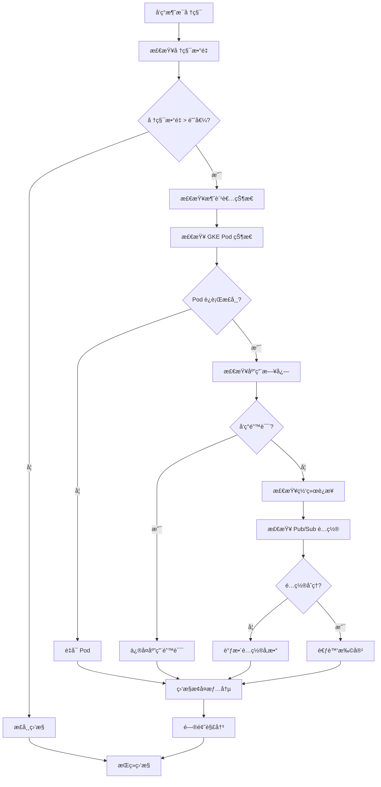

# summary

- Streaming Pull：使用 Streaming Pull 时，消æ¯ä»¥æµå¼æ–¹å¼äº¤ä»˜ 是ä¸æ˜¯è¿™ç§æƒ…况下 åªèƒ½é€šè¿‡ Java Client çš„æ–¹å¼æ¥ ACK 消æ¯.gcloud 命令就ä¸è¡Œäº†

# About Streaming Pull + Ack

在 **使用 Pub/Sub çš„ Streaming Pull 模å¼æ—¶**，**ç¡®å®åªèƒ½é€šè¿‡å®¢æˆ·ç«¯ä»£ç ï¼ˆå¦‚ Java 客户端）æ¥æ‰§è¡Œ ACK æ“作**，而 **gcloud å‘½ä»¤æ˜¯æ— æ³•ç”¨äº ACK 这类消æ¯çš„**。

---

## **✅ åŸå› è¯´æ˜ï¼š**

### **📌 Streaming Pull 特性：**

- 是通过 gRPC é•¿è¿æ¥æŒç»­æ¥æ”¶æ¶ˆæ¯çš„机制。
- ä¸€èˆ¬ç”¨äº GKEã€Cloud Run ç­‰æœåŠ¡ç«¯å®¹å™¨æŒç»­æ¶ˆè´¹åœºæ™¯ã€‚
- 消æ¯åœ¨è¢«å®¢æˆ·ç«¯å¤„ç†å，需由客户端 **显å¼è°ƒç”¨ ack() 方法** 进行确认。

---

## **⌠为什么**

## **gcloud**

## 
**命令ä¸é€‚用：**

gcloud pubsub subscriptions pull 是针对 **Pull 模å¼çš„订阅者**，它：

- 通过 REST API å‘起一次性拉å–请求；
- åªå¤„ç†å½“å‰è¯·æ±‚中返å›çš„消æ¯ï¼›
- ä¸æ„ŸçŸ¥ gRPC Streaming Pull çš„è¿æ¥ä¸Šä¸‹æ–‡ï¼›
- 无法è·å– Streaming Pull 已缓存/处ç†ä¸­çš„ ackId 列表。

> 因此无法通过 gcloud å‘½ä»¤å» ack Streaming Pull 模å¼ä¸‹æ¥æ”¶åˆ°çš„消æ¯ã€‚

---

## **✅ 正确åšæ³•ï¼ˆä»¥ Java 为例）：**

```java
subscriber = Subscriber.newBuilder(subscriptionName, (message, consumer) -> {
    try {
        // 处ç†æ¶ˆæ¯
        System.out.println("Received: " + message.getData().toStringUtf8());

        // 确认æˆåŠŸ
        consumer.ack();  // ✅ åªæ­¤å¤„有效
    } catch (Exception e) {
        // 处ç†å¤±è´¥ï¼ˆå¯é€‰ï¼‰
        consumer.nack(); // ⌠会导致消æ¯é‡æŠ•
    }
}).build();

subscriber.startAsync().awaitRunning();
```

---

## **🔄 补充：**

| **æ“作** | **Pull 模å¼æ”¯æŒ** | **Streaming Pull 支æŒ** |
| --- | --- | --- |
| gcloud pubsub subscriptions pull | ✅ 是 | âŒ å¦ |
| gcloud pubsub subscriptions ack | ✅ 是（需 ackId） | âŒ å¦ |
| 客户端 ack/nack 方法（Javaã€Python 等） | ✅ 是 | ✅ 是 |
| Metrics (ack_count ç­‰) 监æ§æ”¯æŒ | ✅ 是 | ✅ 是 |

---

如你正在使用 GKE + Java，确ä¿è®¾ç½®åˆé€‚的：

- executorThreads（并å‘线程数）
- maxAckExtensionPeriod（最大延长时间）
- ackDeadline（订阅é…置的 ack 超时）

å¯ä»¥å¸®ä½ è‡ªåŠ¨ç”Ÿæˆå®Œæ•´é…置示例或 dashboard é¢æ¿æ¨¡æ¿ï¼Œå¦‚有需è¦å¯ç»§ç»­å‘ŠçŸ¥ã€‚

## Grok

是的，在使用 **Streaming Pull** 的场景下，消æ¯çš„确认（ACK）主è¦é€šè¿‡ **Pub/Sub 客户端库**（如 Java Client）æ¥å®ç°ï¼Œ`gcloud` 命令无法直æ¥ç”¨äºç¡®è®¤ï¼ˆACKï¼‰æˆ–å¤„ç† Streaming Pull 的消æ¯ã€‚以下是详细分æ和说æ˜ï¼š

### 为什么 `gcloud` å‘½ä»¤æ— æ³•ç›´æ¥ ACK 消æ¯ï¼Ÿ

1. **Streaming Pull 的工作机制**：

    - Streaming Pull 是通过 Pub/Sub 客户端库建立一个长期的 gRPC æµå¼è¿æ¥ï¼Œä»è®¢é˜…中å®æ—¶æ‹‰å–消æ¯ã€‚
    - 客户端库负责æ¥æ”¶æ¶ˆæ¯ã€å¤„ç†æ¶ˆæ¯ï¼Œå¹¶é€šè¿‡ API 调用（如 `acknowledge` 方法）确认消æ¯ï¼ˆACK）或拒ç»æ¶ˆæ¯ï¼ˆNACK）。
    - 消æ¯çš„确认逻辑是动æ€çš„，ä¾èµ–äºå®¢æˆ·ç«¯çš„处ç†ç»“æœï¼Œè€Œ `gcloud` 命令是é™æ€çš„命令行工具，主è¦ç”¨äºç®¡ç†å’Œé…ç½® Pub/Sub 资æºï¼ˆå¦‚主题ã€è®¢é˜…ã€å¿«ç…§ç­‰ï¼‰ï¼Œä¸é€‚åˆå¤„ç†å®æ—¶æ¶ˆæ¯æµã€‚

2. **gcloud çš„å±€é™æ€§**：
    - `gcloud pubsub` 命令主è¦ç”¨äºç®¡ç† Pub/Sub 资æºï¼ˆå¦‚创建/删除主题ã€è®¢é˜…，调整é…置，使用 `seek` é‡æ”¾æ¶ˆæ¯ç­‰ï¼‰ã€‚
    - 没有æ供直æ¥æ“作消æ¯å†…容或确认消æ¯çš„命令，因为这些æ“作需è¦å®æ—¶äº¤äº’，而 `gcloud` 更适åˆæ‰¹é‡æˆ–é…置管ç†ä»»åŠ¡ã€‚

### Streaming Pull 下如何确认（ACK）消æ¯ï¼Ÿ

在 Streaming Pull 模å¼ä¸‹ï¼Œç¡®è®¤æ¶ˆæ¯éœ€è¦é€šè¿‡ Pub/Sub 客户端库（如 Java 客户端）å®ç°ã€‚以下是 Java 客户端的典å‹æµç¨‹ï¼š

1. **设置 Streaming Pull 订阅**：

    - 使用 Google Cloud Pub/Sub Java 客户端库é…置订阅。
    - 示例代ç ï¼ˆJava）：

        ```java
        import com.google.cloud.pubsub.v1.AckReplyConsumer;
        import com.google.cloud.pubsub.v1.MessageReceiver;
        import com.google.cloud.pubsub.v1.Subscriber;
        import com.google.pubsub.v1.ProjectSubscriptionName;
        import com.google.pubsub.v1.PubsubMessage;

        public class StreamingPullExample {
            public static void main(String... args) throws Exception {
                String projectId = "your-project-id";
                String subscriptionId = "your-subscription-id";
                ProjectSubscriptionName subscriptionName = ProjectSubscriptionName.of(projectId, subscriptionId);

                MessageReceiver receiver =
                    (PubsubMessage message, AckReplyConsumer consumer) -> {
                        // 处ç†æ¶ˆæ¯
                        System.out.println("Received message: " + message.getData().toStringUtf8());
                        // 确认消æ¯
                        consumer.ack();
                    };

                Subscriber subscriber = null;
                try {
                    subscriber = Subscriber.newBuilder(subscriptionName, receiver).build();
                    subscriber.startAsync().awaitRunning();
                    System.out.println("Subscriber is running");
                    // ä¿æŒè¿è¡Œä»¥æ¥æ”¶æ¶ˆæ¯
                    Thread.sleep(60000);
                } finally {
                    if (subscriber != null) {
                        subscriber.stopAsync();
                    }
                }
            }
        }
        ```

    - 在 `MessageReceiver` çš„å›è°ƒä¸­ï¼Œé€šè¿‡ `consumer.ack()` 确认消æ¯å·²å¤„ç†ï¼Œæˆ– `consumer.nack()` æ‹’ç»æ¶ˆæ¯ï¼ˆé‡æ–°æ’队）。

2. **多线程ç¯å¢ƒ**：

    - 在您的场景（GKE + Java + Streaming Pull + 多线程），Java 客户端会自动处ç†å¤šçº¿ç¨‹å¹¶å‘拉å–消æ¯ã€‚
    - ç¡®ä¿çº¿ç¨‹å®‰å…¨ï¼Œä¾‹å¦‚使用线程池或åŒæ­¥æœºåˆ¶ï¼Œé¿å…ç«äº‰æ¡ä»¶å¯¼è‡´æ¶ˆæ¯æœªè¢«æ­£ç¡®ç¡®è®¤ã€‚
    - 示例é…置多线程：
        ```java
        Subscriber subscriber = Subscriber.newBuilder(subscriptionName, receiver)
            .setParallelPullCount(4) // 设置并å‘拉å–线程数
            .build();
        ```

3. **错误处ç†**：
    - 如æœæ¶ˆæ¯å¤„ç†å¤±è´¥ï¼Œå»ºè®®é€šè¿‡ `consumer.nack()` 将消æ¯é‡æ–°æ’队，或结åˆæ­»ä¿¡ä¸»é¢˜ï¼ˆdead-letter topic）处ç†æ— æ³•å¤„ç†çš„消æ¯ã€‚
    - 示例设置死信主题（通过 `gcloud` é…置）：
        ```bash
gcloud pubsub subscriptions create SUBSCRIPTION_ID --topic=TOPIC_ID --dead-letter-topic=DEAD_LETTER_TOPIC_NAME --max-delivery-attempts=5
        ```

### 什么时候使用 `gcloud` 命令？

虽然 `gcloud` æ— æ³•ç›´æ¥ ACK 消æ¯ï¼Œä½†åœ¨ä»¥ä¸‹åœºæ™¯ä¸­å¯ä»¥è¾…åŠ©ç®¡ç† Streaming Pull 的消æ¯å †ç§¯ï¼š

1. **查看堆积消æ¯æ•°é‡**：

    - 使用 Cloud Monitoring 检查未确认消æ¯æ•°é‡ï¼š
        ```mql
fetch pubsub_subscription
| metric 'pubsub.googleapis.com/subscription/num_undelivered_messages'
| filter (resource.subscription_id == 'YOUR_SUBSCRIPTION_ID')
| group_by 1m, [value_num_undelivered_messages_sum: sum(value.num_undelivered_messages)]
        ```
    - è¿™å¯ä»¥å¸®åŠ©åˆ¤æ–­ Streaming Pull 是å¦å› å¤„ç†å»¶è¿Ÿå¯¼è‡´æ¶ˆæ¯å †ç§¯ã€‚

2. **é‡æ”¾æˆ–清除消æ¯ï¼ˆSeek）**：

    - 如æœéœ€è¦æ‰¹é‡æ¸…除未确认消æ¯ï¼Œå¯ä»¥ä½¿ç”¨ `seek` 命令将订阅时间戳设置为未æ¥æ—¶é—´ï¼š
        ```bash
gcloud pubsub subscriptions seek SUBSCRIPTION_ID --time=2025-07-04T12:00:00Z
        ```
    - 注æ„：此æ“作会将所有未确认消æ¯æ ‡è®°ä¸ºå·²ç¡®è®¤ï¼Œéœ€è°¨æ…使用。

3. **调整订阅é…ç½®**：
    - 修改é‡è¯•ç­–略：
        ```bash
gcloud pubsub subscriptions update SUBSCRIPTION_ID --min-retry-delay=10s --max-retry-delay=600s
        ```
    - é…置死信主题：
        ```bash
gcloud pubsub subscriptions update SUBSCRIPTION_ID --dead-letter-topic=DEAD_LETTER_TOPIC_NAME --max-delivery-attempts=5
        ```

### 总结

- **Streaming Pull 下确认消æ¯**：必须通过 Pub/Sub 客户端库（如 Java Client）的 `ack()` 方法å®ç°ï¼Œ`gcloud` å‘½ä»¤æ— æ³•ç›´æ¥ ACK 消æ¯ã€‚
- **gcloud 的作用**：用äºç®¡ç† Pub/Sub 资æºï¼ˆå¦‚主题ã€è®¢é˜…é…ç½®ã€å¿«ç…§ï¼‰æˆ–批é‡æ“作（如 `seek` 清除消æ¯ï¼‰ï¼Œé€‚åˆè¯Šæ–­å’Œé…置调整。
- **建议**：
    - 在 Java 应用中，确ä¿æ­£ç¡®å®ç° `ack()` å’Œ `nack()` 逻辑，结åˆæ­»ä¿¡ä¸»é¢˜å¤„ç†å¤±è´¥æ¶ˆæ¯ã€‚
    - 使用 Cloud Monitoring 定期检查消æ¯å †ç§¯æƒ…况。
    - 在 GKE 多线程ç¯å¢ƒä¸­ï¼Œè°ƒæ•´ `setParallelPullCount` 和线程池大å°ä»¥ä¼˜åŒ–性能。

如æœæ‚¨éœ€è¦æ›´å…·ä½“çš„ Java 代ç ç¤ºä¾‹ï¼ˆä¾‹å¦‚处ç†æ­»ä¿¡ä¸»é¢˜æˆ–错误é‡è¯•é€»è¾‘），请告诉我，我å¯ä»¥è¿›ä¸€æ­¥æ供代ç æˆ–优化建议ï¼

# Gemini Deepsearch

# GCP Pub/Sub 消æ¯é˜Ÿåˆ—è¿ç»´ä¸æ·±åº¦è¯Šæ–­æƒå¨æŒ‡å—

本报告旨在为在 Google Kubernetes Engine (GKE) ç¯å¢ƒä¸­ï¼Œä½¿ç”¨ Java å’Œ Streaming Pull 模å¼ç®¡ç† Google Cloud Pub/Sub çš„å¼€å‘ä¸è¿ç»´å›¢é˜Ÿï¼Œæ供一份详尽的æ“作ä¸è¯Šæ–­æŒ‡å—。内容涵盖ä»åŸºç¡€å‘½ä»¤åˆ°é«˜çº§æ•…éšœæ’查的全链路技术，é‡ç‚¹è§£å†³æ¶ˆæ¯ç§¯å‹çš„识别ã€åˆ†æä¸æ¸…ç†ï¼Œå¹¶ç»“åˆæ‚¨çš„技术栈æ供针对性的优化建议。

## 第一部分：基础 `gcloud pubsub` æ“作：命令行入门

在深入æ¢è®¨å¤æ‚场景之å‰ï¼Œå¿…须先建立一套åšå®çš„ `gcloud` 命令行æ“作基础。这部分将å›é¡¾ Pub/Sub 的核心概念，并æ供管ç†å…¶åŸºæœ¬èµ„æºï¼ˆTopic å’Œ Subscription）的标准命令。

### 核心概念å›é¡¾

- **Topic (主题):** å‘布者（Publisher）å‘é€æ¶ˆæ¯çš„命å资æºã€‚å¯ä»¥å°†å…¶ç†è§£ä¸ºä¸€ä¸ªæ¶ˆæ¯é€šé“或信æ¯æº 1。
- **Subscription (订阅):** 代表ä»ä¸€ä¸ªç‰¹å®šä¸»é¢˜æµå‘订阅者应用程åºçš„消æ¯æµçš„命å资æºã€‚一个主题å¯ä»¥æœ‰å¤šä¸ªè®¢é˜…，ä»è€Œå®ç°æ¶ˆæ¯çš„扇出（fan-outï¼‰åˆ†å‘ 1。
- **Message (消æ¯):** å‘布者å‘é€åˆ°ä¸»é¢˜ï¼Œå¹¶æœ€ç»ˆæŠ•é€’给订阅者的数æ®å•å…ƒï¼Œç”±æ•°æ®æœ¬èº«å’Œå¯é€‰çš„å±æ€§ï¼ˆattributesï¼‰ç»„æˆ 6。

### ç®¡ç† Topic (消æ¯é€šé“)

- **列出 Topic:** 查看项目中的所有主题，是进行资æºç›˜ç‚¹å’Œç¼–写自动化脚本的基础。
    - 命令: `gcloud pubsub topics list` 1。
    - 高级用法: 当主题数é‡åºå¤§æ—¶ï¼Œå¯ä½¿ç”¨ `--limit`ã€`--page-size` å’Œ `--filter` 标志进行分页和筛选 9。
- **æè¿° Topic:** è·å–å•ä¸ªä¸»é¢˜çš„详细信æ¯ï¼ŒåŒ…括其é…ç½®ã€å…³è”çš„ schema 以åŠæ ‡ç­¾ç­‰ã€‚
    - 命令: `gcloud pubsub topics describe TOPIC_ID` 10。
- **创建 Topic:**
    - 命令: `gcloud pubsub topics create TOPIC_ID` 1。
    - 背景: 这是æ„建任何新消æ¯æµçš„第一步。在创建时å¯ä»¥é…置消æ¯ä¿ç•™æ—¶é•¿ã€å®¢æˆ·ç®¡ç†çš„加密密钥（CMEK）等高级å±æ€§ 3。
- **删除 Topic:**
    - 命令: `gcloud pubsub topics delete TOPIC_ID` 10。
    - 注æ„: 删除一个ä»æœ‰å…³è”订阅的主题，会导致这些订阅进入“游离â€çŠ¶æ€ï¼Œå…¶ `topic` 字段会å˜ä¸º `_deleted-topic_`。这ç§æƒ…况å¯èƒ½å¼•å‘混淆，需è¦å¯¹è¿™äº›è®¢é˜…进行é¢å¤–çš„æ‰‹åŠ¨æ¸…ç† 12。

### ç®¡ç† Subscription (消费者入å£)

- **列出 Subscription:** 查看项目中的所有订阅，或ä¸ç‰¹å®šä¸»é¢˜å…³è”的订阅。
    - 命令 (项目内所有): `gcloud pubsub subscriptions list` 4。
    - 命令 (特定主题): `gcloud pubsub topics list-subscriptions TOPIC_ID` 10。
- **æè¿° Subscription:** 这是一个至关é‡è¦çš„诊断命令。它能æ­ç¤ºè®¢é˜…的详细é…置，如确认截止时间（`ackDeadlineSeconds`）ã€æ¨é€/拉å–模å¼ã€é‡è¯•ç­–略以åŠæ­»ä¿¡é˜Ÿåˆ—设置 5。
    - 命令: `gcloud pubsub subscriptions describe SUBSCRIPTION_ID`。
- **创建 Subscription:**
    - 命令: `gcloud pubsub subscriptions create SUBSCRIPTION_ID --topic=TOPIC_ID` 1。
    - 背景: 针对您的使用场景（Streaming Pull），主è¦åˆ›å»ºçš„是拉å–å‹è®¢é˜…。创建时的关键标志包括 `--ack-deadline` 以åŠå续将详述的死信策略相\u0000关标志 16。
- **æ›´æ–° Subscription:** 修改ç°æœ‰è®¢é˜…çš„å±æ€§ï¼Œä¾‹å¦‚调整确认截止时间或更新死信策略。
    - 命令: `gcloud pubsub subscriptions update SUBSCRIPTION_ID --ack-deadline=30` 17。
- **删除 Subscription:**
    - 命令: `gcloud pubsub subscriptions delete SUBSCRIPTION_ID` 18。
    - 注æ„: 删除æ“作是永久性的，无法撤销。订阅中所有未确认的消æ¯éƒ½å°†æ°¸ä¹…丢失 18。在考虑将此æ“作作为“清空队列â€çš„手段时，必须充分认识到其ä¸å¯é€†çš„åæœã€‚

### å…³äº IAM (身份ä¸è®¿é—®ç®¡ç†)

所有 `gcloud` 命令的执行都需è¦é€‚当的 IAM æƒé™ã€‚`roles/pubsub.editor` 角色æ供了广泛的管ç†æƒé™ï¼Œè€Œ `roles/pubsub.viewer` 则æä¾›åªè¯»è®¿é—®æƒé™ 4。在生产ç¯å¢ƒä¸­ï¼Œåº”éµå¾ªæœ€å°æƒé™åŸåˆ™ã€‚例如，一个åªè´Ÿè´£å‘布消æ¯çš„æœåŠ¡è´¦å·ä»…需

`roles/pubsub.publisher` 角色，而一个åªæ¶ˆè´¹æ¶ˆæ¯çš„æœåŠ¡è´¦å·ä»…需 `roles/pubsub.subscriber` 角色 20。

### `gcloud pubsub` 命令快速å‚考

下表汇总了最常用的 `gcloud pubsub` 命令，以便快速查阅。

| èµ„æº | æ“作 | `gcloud` 命令示例 |
| --- | --- | --- |
| Topic | 列出 | `gcloud pubsub topics list` |
| Topic | æè¿° | `gcloud pubsub topics describe my-topic` |
| Topic | 创建 | `gcloud pubsub topics create my-topic` |
| Topic | 删除 | `gcloud pubsub topics delete my-topic` |
| Topic | å‘å¸ƒæ¶ˆæ¯ | `gcloud pubsub topics publish my-topic --message "Hello"` |
| Subscription | 列出 | `gcloud pubsub subscriptions list` |
| Subscription | æè¿° | `gcloud pubsub subscriptions describe my-subscription` |
| Subscription | 创建 | `gcloud pubsub subscriptions create my-subscription --topic=my-topic` |
| Subscription | 删除 | `gcloud pubsub subscriptions delete my-subscription` |
| Subscription | 拉å–æ¶ˆæ¯ | `gcloud pubsub subscriptions pull my-subscription --limit=10` |
| Subscription | ç¡®è®¤æ¶ˆæ¯ | `gcloud pubsub subscriptions ack my-subscription --ack-ids="ack_id_1,ack_id_2"` |
| Subscription | é‡ç½®ç§¯å‹ | `gcloud pubsub subscriptions seek my-subscription --time=...` 或 `--snapshot=...` |
| Snapshot | 列出 | `gcloud pubsub snapshots list` |
| Snapshot | 创建 | `gcloud pubsub snapshots create my-snapshot --subscription=my-subscription` |
| Snapshot | 删除 | `gcloud pubsub snapshots delete my-snapshot` |

## 第二部分：诊断消æ¯ç§¯å‹ï¼šé‡åŒ–积å‹çŠ¶å†µ

本节旨在æ供一套完整的工具和知识体系，用äºç›‘æ§è®¢é˜…çš„å¥åº·çŠ¶å†µï¼Œè¯†åˆ«æ¶ˆæ¯ç§¯å‹çš„å½¢æˆï¼Œå¹¶ç†è§£ä¸åŒç§¯å‹æ¨¡å¼èƒŒå的根本åŸå› ã€‚这是进行有效故障æ’查的核心诊断步骤。

### 两个关键指标

消æ¯ç§¯å‹å¹¶éå•ä¸€ç»´åº¦çš„问题，它åŒæ—¶å…·æœ‰â€œè§„模â€å’Œâ€œæ—¶æ•ˆæ€§â€ä¸¤ä¸ªç»´åº¦ã€‚Cloud Monitoring æ供了两个核心指标æ¥ç²¾ç¡®åº¦é‡è¿™ä¸¤ä¸ªæ–¹é¢ 21。

- **`pubsub.googleapis.com/subscription/num_undelivered_messages`**: 订阅积å‹ä¸­æœªç¡®è®¤æ¶ˆæ¯çš„æ•°é‡ã€‚这个指标å映了积å‹çš„**规模**。一个æŒç»­é«˜ä¼çš„数值表æ˜æ¶ˆè´¹è€…的处ç†é€Ÿåº¦è·Ÿä¸ä¸Šæ¶ˆæ¯çš„å‘布速度 24。
- **`pubsub.googleapis.com/subscription/oldest_unacked_message_age`**: 积å‹ä¸­æœ€æ—©ä¸€æ¡æœªç¡®è®¤æ¶ˆæ¯çš„年龄（以秒为å•ä½ï¼‰ã€‚这个指标å映了积å‹çš„**陈旧程度**。一个æŒç»­å¾ˆé«˜æˆ–ä¸æ–­å¢é•¿çš„数值是一个严é‡çš„警告信å·ï¼Œè¡¨æ˜æŸäº›æ¶ˆæ¯å¯èƒ½è¢«â€œå¡ä½â€æ— æ³•å¤„ç†ï¼Œæˆ–者整体处ç†å»¶è¿Ÿæ高 24。

### 查询指标的方法

- **通过 Cloud Console:** 在 Pub/Sub 订阅的详情页é¢ï¼Œæœ‰ä¸€ä¸ªâ€œæŒ‡æ ‡â€æ ‡ç­¾é¡µï¼Œå…¶ä¸­æ供了针对上述关键指标的预æ„建图表，å¯ä»¥è¿›è¡Œå¿«é€Ÿçš„目视检查 30。
- **通过 Metrics Explorer å’Œ MQL:** 对äºæ›´æ·±å…¥çš„分æ，å¯ä»¥ä½¿ç”¨ Metrics Explorer æ„建自定义图表，或使用监æ§æŸ¥è¯¢è¯­è¨€ (MQL) 进行精确查询 21。
    - **示例 MQL 查询 (è·å–特定订阅的未投递消\u0000æ¯æ•°):**
        ```mql
fetch pubsub_subscription
| metric 'pubsub.googleapis.com/subscription/num_undelivered_messages'
| filter (resource.subscription_id == 'your-subscription-id')
| group_by 1m, [value_num_undelivered_messages_mean: mean(value.num_undelivered_messages)]
| every 1m
        ```
26

### 解读积å‹æ¨¡å¼çš„å› æœé“¾

指标本身åªæ˜¯æ•°æ®ï¼ŒçœŸæ­£çš„价值在äºè§£è¯»å®ƒä»¬ã€‚å¦‚æœ `num_undelivered_messages` 很高但 `oldest_unacked_message_age` 很ä½ï¼Œè¿™æ„味ç€ä»€ä¹ˆï¼Ÿå¦‚æœä¸¤è€…都æŒç»­å¢é•¿ï¼Œåˆæ„味ç€ä»€ä¹ˆï¼Ÿé€šè¿‡ç»¼åˆåˆ†æ，å¯ä»¥æ„建一个诊断æµç¨‹å›¾ã€‚

- **场景一: `num_undelivered_messages` å’Œ `oldest_unacked_message_age` åŒæ—¶å¢é•¿**
    - **诊断:** 系统性的消费者性能瓶颈。订阅者的整体处ç†èƒ½åŠ›å·²æ— æ³•è·Ÿä¸Šæ¶ˆæ¯çš„å‘布速ç‡ã€‚
    - **å¯èƒ½åŸå›  (结åˆæ‚¨çš„ GKE/Java 技术栈):**
        1. **消费者资æºä¸è¶³:** GKE Pod é­é‡äº† CPU 或内存的é™åˆ¶ä¸èŠ‚æµ (throttling)，导致处ç†èƒ½åŠ›ä¸‹é™ï¼ˆè¯¦è§ç¬¬å…­éƒ¨åˆ†ï¼‰27。
        2. **下游ä¾èµ–瓶颈:** Java 应用程åºåœ¨ç­‰å¾…一个缓慢的数æ®åº“查询或外部 API 调用，阻å¡äº†æ¶ˆæ¯å¤„ç†çº¿ç¨‹ã€‚
        3. **代ç æ•ˆç‡ä½ä¸‹:** 近期部署的代ç å˜æ›´å¼•å…¥äº†æ€§èƒ½å›å½’，é™ä½äº†æ¶ˆæ¯å¤„ç†é€»è¾‘çš„æ•ˆç‡ 25。
- **场景二: `num_undelivered_messages` 稳定在较高水平，而 `oldest_unacked_message_age` æŒç»­å¢é•¿**
    - **诊断:** “毒丸â€æ¶ˆæ¯ (Poison Pill) 或特定消æ¯å¤„ç†å¤±è´¥ã€‚大部分消æ¯éƒ½èƒ½è¢«æ­£å¸¸å¤„ç†ï¼Œä½†æœ‰ä¸€æ¡æˆ–几æ¡ç‰¹å®šçš„消æ¯å¯¼è‡´æ¶ˆè´¹è€…程åºå‡ºé”™ã€ä¸»åŠ¨ `nack()` 消æ¯ï¼Œæˆ–使其确认超时。éšå Pub/Sub 会é‡æ–°æŠ•é€’该消æ¯ï¼Œå½¢æˆæ¶æ€§å¾ªç¯ã€‚
    - **å¯èƒ½åŸå› :**
        1. 消æ¯ä½“æ ¼å¼é”™è¯¯ï¼Œä¾‹å¦‚一个畸形的 JSON，导致 Java 代ç æ— æ³•è§£æ。
        2. æŸæ¡æ¶ˆæ¯çš„内容触å‘了消费者逻辑中的一个特定 bug 或未处ç†çš„异常。
        3. 消费者代ç åå¤å¯¹æŸæ¡æ¶ˆæ¯è°ƒç”¨ `nack()`，这æ˜ç¡®åœ°æŒ‡ç¤º Pub/Sub é‡æ–°æŠ•é€’è¯¥æ¶ˆæ¯ 27。
- **场景三: `num_undelivered_messages` 出ç°çŸ­æš‚å°–å³°åæ¢å¤æ­£å¸¸**
    - **诊断:** ç¬æ—¶æµé‡çªå¢ã€‚这通常是正常ç°è±¡ï¼Œä¹Ÿæ­£æ˜¯ Pub/Sub 这类消æ¯ç³»ç»Ÿè®¾è®¡çš„目的所在——削峰填谷。系统å¸æ”¶äº†æµé‡æ´ªå³°ï¼Œæ¶ˆè´¹è€…éšç€æ—¶é—´æ¨ç§»ä¼šé€æ­¥èµ¶ä¸Šå¤„ç†è¿›åº¦ã€‚
    - **应对:** 通常无需干预，除éæ¢å¤æ—¶é—´è¶…出了业务的æœåŠ¡ç­‰çº§ç›®æ ‡ (SLO)。通过调整消费者客户端的æµæ§è®¾ç½®å¯ä»¥æ›´å¥½åœ°åº”对这ç§æƒ…况 25。

### 建立主动告警

利用 Cloud Monitoring 为关键指标创建告警策略。例如，当 `oldest_unacked_message_age` 超过一个设定的阈值（如 600 秒）时触å‘告警，因为这几ä¹æ€»æ˜¯é—®é¢˜çš„å¾å…† 30。

### 关键 Pub/Sub 监æ§æŒ‡æ ‡

| 指标å称 | MQL 标识符 | æè¿° | è¿ç»´æ´å¯Ÿ |
| --- | --- | --- | --- |
| 未确认消æ¯æ•° | `pubsub.googleapis.com/subscription/num_undelivered_messages` | 订阅中未被确认的消æ¯æ€»æ•°ã€‚ | **积å‹è§„模**：å映消费者是å¦èƒ½è·Ÿä¸Šå‘布速ç‡ã€‚æŒç»­å¢é•¿è¡¨ç¤ºå¤„ç†èƒ½åŠ›ä¸è¶³ã€‚ |
| 最è€æœªç¡®è®¤æ¶ˆæ¯å¹´é¾„ | `pubsub.googleapis.com/subscription/oldest_unacked_message_age` | 订阅中最è€ä¸€æ¡æœªç¡®è®¤æ¶ˆæ¯çš„年龄（秒）。 | **积å‹å¥åº·åº¦**：å映消æ¯å¤„ç†çš„åœæ»æƒ…况。æŒç»­å¢é•¿æ˜¯ä¸¥é‡è­¦æŠ¥ï¼Œå¯èƒ½å­˜åœ¨â€œæ¯’丸â€æ¶ˆæ¯æˆ–处ç†å®Œå…¨é˜»å¡ã€‚ |
| æ¨é€è¯·æ±‚计数 | `pubsub.googleapis.com/subscription/push_request_count` | ï¼ˆé€‚ç”¨äº Push 订阅）按å“应ç åˆ†ç»„çš„æ¨é€å°è¯•æ¬¡æ•°ã€‚ | **æ¨é€ç«¯ç‚¹å¥åº·åº¦**：高错误ç ç‡ï¼ˆå¦‚ 5xx）直æ¥å¯¼è‡´æ¶ˆæ¯ç§¯å‹ã€‚ |
| 投递延迟å¥åº·åˆ† | `pubsub.googleapis.com/subscription/delivery_latency_health_score` | 一个综åˆåˆ†æ•°ï¼Œè¡¡é‡è®¢é˜…的投递延迟å¥åº·çŠ¶å†µã€‚ | **延迟根因分æ**：帮助识别导致投递延迟å¢åŠ çš„å› ç´  30。 |
| 确认截止日期过期计数 | `pubsub.googleapis.com/subscription/expired_ack_deadlines_count` | 消æ¯å› è¶…出确认截止时间而过期的次数。 | **处ç†è¶…æ—¶**：该值é零表示消费者处ç†æ¶ˆæ¯è¿‡æ…¢ï¼Œæˆ–客户端æµæ§è®¾ç½®ä¸å½“，导致消æ¯è¢«é‡å¤æŠ•é€’。 |

## 第三部分：窥æ¢é˜Ÿåˆ—内部：手动消æ¯æ£€æŸ¥

本节将æ供安全有效的方法，用äºæ‰‹åŠ¨æ‹‰å–和检查订阅中的å•ä¸ªæ¶ˆæ¯ã€‚这对äºè°ƒè¯•åœ¨ä¸Šä¸€èŠ‚中识别出的“毒丸â€æ¶ˆæ¯åœºæ™¯è‡³å…³é‡è¦ã€‚

### `gcloud pubsub subscriptions pull` 命令深度解æ

该命令是进行手动检查的主è¦å·¥å…· 1。

- **默认行为:** 默认情况下，`pull` 命令**ä¸ä¼š**确认消æ¯ã€‚它会返å›æ¶ˆæ¯çš„æ•°æ®ã€å±æ€§ä»¥åŠä¸€ä¸ªå”¯ä¸€çš„ `ackId` 1。消æ¯åœ¨è®¢é˜…中ä¿æŒæœªç¡®è®¤çŠ¶æ€ï¼Œå¹¶åœ¨å…¶ç¡®è®¤æˆªæ­¢æ—¶é—´ï¼ˆack deadline）到期å被é‡æ–°æŠ•é€’。这对äºæ£€æŸ¥è‡³å…³é‡è¦ï¼Œå› ä¸ºå®ƒå…许您在ä¸â€œæ¶ˆè´¹â€æ¶ˆæ¯çš„情况下“窥视â€å…¶å†…容。
    - 命令: `gcloud pubsub subscriptions pull YOUR_SUBSCRIPTION_ID --limit=1`
- **自动确认:** `--auto-ack` 标志用äºåœ¨ä¸€ä¸ªæ­¥éª¤ä¸­å®Œæˆæ‹‰å–和消费。这对äºç®€å•çš„消费脚本很有用，但在生产订阅上进行调试时应谨æ…使用 1。
    - 命令: `gcloud pubsub subscriptions pull YOUR_SUBSCRIPTION_ID --limit=1 --auto-ack`
- **æ ¼å¼åŒ–输出:** 使用 `--format` 标志å¯ä»¥ä»…æå–消æ¯æ•°æ®ï¼Œä»¥ä¾¿äºæŸ¥çœ‹æˆ–处ç†ã€‚请注æ„，返å›çš„æ•°æ®æ˜¯ Base64 ç¼–ç çš„，需è¦è¿›è¡Œè§£ç  35。
    - è·å–解ç åæ•°æ®çš„命令: `gcloud pubsub subscriptions pull YOUR_SUBSCRIPTION_ID --format="value(message.data)" | base64 -d`

### “间è°è®¢é˜…â€æŠ€æœ¯ï¼šå®ç°å®‰å…¨çš„å®æ—¶è°ƒè¯•

在调试å®æ—¶ç³»ç»Ÿæ—¶ï¼Œä¸€ä¸ªä¸»è¦æŒ‘战是检查消æ¯ï¼ˆå³æ‹‰å–它）会暂时将其ä»é˜Ÿåˆ—中移除，ä»è€Œé˜»æ­¢äº†çœŸæ­£çš„消费者æ¥æ”¶å®ƒã€‚这会干扰您正在å°è¯•è°ƒè¯•çš„系统。è¦è§£å†³è¿™ä¸ªé—®é¢˜ï¼Œå¯ä»¥åˆ©ç”¨ Pub/Sub 主题å‘其所有订阅广播消æ¯çš„特性。通过为åŒä¸€ä¸»é¢˜åˆ›å»ºä¸€ä¸ªä¸´æ—¶çš„ã€é¢å¤–的订阅，å¯ä»¥å®ç°å¯¹æ¶ˆæ¯æµçš„无侵入å¼è§‚察。这个“间è°â€è®¢é˜…å°†æ¥æ”¶åˆ°è‡ªå…¶åˆ›å»ºä¹‹åå‘布的所有消æ¯çš„副本，ä»è€Œå…许安全地拉å–和检查，而ä¸ä¼šå½±å“主应用程åºçš„订阅 36。

- **分步æ“作æµç¨‹:**
    1. 识别问题订阅的主题:

        ```bash
gcloud pubsub subscriptions describe PRIMARY_SUB_ID --format="value(topic)"
        ```

    2. 为该主题创建一个临时的“间è°â€è®¢é˜…:

        ```bash
gcloud pubsub subscriptions create spy-subscription --topic=TOPIC_ID 36
        ```

    3. å‘布一æ¡æµ‹è¯•æ¶ˆæ¯ï¼Œæˆ–等待一æ¡æœ‰é—®é¢˜çš„消æ¯è¢«å‘布。
    4. ä»é—´è°è®¢é˜…中安全地拉å–消æ¯è¿›è¡Œæ£€æŸ¥:

        ```bash
gcloud pubsub subscriptions pull spy-subscription --limit=1
        ```

    5. 调试完æˆå，删除间è°è®¢é˜…，以é¿å…ä¸å¿…è¦çš„资æºæ¶ˆè€—和消æ¯ç§¯å‹:

        ```bash
gcloud pubsub subscriptions delete spy-subscription
        ```

### 精确æ§åˆ¶ï¼šæ‰‹åŠ¨ç¡®è®¤æ¶ˆæ¯

在使用ä¸å¸¦ `--auto-ack` çš„ `pull` 命令检查消æ¯å，您å¯èƒ½ä¼šå†³å®šéœ€è¦ä»é˜Ÿåˆ—中移除它。这å¯ä»¥é€šè¿‡ `ack` å‘½ä»¤å’Œä» `pull` å“应中è·å–çš„ `ackId` æ¥å®Œæˆã€‚

- 命令: `gcloud pubsub subscriptions ack YOUR_SUBSCRIPTION_ID --ack-ids=ACK_ID_FROM_PULL_COMMAND` 1
- **应用场景:** 此方法é常适åˆåœ¨é€šè¿‡æ£€æŸ¥è¯†åˆ«å‡ºä¸€æ¡å·²çŸ¥çš„“毒丸â€æ¶ˆæ¯å，手动将其移除。

## 第四部分：清ç†ä¸æ¸…除消æ¯ç§¯å‹çš„ç­–ç•¥

本节旨在æ供清晰ã€å¯æ“作的策略，用äºæ¸…除订阅中积å‹çš„所有未确认消æ¯ï¼Œå¹¶å¯¹ä¸¤ç§ä¸»è¦æ–¹æ³•åŠå…¶å½±å“进行深入比较。

### 注æ„：Pub/Sub 没有直æ¥çš„ `purge` 命令

一个常è§çš„误解是寻找一个类似 `purge` 或 `clear` 的命令æ¥æ¸…空队列。然而，Pub/Sub 并未æ供这样的直æ¥å‘½ä»¤ 37。清除积å‹æ¶ˆæ¯çš„机制是间æ¥ä½†åŠŸèƒ½å¼ºå¤§çš„。主è¦æœ‰ä¸¤ç§æ–¹æ³•ï¼šä½¿ç”¨

`seek` æ“作é‡ç½®åˆ°æŸä¸ªæ—¶é—´ç‚¹ï¼Œä»¥åŠåˆ é™¤å¹¶é‡å»ºè®¢é˜…。ç†è§£è¿™ä¸¤ç§ç­–略的差异至关é‡è¦ã€‚

### 方法一：使用 `gcloud pubsub subscriptions seek` 进行精确清除

- **概念:** `seek` æ“作å¯ä»¥ä¿®æ”¹è®¢é˜…中消æ¯çš„确认状æ€ã€‚通过 `seek` 到一个特定的时间戳，您å¯ä»¥æœ‰æ•ˆåœ°å°†æ‰€æœ‰åœ¨è¯¥æ—¶é—´ç‚¹ä¹‹å‰å‘布的消æ¯æ ‡è®°ä¸ºâ€œå·²ç¡®è®¤â€ï¼Œä»è€Œå°†å®ƒä»¬ä»å¾…投递的积å‹ä¸­ç§»é™¤ 37。
- **清除所有未确认消æ¯:** `seek` 到当å‰æ—¶é—´æˆ–未æ¥çš„æŸä¸ªæ—¶é—´ç‚¹ã€‚这个æ“作的语义是：“将截至此刻收到的所有消æ¯éƒ½è§†ä¸ºå·²ç¡®è®¤ï¼Œä¸è¦å†æŠ•é€’它们。â€
    - 命令 (使用未æ¥ä¸€åˆ†é’Ÿçš„时间戳): `gcloud pubsub subscriptions seek YOUR_SUBSCRIPTION_ID --time=$(date -u -d'1 minute' +%Y-%m-%dT%H:%M:%SZ)` 37
- **å½±å“:** 这是一个对订阅的“就地â€ä¿®æ”¹ã€‚它通常速度很快，并ä¿ç•™äº†è®¢é˜…的所有é…置和身份标识。这是æ¨èçš„ã€æœ€å®‰å…¨çš„清除积å‹çš„方法。

### 方法二：“核弹â€é€‰é¡¹ - 删除并é‡å»ºè®¢é˜…

- **概念:** 删除一个订阅会永久性地移除它åŠå…¶ç§¯å‹çš„æ‰€æœ‰æœªç¡®è®¤æ¶ˆæ¯ 18。然å用相åŒçš„å称和é…ç½®é‡æ–°åˆ›å»ºä¸€ä¸ªæ–°çš„订阅，å¯ä»¥å®ç°â€œä»é›¶å¼€å§‹â€ã€‚
- **æ“作æµç¨‹:**
    1. `gcloud pubsub subscriptions delete YOUR_SUBSCRIPTION_ID` 18
    2. `gcloud pubsub subscriptions create YOUR_SUBSCRIPTION_ID --topic=YOUR_TOPIC_ID [..其他é…置标志..]` 1
- **关键影å“ä¸é£é™©:**
    - **全新å®ä½“:** 新创建的订阅ä¸æ—§è®¢é˜…完全无关，ä¸ç»§æ‰¿ä»»ä½•å†å²çŠ¶æ€ 18。
    - **é‡å»ºå»¶è¿Ÿä¸é”™è¯¯:** 在删除åç«‹å³ç”¨åŒåé‡å»ºèµ„æºï¼Œå¯èƒ½ä¼šé‡åˆ°çŸ­æš‚的延迟或 API 错误 13。这å¯èƒ½å¯¼è‡´æ¶ˆè´¹è€…在短时间内无法è¿æ¥ï¼Œé€ æˆæœåŠ¡ä¸­æ–­ã€‚
    - **消æ¯ä¸¢å¤±é£é™©:** 在订阅被删除和é‡æ–°åˆ›å»ºä¹‹é—´çš„这个时间窗å£å†…，å‘布到主题的任何消æ¯éƒ½å°†å¯¹è¿™ä¸ªè®¢é˜…丢失，除é主题本身é…置了消æ¯ä¿ç•™ 41。

### 积å‹æ¸…ç†æ–¹æ³•å¯¹æ¯” (`seek` vs. `delete/recreate`)

| 特性 | 方法一: `seek --time` | 方法二: `delete` & `recreate` |
| --- | --- | --- |
| **命令** | `gcloud pubsub subscriptions seek my-sub --time=...` | gcloud pubsub subscriptions delete my-sub<br><br>gcloud pubsub subscriptions create my-sub --topic=... |
| **对积å‹çš„å½±å“** | 将指定时间å‰çš„所有消æ¯æ ‡è®°ä¸ºå·²ç¡®è®¤ï¼Œä»é˜Ÿåˆ—中移除。 | 永久删除整个订阅，包括所有积å‹æ¶ˆæ¯ã€‚ |
| **消æ¯ä¸¢å¤±é£é™©** | ä½ã€‚ä»…å½±å“该订阅内的消æ¯çŠ¶æ€ï¼Œä¸å½±å“主题。 | **高**。在删除和é‡å»ºæœŸé—´å‘布的消æ¯ä¼šä¸¢å¤±ã€‚ |
| **æœåŠ¡ä¸­æ–­** | 无。æ“作是就地的，消费者è¿æ¥ä¸å—å½±å“。 | 有。存在短暂的订阅ä¸å¯ç”¨çª—å£ã€‚ |
| **é£é™©ç­‰çº§** | **ä½** | **高** |
| **\u0000ç†æƒ³åº”用场景** | **æ¨è的常规方法**。快速ã€å®‰å…¨åœ°æ¸…除积å‹ï¼ŒåŒæ—¶ä¿ç•™è®¢é˜…é…置。 | 紧急情况下的最å手段，当 `seek` ä¸å¯ç”¨æˆ–需è¦å½»åº•é‡ç½®æ—¶ï¼Œä¸”能æ¥å—短暂中断和消æ¯ä¸¢å¤±é£é™©ã€‚ |

## 第五部分：高级弹性模å¼ï¼šæ­»ä¿¡é˜Ÿåˆ—ä¸å¿«ç…§

本节将介ç»ä¸¤ç§å¼ºå¤§çš„ã€ç”¨äºæ„建更具弹性和å¯æ¢å¤æ€§çš„系统的主动功能，帮助您ä»è¢«åŠ¨ä¿®å¤è½¬å‘主动防御。

### 使用死信队列 (DLQ) 处ç†â€œæ¯’丸â€æ¶ˆæ¯

- **概念:** ä¸å…¶è®©ä¸€æ¡æ— æ³•å¤„ç†çš„“毒丸â€æ¶ˆæ¯åœ¨ç³»ç»Ÿä¸­æ— ä¼‘止地循ç¯é‡è¯•ï¼Œä¸å¦‚é…置订阅，在ç»è¿‡ä¸€å®šæ¬¡æ•°çš„失败投递å，自动将其转å‘到一个专门的“死信â€ä¸»é¢˜ 42。这能有效隔离问题消æ¯ï¼Œè®©ä¸»æ¶ˆè´¹è€…å¯ä»¥ç»§ç»­å¤„ç†å¥åº·çš„业务消æ¯ã€‚
- **通过 `gcloud` é…ç½®:**
    1. **创建死信主题:** `gcloud pubsub topics create my-dead-letter-topic` 42
    2. **为死信主题创建订阅 (用äºæ£€æŸ¥æ­»ä¿¡):** `gcloud pubsub subscriptions create my-dead-letter-sub --topic=my-dead-letter-topic` 42
    3. **更新主订阅以使用 DLQ:** 关键是 `--max-delivery-attempts` 标志，其值必须在 5 到 100 之间 16。

        - 命令: `gcloud pubsub subscriptions update PRIMARY_SUB_ID --dead-letter-topic=my-dead-letter-topic --max-delivery-attempts=5` 17
- 一个容易被忽略的 IAM è¦æ±‚:
    一个常è§çš„陷阱是，é…置了死信策略åå‘ç°å®ƒå¹¶æœªç”Ÿæ•ˆã€‚其根本åŸå› åœ¨äºï¼Œæ‰§è¡Œâ€œå°†æ¶ˆæ¯è½¬å‘到死信主题â€è¿™ä¸ªåŠ¨ä½œçš„å®ä½“，并é您应用程åºçš„æœåŠ¡è´¦å·ï¼Œè€Œæ˜¯ä¸€ä¸ªç”± Google 托管的ã€ç‰¹æ®Šçš„ Pub/Sub æœåŠ¡ä»£ç†ï¼ˆService Agent）。其格å¼ä¸º service-{project-number}@gcp-sa-pubsub.iam.gserviceaccount.com。这个æœåŠ¡ä»£ç†å¿…须拥有对死信主题的 pubsub.publisher æƒé™ï¼Œä»¥åŠå¯¹æºè®¢é˜…çš„ pubsub.subscriber æƒé™ï¼Œæ‰èƒ½æ­£å¸¸å·¥ä½œ 43。虽然通过 Cloud Console æ“作时，这些æƒé™å¯èƒ½è¢«è‡ªåŠ¨æˆäºˆï¼Œä½†åœ¨ä½¿ç”¨ CLI 或基础设施å³ä»£ç ï¼ˆIaC）工具时，这通常是一个需è¦æ‰‹åŠ¨å®Œæˆçš„关键步骤。
    - æˆäºˆå¿…è¦æƒé™çš„命令:
        ```bash
gcloud pubsub topics add-iam-policy-binding my-dead-letter-topic --member="serviceAccount:service-PROJECT_NUMBER@gcp-sa-pubsub.iam.gserviceaccount.com" --role="roles/pubsub.publisher" 43
        ```

### 使用快照 (Snapshot) 进行状æ€ç®¡ç†ä¸æ¶ˆæ¯é‡æ”¾

- **概念:** å¿«ç…§æ•è·äº†è®¢é˜…在特定时间点的确认状æ€ã€‚它是一个“ä¿å­˜ç‚¹â€ï¼Œä¿ç•™äº†ä»é‚£ä¸€åˆ»èµ·æ‰€æœ‰æœªç¡®è®¤çš„æ¶ˆæ¯ 47。éšå，您å¯ä»¥ä½¿ç”¨
    `seek` æ“作将该订阅（甚至å¦ä¸€ä¸ªè®¢é˜…）æ¢å¤åˆ°è¿™ä¸ªä¿å­˜çš„状æ€ã€‚
- **应用场景:**
    1. **ä»é”™è¯¯çš„部署中æ¢å¤:** 您的消费者代ç ä¸­å­˜åœ¨ä¸€ä¸ª bug，导致它错误地 `ack` 了消æ¯è€Œæ²¡æœ‰å®é™…处ç†ã€‚您å¯ä»¥ `seek` å›åˆ°éƒ¨ç½²å‰åˆ›å»ºçš„快照，以强制é‡æ–°æŠ•é€’è¿™äº›è¢«é”™è¯¯ç¡®è®¤çš„æ¶ˆæ¯ 40。
    2. **为新ç¯å¢ƒå¡«å……æ•°æ®:** 为测试ç¯å¢ƒåˆ›å»ºä¸€ä¸ªæ–°çš„订阅，然å将其 `seek` 到生产订阅的快照，ä»è€Œè·å¾—一个真å®çš„消æ¯æµç”¨äºæµ‹è¯• 39。
- **相关命令:**
    1. **创建快照:** `gcloud pubsub snapshots create my-snapshot --subscription=YOUR_SUBSCRIPTION_ID` 39
    2. **将订阅 seek 到快照:** `gcloud pubsub subscriptions seek YOUR_SUBSCRIPTION_ID --snapshot=my-snapshot` 39
- 快照的生命周期ä¸è¿‡æœŸè§„则:
    快照并é永久有效。它们的过期时间éµå¾ªä¸€ä¸ªé常具体且ä¸ç›´è§‚çš„å…¬å¼ï¼šè¿‡æœŸæ—¶é—´ = 7 天 - (æºè®¢é˜…中最è€æœªç¡®è®¤æ¶ˆæ¯çš„年龄) 47。这æ„味ç€ï¼Œä¸ºä¸€ä¸ªç§¯å‹äº†å¾ˆæ—§æ¶ˆæ¯çš„订阅创建快照，该快照的有效期å¯èƒ½ä¼šé常短。如æœè®¡ç®—出的有效期ä¸è¶³ä¸€å°æ—¶ï¼ŒPub/Sub æœåŠ¡ç”šè‡³ä¼šæ‹’ç»åˆ›å»ºè¯¥å¿«ç…§ã€‚对äºä»»ä½•ä¾èµ–快照进行ç¾éš¾æ¢å¤è®¡åˆ’的团队æ¥è¯´ï¼Œè¿™æ˜¯ä¸€ä¸ªå¿…须了解的关键细节。

## 第六部分：全栈故障æ’查：GKE 上的 Pub/Sub 消费者

本节将打通 Pub/Sub ä¸ Kubernetes 之间的å£å’，æ供一个全é¢çš„æ•…éšœæ’查指å—，专\u0000门针对您在 GKE 上è¿è¡Œ Java 应用的特定ç¯å¢ƒã€‚

### 全栈故障的级è”效应

GKE 中的 `CrashLoopBackOff` 状æ€å¹¶é孤立的 K8s 问题，它åªæ˜¯ä¸€ä¸ªç—‡çŠ¶ã€‚在您的使用场景中，因æœé“¾å¯èƒ½æ¨ªè·¨æ•´ä¸ªæŠ€æœ¯æ ˆï¼Œå°† Pub/Sub çš„é—®é¢˜ä¸ GKE 的问题紧密è”系在一起。

- **故障级è”过程:**
    1. **根本åŸå› :** GKE Pod çš„é…置错误（如内存é™åˆ¶ä¸è¶³ã€æœåŠ¡è´¦å·æƒé™ä¸æ­£ç¡®ï¼‰æˆ– Java 应用程åºä¸­å¼•å…¥äº† bug。
    2. **GKE 症状:** 消费者 Pod å¯åŠ¨å，无法正常åˆå§‹åŒ–或处ç†æ¶ˆæ¯ï¼Œéšå³å´©æºƒã€‚Kubernetes å°è¯•é‡å¯å®ƒï¼Œä½†å®ƒå†æ¬¡å´©æºƒï¼Œæœ€ç»ˆè¿›å…¥ `CrashLoopBackOff` çŠ¶æ€ 52。
    3. **Pub/Sub 症状:** 在 Pod æŒç»­å´©æºƒæœŸé—´ï¼Œå®ƒæ— æ³•ç¡®è®¤ä»»ä½•æ¶ˆæ¯ã€‚`oldest_unacked_message_age` 指标开始稳定å¢é•¿ 27。
    4. **积å‹å½¢æˆ:** ç”±äºæ²¡æœ‰æ¶ˆæ¯è¢«ç¡®è®¤ï¼Œéšç€æ–°æ¶ˆæ¯ä¸æ–­å‘布，`num_undelivered_messages` 指标也开始éšä¹‹å¢é•¿ 25。
    5. **最终结æœ:** è¿ç»´äººå‘˜åŒæ—¶è§‚察到 Pub/Sub 的消æ¯ç§¯å‹å’Œ GKE çš„ `CrashLoopBackOff`，必须认识到这两者是åŒä¸€é—®é¢˜çš„两个ä¸åŒè¡¨ç°ã€‚

### 使用 `kubectl` 调试 GKE 消费者

- **第一步: 确认 `CrashLoopBackOff`**
    - `kubectl get pods -n YOUR_NAMESPACE` - 查找 `RESTARTS` 次数é零且 `STATUS` 为 `CrashLoopBackOff` çš„ Pod 52。
- **第二步: 检查日志**
    - Pod 的日志是寻找根因的最é‡è¦çº¿ç´¢ï¼Œé€šå¸¸ä¼šåŒ…å«å¯¼è‡´å´©æºƒçš„ Java 堆栈跟踪或错误信æ¯ã€‚
    - `kubectl logs POD_NAME -n YOUR_NAMESPACE` (查看当å‰å®¹å™¨çš„日志)
    - `kubectl logs POD_NAME -n YOUR_NAMESPACE -p` (查看**上一次**崩溃的容器的日志) 53
- **第三步: æè¿° Pod**
    - 此命令å¯ä»¥æ­ç¤ºé…置层é¢çš„问题。
    - `kubectl describe pod POD_NAME -n YOUR_NAMESPACE` 53
    - é‡ç‚¹å…³æ³¨:
        - **Exit Code (退出ç ):** é€€å‡ºç  `1` 通常表示应用程åºé”™è¯¯ã€‚é€€å‡ºç  `137` 则强烈暗示容器因为内存ä¸è¶³è¢«ç³»ç»Ÿæ€æ­» (OOMKilled) 53。
        - **Events (事件):** 事件部分会显示存活æ¢é’ˆ (liveness probe) 或就绪æ¢é’ˆ (readiness probe) 失败等 Kubernetes 层é¢çš„问题 52。
        - **Service Account:** 确认 Pod 使用了正确的 Kubernetes æœåŠ¡è´¦å· (KSA)，并且该 KSA 通过 Workload Identity 正确地绑定到了所需的 Google æœåŠ¡è´¦å· (GSA) 54。

### 性能æ€æ‰‹ï¼šGKE çš„ CPU ä¸å†…存节æµ

- **概念:** å³ä½¿ Pod 没有崩溃，其性能也å¯èƒ½ä¸¥é‡ä¸‹é™ï¼Œä»è€Œå¯¼è‡´æ¶ˆæ¯ç§¯å‹ã€‚这通常是由资æºé™åˆ¶å¼•èµ·çš„。当一个容\u0000器使用的 CPU 超出其 `limit` 时，它将被**节æµ**（å³æ€§èƒ½è¢«å¼ºåˆ¶é™ä½ï¼‰ã€‚当一个容器使用的内存超出其 `limit` 时，它将被**æ€æ­»** (OOMKilled)，ä»è€Œå¯¼è‡´ `CrashLoopBackOff` 56。
- CPU 节æµï¼šæ— å£°ä½†è‡´å‘½
    Kubernetes ä¸ä¼šä¸º CPU 节æµç”Ÿæˆä¸€ä¸ªæ˜ç¡®çš„“事件â€ã€‚您的应用程åºåªæ˜¯å˜å¾—越æ¥è¶Šæ…¢ï¼Œè¿™å¯èƒ½æ难调试。您å¯èƒ½ä¼šè§‚察到 oldest_unacked_message_age æŒç»­å¢é«˜ï¼Œä½†åœ¨åº”用日志中å´æ‰¾ä¸åˆ°ä»»ä½•æ˜æ˜¾çš„错误 57。
- **诊断:** 在 Cloud Monitoring 中检查容器的 CPU 节æµæŒ‡æ ‡ï¼š`kubernetes.io/container/cpu/throttle_time`。如æœè¯¥æŒ‡æ ‡æŒç»­å¢é•¿ï¼Œè¯´æ˜æ‚¨çš„ Pod æ­£é­å— CPU 饥饿。
- **解决方案:**
    1. **åˆç†è®¾ç½® Requests:** ç¡®ä¿ Pod 规格中 `resources.requests` çš„ CPU 和内存值准确å映了其正常è¿è¡Œæ‰€éœ€ã€‚
    2. **è°¨æ…使用 CPU Limits:** 许多专家ç°åœ¨å»ºè®®**ä¸è®¾ç½® CPU limits**，仅设置 CPU requests。这å¯ä»¥é˜²æ­¢èŠ‚æµï¼Œå…许 Pod 在节点有空闲资æºæ—¶â€œçªå‘â€ä½¿ç”¨ï¼ŒåŒæ—¶ä»ç„¶ä¿è¯å…¶æ‰€è¯·æ±‚的资æºé‡ 60。
    3. **设置 Memory Limits = Memory Requests:** 这是最佳å®è·µï¼Œå®ƒä¸ºæ‚¨çš„ Pod æ供了 Guaranteed çš„ QoS 等级，使其行为更å¯é¢„测 60。
    4. 使用å‚ç›´ Pod 自动扩缩器 (VPA) çš„ `Off` (æ¨è) 模å¼ï¼Œæ¥è·å–å…³äºåˆç†èµ„æºè¯·\u0000求/é™åˆ¶çš„建议 61。

### 优化高ååé‡ Java Streaming Pull 客户端

您的技术栈 (Java, Streaming Pull, 多线程) ä¾èµ–äºä¸€ä¸ªå¤æ‚的客户端库，该库内部管ç†ç€ gRPC æµã€æ¶ˆæ¯ç§Ÿçº¦å’Œçº¿ç¨‹ã€‚误解其é…置是性能问题的常è§æ ¹æº 62。

- **精细调整æµæ§ (Flow Control):**
    - 订阅者客户端具有æµæ§è®¾ç½®ï¼Œä»¥é˜²æ­¢å…¶è¢«æ¶ˆæ¯æ·¹æ²¡ã€‚关键å‚数是 `setMaxOutstandingElementCount` (消æ¯æ•°é‡) å’Œ `setMaxOutstandingRequestBytes` (消æ¯æ€»å¤§å°) 31。
    - 如æœè¿™äº›é™åˆ¶è®¾ç½®å¾—过高，超出了应用程åºçš„处ç†èƒ½åŠ›ï¼Œæ¶ˆæ¯å°†åœ¨å®¢æˆ·ç«¯å†…存中积å‹ã€‚客户端库会å°è¯•å»¶é•¿å®ƒä»¬çš„确认截止时间，但如æœå¤„ç†æŒç»­ç¼“慢，它们最终会超时并被é‡æ–°æŠ•é€’，导致积å‹å’Œé‡å¤å¤„ç†ã€‚å之，如æœé™åˆ¶å¤ªä½ï¼Œåˆ™å¯èƒ½æ— æ³•è¾¾åˆ°æœ€å¤§ååé‡ã€‚这是一个关键的性能调优å‚数。
- **多线程最佳å®è·µï¼šé…置自定义 `ExecutorProvider`**
    - **概念:** Java 客户端使用 `ExecutorProvider` æ¥è·å–一个线程池，用äºæ‰§è¡Œç”¨æˆ·æ供的消æ¯æ¥æ”¶å›è°ƒå‡½æ•° (`MessageReceiver`) 65。
    - **默认行为:** 默认情况下，客户端会为æ¯ä¸ªå¹¶è¡Œæ‹‰å–æµåˆ›å»ºä¸€ä¸ªåŒ…å« 5 个线程的新线程池 66。例如，如æœæ‚¨è®¾ç½®äº†
        `setParallelPullCount(4)`，那么您将è·å¾— 4×5=20 个线程\u0000用äºæ¶ˆæ¯å¤„ç†ã€‚
    - **为何自定义:** 如æœæ‚¨çš„消æ¯å¤„ç†æ˜¯ I/O 密集å‹çš„（例如，调用数æ®åº“），您å¯èƒ½éœ€è¦è¿œå¤šäºé»˜è®¤å€¼çš„线程数æ¥è¾¾åˆ°é«˜å¹¶å‘。如æœå¤„ç†æ˜¯ CPU 密集å‹çš„，您å¯èƒ½å¸Œæœ›å°†çº¿ç¨‹æ•°é™åˆ¶ä¸ºå¯ç”¨æ ¸å¿ƒæ•°ã€‚æ供一个自定义的 `ExecutorProvider` å¯ä»¥è®©æ‚¨ç²¾ç¡®æ§åˆ¶çº¿ç¨‹æ¨¡å‹ï¼Œä»¥åŒ¹é…您的工作负载特性。
    - **示例代ç ç‰‡æ®µ (概念性):**
        ```java
        // æ供一个自定义的执行器æœåŠ¡æ¥å¤„ç†æ¶ˆæ¯
        ExecutorProvider executorProvider =
            InstantiatingExecutorProvider.newBuilder().setExecutorThreadCount(16).build();

        Subscriber subscriber =
            Subscriber.newBuilder(subscriptionName, receiver)
               .setFlowControlSettings(flowControlSettings)
               .setExecutorProvider(executorProvider)
               .setParallelPullCount(2) // å¯åŠ¨ 2 个并行æµ
               .build();
        ```
        65
    - 这个é…置是优化您特定技术栈的最å一å—ã€ä¹Ÿæ˜¯è‡³å…³é‡è¦çš„一å—拼图，它直æ¥è§£å†³äº†æ‚¨æ到的“多线程â€ä¸Šä¸‹æ–‡ä¸­çš„性能调优问题。

## 结论

æˆåŠŸç®¡ç† GCP Pub/Sub 消æ¯é˜Ÿåˆ—，尤其是在 GKE è¿™ç§å¤æ‚çš„ç¯å¢ƒä¸­ï¼Œè¦æ±‚è¿ç»´äººå‘˜å…·å¤‡è·¨è¶Šæ¶ˆæ¯ä¸­é—´ä»¶ã€Kubernetes 和应用程åºæœ¬èº«çš„全栈诊断能\u0000力。

1. **基础æ“作是基石:** 熟练使用 `gcloud pubsub` 命令进行日常的å¢åˆ æ”¹æŸ¥æ˜¯é«˜æ•ˆè¿ç»´çš„起点。
2. **监æ§æ˜¯è¯Šæ–­çš„核心:** 消æ¯ç§¯å‹çš„核心诊断ä¾èµ–äºå¯¹ `num_undelivered_messages` å’Œ `oldest_unacked_message_age` 这两个关键指标的æŒç»­ç›‘æ§å’Œæ­£ç¡®è§£è¯»ã€‚建立基äºè¿™äº›æŒ‡æ ‡çš„告警是å®ç°ä¸»åŠ¨è¿ç»´çš„关键。
3. **清除积å‹éœ€è°¨æ…:** `seek` æ“作是清除积å‹çš„首选方法，它安全且对æœåŠ¡æ— ä¸­æ–­ã€‚删除并é‡å»ºè®¢é˜…是一ç§é«˜é£é™©æ“作，应仅在充分ç†è§£å…¶æ¶ˆæ¯ä¸¢å¤±å’ŒæœåŠ¡ä¸­æ–­é£é™©å，作为最å手段使用。
4. **弹性设计优äºäº‹å补救:** 主动é…置死信队列 (DLQ) 和利用快照 (Snapshot) 进行状æ€ç®¡ç†ï¼Œæ˜¯æ„建å¥å£®ã€å¯æ¢å¤ç³»ç»Ÿçš„标志。ç†è§£ DLQ çš„ IAM 需求和快照的过期策略是æˆåŠŸå®æ–½è¿™äº›æ¨¡å¼çš„å‰æ。
5. **问题根æºå¾€å¾€åœ¨æ¶ˆè´¹è€…端:** 在 GKE ç¯å¢ƒä¸­ï¼ŒPub/Sub 的消æ¯ç§¯å‹é€šå¸¸æ˜¯æ¶ˆè´¹è€… Pod 问题的**结æœ**，而é**åŸå› **。æ’查方å‘应首先èšç„¦äº GKE Pod 的日志ã€èµ„æºé™åˆ¶ï¼ˆCPU/内存节æµï¼‰å’Œåº”用层é¢çš„性能瓶颈。精细化é…ç½® Java 客户端的æµæ§å’Œçº¿ç¨‹æ±  (`ExecutorProvider`) 对最大化ååé‡è‡³å…³é‡è¦ã€‚

通过结åˆä½¿ç”¨æœ¬æŠ¥å‘Šä¸­æ供的命令行工具ã€ç›‘æ§ç­–略和æ¶æ„模å¼ï¼Œå›¢é˜Ÿå¯ä»¥æœ‰æ•ˆåœ°è¯Š\u0000断和解决 Pub/Sub 消æ¯ç§¯å‹é—®é¢˜ï¼Œç¡®ä¿æ¶ˆæ¯å¤„ç†ç®¡é“的稳定性和å¯é æ€§ã€‚

# ChatGPT

# GCP Pub/Sub 消æ¯é˜Ÿåˆ—命令ä¸æ“作手册

## 📌 一ã€æŸ¥çœ‹æ¶ˆæ¯å †ç§¯ç›¸å…³æŒ‡æ ‡

### 1. 使用 `gcloud pubsub subscriptions describe` 查看订阅状æ€

```bash
gcloud pubsub subscriptions describe [SUBSCRIPTION_NAME] --project=[PROJECT_ID]
```

#### 输出关注字段说æ˜ï¼š

| 字段å | è¯´æ˜ |
| --- | --- |
| `backlogBytes` | 当å‰æœª ack 消æ¯çš„总字节数（近似值） |
| `backlogMessages` | 当å‰å †ç§¯çš„未 ack 消æ¯æ•°é‡ï¼ˆè¿‘似值） |
| `messageRetentionDuration` | 消æ¯æœ€å¤§ä¿ç•™æ—¶é—´ï¼ˆé»˜è®¤ 7 天） |

---

### 2. Stackdriver（Cloud Monitoring）指标查看（æ¨è）

- 指标å称：

| 指标å称 | å«ä¹‰ |
| --- | --- |
| `subscription/num_undelivered_messages` | 堆积的消æ¯æ•°é‡ï¼ˆbacklog） |
| `subscription/oldest_unacked_message_age` | 最旧未 ack 消æ¯çš„时间（秒） |
| `subscription/pull_ack_message_operation_count` | æˆåŠŸ ack çš„æ•°é‡ |
| `subscription/pull_request_count` | 客户端å‘èµ·çš„ pull 请求次数 |

---

## 📌 二ã€å¦‚何查看消æ¯å†…容

### 1. 使用 `gcloud pubsub subscriptions pull` 拉å–消æ¯

```bash
gcloud pubsub subscriptions pull [SUBSCRIPTION_NAME] \
  --limit=10 \
  --project=[PROJECT_ID] \
  --format=json
```

---

## 📌 三ã€å¦‚何手动 ack / nack / 清ç†å †ç§¯æ¶ˆæ¯

âš ï¸ **注æ„：Pub/Sub ä¸æ”¯æŒâ€œæ‰‹åŠ¨åˆ é™¤å †ç§¯æ¶ˆæ¯â€ã€‚** 但你å¯ä»¥é€šè¿‡æ‹‰å– + ack çš„æ–¹å¼â€œæ¶ˆè´¹æ‰å®ƒä»¬â€ï¼Œå˜ç›¸æ¸…ç† backlog。

### 1. 手动 ack 消æ¯

```bash
gcloud pubsub subscriptions pull [SUBSCRIPTION_NAME] \
  --limit=10 \
  --auto-ack
```

或使用 `--ack-ids` æ˜ç¡® ack æŸäº›æ¶ˆæ¯ï¼š

```bash
gcloud pubsub subscriptions ack [SUBSCRIPTION_NAME] --ack-ids=ACK_ID_1,ACK_ID_2
```

### 2. 手动 nack（ä¸æ¨è）

客户端 SDK 示例（Java）：

```java
message.nack();
```

---

## 📌 å››ã€å¦‚何“清空â€ä¸€ä¸ªè®¢é˜…çš„ backlog（两ç§æ–¹å¼ï¼‰

### ✅ 方案 A：删除旧的订阅é‡æ–°åˆ›å»º

```bash
gcloud pubsub subscriptions delete [SUBSCRIPTION_NAME]
gcloud pubsub subscriptions create [SUBSCRIPTION_NAME] \
  --topic=[TOPIC_NAME] \
  --ack-deadline=30
```

---

### ✅ 方案 B：新建过滤器订阅，仅æ¥æ”¶æœªæ¥æ¶ˆæ¯

```bash
gcloud pubsub subscriptions create [NEW_SUB] \
  --topic=[TOPIC_NAME] \
  --filter='attributes.ts > "2025-07-03T00:00:00Z"'
```

---

## 📌 五ã€Streaming Pull ç›¸å…³æŒ‡æ ‡ï¼ˆé€‚ç”¨äº GKE）

| 指标å称 | è¯´æ˜ |
| --- | --- |
| `open_streaming_pulls` | 当å‰æ´»è·ƒ StreamingPull è¿æ¥æ•° |
| `ack_message_count` | æˆåŠŸç¡®è®¤çš„消æ¯æ•°é‡ |
| `expired_ack_deadlines` | 超时未 ack 导致的é‡æŠ•æ¬¡æ•° |

---

## 📌 å…­ã€è°ƒè¯•å‘½ä»¤æ±‡æ€»

```bash
# 查看 Topic 列表
gcloud pubsub topics list

# æŸ¥çœ‹æŸ Topic 的订阅者列表
gcloud pubsub topics list-subscriptions [TOPIC_NAME]

# 查看订阅详情（堆积消æ¯ç­‰ï¼‰
gcloud pubsub subscriptions describe [SUBSCRIPTION_NAME]

# 拉å–消æ¯å¹¶è‡ªåŠ¨ ack
gcloud pubsub subscriptions pull [SUBSCRIPTION_NAME] --auto-ack

# 删除并é‡å»ºè®¢é˜…（清除 backlog）
gcloud pubsub subscriptions delete [SUBSCRIPTION_NAME]
gcloud pubsub subscriptions create [SUBSCRIPTION_NAME] --topic=[TOPIC_NAME]
```

---

## 📌 七ã€æœ€ä½³å®è·µå»ºè®®

| 建议项 | è¯´æ˜ |
| --- | --- |
| é…置足够多的 Streaming Pull 线程 | `executor-threads` 足够大é¿å… backlog |
| ç›‘æ§ oldest_unacked_message_age | 该指标å‡é«˜è¯´æ˜æ¶ˆè´¹ä¸åŠæ—¶ |
| å®šæœŸæ‹‰å– + ack 清ç†æ— ç”¨æ¶ˆæ¯ | å¯ç”¨è„šæœ¬æˆ–定时任务å®ç°â€œæ¶ˆè´¹æ¨¡æ‹Ÿâ€ |
| é…ç½® dead letter topic | ä¿ç•™å¤±è´¥è®°å½•ï¼Œé˜²æ­¢æ— é™é‡æŠ• |

---

# Claude

# GCP Pub/Sub 消æ¯é˜Ÿåˆ—管ç†å‘½ä»¤æ•´ç†

## 1. 基本查看命令

### 查看所有 Topic 和 Subscription

```bash
# 查看所有 Topic
gcloud pubsub topics list

# 查看所有 Subscription
gcloud pubsub subscriptions list

# \u0000看特定 Topic 的详细信æ¯
gcloud pubsub topics describe TOPIC_NAME

# 查看特定 Subscription 的详细信æ¯
gcloud pubsub subscriptions describe SUBSCRIPTION_NAME
```

### 查看消æ¯å †ç§¯æƒ…况

```bash
# 查看 Subscription 的消æ¯å †ç§¯æ•°é‡
gcloud pubsub subscriptions describe SUBSCRIPTION_NAME --format="value(numUndeliveredMessages)"

# 查看详细的 Subscription 状æ€ï¼ˆåŒ…括堆积消æ¯æ•°ï¼‰
gcloud pubsub subscriptions describe SUBSCRIPTION_NAME --format="table(
  name,
  numUndeliveredMessages,
  ackDeadlineSeconds,
  messageRetentionDuration,
  expirationPolicy.ttl
)"
```

## 2. 监æ§å’Œè¯Šæ–­å‘½ä»¤

### å®æ—¶ç›‘æ§æ¶ˆæ¯æµé‡

```bash
# ç›‘æ§ Topic çš„å‘布速ç‡
gcloud logging read "
  resource.type=\"pubsub_topic\"
  resource.labels.topic_id=\"TOPIC_NAME\"
  protoPayload.methodName=\"google.pubsub.v1.Publisher.Publish\"
" --limit=50 --format="table(timestamp, protoPayload.request.messages.length)"

# ç›‘æ§ Subscription 的消费情况
gcloud logging read "
  resource.type=\"pubsub_subscription\"
  resource.labels.subscription_id=\"SUBSCRIPTION_NAME\"
  protoPayload.methodName=\"google.pubsub.v1.Subscriber.Pull\"
" --limit=50 --format="table(timestamp, protoPayload.response.receivedMessages.length)"
```

### 查看消æ¯å±æ€§å’Œå†…容

```bash
# 拉å–消æ¯é¢„览（ä¸ä¼š ACK）
gcloud pubsub subscriptions pull SUBSCRIPTION_NAME --limit=5 --format="table(
  message.data.decode(base64),
  message.attributes,
  message.messageId,
  message.publishTime,
  ackId
)"

# 拉å–å¹¶ç«‹å³ ACK 消æ¯
gcloud pubsub subscriptions pull SUBSCRIPTION_NAME --auto-ack --limit=10
```

## 3. 手动清ç†æ¶ˆæ¯

### 清ç†å †ç§¯æ¶ˆæ¯çš„方法

```bash
# 方法1: 批é‡æ‹‰å–并 ACK 消æ¯
gcloud pubsub subscriptions pull SUBSCRIPTION_NAME --auto-ack --limit=1000

# 方法2: 使用循ç¯æ¸…ç†å¤§é‡æ¶ˆæ¯
for i in {1..100}; do
  gcloud pubsub subscriptions pull SUBSCRIPTION_NAME --auto-ack --limit=1000
  echo "Cleared batch $i"
  sleep 1
done

# 方法3: é‡ç½® Subscription（删除并é‡å»ºï¼‰
gcloud pubsub subscriptions delete SUBSCRIPTION_NAME
gcloud pubsub subscriptions create SUBSCRIPTION_NAME --topic=TOPIC_NAME
```

### 紧急清ç†è„šæœ¬

```bash
#!/bin/bash
# 快速清ç†å †ç§¯æ¶ˆæ¯çš„脚本

SUBSCRIPTION_NAME="your-subscription-name"
BATCH_SIZE=1000
MAX_BATCHES=100

echo "å¼€å§‹æ¸…ç† Subscription: $SUBSCRIPTION_NAME"

for ((i=1; i<=MAX_BATCHES; i++)); do
    echo "正在处ç†ç¬¬ $i 批次..."

    # 拉å–消æ¯æ•°é‡
    MESSAGE_COUNT=$(gcloud pubsub subscriptions pull $SUBSCRIPTION_NAME --auto-ack --limit=$BATCH_SIZE --format="value(message.messageId)" | wc -l)

    if [ $MESSAGE_COUNT -eq 0 ]; then
        echo "没有更多消æ¯ï¼Œæ¸…ç†å®Œæˆ"
        break
    fi

    echo "清ç†äº† $MESSAGE_COUNT æ¡æ¶ˆæ¯"
    sleep 0.5
done

echo "清ç†æ“作完æˆ"
```

## 4. é…置调优命令

### 调整 Subscription é…ç½®

```bash
# 修改 ACK 超时时间
gcloud pubsub subscriptions modify SUBSCRIPTION_NAME --ack-deadline=60

# 修改消æ¯ä¿ç•™æ—¶é—´
gcloud pubsub subscriptions modify SUBSCRIPTION_NAME --message-retention-duration=7d

# 修改最大投递å°è¯•æ¬¡æ•°
gcloud pubsub subscriptions modify SUBSCRIPTION_NAME --max-delivery-attempts=10

# é…置死信队列
gcloud pubsub subscriptions modify SUBSCRIPTION_NAME \
  --dead-letter-topic=projects/PROJECT_ID/topics/DEAD_LETTER_TOPIC \
  --max-delivery-attempts=5
```

### 创建优化的 Subscription

```bash
# 创建具有最佳å®è·µé…置的 Subscription
gcloud pubsub subscriptions create SUBSCRIPTION_NAME \
  --topic=TOPIC_NAME \
  --ack-deadline=60 \
  --message-retention-duration=7d \
  --max-delivery-attempts=10 \
  --dead-letter-topic=projects/PROJECT_ID/topics/dead-letter-topic \
  --enable-message-ordering
```

## 5. æ•…éšœæ’查æµç¨‹



## 6. 监æ§æŒ‡æ ‡æŸ¥è¯¢

### 使用 gcloud 查询监æ§æŒ‡æ ‡

```bash
# 查询消æ¯å †ç§¯è¶‹åŠ¿
gcloud monitoring metrics list --filter="metric.type:pubsub"

# 查询特定 Subscription 的指标
gcloud monitoring time-series list \
  --filter='metric.type="pubsub.googleapis.com/subscription/num_undelivered_messages"' \
  --interval-start-time="2024-01-01T00:00:00Z" \
  --interval-end-time="2024-01-02T00:00:00Z"
```

### 创建监æ§å‘Šè­¦

```bash
# 创建消æ¯å †ç§¯å‘Šè­¦ç­–ç•¥
gcloud alpha monitoring policies create --policy-from-file=alert-policy.yaml
```

alert-policy.yaml 示例：

```yaml
displayName: "Pub/Sub Message Backlog Alert"
conditions:
  - displayName: "High message backlog"
    conditionThreshold:
      filter: 'resource.type="pubsub_subscription" resource.label.subscription_id="your-subscription"'
      comparison: COMPARISON_GT
      thresholdValue: 1000
      duration: 300s
      aggregations:
        - alignmentPeriod: 60s
          perSeriesAligner: ALIGN_MEAN
notificationChannels:
  - projects/PROJECT_ID/notificationChannels/CHANNEL_ID
```

## 7. 常用管ç†è„šæœ¬

### 批é‡ç®¡ç†å¤šä¸ª Subscription

```bash
#!/bin/bash
# 批é‡æ£€æŸ¥å¤šä¸ª Subscription 的状æ€

SUBSCRIPTIONS=("sub1" "sub2" "sub3")

echo "| Subscription | Undelivered Messages | ACK Deadline |"
echo "|--------------|---------------------|--------------|"

for sub in "${SUBSCRIPTIONS[@]}"; do
    undelivered=$(gcloud pubsub subscriptions describe $sub --format="value(numUndeliveredMessages)")
    ack_deadline=$(gcloud pubsub subscriptions describe $sub --format="value(ackDeadlineSeconds)")
    echo "| $sub | $undelivered | ${ack_deadline}s |"
done
```

## 8. 最佳å®è·µå»ºè®®

### é…ç½®å‚数建议表

| å‚æ•° | æ¨è值 | è¯´æ˜ |
| --- | --- |
| ackDeadlineSeconds | 60-600 | æ ¹æ®æ¶ˆæ¯å¤„ç†æ—¶é—´è°ƒæ•´ |
| messageRetentionDuration | 7d | 消æ¯ä¿ç•™æ—¶é—´ |
| maxDeliveryAttempts | 5-10 | 最大é‡è¯•æ¬¡æ•° |
| enableMessageOrdering | true | 如需ä¿åºåˆ™å¯ç”¨ |

### 性能优化建议

1. **并å‘æ§åˆ¶**ï¼šæ ¹æ® GKE 节点资æºè°ƒæ•´æ¶ˆè´¹è€…并å‘æ•°
2. **批é‡å¤„ç†**：使用 `maxMessages` å‚数批é‡æ‹‰å–
3. **è¿æ¥å¤ç”¨**：ä¿æŒé•¿è¿æ¥é¿å…频ç¹å»ºç«‹è¿æ¥
4. **监æ§å‘Šè­¦**：设置åˆé€‚的堆积阈值告警

通过这些命令和æµç¨‹ï¼Œä½ å¯ä»¥æœ‰æ•ˆåœ°ç®¡ç†å’Œç›‘æ§ GCP Pub/Sub 消æ¯é˜Ÿåˆ—，åŠæ—¶å‘ç°å’Œè§£å†³æ¶ˆæ¯å †ç§¯é—®é¢˜ã€‚

# Grok

### 关键è¦ç‚¹

- å¯ä»¥é€šè¿‡ Cloud Monitoring 查看未交付消æ¯æ•°é‡ï¼Œä½†æ²¡æœ‰ç›´æ¥çš„ CLI 命令。
- 使用 `seek` 命令å¯ä»¥æ‰‹åŠ¨æ¸…除消æ¯ï¼Œä½†éœ€è°¨æ…æ“作。
- é…置消æ¯ä¿ç•™å’Œé‡è¯•ç­–略有助äºç®¡ç†æ¶ˆæ¯å †ç§¯ã€‚

---

### 查看消æ¯é˜Ÿåˆ—堆积

è¦æŸ¥çœ‹ GCP Pub/Sub 消æ¯é˜Ÿåˆ—中的堆积消æ¯ï¼Œå¯ä»¥é€šè¿‡ Cloud Monitoring 监æ§æœªäº¤ä»˜æ¶ˆæ¯æ•°é‡ã€‚使用以下 MQL 查询：

- 打开 Google Cloud Console > Monitoring > Metrics Explorer。
- 输入查询：
    ```mql
fetch pubsub_subscription
| metric 'pubsub.googleapis.com/subscription/num_undelivered_messages'
| filter (resource.subscription_id == 'YOUR_SUBSCRIPTION_ID')
| group_by 1m, [value_num_undelivered_messages_sum: sum(value.num_undelivered_messages)]
    ```
    æ›¿æ¢ `YOUR_SUBSCRIPTION_ID` 为å®é™…订阅 ID。

如æœé…置了死信主题（dead-letter topic），还å¯ä»¥ç›‘æ§è¢«è½¬å‘到死信主题的消æ¯æ•°é‡ï¼š

- 使用 MQL 查询：
    ```mql
fetch pubsub_subscription
| metric 'pubsub.googleapis.com/subscription/dead_letter_message_count'
| filter (resource.subscription_id == 'YOUR_SUBSCRIPTION_ID')
| group_by 1m, [value_dead_letter_message_count_sum: sum(value.dead_letter_message_count)]
    ```

### 手动清ç†æ¶ˆæ¯

è¦æ‰‹åŠ¨æ¸…ç†æ¶ˆæ¯ï¼Œå¯ä»¥ä½¿ç”¨ `seek` 命令将订阅的时间戳设置为未æ¥æ—¶é—´ï¼Œä»è€Œæ ‡è®°æ‰€æœ‰å½“å‰æ¶ˆæ¯ä¸ºå·²ç¡®è®¤ï¼š

- 命令示例：
    ```bash
gcloud pubsub subscriptions seek SUBSCRIPTION_ID --time=2025-07-04T00:00:00Z
    ```
    注æ„：此æ“作ä¸å¯é€†ï¼Œéœ€åœ¨é生产ç¯å¢ƒä¸­æµ‹è¯•ã€‚

å¦å¤–，å¯ä»¥é€šè¿‡è°ƒæ•´æ¶ˆæ¯ä¿ç•™è®¾ç½®æ¥é—´æ¥ç®¡ç†å †ç§¯ï¼š

- 创建主题时设置消æ¯ä¿ç•™ï¼š
    ```bash
gcloud pubsub topics create TOPIC_ID --message-retention-duration=7d
    ```
- 更新订阅的已确认消æ¯ä¿ç•™ï¼š
    ```bash
gcloud pubsub subscriptions update SUBSCRIPTION_ID --retain-acked-messages --message-retention-duration=5d
    ```

### 其他管ç†é€‰é¡¹

\u0000æœæ¶ˆæ¯å †ç§¯å› å¤„ç†å¤±è´¥å¯¼è‡´ï¼Œå¯ä»¥é…ç½®é‡è¯•ç­–略或死信主题：

- 创建带é‡è¯•ç­–略的订阅：
    ```bash
gcloud pubsub subscriptions create SUBSCRIPTION_ID --topic=TOPIC_ID --min-retry-delay=10s --max-retry-delay=600s
    ```
- 设置死信主题：
    ```bash
gcloud pubsub subscriptions create SUBSCRIPTION_ID --topic=TOPIC_ID --dead-letter-topic=DEAD_LETTER_TOPIC_NAME --max-delivery-attempts=5
    ```
    需为æœåŠ¡è´¦æˆ·æˆäºˆæƒé™ï¼Œå…·ä½“命令è§ä¸‹æ–‡ã€‚

---

---

### 详细报告：GCP Pub/Sub 消æ¯é˜Ÿåˆ—管ç†æŒ‡å—

以下是针对 GCP Pub/Sub 消æ¯é˜Ÿåˆ—管ç†çš„一份详细报告，涵盖查看消æ¯å †ç§¯ã€æ‰‹åŠ¨æ¸…ç†æ¶ˆæ¯ä»¥åŠç›¸å…³é…置，特别结åˆæ‚¨çš„使用场景（GKE + Java + Streaming Pull + 多线程）æ供建议。

#### 背景ä¸æ¦‚è¿°

GCP Pub/Sub 是一ç§æ¶ˆæ¯ä¼ é€’æœåŠ¡ï¼Œæ”¯æŒå¼‚步消æ¯ä¼ è¾“，适用äºäº‹ä»¶é©±åŠ¨åº”用。在您的场景中，使用 Streaming Pull 和多线程的 Java 应用部署在 GKE 上，å¯èƒ½é¢ä¸´æ¶ˆæ¯å †ç§¯çš„问题。消æ¯å †ç§¯é€šå¸¸è¡¨ç°ä¸ºæœªç¡®è®¤ï¼ˆundelivered）消æ¯æˆ–因处ç†å¤±è´¥è€Œç´¯ç§¯çš„消æ¯ã€‚本报告将æä¾› CLI 命令和æ“作指å—，帮助您诊断和管ç†è¿™äº›é—®é¢˜ã€‚

#### 查看消æ¯å †ç§¯çš„详细方法

ç”±äº Pub/Sub 没有直æ¥çš„ CLI 命令显示订阅中的消æ¯æ•°é‡ï¼Œå»º\u0000议通过 Cloud Monitoring 监æ§ç›¸å…³æŒ‡æ ‡ï¼š

1. **未交付消æ¯æ•°é‡**

    - 使用 `subscription/num_undelivered_messages` 指标监æ§è®¢é˜…中未被确认且未被当å‰è®¢é˜…者处ç†çš„消æ¯æ•°é‡ã€‚
    - **æ“作步骤**：
        - 打开 Google Cloud Console > Monitoring > Metrics Explorer。
        - 输入以下 MQL 查询：
            ```mql
fetch pubsub_subscription
| metric 'pubsub.googleapis.com/subscription/num_undelivered_messages'
| filter (resource.subscription_id == 'YOUR_SUBSCRIPTION_ID')
| group_by 1m, [value_num_undelivered_messages_sum: sum(value.num_undelivered_messages)]
            ```
        - æ›¿æ¢ `YOUR_SUBSCRIPTION_ID` 为å®é™…订阅 ID。
    - **用途**：帮助识别消æ¯å †ç§¯çš„è§„æ¨¡ï¼Œç‰¹åˆ«é€‚ç”¨äº Streaming Pull 场景，确ä¿å¤šçº¿ç¨‹åº”用未因åŒæ­¥é—®é¢˜å¯¼è‡´æ¶ˆæ¯æœªç¡®è®¤ã€‚

2. **死信主题转å‘消æ¯**

    - 如æœé…置了死信主题（dead-letter topic），å¯ä»¥ä½¿ç”¨ `subscription/dead_letter_message_count` 指标监æ§å› å¤„ç†å¤±è´¥è€Œè¢«è½¬å‘到死信主题的消æ¯æ•°é‡ã€‚
    - **MQL 查询示例**：
        ```mql
fetch pubsub_subscription
| metric 'pubsub.googleapis.com/subscription/dead_letter_message_count'
| filter (resource.subscription_id == 'YOUR_SUBSCRIPTION_ID')
| group_by 1m, [value_dead_letter_message_count_sum: sum(value.dead_letter_message_count)]
        ```
    - **用途**：帮助分æ处ç†å¤±è´¥çš„模å¼ï¼Œç‰¹åˆ«æ˜¯åœ¨å¤šçº¿ç¨‹ç¯å¢ƒä¸‹å¯èƒ½å‡ºç°çš„ç«äº‰æ¡ä»¶å¯¼è‡´çš„消æ¯å¤„ç†å¤±è´¥ã€‚

3. **使用快照检查消æ¯**

    - å¯ä»¥é€šè¿‡åˆ›å»ºè®¢é˜…çš„å¿«ç…§æ¥æ£€æŸ¥ç‰¹å®šæ—¶é—´ç‚¹çš„消æ¯çŠ¶æ€ã€‚
    - **命令**：
        - 创建快照：
            ```bash
gcloud pubsub snapshots create SNAPSHOT_ID --subscription=SUBSCRIPTION_ID
            ```
        - 快照的生命周期为 7 天å‡å»æœ€è€æœªç¡®è®¤æ¶ˆæ¯çš„年龄，最短 1 å°æ—¶ã€‚
    - **注æ„**：快照本身ä¸ç›´æ¥æ˜¾ç¤ºæ¶ˆæ¯å†…容，通常需è¦é€šè¿‡ Pub/Sub API 或客户端库（如 Java 客户端）进一步处ç†ï¼Œé€‚åˆæ‚¨çš„ Java 应用场景。

4. **基本订阅和主题信æ¯**
    - 使用以下命令列出订阅和主题，确认é…置：
        - 列出订阅：
            ```bash
gcloud pubsub subscriptions list
            ```
        - 列出主题：
            ```bash
gcloud pubsub topics list
            ```
    - 这些命令ä¸æ˜¾ç¤ºæ¶ˆæ¯æ•°é‡ï¼Œä½†å¯ç”¨äºéªŒè¯è®¢é˜…和主题的é…置是å¦æ­£ç¡®ã€‚

#### 手动清ç†æ¶ˆæ¯çš„详细方法

清ç†æ¶ˆæ¯å †ç§¯å¯ä»¥é€šè¿‡ä»¥ä¸‹æ–¹å¼å®ç°ï¼Œéœ€æ ¹æ®å…·ä½“场景选择åˆé€‚的方法：

1. **使用 Seek 命令清除消æ¯**

    - 通过将订阅的时间戳设置为未æ¥æ—¶é—´ï¼Œå¯ä»¥æ ‡è®°æ‰€æœ‰å½“å‰æ¶ˆæ¯ä¸ºå·²ç¡®è®¤ï¼Œä»è€Œâ€œæ¸…除â€å®ƒä»¬ã€‚
    - **命令**：
        ```bash
gcloud pubsub subscriptions seek SUBSCRIPTION_ID --time=2025-07-04T00:00:00Z
        ```
        - æ›¿æ¢ `SUBSCRIPTION_ID` 为å®é™…订阅 ID，`2025-07-04T00:00:00Z` 为未æ¥æ—¶é—´ï¼ˆå½“å‰æ—¶é—´ä¸º 2025 å¹´ 7 月 3 æ—¥ 23:38 JST，建议选择ç¨å时间）。
    - **注æ„**：
        - æ­¤æ“作ä¸å¯é€†ï¼Œæ‰€æœ‰å½“å‰æ¶ˆæ¯å°†è¢«æ ‡è®°ä¸ºå·²ç¡®è®¤ï¼Œéœ€åœ¨é生产ç¯å¢ƒä¸­æµ‹è¯•ã€‚
        - è¦æ±‚订阅å¯ç”¨äº†æ¶ˆæ¯ä¿ç•™åŠŸèƒ½ã€‚

2. **调整消æ¯ä¿ç•™è®¾ç½®**

    - 通过é…置消æ¯ä¿ç•™æ—¶é—´ï¼Œå¯ä»¥æ§åˆ¶æ¶ˆæ¯çš„ä¿ç•™å‘¨æœŸï¼Œé—´æ¥ç®¡ç†å †ç§¯ã€‚
    - **主题消æ¯ä¿ç•™**：
        - 创建主题时设置：
            ```bash
gcloud pubsub topics create TOPIC_ID --message-retention-duration=7d
            ```
            - 最大ä¿ç•™æ—¶é—´ä¸º 31 天，费用计入主题所å±é¡¹ç›®ã€‚
        - 更新主题ä¿ç•™æ—¶é—´ï¼š
            ```bash
gcloud pubsub topics update TOPIC_ID --message-retention-duration=1d
            ```
            - 清除ä¿ç•™è®¾ç½®ï¼š
                ```bash
gcloud pubsub topics update TOPIC_ID --clear-message-retention-duration
                ```
    - **订阅已确认消æ¯ä¿ç•™**：
        - 创建订阅时设置：
            ```bash
gcloud pubsub subscriptions create SUBSCRIPTION_ID --retain-acked-messages --message-retention-duration=5d
            ```
            - 默认ä¿ç•™ 7 天，最大 31 天，费用计入订阅所å±é¡¹ç›®ã€‚
        - 更新订阅ä¿ç•™æ—¶é—´ï¼š
            ```bash
gcloud pubsub subscriptions update SUBSCRIPTION_ID --message-retention-duration=1d
            ```
            - ç¦ç”¨å·²ç¡®è®¤æ¶ˆæ¯ä¿ç•™ï¼š
                ```bash
gcloud pubsub subscriptions update SUBSCRIPTION_ID --no-retain-acked-messages
                ```

3. **处ç†å¤±è´¥æ¶ˆæ¯ï¼šé‡è¯•ç­–略和死信主题**
    - 如æœæ¶ˆæ¯å †ç§¯å› å¤„ç†å¤±è´¥å¯¼è‡´ï¼Œå¯ä»¥é€šè¿‡é…ç½®é‡è¯•ç­–略或死信主题æ¥ç®¡ç†ã€‚
    - **é‡è¯•ç­–略（Exponential Backoff）**：
        - 创建带é‡è¯•ç­–略的订阅：
            ```bash
gcloud pubsub subscriptions create SUBSCRIPTION_ID --topic=TOPIC_ID --min-retry-delay=10s --max-retry-delay=600s
            ```
            - 最å°é‡è¯•å»¶è¿Ÿï¼š0-600 秒，默认 10 秒。
            - 最大é‡è¯•å»¶è¿Ÿï¼š0-600 秒，默认 600 秒。
            - 适用äºå› çŸ­æš‚故障导致的处ç†å¤±è´¥ï¼Œç‰¹åˆ«åœ¨å¤šçº¿ç¨‹ç¯å¢ƒä¸‹å¯èƒ½å‡ºç°çš„ç«äº‰æ¡ä»¶ã€‚
    - **死信主题**：
        - 创建带死信主题的订阅：
            ```bash
gcloud pubsub subscriptions create SUBSCRIPTION_ID --topic=TOPIC_ID --dead-letter-topic=DEAD_LETTER_TOPIC_NAME --max-delivery-attempts=5
            ```
            - 最大交付å°è¯•æ¬¡æ•°ï¼š5-100，默认 5。
        - æ›´æ–°ç°æœ‰è®¢é˜…的死信主题：
            ```bash
gcloud pubsub subscriptions update SUBSCRIPTION_ID --dead-letter-topic=DEAD_LETTER_TOPIC_NAME --max-delivery-attempts=5
            ```
        - 移除死信策略：
            ```bash
gcloud pubsub subscriptions update SUBSCRIPTION_ID --clear-dead-letter-policy
            ```
        - **æƒé™é…ç½®**：
            - Pub/Sub 使用æœåŠ¡è´¦æˆ· `service-project-number@gcp-sa-pubsub.iam.gserviceaccount.com`。
            - 为死信主题æˆäºˆå‘布者角色：
                ```bash
PUBSUB_SERVICE_ACCOUNT="service-project-number@gcp-sa-pubsub.iam.gserviceaccount.com"
gcloud pubsub topics add-iam-policy-binding DEAD_LETTER_TOPIC_NAME --member="serviceAccount:$PUBSUB_SERVICE_ACCOUNT" --role="roles/pubsub.publisher"
                ```
            - 为åŸå§‹è®¢é˜…æˆäºˆè®¢é˜…者角色：
                ```bash
PUBSUB_SERVICE_ACCOUNT="service-project-number@gcp-sa-pubsub.iam.gserviceaccount.com"
gcloud pubsub subscriptions add-iam-policy-binding SUBSCRIPTION_ID --member="serviceAccount:$PUBSUB_SERVICE_ACCOUNT" --role="roles/pubsub.subscriber"
                ```

#### 针对 GKE + Java + Streaming Pull + 多线程的特别建议

- **Streaming Pull**：使用 Streaming Pull 时，消æ¯ä»¥æµå¼æ–¹å¼äº¤ä»˜ï¼Œç¡®ä¿ Java 应用正确确认消æ¯ã€‚未确认消æ¯ä¼šç´¯ç§¯ï¼Œå»ºè®®ç›‘æ§ `subscription/num_undelivered_messages`。
- **多线程**：在多线程ç¯å¢ƒä¸‹ï¼Œæ³¨æ„线程åŒæ­¥é—®é¢˜ï¼Œå¯èƒ½å¯¼è‡´æ¶ˆæ¯å¤„ç†å¤±è´¥æˆ–未确认。建议使用死信主题æ•è·å¤±è´¥æ¶ˆæ¯ï¼Œå¹¶é€šè¿‡æ—¥å¿—分æ定ä½é—®é¢˜ã€‚
- **客户端库**：虽然本报告èšç„¦ CLI 命令，但您的 Java 应用å¯é€šè¿‡ Pub/Sub 客户端库å®ç°é‡è¯•ç­–略和死信主题处ç†ï¼Œå»ºè®®å‚考官方文档：
    - [Pub/Sub Java 客户端库文档](https://cloud.google.com/pubsub/docs/reference/libraries#client-libraries-install-java)

#### 命令汇总表

以下是关键命令的汇总，便äºå‚考：

| **æ“作** | **命令** |
| --- | --- |
| 查看未交付消æ¯æ•°é‡ | 使用 Cloud Monitoring，MQL 查询 `subscription/num_undelivered_messages` |
| 创建快照 | `gcloud pubsub snapshots create SNAPSHOT_ID --subscription=SUBSCRIPTION_ID` |
| 清除消\u0000æ¯ï¼ˆSeek 到未æ¥æ—¶é—´ï¼‰ | `gcloud pubsub subscriptions seek SUBSCRIPTION_ID --time=2025-07-04T00:00:00Z` |
| é…置主题消æ¯ä¿ç•™ | `gcloud pubsub topics create/update TOPIC_ID --message-retention-duration=7d` |
| é…置订阅已确认消æ¯ä¿ç•™ | `gcloud pubsub subscriptions create/update SUBSCRIPTION_ID --retain-acked-messages --message-retention-duration=5d` |
| 设置é‡è¯•ç­–ç•¥ | `gcloud pubsub subscriptions create SUBSCRIPTION_ID --min-retry-delay=10s --max-retry-delay=600s` |
| 设置死信主题 | `gcloud pubsub subscriptions create/update SUBSCRIPTION_ID --dead-letter-topic=DEAD_LETTER_TOPIC_NAME --max-delivery-attempts=5` |

#### 结论ä¸å»ºè®®

- å»ºè®®å®šæœŸç›‘æ§ `subscription/num_undelivered_messages` å’Œ `subscription/dead_letter_message_count` 以早期å‘ç°æ¶ˆæ¯å †ç§¯ã€‚
- 在生产ç¯å¢ƒä¸­æ“作å‰ï¼Œæµ‹è¯• `seek` 命令以确ä¿ä¸ä¼šæ„外丢失é‡è¦æ¶ˆæ¯ã€‚
- 结åˆæ‚¨çš„多线程 Java 应用，注æ„线程åŒæ­¥å’Œæ¶ˆæ¯ç¡®è®¤é€»è¾‘ï¼Œç¡®ä¿ Streaming Pull 的高效处ç†ã€‚

**å‚考资料**：

- [é‡æ”¾å’Œæ¸…é™¤æ¶ˆæ¯ | Pub/Sub 文档 | Google Cloud](https://cloud.google.com/pubsub/docs/replay-overview)
- [处ç†æ¶ˆæ¯å¤±è´¥ | Pub/Sub 文档 | Google Cloud](https://cloud.google.com/pubsub/docs/handling-failures)
- [ç›‘æ§ Pub/Sub | Pub/Sub 文档 | Google Cloud](https://cloud.google.com/pubsub/docs/monitoring)