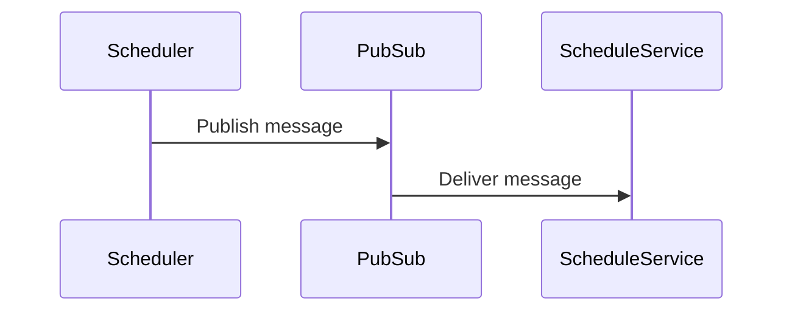
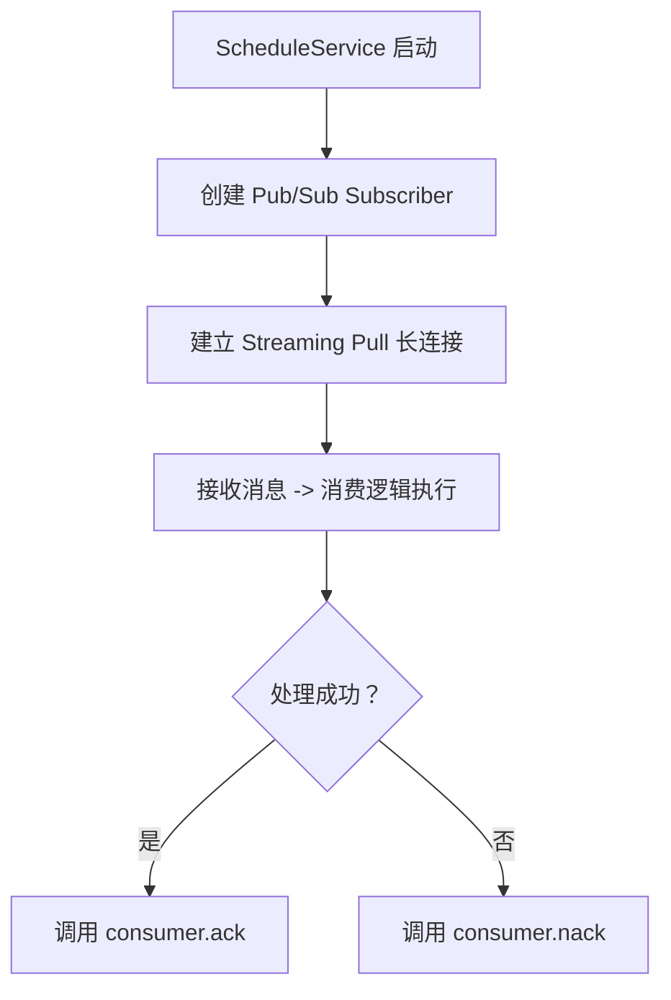
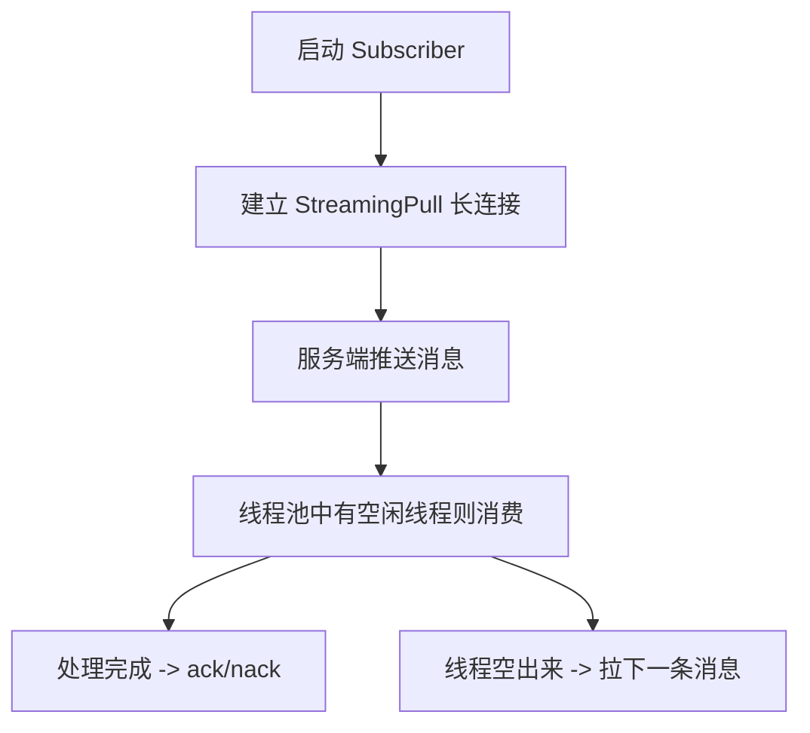

**Pub/Sub 队列如何被 ScheduleService 消费** 是理解整个事件驱动架构的核心。
那么我如果是Schedule Service去pull消息的话,那么这个频率和时间是怎么控制的?我什么时候去取,我多久去取一次 如何定义和核对?

当你的 **Schedule Service 主动去 pull Pub/Sub 消息** 时，**拉取频率、时间间隔、线程数等控制策略**是影响吞吐量和稳定性的关键

---

## **✅ GCP Pub/Sub 的两种订阅模式**

Google Cloud Pub/Sub 支持两种消息拉取方式（Subscriber 模式）：

|**模式**|**说明**|**ScheduleService 使用方式**|
|---|---|---|
|**Push**|Pub/Sub 主动推送消息到指定的 HTTP Endpoint|GCP 自动调用你部署的 HTTP 服务|
|**Pull（常用）**|ScheduleService 主动向 Pub/Sub 拉取消息|使用客户端 SDK 拉取+Ack 处理（推荐）|

---

## **✅ 你当前流程对应的方式**

你的 Flow 是：



这个**更像是 Push 模式**，但实际上你提到 ScheduleService 中有重试逻辑、调用 Kong，并最终 Ack 消息，**更符合 Pull 模式**（你控制处理��程）。

---

## **✅ 推荐使用：**

## **Pull Subscription + Streaming Pull**

### **📌 优势**

- 更易于控制重试 / 超时 / Ack
    
- 可以做限流、延迟处理
    
- 容错好（Crash 不丢数据，因未 Ack）
    

---

## **✅ ScheduleService 消费 Pub/Sub 消息的推荐方式**

### **☑️ 使用 GCP Java Client SDK：**

```xml
<!-- Maven依赖 -->
<dependency>
  <groupId>com.google.cloud</groupId>
  <artifactId>google-cloud-pubsub</artifactId>
  <version>1.126.6</version> <!-- 推荐查看最新版本 -->
</dependency>
```

### **☑️ 核心消费代码（Streaming Pull）**

```java
ProjectSubscriptionName subscriptionName =
    ProjectSubscriptionName.of("your-project-id", "your-subscription-id");

MessageReceiver receiver =
    (PubsubMessage message, AckReplyConsumer consumer) -> {
        try {
            // 处理消息
            System.out.println("Received message: " + message.getData().toStringUtf8());

            // HTTP 调用 Kong -> Backend
            // Retry logic 如果失败就不 ack

            consumer.ack(); // 成功处理，ACK
        } catch (Exception e) {
            consumer.nack(); // 失败，要求重试
        }
    };

Subscriber subscriber = Subscriber.newBuilder(subscriptionName, receiver).build();
subscriber.startAsync().awaitRunning();
```

---

## **✅ 内部机制流程图**



---

## **✅ 控制消费行为**

你可以配置以下参数：

|**参数**|**说明**|
|---|---|
|maxOutstandingMessages|最大待 Ack 的消息数|
|executorThreadCount|线程数量控制并发|
|ackDeadline（Subscription 层）|处理消息的最长时间（超时会被重投）|
|flowControlSettings|消费速率限制|

```java
FlowControlSettings flowControlSettings =
    FlowControlSettings.newBuilder()
        .setMaxOutstandingElementCount(1000L)
        .setMaxOutstandingRequestBytes(10 * 1024 * 1024L) // 10MB
        .build();
```

---

## **✅ Push 模式适用场景（可选了解）**

如果你不希望自己控制拉取和 ack，可以配置：

```bash
gcloud pubsub subscriptions create my-sub \
  --topic=my-topic \
  --push-endpoint=https://schedule-service-url/tasks \
  --ack-deadline=30
```

但劣势：

- 你的 ScheduleService **必须暴露 HTTP Endpoint**
    
- **必须快速处理完**（否则超时就重投）
    
- 控制权较少（难限流/排队）
    

---

## **✅ 总结建议**

|**项目**|**推荐配置**|
|---|---|
|消费方式|**Pull + StreamingSubscriber**|
|并发控制|设置 executorThreadCount|
|Ack 策略|异步处理完后显式 ack/nack|
|错误重试|不 ack 即可重试（Pub/Sub 内部支持）|
|是否保存失败消息|可选结合 Dead Letter Topic（DLT）|

---

是否需要我补充一段完整的 Java Spring Boot + Pub/Sub Pull 模式的整合示例代码？包含重试、线程池配置、指标输出等。


那么我如果是Schedule Service去pull消息的话,那么这个频率和时间是怎么控制的?我什么时候去取,我多久去取一次 如何定义和核对?

这是一个非常核心且容易被忽略的问题。

当你的 **Schedule Service 主动去 pull Pub/Sub 消息** 时，**拉取频率、时间间隔、线程数等控制策略**是影响吞吐量和稳定性的关键。

---

## **✅ 前提：你使用的是** 

## **Streaming Pull 模式**

## **（推荐）**

这是 Google Cloud Pub/Sub Java 客户端中 **默认且推荐** 的方式。你不需要手动轮询，SDK 会通过一个长连接 **持续监听** 消息的到���。它不是 cron 轮询，也不是你手动设置间隔，而是：

> **一旦你启动 Subscriber，客户端会自动在后台维护一个 Streaming Pull 的长连接，并由内部线程池处理消息。**

---

## **✅ 控制拉取行为的关键参数**

你不控制「多久拉一次」，你控制以下维度：

|**控制项**|**控制方式**|**示例说明**|
|---|---|---|
|**并发线程数**|setExecutorProvider()|控制同时处理的消息数（并发度）|
|**消息积压控制**|setMaxOutstandingElementCount()|控制积压消息量，防止内存爆炸|
|**消息体积限制**|setMaxOutstandingRequestBytes()|控制积压消息的总内存上限|
|**Ack Deadline**|Subscription 配置层设置（默认 10s，可设最多 600s）|指定客户端必须多久内 Ack|
|**流控策略（Flow Control）**|使用 FlowControlSettings 配置|防止消费者被淹没|
|**最大流并发连接**|默认 Streaming Pull 连接是自动扩容的（最多 10 个）|GCP 客户端 SDK 内部处理|

---

## **✅ 示例：你如何控制拉取「频率」**

```java
Subscriber subscriber = Subscriber.newBuilder(subscriptionName, receiver)
    .setFlowControlSettings(
        FlowControlSettings.newBuilder()
            .setMaxOutstandingElementCount(100)        // 最多积压 100 条消息
            .setMaxOutstandingRequestBytes(20 * 1024 * 1024) // 最多 20MB 未处理
            .build()
    )
    .setExecutorProvider(
        InstantiatingExecutorProvider.newBuilder().setExecutorThreadCount(10).build()
    )
    .build();
```

这意味着：

- 客户端会持续通过 StreamingPull 拉消息
    
- 最多维持 10 个并发线程
    
- 最多积压 100 条未处理的消息或 20MB 的体积
    
- 一旦线程处理完一条消息并 ack 后，才会继续向服务端请求新消息
    

---

## **✅ 监控和核对拉取情况（建议使用指标）**

你可以通过以下方式确认实际拉取速率与频率：

### **1. GCP Monitoring 的 Metrics（推荐）**

```
metric: pubsub.googleapis.com/subscription/pull_message_operation_count
```

可用维度：

- subscription_id
    
- response_code（ACK、NACK、DEADLINE_EXCEEDED）
    

### **2. Java 应用自身指标（Micrometer + Prometheus）**

```yaml
management:
  metrics:
    enable:
      pubsub.message.processed: true
```

你可以手动打指标：

```java
metrics.counter("pubsub.message.processed", "status", "success").increment();
```

---

## **✅ 本质：Schedule Service 不主动轮询，而是** 

## **被动 + 控制拉取节奏**



---

## **✅ 总结建议**

|**控制项**|**建议配置**|
|---|---|
|executorThreadCount|和 CPU 数或处理速率挂钩（建议 4~20）|
|maxOutstandingCount|根据处理耗时控制（避免堆积）|
|ackDeadlineSeconds|若你处理较慢可改大（最多 600 秒）|
|Prometheus 监控拉取|追踪拉取速率、失败率等|

---

是否需要我输出一个完整的示例配置 + Prometheus Metrics 整合方案用于你 Schedule Service 的线程拉取控制与拉取频率核对？