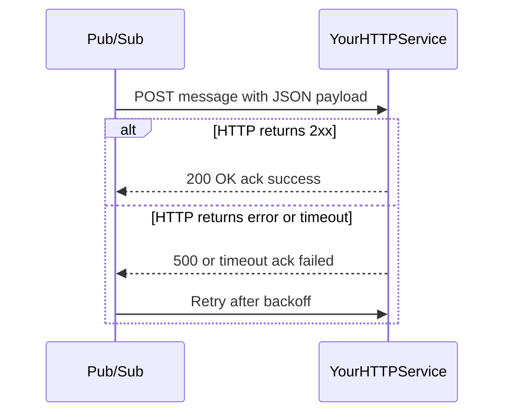

gcloud pubsub subscriptions describe

# ackDeadlineSecends
比如这个配置

ackDeadlineSeconds

我想了解这个订阅者在这段时间（秒）内确认消息，否则消息将重新投递

这个时间段特指哪里到哪里的时间?

好的，接下来我们详细讲讲 **Push 模式下的 ackDeadlineSeconds 行为**，并对比 Pull 模式，让你全面理解它在不同订阅模式下的作用。

✅ **是的，可以这么理解**：

---

## **🔑 简单总结一句话：**

> **ackDeadlineSeconds 实际就是你整个 E2E 链路中，从 Pub/Sub 发送消息 到 你（后端服务）确认消息处理完毕 之间允许的最大时间窗口**。

---

## **💡 E2E 包含哪些？**

以 Push 模式为例，这段时间大致包含：

1. Pub/Sub 发起 HTTP 请求的网络耗时；
2. 你的 HTTP 服务（可能是 GKE/Cloud Run）的接收延迟；
3. 你的应用逻辑实际处理时间（如查数据库、调用外部接口）；
4. 返回 HTTP 2xx 响应的时间；

这一整段 **“从 Pub/Sub 发出，到你返回确认响应”的总时间** 都要控制在 ackDeadlineSeconds 之内。

---

## **🔁 如果超过这个时间：**

- Pub/Sub 认为你没处理好；
- 会**再次重试**发送同一消息；
- 如果消息处理不是幂等的，可能会引发重复副作用。

---

## **⏱ 推荐策略：**

| **场景**               | **建议设置**                                  |
| ---------------------- | --------------------------------------------- |
| 简单处理（几秒完成）   | ackDeadlineSeconds: 10~20                     |
| 后台重处理、复杂任务   | ackDeadlineSeconds: 60~300                    |
| 异步处理（不等待结果） | 快速返回 200，异步处理，**无需延长 deadline** |

---

是否要我帮你画一个 Pub/Sub 的 Push 模式 E2E 超时判断流程图？这样你可以在文档中更好说明。

---

## **🔄 Push 模式下的 ack 行为**

在 Push 模式下，Pub/Sub 会将消息作为 **HTTP POST 请求** 推送到你配置的 pushEndpoint，并期望你的服务**返回 2xx 响应**来表示“acknowledged”。

---

### **📌 Push 模式中的 ack 流程**

1. **Pub/Sub 将消息 POST 到 pushEndpoint**；
2. 你的服务（HTTP Server）接收 POST 请求；
3. 如果你的服务返回 **2xx 响应（如 200 OK、204 No Content）**：

    - ✅ Pub/Sub 认为消息“已确认”（acknowledged）；
    - ❌ 否则（4xx, 5xx, 超时、断开连接等），Pub/Sub 会将消息重新投递，直到 ack 成功或超出保留时间。

---

### **🧠 在 Push 模式中，**

### **ackDeadlineSeconds**

###  **控制的是：**

> Pub/Sub 等待你的 HTTP 服务返回 2xx 响应的最长时间（从发送请求起计时），超时视为未 ack。

---

## **🔁 Pull 模式 vs Push 模式 ack 对比**

| **行为**     | **Pull 模式**                        | **Push 模式**                            |
| ------------ | ------------------------------------ | ---------------------------------------- |
| 触发点       | 客户端调用 pull()                    | Pub/Sub 主动 POST 消息                   |
| ack 方法     | 客户端手动调用 ack()                 | HTTP 服务返回 2xx                        |
| ack 超时控制 | ackDeadlineSeconds：从 pull 返回算起 | ackDeadlineSeconds：从 POST 请求发送算起 |
| 失败处理     | 超时/未 ack 会重新投递               | HTTP 错误/超时 会重新 POST               |
| 幂等处理要求 | 需要（可能会重复 pull）              | 需要（可能会重复 POST）                  |

---

## **📈 Mermaid 时序图（Push 模式）**

---

## **🔧 调试建议（Push）**

- 使用 GCP Cloud Logging 查看 Pub/Sub 是否因超时或非 2xx 重试；
- 检查 HTTP Server 响应是否过慢或未返回正确 2xx；
- 可以使用 [dead-letter topic](https://cloud.google.com/pubsub/docs/dead-letter-topics) 配置，将多次失败的消息转移，防止无限重试。

---

## **🧪 实践建议**

- **Push 模式**下，确保 pushEndpoint 的 HTTP 服务：
    - 响应足够快；
    - 保证 2xx 状态码返回；
    - 使用 **X-Goog-Channel-Token** 等 header 验证安全性；
- 如果处理逻辑复杂，考虑 **Pull 模式**，更可控。

---

是否需要我帮你展示如何配置一个 pushEndpoint 接收 Pub/Sub 消息？或者你在使用的是哪种类型订阅（Pull 还是 Push）我可以继续针对性说明。
