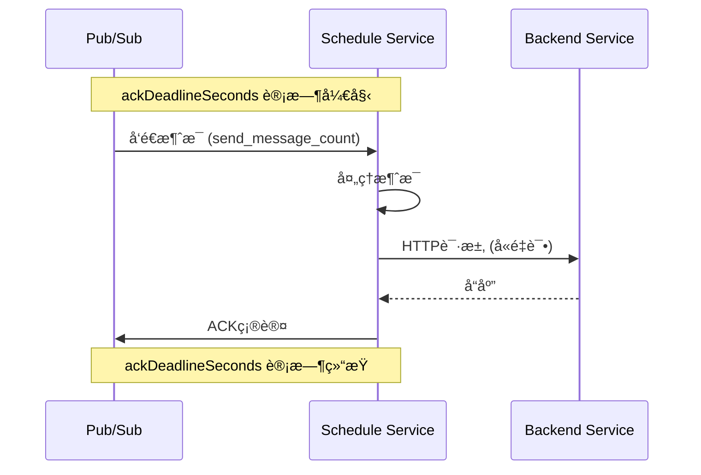
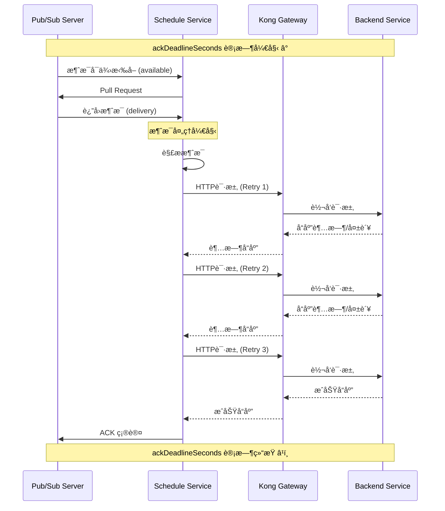
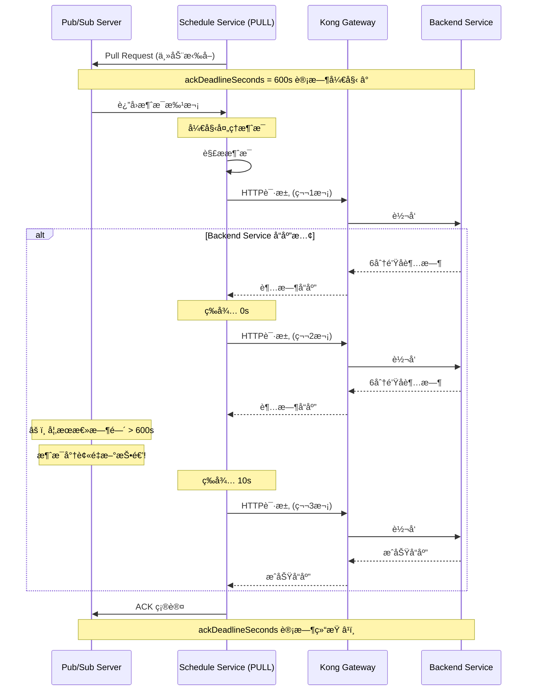

gcloud pubsub subscriptions describe

https://cloud.google.com/pubsub/docs/concurrency-control?hl=zh-cn#java

# ackDeadlineSecends

好的，下é¢æ˜¯ä¸€ä¸ªå±•ç¤º Java Pub/Sub 客户端 ack 消æ¯ä¸å端调用之间的解耦关系 çš„ Mermaid æµç¨‹å›¾ï¼Œé‡ç‚¹è¯´æ˜ï¼š
	•	ack() ç»“æŸ Pub/Sub 投递生命周期
	•	åç«¯è°ƒç”¨ä¸ Pub/Sub 无感知
	•	错误 ack 会导致消æ¯ä¸¢å¤±

⸻

```mermaid
flowchart TD
    subgraph Pub/Sub
        A[投递消æ¯] --> B[Java Client 拉å–消æ¯]
    end

    B --> C[调用 receiveMessagemsg, ackHandler]

    subgraph Java Client
        C --> D{是å¦ç«‹å³ ack}

        D -- 是 --> E[ackHandler.ack]
        E --> F[Pub/Sub 标记消æ¯å®Œæˆ<br>ä¸ä¼šé‡è¯•]
        E --> G[异步调用å端æœåŠ¡]:::gray

        D -- å¦ --> H[调用å端æœåŠ¡]
        H --> I{调用æˆåŠŸï¼Ÿ}

        I -- 是 --> J[ackHandler.ack] --> F
        I -- å¦ --> K[ackHandler.nack] --> L[Pub/Sub é‡è¯•æ¶ˆæ¯]
    end

    classDef gray fill=#e8e8e8,color=#888
```

⸻

🧠 图示说æ˜
	•	ä½ å¯ä»¥åœ¨ 处ç†å‰å°± ack，Pub/Sub 就“认为你æˆåŠŸäº†â€ï¼Œå“ªæ€•åé¢å¤±è´¥äº†ä¹Ÿä¸ä¼šå†æŠ•é€’。
	•	æ¨è模å¼æ˜¯ï¼šå…ˆå¤„ç† â†’ æˆåŠŸåå† ack，失败则 nack。
	•	ackDeadlineSeconds 是客户端自动延长的（在åå°å®Œæˆï¼‰ï¼Œä½ ä¸éœ€è¦æ‰‹åŠ¨ç®¡é™¤é你写的是底层 API。

⸻

如æœä½ æœªæ¥æƒ³åšæ›´å¤æ‚的场景（比如部分 ackã€å¹‚ç­‰é‡è¯•ã€dead-letter queue），也å¯ä»¥ç»§ç»­æ‰©å±•è¿™å¥—模å‹ã€‚是å¦éœ€è¦æˆ‘也补上 DLQ 场景？

比如这个é…ç½®
ackDeadlineSeconds 详解
时间范围: ä» Pub/Sub å‘客户端å‘é€æ¶ˆæ¯å¼€å§‹ï¼Œåˆ°å®¢æˆ·ç«¯å‘é€ ACK 确认为止的时间窗å£

ackDeadlineSeconds

我想了解这个订阅者在这段时间（秒）内确认消æ¯ï¼Œå¦åˆ™æ¶ˆæ¯å°†é‡æ–°æŠ•é€’

这个时间段特指哪里到哪里的时间?



好的，æ¥ä¸‹æ¥æˆ‘们详细讲讲 **Push 模å¼ä¸‹çš„ ackDeadlineSeconds 行为**，并对比 Pull 模å¼ï¼Œè®©ä½ å…¨é¢ç†è§£å®ƒåœ¨ä¸åŒè®¢é˜…模å¼ä¸‹çš„作用。

✅ **是的，å¯ä»¥è¿™ä¹ˆç†è§£**：

---

## **🔑 简å•æ€»ç»“一å¥è¯ï¼š**

> **ackDeadlineSeconds å®é™…就是你整个 E2E é“¾è·¯ä¸­ï¼Œä» Pub/Sub å‘é€æ¶ˆæ¯ 到 你（å端æœåŠ¡ï¼‰ç¡®è®¤æ¶ˆæ¯å¤„ç†å®Œæ¯• 之间å…许的最大时间窗å£**。

在 PULL 模å¼ä¸‹ï¼Œ`ackDeadlineSeconds` 就是整个 E2E 链路的最大时间窗å£
**是的，完全正确ï¼** 在 PULL 模å¼ä¸‹ï¼Œ`ackDeadlineSeconds` 就是整个 E2E 链路的最大时间窗å£ã€‚

## ackDeadlineSeconds 在 PULL 模å¼ä¸‹çš„精确定义



## 时间窗å£åŒ…å«çš„所有ç¯èŠ‚

| ç¯èŠ‚             | 耗时估算   | è¯´æ˜                                   |
| ---------------- | ---------- | -------------------------------------- |
| **Pull 延迟**    | 50-200ms   | Schedule Service å‘èµ· Pull 到æ¥æ”¶æ¶ˆæ¯  |
| **消æ¯è§£æ**     | 10-50ms    | 解æ消æ¯ä½“，æ„建 HTTP 请求             |
| **é‡è¯•å¾ªç¯**     | 0-1080s    | 3 次é‡è¯• × (Kong 超时 6min + 间隔时间) |
| **网络往返**     | 50-500ms   | 到 Kong 的网络延迟                     |
| **Kong 处ç†**    | 10-100ms   | 路由ã€æ’件处ç†æ—¶é—´                     |
| **Backend 处ç†** | 100ms-5min | å®é™…业务逻辑处ç†æ—¶é—´                   |
| **ACK 确认**     | 50-200ms   | å‘é€ ACK 到 Pub/Sub                    |

## 当å‰é—®é¢˜åˆ†æ

æ ¹æ®ä½ çš„é…置：

- Kong 超时：6 分钟
- é‡è¯• 3 次：间隔 0s, 10s, 20s
- 总é‡è¯•æ—¶é—´ï¼š**最å情况 ≈ 18 分钟 + 30 秒**

```
最å情况计算：
第1次: 6分钟 + 0秒延迟
第2次: 6分钟 + 10秒延迟
第3次: 6分钟 + 20秒延迟
总计: 18分30秒 + 其他处ç†æ—¶é—´
```

## æ¨èçš„ ackDeadlineSeconds é…ç½®

```yaml
# ä¿å®ˆé…ç½® (æ¨è)
ackDeadlineSeconds: 1800  # 30分钟

# 激进é…ç½® (如æœä½ æƒ³å¼ºåˆ¶å¿«é€Ÿå¤„ç†)
ackDeadlineSeconds: 1200  # 20分钟

# 计算ä¾æ®
# é‡è¯•æ€»æ—¶é—´(18.5min) + 业务处ç†æ—¶é—´(5min) + 缓冲时间(6.5min) = 30min
```

## 优化建议

### 1. 缩短å•æ¬¡è¶…时时间

```java
// HTTP Client é…置优化
@Bean
public RestTemplate restTemplate() {
    HttpComponentsClientHttpRequestFactory factory =
        new HttpComponentsClientHttpRequestFactory();

    // 缩短å•æ¬¡è¯·æ±‚超时
    factory.setConnectTimeout(5000);     // è¿æ¥è¶…æ—¶ 5s
    factory.setReadTimeout(180000);      // 读å–超时 3min (而éä¾èµ–Kongçš„6min)

    return new RestTemplate(factory);
}
```

### 2. 智能é‡è¯•ç­–ç•¥

```java
@Bean
public RetryTemplate retryTemplate() {
    RetryTemplate retryTemplate = new RetryTemplate();

    // 指数退é¿ï¼Œæ€»é‡è¯•æ—¶é—´æ§åˆ¶åœ¨10分钟内
    ExponentialBackOffPolicy backOffPolicy = new ExponentialBackOffPolicy();
    backOffPolicy.setInitialInterval(2000);      // 2s
    backOffPolicy.setMultiplier(2.0);
    backOffPolicy.setMaxInterval(60000);         // 最大1分钟

    // 时间é™åˆ¶é‡è¯•ç­–ç•¥
    TimeoutRetryPolicy retryPolicy = new TimeoutRetryPolicy();
    retryPolicy.setTimeout(600000);  // 10分钟总é‡è¯•æ—¶é—´

    retryTemplate.setBackOffPolicy(backOffPolicy);
    retryTemplate.setRetryPolicy(retryPolicy);

    return retryTemplate;
}
```

### 3. 并å‘处ç†é¿å…阻å¡

```java
@Component
public class MessageProcessor {

    @Async("messageProcessingExecutor")
    public CompletableFuture<Void> processMessage(PubsubMessage message) {
        try {
            // 异步处ç†æ¶ˆæ¯ï¼Œé¿å…阻å¡å…¶ä»–消æ¯
            String result = retryTemplate.execute(context -> {
                return callBackendService(message);
            });

            // 处ç†æˆåŠŸï¼Œç«‹å³ACK
            message.ack();

        } catch (Exception e) {
            // 处ç†å¤±è´¥ï¼ŒNACK让消æ¯é‡æ–°æŠ•é€’
            message.nack();
        }

        return CompletableFuture.completedFuture(null);
    }
}
```

### 4. ç›‘æ§ ackDeadlineSeconds 使用情况

```java
// 自定义指标监æ§
@Component
public class PubSubMetrics {

    private final MeterRegistry meterRegistry;
    private final Timer.Sample processTimer;

    public void startProcessing() {
        processTimer = Timer.start(meterRegistry);
    }

    public void endProcessing(boolean success) {
        processTimer.stop(Timer.builder("pubsub.message.process.duration")
            .tag("success", String.valueOf(success))
            .register(meterRegistry));
    }
}
```

## 关键点总结

1. **ackDeadlineSeconds = ä½ çš„ E2E 处ç†æ—¶é—´ä¸Šé™**
2. **超过这个时间，消æ¯ä¼šè¢«é‡æ–°æŠ•é€’给其他消费者å®ä¾‹**
3. **é‡å¤æŠ•é€’å¯èƒ½å¯¼è‡´é‡å¤å¤„ç†ï¼Œéœ€è¦ä¸šåŠ¡å¹‚等性ä¿è¯**
4. **建议设置为最å情况的 1.5-2 å€ä½œä¸ºå®‰å…¨ç¼“冲**

## ä½ çš„ç†è§£å®Œå…¨æ­£ç¡®ï¼è¿™ä¸ªæ—¶é—´çª—å£è¦†ç›–了ä»æ¶ˆæ¯å¯ä¾›æ‹‰å–到 ACK 确认的整个生命周期。

## PULL 模å¼ä¸‹çš„ gcloud 命令输出

```bash
# 查看 PULL 模å¼è®¢é˜…é…ç½®
gcloud pubsub subscriptions describe SUBSCRIPTION_NAME

# PULL 模å¼è¾“出示例
ackDeadlineSeconds: 600
enableMessageOrdering: false
expirationPolicy: {}
messageRetentionDuration: 604800s
name: projects/PROJECT_ID/subscriptions/SUBSCRIPTION_NAME
# 注æ„：PULL 模å¼æ²¡æœ‰ pushConfig 字段，或者 pushConfig 为空
pushConfig: {}
retainAckedMessages: false
topic: projects/PROJECT_ID/topics/TOPIC_NAME

# é¢å¤–çš„ PULL 模å¼ç›¸å…³é…ç½®
flowControlSettings:
  maxOutstandingMessages: 1000
  maxOutstandingBytes: 104857600
```

## PULL 模å¼ä¸‹ ackDeadlineSeconds 的精确å«ä¹‰

在 **PULL 模å¼**下，`ackDeadlineSeconds: 600` 的计时方å¼ï¼š



## PULL 模å¼çš„关键特性

| 特性         | PULL æ¨¡å¼                           | å½±å“                               |
| ------------ | ----------------------------------- | ---------------------------------- |
| **消æ¯æ‹‰å–** | Schedule Service 主动 Pull          | å¯æ§åˆ¶æ‹‰å–频ç‡å’Œæ‰¹é‡å¤§å°           |
| **并å‘æ§åˆ¶** | 客户端æ§åˆ¶ `maxOutstandingMessages` | å¯è®¾ç½®æœª ACK 消æ¯çš„ä¸Šé™            |
| **超时计算** | ä» Pull æˆåŠŸè¿”å›å¼€å§‹è®¡æ—¶            | **ä¸åŒ…括** Pull Request 的网络时间 |
| **é‡æ–°æŠ•é€’** | 600s å消æ¯é‡æ–°å¯è¢«æ‹‰å–             | å¯èƒ½è¢«åŒä¸€å®ä¾‹æˆ–其他å®ä¾‹æ‹‰å–       |

## 当å‰é…置问题分æ

ä½ çš„é…置确å®ä¸åˆç†ï¼š

```
ackDeadlineSeconds: 600s (10分钟)
Kong 超时: 6分钟 × 3次é‡è¯• = 18分钟
é‡è¯•é—´éš”: 0s + 10s + 20s = 30s
总处ç†æ—¶é—´: ≈ 18分30秒 >> 600s âŒ
```

## PULL 模å¼ä¼˜åŒ–方案

### 方案 1: 客户端æ§åˆ¶è¶…æ—¶ (æ¨è)

```java
@Component
public class PubSubPullService {

    private final Subscriber subscriber;

    @PostConstruct
    public void startPulling() {
        MessageReceiver receiver = (message, consumer) -> {
            // 设置消æ¯å¤„ç†æ€»è¶…æ—¶
            CompletableFuture<Void> processingFuture = CompletableFuture.runAsync(() -> {
                try {
                    processMessageWithTimeout(message);
                    consumer.ack(); // æˆåŠŸæ—¶ACK
                } catch (Exception e) {
                    consumer.nack(); // 失败时NACK，让消æ¯é‡æ–°å¯æ‹‰å–
                }
            });

            // 580s 超时æ§åˆ¶ï¼Œç•™20s缓冲
            try {
                processingFuture.get(580, TimeUnit.SECONDS);
            } catch (TimeoutException e) {
                log.warn("Message processing timeout, nacking message");
                consumer.nack();
            }
        };

        subscriber = Subscriber.newBuilder(subscriptionName, receiver)
            .setParallelPullCount(4)                    // 4个并行拉å–线程
            .setMaxAckExtensionPeriod(Duration.ofSeconds(600))  // åŒ¹é… ackDeadlineSeconds
            .setFlowControlSettings(FlowControlSettings.newBuilder()
                .setMaxOutstandingElementCount(100L)     // 最大100个未ACK消æ¯
                .setMaxOutstandingRequestBytes(50L * 1024L * 1024L) // 50MB
                .build())
            .build();

        subscriber.startAsync().awaitRunning();
    }
}
```

### 方案 2: 快速失败 + 智能é‡è¯•

```java
@Service
public class MessageProcessingService {

    @Retryable(value = {Exception.class}, maxAttempts = 4)
    @Timeout(value = 580, unit = ChronoUnit.SECONDS) // 总超时580s
    public void processMessage(PubsubMessage message) {

        // å•æ¬¡è¯·æ±‚快速失败
        RestTemplate fastFailRestTemplate = createFastFailRestTemplate();

        try {
            String response = fastFailRestTemplate.postForObject(
                backendUrl,
                buildRequest(message),
                String.class
            );

            log.info("Message processed successfully: {}", response);

        } catch (Exception e) {
            log.warn("Attempt failed, will retry: {}", e.getMessage());
            throw e; // 触å‘é‡è¯•
        }
    }

    private RestTemplate createFastFailRestTemplate() {
        HttpComponentsClientHttpRequestFactory factory =
            new HttpComponentsClientHttpRequestFactory();

        // 快速失败é…ç½®
        factory.setConnectTimeout(3000);    // 3s è¿æ¥è¶…æ—¶
        factory.setReadTimeout(90000);      // 90s 读å–超时 (而ä¸æ˜¯6分钟)

        return new RestTemplate(factory);
    }

    @Backoff(delay = 5000, multiplier = 1.5, maxDelay = 60000)
    public void processMessage(PubsubMessage message) {
        // é‡è¯•é€»è¾‘
    }
}
```

### 方案 3: 修改 ackDeadlineSeconds (如æœå¯èƒ½)

```bash
# 检查是å¦å¯ä»¥ä¿®æ”¹ ackDeadlineSeconds
gcloud pubsub subscriptions update SUBSCRIPTION_NAME \
    --ack-deadline=600

# 注æ„：GCP Pub/Sub 的最大值é™åˆ¶
# 标准订阅: 最大 600s (10分钟)
# 有åºè®¢é˜…: 最大 600s (10分钟)
```

**é‡è¦æ醒**: Pub/Sub çš„ `ackDeadlineSeconds` 最大值就是 600s，无法设置更长时间。

## PULL 模å¼ä¸“用é…ç½®

### 1. 订阅é…置优化

```bash
# PULL 模å¼ä¼˜åŒ–é…ç½®
gcloud pubsub subscriptions update SUBSCRIPTION_NAME \
    --ack-deadline=600 \
    --message-retention-duration=7d \
    --max-delivery-attempts=5 \
    --dead-letter-topic=DEAD_LETTER_TOPIC
```

### 2. 客户端æµæ§é…ç½®

```yaml
# application.yml - PULL 模å¼ä¸“用é…ç½®
spring:
  cloud:
    gcp:
      pubsub:
        subscriber:
          parallel-pull-count: 4
          max-ack-extension-period: 600s
          pull-timeout: 30s # PULL 请求超时
          flow-control:
            max-outstanding-element-count: 100 # 未ACK消æ¯æ•°é™åˆ¶
            max-outstanding-request-bytes: 52428800 # 50MB

# 消æ¯å¤„ç†è¶…æ—¶é…ç½®
message-processing:
  timeout: 580s # å°äº ackDeadlineSeconds
  retry:
    max-attempts: 4
    backoff:
      initial-delay: 3s
      multiplier: 1.5
      max-delay: 30s
```

### 3. 快速失败的 HTTP é…ç½®

```java
@Configuration
public class HttpClientConfig {

    @Bean
    @Primary
    public RestTemplate quickFailRestTemplate() {
        PoolingHttpClientConnectionManager connectionManager =
            new PoolingHttpClientConnectionManager();
        connectionManager.setMaxTotal(50);
        connectionManager.setDefaultMaxPerRoute(10);

        RequestConfig requestConfig = RequestConfig.custom()
            .setConnectTimeout(3000)           // 3s è¿æ¥
            .setSocketTimeout(120000)          // 2åˆ†é’Ÿè¯»å– (ä¸æ˜¯6分钟)
            .setConnectionRequestTimeout(1000) // 1s è·å–è¿æ¥
            .build();

        CloseableHttpClient httpClient = HttpClients.custom()
            .setConnectionManager(connectionManager)
            .setDefaultRequestConfig(requestConfig)
            .setRetryHandler(new DefaultHttpRequestRetryHandler(0, false)) // ç¦ç”¨HTTP层é‡è¯•
            .build();

        HttpComponentsClientHttpRequestFactory factory =
            new HttpComponentsClientHttpRequestFactory(httpClient);

        return new RestTemplate(factory);
    }
}
```

## æ¨è时间é…ç½®

| 组件                    | 超时é…ç½®             | è¯´æ˜                |
| ----------------------- | -------------------- | ------------------- |
| **ackDeadlineSeconds**  | 600s                 | Pub/Sub 最大é™åˆ¶    |
| **HTTP ConnectTimeout** | 3s                   | 快速å‘ç°ç½‘络问题    |
| **HTTP ReadTimeout**    | 120s                 | å•æ¬¡è¯·æ±‚ 2 åˆ†é’Ÿä¸Šé™ |
| **应用层é‡è¯•æ¬¡æ•°**      | 4 次                 | 在 580s å†…å®Œæˆ      |
| **é‡è¯•é—´éš”**            | 3s, 4.5s, 6.75s, 10s | æŒ‡æ•°é€€é¿            |
| **总处ç†è¶…æ—¶**          | 580s                 | ç•™ 20s 缓冲给 ACK   |

这样é…ç½®å¯ä»¥ç¡®ä¿åœ¨ PULL 模å¼ä¸‹ï¼Œæ‰€æœ‰å¤„ç†éƒ½åœ¨ `ackDeadlineSeconds` é™åˆ¶å†…完æˆã€‚

## **💡 E2E 包å«å“ªäº›ï¼Ÿ**

以 Push 模å¼ä¸ºä¾‹ï¼Œè¿™æ®µæ—¶é—´å¤§è‡´åŒ…å«ï¼š

1. Pub/Sub å‘èµ· HTTP 请求的网络耗时；
2. ä½ çš„ HTTP æœåŠ¡ï¼ˆå¯èƒ½æ˜¯ GKE/Cloud Run）的æ¥æ”¶å»¶è¿Ÿï¼›
3. 你的应用逻辑å®é™…处ç†æ—¶é—´ï¼ˆå¦‚查数æ®åº“ã€è°ƒç”¨å¤–部æ¥å£ï¼‰ï¼›
4. è¿”å› HTTP 2xx å“应的时间；

这一整段 **â€œä» Pub/Sub å‘出，到你返å›ç¡®è®¤å“应â€çš„总时间** 都è¦æ§åˆ¶åœ¨ ackDeadlineSeconds 之内。

---

## **🔠如æœè¶…过这个时间：**

- Pub/Sub 认为你没处ç†å¥½ï¼›
- 会**å†æ¬¡é‡è¯•**å‘é€åŒä¸€æ¶ˆæ¯ï¼›
- 如æœæ¶ˆæ¯å¤„ç†ä¸æ˜¯å¹‚等的，å¯èƒ½ä¼šå¼•å‘é‡å¤å‰¯ä½œç”¨ã€‚

---

## **â± æ¨è策略：**

| **场景**               | **建议设置**                                  |
| ---------------------- | --------------------------------------------- |
| 简å•å¤„ç†ï¼ˆå‡ ç§’完æˆï¼‰   | ackDeadlineSeconds: 10~20                     |
| åå°é‡å¤„ç†ã€å¤æ‚任务   | ackDeadlineSeconds: 60~300                    |
| 异步处ç†ï¼ˆä¸ç­‰å¾…结æœï¼‰ | å¿«é€Ÿè¿”å› 200，异步处ç†ï¼Œ**无需延长 deadline** |

---

是å¦è¦æˆ‘帮你画一个 Pub/Sub çš„ Push æ¨¡å¼ E2E 超时判断æµç¨‹å›¾ï¼Ÿè¿™æ ·ä½ å¯ä»¥åœ¨æ–‡æ¡£ä¸­æ›´å¥½è¯´æ˜ã€‚

---

## **🔄 Push 模å¼ä¸‹çš„ ack 行为**

在 Push 模å¼ä¸‹ï¼ŒPub/Sub 会将消æ¯ä½œä¸º **HTTP POST 请求** æ¨é€åˆ°ä½ é…置的 pushEndpoint，并期望你的æœåŠ¡**è¿”å› 2xx å“应**æ¥è¡¨ç¤ºâ€œacknowledgedâ€ã€‚

---

### **📌 Push 模å¼ä¸­çš„ ack æµç¨‹**

1. **Pub/Sub å°†æ¶ˆæ¯ POST 到 pushEndpoint**ï¼›
2. ä½ çš„æœåŠ¡ï¼ˆHTTP Server）æ¥æ”¶ POST 请求；
3. 如æœä½ çš„æœåŠ¡è¿”å› **2xx å“应（如 200 OKã€204 No Content）**：

   - ✅ Pub/Sub 认为消æ¯â€œå·²ç¡®è®¤â€ï¼ˆacknowledged）；
   - ⌠å¦åˆ™ï¼ˆ4xx, 5xx, 超时ã€æ–­å¼€è¿æ¥ç­‰ï¼‰ï¼ŒPub/Sub 会将消æ¯é‡æ–°æŠ•é€’，直到 ack æˆåŠŸæˆ–超出ä¿ç•™æ—¶é—´ã€‚

---

### **🧠 在 Push 模å¼ä¸­ï¼Œ**

### **ackDeadlineSeconds**

###  **æ§åˆ¶çš„是：**

> Pub/Sub 等待你的 HTTP æœåŠ¡è¿”å› 2xx å“应的最长时间（ä»å‘é€è¯·æ±‚起计时），超时视为未 ack。

---

## **🔠Pull æ¨¡å¼ vs Push æ¨¡å¼ ack 对比**

| **行为**     | **Pull 模å¼**                        | **Push 模å¼**                            |
| ------------ | ------------------------------------ | ---------------------------------------- |
| 触å‘点       | 客户端调用 pull()                    | Pub/Sub 主动 POST æ¶ˆæ¯                   |
| ack 方法     | 客户端手动调用 ack()                 | HTTP æœåŠ¡è¿”å› 2xx                        |
| ack 超时æ§åˆ¶ | ackDeadlineSecondsï¼šä» pull è¿”å›ç®—èµ· | ackDeadlineSecondsï¼šä» POST 请求å‘é€ç®—èµ· |
| å¤±è´¥å¤„ç†     | 超时/未 ack 会é‡æ–°æŠ•é€’               | HTTP 错误/超时 会é‡æ–° POST               |
| 幂等处ç†è¦æ±‚ | 需è¦ï¼ˆå¯èƒ½ä¼šé‡å¤ pull）              | 需è¦ï¼ˆå¯èƒ½ä¼šé‡å¤ POST）                  |

---

## **📈 Mermaid æ—¶åºå›¾ï¼ˆPush 模å¼ï¼‰**


---

## **🔧 调试建议（Push）**

- 使用 GCP Cloud Logging 查看 Pub/Sub 是å¦å› è¶…时或é 2xx é‡è¯•ï¼›
- 检查 HTTP Server å“应是å¦è¿‡æ…¢æˆ–未返å›æ­£ç¡® 2xxï¼›
- å¯ä»¥ä½¿ç”¨ [dead-letter topic](https://cloud.google.com/pubsub/docs/dead-letter-topics) é…置，将多次失败的消æ¯è½¬ç§»ï¼Œé˜²æ­¢æ— é™é‡è¯•ã€‚

---

## **🧪 å®è·µå»ºè®®**

- **Push 模å¼**ä¸‹ï¼Œç¡®ä¿ pushEndpoint çš„ HTTP æœåŠ¡ï¼š
  - å“应足够快；
  - ä¿è¯ 2xx 状æ€ç è¿”å›ï¼›
  - 使用 **X-Goog-Channel-Token** ç­‰ header 验è¯å®‰å…¨æ€§ï¼›
- 如æœå¤„ç†é€»è¾‘å¤æ‚，考虑 **Pull 模å¼**，更å¯æ§ã€‚

---

是å¦éœ€è¦æˆ‘帮你展示如何é…置一个 pushEndpoint æ¥æ”¶ Pub/Sub 消æ¯ï¼Ÿæˆ–者你在使用的是哪ç§ç±»å‹è®¢é˜…（Pull 还是 Push）我å¯ä»¥ç»§ç»­é’ˆå¯¹æ€§è¯´æ˜ã€‚

> **ackDeadlineSeconds å®é™…就是你整个 E2E é“¾è·¯ä¸­ï¼Œä» Pub/Sub å‘é€æ¶ˆæ¯ 到 你（å端æœåŠ¡ï¼‰ç¡®è®¤æ¶ˆæ¯å¤„ç†å®Œæ¯• 之间å…许的最大时间窗å£**。

ackDeadlineSeconds 在 Google Cloud Pub/Sub 中确å®æ˜¯ä¸€ä¸ªé常关键的“总开关â€æˆ–“计时器â€ï¼Œå°¤å…¶æ˜¯åœ¨ PULL 模å¼ä¸‹ã€‚它定义了 Pub/Sub
æœåŠ¡åœ¨å°†æ¶ˆæ¯å‘é€ç»™è®¢é˜…者å，等待订阅者确认（ACK）该消æ¯çš„最长时间。

ackDeadlineSeconds 的核心作用

ackDeadlineSeconds 的核心作用是：

1.  消æ¯å¯è§æ€§æ§åˆ¶ï¼š 当 Pub/Sub 将一æ¡æ¶ˆæ¯å‘é€ç»™è®¢é˜…者å，这æ¡æ¶ˆæ¯åœ¨ ackDeadlineSeconds
    期间内对其他订阅者（或åŒä¸€è®¢é˜…者的其他å®ä¾‹ï¼‰æ˜¯ä¸å¯è§çš„。这确ä¿äº†æ¶ˆæ¯çš„独å å¤„ç†ã€‚
2.  消æ¯é‡æŠ•é€’机制： 如æœè®¢é˜…者未能在 ackDeadlineSeconds 内确认消æ¯ï¼ŒPub/Sub
    会认为该消æ¯æœªè¢«æˆåŠŸå¤„ç†ï¼Œå¹¶å°†å…¶é‡æ–°æŠ•é€’给订阅者（å¯èƒ½æ˜¯åŒä¸€ä¸ªè®¢é˜…者å®ä¾‹ï¼Œä¹Ÿå¯èƒ½æ˜¯å…¶ä»–å®ä¾‹ï¼‰ã€‚è¿™ä¿è¯äº†æ¶ˆæ¯çš„至少一次（at-least-once）投递语义。
3.  防止消æ¯å †ç§¯ï¼š 适当é…ç½® ackDeadlineSeconds
    对äºé˜²æ­¢æ¶ˆæ¯å †ç§¯è‡³å…³é‡è¦ã€‚如æœå¤„ç†æ—¶é—´è¶…过这个期é™ï¼Œæ¶ˆæ¯ä¼šè¢«åå¤é‡æŠ•é€’，导致订阅中未确认消æ¯çš„æ•°é‡å¢åŠ ï¼Œç”šè‡³å¯èƒ½å¯¼è‡´æ¶ˆæ¯å¤„ç†çš„æ— é™å¾ªç¯ã€‚

在 PULL 模å¼ä¸‹çš„具体影å“

在 PULL 模å¼ä¸‹ï¼Œè®¢é˜…è€…ä¸»åŠ¨å‘ Pub/Sub æœåŠ¡è¯·æ±‚消æ¯ã€‚一旦消æ¯è¢«æ‹‰å–并å‘é€ç»™è®¢é˜…者，ackDeadlineSeconds 的计时就开始了。

- ç†æƒ³æƒ…况： 订阅者在 ackDeadlineSeconds 内完æˆæ¶ˆæ¯å¤„ç†ï¼Œå¹¶å‘é€ ACK 请求。Pub/Sub 收到 ACK å，将消æ¯ä»è®¢é˜…中移除。
- éç†æƒ³æƒ…况（消æ¯å †ç§¯åŸå› ï¼‰ï¼š
  - 处ç†æ—¶é—´è¿‡é•¿ï¼š 订阅者处ç†æ¶ˆæ¯çš„逻辑耗时超过了 ackDeadlineSeconds。
  - ACK 请求失败： 订阅者处ç†å®Œæ¶ˆæ¯ï¼Œä½†ç”±äºç½‘络问题或其他åŸå› æœªèƒ½åŠæ—¶å‘é€ ACK 请求。
  - 订阅者崩溃： 订阅者在处ç†æ¶ˆæ¯æœŸé—´å´©æºƒï¼Œæœªèƒ½å‘é€ ACK。

在上述éç†æƒ³æƒ…况下，消æ¯ä¼šåœ¨ ackDeadlineSeconds 到期å被é‡æ–°æŠ•é€’，ä»è€Œå¯¼è‡´ unacked_messages_by_region 指标的å¢åŠ ã€‚

æµç¨‹å›¾ï¼šPULL 模å¼ä¸‹ ackDeadlineSeconds çš„å½±å“

```mermaid
    graph TD;
         A[订阅者å‘èµ·Pull请求] --> B[Pub/Subå‘é€æ¶ˆæ¯];
         B --> C{ackDeadlineSeconds计时开始};
         C --> D[订阅者æ¥æ”¶æ¶ˆæ¯];
         D --> E[订阅者处ç†æ¶ˆæ¯];
    E -- 处ç†å®Œæˆ --> F{在ackDeadlineSeconds内å‘é€ACK?};
    F -- 是 --> G[Pub/Sub收到ACK];
    G --> H[消æ¯ä»è®¢é˜…中移除];

   F -- å¦ (超时/失败) --> I[ackDeadlineSeconds到期];
   I --> J[消æ¯é‡æ–°å˜ä¸ºå¯è§/待投递];
   J --> B;

   subgraph 监æ§
   I -- 导致 --> K[unacked_messages_by_region å¢åŠ ];
   end
```
总结


  因此，你的ç†è§£æ˜¯å®Œå…¨æ­£ç¡®çš„。为了é¿å…在 PULL 模å¼ä¸‹æ¶ˆæ¯å †ç§¯ï¼Œç¡®ä¿ä½ çš„订阅者应用程åºèƒ½å¤Ÿåœ¨ `ackDeadlineSeconds` 
  内完æˆæ¶ˆæ¯çš„处ç†å¹¶å‘é€ç¡®è®¤ä¿¡å·ã€‚如æœæ¶ˆæ¯å¤„ç†æ—¶é—´ç¡®å®å¾ˆé•¿ï¼Œä½ å¯ä»¥è€ƒè™‘：


   * 延长 `ackDeadlineSeconds`： 在订阅é…置中å¢åŠ è¿™ä¸ªå€¼ï¼Œä½†è¦æ³¨æ„ä¸è¦è®¾ç½®è¿‡é•¿ï¼Œä»¥å…消æ¯é•¿æ—¶é—´ä¸è¢«ç¡®è®¤ã€‚
   * 使用 `ModifyAckDeadline`： 在处ç†æ¶ˆæ¯æœŸé—´ï¼Œè®¢é˜…者å¯ä»¥å‘¨æœŸæ€§åœ°è°ƒç”¨ ModifyAckDeadline æ¥å»¶é•¿ç‰¹å®šæ¶ˆæ¯çš„确认截止时间，为å¤æ‚或耗时的处ç†äº‰å–更多时间。
   * 优化消æ¯å¤„ç†é€»è¾‘： æ高订阅者的处ç†æ•ˆç‡ã€‚
   * å¢åŠ è®¢é˜…者å®ä¾‹ï¼š æ高并å‘处ç†èƒ½åŠ›ã€‚