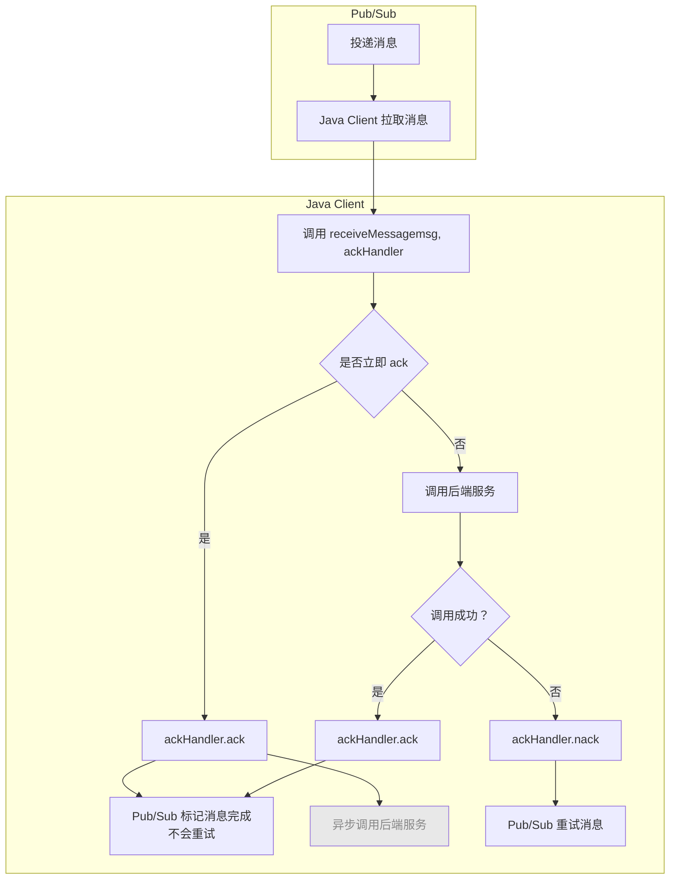

gcloud pubsub subscriptions describe

https://cloud.google.com/pubsub/docs/concurrency-control?hl=zh-cn#java

# ackDeadlineSecends

是的，你的理解 基本正确，但需要更精确一点。下面我来给你详细解释下 ackDeadlineSeconds 的意义、客户端 ack 的时机，以及它和后端服务之间的关系：

---

✅ ackDeadlineSeconds 的真实含义

这是 Pub/Sub 服务端为某条消息设定的“期望客户端处理完成并 ack 的最大时间”，从消息被投递（Push 模式）或被拉取（Pull 模式）开始计时。

默认值为 10 秒，最大可以配置到 600 秒（10 分钟），客户端可以通过 lease extension 自动延长这个时间。

---

🔄 Pull 模式下的 ack 生命周期

以你使用的 Java Subscriber 客户端为例（拉模式）：

```java
subscriber.startAsync();
```

一条消息的处理流程如下：

Pub/Sub 发送消息 -> 客户端收到 -> 调用 MessageReceiver.receiveMessage(msg, ackHandler)

此时你有两个选择：
	•	ackHandler.ack() ✅ 表示这条消息已经被成功处理（不再重投）
	•	ackHandler.nack() ❌ 表示处理失败，Pub/Sub 会在 ackDeadline 过期后重新投递消息

---

❗️关键点澄清

| 问题 | 说明 |
| --- | --- |
| 拉取到消息后立即 ack，可以吗？ | ✅ 是的。你可以在一拉取就 ack（哪怕还没发给后端服务），Pub/Sub 就认为这条消息已完成，不会再重试。 |
| ack 与后端服务处理是否强绑定？ | ❌ 没有绑定。Pub/Sub 不知道你消息内部的业务逻辑处理情况，只认你是否 ack() 了这条消息。 |
| 如果你 pull 到后出错没 ack 呢？ | ⏳ Pub/Sub 会在 ackDeadline 到期后重试投递该消息，直到 ack 或达到 maxDeliveryAttempts（Dead Letter） |


---

🧪 示例：错误 ack 导致消息丢失（风险提醒）

```java
MessageReceiver receiver =
    (PubsubMessage message, AckReplyConsumer consumer) -> {
        consumer.ack();  // 你还没处理就 ack 了

        // 异步调用后端服务
        callBackendService(message.getData());
    };
```

这种写法是危险的，因为如果 callBackendService() 调用失败或超时，消息也不会重投 —— 因为你已经 ack 了。

---

✅ 正确实践建议

```java
MessageReceiver receiver =
    (PubsubMessage message, AckReplyConsumer consumer) -> {
        try {
            callBackendService(message.getData());
            consumer.ack();  // 确认处理成功再 ack
        } catch (Exception e) {
            consumer.nack(); // 通知 Pub/Sub 重投
        }
    };
```

---

📌 总结一句话

你 ack 消息的时机是关键：一旦 ack，Pub/Sub 就认为这条消息生命周期结束。至于你是否真的处理完、是否调用了后端服务，Pub/Sub 不会也无法感知。

---

是否需要我画一个流图来展示 ack 和后端请求之间的关系（并不耦合）？

好的，下面是一个展示 Java Pub/Sub 客户端 ack 消息与后端调用之间的解耦关系 的 Mermaid 流程图，重点说明：
	•	ack() 结束 Pub/Sub 投递生命周期
	•	后端调用与 Pub/Sub 无感知
	•	错误 ack 会导致消息丢失

---



---

🧠 图示说明
	•	你可以在 处理前就 ack，Pub/Sub 就“认为你成功了”，哪怕后面失败了也不会再投递。
	•	推荐模式是：先处理 → 成功后再 ack，失败则 nack。
	•	ackDeadlineSeconds 是客户端自动延长的（在后台完成），你不需要手动管除非你写的是底层 API。

---

如果你未来想做更复杂的场景（比如部分 ack、幂等重试、dead-letter queue），也可以继续扩展这套模型。是否需要我也补上 DLQ 场景？

比如这个配置
ackDeadlineSeconds 详解
时间范围: 从 Pub/Sub 向客户端发送消息开始，到客户端发送 ACK 确认为止的时间窗口

ackDeadlineSeconds

我想了解这个订阅者在这段时间（秒）内确认消息，否则消息将重新投递

这个时间段特指哪里到哪里的时间?


好的，接下来我们详细讲讲 **Push 模式下的 ackDeadlineSeconds 行为**，并对比 Pull 模式，让你全面理解它在不同订阅模式下的作用。

✅ **是的，可以这么理解**：

---

## **🔑 简单总结一句话：**

> **ackDeadlineSeconds 实际就是你整个 E2E 链路中，从 Pub/Sub 发送消息 到 你（后端服务）确认消息处理完毕 之间允许的最大时间窗口**。

在 PULL 模式下，`ackDeadlineSeconds` 就是整个 E2E 链路的最大时间窗口
**是的，完全正确！** 在 PULL 模式下，`ackDeadlineSeconds` 就是整个 E2E 链路的最大时间窗口。

## ackDeadlineSeconds 在 PULL 模式下的精确定义


## 时间窗口包含的所有环节

| 环节 | 耗时估算 | 说明 |
| --- | --- | --- |
| **Pull 延迟** | 50-200ms | Schedule Service 发起 Pull 到接收消息 |
| **消息解析** | 10-50ms | 解析消息体，构建 HTTP 请求 |
| **重试循环** | 0-1080s | 3 次重试 × (Kong 超时 6min + 间隔时间) |
| **网络往返** | 50-500ms | 到 Kong 的网络延迟 |
| **Kong 处理** | 10-100ms | 路由、插件处理时间 |
| **Backend 处理** | 100ms-5min | 实际业务逻辑处理时间 |
| **ACK 确认** | 50-200ms | 发送 ACK 到 Pub/Sub |

## 当前配置问题分析

你的配置确实不合理：

```
ackDeadlineSeconds: 600s (10分钟)
Kong 超时: 6分钟 × 3次重试 = 18分钟
重试间隔: 0s + 10s + 20s = 30s
总处理时间: ≈ 18分30秒 >> 600s ❌
```

## PULL 模式优化方案

### 方案 1: 客户端控制超时 (推荐)

```java
@Component
public class PubSubPullService {

    private final Subscriber subscriber;

    @PostConstruct
    public void startPulling() {
        MessageReceiver receiver = (message, consumer) -> {
            // 设置消息处理总超时
            CompletableFuture<Void> processingFuture = CompletableFuture.runAsync(() -> {
                try {
                    processMessageWithTimeout(message);
                    consumer.ack(); // 成功时ACK
                } catch (Exception e) {
                    consumer.nack(); // 失败时NACK，让消息重新可拉取
                }
            });

            // 580s 超时控制，留20s缓冲
            try {
                processingFuture.get(580, TimeUnit.SECONDS);
            } catch (TimeoutException e) {
                log.warn("Message processing timeout, nacking message");
                consumer.nack();
            }
        };

        subscriber = Subscriber.newBuilder(subscriptionName, receiver)
            .setParallelPullCount(4)                    // 4个并行拉取线程
            .setMaxAckExtensionPeriod(Duration.ofSeconds(600))  // 匹配 ackDeadlineSeconds
            .setFlowControlSettings(FlowControlSettings.newBuilder()
                .setMaxOutstandingElementCount(100L)     // 最大100个未ACK消息
                .setMaxOutstandingRequestBytes(50L * 1024L * 1024L) // 50MB
                .build())
            .build();

        subscriber.startAsync().awaitRunning();
    }
}
```

### 方案 2: 快速失败 + 智能重试

```java
@Service
public class MessageProcessingService {

    @Retryable(value = {Exception.class}, maxAttempts = 4)
    @Timeout(value = 580, unit = ChronoUnit.SECONDS) // 总超时580s
    public void processMessage(PubsubMessage message) {

        // 单次请求快速失败
        RestTemplate fastFailRestTemplate = createFastFailRestTemplate();

        try {
            String response = fastFailRestTemplate.postForObject(
                backendUrl,
                buildRequest(message),
                String.class
            );

            log.info("Message processed successfully: {}", response);

        } catch (Exception e) {
            log.warn("Attempt failed, will retry: {}", e.getMessage());
            throw e; // 触发重试
        }
    }

    private RestTemplate createFastFailRestTemplate() {
        HttpComponentsClientHttpRequestFactory factory =
            new HttpComponentsClientHttpRequestFactory();

        // 快速失败配置
        factory.setConnectTimeout(3000);    // 3s 连接超时
        factory.setReadTimeout(90000);      // 90s 读取超时 (而不是6分钟)

        return new RestTemplate(factory);
    }

    @Backoff(delay = 5000, multiplier = 1.5, maxDelay = 60000)
    public void processMessage(PubsubMessage message) {
        // 重试逻辑
    }
}
```

### 方案 3: 修改 ackDeadlineSeconds (如果可能)

```bash
# 检查是否可以修改 ackDeadlineSeconds
gcloud pubsub subscriptions update SUBSCRIPTION_NAME \
    --ack-deadline=600

# 注意：GCP Pub/Sub 的最大值限制
# 标准订阅: 最大 600s (10分钟)
# 有序订阅: 最大 600s (10分钟)
```

**重要提醒**: Pub/Sub 的 `ackDeadlineSeconds` 最大值就是 600s，无法设置更长时间。

## PULL 模式专用配置

### 1. 订阅配置优化

```bash
# PULL 模式优化配置
gcloud pubsub subscriptions update SUBSCRIPTION_NAME \
    --ack-deadline=600 \
    --message-retention-duration=7d \
    --max-delivery-attempts=5 \
    --dead-letter-topic=DEAD_LETTER_TOPIC
```

### 2. 客户端流控配置

```yaml
# application.yml - PULL 模式专用配置
spring:
  cloud:
    gcp:
      pubsub:
        subscriber:
          parallel-pull-count: 4
          max-ack-extension-period: 600s
          pull-timeout: 30s # PULL 请求超时
          flow-control:
            max-outstanding-element-count: 100 # 未ACK消息数限制
            max-outstanding-request-bytes: 52428800 # 50MB

# 消息处理超时配置
message-processing:
  timeout: 580s # 小于 ackDeadlineSeconds
  retry:
    max-attempts: 4
    backoff:
      initial-delay: 3s
      multiplier: 1.5
      max-delay: 30s
```

### 3. 快速失败的 HTTP 配置

```java
@Configuration
public class HttpClientConfig {

    @Bean
    @Primary
    public RestTemplate quickFailRestTemplate() {
        PoolingHttpClientConnectionManager connectionManager =
            new PoolingHttpClientConnectionManager();
        connectionManager.setMaxTotal(50);
        connectionManager.setDefaultMaxPerRoute(10);

        RequestConfig requestConfig = RequestConfig.custom()
            .setConnectTimeout(3000)           // 3s 连接
            .setSocketTimeout(120000)          // 2分钟读取 (不是6分钟)
            .setConnectionRequestTimeout(1000) // 1s 获取连接
            .build();

        CloseableHttpClient httpClient = HttpClients.custom()
            .setConnectionManager(connectionManager)
            .setDefaultRequestConfig(requestConfig)
            .setRetryHandler(new DefaultHttpRequestRetryHandler(0, false)) // 禁用HTTP层重试
            .build();

        HttpComponentsClientHttpRequestFactory factory =
            new HttpComponentsClientHttpRequestFactory(httpClient);

        return new RestTemplate(factory);
    }
}
```

## 推荐时间配置

| 组件 | 超时配置 | 说明 |
| --- | --- | --- |
| **ackDeadlineSeconds** | 600s | Pub/Sub 最大限制 |
| **HTTP ConnectTimeout** | 3s | 快速发现网络问题 |
| **HTTP ReadTimeout** | 120s | 单次请求 2 分钟上限 |
| **应用层重试次数** | 4 次 | 在 580s 内完成 |
| **重试间隔** | 3s, 4.5s, 6.75s, 10s | 指数退避 |
| **总处理超时** | 580s | 留 20s 缓冲给 ACK |

这样配置可以确保在 PULL 模式下，所有处理都在 `ackDeadlineSeconds` 限制内完成。

## **💡 E2E 包含哪些？**

以 Push 模式为例，这段时间大致包含：

1. Pub/Sub 发起 HTTP 请求的网络耗时；
2. 你的 HTTP 服务（可能是 GKE/Cloud Run）的接收延迟；
3. 你的应用逻辑实际处理时间（如查数据库、调用外部接口）；
4. 返回 HTTP 2xx 响应的时间；

这一整段 **“从 Pub/Sub 发出，到你返回确认响应”的总时间** 都要控制在 ackDeadlineSeconds 之内。

---

## **🔁 如果超过这个时间：**

- Pub/Sub 认为你没处理好；
- 会**再次重试**发送同一消息；
- 如果消息处理不是幂等的，可能会引发重复副作用。

---

## **⏱ 推荐策略：**

| **场景** | **建议设置** |
| --- | --- |
| 简单处理（几秒完成） | ackDeadlineSeconds: 10~20 |
| 后台重处理、复杂任务 | ackDeadlineSeconds: 60~300 |
| 异步处理（不等待结果） | 快速返回 200，异步处理，**无需延长 deadline** |

---

是否要我帮你画一个 Pub/Sub 的 Push 模式 E2E 超时判断流程图？这样你可以在文档中更好说明。

---

## **🔄 Push 模式下的 ack 行为**

在 Push 模式下，Pub/Sub 会将消息作为 **HTTP POST 请求** 推送到你配置的 pushEndpoint，并期望你的服务**返回 2xx 响应**来表示“acknowledged”。

---

### **📌 Push 模式中的 ack 流程**

1. **Pub/Sub 将消息 POST 到 pushEndpoint**；
2. 你的服务（HTTP Server）接收 POST 请求；
3. 如果你的服务返回 **2xx 响应（如 200 OK、204 No Content）**：

   - ✅ Pub/Sub 认为消息“已确认”（acknowledged）；
   - ❌ 否则（4xx, 5xx, 超时、断开连接等），Pub/Sub 会将消息重新投递，直到 ack 成功或超出保留时间。

---

### **🧠 在 Push 模式中，**

### **ackDeadlineSeconds**

### 	**控制的是：**

> Pub/Sub 等待你的 HTTP 服务返回 2xx 响应的最长时间（从发送请求起计时），超时视为未 ack。

---

## **🔁 Pull 模式 vs Push 模式 ack 对比**

| **行为** | **Pull 模式** | **Push 模式** |
| --- | --- | --- |
| 触发点 | 客户端调用 pull() | Pub/Sub 主动 POST 消息 |
| ack 方法 | 客户端手动调用 ack() | HTTP 服务返回 2xx |
| ack 超时控制 | ackDeadlineSeconds：从 pull 返回算起 | ackDeadlineSeconds：从 POST 请求发送算起 |
| 失败处理 | 超时/未 ack 会重新投递 | HTTP 错误/超时 会重新 POST |
| 幂等处理要求 | 需要（可能会重复 pull） | 需要（可能会重复 POST） |

---

## **📈 Mermaid 时序图（Push 模式）**


---

## **🔧 调试建议（Push）**

- 使用 GCP Cloud Logging 查看 Pub/Sub 是否因超时或非 2xx 重试；
- 检查 HTTP Server 响应是否过慢或未返回正确 2xx；
- 可以使用 [dead-letter topic](https://cloud.google.com/pubsub/docs/dead-letter-topics) 配置，将多次失败的消息转移，防止无限重试。

---

## **🧪 实践建议**

- **Push 模式**下，确保 pushEndpoint 的 HTTP 服务：
  - 响应足够快；
  - 保证 2xx 状态码返回；
  - 使用 **X-Goog-Channel-Token** 等 header 验证安全性；
- 如果处理逻辑复杂，考虑 **Pull 模式**，更可控。

---

是否需要我帮你展示如何配置一个 pushEndpoint 接收 Pub/Sub 消息？或者你在使用的是哪种类型订阅（Pull 还是 Push）我可以继续针对性说明。

> **ackDeadlineSeconds 实际就是你整个 E2E 链路中，从 Pub/Sub 发送消息 到 你（后端服务）确认消息处理完毕 之间允许的最大时间窗口**。

ackDeadlineSeconds 在 Google Cloud Pub/Sub 中确实是一个非常关键的“总开关”或“计时器”，尤其是在 PULL 模式下。它定义了 Pub/Sub
服务在将消息发送给订阅者后，等待订阅者确认（ACK）该消息的最长时间。

ackDeadlineSeconds 的核心作用

ackDeadlineSeconds 的核心作用是：

1.  消息可见性控制： 当 Pub/Sub 将一条消息发送给订阅者后，这条消息在 ackDeadlineSeconds
    期间内对其他订阅者（或同一订阅者的其他实例）是不可见的。这确保了消息的独占处理。
2.  消息重投递机制： 如果订阅者未能在 ackDeadlineSeconds 内确认消息，Pub/Sub
    会认为该消息未被成功处理，并将其重新投递给订阅者（可能是同一个订阅者实例，也可能是其他实例）。这保证了消息的至少一次（at-least-once）投递语义。
3.  防止消息堆积： 适当配置 ackDeadlineSeconds
    对于防止消息堆积至关重要。如果处理时间超过这个期限，消息会被反复重投递，导致订阅中未确认消息的数量增加，甚至可能导致消息处理的无限循环。

在 PULL 模式下的具体影响

在 PULL 模式下，订阅者主动向 Pub/Sub 服务请求消息。一旦消息被拉取并发送给订阅者，ackDeadlineSeconds 的计时就开始了。

- 理想情况： 订阅者在 ackDeadlineSeconds 内完成消息处理，并发送 ACK 请求。Pub/Sub 收到 ACK 后，将消息从订阅中移除。
- 非理想情况（消息堆积原因）：
  - 处理时间过长： 订阅者处理消息的逻辑耗时超过了 ackDeadlineSeconds。
  - ACK 请求失败： 订阅者处理完消息，但由于网络问题或其他原因未能及时发送 ACK 请求。
  - 订阅者崩溃： 订阅者在处理消息期间崩溃，未能发送 ACK。

在上述非理想情况下，消息会在 ackDeadlineSeconds 到期后被重新投递，从而导致 unacked_messages_by_region 指标的增加。

流程图：PULL 模式下 ackDeadlineSeconds 的影响


总结


  因此，你的理解是完全正确的。为了避免在 PULL 模式下消息堆积，确保你的订阅者应用程序能够在 `ackDeadlineSeconds` 
  内完成消息的处理并发送确认信号。如果消息处理时间确实很长，你可以考虑：


   * 延长 `ackDeadlineSeconds`： 在订阅配置中增加这个值，但要注意不要设置过长，以免消息长时间不被确认。
   * 使用 `ModifyAckDeadline`： 在处理消息期间，订阅者可以周期性地调用 ModifyAckDeadline 来延长特定消息的确认截止时间，为复杂或耗时的处理争取更多时间。
   * 优化消息处理逻辑： 提高订阅者的处理效率。
   * 增加订阅者实例： 提高并发处理能力。
