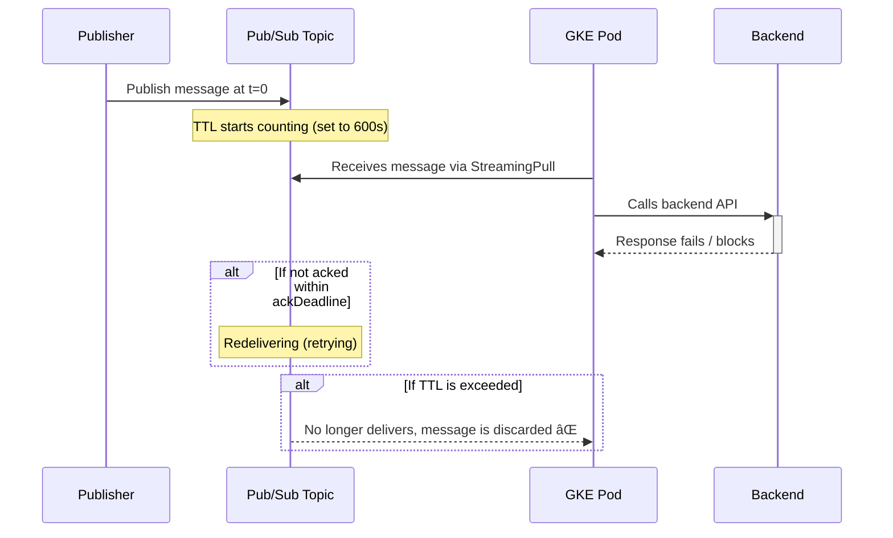

- **`parallel-pull-count` is a suggestion, not a hard limit**

```bash
In spring-cloud-gcp-pubsub, `parallel-pull-count` is essentially a parameter passed to Google's native client library (Subscriber.Builder.setParallelPullCount). **It controls how many StreamingPull threads (Sessions) are created**, but the client library **may automatically increase connections based on load or internal retry mechanisms**.

In other words:

> âš ï¸ You are setting "at least x connections," not a hard upper limit.
```

- A thread will occupy an `executor-thread` until the entire end-to-end process is complete.
- GKE Pod ==> access pull messages ==> then ack the message ==> then call backend service api
	- the flow 


- About monitor

| Metric Name                        | Unit    | Sample Value | Metric Description                                                                              | Typical Issues or Abnormal Meanings                                                                                                                    | Optimization Suggestions                                                                                                                                 |
| :--------------------------------- | :------ | :------- | :------------------------------------------------------------------------------------ | :------------------------------------------------------------------------------------------------------------------------------------ | :--------------------------------------------------------------------------------------------------------------------------------------- |
| Oldest unacked message age         | s       | 0        | The age of the oldest unacknowledged message in the subscription.                                      | A high value indicates that subscribers are failing to process and acknowledge messages in a timely manner, which can lead to message backlogs and processing delays. | Check subscriber application performance, error logs, and resource availability. Consider increasing the number of subscriber instances or improving processing concurrency. Check if the subscription's Ack deadline is set reasonably. |
| Unacked messages by region         | (Count) | 0        | The number of unacknowledged messages, aggregated by region.                                                          | A high number of unacknowledged messages in a specific region may indicate that the subscribers in that region have insufficient processing capacity or are experiencing issues. | Focus on the region with the backlog, and investigate and optimize the subscribers in that area.                                                                                   |
| **Delivery metrics**               |         |          | **A collection of metrics related to message delivery, including the following three sub-metrics:**                                        |                                                                                                                                       |                                                                                                                                          |
| - Ack message count                | /s      | 0.058/s  | The number of messages acknowledged by subscribers per second.                                                          | If this value is much lower than "Sent message count," it means messages are being sent but not acknowledged by subscribers, possibly due to slow processing or acknowledgment failures. | Check if the subscriber's message acknowledgment logic is correct and efficient. Ensure acknowledgments are sent promptly after successful processing. Investigate subscriber errors. |
| - Publish message count            | /s      | 0.058/s  | The number of messages published to the Topic per second.                                                         | This value represents the throughput of the message publisher. If it's lower than expected, the publisher's publishing speed may be limited. | Check the publisher application's logic and performance. Confirm that network connections and permissions are normal.                                                                             |
| - Sent message count               | /s      | 0.058/s  | The number of messages sent from the Topic to subscribers per second.                                                 | This value represents the throughput of Pub/Sub successfully sending messages to subscribers. If this value is much lower than "Publish message count," there may be connection or configuration issues between Pub/Sub and the subscribers. | Check if the subscription is configured correctly and if subscribers are running and able to receive messages. Ensure the Pub/Sub service account has permission to send messages to the subscription endpoint (for Push subscriptions). |
| Ack message count by delivery type | /s      | 0.0467/s | The number of acknowledged messages, broken down by delivery type (e.g., Pull, Push). The screenshot shows the acknowledgment count for the Pull method. | A low acknowledgment count for a specific delivery type indicates that subscribers using that method are having issues with processing or acknowledgment. | For Pull subscriptions, check the pulling and acknowledgment logic. For Push subscriptions, check the availability and processing capacity of the Push endpoint. |
| Publish to ack delta               | s       | 0        | The average time interval from when a message is published until it is _first_ acknowledged by a subscriber.                                    | A high value indicates high end-to-end latency for the entire message lifecycle (publish, transport, subscriber processing, acknowledgment). | Analyze other metrics (Unacked age, Ack count vs. Sent count, Pull/Push to ack delta) to pinpoint where the delay is occurring (publishing, transport, or subscriber processing). |
| Pull to ack delta                  | s       | 0        | The average time interval from when a message is pulled by a Pull subscriber until it is acknowledged by that subscriber.                              | A high value specifically points to a delay on the Pull subscriber's side, meaning messages are pulled but not processed and acknowledged in a timely manner. | Focus on optimizing the Pull subscriber's message processing logic to increase speed and concurrency. Ensure acknowledgments are sent immediately after processing is complete. |
| Billable bytes by region           | B       | N/A      | The number of billable bytes, aggregated by region (includes data volume for both publishing and subscribing).                                    | An abnormal increase in billable bytes may indicate an unexpected increase in data volume, such as erroneously republishing or subscribing to a large number of messages. | Monitor data volume growth trends and investigate if the application has logic errors causing duplicate publishing or consumption. Evaluate whether message bodies need to be compressed. |

|                      |                                                                                      |
| -------------------- | ------------------------------------------------------------------------------------ |
| Metric Name          | Meaning (Non-literal)                                                                |
| Publish to Ack Delta | The time difference from when a message is published to a Pub/Sub Topic to when it is acknowledged (acked) by a client. |
| Pull to Ack Delta    | The time difference from when a message is pulled by a client to when it is acknowledged (acked) by the client. |

- about Test value
    - 

# Q

How to increase `executor-threads` without changing the code logic by setting the Spring Boot configuration in the Deployment's environment variables:

env:

• name:

SPRING_CLOUD_GCP_PUBSUB_SUBSCRIBER_EXECUTOR_THREADS

value: "10"

Spring Boot will automatically map this to

spring.cloud.gcp.pubsub.subscriber.executor-threads=10.

Current Status

Before scaling on PRD

2 Pods * 4 executor-threads ==> Capability to receive these 8 messages ==> Shared by all subscriptions

After scaling on PRD

4 Pods * 4 executor-threads ==> Capability to receive these 16 messages ==> Shared by all subscriptions

Assuming at a certain hour, Pub/Sub might receive 50 concurrent messages. To handle this, I first need the capability to receive these 50 messages immediately.

==> Shared by all subscriptions

So, 5 Pods * 10 executor-threads are needed to have this receiving capability [although concurrent threads do not automatically mean an increase in message throughput]. As for whether we can process them in time or if the BackendService will be affected, our first step of optimization is also in place ==> timeout optimization, setting a request timeout for each HTTP call to prevent threads from being blocked forever.

Let's assume the CPU gets maxed out. Our HPA can ensure, for example, if we set it to 5-10 Pods, that we have some scaling capability to meet this demand. This reduces the risk of increasing `executor-threads`.

Moreover, for us, the backend service is an IO-intensive scenario (threads spend most of their time waiting for HTTP responses), so it is feasible to increase the number of threads by setting `executor-threads`. If a task's main time consumption is not on CPU computation but on waiting for network, disk, database, HTTP, or external system responses (IO operations), then the CPU is not doing much, and the thread is just [occupied] in a blocked state (waiting for socket response). This is an IO-intensive scenario.

Evaluate the memory consumption when pulling messages instantaneously at a specific time, i.e., when concurrent messages arrive.

# A 1

Of course, here is the complete output in Markdown source format. You can directly copy and paste it into a .md file or your company's documentation platform, and it will render with the correct formatting and diagrams without any changes.

# ✅ GKE Java Pub/Sub Subscriber Concurrent Processing Capability Optimization Plan

## 🎯 Optimization Goals

To address issues in the current GKE Pub/Sub consumer service, such as slow responses and prolonged thread blockage during message peaks (e.g., triggered on the hour), we will optimize from two core directions:

1. **Increase the number of threads in the thread pool (`executor-threads`) to enhance concurrent receiving and processing capabilities.**

2. **Optimize the Backend API's request timeout and retry strategy to compress the processing time window.**

---

## 1ï¸âƒ£ Increase Thread Pool Threads (`executor-threads`)

### ✅ Scenario Background

Currently, each thread in the Pod, when processing a Pub/Sub message, makes a synchronous HTTP request to the backend API. The response time is typically 10-60s, which is an **IO-intensive scenario**. This causes threads to remain in a "Waiting" state for long periods, leading to low CPU utilization.

### ✅ Solution

Use the natively supported configuration option in Spring Cloud GCP:

```yaml
env:
  - name: SPRING_CLOUD_GCP_PUBSUB_SUBSCRIBER_EXECUTOR_THREADS
    value: "10"
```

This is equivalent to:

spring.cloud.gcp.pubsub.subscriber.executor-threads=10

✅ Effect Comparison Diagram

```mermaid
flowchart TD
    PS[Pub/Sub Topic] -->|StreamingPull| Pod1

    subgraph Pod1 [GKE Pod #1]
        direction TB
        T1[Thread 1 âž waiting HTTP]
        T2[Thread 2 âž waiting HTTP]
        T3[Thread 3 âž waiting HTTP]
        T10[Thread 10 âž waiting HTTP]
    end

    note right of Pod1
        More threads allow for faster reception and parallel processing of messages, alleviating instantaneous backlogs.
    end note
```

✅ Combined with HPA Auto-Scaling Capability

More threads âž Increased concurrent HTTP requests âž Higher CPU usage âž HPA triggers scaling âž Increased overall throughput

|              |                         |
| ------------ | ----------------------- |
| Configuration Item | Sample Value            |
| HPA Config   | minPods: 3, maxPods: 10 |
| CPU trigger  | target: 80%             |
| Container Resources | 1 CPU / 1Gi RAM         |

2ï¸âƒ£ Optimize Backend API Call Logic (Compressing Time)

✅ Current Problem

The original logic involves a synchronous call + 3 retries, with each timeout lasting several minutes. The total time can be up to:

retry #1: 360s (failure)

retry #2: 360s (failure)

retry #3: 360s (success or failure)

Total time ≈ 18 minutes

This severely occupies thread resources âž cannot process new messages âž backlog increases.

✅ Improved Solution

Use a timeout control mechanism (e.g., HttpClient settings) to shorten the retry cycle âž all retries are completed within 60s.

```Java
HttpClient client = HttpClient.newBuilder()
    .connectTimeout(Duration.ofSeconds(5))
    .build();
HttpRequest request = HttpRequest.newBuilder()
    .timeout(Duration.ofSeconds(10))  // Max 10s for a single request
    ...
```

✅ New Strategy Design

|          |          |                    |
| -------- | -------- | ------------------ |
| Retry #  | Timeout  | Cumulative Time Window |
| 1st      | 10s      | 0s ~ 10s           |
| 2nd      | 20s      | 10s ~ 30s          |
| 3rd      | 30s      | 30s ~ 60s          |
| Total    |          | ✅ Completed within 60s max |

✅ Effects

- Alleviates thread pool blockage pressure
- Fails fast, releasing resources quickly
- Avoids threads being hung up or backlogged for long periods due to backend exceptions

✅ Overall Effect Diagram (Message Reception Flow + Optimization Points)

```mermaid

flowchart TD
    PubSub[Pub/Sub Topic] -->|StreamingPull| Queue[Message Queue]
    subgraph Pod [GKE Pod]
        direction TB
        Queue -->|1| Thread1[Thread 1 âž message1 âž HTTP Request âž Timeout Control]
        Queue -->|2| Thread2[Thread 2 âž message2 âž HTTP Request âž Timeout Control]
        Queue -->|...| ThreadN[Thread N âž messageN âž HTTP Request âž Timeout Control]
    end
    note right of Pod
        Increased executor-threads âž Supports more concurrent requests\n
        Each thread task completes within 60s âž Frees up resources quickly
    end note
```

🧠 Summary Comparison Table

|                 |                     |                     |                         |
| --------------- | ------------------- | ------------------- | ----------------------- |
| Dimension       | Before Optimization | After Optimization  | Effect                  |
| Threads per Pod | Default 4           | Increased to 10     | Increased concurrent processing capability per Pod |
| Request Block Time | Up to 18 minutes    | Limited to 1 minute | Frees up thread resources quickly |
| GKE HPA Sensitivity | Low CPU usage âž Slow scaling | Higher CPU usage âž Triggers automatically | Supports peak concurrency |
| Concurrency Capability | Prone to backlogs   | Can handle 50+ instantaneous messages | 🟢 Stable and reliable |

✅ Implementation Suggestions

1. Modify the Deployment configuration to add the thread pool setting environment variable (`executor-threads=10`).
2. Configure HTTP request-level connection/response timeouts using a fail-fast strategy.
3. Set reasonable HPA thresholds and resource limits in GKE.
4. Use a monitoring system to observe the thread pool queue length, CPU utilization, and processing latency.
5. If necessary, further optimize to an asynchronous non-blocking model (e.g., WebClient + Reactor).

# A 2

Your analysis is very clear, and your thinking is spot on. Below, I will help you organize and summarize it into a structured deployment optimization proposal, which will be useful for internal implementation or as a review document.

✅ GKE Java Pub/Sub Subscriber Optimization Summary and Recommendations

🎯 Current Goal

To improve the capability of the Java Subscriber client in GKE to handle instantaneous concurrent message pulling and processing, avoiding "message backlogs" or "response timeouts" during on-the-hour triggers.

🧠 Background and Current State

|                  |                                           |
| ---------------- | ----------------------------------------- |
| Project          | Current Configuration                     |
| GKE Pod          | Default 1 vCPU / 1Gi per Pod              |
| HPA              | Enabled, supports dynamic Pod scaling (5 ~ 10) |
| executor-threads | Default 4 threads per Pod (synchronous blocking IO) |
| Pub/Sub Messages | Potentially 50+ concurrent messages on the hour |
| backend service  | Unstable response (10s ~ 60s), IO-intensive operation |

✅ Implementation Plan Summary

🧩 1.

Dynamically configure `executor-threads` via Deployment environment variables

No code changes needed, inject Spring Boot configuration directly via `env`:

env:

- name: SPRING_CLOUD_GCP_PUBSUB_SUBSCRIBER_EXECUTOR_THREADS

value: "10"

Spring Boot will automatically map this to:

spring.cloud.gcp.pubsub.subscriber.executor-threads=10

🧩 2.

Understand Overall Processing Capability (Total Threads = Pod Count × Threads per Pod)

|                |                  |                          |
| -------------- | ---------------- | ------------------------ |
| Scenario       | Calculation      | Total Threads (Concurrent Processing Capability) |
| Initial        | 2 Pods × 4 threads | 8                        |
| After Scaling  | 4 Pods × 4 threads | 16                       |
| Optimized (Recommended) | 5 Pods × 10 threads | 50 ✅                    |
| At Full Load   | 10 Pods × 10 threads | 100 🔠                  |

🧩 3.

Decoupling Message Pulling and Executor Threads

- Pub/Sub StreamingPull pre-fetches messages based on buffer settings.
- A message is only consumed (`MessageReceiver.onMessage()`) when a thread is idle.
- Therefore, increasing the number of threads improves the maximum throughput for "receiving + processing" from the get-go.

🧩 4.

Risk Control: Why is this plan smooth?

|                  |                                   |                                    |
| ---------------- | --------------------------------- | ---------------------------------- |
| Dimension        | Control Strategy                  | Explanation                        |
| CPU Usage        | HPA auto-scaling                  | More threads âž Higher CPU âž Auto-scales Pods |
| Memory Usage     | Not recommended `executor > 16` (for 1Gi) | Avoid OOM (thread pool stack + message buffer) |
| Request Blocking | Add HTTP timeout limit (e.g., 20s) | Prevent threads from blocking indefinitely |
| Pub/Sub Message Pre-fetching | Configure `maxOutstandingMessages` | Prevent too many unprocessed messages from accumulating |
| Slow Backend Service | IO-intensive âž Better suited for high thread count | CPU won't spike, but threads will be suspended |
| Peak Message Backlog | Increasing total threads can alleviate the receiving/response bottleneck | ✅ This is the target optimization point |

🧩 5.

Optional Enhancements (Future Optimization Directions)

|                                           |                                  |
| ----------------------------------------- | -------------------------------- |
| Optimization Direction                    | Explanation                      |
| Use WebClient + Reactor for asynchronous backend calls | Improve thread utilization (non-blocking IO) |
| Separate slow/fast interfaces into different Subscriptions | Set different thread counts or Pod scales based on SLAs |
| Configure DLQ (Dead-Letter Queue)         | Avoid infinite retries for failed requests |
| Set message TTL                           | Automatically clean up messages that time out |

✅ Summary

**Increasing `executor-threads` is a reasonable and controllable optimization method, especially in IO-intensive scenarios.** Paired with GKE HPA, it enables automatic resource adjustment, improving overall system throughput and reducing the risk of instantaneous backlogs.

If you need, I can also:

- Help you generate a standard "Performance Optimization Change Document."
- Help you draw a "Thread Pool Occupation and Scaling Relationship Diagram" and a "Flow Path of Pub/Sub Messages into Processing Threads."

Do you need this?

# Setting Message TTL

Of course, Message TTL (Time to Live) in Pub/Sub is a very important feature for automatically cleaning up messages that have not been acknowledged in time, preventing them from accumulating indefinitely or being repeatedly redelivered.

Below, I will explain its meaning, purpose, how to set it, and precautions, along with operational examples.

✅ What is Message TTL?

Message TTL is the maximum amount of time a message can "live" in a Pub/Sub Topic. If it is not successfully acknowledged within this time, it will be automatically deleted and no longer delivered.

✅ Why is it necessary to set Message TTL?

|                     |                                                  |
| ------------------- | ------------------------------------------------ |
| Reason              | Explanation                                      |
| 🔠Prevent infinite retries | Some messages may always fail to process due to logic flaws or backend unavailability. |
| 🧠 Reduce resource waste | Retrying failures consumes subscriber threads, CPU, and network resources. |
| 🧹 Clean up stale data | Avoid the accumulation of useless historical messages (e.g., in a test topic). |
| ✅ Improve system stability | Control the message lifecycle to improve predictability. |

✅ Pub/Sub TTL Setting Location

|                      |                                                        |
| -------------------- | ------------------------------------------------------ |
| Component            | TTL Setting Location                                   |
| ✅ Topic Level       | How long a message can be retained after publishing (regardless of subscription). |
| ⌠Subscription Level | TTL cannot be set, but you can set `ackDeadline` (for a single processing attempt). |

✅ How to Set (TTL is a Topic-level attribute)

🔧 Using

gcloud

to set (specify TTL at creation):

gcloud pubsub topics create my-topic \

--message-retention-duration=600s  # TTL = 10 minutes

🔄 Updating TTL for an existing Topic:

gcloud pubsub topics update my-topic \

--message-retention-duration=3600s  # TTL = 1 hour

✅ The minimum TTL is 10 seconds, and the maximum is 7 days (default is 7 days).

✅ How it Works Diagram



✅ Precautions

|                              |                                                        |
| ---------------------------- | ------------------------------------------------------ |
| Item                         | Note                                                   |
| TTL ≠ ackDeadline            | `ackDeadline` is the "timeout for a single processing attempt," while TTL is the "total lifespan of the message." |
| Cannot be configured on a Subscription | TTL must be set on the Topic.                  |
| Timeout does not go to DLQ   | The trigger for DLQ is "ack failure count exceeded." A TTL timeout does not trigger the DLQ. |
| Suitable for "expired and useless" messages | Such as scheduled task notifications, real-time metrics, CI/CD triggers, etc. |

🎯 Practical Suggestions (for your situation)

|                         |                              |
| ----------------------- | ---------------------------- |
| Type                    | Recommended TTL Setting      |
| Scheduled messages calling backend APIs | 600s (i.e., 10 minutes)      |
| Real-time notification events | 60~180s                      |
| Messages that must be eventually processed | Long TTL (default 7d) + Configure DLQ |
| Temporary test Topics   | 300s, to avoid leaving stale data |

✅ Summary in one sentence

Setting a TTL on a Pub/Sub Topic ensures that messages do not accumulate indefinitely or get retried infinitely, making it a key strategy for controlling system stability and resource utilization.

Would you like me to also help you create a comparison chart for concepts like `ackDeadline`, `TTL`, `Retry`, and `DLQ` in Pub/Sub? You could use it for internal sharing or documentation.

### Scenario Description:

The current Java Pub/Sub client runs in a GKE Pod, using StreamingPull to fetch messages and a thread pool (`executor-threads`) for synchronous, blocking HTTP calls. To prevent system sluggishness due to thread blockage, HPA monitors CPU usage to trigger auto-scaling.

✅ Thread Pool Occupation and GKE HPA Scaling Relationship Diagram

#### Thread Pool Occupation and GKE HPA Scaling Relationship Diagram

```mermaid
flowchart TD
    PS[Pub/Sub Topic] -->|StreamingPull| Pod1
    PS -->|StreamingPull| Pod2

    subgraph Pod1 [GKE Pod #1 (1 vCPU)]
        direction TB
        T1[Thread 1 âž waiting HTTP]
        T2[Thread 2 âž waiting HTTP]
        T3[Thread 3 âž waiting HTTP]
        T4[Thread 4 âž waiting HTTP]
        CPU1[CPU Usage Increases] -->|Triggers HPA| HPA[Pod Scaling Triggered]
    end

    subgraph Pod2 [GKE Pod #2 (1 vCPU)]
        direction TB
        T5[Thread 1 âž waiting HTTP]
        T6[Thread 2 âž waiting HTTP]
        T7[Thread 3 âž waiting HTTP]
        T8[Thread 4 âž waiting HTTP]
        CPU2[CPU Usage Increases] -->|Triggers HPA| HPA
    end

    HPA --> Pod3[🆕 Pod #3 Starts]
    Pod3 -->|Establishes StreamingPull| PS

    note right of HPA
        Concurrent threads waiting for backend responses âž CPU scheduling increases âž HPA detects CPU rise âž Auto-scales Pods
    end note
```

---

### ✅ Flow Path of Pub/Sub Messages into Processing Threads

#### Flow Path of Pub/Sub Messages into Processing Threads

