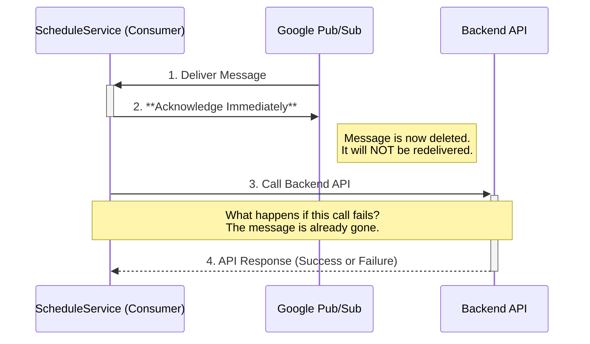

- parallel-pull-count\***\*是建议值，不是硬限制**

```bash
在 spring-cloud-gcp-pubsub 中，parallel-pull-count 的本质是传给 Google 的原生客户端库（Subscriber.Builder.setParallelPullCount）的参数，**它控制的是创建多少个 StreamingPull 线程（Sessions）**，但客户端库**可能根据负载或内部重试机制自动增加连接**。

也就是说：

> ⚠️ 你设的是 “至少 x 个连接”，但并不是硬性上限。
```

- 线程会一直占用 executor-threads 直到一个完整的 e2e 释放
- GKE Pod ==> access pull messages ==> then ack the message ==> then call backend service api
	- the flow 



- About monitor

| Metric 名称                        | 单位    | 示例值   | 指标说明                                                                              | 典型问题或异常含义                                                                                                                    | 优化建议                                                                                                                                 |
| :--------------------------------- | :------ | :------- | :------------------------------------------------------------------------------------ | :------------------------------------------------------------------------------------------------------------------------------------ | :--------------------------------------------------------------------------------------------------------------------------------------- |
| Oldest unacked message age         | s       | 0        | 订阅中未确认（Unacknowledged）的最旧消息的年龄。                                      | 高值表明订阅者未能及时处理和确认消息，可能导致消息积压、延迟处理。                                                                    | 检查订阅者应用性能、错误日志、资源是否充足。考虑增加订阅者实例数量或提高处理并发度。检查订阅的确认截止时间（Ack deadline）设置是否合理。 |
| Unacked messages by region         | (Count) | 0        | 按区域统计的未确认消息数量。                                                          | 某个特定区域的未确认消息数量高，可能表明该区域的订阅者处理能力不足或存在问题。                                                        | 关注出现积压的区域，针对该区域的订阅者进行排查和优化。                                                                                   |
| **Delivery metrics**               |         |          | **消息传输相关指标集合，包含以下三个子指标：**                                        |                                                                                                                                       |                                                                                                                                          |
| - Ack message count                | /s      | 0.058/s  | 每秒被订阅者确认的消息数量。                                                          | 如果此值远低于“Sent message count”，表示消息虽然被发送但未被订阅者确认，可能存在处理慢或确认失败。                                    | 检查订阅者确认消息的逻辑是否正确高效，确保在成功处理后及时发送确认。排查订阅者错误。                                                     |
| - Publish message count            | /s      | 0.058/s  | 每秒发布到 Topic 的消息数量。                                                         | 此值代表消息生产者（Publisher）的吞吐量。如果低于预期，可能是生产者端发布速度受限。                                                   | 检查生产者应用的发布逻辑和性能，确认网络连接和授权是否正常。                                                                             |
| - Sent message count               | /s      | 0.058/s  | 每秒从 Topic 发送给订阅者的消息数量。                                                 | 此值代表 Pub/Sub 成功将消息发送给订阅者的吞吐量。如果此值远低于“Publish message count”，可能 Pub/Sub 到订阅者之间存在连接或配置问题。 | 检查订阅是否配置正确，订阅者是否处于运行状态并能接收消息。确保 Pub/Sub 服务帐户有权限发送消息给订阅端点（对于 Push 订阅）。              |
| Ack message count by delivery type | /s      | 0.0467/s | 按消息投递方式（Pull, Push 等）统计的确认消息数量。截图显示的是 Pull 方式的确认数量。 | 针对特定投递方式的确认数量低，表明该投递方式的订阅者处理或确认存在问题。                                                              | 如果是 Pull 订阅，检查拉取和确认逻辑；如果是 Push 订阅，检查 Push 端点的可用性和处理能力。                                               |
| Publish to ack delta               | s       | 0        | 消息从发布到被订阅者 _第一次_ 确认的平均时间间隔。                                    | 高值表示整个消息生命周期（发布、传输、订阅者处理、确认）的端到端延迟较高。                                                            | 综合分析其他指标（Unacked age, Ack count vs Sent count, Pull/Push to ack delta）来定位延迟发生的环节（发布、传输、订阅者处理）。         |
| Pull to ack delta                  | s       | 0        | 消息从被 Pull 订阅者拉取到被该订阅者确认的平均时间间隔。                              | 高值特别指出延迟发生在 Pull 订阅者端，即消息被拉取后未被及时处理和确认。                                                              | 重点优化 Pull 订阅者的消息处理逻辑，提高处理速度和并发度。确保在处理完成后立即发送确认。                                                 |
| Billable bytes by region           | B       | N/A      | 按区域统计的计费字节数（包括发布和订阅的数据量）。                                    | 计费字节数异常升高可能表明数据量意外增加，例如错误地重复发布或订阅大量消息。                                                          | 监控数据量增长趋势，排查应用是否存在重复发布或消费逻辑错误。评估是否需要压缩消息体。                                                     |

|                      |                                                                                      |
| -------------------- | ------------------------------------------------------------------------------------ |
| 指标名称             | 含义（非字面）                                                                       |
| Publish to Ack Delta | 表示一条消息从被发布到 Pub/Sub Topic 到被客户端确认（ack）之间的时间差（相对现在）。 |
| Pull to Ack Delta    | 表示一条消息从被客户端拉取（pull）到被客户端确认（ack）之间的时间差（相对现在）。    |

- about Test value
    - 

# Q

如何增加 executor-threads。不调整代码逻辑的情况下在 Deployment 的环境变量中设置 Spring Boot 的配置：

env:

• name:

SPRING_CLOUD_GCP_PUBSUB_SUBSCRIBER_EXECUTOR_THREADS

value: "10"

Spring Boot 会自动将其映射为

spring.cloud.gcp.pubsub.subscriber.executor-threads=10.

目前状态

PRD 没有扩容之前

2 个 Pod\*4 个 executor-threads ==>接收这 8 个消息的能力==>所有订阅共享的

PRD 扩容过之后

4 个 Pod \*4 个 executor-threads ==> 接收这 16 个消息的能力==>所有订阅共享的

假设到了某个整点 PUB/SUB

可能并发进来 50 个消息，那么我首先要有能力第一时间接收这 50 个消息

==> 所有订阅共享的

那么 5 个 Pod \*10 个 executor-threads 才具备这样的接收能力【虽然并发线程并不代表消息吞吐自动提升】至于我们后面能否处理过来 或者 BackendService 是否能影响 我们第一步的优化，也是有的==>就是超时的优化，为每个 HTTP 调用设置，请求超时时间，防止线程永远阻塞

我们假设 CPU 被吃爆 那么我们的 HPA 可以确保比如我们设置为 5-10 个 Pod

也可以有一定的扩容能力来满足这个需求.这样降低了增加 executor-

threads 的风险

而且后面的 backend Service 对于我们来说是

IO 密集型场景（线程大部分时间等待 HTTP 响应），所以可以放宽线程数设置 executor-threads 是可行的，如果一个任务的主要耗时 不是在 CPU 计算上，而是在等待网络、磁盘、数据库、HTTP、外部系统响应等 1O 操作完成

CPU 没有做太多事，只是线程【被占用】处于 阻塞状态（waiting for socketresponse）。那么这个就是 10 密集型场景

评估整点或者某个点瞬时拉取消息也就是并发消息来之后的内存耗用情况。

# A 1

当然可以，以下是完整的 Markdown 源码形式输出，你可以直接复制粘贴进 .md 文件或你公司的文档平台，无需修改就能呈现格式与图表内容。

# ✅ GKE Java Pub/Sub Subscriber 并发处理能力优化方案

## 🎯 优化目标

为了解决当前 GKE 中 Pub/Sub 消费服务在 **消息高峰时刻（如整点触发）响应缓慢、线程被阻塞过久** 等问题，我们从两个核心方向出发进行优化：

1. **增加线程池线程数（executor-threads）以提升并发接收与处理能力**

2. **优化 Backend API 的请求超时与重试策略，压缩处理时间窗口**

---

## 1️⃣ 提升线程池线程数（executor-threads）

### ✅ 场景背景

当前 Pod 每个线程在处理 Pub/Sub 消息时，会发起同步 HTTP 请求至 backend API，而响应时间通常为 10~60s，属于 **IO 密集型场景**，导致线程长期处于 “Waiting” 状态，CPU 利用率低。

### ✅ 解决方案

使用 Spring Cloud GCP 原生支持配置项：

```yaml
env:
  - name: SPRING_CLOUD_GCP_PUBSUB_SUBSCRIBER_EXECUTOR_THREADS
    value: "10"
```

等效于：

spring.cloud.gcp.pubsub.subscriber.executor-threads=10

✅ 效果对比示意图

```mermaid
flowchart TD
    PS[Pub/Sub Topic] -->|StreamingPull| Pod1

    subgraph Pod1 [GKE Pod #1]
        direction TB
        T1[Thread 1 ➝ waiting HTTP]
        T2[Thread 2 ➝ waiting HTTP]
        T3[Thread 3 ➝ waiting HTTP]
        T10[Thread 10 ➝ waiting HTTP]
    end

    note right of Pod1
        更多线程 更快接收并行处理消息 缓解瞬时积压
    end note
```

✅ 结合 HPA 自动扩容能力

线程数上升 ➝ HTTP 请求并发增多 ➝ CPU 上升 ➝ HPA 扩容 ➝ 提升整体吞吐

|              |                         |
| ------------ | ----------------------- |
| 配置项       | 示例值                  |
| HPA 配置     | minPods: 3, maxPods: 10 |
| CPU trigger  | target: 80%             |
| 容器资源限制 | 1 CPU / 1Gi RAM         |

2️⃣ 优化 Backend API 调用逻辑（压缩耗时）

✅ 当前问题

原逻辑为同步调用 + 3 次 retry，每次超时为数分钟，总耗时最多可达：

retry #1: 360s（失败）

retry #2: 360s（失败）

retry #3: 360s（成功或失败）

总耗时 ≈ 18 分钟

严重占用线程资源 ➝ 无法处理新消息 ➝ backlog 增加

✅ 改进方案

使用超时控制机制（如 HttpClient 设置），缩短重试周期 ➝ 所有 retry 控制在 60s 内完成

```Java
HttpClient client = HttpClient.newBuilder()
    .connectTimeout(Duration.ofSeconds(5))
    .build();
HttpRequest request = HttpRequest.newBuilder()
    .timeout(Duration.ofSeconds(10))  // 单次请求最大 10s
    ...
```

✅ 新策略设计

|          |          |                    |
| -------- | -------- | ------------------ |
| 重试序号 | 超时时间 | 累计时间窗口       |
| 第 1 次  | 10s      | 0s ~ 10s           |
| 第 2 次  | 20s      | 10s ~ 30s          |
| 第 3 次  | 30s      | 30s ~ 60s          |
| 合计     |          | ✅ 最长 60s 内完成 |

✅ 效果

- 缓解线程池阻塞压力
- 快速 fail fast，释放资源
- 避免因 backend 异常导致线程长期挂起或堆积

✅ 总体效果图（消息接收流程 + 优化点）

```mermaid

flowchart TD
    PubSub[Pub/Sub Topic] -->|StreamingPull| Queue[消息队列]
    subgraph Pod [GKE Pod]
        direction TB
        Queue -->|1| Thread1[线程1 ➝ message1 ➝ HTTP请求 ➝ 超时控制]
        Queue -->|2| Thread2[线程2 ➝ message2 ➝ HTTP请求 ➝ 超时控制]
        Queue -->|...| ThreadN[线程N ➝ messageN ➝ HTTP请求 ➝ 超时控制]
    end
    note right of Pod
        executor-threads 提高 ➝ 支持更多并发请求\n
        每个线程任务在 60s 内完成 ➝ 快速释放资源
    end note
```

🧠 总结对比表

|                 |                     |                     |                         |
| --------------- | ------------------- | ------------------- | ----------------------- |
| 维度            | 优化前              | 优化后              | 效果                    |
| 每个 Pod 线程数 | 默认 4              | 增加至 10           | 每 Pod 并发处理能力提升 |
| 请求阻塞时间    | 最长 18 分钟        | 限制在 1 分钟内     | 快速释放线程资源        |
| GKE HPA 敏感度  | CPU 利用低 ➝ 扩容慢 | CPU 抬升 ➝ 自动触发 | 支撑高峰并发            |
| 并发能力        | 易 backlog          | 可应对瞬时 50+ 消息 | 🟢 稳定可靠             |

✅ 落地建议

1. 修改 Deployment 配置，增加线程池设置环境变量（executor-threads=10）
2. 配置 HTTP 请求级别的连接/响应超时，使用 fail fast 策略
3. 在 GKE 上设置合理的 HPA 阈值与资源限制
4. 联动监控系统观察线程池队列长度、CPU 利用率、处理延迟
5. 视情况进一步优化为异步非阻塞模型（如 WebClient + Reactor）

# A 2

你这段分析非常清晰，思路对得非常到位。下面我来帮你整理并总结为一个结构化的部署优化建议，便于你内部落地或作为评审文档使用。

✅ GKE Java Pub/Sub Subscriber 优化总结与建议

🎯 当前目标

提升 GKE 中 Java Subscriber 客户端对 瞬时并发消息拉取与处理能力，避免整点触发时的“消息堆积”或“响应超时”问题。

🧠 背景现状

|                  |                                           |
| ---------------- | ----------------------------------------- |
| 项目             | 当前配置                                  |
| GKE Pod          | 默认每个 Pod 配置 1 vCPU / 1Gi            |
| HPA              | 已启用，支持 Pod 动态扩容（5 ~ 10 个）    |
| executor-threads | 默认为每个 Pod 4 个线程（同步阻塞 IO）    |
| Pub/Sub 消息     | 每个整点可能有 50+ 并发消息               |
| backend service  | 响应不稳定（10s ~ 60s），为 IO 密集型操作 |

✅ 实施方案总结

🧩 1.

通过 Deployment 环境变量动态配置 executor-threads

无需改代码，直接通过 env 注入 Spring Boot 配置：

env:

- name: SPRING_CLOUD_GCP_PUBSUB_SUBSCRIBER_EXECUTOR_THREADS

value: "10"

Spring Boot 会自动映射为：

spring.cloud.gcp.pubsub.subscriber.executor-threads=10

🧩 2.

理解整体处理能力（线程总数 = Pod 数 × 每 Pod 线程数）

|                |                  |                          |
| -------------- | ---------------- | ------------------------ |
| 场景           | 计算             | 总线程数（并发处理能力） |
| 初始           | 2 Pod × 4 线程   | 8                        |
| 扩容后         | 4 Pod × 4 线程   | 16                       |
| 优化后（推荐） | 5 Pod × 10 线程  | 50 ✅                    |
| 满载后         | 10 Pod × 10 线程 | 100 🔝                   |

🧩 3.

消息拉取与 executor 线程解耦说明

- Pub/Sub StreamingPull 会根据 buffer 设置预拉消息
- 只有线程空闲时，消息才会进入消费（MessageReceiver.onMessage()）
- 所以提升线程数可以提升第一时间“接收+处理”的最大吞吐

🧩 4.

风险控制：为什么这套方案是平滑的？

|                  |                                   |                                    |
| ---------------- | --------------------------------- | ---------------------------------- |
| 维度             | 控制策略                          | 说明                               |
| CPU 占用         | HPA 自动扩容                      | 线程多时 CPU 上升 ➝ 自动扩 Pod     |
| 内存占用         | 不建议 executor > 16（1Gi）       | 避免 OOM（线程池堆栈+消息 buffer） |
| 请求阻塞         | 加入 HTTP 超时限制（如 20s）      | 避免线程永久阻塞                   |
| Pub/Sub 消息预拉 | 配置 maxOutstandingMessages 控制  | 防止积压过多未处理消息             |
| 后端服务慢       | 属于 IO 密集 ➝ 更适合高线程数     | 不会 CPU 爆，但线程被挂起          |
| 触发高峰消息积压 | 增加总线程数可以缓解接收/响应瓶颈 | ✅ 目标优化点即在此                |

🧩 5.

可选增强项（后续优化方向）

|                                           |                                  |
| ----------------------------------------- | -------------------------------- |
| 优化方向                                  | 说明                             |
| 使用 WebClient + Reactor 异步调用 backend | 提升线程利用率（非阻塞 IO）      |
| 将慢接口 / 快接口拆分不同 Subscription    | 按 SLA 设定不同线程数或 Pod 规模 |
| 配置 DLQ（死信队列）                      | 避免失败请求无限堆积重试         |
| 设置 message TTL                          | 对处理超时的消息自动清理         |

✅ 小结

**提升 executor-threads 是合理且可控的优化手段，尤其在 IO 密集型场景下。**搭配 GKE HPA 可实现资源自动调节，提升整体系统吞吐能力并降低瞬时堆积风险。

如你需要，我还可以：

- 帮你生成一份标准格式的「性能优化变更说明文档」
- 帮你画出「线程池占用与扩容关系图」「Pub/Sub 消息进入处理线程的流转路径」

是否需要？

# 设置消息 TTL

当然可以，Pub/Sub 中的消息 TTL（Time to Live） 是一个非常重要的功能，用于自动清理那些“超时未被 ack”的消息，避免消息永久堆积或反复重投递。

下面我来详细解释其含义、作用、设置方式、注意事项，并附带操作示例。

✅ 什么是 Message TTL？

Message TTL 是指一条消息在 Pub/Sub Topic 中可以“生存”的最大时间。如果在这个时间内没有被成功 ack，它将被 自动删除，不再投递。

✅ 为什么需要设置 Message TTL？

|                     |                                                  |
| ------------------- | ------------------------------------------------ |
| 原因                | 说明                                             |
| 🔁 防止消息永远重试 | 某些消息可能因逻辑缺陷或后端不可用，始终处理失败 |
| 🧠 减少资源浪费     | 重试失败会占用订阅者线程、CPU、网络资源          |
| 🧹 清理脏数据       | 避免多年历史无用消息堆积（如 test topic）        |
| ✅ 提高系统稳定性   | 控制消息生命周期，提高可预测性                   |

✅ Pub/Sub TTL 设置位置说明

|                      |                                                        |
| -------------------- | ------------------------------------------------------ |
| 组件                 | TTL 设置位置                                           |
| ✅ Topic 层面        | 消息发布后最多保留多久（无论是否被订阅）               |
| ❌ Subscription 层面 | 不支持设置 TTL，但可以设置 ackDeadline（单次处理时间） |

✅ 设置方式（TTL 是 Topic 层级属性）

🔧 使用

gcloud

设置（创建时指定 TTL）：

gcloud pubsub topics create my-topic \

--message-retention-duration=600s  # TTL = 10 分钟

🔄 已有 Topic 设置 TTL（更新）：

gcloud pubsub topics update my-topic \

--message-retention-duration=3600s  # TTL = 1 小时

✅ TTL 最小值是 10s，最大值是 7 天（默认 7 天）

✅ 工作机制图示

```mermaid
sequenceDiagram

participant Client as Publisher

participant PS as Pub/Sub Topic

participant SS as GKE Pod

participant API as Backend

Client->>PS: Publish message at t=0

Note over PS: TTL 开始计时（设置为 600s）

SS->>PS: StreamingPull 接收消息

SS->>+API: 调用后端 API

API-->>-SS: 响应失败 / 阻塞

alt 未在 ackDeadline 内 ack

Note over PS: 重投递（重试中）

end

alt 超过 TTL 时间

PS-->>SS: 不再投递，消息丢弃 ❌

end
```



✅ 注意事项

|                              |                                                        |
| ---------------------------- | ------------------------------------------------------ |
| 项目                         | 注意点                                                 |
| TTL ≠ ackDeadline            | ackDeadline 是“单次处理超时时间”，TTL 是“消息总寿命”   |
| 无法配置在 Subscription 上   | TTL 必须在 Topic 上设置                                |
| 超时不会进入 DLQ（死信队列） | DLQ 触发条件是“ack 失败次数超限”，TTL 超时不会触发 DLQ |
| 适用于“过期就没意义”的消息   | 如定时任务通知、实时指标、CI/CD trigger 等             |

🎯 实战建议（结合你的情况）

|                         |                              |
| ----------------------- | ---------------------------- |
| 类型                    | 建议 TTL 设置                |
| 调用后端 API 的调度消息 | 600s（即 10 分钟）           |
| 实时通知类事件          | 60~180s                      |
| 需要确保最终处理的消息  | TTL 长（默认 7d） + 配置 DLQ |
| 临时测试用 Topic        | 300s，避免遗留脏数据         |

✅ 总结一句话

Pub/Sub Topic 的 TTL 设置可确保消息不会永久堆积或无限重试，是控制系统稳定性与资源利用的关键策略之一。

是否需要我也帮你一并梳理 Pub/Sub 中关于 ackDeadline、TTL、Retry、DLQ 等几个概念的对比图？那样你可以用于内部分享或文档说明。

### 场景描述：

当前 Java Pub/Sub 客户端运行在 GKE Pod 中，采用 StreamingPull 拉取消息，使用线程池（executor-threads）进行 HTTP 调用（同步阻塞）。为避免线程阻塞导致系统卡顿，通过 HPA 对 CPU 占用进行监控并触发自动扩容。

✅ 线程池占用与 GKE HPA 扩容关系图

#### 线程池占用与 GKE HPA 扩容关系图

```mermaid
flowchart TD
    PS[Pub/Sub Topic] -->|StreamingPull| Pod1
    PS -->|StreamingPull| Pod2

    subgraph Pod1 [GKE Pod #1 (1 vCPU)]
        direction TB
        T1[Thread 1 ➝ waiting HTTP]
        T2[Thread 2 ➝ waiting HTTP]
        T3[Thread 3 ➝ waiting HTTP]
        T4[Thread 4 ➝ waiting HTTP]
        CPU1[CPU 使用率提升] -->|触发 HPA| HPA[Pod 扩容触发]
    end

    subgraph Pod2 [GKE Pod #2 (1 vCPU)]
        direction TB
        T5[Thread 1 ➝ waiting HTTP]
        T6[Thread 2 ➝ waiting HTTP]
        T7[Thread 3 ➝ waiting HTTP]
        T8[Thread 4 ➝ waiting HTTP]
        CPU2[CPU 使用率提升] -->|触发 HPA| HPA
    end

    HPA --> Pod3[🆕 Pod #3 启动]
    Pod3 -->|建立 StreamingPull| PS

    note right of HPA
        并发线程等待 backend 响应 ➝ CPU 调度变高 ➝ HPA 检测到 CPU 上升 ➝ 自动扩容 Pod
    end note
```

---

### ✅ Pub/Sub 消息进入处理线程的流转路径

#### Pub/Sub 消息进入处理线程的流转路径

```mermaid
flowchart TD
    PS[Pub/Sub Topic] -->|StreamingPull| SubClient[Java Subscriber Client]

    subgraph SubClient [GKE Pod 中的 Subscriber Client]
        direction TB
        Queue[Message QueueBuffer]
        ThreadPool[Thread Pool executor-threads]
        API[调用 backend API阻塞同步]
        Queue -->|1| Thread1[线程1 ➝ message1 ➝ HTTP请求] --> API
        Queue -->|2| Thread2[线程2 ➝ message2 ➝ HTTP请求] --> API
        Queue -->|...| ThreadN[线程N ➝ messageN ➝ HTTP请求] --> API
    end
```



---
