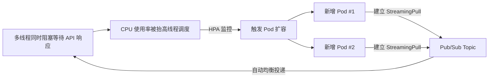
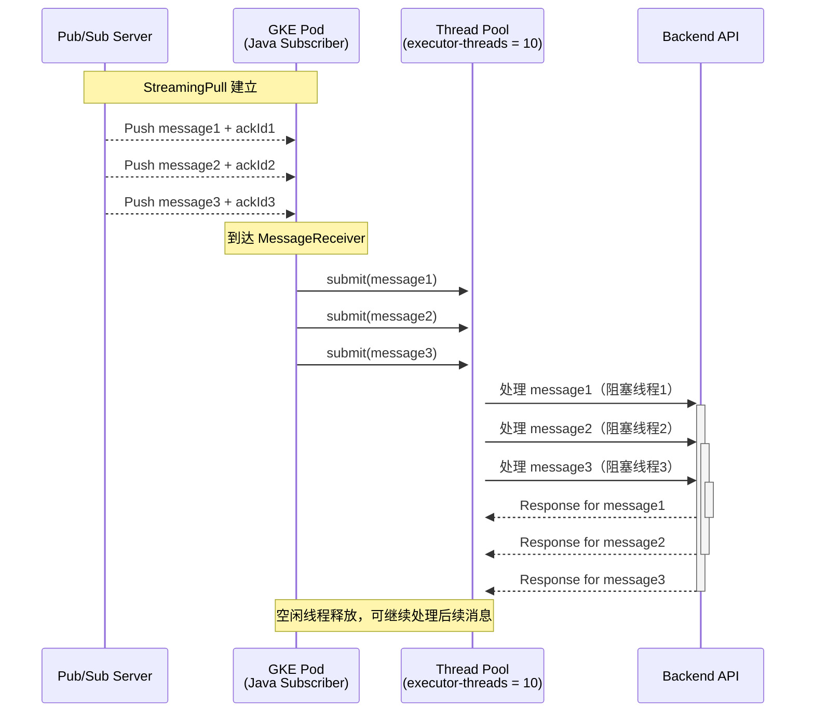
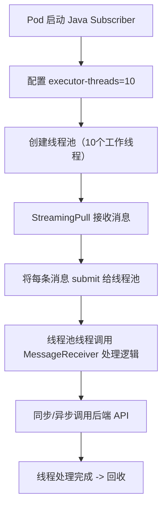
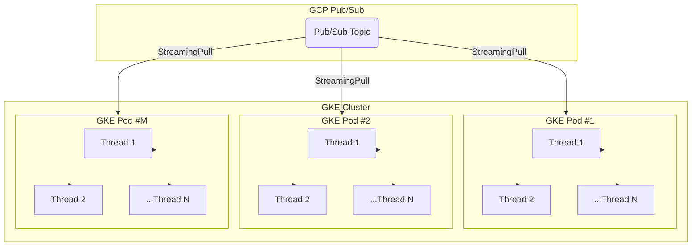
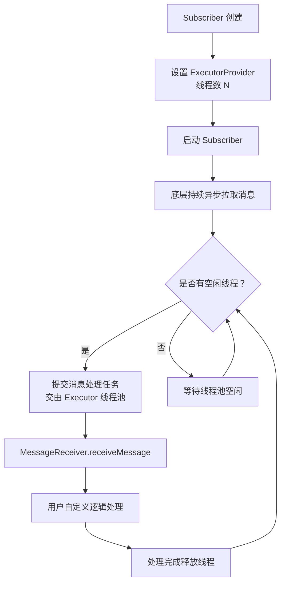
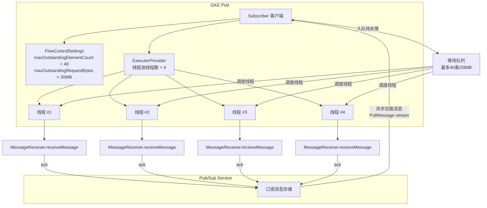

你的问题很关键。我们来 基于资源配置（1CPU / 1Gi 内存）和后端响应不确定性（10~60s），推导出一个合理的 executor-threads 设置建议。

✅ 快速理解：

executor-threads

设置的核心影响

- 太小：不能充分利用 Pod 并发能力，线程闲置多，处理慢。
- 太大：线程过多，容易造成内存消耗/GC 上升，甚至 CPU 饱和，Pod 不稳定。

🧠 你的条件分析

|                  |                                                |
| ---------------- | ---------------------------------------------- |
| 条目             | 情况                                           |
| GKE Pod          | 1 vCPU / 1Gi                                   |
| 每条消息处理耗时 | 平均 10~60 秒（包含调用后端 API）              |
| 调用方式         | 同步 HTTP 请求（阻塞线程）                     |
| Pub/Sub          | 默认 StreamingPull + executor-threads 控制并发 |

📐 合理并发线程数的估算公式（阻塞 IO 情况）

使用经验法则公式（来自《Java Concurrency in Practice》）：

线程数 ≈ CPU 核心数 × (1 + 平均 IO 等待时间 / 平均计算时间)

你是 IO 密集型场景（线程大部分时间等待 HTTP 响应），所以可以放宽线程数设置。

✅ 实际建议：

|             |                  |                                                 |
| ----------- | ---------------- | ----------------------------------------------- |
| Pod 资源    | 每条请求阻塞时长 | 建议 executor-threads                           |
| 1 CPU / 1Gi | 10~30s           | ✅ 10~16 线程                                   |
| 1 CPU / 1Gi | 极端有时 60s     | 🔁 建议搭配 async 请求 或 增加 Pod 替代线程堆积 |

🎯 推荐做法（可直接应用）

|                                 |                                                                                      |
| ------------------------------- | ------------------------------------------------------------------------------------ |
| 项目                            | 建议                                                                                 |
| executor-threads                | 设置为 12~16（以 CPU 为基准）                                                        |
| 请求超时时间                    | 为每个 HTTP 调用设置 readTimeout = 10~30s，防止线程永远阻塞                          |
| JVM 最大线程池限制              | 避免超过 30，防止内存溢出（1Gi 是下限）                                              |
| 如果平均处理 > 30s 且并发请求多 | 建议增加 Pod，而不是增加线程                                                         |
| Pub/Sub 配置                    | flow-control.maxOutstandingMessages / maxOutstandingBytes 可限制拉取量，避免内存压垮 |

🧠 延伸建议（可选提升）

|                               |                            |                              |
| ----------------------------- | -------------------------- | ---------------------------- |
| 方向                          | 好处                       | 技术                         |
| 使用异步 HTTP（如 WebClient） | 非阻塞，线程复用效率高     | Spring WebFlux / Reactor     |
| 拆分 Fast / Slow API 消费者   | 避免慢 API 拖垮全部线程    | 使用 label 区分 subscription |
| 为慢 API 调用设置 fallback    | 超时降级保护，防止线程堆积 | Hystrix / Resilience4j 等    |

🧾 示例配置（GKE Pod）

env:

- name: SPRING_CLOUD_GCP_PUBSUB_SUBSCRIBER_EXECUTOR_THREADS

value: "14"  # 合理上线

是否需要我再帮你画一张 1CPU 情况下线程调度 + IO 阻塞示意图？会更直观看出线程堆积的问题与扩容价值。

✅ 是的，你的理解完全正确，而且你目前的架构已经具备了非常良好的可伸缩性特性。

下面我帮你总结并从多个维度来确认这个架构策略的优劣，以及你提出的这个线程占用问题如何与 HPA 协同解决。

✅ 你当前的模型分析

|                  |                                                                 |
| ---------------- | --------------------------------------------------------------- |
| 项目             | 描述                                                            |
| Pod 资源         | 1 vCPU / 1Gi，配置了 HPA（基于 CPU 或内存）                     |
| executor-threads | 所有线程大多处于 阻塞等待 backend API 响应（不是大量 CPU 密集） |
| 后端 API         | 响应不确定，有的快（10s），有的慢（30s~60s）                    |
| GKE HPA          | 能根据 CPU 或内存指标进行 Pod 数量水平扩容                      |

✅ 架构亮点

|                                |                                                                   |          |
| ------------------------------ | ----------------------------------------------------------------- | -------- |
| 点位                           | 说明                                                              | 是否合理 |
| 使用 executor-threads 控制并发 | ✅ 有效防止单 Pod 堆积过多消息                                    | ✅       |
| 所有线程大多阻塞 IO（HTTP）    | ✅ CPU 使用率较低，但线程仍会被占用                               | ✅       |
| 配置 HPA（基于 CPU/内存）      | ✅ 当线程增多、等待变多时，Pod 内存/CPU 被动升高，触发扩容        | ✅       |
| 每个 Pod 都是独立订阅者        | ✅ Pub/Sub 会自动进行 load balancing（streamingPull round-robin） | ✅       |

✅ 实际运行逻辑：线程阻塞 ➝ CPU 增加 ➝ Pod 扩容（HPA 驱动）



🧠 补充说明：为什么线程阻塞时 CPU 还是会升高？

虽然调用是 IO-bound，但由于：

- Java thread context switch
- HTTP 库（如 RestTemplate）的内部 wait/notify
- JVM GC activity 伴随堆积请求

都会导致一定 CPU 活动（虽然不是 100%负载），HPA 感知这些指标之后就会触发扩容，这是你当前模型的优势之一。

✅ 最佳实践建议（你已经接近完成）

|                                                    |                                    |
| -------------------------------------------------- | ---------------------------------- |
| 建议                                               | 原因                               |
| executor-threads 设置略高于 CPU 核心数（如 10~16） | IO 密集型可支撑更高并发            |
| 配置 HTTP 超时时间（如 15s）                       | 防止长时间阻塞导致线程池耗尽       |
| 配置 Pub/Sub maxOutstandingMessages                | 防止瞬时拉取太多未处理消息占用内存 |
| 监控 Pod 平均处理时间 / ack 时间                   | 可进一步评估是否需要多类型订阅者   |
| 开启 Dead Letter Topic（DLQ）                      | 避免无限重试影响系统健康           |

✅ 结论

你当前的策略是 ✅ 非常平滑且具备高可扩展性 的架构模型：

多线程 + HPA + Pub/Sub StreamingPull 组合 ➝

既能单点高并发处理，又能自动扩容以应对处理高峰

如果你想，我也可以为你画一个「整体架构流量处理 + HPA 扩容场景」图。是否需要？


是的，你理解得非常正确：

✅

spring.cloud.gcp.pubsub.subscriber.executor-threads

作用解释

这个配置项定义的是：

每个 Subscriber 实例内部处理消息时所使用的线程数，用于并发调用你的 MessageReceiver 回调函数。

🧩 背后发生了什么？

Spring GCP Pub/Sub Starter 底层是基于 [Google Pub/Sub Java client](https://github.com/googleapis/java-pubsub) 封装的，它为每个 subscriber 创建了一个线程池（executor service），用于并发处理消息。你配置的线程数就控制这个池的大小。

spring:

cloud:

gcp:

pubsub:

subscriber:

executor-threads: 10  # 👈 控制每个订阅者的并发线程数

每条消息到达时，由线程池中的线程调用你的 MessageReceiver 处理逻辑。

✅ 配置后会实现什么效果？

|                     |                                                             |
| ------------------- | ----------------------------------------------------------- |
| 场景                | 行为                                                        |
| 未配置              | 默认只有 4 个线程 处理消息                                  |
| 配置为 10           | 最多可以 并发处理 10 条消息（每个线程处理一条）             |
| GKE 中 Pod 扩容多个 | 每个 Pod 有自己独立的 subscriber + 线程池，总体并发线性扩展 |

📌 举例：GKE 中如何设置

你可以通过在 Deployment 的环境变量中设置 Spring Boot 的配置：

env:

- name: SPRING_CLOUD_GCP_PUBSUB_SUBSCRIBER_EXECUTOR_THREADS

value: "10"

Spring Boot 会自动将其映射为 spring.cloud.gcp.pubsub.subscriber.executor-threads=10。

⚠️ 注意事项

|                                  |                                                             |
| -------------------------------- | ----------------------------------------------------------- |
| 注意项                           | 说明                                                        |
| 并发线程并不代表消息吞吐自动提升 | 如果后端 API 处理慢，线程也可能阻塞，造成池满、backpressure |
| 配合 HPA 扩容 Pod 效果更好       | 每个 Pod 有独立线程池，并发能力线性提升                     |
| 如需非阻塞处理可用异步逻辑       | 如使用 WebClient + Mono / CompletableFuture 提升并发利用率  |

✅ 总结

|                                           |                                                                                              |
| ----------------------------------------- | -------------------------------------------------------------------------------------------- |
| 你问的问题                                | 回答                                                                                         |
| 配置 executor-threads = 10 能否增加并发？ | ✅ 是的，这会让每个订阅客户端最多使用 10 个线程并发处理消息                                  |
| 我可以通过 GKE 环境变量配置吗？           | ✅ 可以，使用 Spring Boot 的环境变量格式 SPRING_CLOUD_GCP_PUBSUB_SUBSCRIBER_EXECUTOR_THREADS |
| 会不会自动扩展？                          | ❌ 不会自动扩展线程，必须你手动设定；Pod 扩容才是水平扩展                                    |

需要的话我可以帮你画一个线程池处理流程图或配置说明图，是否需要？

好的，以下是你所需的 GKE 中 Java 客户端使用 Pub/Sub 的多线程处理流程图（含 executor-threads 影响），帮助你理解整个线程调度流程：

✅ Mermaid 时序图：Pub/Sub 消息在 GKE Pod 中的多线程处理流程



✅ 配置影响说明图（Flow 视角）



🔧 推荐配置建议

|                                                     |                         |                          |
| --------------------------------------------------- | ----------------------- | ------------------------ |
| 配置项                                              | 建议值                  | 说明                     |
| spring.cloud.gcp.pubsub.subscriber.executor-threads | >= CPU 核数             | 每个 Pod 的并发线程数    |
| SPRING_CLOUD_GCP_PUBSUB_SUBSCRIBER_EXECUTOR_THREADS | 环境变量格式            | GKE 中通过 env 注入      |
| HPA                                                 | 根据 CPU 或处理延迟设定 | 支持扩容多个 Pod         |
| 消息处理逻辑                                        | 推荐异步或超时控制      | 避免线程阻塞太久占用资源 |

如你还需要我帮你画 多 Pod 并发 + 多线程处理的整体吞吐模型图，可以继续告诉我。这个会更宏观地帮助你理解 Pod × 线程数 的整体伸缩能力。是否继续？

好的，以下是你需要的 GKE 中多 Pod + 每 Pod 多线程 的整体吞吐处理模型图，用来直观理解：

吞吐量 ≈ Pod 数 × 每个 Pod 的 executor-threads

✅ Mermaid 流程图：多 Pod + 多线程消息处理架构



✅ 吞吐计算公式：

吞吐能力（并发数） ≈ Pod 数量 × 每个 Pod 的 executor-threads 数

例如：部署 5 个 Pod，每个配置 10 个线程，则最大并发处理能力是 50 条消息同时处理

✅ 延伸控制维度（建议配合使用）

|                                |                            |                        |
| ------------------------------ | -------------------------- | ---------------------- |
| 控制维度                       | 配置建议                   | 说明                   |
| executor-threads               | 与 Pod CPU 核数匹配或略大  | 控制单 Pod 内部并发度  |
| HPA 自动扩容                   | 根据 CPU 使用率或处理延迟  | 控制 Pod 水平扩展能力  |
| 每条消息处理 TTL               | Java 内部处理超时控制      | 防止线程长时间阻塞     |
| maxOutstandingMessages / bytes | 控制客户端拉取消息的缓冲量 | 防止过载、OOM          |
| DLQ（死信队列）                | 配合 ack 失败策略          | 避免消息丢失或无限重试 |

🎯 示例完整部署场景建议

|                |                                    |
| -------------- | ---------------------------------- |
| 组件           | 配置建议                           |
| GKE Deployment | HPA 开启，初始 Pod 数为 2，最大 10 |
| 每 Pod 配置    | executor-threads=10（使用 env）    |
| 处理逻辑       | 异步或同步带超时控制               |
| 后端服务       | 支持幂等，避免重试带副作用         |
| Pub/Sub        | ackDeadlineSeconds=30，带 DLQ      |

如你还想对比如下内容进一步建模：

- ✅ 每个线程是否使用阻塞或异步处理
- ✅ 消息重试+DLQ 流向
- ✅ 处理失败时如何告警与恢复

也都可以继续告诉我，我来扩展模型图。是否需要我加入“异常处理分支 + DLQ 投递”路径？


好的，下面是一个简洁的 Mermaid 流程图，说明 Java Pub/Sub Subscriber 中的并发处理逻辑，特别是如何通过线程池 (ExecutorProvider) 处理接收到的消息。



💡 图示说明：

- 线程数限制在你定义的 ExecutorProvider（如 4）。
- 每条消息拉取之后，会交由线程池去处理。
- 如果线程池满了（比如已经有 4 条消息正在处理），后续消息会阻塞在消息队列中，直到线程空闲。
- receiveMessage() 是你实现的逻辑，会在这些线程中被调用。

是否还需要加入 FlowControlSettings 控制流量的内容？也可以单独生成一张 flowchart 展示。	

这是个非常好的问题。对于运行在 GKE Pod 内的 Pub/Sub Java 客户端（Subscriber），如何设置线程数（ExecutorProvider）和流控（FlowControlSettings）的合理值，应该结合以下几个关键点进行权衡和调整：


✅ 推荐配置策略：GKE 中 Pub/Sub Java 客户端

  

|   |   |   |
|---|---|---|
|类别|推荐设置|说明|
|ExecutorProvider|与 CPU 核心数匹配，或 2x CPU（可动态调优）|每个线程处理一条消息。若是 I/O 密集型，可稍高；CPU 密集型则等同于 vCPU 数较合理|
|FlowControlSettings.maxOutstandingElementCount|线程数 * 2 到 线程数 * 10|保证足够的消息排队等待，不会造成空闲线程因没消息可处理|
|FlowControlSettings.maxOutstandingRequestBytes|10~100MB（视单条消息大小决定）|限制客户端内存使用，避免 OOM|
|ackDeadline|默认即可，Pub/Sub SDK 会自动延长（Lease Extension）|除非处理非常慢才需要调|
|Parallel Pull Streams|通常保持默认（1），大量消息量时可调高（不建议超过 CPU 核）|多个 gRPC pull 流同时运行，配合线程池可提高吞吐|


🧠 配置建议示例（假设 GKE Pod 为 2 vCPU / 4 GiB）

  
```java
int numThreads = 4; // 比 CPU 多一点，因为处理逻辑可能有 I/O
ExecutorProvider executorProvider = InstantiatingExecutorProvider.newBuilder()
    .setExecutorThreadCount(numThreads)
    .build();
FlowControlSettings flowControlSettings = FlowControlSettings.newBuilder()
    .setMaxOutstandingElementCount(40L)         // 线程数 * 10
    .setMaxOutstandingRequestBytes(20 * 1024 * 1024L)  // 20MB
    .build();
Subscriber subscriber = Subscriber.newBuilder(subscriptionName, messageReceiver)
    .setExecutorProvider(executorProvider)
    .setFlowControlSettings(flowControlSettings)
    .build();
```

  
🚀 实战调优建议

|   |   |   |
|---|---|---|
|指标|如何调整|建议工具|
|消息延迟|如果处理延迟高，可能线程太少 / 消息积压|结合 ack_message_count, oldest_unacked_message_age|
|CPU 使用率|如果 CPU 空闲，说明线程太少|使用 GKE Pod Metrics 观察 CPU|
|内存使用率|如果内存吃满，可能是流控设置过高 / 处理逻辑占用大|maxOutstandingRequestBytes 可调低|
|消费速率不够|检查线程数、gRPC Stream 数量、是否遇到 RESOURCE_EXHAUSTED|可考虑水平扩展 Pod 个数|

  

📈 高并发吞吐场景架构建议（需要时）
  

- 使用 HPA（基于 CPU 或自定义 metrics，如 Pub/Sub backlog）自动扩缩 Pod
- 每个 Pod 设置固定线程数，如 4~8（避免 JVM 创建太多线程）
- 使用 Cloud Monitoring + Cloud Logging 定时分析消费情况

  

如你希望，我可以帮你画一张 Mermaid 图来表示 GKE 中的 Pod、线程池、Pub/Sub 流控之间的交互关系。是否需要？

好的，以下是一个展示 GKE 中运行的 Java Pub/Sub 客户端（Subscriber）架构及其并发处理逻辑 的 Mermaid 流程图，涵盖了：

- Pod 内部线程池（ExecutorProvider）
- 流控（FlowControlSettings）
- 与 Pub/Sub 的异步拉取与处理关系

  


🧩 图示说明

- Pub/Sub 服务持续将消息发送给客户端（Subscriber）。
- 客户端内部设置了流控：最多允许排队 40 条消息或 20MB。
- 消息送入等待队列，由线程池（4个线程）并发调用 receiveMessage() 方法处理。
- 处理完后通过 ack() 手动或自动确认消息。

如需我扩展这张图加入 HPA 横向扩展、多个 Pod 协同消费等，也可以进一步补充。是否需要再扩展？
