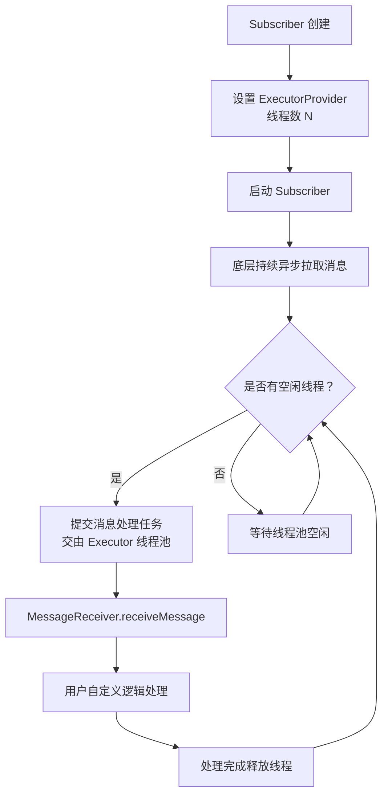
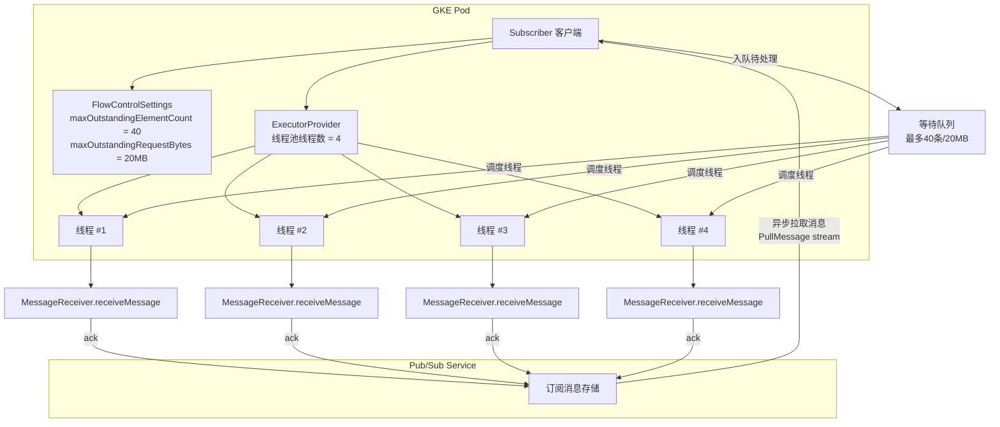

好的，下面是一个简洁的 Mermaid 流程图，说明 Java Pub/Sub Subscriber 中的并发处理逻辑，特别是如何通过线程池 (ExecutorProvider) 处理接收到的消息。



💡 图示说明：

- 线程数限制在你定义的 ExecutorProvider（如 4）。
- 每条消息拉取之后，会交由线程池去处理。
- 如果线程池满了（比如已经有 4 条消息正在处理），后续消息会阻塞在消息队列中，直到线程空闲。
- receiveMessage() 是你实现的逻辑，会在这些线程中被调用。

是否还需要加入 FlowControlSettings 控制流量的内容？也可以单独生成一张 flowchart 展示。	

这是个非常好的问题。对于运行在 GKE Pod 内的 Pub/Sub Java 客户端（Subscriber），如何设置线程数（ExecutorProvider）和流控（FlowControlSettings）的合理值，应该结合以下几个关键点进行权衡和调整：


✅ 推荐配置策略：GKE 中 Pub/Sub Java 客户端

  

|   |   |   |
|---|---|---|
|类别|推荐设置|说明|
|ExecutorProvider|与 CPU 核心数匹配，或 2x CPU（可动态调优）|每个线程处理一条消息。若是 I/O 密集型，可稍高；CPU 密集型则等同于 vCPU 数较合理|
|FlowControlSettings.maxOutstandingElementCount|线程数 * 2 到 线程数 * 10|保证足够的消息排队等待，不会造成空闲线程因没消息可处理|
|FlowControlSettings.maxOutstandingRequestBytes|10~100MB（视单条消息大小决定）|限制客户端内存使用，避免 OOM|
|ackDeadline|默认即可，Pub/Sub SDK 会自动延长（Lease Extension）|除非处理非常慢才需要调|
|Parallel Pull Streams|通常保持默认（1），大量消息量时可调高（不建议超过 CPU 核）|多个 gRPC pull 流同时运行，配合线程池可提高吞吐|


🧠 配置建议示例（假设 GKE Pod 为 2 vCPU / 4 GiB）

  
```java
int numThreads = 4; // 比 CPU 多一点，因为处理逻辑可能有 I/O
ExecutorProvider executorProvider = InstantiatingExecutorProvider.newBuilder()
    .setExecutorThreadCount(numThreads)
    .build();
FlowControlSettings flowControlSettings = FlowControlSettings.newBuilder()
    .setMaxOutstandingElementCount(40L)         // 线程数 * 10
    .setMaxOutstandingRequestBytes(20 * 1024 * 1024L)  // 20MB
    .build();
Subscriber subscriber = Subscriber.newBuilder(subscriptionName, messageReceiver)
    .setExecutorProvider(executorProvider)
    .setFlowControlSettings(flowControlSettings)
    .build();
```

  
🚀 实战调优建议

|   |   |   |
|---|---|---|
|指标|如何调整|建议工具|
|消息延迟|如果处理延迟高，可能线程太少 / 消息积压|结合 ack_message_count, oldest_unacked_message_age|
|CPU 使用率|如果 CPU 空闲，说明线程太少|使用 GKE Pod Metrics 观察 CPU|
|内存使用率|如果内存吃满，可能是流控设置过高 / 处理逻辑占用大|maxOutstandingRequestBytes 可调低|
|消费速率不够|检查线程数、gRPC Stream 数量、是否遇到 RESOURCE_EXHAUSTED|可考虑水平扩展 Pod 个数|

  

📈 高并发吞吐场景架构建议（需要时）
  

- 使用 HPA（基于 CPU 或自定义 metrics，如 Pub/Sub backlog）自动扩缩 Pod
- 每个 Pod 设置固定线程数，如 4~8（避免 JVM 创建太多线程）
- 使用 Cloud Monitoring + Cloud Logging 定时分析消费情况

  

如你希望，我可以帮你画一张 Mermaid 图来表示 GKE 中的 Pod、线程池、Pub/Sub 流控之间的交互关系。是否需要？

好的，以下是一个展示 GKE 中运行的 Java Pub/Sub 客户端（Subscriber）架构及其并发处理逻辑 的 Mermaid 流程图，涵盖了：

- Pod 内部线程池（ExecutorProvider）
- 流控（FlowControlSettings）
- 与 Pub/Sub 的异步拉取与处理关系

  


🧩 图示说明

- Pub/Sub 服务持续将消息发送给客户端（Subscriber）。
- 客户端内部设置了流控：最多允许排队 40 条消息或 20MB。
- 消息送入等待队列，由线程池（4个线程）并发调用 receiveMessage() 方法处理。
- 处理完后通过 ack() 手动或自动确认消息。

如需我扩展这张图加入 HPA 横向扩展、多个 Pod 协同消费等，也可以进一步补充。是否需要再扩展？
