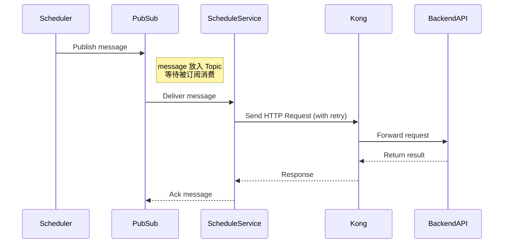

“**Actual Time 延迟了 1–2 秒**”，这个概念在你当前的 GCP 架构里，通常指的是：

---

## **✅ ⏱️** 

## **从 Cloud Scheduler 触发 到 Backend Service 返回响应**

##  **的**

## **全链路耗时（End-to-End Latency）**

我们可以把这条链路拆解成多个阶段，每一段都可能引入延迟：



---

## **✅ 每段的延迟说明**

| **阶段**                     | **指标名称**                                | **延迟来源**                                                                            | **说明**                                            |
| ---------------------------- | ------------------------------------------- | --------------------------------------------------------------------------------------- | --------------------------------------------------- |
| Scheduler ➜ Pub/Sub          | schedule latency                            | 调度任务本身延迟                                                                        | 通常几百毫秒以内，GCP Scheduler 很稳定              |
| Pub/Sub ➜ ScheduleService    | oldest_unacked_message_age / delivery delay | 如果 ScheduleService 吞吐不足，会在这里堆积；可能几秒~几十秒                            |                                                     |
| ScheduleService ➜ BackendAPI | HTTP 响应延迟                               | 取决于 Backend 的处理速度和 Kong 的 timeout 设置；你目前是默认超时 6 分钟（可能 retry） |                                                     |
| 总延迟                       | End-to-End                                  | 全链路延迟                                                                              | 实际观测到的「用户请求调度 ➜ Backend 返回」所需时间 |

---

## **✅ 你现在说的“Actual Time 延迟 1–2 秒”通常指哪一段？**

如果你是看：

- **ScheduleService 的日志时间戳**，比如 接收到 Pub/Sub 消息 ➜ 发出请求 ➜ 收到响应，那么这个是：
    > **ScheduleService ➜ BackendAPI（包含 Kong）这段的耗时**

如果你是通过：

- **Cloud Logging** 或 **Trace** 查看任务实际处理比调度时间晚了 1–2 秒，那可能是：
    > **Pub/Sub ➜ ScheduleService 的 delivery delay**

---

## **✅ 如何监控这些延迟？**

| **延迟段**                 | **推荐指标**                                   |
| -------------------------- | ---------------------------------------------- |
| Pub/Sub delivery 延迟      | oldest_unacked_message_age（单位秒）           |
| ScheduleService 发请求延迟 | 自定义日志/trace duration、Prometheus 直观采集 |
| Backend 响应时间           | nginx 日志 or Prometheus histogram 请求耗时    |
| 整体链路延迟               | Cloud Trace（推荐打 trace id）                 |

---

## **✅ 如何更精细衡量？**

可以在每条请求中添加这些 trace 字段：

```
{
  "schedule_time": "2025-06-26T20:10:00Z",
  "received_time": "2025-06-26T20:10:01Z",
  "start_http_request": "2025-06-26T20:10:01.2Z",
  "response_time": "2025-06-26T20:10:02.8Z"
}
```

---

## **✅ 小结**

| **实际延迟**      | **通常指的是**                                              |
| ----------------- | ----------------------------------------------------------- |
| 1–2 秒延迟        | 多数发生在 Pub/Sub delivery + ScheduleService 发出请求      |
| 超过 5 秒以上延迟 | 可能 Backend 响应慢、Kong 转发失败或 ScheduleService 重试中 |

---

如果你需要我：

- 帮你定义 Cloud Logging 日志分析模板，统计各段时间
- 或生成 Cloud Trace 集成建议（如 Java OpenTelemetry）

告诉我你的语言栈，我可以马上生成整套链路追踪逻辑。
