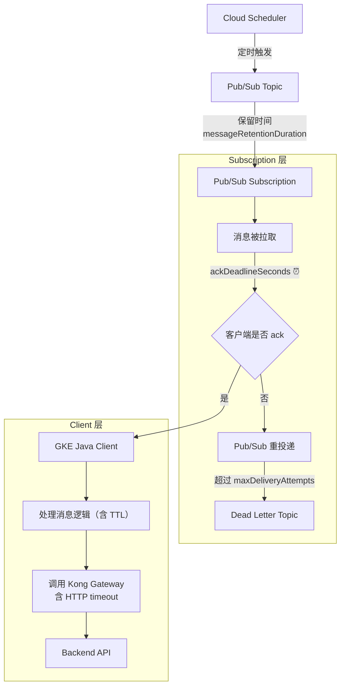

是的，你的思路是对的，Java 客户端在 GKE Pod 中配置 TTL（例如设置处理超时时间） 确实可以作为一种“自我约束机制”，来限制处理时间、防止长时间阻塞或卡死重试逻辑，但要注意几点：

✅ GKE Pod + Java 客户端中的 TTL 作用理解

1.

与 Pub/Sub 的 ackDeadlineSeconds 是两个不同层次的 TTL

|                 |                              |                             |                                       |
| --------------- | ---------------------------- | --------------------------- | ------------------------------------- |
| 层级            | TTL 类型                     | 控制范围                    | 谁负责                                |
| Pub/Sub 服务端  | ackDeadlineSeconds           | 控制消息多久没被 ack 就重投 | 由 GCP Pub/Sub 管理                   |
| Java 客户端内部 | 自定义 TTL（如处理超时时间） | 控制单条消息处理最长耗时    | 由你自己实现或通过线程池/超时机制控制 |

2.

Java 客户端的 TTL 适用场景

- 用于限制消息处理逻辑（例如调用后端 API）的最大耗时
- 通常结合 ScheduledExecutorService 或 CompletableFuture.timeoutAfter() 实现
- 可以防止某个线程“卡死”或无限等待后端服务响应

    3.

典型做法（伪代码）
```java
ExecutorService executor = Executors.newSingleThreadExecutor();

PubsubMessageReceiver receiver = (message, consumer) -> {

CompletableFuture<Void> task = CompletableFuture.runAsync(() -> {

callBackendService(message);

}, executor);

task.orTimeout(10, TimeUnit.SECONDS)  // Java 11+

.whenComplete((res, ex) -> {

if (ex == null) {

// 处理完成

// 已自动 ack（如果是自动 ack 模式）

} else {

// 超时或异常处理

log.warn("处理超时或失败", ex);

// 注意：此处如果使用手动 ack 模式，可决定是否 nack

}

});

};

```

🧠 总结对比：TTL 与 ackDeadline

|              |                                   |                                    |
| ------------ | --------------------------------- | ---------------------------------- |
| 项目         | Java TTL（客户端超时）            | ackDeadlineSeconds（Pub/Sub）      |
| 控制对象     | 客户端消息处理逻辑                | 服务端投递生命周期                 |
| 可控性       | 完全由你控制（任意设置）          | 有 GCP 限制（默认 10s，最大 600s） |
| 是否影响 ack | ❌ 不直接影响 ack，除非你手动处理 | ✅ 直接决定消息是否重投            |
| 典型用途     | 限制处理耗时、防死锁卡顿          | 控制未 ack 消息的生命周期          |

✅ 建议

- 如果你使用的是 自动 ack 模式，Java TTL 只能保证自己“处理不超时”，但失败不会重投（因为消息早就 ack）。
- 如果你希望更可靠的处理机制：

- 设定合理的 Java TTL
- 使用 手动 ack 模式（延迟 ack 直到处理成功）
- 配合 Pub/Sub Dead Letter Policy（DLQ） 做失败兜底

-

是否需要我为你画一张流程图展示 Java 客户端 TTL 与 Pub/Sub ack 的协同作用？可以帮你更直观理解这两个 TTL 的关系。

非常好，这是一个深入系统设计层面的好问题。为了全面回答「Pub/Sub 或你的整个 Flow 中哪些地方可能涉及 TTL（Time-To-Live）」这个问题，我将从消息生命周期的不同阶段出发，列出所有可能涉及 TTL 的部分，并进行标注说明：

✅ Pub/Sub 与整个 Flow 中可能的 TTL 点位总览

|      |                                                  |                                   |                                                    |                                  |
| ---- | ------------------------------------------------ | --------------------------------- | -------------------------------------------------- | -------------------------------- |
| 编号 | TTL 点位                                         | 所属组件                          | TTL 说明                                           | 可配置性                         |
| 1️⃣   | messageRetentionDuration                         | Pub/Sub Topic                     | 消息未被订阅者拉取或 ack 前的保留时间（默认 7 天） | ✅ 可设（10 分钟 ~ 7 天）        |
| 2️⃣   | ackDeadlineSeconds                               | Pub/Sub Subscription              | 消息被拉取后，等待客户端 ack 的时间（默认 10 秒）  | ✅ 可设（10 ~ 600 秒）           |
| 3️⃣   | retry policy - minimumBackoff / maximumBackoff   | Pub/Sub DLQ（dead-letter policy） | 控制消息重试的时间窗口（失败后多久重投）           | ✅ 可设                          |
| 4️⃣   | message TTL in DLQ                               | Pub/Sub Dead Letter Topic         | DLQ 中消息的保留时间（Topic 的 messageRetention）  | ✅ 由 DLQ Topic 决定             |
| 5️⃣   | 客户端处理 TTL（例如 HTTP 超时、Future timeout） | GKE Java 客户端                   | 控制单条消息处理最大耗时                           | ✅ 应由你实现                    |
| 6️⃣   | HTTP 请求超时时间（Kong 或 Client）              | Kong Gateway / Java HTTP client   | 控制请求后端 API 的超时时间（如 3s）               | ✅ 推荐设置                      |
| 7️⃣   | Kubernetes Pod 生命周期 TTL                      | GKE / K8s                         | Pod/Job 生命周期管理，比如 Job TTL after finish    | ✅ Job 可配置，Deployment 无 TTL |
| 8️⃣   | Cloud Scheduler 定时触发间隔                     | Cloud Scheduler                   | 不是 TTL，但会影响 message TTL 覆盖频率            | ✅ 可配置 cron 频率              |
| 9️⃣   | BigQuery / Log Sink 的数据保留时间               | GCP Sink/Storage                  | 日志/数据相关保留策略                              | ✅ 可设                          |

🧠 可视化 TTL 生命周期 Flow

✅ 推荐你重点关注的 TTL 设置点

|                       |                                                                 |
| --------------------- | --------------------------------------------------------------- |
| 目标                  | 推荐操作                                                        |
| 避免消息无故丢失      | 不要提前 ack，设置合理的 ackDeadlineSeconds 和重试策略          |
| 控制处理耗时          | 客户端逻辑中加处理 TTL，例如 10s 超时 后停止等待                |
| 后端服务保护          | 在 HTTP 请求中配置 connect timeout 和 read timeout（例如 3~5s） |
| 防止 backlog 占用堆积 | 设置 Topic 的 messageRetentionDuration 合理（不要过长）         |
| 跟踪失败消息          | 配置 Dead Letter Topic 并监控其存量（可以加告警）               |

如你希望，我可以帮你生成一张 以 TTL 为主轴的控制点配置清单表格 或 流程图加入实际配置建议，需要的话告诉我。
