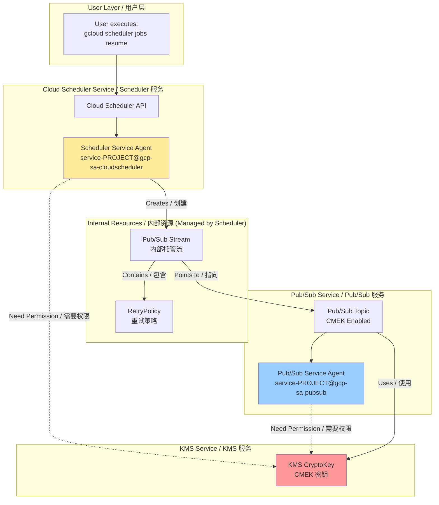
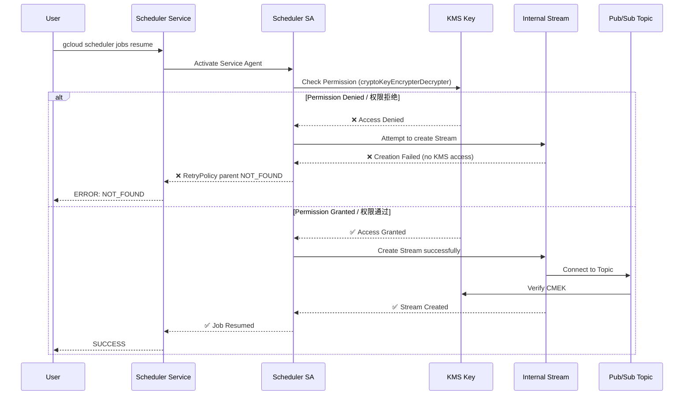

# Cloud Scheduler + CMEK 完全排障手册 / Complete Troubleshooting Guide

## 核心问题 / Core Issue

**症状 / Symptom**:
```bash
gcloud scheduler jobs resume job-lex-eg-test-001
ERROR: NOT_FOUND - parent resource not found for .../retryPolicies/...
```

**根本原因 / Root Cause**:
Cloud Scheduler Service Agent 缺少对 CMEK 密钥的访问权限，导致无法创建内部 Pub/Sub Stream 资源。

Cloud Scheduler Service Agent lacks KMS permissions on the CMEK key, preventing creation of internal Pub/Sub Stream resources.

---

## 一、完整架构流程图 / Complete Architecture Flow

### 1.1 系统实现视角 / System Implementation View



### 1.2 错误发生流程 / Error Flow



---

## 二、根因分析 / Root Cause Analysis

### 2.1 为什么会出现这个错误？/ Why This Error Occurs?

**关键理解点 / Key Understanding**:

Cloud Scheduler 不是直接调用 Pub/Sub API。它会创建一个 **内部托管的 Pub/Sub Stream**。

Cloud Scheduler does NOT directly call Pub/Sub API. It creates an **internally managed Pub/Sub Stream**.

**真实结构 / Real Structure**:
```
Cloud Scheduler Job
  └── Pub/Sub Target (logical)
       └── Managed Stream (physical, created by Scheduler SA)
            └── RetryPolicy (physical, attached to Stream)
                 └── Pub/Sub Topic (CMEK-encrypted)
```

**创建这个 Stream 的主体是谁？/ Who Creates the Stream?**

👉 **Cloud Scheduler Service Agent** (NOT Pub/Sub Service Agent)

**为什么需要 KMS 权限？/ Why KMS Permission is Needed?**

因为 Stream 需要连接到 CMEK 加密的 Topic，Scheduler SA 在创建 Stream 时必须验证它能否访问加密资源。

Because the Stream connects to a CMEK-encrypted Topic, Scheduler SA must verify it can access the encrypted resource during Stream creation.

### 2.2 为什么错误是 NOT_FOUND 而不是 PERMISSION_DENIED？

**Google 内部资源模型的"坑" / GCP Internal Resource Model Issue**:

```
Stream 创建失败 (due to KMS permission)
  ↓
RetryPolicy 无法挂载 (no parent Stream)
  ↓
查询 RetryPolicy → parent resource 不存在
  ↓
返回 NOT_FOUND (而不是 PERMISSION_DENIED)
```

这是一个误导性的错误消息，实际根因是权限问题。

This is a misleading error message; the actual root cause is a permission issue.

---

## 三、两个 Service Agent 的职责边界 / Service Agent Responsibilities

### 3.1 Cloud Scheduler Service Agent

```
service-<PROJECT_NUMBER>@gcp-sa-cloudscheduler.iam.gserviceaccount.com
```

**何时使用 KMS？/ When Does It Use KMS?**

| 操作 / Operation | 是否需要 KMS / KMS Required | 原因 / Reason |
|------------------|----------------------------|---------------|
| `jobs create` | ✅ | 创建内部 Stream / Creates internal Stream |
| `jobs resume` | ✅ | 恢复/重建 Stream / Resumes/rebuilds Stream |
| `jobs pause` | ❌ | 仅状态变更 / State change only |
| `jobs run` | ✅ | 触发 Stream 活动 / Triggers Stream activity |

### 3.2 Pub/Sub Service Agent

```
service-<PROJECT_NUMBER>@gcp-sa-pubsub.iam.gserviceaccount.com
```

**何时使用 KMS？/ When Does It Use KMS?**

| 操作 / Operation | 是否需要 KMS / KMS Required | 原因 / Reason |
|------------------|----------------------------|---------------|
| Message publish | ✅ | 加密消息存储 / Encrypts message storage |
| Message delivery | ✅ | 解密消息投递 / Decrypts message delivery |
| Topic operations | ❌ | Scheduler SA 已验证 / Already validated by Scheduler SA |

### 3.3 决策公式 / Decision Formula

**谁创建资源，谁需要 KMS 权限**
**Whoever creates the resource needs KMS permission**

- 创建 Stream → Scheduler SA ✅
- 使用 Topic 存储消息 → Pub/Sub SA ✅

---

## 四、完整解决方案 / Complete Solution

### Step 1: 确认项目编号 / Confirm Project Number

```bash
gcloud projects describe aibang-projectid-abjx01-dev \
  --format="value(projectNumber)"
# Output: 445194165188
```

### Step 2: 获取 Service Agent 邮箱 / Get Service Agent Emails

```bash
# Cloud Scheduler Service Agent
SCHEDULER_SA="service-445194165188@gcp-sa-cloudscheduler.iam.gserviceaccount.com"

# Pub/Sub Service Agent
PUBSUB_SA="service-445194165188@gcp-sa-pubsub.iam.gserviceaccount.com"
```

### Step 3: 设置 KMS Key 变量 / Set KMS Key Variables

```bash
export KMS_PROJECT_ID="your-kms-project-id"
export LOCATION="europe-west2"  # 必须与 Scheduler Job location 一致
export KEY_RING="your-keyring-name"
export KEY_NAME="your-key-name"
```

### Step 4: 授权 Cloud Scheduler Service Agent (必须 / REQUIRED)

```bash
gcloud kms keys add-iam-policy-binding ${KEY_NAME} \
  --keyring ${KEY_RING} \
  --location ${LOCATION} \
  --project ${KMS_PROJECT_ID} \
  --member="serviceAccount:${SCHEDULER_SA}" \
  --role="roles/cloudkms.cryptoKeyEncrypterDecrypter"
```

### Step 5: 授权 Pub/Sub Service Agent (强烈建议 / HIGHLY RECOMMENDED)

```bash
gcloud kms keys add-iam-policy-binding ${KEY_NAME} \
  --keyring ${KEY_RING} \
  --location ${LOCATION} \
  --project ${KMS_PROJECT_ID} \
  --member="serviceAccount:${PUBSUB_SA}" \
  --role="roles/cloudkms.cryptoKeyEncrypterDecrypter"
```

### Step 6: 验证授权 / Verify Permissions

```bash
gcloud kms keys get-iam-policy ${KEY_NAME} \
  --keyring ${KEY_RING} \
  --location ${LOCATION} \
  --project ${KMS_PROJECT_ID} \
  --flatten="bindings[].members" \
  --filter="bindings.role:roles/cloudkms.cryptoKeyEncrypterDecrypter"
```

**预期输出 / Expected Output**:
```
- serviceAccount:service-445194165188@gcp-sa-cloudscheduler.iam.gserviceaccount.com
- serviceAccount:service-445194165188@gcp-sa-pubsub.iam.gserviceaccount.com
```

### Step 7: 删除并重建 Scheduler Job / Delete and Recreate Job

```bash
# 删除损坏的 Job / Delete broken Job
gcloud scheduler jobs delete job-lex-eg-test-001 \
  --location europe-west2 \
  --project aibang-projectid-abjx01-dev \
  --quiet

# 重新创建 Job / Recreate Job
gcloud scheduler jobs create pubsub job-lex-eg-test-001 \
  --schedule="0 0 * * *" \
  --topic=projects/aibang-projectid-abjx01-dev/topics/YOUR_TOPIC_NAME \
  --message-body='{"test": "message"}' \
  --location europe-west2 \
  --project aibang-projectid-abjx01-dev
```

---

## 五、常见场景排查 / Common Scenarios Troubleshooting

### 场景 1: KMS Key 在不同项目 / Cross-Project KMS

**症状**: Topic 创建成功，但 Scheduler 失败

**原因**: KMS 项目未授权 Scheduler SA

**解决**: 在 **KMS 项目** 授权，不是 Scheduler 项目

```bash
# ❌ 错误：在 Scheduler 项目授权
gcloud projects add-iam-policy-binding aibang-projectid-abjx01-dev ...

# ✅ 正确：在 KMS 项目授权
gcloud kms keys add-iam-policy-binding ... --project <KMS_PROJECT>
```

### 场景 2: 只给了 Pub/Sub SA 权限

**症状**: Resume 失败，但消息能正常发布

**原因**: Scheduler SA 缺少权限

**解决**: 必须同时授权两个 SA

| SA | Resume 是否需要 | Publish 是否需要 |
|----|----------------|-----------------|
| Scheduler SA | ✅ 必须 | ❌ |
| Pub/Sub SA | ❌ | ✅ 必须 |

### 场景 3: Key Location 不匹配

**症状**: 间歇性失败

**原因**: KMS Key location ≠ Scheduler location

**解决**: 确保一致性

```bash
# Scheduler Job location
--location europe-west2

# KMS Key location (必须一致或使用 global)
--location europe-west2
```

---

## 六、验证清单 / Verification Checklist

### 创建前验证 / Pre-Creation Verification

- [ ] Pub/Sub Topic 已启用 CMEK
- [ ] KMS Key 状态为 ENABLED
- [ ] Scheduler SA 有 cryptoKeyEncrypterDecrypter 角色
- [ ] Pub/Sub SA 有 cryptoKeyEncrypterDecrypter 角色
- [ ] Location 一致性验证

### 创建后验证 / Post-Creation Verification

```bash
# 1. 验证 Job 状态
gcloud scheduler jobs describe job-lex-eg-test-001 \
  --location europe-west2 \
  --format="value(state)"
# Expected: ENABLED

# 2. 手动触发测试
gcloud scheduler jobs run job-lex-eg-test-001 \
  --location europe-west2

# 3. 查看执行历史
gcloud scheduler jobs describe job-lex-eg-test-001 \
  --location europe-west2 \
  --format="value(status.lastAttemptTime, status.code)"
```

---

## 七、IAM 授权模板 / IAM Authorization Template

### 最小权限模型 / Minimum Permission Model

```bash
#!/bin/bash
# Cloud Scheduler + Pub/Sub + CMEK 最小授权脚本
# Minimum IAM Setup for Scheduler + Pub/Sub + CMEK

PROJECT_NUMBER="<YOUR_PROJECT_NUMBER>"
KMS_PROJECT="<YOUR_KMS_PROJECT>"
KEY_RING="<YOUR_KEYRING>"
KEY_NAME="<YOUR_KEY_NAME>"
LOCATION="<YOUR_LOCATION>"

# Scheduler SA
gcloud kms keys add-iam-policy-binding ${KEY_NAME} \
  --keyring ${KEY_RING} \
  --location ${LOCATION} \
  --project ${KMS_PROJECT} \
  --member="serviceAccount:service-${PROJECT_NUMBER}@gcp-sa-cloudscheduler.iam.gserviceaccount.com" \
  --role="roles/cloudkms.cryptoKeyEncrypterDecrypter"

# Pub/Sub SA
gcloud kms keys add-iam-policy-binding ${KEY_NAME} \
  --keyring ${KEY_RING} \
  --location ${LOCATION} \
  --project ${KMS_PROJECT} \
  --member="serviceAccount:service-${PROJECT_NUMBER}@gcp-sa-pubsub.iam.gserviceaccount.com" \
  --role="roles/cloudkms.cryptoKeyEncrypterDecrypter"
```

---

## 八、平台级总结 / Platform-Level Summary

### 给安全团队的解释 / For Security Teams

在 CMEK 强制执行环境中，Cloud Scheduler 创建指向 Pub/Sub 的任务时，会在后台创建内部 Stream 资源。这个 Stream 的创建者是 Cloud Scheduler Service Agent，因此它必须拥有对 CMEK 密钥的加解密权限。缺少此权限会导致 NOT_FOUND 错误（而非 PERMISSION_DENIED），因为 RetryPolicy 找不到其父级 Stream 资源。

In CMEK-enforced environments, when Cloud Scheduler creates a job targeting Pub/Sub, it creates an internal Stream resource in the background. The creator of this Stream is the Cloud Scheduler Service Agent, so it must have encrypt/decrypt permissions on the CMEK key. Lacking this permission causes a NOT_FOUND error (not PERMISSION_DENIED) because the RetryPolicy cannot find its parent Stream resource.

### 关键记忆点 / Key Takeaways

1. **两个 SA 都需要授权** / Both SAs need authorization
2. **在 KMS 项目授权** / Grant in KMS project
3. **Resume 不修复权限问题，必须重建** / Resume doesn't fix permission issues; must recreate
4. **NOT_FOUND 是误导性错误** / NOT_FOUND is a misleading error message

---

## 九、快速参考 / Quick Reference

### 一行诊断命令 / One-Line Diagnostic

```bash
gcloud kms keys get-iam-policy <KEY> --keyring <RING> --location <LOC> --project <KMS_PROJ> | grep -E "cloudscheduler|pubsub"
```

### 一行修复命令 / One-Line Fix

```bash
for SA in cloudscheduler pubsub; do gcloud kms keys add-iam-policy-binding <KEY> --keyring <RING> --location <LOC> --project <KMS_PROJ> --member="serviceAccount:service-<NUM>@gcp-sa-${SA}.iam.gserviceaccount.com" --role="roles/cloudkms.cryptoKeyEncrypterDecrypter"; done
```

---

**文档版本 / Document Version**: 1.0  
**最后更新 / Last Updated**: 2026-01-23  
**适用场景 / Applicable Scenarios**: Cloud Scheduler + Pub/Sub + CMEK + Organization Policy
