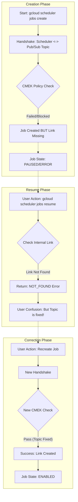
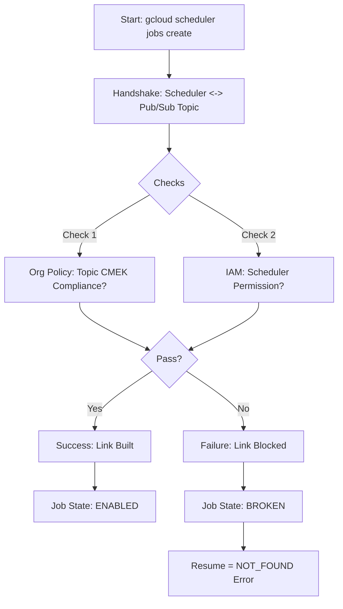

# Cloud Scheduler & CMEK: Resume Failure Analysis / Cloud Scheduler 与 CMEK：恢复失败分析

## Issue Summary / 问题摘要

**Symptom / 症状**:
- **Operation**: `gcloud scheduler jobs resume [JOB_ID]`
- **Error**: `NOT_FOUND: Resource 'parent resource not found for .../retryPolicies/...'`
- **Context**: Organization Policy `constraints/gcp.restrictNonCmekServices` is enforced. Pub/Sub Topic is CMEK-enabled.

**Conclusion / 结论**:
The `NOT_FOUND` error confirms that the Cloud Scheduler Job is in an **Orphaned / Inconsistent State** (孤儿/不一致状态). The job definition exists, but its underlying connection resource (an internal `retryPolicies` object) failed to be created during the initial setup—likely due to the CMEK policy blocking the initial "handshake" between Scheduler and the unencrypted (or permission-less) Topic.

该 `NOT_FOUND` 错误证实 Cloud Scheduler 任务处于 **孤儿/不一致状态**。任务定义存在，但其底层连接资源（内部 `retryPolicies` 对象）在初始设置期间未能创建——这很可能是由于 CMEK 策略阻止了 Scheduler 与当时未加密（或缺少权限）的主题之间的初始“握手”。

---

## Deep Dive Explanation / 深入解释

### 1. The Implicit Dependency / 隐式依赖
Cloud Scheduler does not have an explicit `--topic-encryption-key` flag. It relies on the **Target's Compliance** (目标的合规性).
Cloud Scheduler 没有显式的 `--topic-encryption-key` 标志。它依赖于 **目标的合规性**。

When you create a job targeting a Pub/Sub topic, a **Dependency Chain** is formed:
当您创建指向 Pub/Sub 主题的任务时，会形成一个 **依赖链**：

> **Scheduler Job**  -->  **(Internal Connector)**  -->  **Pub/Sub Topic**  -->  **KMS Key**

### 2. The "Resume" Trap / “恢复”的陷阱
Why does `resume` fail even if I fixed the Topic?
为什么即使我修复了 Topic，`resume` 仍然失败？

*   **Initial Failure**: When you first created (or paused) the job, the Topic might not have been fully compliant (or the Service Agent lacked permissions). The Policy Service blocked the creation of the **Internal Connector**.
    *   **初始失败**: 当您首次创建（或暂停）任务时，Topic 可能不完全合规（或服务代理缺少权限）。策略服务阻止了 **内部连接器** 的创建。
*   **Empty Reference**: The Job was saved, but it points to `NULL` or a phantom ID for that connector.
    *   **空引用**: 任务被保存了，但它指向该连接器的 `NULL` 或幽灵 ID。
*   **Resume Action**: `resume` is a simple "State Flip" operation. It assumes the resources exist. It tries to call `connector.activate()`. Since `connector` is missing, it returns `NOT_FOUND`.
    *   **恢复操作**: `resume` 是一个简单的“状态翻转”操作。它假设资源存在。它试图调用 `connector.activate()`。由于 `connector` 缺失，它返回 `NOT_FOUND`。

---

## Solution Flow / 解决方案流程

The specific error path you encountered matches the "Link Blocked" scenario below.
您遇到的特定错误路径与下方的“链接阻断”场景相符。



---


---

## Verification Checklist / 验证清单

Before recreating the job, verify the environment is now 100% compliant so the **New Handshake** succeeds.
在重建任务之前，请验证环境现在是否 100% 合规，以便 **新握手** 能够成功。

1.  **Topic Encryption / 主题加密**:
    ```bash
    gcloud pubsub topics describe [TOPIC_NAME] --format="value(kmsKeyName)"
    # Must return KEY_ID / 必须返回 KEY_ID
    ```

2.  **Service Agent Permission / 服务代理权限**:
    *   The **Pub/Sub Service Agent** must have `roles/cloudkms.cryptoKeyEncrypterDecrypter`.
    *   **Pub/Sub 服务代理** 必须拥有 `roles/cloudkms.cryptoKeyEncrypterDecrypter`。
    *   > **Important / 重要提示**: This is the agent for **Pub/Sub** (`service-{NUM}@gcp-sa-pubsub...`), **NOT** Cloud Scheduler. Pub/Sub encrypts the message at rest, so **IT** needs the key.
    *   > **这是 Pub/Sub 的服务代理** (`service-{NUM}@gcp-sa-pubsub...`)，**不是** Cloud Scheduler 的。因为由 Pub/Sub 负责静态数据加密，所以 **它** 需要密钥。I

3.  **Execute Re-creation / 执行重建**:
    ```bash
    # 1. Delete / 删除
    gcloud scheduler jobs delete [JOB_NAME] --quiet
    
    # 2. Create / 创建
    gcloud scheduler jobs create pubsub [JOB_NAME] --topic=[TOPIC_NAME] ...
    ```


