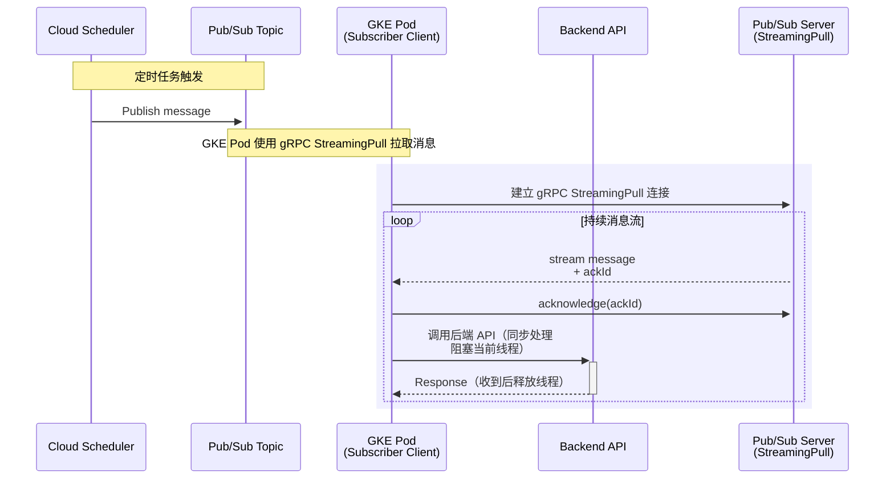
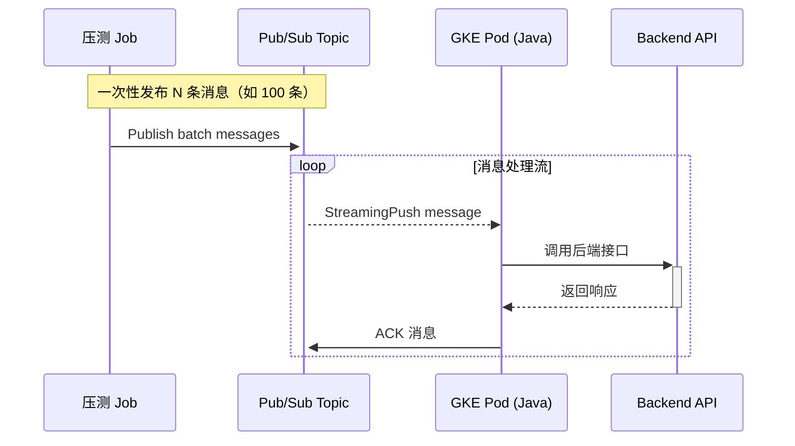

对于我的这个 FLow 我现在想要做这样一个测试,来评估我的资源配置情况.我们是 Spring 封装的 Java 应用.



比如我目前 GKE Pod 配置一些提示如下 spring.cloud.gcp.pubsub.subscriber.executor-threads 这个设置为了 20

比如我默认启动 3 个 Pod,那么我应该有同时处理 40 个消息的的能力.每个 Pod 1G 内存 1G CPU, 因为我们 IO 密集型任务,多数是在等待 backend service 返回数据   我这么理解

另外 我们 spring.cloud.gcp.pubsub.subscriber.parallel-pull-count 走默认应该 看起来默认是 2 这个决定了有 2 个活跃的 StreamingPull 请求（gRPC）被客户端持续打开

那么假设我在某个整点有同时 50 个 Job 或者说消息 推送到 pub/sub 而后我们后面的 POD Pull 这些消息到自己的队列,然后在本地 Pod 缓存处理,按需 ACK,我后面的 Backend Service 一般会在 5S 处理完成. 那么基于这些数据评估.我应该怎么定义我的这些关键组件的处理能力.我想拿到一个合理的配置

# Chatgtp

你的目标非常明确：**基于现有 GKE + Pub/Sub + Spring Java 应用的架构**，评估在高并发任务触发（例如整点批量推送）时的资源处理能力瓶颈，并据此优化配置（包括线程池、Pod 数量、StreamingPull、CPU/内存等）。

---

## **✅ 架构回顾**

结合你提供的 Mermaid 图，我们明确以下关键点：

| **组件**                    | **描述**                                                           |
| --------------------------- | ------------------------------------------------------------------ |
| Cloud Scheduler             | 定时触发消息                                                       |
| Pub/Sub Topic               | 消息队列                                                           |
| GKE Pod (Scheduler Service) | Java 程序：通过 StreamingPull 接收消息后调用后端 API               |
| Backend API                 | 实际处理逻辑，响应时间约 5s                                        |
| StreamingPull               | 每个 Pod 默认建立 parallel-pull-count 个 gRPC 流，消息通过此流推送 |

---

## **🔍 当前配置假设**

| **项目**                      | **数值**                                                    |
| ----------------------------- | ----------------------------------------------------------- |
| Pod 数量                      | 3 个                                                        |
| 每个 Pod 线程池               | 20 (spring.cloud.gcp.pubsub.subscriber.executor-threads=20) |
| 每个 Pod StreamingPull 并发数 | 2 (parallel-pull-count=2 默认值)                            |
| 后端 API 平均响应时间         | 5 秒                                                        |
| 每个消息处理逻辑              | 阻塞型，等待 API 响应后 ACK                                 |
| 消息数量（突发）              | 50 个                                                       |
| 每个 Pod 资源                 | 1 vCPU / 1 GB RAM                                           |

---

## **📌 推导处理能力**

你每个 Pod 最多可并发处理 20 个消息线程，3 个 Pod 总共 **可并发处理消息数为 60**。

在突发消息量为 50 条时，系统表现如下：

- **理论上你是“处理能力充足”的**（60 ≥ 50）
- 由于处理时间为 5 秒，所以在 5 秒内这些线程都被占用
- 如果超过 60 个消息并发到来，就会排队，或 StreamingPull 不能立即调度处理（内部缓存 + backpressure）

---

## **⚙️ StreamingPull vs executor-threads 对比解释**

| **参数**                 | **描述**                                     | **建议**                                                    |
| ------------------------ | -------------------------------------------- | ----------------------------------------------------------- |
| executor-threads         | 真正的并发处理线程数（调接口）               | 关键参数，直接影响吞吐能力                                  |
| parallel-pull-count      | 与 Pub/Sub 服务端建立多少个 StreamingPull 流 | 默认 2 通常足够，小幅增加可以提升消息拉取速率（如设置为 4） |
| max-ack-extension-period | 最大 ack 延迟容忍时间                        | 设置一个 > 后端处理时间（如 60s）以避免消息重复投递         |

---

## **✅ 性能评估与配置建议**

以下是建议你可以参考的调整方案：

### **1. 计算处理能力基线（吞吐模型）**

> 理论并发能力（吞吐） = Pod 数量 × 每 Pod executor-threads

你当前配置为：

```
并发能力 = 3 Pod × 20 线程 = 60 并发处理能力
```

如果整点消息突发为 100 条，则：

```
处理完成耗时 = ceil(100 / 60) × 5s ≈ 10s
```

### **2. 推荐设置（轻负载优化）**

| **参数**            | **当前** | **推荐**       | **理由**                                          |
| ------------------- | -------- | -------------- | ------------------------------------------------- |
| Pod 数量            | 3        | **4~5**        | 提高稳定性 & 分摊负载峰值                         |
| executor-threads    | 20       | **20~30**      | 如资源允许，增加可提升并发吞吐（尤其在 I/O 场景） |
| parallel-pull-count | 2        | **2~4**        | 增加拉取通道避免客户端 backlog                    |
| CPU                 | 1 vCPU   | **1~1.5 vCPU** | 多线程处理建议略升高，避免调度拥塞                |
| Memory              | 1 GB     | **1~2 GB**     | 异步队列处理/缓冲数据建议冗余些                   |

---

## **🧪 如何测试评估配置（建议测试方案）**

你可以构建如下测试流程来验证资源能力：



监控以下指标：

| **指标**                   | **查看位置**                   | **期望表现**                        |
| -------------------------- | ------------------------------ | ----------------------------------- |
| ack_message_count          | Cloud Monitoring → Pub/Sub     | 全部消息成功 ACK                    |
| oldest_unacked_message_age | Cloud Monitoring               | 不应高于消息处理时间（5~10s）       |
| GKE Pod CPU & 内存         | Cloud Monitoring / GKE Metrics | CPU 使用率 < 80%，Memory < 70% 为佳 |
| Java 线程使用情况          | 应用日志或 JMX                 | 线程池不应满载                      |

---

## **🛠️ 可选优化方向**

1. **异步处理 + ack 延迟策略**

    将 ACK 推迟到 API 调用返回之后（现在已有），同时保障 ackDeadline ≥ API 处理时间 + 网络波动（比如设置为 60s）

2. **引入 backpressure 限流机制**

    Spring Pub/Sub 支持限流/预取参数，你可以设置 maxOutstandingElementCount 限制缓存消息数量避免 OOM。

3. **动态 Pod 扩缩容（HPA）**

    监控 CPU 或自定义 Metrics（如未处理消息数量）驱动扩容。

---

## **📘 总结表格**

| **指标项**          | **当前配置** | **建议配置** | **说明**                  |
| ------------------- | ------------ | ------------ | ------------------------- |
| Pod 数量            | 3            | 4~5          | 提高并发处理能力          |
| executor-threads    | 20           | 20~30        | 增加处理线程              |
| parallel-pull-count | 2            | 2~4          | 增加 StreamingPull 通道   |
| CPU                 | 1 vCPU       | 1~1.5 vCPU   | 多线程建议更高调度能力    |
| Memory              | 1 GB         | 1~2 GB       | 避免 GC/OOM，支持缓存处理 |

---

如果你希望我进一步提供压测脚本（Java 或 Python）、Cloud Monitoring 指标 DashBoard 模板，或者 GKE HPA 配置示例，我可以继续补充。是否需要？

那么如果我后端 502 之后,那么这个 ACK 等于没有完成 还需要再次投递 是这个道理么?

是的，你理解**完全正确**：

---

## **✅ ACK 和消息再次投递的机制说明（Pub/Sub）**

在 Google Pub/Sub 中，如果**客户端没有在 ackDeadline 之前发送 ACK**，该消息会被视为**未成功处理**，并在 ackDeadline 到期后**重新投递给任意订阅客户端**。

---

### **📌 结合你的流程来看：**

```
sequenceDiagram
    participant PubSub as Pub/Sub
    participant Client as GKE Pod（Java）
    participant API as Backend API

    PubSub-->>Client: StreamingPull 推送消息 (含 ackId)
    Client->>API: 请求调用后端
    API-->>Client: 返回 502（失败）
    Client --X PubSub: 未调用 acknowledge(ackId)
    Note over PubSub,Client: 超过 ackDeadline 后<br/>该消息会被再次投递
```

---

## **❗ 注意：你没有 ACK，就等于“**

## **没有处理**

## **”**

所以你只要：

- 后端返回 502 或其他错误；
- 或者你的代码中 **未显式调用 acknowledge(ackId)**；
- 或者 ACK **超时没发出（ackDeadline 到期）**；

那么 Pub/Sub 都会认为：**该消息未成功处理，会再次投递**。

---

## **✅ 正确做法建议（关键）**

### **1. 成功时：**

```
if (responseSuccess) {
    subscriber.acknowledge(ackId); // 明确 ack
}
```

### **2. 失败时（如 502）：**

```
if (responseFailure) {
    // 什么也不做，不 ACK（默认行为）
    // 消息会在 ackDeadline 到期后重新投递
}
```

### **3. 设置合理的 ackDeadline（默认 10s）：**

如果你后端处理是 5~10s，建议你设置大一些，比如：

```
spring.cloud.gcp.pubsub.subscriber.ack-deadline-seconds=30
```

或者在 subscriberFactory 中设置（Spring Java 中更精细控制）

---

## **📌 结论**

| **场景**                   | **是否 ACK？**  | **后果**                 |
| -------------------------- | --------------- | ------------------------ |
| 后端成功返回               | ✅ ackId 已提交 | 消息不会再投递           |
| 后端 502 / 异常 / 网络失败 | ❌ 未 ack       | 消息会被重新投递         |
| 程序异常退出 / 卡死        | ❌ 未 ack       | Pub/Sub 会重新发送该消息 |

你现有的处理逻辑，如果是同步阻塞型 + 成功才调用 ACK，这正是 Google 推荐的模式（**at-least-once delivery** + 手动 ACK 控制幂等性）。

---

如需，我可以帮你补一个 Java 示例逻辑（使用 Spring GCP Pub/Sub）来演示 ACK 成功/失败的处理流程。是否需要？

非常好的问题。

你当前的线程主要作用是：

> **每个线程 = 处理 1 条消息 = 发起后端 HTTP 请求 + 阻塞等待响应**

这属于 **I/O 密集型** 场景，**不是 CPU 密集型任务**，因此线程数的配置原则应该遵循 **并发 I/O 场景的最佳实践**，而不是典型的“线程=CPU 核心数”的老模式。

---

## **✅ 你的目标**

在资源（CPU、内存）允许的前提下：

- 尽可能**多地处理并发消息**（executor-threads 越高，并发吞吐越高）
- 同时 **避免线程上下文切换带来调度开销** 或资源耗尽

---

## **📌 合理设置** 

## **executor-threads**

##  **的评估标准**

| **维度**                    | **推荐依据**                                                                   |
| --------------------------- | ------------------------------------------------------------------------------ |
| I/O 密集型线程模型          | 每个线程多数时间都在等待网络响应，可以**大幅超过 CPU 核心数**                  |
| 资源指标监控                | 实际看 GKE Pod CPU / 内存使用率，如长时间低于 70%，说明可提升线程数            |
| 后端接口平均响应时间        | 响应时间越长，线程被“挂起”时间越长，可配置更高线程数来并发更多任务             |
| Spring GCP Pub/Sub 本身限制 | 实际能并发处理多少消息，受 executor-threads 限制，可通过监控处理速率评估饱和点 |
| Java GC/线程开销            | 理论上线程数不能无限大，需在 100~200 以内（单 Pod），否则影响 GC/上下文切换    |

---

## **📐 推荐设置模型**

我们基于如下模型来估算合理线程数：

> **线程数 ≈ 平均每秒到达的消息数 × 平均处理时间**

假设你每分钟有 100 条消息：

- 100 条 / 60s ≈ 1.6 条/s
- 每条耗时 ≈ 5s

则估算需要线程数：

```
所需线程 ≈ 1.6 × 5 ≈ 8
```

如果整点爆发，瞬时有 100 条：

- 想 10 秒内处理完：100 ÷ 10 = 每秒需要 10 个并发处理能力
- 考虑每个处理时间 5s：10 × 5 = 50 个线程才够

---

## **✅ 建议配置方案（结合你的条件）**

你当前是：

- 单 Pod：1 vCPU / 1G 内存
- executor-threads = 20
- 每条处理约 5s（含等待）

**建议分 3 档设定：**

| **场景**                | **建议线程数** | **说明**                                     |
| ----------------------- | -------------- | -------------------------------------------- |
| 正常情况（轻负载）      | 20~30          | CPU 使用率低，线程挂起时间长，提升并发更划算 |
| 中等爆发（整点 100 条） | 40~60          | 想在 5~10s 内处理完，单 Pod 需有 50 线程左右 |
| 极端爆发（>200 条）     | 60~100         | 建议加 Pod + HPA，单 Pod 线程数最多 100 以内 |

---

## **🔍 实际调优建议**

1. **从 20 -> 40 -> 60 逐步测试**

    - 查看 Pod CPU、内存是否升高
    - 查看指标是否 ACK 更快（如 oldest_unacked_message_age 降低）

2. **结合自定义 Metrics 做 HPA**

    - 比如基于「每个 Pod 中堆积待处理消息数」自动扩容

3. **设置最大 ACK 延迟**

    - 设置 ack-deadline-seconds=60，避免 5~10 秒处理的消息因线程排队导致重投

---

## **🧪 验证方式建议**

你可以用如下方式进行压测：

- 定时发布 100 条 Pub/Sub 消息
- 配置 executor-threads = 40
- 配置 parallel-pull-count = 2
- 监控以下指标：

| **指标**                   | **理想趋势**      |
| -------------------------- | ----------------- |
| ack_message_count          | 在 10 秒内完成    |
| oldest_unacked_message_age | 维持在 5~10s 以内 |
| GKE Pod CPU                | < 70%             |
| GKE Pod Mem                | < 70%             |

---

## **✅ 总结建议表**

| **Pod 配置**      | **executor-threads** | **推荐**                 |
| ----------------- | -------------------- | ------------------------ |
| 1 vCPU / 1G Mem   | 20                   | 起步值                   |
| 1 vCPU / 1G Mem   | 40                   | 建议值，I/O 场景下可承受 |
| 1.5 vCPU / 2G Mem | 60                   | 对应高并发场景           |
| >60 线程          | ⚠️ 慎重              | 注意 GC、上下文切换成本  |

---

如你需要，我可以补充一个完整的配置模板（Spring Boot application.yml + GKE YAML + HPA），用于你快速验证不同线程数下的效果。是否需要？
