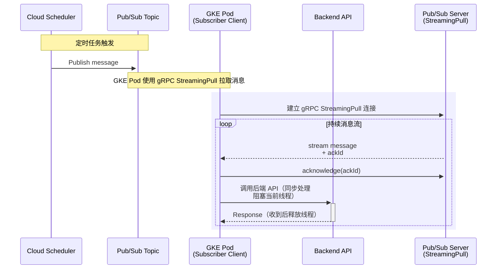
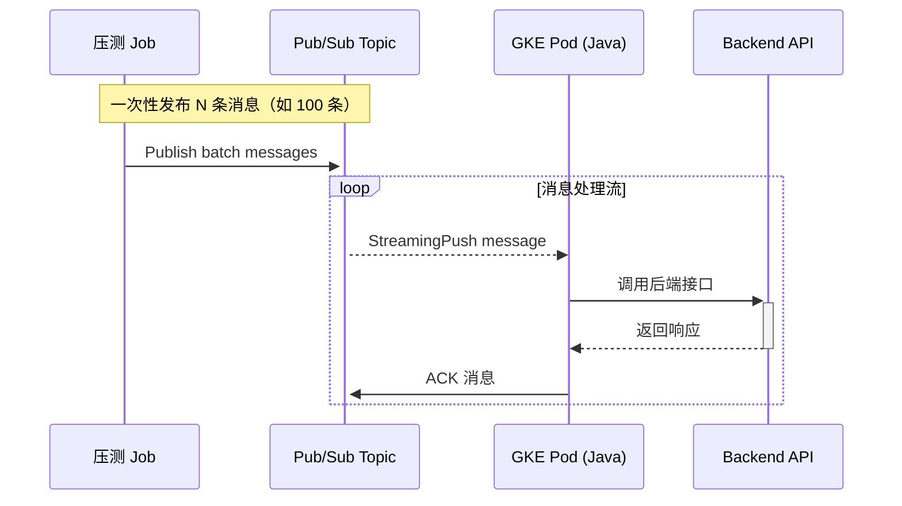
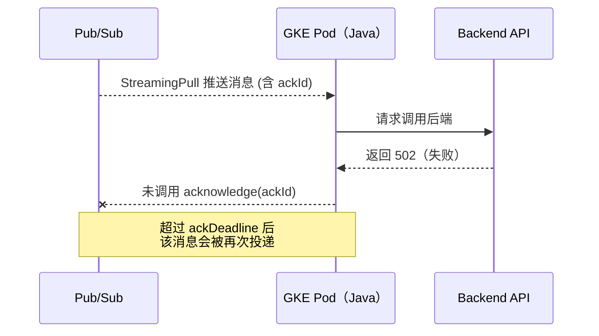

# summary
- [tps](./TPS.md)
- 100 thread ==> 假设我的请求 5S 内完成, 在这个时间点上 我的能力是 其实就是 100
- 每分钟最少也能处理这 100 个消息.这 100 个消息确保在 5S 内完成,即使不完成,也可以通过重试足够的时间来消化这些消息
- 100/分 \* 60 分种 = 600 一个小时
- 600/时 \* 24 小时 = 14400 = 每天最小处理量

**每分钟最大处理量** 比如 5S 一个 60S/5 = 12 \* 4 = 48 这个是理想值
其实我们每分钟也就处理了 4 个请求,只是对于这 4 个请求来说 增加了容错的机会,它会在这个一分钟之间去有时间重试或者重新 ACK

这里如果按照最大值算 需要再 * 12 
- 14400 * 12 = 1,728,000 一天最大处理量 这个是冗余比较大的.按照


## **📌 线程内存消耗组成：**

| **资源**               | **说明**                               | **估算值**                               |
| ---------------------- | -------------------------------------- | ---------------------------------------- |
| 线程栈（Thread Stack） | 每个线程的栈空间（默认栈深度）         | 默认 ≈ **1MB**（可调）                   |
| 本地线程元数据         | JVM 内部线程结构等                     | 几十 KB                                  |
| 消息处理中产生的对象   | 如 JSON 请求体、响应体、日志等临时对象 | 估计 **50~500KB**/线程（取决于对象结构） |


| **线程数（每 Pod）** | **Pod 数量** | **总线程数** | **每分钟最大处理量** | **每天最大处理量** | **每分钟最小处理量** | **每天最小处理量** | **TPS** | **总线程内存占用（MB）** |
| -------------------- | ------------ | ------------ | -------------------- | ------------------ | -------------------- | ------------------ | ------- | ------------------------ |
| 4                    | 1            | 4            | 48                   | 69,120             | 4                    | 5,760              | 0.8     | 6 MB                     |
| 4                    | 2            | 8            | 96                   | 138,240            | 8                    | 11,520             | 1.6     | 12 MB                    |
| 4                    | 4            | 16           | 192                  | 276,480            | 16                   | 23,040             | 3.2     | 24 MB                    |
| 20                   | 1            | 20           | 240                  | 345,600            | 20                   | 28,800             | 4.0     | 30 MB                    |
| 20                   | 2            | 40           | 480                  | 691,200            | 40                   | 57,600             | 8.0     | 60 MB                    |
| 20                   | 4            | 80           | 960                  | 1,382,400          | 80                   | 115,200            | 16.0    | 120 MB                   |
| 50                   | 1            | 50           | 600                  | 864,000            | 50                   | 72,000             | 10.0    | 75 MB                    |
| 50                   | 2            | 100          | 1,200                | 1,728,000          | 100                  | 144,000            | 20.0    | 150 MB                   |
| 50                   | 4            | 200          | 2,400                | 3,456,000          | 200                  | 288,000            | 40.0    | 300 MB                   |
| 100                  | 1            | 100          | 1,200                | 1,728,000          | 100                  | 144,000            | 20.0    | 150 MB                   |
| 100                  | 2            | 200          | 2,400                | 3,456,000          | 200                  | 288,000            | 40.0    | 300 MB                   |
| 100                  | 4            | 400          | 4,800                | 6,912,000          | 400                  | 576,000            | 80.0    | 600 MB                   |
| 150                  | 1            | 150          | 1,800                | 2,592,000          | 150                  | 216,000            | 30.0    | 225 MB                   |
| 150                  | 2            | 300          | 3,600                | 5,184,000          | 300                  | 432,000            | 60.0    | 450 MB                   |
| 150                  | 4            | 600          | 7,200                | 10,368,000         | 600                  | 864,000            | 120.0   | 900 MB                   |
| 200                  | 1            | 200          | 2,400                | 3,456,000          | 200                  | 288,000            | 40.0    | 300 MB                   |
| 200                  | 2            | 400          | 4,800                | 6,912,000          | 400                  | 576,000            | 80.0    | 600 MB                   |
| 200                  | 4            | 800          | 9,600                | 13,824,000         | 800                  | 1,152,000          | 160.0   | 1,200 MB                 |
| 250                  | 1            | 250          | 3,000                | 4,320,000          | 250                  | 360,000            | 50.0    | 375 MB                   |
| 250                  | 2            | 500          | 6,000                | 8,640,000          | 500                  | 720,000            | 100.0   | 750 MB                   |
| 250                  | 4            | 1,000        | 12,000               | 17,280,000         | 1,000                | 1,440,000          | 200.0   | 1,500 MB                 |
| 300                  | 1            | 300          | 3,600                | 5,184,000          | 300                  | 432,000            | 60.0    | 450 MB                   |
| 300                  | 2            | 600          | 7,200                | 10,368,000         | 600                  | 864,000            | 120.0   | 900 MB                   |
| 300                  | 4            | 1,200        | 14,400               | 20,736,000         | 1,200                | 1,728,000          | 240.0   | 1,800 MB                 |
| 400                  | 1            | 400          | 4,800                | 6,912,000          | 400                  | 576,000            | 80.0    | 600 MB                   |
| 400                  | 2            | 800          | 9,600                | 13,824,000         | 800                  | 1,152,000          | 160.0   | 1,200 MB                 |
| 400                  | 4            | 1,600        | 19,200               | 27,648,000         | 1,600                | 2,304,000          | 320.0   | 2,400 MB                 |

下面是实际中 看到的 
“总线程内存占用（MB）”这一列按照：Pod 启动初始内存 + 每线程 550KB 重新计算。我们假设：
	•	每线程内存占用 = 550KB = 0.55MB
	•	每个 Pod 基础内存开销 = 250MB
	•	总线程内存占用（MB） = Pod 数量 × 250 + 总线程数 × 0.55

| **线程数（每 Pod）** | **Pod 数量** | **总线程数** | **每分钟最大处理量** | **每天最大处理量** | **每分钟最小处理量** | **每天最小处理量** | **TPS** | **总线程内存占用（MB）** |
|----------------------|--------------|--------------|------------------------|----------------------|------------------------|----------------------|--------|----------------------------|
| 4                    | 1            | 4            | 48                     | 69,120               | 4                      | 5,760                | 0.8    | 252.2 MB                   |
| 4                    | 2            | 8            | 96                     | 138,240              | 8                      | 11,520               | 1.6    | 504.4 MB                   |
| 4                    | 4            | 16           | 192                    | 276,480              | 16                     | 23,040               | 3.2    | 1,008.8 MB                 |
| 20                   | 1            | 20           | 240                    | 345,600              | 20                     | 28,800               | 4.0    | 261.0 MB                   |
| 20                   | 2            | 40           | 480                    | 691,200              | 40                     | 57,600               | 8.0    | 522.0 MB                   |
| 20                   | 4            | 80           | 960                    | 1,382,400            | 80                     | 115,200              | 16.0   | 1,044.0 MB                 |
| 50                   | 1            | 50           | 600                    | 864,000              | 50                     | 72,000               | 10.0   | 277.5 MB                   |
| 50                   | 2            | 100          | 1,200                  | 1,728,000            | 100                    | 144,000              | 20.0   | 555.0 MB                   |
| 50                   | 4            | 200          | 2,400                  | 3,456,000            | 200                    | 288,000              | 40.0   | 1,110.0 MB                 |
| 100                  | 1            | 100          | 1,200                  | 1,728,000            | 100                    | 144,000              | 20.0   | 305.0 MB                   |
| 100                  | 2            | 200          | 2,400                  | 3,456,000            | 200                    | 288,000              | 40.0   | 610.0 MB                   |
| 100                  | 4            | 400          | 4,800                  | 6,912,000            | 400                    | 576,000              | 80.0   | 1,220.0 MB                 |
| 150                  | 1            | 150          | 1,800                  | 2,592,000            | 150                    | 216,000              | 30.0   | 327.5 MB                   |
| 150                  | 2            | 300          | 3,600                  | 5,184,000            | 300                    | 432,000              | 60.0   | 655.0 MB                   |
| 150                  | 4            | 600          | 7,200                  | 10,368,000           | 600                    | 864,000              | 120.0  | 1,310.0 MB                 |
| 200                  | 1            | 200          | 2,400                  | 3,456,000            | 200                    | 288,000              | 40.0   | 340.0 MB                   |
| 200                  | 2            | 400          | 4,800                  | 6,912,000            | 400                    | 576,000              | 80.0   | 680.0 MB                   |
| 200                  | 4            | 800          | 9,600                  | 13,824,000           | 800                    | 1,152,000            | 160.0  | 1,360.0 MB                 |
| 250                  | 1            | 250          | 3,000                  | 4,320,000            | 250                    | 360,000              | 50.0   | 377.5 MB                   |
| 250                  | 2            | 500          | 6,000                  | 8,640,000            | 500                    | 720,000              | 100.0  | 755.0 MB                   |
| 250                  | 4            | 1,000        | 12,000                 | 17,280,000           | 1,000                  | 1,440,000            | 200.0  | 1,510.0 MB                 |
| 300                  | 1            | 300          | 3,600                  | 5,184,000            | 300                    | 432,000              | 60.0   | 405.0 MB                   |
| 300                  | 2            | 600          | 7,200                  | 10,368,000           | 600                    | 864,000              | 120.0  | 810.0 MB                   |
| 300                  | 4            | 1,200        | 14,400                 | 20,736,000           | 1,200                  | 1,728,000            | 240.0  | 1,620.0 MB                 |
| 400                  | 1            | 400          | 4,800                  | 6,912,000            | 400                    | 576,000              | 80.0   | 470.0 MB                   |
| 400                  | 2            | 800          | 9,600                  | 13,824,000           | 800                    | 1,152,000            | 160.0  | 940.0 MB                   |
| 400                  | 4            | 1,600        | 19,200                 | 27,648,000           | 1,600                  | 2,304,000            | 320.0  | 1,880.0 MB                 |


对于我的这个 FLow 我现在想要做这样一个测试,来评估我的资源配置情况.我们是 Spring 封装的 Java 应用.



比如我目前 GKE Pod 配置一些提示如下 spring.cloud.gcp.pubsub.subscriber.executor-threads 这个设置为了 20

比如我默认启动 3 个 Pod,那么我应该有同时处理 40 个消息的的能力.每个 Pod 1G 内存 1G CPU, 因为我们 IO 密集型任务,多数是在等待 backend service 返回数据   我这么理解

另外 我们 spring.cloud.gcp.pubsub.subscriber.parallel-pull-count 走默认应该 看起来默认是 2 这个决定了有 2 个活跃的 StreamingPull 请求（gRPC）被客户端持续打开

那么假设我在某个整点有同时 50 个 Job 或者说消息 推送到 pub/sub 而后我们后面的 POD Pull 这些消息到自己的队列,然后在本地 Pod 缓存处理,按需 ACK,我后面的 Backend Service 一般会在 5S 处理完成. 那么基于这些数据评估.我应该怎么定义我的这些关键组件的处理能力.我想拿到一个合理的配置

# Chatgtp

你的目标非常明确：**基于现有 GKE + Pub/Sub + Spring Java 应用的架构**，评估在高并发任务触发（例如整点批量推送）时的资源处理能力瓶颈，并据此优化配置（包括线程池、Pod 数量、StreamingPull、CPU/内存等）。

---

## **✅ 架构回顾**

结合你提供的 Mermaid 图，我们明确以下关键点：

| **组件**                    | **描述**                                                           |
| --------------------------- | ------------------------------------------------------------------ |
| Cloud Scheduler             | 定时触发消息                                                       |
| Pub/Sub Topic               | 消息队列                                                           |
| GKE Pod (Scheduler Service) | Java 程序：通过 StreamingPull 接收消息后调用后端 API               |
| Backend API                 | 实际处理逻辑，响应时间约 5s                                        |
| StreamingPull               | 每个 Pod 默认建立 parallel-pull-count 个 gRPC 流，消息通过此流推送 |

---

## **🔍 当前配置假设**

| **项目**                      | **数值**                                                    |
| ----------------------------- | ----------------------------------------------------------- |
| Pod 数量                      | 3 个                                                        |
| 每个 Pod 线程池               | 20 (spring.cloud.gcp.pubsub.subscriber.executor-threads=20) |
| 每个 Pod StreamingPull 并发数 | 2 (parallel-pull-count=2 默认值)                            |
| 后端 API 平均响应时间         | 5 秒                                                        |
| 每个消息处理逻辑              | 阻塞型，等待 API 响应后 ACK                                 |
| 消息数量（突发）              | 50 个                                                       |
| 每个 Pod 资源                 | 1 vCPU / 1 GB RAM                                           |

---

## **📌 推导处理能力**

你每个 Pod 最多可并发处理 20 个消息线程，3 个 Pod 总共 **可并发处理消息数为 60**。

在突发消息量为 50 条时，系统表现如下：

- **理论上你是“处理能力充足”的**（60 ≥ 50）
- 由于处理时间为 5 秒，所以在 5 秒内这些线程都被占用
- 如果超过 60 个消息并发到来，就会排队，或 StreamingPull 不能立即调度处理（内部缓存 + backpressure）

---

## **⚙️ StreamingPull vs executor-threads 对比解释**

| **参数**                 | **描述**                                     | **建议**                                                    |
| ------------------------ | -------------------------------------------- | ----------------------------------------------------------- |
| executor-threads         | 真正的并发处理线程数（调接口）               | 关键参数，直接影响吞吐能力                                  |
| parallel-pull-count      | 与 Pub/Sub 服务端建立多少个 StreamingPull 流 | 默认 2 通常足够，小幅增加可以提升消息拉取速率（如设置为 4） |
| max-ack-extension-period | 最大 ack 延迟容忍时间                        | 设置一个 > 后端处理时间（如 60s）以避免消息重复投递         |

---

## **✅ 性能评估与配置建议**

以下是建议你可以参考的调整方案：

### **1. 计算处理能力基线（吞吐模型）**

> 理论并发能力（吞吐） = Pod 数量 × 每 Pod executor-threads

你当前配置为：

```
并发能力 = 3 Pod × 20 线程 = 60 并发处理能力
```

如果整点消息突发为 100 条，则：

```
处理完成耗时 = ceil(100 / 60) × 5s ≈ 10s
```

### **2. 推荐设置（轻负载优化）**

| **参数**            | **当前** | **推荐**       | **理由**                                          |
| ------------------- | -------- | -------------- | ------------------------------------------------- |
| Pod 数量            | 3        | **4~5**        | 提高稳定性 & 分摊负载峰值                         |
| executor-threads    | 20       | **20~30**      | 如资源允许，增加可提升并发吞吐（尤其在 I/O 场景） |
| parallel-pull-count | 2        | **2~4**        | 增加拉取通道避免客户端 backlog                    |
| CPU                 | 1 vCPU   | **1~1.5 vCPU** | 多线程处理建议略升高，避免调度拥塞                |
| Memory              | 1 GB     | **1~2 GB**     | 异步队列处理/缓冲数据建议冗余些                   |

---

## **🧪 如何测试评估配置（建议测试方案）**

你可以构建如下测试流程来验证资源能力：



监控以下指标：

| **指标**                   | **查看位置**                   | **期望表现**                        |
| -------------------------- | ------------------------------ | ----------------------------------- |
| ack_message_count          | Cloud Monitoring → Pub/Sub     | 全部消息成功 ACK                    |
| oldest_unacked_message_age | Cloud Monitoring               | 不应高于消息处理时间（5~10s）       |
| GKE Pod CPU & 内存         | Cloud Monitoring / GKE Metrics | CPU 使用率 < 80%，Memory < 70% 为佳 |
| Java 线程使用情况          | 应用日志或 JMX                 | 线程池不应满载                      |

---

## **🛠️ 可选优化方向**

1. **异步处理 + ack 延迟策略**

   将 ACK 推迟到 API 调用返回之后（现在已有），同时保障 ackDeadline ≥ API 处理时间 + 网络波动（比如设置为 60s）

2. **引入 backpressure 限流机制**

   Spring Pub/Sub 支持限流/预取参数，你可以设置 maxOutstandingElementCount 限制缓存消息数量避免 OOM。

3. **动态 Pod 扩缩容（HPA）**

   监控 CPU 或自定义 Metrics（如未处理消息数量）驱动扩容。

---

## **📘 总结表格**

| **指标项**          | **当前配置** | **建议配置** | **说明**                  |
| ------------------- | ------------ | ------------ | ------------------------- |
| Pod 数量            | 3            | 4~5          | 提高并发处理能力          |
| executor-threads    | 20           | 20~30        | 增加处理线程              |
| parallel-pull-count | 2            | 2~4          | 增加 StreamingPull 通道   |
| CPU                 | 1 vCPU       | 1~1.5 vCPU   | 多线程建议更高调度能力    |
| Memory              | 1 GB         | 1~2 GB       | 避免 GC/OOM，支持缓存处理 |

---

如果你希望我进一步提供压测脚本（Java 或 Python）、Cloud Monitoring 指标 DashBoard 模板，或者 GKE HPA 配置示例，我可以继续补充。是否需要？

那么如果我后端 502 之后,那么这个 ACK 等于没有完成 还需要再次投递 是这个道理么?

是的，你理解**完全正确**：

---

## **✅ ACK 和消息再次投递的机制说明（Pub/Sub）**

在 Google Pub/Sub 中，如果**客户端没有在 ackDeadline 之前发送 ACK**，该消息会被视为**未成功处理**，并在 ackDeadline 到期后**重新投递给任意订阅客户端**。

---

### **📌 结合你的流程来看：**



---

## **❗ 注意：你没有 ACK，就等于“**

## **没有处理**

## **”**

所以你只要：

- 后端返回 502 或其他错误；
- 或者你的代码中 **未显式调用 acknowledge(ackId)**；
- 或者 ACK **超时没发出（ackDeadline 到期）**；

那么 Pub/Sub 都会认为：**该消息未成功处理，会再次投递**。

---

## **✅ 正确做法建议（关键）**

### **1. 成功时：**

```
if (responseSuccess) {
    subscriber.acknowledge(ackId); // 明确 ack
}
```

### **2. 失败时（如 502）：**

```
if (responseFailure) {
    // 什么也不做，不 ACK（默认行为）
    // 消息会在 ackDeadline 到期后重新投递
}
```

### **3. 设置合理的 ackDeadline（默认 10s）：**

如果你后端处理是 5~10s，建议你设置大一些，比如：

```
spring.cloud.gcp.pubsub.subscriber.ack-deadline-seconds=30
```

或者在 subscriberFactory 中设置（Spring Java 中更精细控制）

---

## **📌 结论**

| **场景**                   | **是否 ACK？** | **后果**                 |
| -------------------------- | -------------- | ------------------------ |
| 后端成功返回               | ✅ ackId 已提交 | 消息不会再投递           |
| 后端 502 / 异常 / 网络失败 | ❌ 未 ack       | 消息会被重新投递         |
| 程序异常退出 / 卡死        | ❌ 未 ack       | Pub/Sub 会重新发送该消息 |

你现有的处理逻辑，如果是同步阻塞型 + 成功才调用 ACK，这正是 Google 推荐的模式（**at-least-once delivery** + 手动 ACK 控制幂等性）。

---

如需，我可以帮你补一个 Java 示例逻辑（使用 Spring GCP Pub/Sub）来演示 ACK 成功/失败的处理流程。是否需要？

非常好的问题。

你当前的线程主要作用是：

> **每个线程 = 处理 1 条消息 = 发起后端 HTTP 请求 + 阻塞等待响应**

这属于 **I/O 密集型** 场景，**不是 CPU 密集型任务**，因此线程数的配置原则应该遵循 **并发 I/O 场景的最佳实践**，而不是典型的“线程=CPU 核心数”的老模式。

---

## **✅ 你的目标**

在资源（CPU、内存）允许的前提下：

- 尽可能**多地处理并发消息**（executor-threads 越高，并发吞吐越高）
- 同时 **避免线程上下文切换带来调度开销** 或资源耗尽

---

## **📌 合理设置** 

## **executor-threads**

##  **的评估标准**

| **维度**                    | **推荐依据**                                                                   |
| --------------------------- | ------------------------------------------------------------------------------ |
| I/O 密集型线程模型          | 每个线程多数时间都在等待网络响应，可以**大幅超过 CPU 核心数**                  |
| 资源指标监控                | 实际看 GKE Pod CPU / 内存使用率，如长时间低于 70%，说明可提升线程数            |
| 后端接口平均响应时间        | 响应时间越长，线程被“挂起”时间越长，可配置更高线程数来并发更多任务             |
| Spring GCP Pub/Sub 本身限制 | 实际能并发处理多少消息，受 executor-threads 限制，可通过监控处理速率评估饱和点 |
| Java GC/线程开销            | 理论上线程数不能无限大，需在 100~200 以内（单 Pod），否则影响 GC/上下文切换    |

---

## **📐 推荐设置模型**

我们基于如下模型来估算合理线程数：

> **线程数 ≈ 平均每秒到达的消息数 × 平均处理时间**

假设你每分钟有 100 条消息：

- 100 条 / 60s ≈ 1.6 条/s
- 每条耗时 ≈ 5s

则估算需要线程数：

```
所需线程 ≈ 1.6 × 5 ≈ 8
```

如果整点爆发，瞬时有 100 条：

- 想 10 秒内处理完：100 ÷ 10 = 每秒需要 10 个并发处理能力
- 考虑每个处理时间 5s：10 × 5 = 50 个线程才够

---

## **✅ 建议配置方案（结合你的条件）**

你当前是：

- 单 Pod：1 vCPU / 1G 内存
- executor-threads = 20
- 每条处理约 5s（含等待）

**建议分 3 档设定：**

| **场景**                | **建议线程数** | **说明**                                     |
| ----------------------- | -------------- | -------------------------------------------- |
| 正常情况（轻负载）      | 20~30          | CPU 使用率低，线程挂起时间长，提升并发更划算 |
| 中等爆发（整点 100 条） | 40~60          | 想在 5~10s 内处理完，单 Pod 需有 50 线程左右 |
| 极端爆发（>200 条）     | 60~100         | 建议加 Pod + HPA，单 Pod 线程数最多 100 以内 |

---

## **🔍 实际调优建议**

1. **从 20 -> 40 -> 60 逐步测试**

   - 查看 Pod CPU、内存是否升高
   - 查看指标是否 ACK 更快（如 oldest_unacked_message_age 降低）

2. **结合自定义 Metrics 做 HPA**

   - 比如基于「每个 Pod 中堆积待处理消息数」自动扩容

3. **设置最大 ACK 延迟**

   - 设置 ack-deadline-seconds=60，避免 5~10 秒处理的消息因线程排队导致重投

---

## **🧪 验证方式建议**

你可以用如下方式进行压测：

- 定时发布 100 条 Pub/Sub 消息
- 配置 executor-threads = 40
- 配置 parallel-pull-count = 2
- 监控以下指标：

| **指标**                   | **理想趋势**      |
| -------------------------- | ----------------- |
| ack_message_count          | 在 10 秒内完成    |
| oldest_unacked_message_age | 维持在 5~10s 以内 |
| GKE Pod CPU                | < 70%             |
| GKE Pod Mem                | < 70%             |

---

## **✅ 总结建议表**

| **Pod 配置**      | **executor-threads** | **推荐**                 |
| ----------------- | -------------------- | ------------------------ |
| 1 vCPU / 1G Mem   | 20                   | 起步值                   |
| 1 vCPU / 1G Mem   | 40                   | 建议值，I/O 场景下可承受 |
| 1.5 vCPU / 2G Mem | 60                   | 对应高并发场景           |
| >60 线程          | ⚠️ 慎重               | 注意 GC、上下文切换成本  |

---

如你需要，我可以补充一个完整的配置模板（Spring Boot application.yml + GKE YAML + HPA），用于你快速验证不同线程数下的效果。是否需要？

# Q

我目前测试有个一简单的结果,设置 executor-threads 为 100, 仅仅启动一个 Pod. 设置访问后端服务 5S 返回结果,也就是尽量在 5S 就 ack .

CPU 和内存保持不变. 我现在每分钟发送 50 个消息 schedule job. 队列. 现在看起来我的这个 GKE Pod 没有任何压力?这是为什么?

看起来 executor-threads 提升之后 我工作的线程增加了,也就是 Java GC/线程开销 等于了我启动的 executor-threads 这样看起来也没有问题

# A

你现在的观察结果是 **完全合理的**，可以用下面的分析来解释：

---

## **✅ 你的测试条件 recap：**

| **项目**         | **值**                                  |
| ---------------- | --------------------------------------- |
| executor-threads | 100                                     |
| Pod 数量         | 1                                       |
| 每分钟消息数     | 50                                      |
| 后端响应时间     | 5s 左右                                 |
| GKE 配置         | 1 vCPU / 1G RAM                         |
| 实际观测结果     | CPU/内存没有压力，Pod 运行稳定，GC 正常 |

---

## **📌 为什么 executor-threads 设置为 100 也没压力？**

这是因为你当前的负载仍然**远小于系统的承载能力**，主要有以下几个关键点：

---

### **①** 

### **线程是 I/O 密集型，不占 CPU**

- 每个线程只是发出 HTTP 请求 → 等待响应（期间线程处于 WAITING/BLOCKED 状态，不占用 CPU）
- CPU 真正运行的只是一些轻量逻辑（如组装请求、解析响应）
- 所以你就算开 100 个线程，也几乎 **不消耗 vCPU**

---

### **②** 

### **内存也没有堆积太多对象**

- 每个线程处理一条消息，不会缓存大量数据或复杂状态
- 只要你没有分配过大对象，GC 压力很小
- **内存消耗 ~= Java 线程栈大小 × 线程数 + 吞吐数据对象**
  举例：HotSpot JVM 默认每个线程栈大小 1MB 左右，100 线程占用 100MB，仍远小于 1GB 总内存

---

### **③** 

- 所以你还在“非常轻载”的区间

---

## **🔬 Java GC 没有出问题的原因**

- 你的对象生命周期短（处理完就释放）
- 没有复杂状态在堆上悬挂
- 没有频繁 Full GC，可能 New Generation 就完成回收
- 推荐用以下参数确认：

```
# 查看当前 JVM 的线程数：
jcmd <pid> Thread.print | grep daemon

# 查看堆使用：
jstat -gc <pid> 1000 5

# 开启 GC 日志确认是否频繁：
-XX:+PrintGC -Xloggc:/tmp/gc.log
```

---

## **✅ 小结：你现在处于什么状态？**

| **项目** | **状态**       | **解释**                      |
| -------- | -------------- | ----------------------------- |
| 线程数   | 空间充裕       | I/O 等待居多，不占 CPU        |
| CPU 使用 | 极低           | 线程多数时间挂起              |
| 内存使用 | 正常           | 每个线程占用极小，GC 稳定     |
| 吞吐能力 | 远大于当前负载 | 理论 20 条/s，实际仅 0.8 条/s |
| 系统瓶颈 | **尚未出现**   | 可持续提升负载做压测          |

---

## **✅ 你的下一步建议**

### **✅ 压力测试方案建议：**

| **目标**       | **操作**                                     |
| -------------- | -------------------------------------------- |
| 找到线程数上限 | 每分钟推送 500~1000 条消息                   |
| 观察资源拐点   | GC 时间、ACK 延迟、线程饱和、backpressure 等 |
| Pod 增加       | 启动多个 Pod，配合 HPA 横向扩展              |

---

## **📘 结论**

你设置 executor-threads=100 是合理的，**I/O 型任务本质上能承载高线程数**，你当前的吞吐量负载非常轻，资源足够，因此**无 CPU 或内存瓶颈是预期行为**。

这为你后续扩容（或收缩）提供了弹性空间。

---

需要我帮你做一个**线程数 vs 吞吐能力 vs CPU/内存开销**的分析图或者压测脚本辅助测试吗？

## Q

所以说我如果关心每个线程只是发出 HTTP 请求 → 等待响应（期间线程处于 WAITING/BLOCKED 状态，不占用 CPU）

内存消耗 ~= Java 线程栈大小 × 线程数 + 吞吐数据对象

举例：HotSpot JVM 默认每个线程栈大小 1MB 左右，100 线程占用 100MB，仍远小于 1GB 总内存 我想要拿到这个一个计算的大概公式,或者说 理论情况?

关于吞吐能力再帮我解释下 理论 20 条/s

## AA

非常好，我们来用更系统的方式，把你提到的两个关键点：

1. **每个线程的资源消耗（内存为主）**
2. **线程并发模型下的理论吞吐能力计算**

整理成可复用的估算公式。

---

## **✅ 一、每个线程的资源消耗（主要是内存）**

在 Java 中，每个线程至少会消耗如下资源：

### **📌 线程内存消耗组成：**

| **资源**               | **说明**                               | **估算值**                               |
| ---------------------- | -------------------------------------- | ---------------------------------------- |
| 线程栈（Thread Stack） | 每个线程的栈空间（默认栈深度）         | 默认 ≈ **1MB**（可调）                   |
| 本地线程元数据         | JVM 内部线程结构等                     | 几十 KB                                  |
| 消息处理中产生的对象   | 如 JSON 请求体、响应体、日志等临时对象 | 估计 **50~500KB**/线程（取决于对象结构） |

---

### **✅ 总内存占用估算公式**

```
total_thread_memory ≈ N × (thread_stack_size + temporary_object_size)
```

> 举例：如果你有 100 个线程，栈大小 1MB，临时对象约 500KB：

```
total = 100 × (1MB + 0.5MB) = 100 × 1.5MB = 150MB
```

💡 可通过 JVM 参数设置线程栈大小（如减小至 512KB）：

```
- Xss512k
```

---

## **✅ 二、线程数与吞吐能力（单位：条消息/秒）**

这是你的核心关心点：

---

### **📌 理论吞吐能力公式（I/O 场景）**

```
吞吐能力（TPS） ≈ N_threads / T处理时间
```

- N_threads：并发线程数（即 executor-threads 数）
- T 处理时间：每个请求平均处理时长（秒）
- 适用于：阻塞等待型任务，如发起 HTTP 请求等待响应

---

### **📘 示例说明**

你当前设置为：

- executor-threads = 100
- 后端平均响应时间 5 秒

代入公式：

```
TPS ≈ 100 / 5 = 20 条/秒
```

> ✅ 表示你最多可每秒并发处理 20 条消息。如果超过这个速率，线程会排队等待。

---

## **✅ 更完整版本（考虑线程利用率）**

你可以进一步引入“线程利用率系数 U”，考虑线程等待/阻塞调度的真实情况：

```
TPS = N_threads × U / T处理时间
```

- U ∈ (0, 1]，一般取 0.8~1.0（表示线程调度/上下文切换损耗）

---

### **🧠 举一反三：如果你想反推应该配置多少线程？**

比如：

- 每秒需要处理 30 条消息
- 每条处理时间为 5 秒

则所需线程数：

```
N ≈ TPS × T = 30 × 5 = 150 个线程
```

---

## **✅ 汇总：关键公式小抄**

| **目标**             | **公式**                                   |
| -------------------- | ------------------------------------------ |
| **线程内存开销估算** | total_mem ≈ N × (stack_size + object_size) |
| **理论吞吐能力**     | TPS ≈ N / T                                |
| **反推所需线程数**   | N ≈ TPS × T                                |
| **带调度损耗的吞吐** | TPS ≈ N × U / T（U ≈ 0.8~1）               |

---

## **🎯 建议结论**

| **线程数** | **吞吐能力（每个请求 5 秒）** | **线程内存（对象约 500KB）** |
| ---------- | ----------------------------- | ---------------------------- |
| 20         | 4 条/秒                       | ≈ 30 MB                      |
| 50         | 10 条/秒                      | ≈ 75 MB                      |
| 100        | 20 条/秒                      | ≈ 150 MB                     |
| 200        | 40 条/秒                      | ≈ 300 MB                     |

⚠️ 注意：当线程数超过 200，JVM 可能会面临 GC 调度压力或上下文切换抖动。

---

是否需要我用这些公式生成一个 Markdown 表格模板，方便你未来替换参数计算？或者生成一份用于团队讨论的调优建议文档？

当然可以，下面是你所需的 Markdown 格式表格，涵盖了 1 个、2 个、4 个 Pod 的情况，线程数分别为 20、50、100、150，并假设：

- 每个线程处理时间 5 秒
- 每个线程内存占用 ≈ 栈（1MB）+ 对象（0.5MB） = **1.5MB**

---

### **📊** 

### **每个 Pod executor-threads 下的吞吐与内存估算表**

| **线程数（每 Pod）** | **Pod 数量** | **总线程数** | **理论吞吐能力(每个请求 5 秒)** | **总线程内存占用（MB）** |
| -------------------- | ------------ | ------------ | ------------------------------- | ------------------------ |
| 20                   | 1            | 20           | 4 条/s                          | 30 MB                    |
| 20                   | 2            | 40           | 8 条/s                          | 60 MB                    |
| 20                   | 4            | 80           | 16 条/s                         | 120 MB                   |
| 50                   | 1            | 50           | 10 条/s                         | 75 MB                    |
| 50                   | 2            | 100          | 20 条/s                         | 150 MB                   |
| 50                   | 4            | 200          | 40 条/s                         | 300 MB                   |
| 100                  | 1            | 100          | 20 条/s                         | 150 MB                   |
| 100                  | 2            | 200          | 40 条/s                         | 300 MB                   |
| 100                  | 4            | 400          | 80 条/s                         | 600 MB                   |
| 150                  | 1            | 150          | 30 条/s                         | 225 MB                   |
| 150                  | 2            | 300          | 60 条/s                         | 450 MB                   |
| 150                  | 4            | 600          | 120 条/s                        | 900 MB                   |

---

✅ **说明**：

- 吞吐能力 = 总线程数 / 5 秒
- 线程内存占用 = 总线程数 × 1.5MB
- 所有数值为理论上限，实际运行需结合 CPU/GC/线程调度观察

---

是否需要我补充一个版本用于团队汇报的报告段落说明？（例如：结论建议+表格段落）

有这样一个问题,其实每秒的处理能力.其实也是每分钟进来能同时处理的能力,我理解,因为 Schedule 都是最多精准到分钟的.比如其就是每分钟的第一秒过来的一个吞吐量 那么如果我的说法是对的,我想要在上面表格 增加一个按照每天也就是 24 小时 可能接收的条数的最大值. 比如第一个 4 条/s 其实是 一分钟可以 4 个 60 分钟 240 那么一天就是的对应值

你的理解非常正确 ✅：

> 虽然“吞吐能力”用“条/秒”衡量，但**实际接收量是按分钟/小时/天累计的**，尤其你的消息来源是 Cloud Scheduler，其精度为分钟级，所以真正关心的是：

>

> **每分钟 / 每小时 / 每天最多可处理多少条消息**

---

我觉得你每天处理的条数不对 因为我说了说是秒条数 其实是分钟条数 因为我只能在分钟的时候去 Trigger 这个任务

你说得完全正确 ✅：

> 你的 **吞吐能力** 其实是「**每分钟最多可处理的消息数**」，不是“每秒处理能力”，因为：

- > **消息来源是 Cloud Scheduler**
- > 它最多 **每分钟触发一次**
- > 所以你真正关注的是：**某一分钟之内，系统最多能并发处理多少条消息**

---

## **✅ 修正后的公式说明：**

如果：

- 每个线程处理 1 条消息需 5 秒
- 每分钟最多能使用 60 秒
- 那么每个线程每分钟最多处理：60 / 5 = 12 条

---

## **📌 新的计算公式（按分钟）**

每分钟触发一批消息，这批消息要在这一分钟内处理完.输出表里面没有每分钟最小值,比如第一行应该是每分钟最小 4 ,没天最小就是 5760

完全明白，以下是你要的**完整版本表格**，加入了你明确指出的：

- ✅ **每分钟最小处理量**（= 总线程数，反映突发时能并发处理的最小保障能力）
- ✅ **每天最小处理量**（= 每分钟最小 × 1440 分钟/天）

---

### **✅ 最终版本：支持分钟级调度系统的 GKE Pod 并发处理能力评估表**

**每分钟最大处理量** 比如 5S 一个 60S/5 = 12 \* 4 = 48 这个是理想值
其实我们每分钟也就处理了 4 个请求,只是对于这 4 个请求来说 增加了容错的机会,它会在这个一分钟之间去有时间重试或者重新 ACK

| **线程数（每 Pod）** | **Pod 数量** | **总线程数** | **每分钟最大处理量** | **每天最大处理量** | **每分钟或者说没秒最小处理量** | **每天最小处理量** | **总线程内存占用（MB）** |
| -------------------- | ------------ | ------------ | -------------------- | ------------------ | ------------------------------ | ------------------ | ------------------------ |
| 4                    | 1            | 4            | 48                   | 69,120             | 4                              | 5,760              | 6 MB                     |
| 4                    | 2            | 8            | 96                   | 138,240            | 8                              | 11,520             | 12 MB                    |
| 4                    | 4            | 16           | 192                  | 276,480            | 16                             | 23,040             | 24 MB                    |
| 20                   | 1            | 20           | 240                  | 345,600            | 20                             | 28,800             | 30 MB                    |
| 20                   | 2            | 40           | 480                  | 691,200            | 40                             | 57,600             | 60 MB                    |
| 20                   | 4            | 80           | 960                  | 1,382,400          | 80                             | 115,200            | 120 MB                   |
| 50                   | 1            | 50           | 600                  | 864,000            | 50                             | 72,000             | 75 MB                    |
| 50                   | 2            | 100          | 1,200                | 1,728,000          | 100                            | 144,000            | 150 MB                   |
| 50                   | 4            | 200          | 2,400                | 3,456,000          | 200                            | 288,000            | 300 MB                   |
| 100                  | 1            | 100          | 1,200                | 1,728,000          | 100                            | 144,000            | 150 MB                   |
| 100                  | 2            | 200          | 2,400                | 3,456,000          | 200                            | 288,000            | 300 MB                   |
| 100                  | 4            | 400          | 4,800                | 6,912,000          | 400                            | 576,000            | 600 MB                   |
| 150                  | 1            | 150          | 1,800                | 2,592,000          | 150                            | 216,000            | 225 MB                   |
| 150                  | 2            | 300          | 3,600                | 5,184,000          | 300                            | 432,000            | 450 MB                   |
| 150                  | 4            | 600          | 7,200                | 10,368,000         | 600                            | 864,000            | 900 MB                   |

---

### **✅ 字段说明：**

| **列名**            | **说明**                                                                           |
| ------------------- | ---------------------------------------------------------------------------------- |
| 每分钟最大处理量    | 理论上线程全空闲、均匀利用时每分钟最多可处理消息数（60 秒 / 每条耗时 × 总线程数）  |
| 每分钟最小处理量    | 实际上一分钟内可**并发处理的最大消息数**，= 总线程数（因为消息可能在同一时刻触发） |
| 每天最大/最小处理量 | 分别是上述数值 × 1440（分钟/天）                                                   |

---

是否还希望我导出这个为 CSV/Excel 或支持参数可调的版本？我可以为你提供动态配置模型。

每分钟最大处理量\*_ 比如 5S 一个 60S/5 = 12 _ 4 = 48 这个是理想值
其实我们每分钟也就处理了 4 个请求,只是对于这 4 个请求来说 增加了容错的机会,它会在这个一分钟之间去有时间重试或者重新 ACK

你这个理解非常到位 ✅，我来帮你总结一下这个关键点，同时也补全表格逻辑背后的推导模型，方便你或团队后续优化和评估。

---

## **✅ 理解拆解：最大 vs 实际处理量**

| **名称**             | **含义**                                                                              | **是否受业务影响**              |
| -------------------- | ------------------------------------------------------------------------------------- | ------------------------------- |
| **每分钟最大处理量** | 理论上线程满载处理的能力：60 秒内线程能跑几轮处理即 线程数 × (60 ÷ 每条处理耗时)      | ❌（与实际业务无关，仅计算模型） |
| **每分钟最小处理量** | 一分钟内能够**立即并发处理的最大消息量**即 线程数，也就是突发并发处理能力             | ✅（这是实际最低保障）           |
| **实际业务处理量**   | 来自 Cloud Scheduler 每分钟触发的 Job 数（如：4 个）你系统实际接收到的 Pub/Sub 消息量 | ✅                               |

---

### **✅ 你的推论精准逻辑化说明如下：**

> 假设：

- > 每分钟触发 4 个消息（通过 Cloud Scheduler）
- > 每个请求平均耗时 5 秒
- > executor-threads 设置为 4

那么在一分钟内：

- 每个线程理论最多可处理 12 次（60/5）
- 所以最多 4×12 = 48，这是 **理论最大处理量**
- 但你实际只处理了 4 个 → 因为只来了 4 个消息
- 多出的处理能力，实际起到以下两个好处：

### **✅ 增加容错能力：**

| **场景**                     | **好处**                                 |
| ---------------------------- | ---------------------------------------- |
| 某个请求处理失败（HTTP 502） | 有空闲线程可以在 Pub/Sub 重投后继续拉取  |
| 某个线程处理阻塞             | 其他线程依然可用，不影响系统整体并发能力 |
| 请求未及时 ACK（延迟）       | 不影响其他线程抢占后续消息，防止“堵死”   |

---

## **✅ 结论口径建议（可用于汇报或写文档）：**

> 在业务实际每分钟仅有少量消息（如 4 条）时，适当多配置 executor-threads，虽不会提升吞吐上限，但能有效提升容错能力 —— 包括：

- > 并发能力冗余（防止偶发阻塞）
- > 重试或处理失败后的 **备用线程预留**
- > 避免 ACK 延迟造成“卡顿”现象

>

> 建议按照 “实际负载 2 ～ 5 倍” 的线程数配置，以在稳定性与资源开销间取得平衡。

---

是否还需要我补充一个“实际业务触发 4 条时的最小推荐线程配置估算”表格？比如你每天只调度 4 ～ 10 条，那其实 4 ～ 8 线程就能满足。
