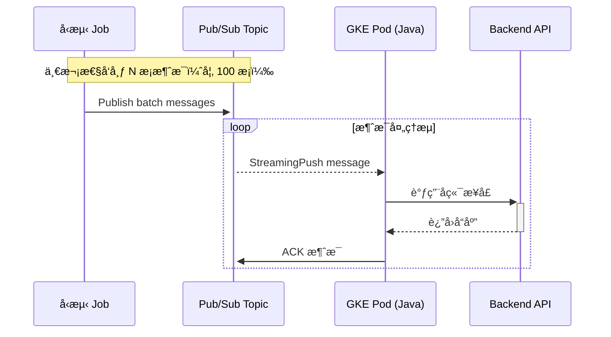

对äºæˆ‘的这个 FLow 我ç°åœ¨æƒ³è¦åšè¿™æ ·ä¸€ä¸ªæµ‹è¯•,æ¥è¯„估我的资æºé…置情况.我们是 Spring å°è£…çš„ Java 应用.

```mermaid

sequenceDiagram

    %% 上层业务æµç¨‹

    participant CS as Cloud Scheduler

    participant PS as Pub/Sub Topic

    participant SS as GKE Pod<br/>(Scheduler Service)

    participant API as Backend API


    Note over CS,PS: 定时任务触å‘

    CS->>+PS: Publish message


    Note over SS,PS: GKE Pod 使用 gRPC StreamingPull 拉å–消æ¯


    %% 内部 StreamingPull æµç¨‹ä½œä¸ºå­å›¾å±•å¼€

    rect rgb(240, 240, 255)

        participant SS as GKE Pod<br/>(Subscriber Client)

        participant GRPC as Pub/Sub Server<br/>(StreamingPull)


        SS->>+GRPC: 建立 gRPC StreamingPull è¿æ¥

        loop æŒç»­æ¶ˆæ¯æµ

            GRPC-->>SS: stream message<br/>+ ackId

            SS->>GRPC: acknowledge(ackId)

            SS->>+API: 调用å端 API（åŒæ­¥å¤„ç†<br/>阻å¡å½“å‰çº¿ç¨‹ï¼‰

            API-->>-SS: Response（收到å释放线程）

        end

    end

```

æ¯”å¦‚æˆ‘ç›®å‰ GKE Pod é…置一些æ示如下 spring.cloud.gcp.pubsub.subscriber.executor-threads 这个设置为了 20

比如我默认å¯åŠ¨ 3 个 Pod,那么我应该有åŒæ—¶å¤„ç† 40 个消æ¯çš„的能力.æ¯ä¸ª Pod 1G 内存 1G CPU, 因为我们 IO 密集å‹ä»»åŠ¡,多数是在等待 backend service è¿”å›æ•°æ®   我这么ç†è§£

å¦å¤– 我们 spring.cloud.gcp.pubsub.subscriber.parallel-pull-count 走默认应该 看起æ¥é»˜è®¤æ˜¯ 2 这个决定了有 2 个活跃的 StreamingPull 请求（gRPC）被客户端æŒç»­æ‰“å¼€

那么å‡è®¾æˆ‘在æŸä¸ªæ•´ç‚¹æœ‰åŒæ—¶ 50 个 Job æˆ–è€…è¯´æ¶ˆæ¯ æ¨é€åˆ° pub/sub 而å我们åé¢çš„ POD Pull 这些消æ¯åˆ°è‡ªå·±çš„队列,然å在本地 Pod 缓存处ç†,按需 ACK,我åé¢çš„ Backend Service 一般会在 5S 处ç†å®Œæˆ. 那么基äºè¿™äº›æ•°æ®è¯„ä¼°.我应该æ€ä¹ˆå®šä¹‰æˆ‘的这些关键组件的处ç†èƒ½åŠ›.我想拿到一个åˆç†çš„é…ç½®

# Chatgtp

你的目标é常æ˜ç¡®ï¼š**基äºç°æœ‰ GKE + Pub/Sub + Spring Java 应用的æ¶æ„**，评估在高并å‘任务触å‘（例如整点批é‡æ¨é€ï¼‰æ—¶çš„资æºå¤„ç†èƒ½åŠ›ç“¶é¢ˆï¼Œå¹¶æ®æ­¤ä¼˜åŒ–é…置（包括线程池ã€Pod æ•°é‡ã€StreamingPullã€CPU/内存等）。

---

## **✅ æ¶æ„å›é¡¾**

结åˆä½ æ供的 Mermaid 图，我们æ˜ç¡®ä»¥ä¸‹å…³é”®ç‚¹ï¼š

| **组件**                    | **æè¿°**                                                           |
| --------------------------- | ------------------------------------------------------------------ |
| Cloud Scheduler             | 定时触å‘æ¶ˆæ¯                                                       |
| Pub/Sub Topic               | 消æ¯é˜Ÿåˆ—                                                           |
| GKE Pod (Scheduler Service) | Java 程åºï¼šé€šè¿‡ StreamingPull æ¥æ”¶æ¶ˆæ¯å调用å端 API               |
| Backend API                 | å®é™…处ç†é€»è¾‘，å“应时间约 5s                                        |
| StreamingPull               | æ¯ä¸ª Pod 默认建立 parallel-pull-count 个 gRPC æµï¼Œæ¶ˆæ¯é€šè¿‡æ­¤æµæ¨é€ |

---

## **🔠当å‰é…ç½®å‡è®¾**

| **项目**                      | **数值**                                                    |
| ----------------------------- | ----------------------------------------------------------- |
| Pod æ•°é‡                      | 3 个                                                        |
| æ¯ä¸ª Pod 线程池               | 20 (spring.cloud.gcp.pubsub.subscriber.executor-threads=20) |
| æ¯ä¸ª Pod StreamingPull 并å‘æ•° | 2 (parallel-pull-count=2 默认值)                            |
| å端 API å¹³å‡å“应时间         | 5 秒                                                        |
| æ¯ä¸ªæ¶ˆæ¯å¤„ç†é€»è¾‘              | 阻å¡å‹ï¼Œç­‰å¾… API å“应å ACK                                 |
| 消æ¯æ•°é‡ï¼ˆçªå‘）              | 50 个                                                       |
| æ¯ä¸ª Pod èµ„æº                 | 1 vCPU / 1 GB RAM                                           |

---

## **📌 æ¨å¯¼å¤„ç†èƒ½åŠ›**

ä½ æ¯ä¸ª Pod 最多å¯å¹¶å‘å¤„ç† 20 个消æ¯çº¿ç¨‹ï¼Œ3 个 Pod 总共 **å¯å¹¶å‘处ç†æ¶ˆæ¯æ•°ä¸º 60**。

在çªå‘消æ¯é‡ä¸º 50 æ¡æ—¶ï¼Œç³»ç»Ÿè¡¨ç°å¦‚下：

- **ç†è®ºä¸Šä½ æ˜¯â€œå¤„ç†èƒ½åŠ›å……足â€çš„**（60 ≥ 50）
- ç”±äºå¤„ç†æ—¶é—´ä¸º 5 秒，所以在 5 秒内这些线程都被å ç”¨
- 如æœè¶…过 60 个消æ¯å¹¶å‘到æ¥ï¼Œå°±ä¼šæ’队，或 StreamingPull ä¸èƒ½ç«‹å³è°ƒåº¦å¤„ç†ï¼ˆå†…部缓存 + backpressure）

---

## **âš™ï¸ StreamingPull vs executor-threads 对比解释**

| **å‚æ•°**                 | **æè¿°**                                     | **建议**                                                    |
| ------------------------ | -------------------------------------------- | ----------------------------------------------------------- |
| executor-threads         | 真正的并å‘处ç†çº¿ç¨‹æ•°ï¼ˆè°ƒæ¥å£ï¼‰               | 关键å‚数，直æ¥å½±å“åå能力                                  |
| parallel-pull-count      | ä¸ Pub/Sub æœåŠ¡ç«¯å»ºç«‹å¤šå°‘个 StreamingPull æµ | 默认 2 通常足够，å°å¹…å¢åŠ å¯ä»¥æå‡æ¶ˆæ¯æ‹‰å–速ç‡ï¼ˆå¦‚设置为 4） |
| max-ack-extension-period | 最大 ack 延迟容å¿æ—¶é—´                        | 设置一个 > å端处ç†æ—¶é—´ï¼ˆå¦‚ 60s）以é¿å…消æ¯é‡å¤æŠ•é€’         |

---

## **✅ 性能评估ä¸é…置建议**

以下是建议你å¯ä»¥å‚考的调整方案：

### **1. 计算处ç†èƒ½åŠ›åŸºçº¿ï¼ˆåå模å‹ï¼‰**

> ç†è®ºå¹¶å‘能力（åå） = Pod æ•°é‡ Ã— æ¯ Pod executor-threads

你当å‰é…置为：

```
并å‘能力 = 3 Pod × 20 线程 = 60 并å‘处ç†èƒ½åŠ›
```

如æœæ•´ç‚¹æ¶ˆæ¯çªå‘为 100 æ¡ï¼Œåˆ™ï¼š

```
处ç†å®Œæˆè€—æ—¶ = ceil(100 / 60) × 5s ≈ 10s
```

### **2. æ¨è设置（轻负载优化）**

| **å‚æ•°**            | **当å‰** | **æ¨è**       | **ç†ç”±**                                          |
| ------------------- | -------- | -------------- | ------------------------------------------------- |
| Pod æ•°é‡            | 3        | **4~5**        | æ高稳定性 & 分摊负载峰值                         |
| executor-threads    | 20       | **20~30**      | 如资æºå…许，å¢åŠ å¯æå‡å¹¶å‘åå（尤其在 I/O 场景） |
| parallel-pull-count | 2        | **2~4**        | å¢åŠ æ‹‰å–通é“é¿å…客户端 backlog                    |
| CPU                 | 1 vCPU   | **1~1.5 vCPU** | 多线程处ç†å»ºè®®ç•¥å‡é«˜ï¼Œé¿å…è°ƒåº¦æ‹¥å¡                |
| Memory              | 1 GB     | **1~2 GB**     | 异步队列处ç†/缓冲数æ®å»ºè®®å†—余些                   |

---

## **🧪 如何测试评估é…置（建议测试方案）**

ä½ å¯ä»¥æ„建如下测试æµç¨‹æ¥éªŒè¯èµ„æºèƒ½åŠ›ï¼š



监æ§ä»¥ä¸‹æŒ‡æ ‡ï¼š

| **指标**                   | **查看ä½ç½®**                   | **期望表ç°**                        |
| -------------------------- | ------------------------------ | ----------------------------------- |
| ack_message_count          | Cloud Monitoring → Pub/Sub     | 全部消æ¯æˆåŠŸ ACK                    |
| oldest_unacked_message_age | Cloud Monitoring               | ä¸åº”高äºæ¶ˆæ¯å¤„ç†æ—¶é—´ï¼ˆ5~10s）       |
| GKE Pod CPU & 内存         | Cloud Monitoring / GKE Metrics | CPU ä½¿ç”¨ç‡ < 80%，Memory < 70% 为佳 |
| Java 线程使用情况          | 应用日志或 JMX                 | 线程池ä¸åº”满载                      |

---

## **ğŸ› ï¸ å¯é€‰ä¼˜åŒ–æ–¹å‘**

1. **å¼‚æ­¥å¤„ç† + ack 延迟策略**

    å°† ACK æ¨è¿Ÿåˆ° API 调用返å›ä¹‹å（ç°åœ¨å·²æœ‰ï¼‰ï¼ŒåŒæ—¶ä¿éšœ ackDeadline ≥ API 处ç†æ—¶é—´ + 网络波动（比如设置为 60s）

2. **引入 backpressure é™æµæœºåˆ¶**

    Spring Pub/Sub 支æŒé™æµ/预å–å‚数，你å¯ä»¥è®¾ç½® maxOutstandingElementCount é™åˆ¶ç¼“存消æ¯æ•°é‡é¿å… OOM。

3. **åŠ¨æ€ Pod 扩缩容（HPA）**

    ç›‘æ§ CPU 或自定义 Metrics（如未处ç†æ¶ˆæ¯æ•°é‡ï¼‰é©±åŠ¨æ‰©å®¹ã€‚

---

## **📘 总结表格**

| **指标项**          | **当å‰é…ç½®** | **建议é…ç½®** | **说æ˜**                  |
| ------------------- | ------------ | ------------ | ------------------------- |
| Pod æ•°é‡            | 3            | 4~5          | æ高并å‘处ç†èƒ½åŠ›          |
| executor-threads    | 20           | 20~30        | å¢åŠ å¤„ç†çº¿ç¨‹              |
| parallel-pull-count | 2            | 2~4          | å¢åŠ  StreamingPull é€šé“   |
| CPU                 | 1 vCPU       | 1~1.5 vCPU   | 多线程建议更高调度能力    |
| Memory              | 1 GB         | 1~2 GB       | é¿å… GC/OOM，支æŒç¼“å­˜å¤„ç† |

---

如æœä½ å¸Œæœ›æˆ‘进一步æä¾›å‹æµ‹è„šæœ¬ï¼ˆJava 或 Python）ã€Cloud Monitoring 指标 DashBoard 模æ¿ï¼Œæˆ–者 GKE HPA é…置示例，我å¯ä»¥ç»§ç»­è¡¥å……。是å¦éœ€è¦ï¼Ÿ

那么如æœæˆ‘å端 502 之å,那么这个 ACK ç­‰äºæ²¡æœ‰å®Œæˆ 还需è¦å†æ¬¡æŠ•é€’ 是这个é“ç†ä¹ˆ?

是的，你ç†è§£**完全正确**：

---

## **✅ ACK 和消æ¯å†æ¬¡æŠ•é€’的机制说æ˜ï¼ˆPub/Sub）**

在 Google Pub/Sub 中，如æœ**客户端没有在 ackDeadline 之å‰å‘é€ ACK**，该消æ¯ä¼šè¢«è§†ä¸º**未æˆåŠŸå¤„ç†**，并在 ackDeadline 到期å**é‡æ–°æŠ•é€’给任æ„订阅客户端**。

---

### **📌 结åˆä½ çš„æµç¨‹æ¥çœ‹ï¼š**

```
sequenceDiagram
    participant PubSub as Pub/Sub
    participant Client as GKE Pod（Java）
    participant API as Backend API

    PubSub-->>Client: StreamingPull æ¨é€æ¶ˆæ¯ (å« ackId)
    Client->>API: 请求调用å端
    API-->>Client: è¿”å› 502（失败）
    Client --X PubSub: 未调用 acknowledge(ackId)
    Note over PubSub,Client: 超过 ackDeadline å<br/>该消æ¯ä¼šè¢«å†æ¬¡æŠ•é€’
```

---

## **◠注æ„：你没有 ACK，就等äºâ€œ**

## **没有处ç†**

## **â€**

所以你åªè¦ï¼š

- åç«¯è¿”å› 502 或其他错误；
- 或者你的代ç ä¸­ **未显å¼è°ƒç”¨ acknowledge(ackId)**ï¼›
- 或者 ACK **超时没å‘出（ackDeadline 到期）**ï¼›

那么 Pub/Sub 都会认为：**该消æ¯æœªæˆåŠŸå¤„ç†ï¼Œä¼šå†æ¬¡æŠ•é€’**。

---

## **✅ 正确åšæ³•å»ºè®®ï¼ˆå…³é”®ï¼‰**

### **1. æˆåŠŸæ—¶ï¼š**

```
if (responseSuccess) {
    subscriber.acknowledge(ackId); // æ˜ç¡® ack
}
```

### **2. 失败时（如 502）：**

```
if (responseFailure) {
    // 什么也ä¸åšï¼Œä¸ ACK（默认行为）
    // 消æ¯ä¼šåœ¨ ackDeadline 到期åé‡æ–°æŠ•é€’
}
```

### **3. 设置åˆç†çš„ ackDeadline（默认 10s）：**

如æœä½ å端处ç†æ˜¯ 5~10s，建议你设置大一些，比如：

```
spring.cloud.gcp.pubsub.subscriber.ack-deadline-seconds=30
```

或者在 subscriberFactory 中设置（Spring Java 中更精细æ§åˆ¶ï¼‰

---

## **📌 结论**

| **场景**                   | **æ˜¯å¦ ACK？**  | **åæœ**                 |
| -------------------------- | --------------- | ------------------------ |
| å端æˆåŠŸè¿”å›               | ✅ ackId å·²æ交 | 消æ¯ä¸ä¼šå†æŠ•é€’           |
| å端 502 / 异常 / 网络失败 | ⌠未 ack       | 消æ¯ä¼šè¢«é‡æ–°æŠ•é€’         |
| 程åºå¼‚常退出 / å¡æ­»        | ⌠未 ack       | Pub/Sub 会é‡æ–°å‘é€è¯¥æ¶ˆæ¯ |

ä½ ç°æœ‰çš„处ç†é€»è¾‘，如æœæ˜¯åŒæ­¥é˜»å¡å‹ + æˆåŠŸæ‰è°ƒç”¨ ACK，这正是 Google æ¨è的模å¼ï¼ˆ**at-least-once delivery** + 手动 ACK æ§åˆ¶å¹‚等性）。

---

如需，我å¯ä»¥å¸®ä½ è¡¥ä¸€ä¸ª Java 示例逻辑（使用 Spring GCP Pub/Sub）æ¥æ¼”示 ACK æˆåŠŸ/失败的处ç†æµç¨‹ã€‚是å¦éœ€è¦ï¼Ÿ

é常好的问题。

你当å‰çš„线程主è¦ä½œç”¨æ˜¯ï¼š

> **æ¯ä¸ªçº¿ç¨‹ = å¤„ç† 1 æ¡æ¶ˆæ¯ = å‘èµ·å端 HTTP 请求 + 阻å¡ç­‰å¾…å“应**

è¿™å±äº **I/O 密集å‹** 场景，**ä¸æ˜¯ CPU 密集å‹ä»»åŠ¡**，因此线程数的é…ç½®åŸåˆ™åº”该éµå¾ª **å¹¶å‘ I/O 场景的最佳å®è·µ**，而ä¸æ˜¯å…¸å‹çš„“线程=CPU 核心数â€çš„è€æ¨¡å¼ã€‚

---

## **✅ 你的目标**

在资æºï¼ˆCPUã€å†…存）å…许的å‰æ下：

- å°½å¯èƒ½**多地处ç†å¹¶å‘消æ¯**（executor-threads 越高，并å‘åå越高）
- åŒæ—¶ **é¿å…线程上下文切æ¢å¸¦æ¥è°ƒåº¦å¼€é”€** 或资æºè€—å°½

---

## **📌 åˆç†è®¾ç½®** 

## **executor-threads**

##  **的评估标准**

| **维度**                    | **æ¨èä¾æ®**                                                                   |
| --------------------------- | ------------------------------------------------------------------------------ |
| I/O 密集å‹çº¿ç¨‹æ¨¡å‹          | æ¯ä¸ªçº¿ç¨‹å¤šæ•°æ—¶é—´éƒ½åœ¨ç­‰å¾…网络å“应，å¯ä»¥**大幅超过 CPU 核心数**                  |
| 资æºæŒ‡æ ‡ç›‘æ§                | å®é™…看 GKE Pod CPU / 内存使用ç‡ï¼Œå¦‚长时间ä½äº 70%，说æ˜å¯æå‡çº¿ç¨‹æ•°            |
| å端æ¥å£å¹³å‡å“应时间        | å“应时间越长，线程被“挂起â€æ—¶é—´è¶Šé•¿ï¼Œå¯é…置更高线程数æ¥å¹¶å‘更多任务             |
| Spring GCP Pub/Sub 本身é™åˆ¶ | å®é™…能并å‘处ç†å¤šå°‘消æ¯ï¼Œå— executor-threads é™åˆ¶ï¼Œå¯é€šè¿‡ç›‘æ§å¤„ç†é€Ÿç‡è¯„估饱和点 |
| Java GC/线程开销            | ç†è®ºä¸Šçº¿ç¨‹æ•°ä¸èƒ½æ— é™å¤§ï¼Œéœ€åœ¨ 100~200 ä»¥å†…ï¼ˆå• Pod），å¦åˆ™å½±å“ GC/ä¸Šä¸‹æ–‡åˆ‡æ¢    |

---

## **📠æ¨è设置模å‹**

我们基äºå¦‚下模å‹æ¥ä¼°ç®—åˆç†çº¿ç¨‹æ•°ï¼š

> **线程数 ≈ å¹³å‡æ¯ç§’到达的消æ¯æ•° × å¹³å‡å¤„ç†æ—¶é—´**

å‡è®¾ä½ æ¯åˆ†é’Ÿæœ‰ 100 æ¡æ¶ˆæ¯ï¼š

- 100 æ¡ / 60s ≈ 1.6 æ¡/s
- æ¯æ¡è€—æ—¶ ≈ 5s

则估算需è¦çº¿ç¨‹æ•°ï¼š

```
所需线程 ≈ 1.6 × 5 ≈ 8
```

如æœæ•´ç‚¹çˆ†å‘，ç¬æ—¶æœ‰ 100 æ¡ï¼š

- 想 10 秒内处ç†å®Œï¼š100 ÷ 10 = æ¯ç§’éœ€è¦ 10 个并å‘处ç†èƒ½åŠ›
- 考虑æ¯ä¸ªå¤„ç†æ—¶é—´ 5s：10 × 5 = 50 个线程æ‰å¤Ÿ

---

## **✅ 建议é…置方案（结åˆä½ çš„æ¡ä»¶ï¼‰**

你当å‰æ˜¯ï¼š

- å• Pod：1 vCPU / 1G 内存
- executor-threads = 20
- æ¯æ¡å¤„ç†çº¦ 5s（å«ç­‰å¾…）

**建议分 3 档设定：**

| **场景**                | **建议线程数** | **说æ˜**                                     |
| ----------------------- | -------------- | -------------------------------------------- |
| 正常情况（轻负载）      | 20~30          | CPU 使用ç‡ä½ï¼Œçº¿ç¨‹æŒ‚起时间长，æå‡å¹¶å‘更划算 |
| 中等爆å‘（整点 100 æ¡ï¼‰ | 40~60          | 想在 5~10s 内处ç†å®Œï¼Œå• Pod 需有 50 çº¿ç¨‹å·¦å³ |
| æ端爆å‘（>200 æ¡ï¼‰     | 60~100         | 建议加 Pod + HPAï¼Œå• Pod 线程数最多 100 以内 |

---

## **🔠å®é™…调优建议**

1. **ä» 20 -> 40 -> 60 é€æ­¥æµ‹è¯•**

    - 查看 Pod CPUã€å†…存是å¦å‡é«˜
    - æŸ¥çœ‹æŒ‡æ ‡æ˜¯å¦ ACK 更快（如 oldest_unacked_message_age é™ä½ï¼‰

2. **结åˆè‡ªå®šä¹‰ Metrics åš HPA**

    - 比如基äºã€Œæ¯ä¸ª Pod 中堆积待处ç†æ¶ˆæ¯æ•°ã€è‡ªåŠ¨æ‰©å®¹

3. **设置最大 ACK 延迟**

    - 设置 ack-deadline-seconds=60，é¿å… 5~10 秒处ç†çš„消æ¯å› çº¿ç¨‹æ’队导致é‡æŠ•

---

## **🧪 验è¯æ–¹å¼å»ºè®®**

ä½ å¯ä»¥ç”¨å¦‚下方å¼è¿›è¡Œå‹æµ‹ï¼š

- 定时å‘布 100 æ¡ Pub/Sub 消æ¯
- é…ç½® executor-threads = 40
- é…ç½® parallel-pull-count = 2
- 监æ§ä»¥ä¸‹æŒ‡æ ‡ï¼š

| **指标**                   | **ç†æƒ³è¶‹åŠ¿**      |
| -------------------------- | ----------------- |
| ack_message_count          | 在 10 ç§’å†…å®Œæˆ    |
| oldest_unacked_message_age | ç»´æŒåœ¨ 5~10s 以内 |
| GKE Pod CPU                | < 70%             |
| GKE Pod Mem                | < 70%             |

---

## **✅ 总结建议表**

| **Pod é…ç½®**      | **executor-threads** | **æ¨è**                 |
| ----------------- | -------------------- | ------------------------ |
| 1 vCPU / 1G Mem   | 20                   | 起步值                   |
| 1 vCPU / 1G Mem   | 40                   | 建议值，I/O 场景下å¯æ‰¿å— |
| 1.5 vCPU / 2G Mem | 60                   | 对应高并å‘场景           |
| >60 线程          | âš ï¸ æ…é‡              | æ³¨æ„ GCã€ä¸Šä¸‹æ–‡åˆ‡æ¢æˆæœ¬  |

---

如你需è¦ï¼Œæˆ‘å¯ä»¥è¡¥å……一个完整的é…置模æ¿ï¼ˆSpring Boot application.yml + GKE YAML + HPA），用äºä½ å¿«é€ŸéªŒè¯ä¸åŒçº¿ç¨‹æ•°ä¸‹çš„效æœã€‚是å¦éœ€è¦ï¼Ÿ
