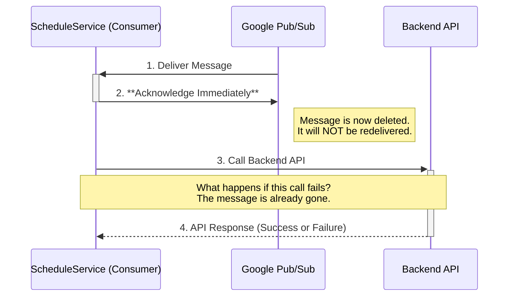
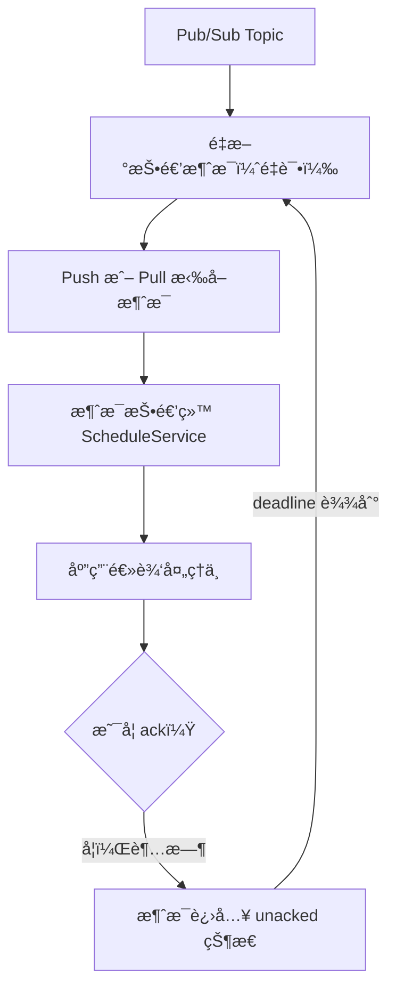
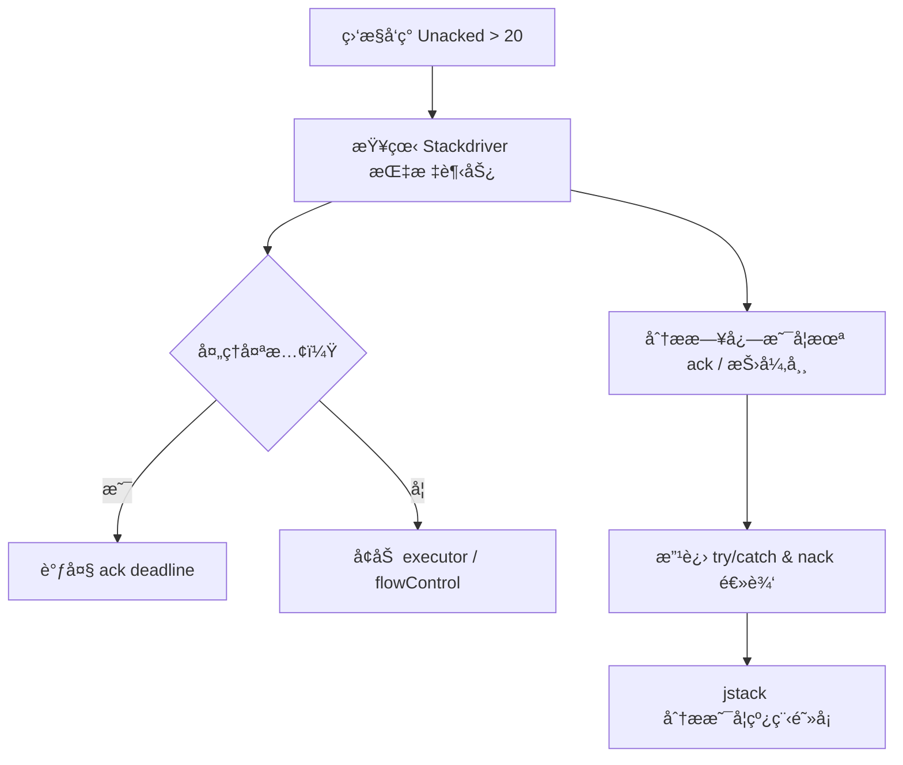
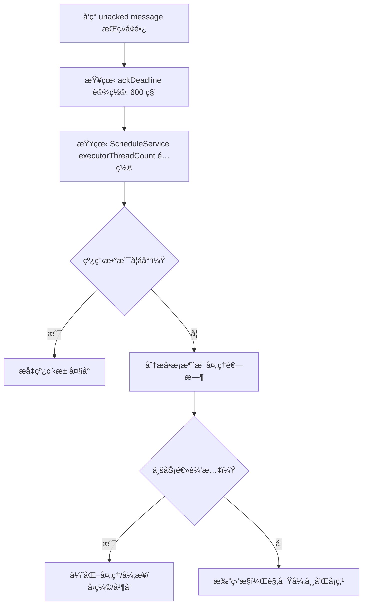

---
## ✅ 核心æ¶æ„：收到消æ¯ç«‹å³ ACK（At-Most-Once Delivery）

æ ¹æ®æ‚¨çš„确认，您的系统采用的是一ç§â€œ**收到å³ç¡®è®¤**â€ï¼ˆAcknowledge on Receipt）的模å¼ã€‚è¿™æ„å‘³ç€ `ScheduleService` åœ¨ä» Pub/Sub 拉å–到消æ¯å，会**ç«‹å³è°ƒç”¨ `consumer.ack()`**，然åå†å»æ‰§è¡Œå续的业务逻辑（如调用 Backend API）。

è¿™ç§æ¨¡å¼ä»æ ¹æœ¬ä¸Šæ”¹å˜äº†ç³»ç»Ÿçš„行为和å¯é æ€§ä¿è¯ï¼Œå®ƒå®ç°äº†â€œ**最多一次投递**â€ï¼ˆAt-Most-Once Delivery）的语义。

### **工作æµç¨‹ä¸å½±å“**

1.  **消æ¯è¢«æ‹‰å–å¹¶ç«‹å³ ACK**：`ScheduleService` çš„æ¶ˆè´¹çº¿ç¨‹ä» Pub/Sub æˆåŠŸæ‹‰å–一æ¡æ¶ˆæ¯ï¼Œå¹¶**立刻**å‘ Pub/Sub å‘é€ `ack` ä¿¡å·ã€‚
2.  **Pub/Sub 删除消æ¯**：Pub/Sub 收到 `ack` å，认为该消æ¯å·²è¢«æˆåŠŸå¤„ç†ï¼Œå¹¶å°†å…¶ä»è®¢é˜…中永久删除。**æ­¤å，Pub/Sub ä¸ä¼šå†é‡æ–°æŠ•é€’该消æ¯**。
3.  **调用 Backend API**：`ScheduleService` 开始执行å续业务逻辑，调用 Backend API。
4.  **å续处ç†å¤±è´¥çš„é£é™©**：
    *   å¦‚æœ Backend API 调用**失败**。
    *   如æœåœ¨è°ƒç”¨ API 期间 `ScheduleService` **崩溃**。
    *   **结æœ**：**消æ¯ä¼šæ°¸ä¹…丢失**。因为消æ¯å·²ç»è¢« `ack`，Pub/Sub ä¸ä¼šé‡è¯•ã€‚您必须ä¾èµ–自定义的日志ã€ç›‘æ§å’Œæ‰‹åŠ¨å¹²é¢„æ¥å¤„ç†è¿™äº›å¤±è´¥çš„业务æ“作。

### **å›¾ç¤ºï¼šæ”¶åˆ°å³ ACK çš„æµç¨‹**



### **为什么 `unacked_messages_by_region` ä»ç„¶å¯èƒ½å¢åŠ ï¼Ÿ**

åœ¨â€œæ”¶åˆ°å³ ACKâ€çš„æ¶æ„下，`unacked_messages_by_region` **ç†è®ºä¸Šåº”该始终é常ä½ï¼Œæ¥è¿‘äº 0**。因为消æ¯åœ¨è¢«å¤„ç†ä¹‹å‰å°±å·²ç»è¢« `ack` 了。

如æœè¿™ä¸ªæŒ‡æ ‡ä»ç„¶å¢é•¿ï¼ŒåŸå› å°†ä¸å†æ˜¯â€œä¸šåŠ¡é€»è¾‘处ç†æ…¢â€ï¼Œè€Œæ˜¯**消费者本身无法åŠæ—¶ä» Pub/Sub 拉å–并 `ack` 消æ¯**。这通常指å‘更底层的问题：

| **å¯èƒ½çš„åŸå› **                               | **说æ˜**                                                                                                                               |
| -------------------------------------------- | -------------------------------------------------------------------------------------------------------------------------------------- |
| **1. 消费者线程池/æµæ§é…ç½®ä¸å½“**             | `FlowControlSettings` 中的 `maxOutstandingElementCount` 设置得过ä½ï¼Œæˆ–者 `executorThreadCount` ä¸è¶³ï¼Œå¯¼è‡´å®¢æˆ·ç«¯æ— æ³•è·Ÿä¸Šæ¶ˆæ¯æµå…¥çš„速度。 |
| **2. å®¢æˆ·ç«¯ä¸ Pub/Sub 网络问题**             | GKE Pod ä¸ `pubsub.googleapis.com` 之间的网络延迟ã€ä¸¢åŒ…或ä¸ç¨³å®šï¼Œå¯¼è‡´ `StreamingPull` è¿æ¥æ•ˆç‡ä½ä¸‹ã€‚                                     |
| **3. 消费者 Pod 资æºä¸è¶³**                   | Pod çš„ CPU 或内存达到瓶颈，导致 Java 进程（包括 Pub/Sub 客户端库）è¿è¡Œç¼“慢，无法åŠæ—¶å¤„ç†ä¼ å…¥çš„æµå¼æ•°æ®å’Œå‘é€ `ack`。               |
| **4. Pub/Sub 客户端库内部问题**              | æ少数情况下，å¯èƒ½æ˜¯å®¢æˆ·ç«¯åº“本身的 Bug 或é…置问题。                                                                                    |

**总结**：在您的æ¶æ„中，`unacked_messages_by_region` çš„å¢é•¿**ä¸å†æ˜¯ä¸šåŠ¡å¤„ç†å»¶è¿Ÿçš„ä¿¡å·**，而是**消费客户端本身åå能力ä¸è¶³çš„ç›´æ¥ä½“ç°**。æ’查方å‘应ä»â€œä¸ºä»€ä¹ˆæˆ‘çš„ Backend API æ…¢â€è½¬å˜ä¸ºâ€œ**为什么我的 ScheduleService è¿æ”¶æ¶ˆæ¯å’Œå‘ `ack` 都å˜ï¿½ï¿½äº†**â€ã€‚

---

| **字段**                 | **示例值** | **说æ˜**                                                                    |
| ---------------------- | ---------- | --------------------------------------------------------------------------- |
| **ackDeadlineSeconds** | 600        | åœ¨æ‚¨çš„â€œæ”¶åˆ°å³ ACKâ€æ¶æ„中，此设置**几ä¹ä¸èµ·ä½œç”¨**，因为 `ack` 总是在处ç†å‰å®Œæˆã€‚ |


我们设置为 600S
unacked 总数是å¦ä¸€ç›´å¢é•¿ï¼ˆçº¿ç¨‹/处ç†å¤ªæ…¢ï¼‰

观察到 unacked messages 越æ¥è¶Šå¤šï¼Œè¯´æ˜æ¶ˆæ¯è¢«æ‹‰å–å，600s 内ä»æœª ack，或线程没有åŠæ—¶å¤„ç†å®Œ

如æœè¿™ä¸ªçº¿ç¨‹æ± å¤ªå°ï¼ˆä¾‹å¦‚ 2~4 个线程）\*\*

- å¦‚æœ Pub/Sub æ¯ç§’æ¨é€ 50 æ¡æ¶ˆæ¯
- 但你åªæœ‰ 4 个线程，æ¯ä¸ªå¤„ç†è€—æ—¶ 20 秒
- 则最多åªèƒ½å¤„ç† 3/min × 4 = 12 æ¡/min，其它积å‹
- 剩余消æ¯æ— æ³•åœ¨ 600 秒内完æˆæ¶ˆè´¹ ⇒ 导致 \*\*unacked å¢é•¿

ä½ æ到的 **“Unacked messages by region > 20 in 5minâ€** 是 Google Cloud Pub/Sub 中一个é常关键的性能/å¥åº·æŒ‡æ ‡ï¼Œè¯´æ˜ï¼š

> ✅ 消费者订阅了消æ¯ï¼Œä½†**未在 ack deadline 时间内 ack**（确认æ¥æ”¶ï¼‰ï¼Œå¯¼è‡´æ¶ˆæ¯å¤„äº **Unacked（待确认）** 状æ€ã€‚

---

## **✅ 一图ç†è§£ï¼šUnacked message 状æ€**



---

## **✅ å‡ºç° Unacked Message 常è§åŸå› **

| **åŸå› ç±»å‹**              | **å¯èƒ½çš„æŒ‡æ ‡ä¿¡å· / ç°è±¡**                  | **说æ˜**                 |
| ------------------------- | ------------------------------------------ | ------------------------ |
| ⌠ScheduleService 没 ack | 代ç é€»è¾‘异常ã€æ—  consumer.ack() 或未执行到 | æœªæ˜¾å¼ ack/nack æ¶ˆæ¯     |
| Ⱡ处ç†è¶…æ—¶                | ack_deadline é…ç½®ä¸è¶³                      | 默认 10s，处ç†è¶…时会é‡æŠ• |
| 🧵 并å‘ä¸è¶³               | 消费线程ä¸å¤Ÿï¼Œæ¶ˆæ¯å¤„ç†ç§¯å‹                 | executorThreadCount å¤ªå° |
| 📦 积å‹å¤ªå¤š               | 消æ¯è¿›æ¥å¤ªå¿«ï¼Œå¤„ç†è·Ÿä¸ä¸Š                   | flowControlSettings é™æµ |
| â— æŠ›å‡ºå¼‚å¸¸æœªå¤„ç†         | 未 try/catch，导致处ç†é€»è¾‘ç›´æ¥ crash       | 消æ¯æœª ack，也未 nack    |
| 🚫 应用瓶颈               | CPU å¿™ã€ç½‘络调用慢ã€è¿æ¥æ± æ¯ç«­             | Java æœåŠ¡æœ¬èº«å¤„ç†æ…¢      |

---

## **✅ æ’查定ä½æ­¥éª¤ï¼ˆå»ºè®®é¡ºåºï¼‰**

### **1ï¸âƒ£ 核心监æ§æŒ‡æ ‡åˆ†æ**

使用 **Cloud Monitoring (Stackdriver)** 或 **Grafana/Prometheus** 对比以下指标：

| **指标å**                                                       | **说æ˜**                 |
| ------------------------------------------------------------- | ---------------------- |
| subscription/num_undelivered_messages                         | Topic 中未被投递的消æ¯æ•°        |
| subscription/num_unacked_messages                             | 已投递但未 ack 的消æ¯æ•°ï¼ˆä½ ç°åœ¨å…³æ³¨çš„） |
| subscription/ack_message_count                                | æˆåŠŸ ack 的总数             |
| subscription/pull_ack_latency                                 | 消费到 ack 的耗时分布          |
| subscription/expired_ack_deadlines_count                      | 未 ack 超时导致é‡æ–°æŠ•é€’的次数      |
| pubsub.googleapis.com/subscription/oldest_unacked_message_age | 最è€æœª ack 消æ¯ç­‰å¾…时间         |

👉 é‡ç‚¹çœ‹ï¼š

- unacked 总数是å¦ä¸€ç›´å¢é•¿ï¼ˆçº¿ç¨‹/处ç†å¤ªæ…¢ï¼‰
- ack_latency 是å¦å˜å¤§ï¼ˆæ…¢ï¼‰
- expired_ack_deadlines 是å¦é£™å‡ï¼ˆè¢«é‡æ–°æŠ•é€’）

---

### **2ï¸âƒ£ 查看应用日志（ScheduleService）**

定ä½æ˜¯å¦å­˜åœ¨ä»¥ä¸‹å¼‚常：

```
ERROR: Exception during message processing
WARN: Retry logic failed after 3 attempts
```

> 看你是å¦åœ¨ try/catch 中丢失异常ã€æœª ackã€é€»è¾‘太慢（比如调用外部 HTTP 阻å¡ï¼‰

---

### **3ï¸âƒ£** 

### **jstack**

###  **分æ线程堆栈状æ€**

进入 Pod：

```
kubectl exec -it POD_NAME -- jstack 1 | less
```

æœç´¢å…³é”®è¯ï¼š

- WAITING / BLOCKED → 线程是å¦è¢«é”或阻å¡
- http-nio-_ / ForkJoinPool / task-_ → 哪些线程池ç¹å¿™

---

### **4ï¸âƒ£ 查看你的 Pub/Sub 消费é…置（是å¦è®¾ç½®åˆç†ï¼‰**

#### **✅ FlowControl + Executor 设置是å¦è¶³å¤Ÿï¼š**

```java
Subscriber.newBuilder(subscriptionName, receiver)
    .setFlowControlSettings(
        FlowControlSettings.newBuilder()
            .setMaxOutstandingElementCount(1000)
            .setMaxOutstandingRequestBytes(20 * 1024 * 1024)
            .build()
    )
    .setExecutorProvider(
        InstantiatingExecutorProvider.newBuilder().setExecutorThreadCount(20).build()
    )
```

如æœè®¾ç½®å¤ªå°ï¼Œä¼šå¯¼è‡´æ¶ˆæ¯æ’队 → 未åŠæ—¶æ¶ˆè´¹ → 超过 deadline → unacked 累积。

---

### **5ï¸âƒ£ 检查 AckDeadline 是å¦éœ€è¦è°ƒæ•´**

```
gcloud pubsub subscriptions update my-sub \
  --ack-deadline=60  # å•ä½æ˜¯ç§’，最长 600
```

如æœä½ çš„处ç†é€»è¾‘较é‡ï¼ˆä¾‹å¦‚ HTTP é‡è¯•ï¼‰ï¼Œ10s 默认是远远ä¸å¤Ÿçš„。
我们是 600S 监æ§çš„

---

### **6ï¸âƒ£ 检查处ç†é€»è¾‘中的外部调用耗时（调用 Kong 或 BackendAPI）**

建议在消费逻辑里åšå¦‚下监æ§åŸ‹ç‚¹ï¼š

```java
long start = System.currentTimeMillis();
try {
  callBackend();
  consumer.ack();
} catch (Exception e) {
  consumer.nack();
} finally {
  metrics.timer("pubsub.processing.latency").record(System.currentTimeMillis() - start);
}
```

并对 callBackend() åšè¶…时处ç†ï¼ˆæ¨è使用 Reactor/Async）

---

## **✅ 总结：快速æ’查æµç¨‹å›¾**



---

## **✅ 附加建议**

| **监æ§ç›®æ ‡**             | **建议方案**                         |
| ------------------------ | ------------------------------------ |
| Ack 处ç†æˆåŠŸç‡           | Prometheus 指标：message.ack.success |
| 消æ¯ç§¯å‹ä¸¥é‡æŠ¥è­¦         | 建议é…ç½® Cloud Alerting              |
| 自动扩缩容（消费å‹åŠ›å¤§ï¼‰ | 使用 K8s HPA（CPU 或 自定义指标）    |

---

消费者订阅了消æ¯ï¼Œä½†**未在 ack deadline 时间内 ack**（确认æ¥æ”¶ï¼‰ï¼Œå¯¼è‡´æ¶ˆæ¯å¤„äº **Unacked（待确认）** 状æ€

这个时间设置如何查看?

gcloud pubsub subscriptions describe my-subscription ?

是的，✅ **ä½ å¯ä»¥é€šè¿‡ gcloud pubsub subscriptions describe 命令查看 ackDeadlineSeconds** 的当å‰è®¾ç½®å€¼ï¼Œä¹Ÿå°±æ˜¯æ¶ˆæ¯ä» Pub/Sub 投递给消费者å，**在多久之内必须 ack，å¦åˆ™ä¼šè¢«é‡æ–°æŠ•é€’**。

---

## **✅ 查看 Ack Deadline 设置的命令：**

```
gcloud pubsub subscriptions describe my-subscription
```

---

## **✅ 输出字段说æ˜ï¼ˆé‡ç‚¹å­—段）**

示例输出：

```
ackDeadlineSeconds: 10
expirationPolicy:
  ttl: 2678400s
messageRetentionDuration: 604800s
name: projects/my-project/subscriptions/my-subscription
pushConfig: {}
topic: projects/my-project/topics/my-topic
```

| **字段å**               | **å«ä¹‰**                                                |
| ------------------------ | ------------------------------------------------------- |
| ackDeadlineSeconds       | ✅ **å½“å‰ ack deadline é…置（å•ä½ç§’）**（默认是 10 秒） |
| messageRetentionDuration | 未被 ack 消æ¯åœ¨ Pub/Sub 系统中ä¿ç•™å¤šä¹…（默认 7 天）     |
| pushConfig               | 如æœæ˜¯ push 模å¼ä¼šæ˜¾ç¤º endpoint ä¿¡æ¯                    |
| topic                    | 当å‰è®¢é˜…对应的 topic                                    |

---

## **✅ 如æœéœ€è¦ä¿®æ”¹è¿™ä¸ªå€¼ï¼ˆæ¯”如改为 60 秒）**

```
gcloud pubsub subscriptions update my-subscription \
  --ack-deadline=60
```

注æ„：

- 最å°å€¼ï¼š10 秒（默认）
- 最大值：600 秒（10 分钟）

---

## **✅ 修改建议**

| **处ç†é€»è¾‘场景**           | **建议 ack deadline 时间** |
| -------------------------- | -------------------------- |
| 简å•é€»è¾‘，快速处ç†ï¼ˆ< 5s） | ä¿æŒé»˜è®¤ 10 秒             |
| 调用外部 API，有é‡è¯•é€»è¾‘   | 设置为 30 ~ 60 秒          |
| 调用ä¾èµ–系统慢或 IO 密集   | å¯è®¾ä¸º 120 ~ 300 秒        |

---

是å¦éœ€è¦æˆ‘也帮你整ç†ä¸€ä¸ªè„šæœ¬ï¼Œè‡ªåŠ¨æ‰¹é‡æŸ¥çœ‹å¤šä¸ª subscription çš„ ackDeadline 设置？

消费者订阅了消æ¯ï¼Œä½†**未在 ack deadline 时间内 ack**（确认æ¥æ”¶ï¼‰ï¼Œå¯¼è‡´æ¶ˆæ¯å¤„äº **Unacked（待确认）** 状æ€

我们设置为 600S

unacked 总数是å¦ä¸€ç›´å¢é•¿ï¼ˆçº¿ç¨‹/处ç†å¤ªæ…¢ï¼‰

那么我如何优化这个问题,如æœä»çº¿ç¨‹æ¥è¯´ 这里特指什么?

是 Schedule Service å» pub /sub  subscription å–消æ¯çš„ 线程么?

ä½ ç†è§£å¾—完全正确，下é¢æˆ‘们一步步拆解你的问题，并**精确解释这个“线程â€æŒ‡çš„是è°â€ã€â€œå¦‚何优化â€**。

---

## **✅ 问题背景å†æ¢³ç†ä¸€ä¸‹ï¼š**

- 你使用 **Pull 模å¼** ä» **Pub/Sub Subscription** 拉å–消æ¯ã€‚
- 你设置了 ackDeadlineSeconds = 600（最大值）。
- **但你观察到 unacked messages 越æ¥è¶Šå¤šï¼Œè¯´æ˜æ¶ˆæ¯è¢«æ‹‰å–å，600s 内ä»æœª ack，或线程没有åŠæ—¶å¤„ç†å®Œã€‚**

---

## **✅ 问题本质：消æ¯è¢« Schedule Service 拉到了，但没有åŠæ—¶å¤„ç†å®Œæˆ– ack**

所以：

> **这里的线程特指：**

> ✅ Schedule Service 中，负责执行拉å–消æ¯åçš„ **å›è°ƒå‡½æ•°ï¼ˆMessageReceiver æ¥å£ï¼‰** 中业务逻辑的线程，也就是 **“消æ¯å¤„ç†çº¿ç¨‹æ± â€**。

---

## **✅ ç¤ºä¾‹ï¼šä½ å½“å‰ Schedule Service 消费 Pub/Sub 的代ç ç»“æ„（Java）**

```java
Subscriber subscriber = Subscriber.newBuilder(subscriptionName, receiver)
    .setExecutorProvider(InstantiatingExecutorProvider.newBuilder()
        .setExecutorThreadCount(4) // 👈 就是这里æ§åˆ¶çº¿ç¨‹æ•°
        .build())
    .build();

subscriber.startAsync().awaitRunning();
```

### **å›è°ƒé€»è¾‘：**

```java
MessageReceiver receiver = (message, consumer) -> {
    try {
        // 👇 你的业务逻辑：例如 HTTP 调用 Kongã€é‡è¯•ã€å›å†™ç­‰
        processMessage(message);

        consumer.ack(); // 👈 æˆåŠŸå°± ack
    } catch (Exception e) {
        consumer.nack(); // 👈 失败 nack
    }
};
```

---

## **✅ 如æœè¿™ä¸ªçº¿ç¨‹æ± å¤ªå°ï¼ˆä¾‹å¦‚ 2~4 个线程）**

- å¦‚æœ Pub/Sub æ¯ç§’æ¨é€ 50 æ¡æ¶ˆæ¯
- 但你åªæœ‰ 4 个线程，æ¯ä¸ªå¤„ç†è€—æ—¶ 20 秒
- 则最多åªèƒ½å¤„ç† 3/min × 4 = 12 æ¡/min，其它积å‹
- 剩余消æ¯æ— æ³•åœ¨ 600 秒内完æˆæ¶ˆè´¹ ⇒ 导致 **unacked å¢é•¿**

---

## **✅ 优化建议清å•ï¼ˆä»çº¿ç¨‹ä¸å¤„ç†è§’度）**

| **优化维度**          | **建议方法**                                       |
| --------------------- | -------------------------------------------------- |
| **å¢åŠ å¹¶å‘线程数**    | æ高 executorThreadCountï¼Œå¦‚ä» 4 å¢åŠ åˆ° 20         |
| **é™åˆ¶æ‹‰å–æµé‡**      | 使用 FlowControlSettings æ§åˆ¶ç§¯å‹æ•°é‡/体积         |
| **优化处ç†é€»è¾‘耗时**  | å‡å°‘ HTTP 请求ã€ä½¿ç”¨è¿æ¥æ± ã€å¼‚æ­¥å¤„ç†               |
| **使用批处ç†/线程池** | ç»“åˆ ThreadPoolExecutor 对高耗时逻辑并行执行       |
| **监æ§è€—时指标**      | 打埋点监æ§æ¯æ¡æ¶ˆæ¯å¤„ç†è€—时（用äºåˆ¤æ–­æ˜¯å¦çº¿ç¨‹è€—尽） |

---

## **✅ æ¨è设置举例**

```java
Subscriber.newBuilder(subscriptionName, receiver)
    .setExecutorProvider(
        InstantiatingExecutorProvider.newBuilder()
            .setExecutorThreadCount(20) // 👈 æå‡çº¿ç¨‹æ•°
            .build()
    )
    .setFlowControlSettings(
        FlowControlSettings.newBuilder()
            .setMaxOutstandingElementCount(1000) // 👈 é™åˆ¶åŒæ—¶ç§¯å‹æ¶ˆæ¯æ•°é‡
            .setMaxOutstandingRequestBytes(50 * 1024 * 1024) // 50MB
            .build()
    )
    .build();
```

---

## **✅ æ’查æµç¨‹å›¾ï¼ˆåŸºäº unacked å¢é•¿ï¼‰**



---

## **✅ 示例指标建议（Prometheus）**

| **指标å称**                  | **å«ä¹‰**           |
| ----------------------------- | ------------------ |
| pubsub.consumer.message.count | æ¯åˆ†é’Ÿå¤„ç†å¤šå°‘æ¡   |
| pubsub.consumer.latency       | æ¯æ¡å¤„ç†è€—æ—¶       |
| pubsub.consumer.pending       | 当å‰å¤„ç†ä¸­çš„æ•°é‡   |
| executor.active_threads       | 线程池当å‰å ç”¨æƒ…况 |
| pubsub.consumer.failed.count  | nack çš„æ•°é‡        |

---

## **✅ 总结关键点**

| **问题点**   | **解法**                                                |
| ------------ | ------------------------------------------------------- |
| unacked å¢é•¿ | 说æ˜çº¿ç¨‹å¤„ç†ä¸è¿‡æ¥ï¼Œæˆ–者处ç†å¤ªæ…¢                        |
| 哪些线程？   | 是 Schedule Service 中 MessageReceiver å›è°ƒå†…部执行线程 |
| 如何æ§åˆ¶ï¼Ÿ   | executorThreadCount + Flow Control                      |
| 如何优化？   | æå‡å¹¶å‘ + 监æ§å¤„ç†è€—æ—¶ + 业务逻辑瘦身                  |

---

如æœä½ æ„¿æ„，也å¯ä»¥ç»™æˆ‘ä½ ç›®å‰çš„线程池é…ç½®ã€messageReceiver 中的主è¦é€»è¾‘，我å¯ä»¥å¸®ä½ è¯„估一个具体线程数æ¨è + 最大拉å–速ç‡æ¨¡å‹ã€‚是å¦éœ€è¦æˆ‘生æˆä¸€ä¸ªå¯è§‚测的 Prometheus æŒ‡æ ‡æ¨¡æ¿ YAML ç”¨äº Grafana？


✦ gcp pub/sub unacked_messages_by_region 是 Google Cloud Pub/Sub æœåŠ¡ä¸­çš„一个监æ§æŒ‡æ ‡ï¼Œå®ƒè¡¨ç¤ºåœ¨ç‰¹å®šåŒºåŸŸå†…，Pub/Sub
  订阅中尚未被订阅者确认（acknowledge）的消æ¯æ•°é‡ã€‚

  解释：


   * Pub/Sub (Publish/Subscribe): 是一ç§å¼‚步消æ¯ä¼ é€’æœåŠ¡ï¼Œç”¨äºåœ¨ç‹¬ç«‹åº”用程åºä¹‹é—´å‘é€å’Œæ¥æ”¶æ¶ˆæ¯ã€‚
   * æ¶ˆæ¯ (Message): 生产者（publisher）å‘é€åˆ°ä¸»é¢˜ï¼ˆtopic）的数æ®å•å…ƒã€‚
   * 订阅 (Subscription): 订阅者（subscriber）ä»ä¸»é¢˜æ¥æ”¶æ¶ˆæ¯çš„é…置。
   * 确认 (Acknowledge): 订阅者æˆåŠŸå¤„ç†æ¶ˆæ¯åï¼Œå‘ Pub/Sub æœåŠ¡å‘é€çš„确认信å·ï¼Œè¡¨ç¤ºè¯¥æ¶ˆæ¯å¯ä»¥ä»è®¢é˜…中移除。
   * æœªç¡®è®¤æ¶ˆæ¯ (Unacked Messages): 消æ¯å·²å‘é€ç»™è®¢é˜…者，但订阅者尚未确认处ç†å®Œæˆçš„消æ¯ã€‚这些消æ¯ä¼šä¿ç•™åœ¨è®¢é˜…中，直到被确认或达到消æ¯ä¿ç•™æœŸé™ã€‚
   * 按区域 (by_region): 这个指标是按 Google Cloud 区域èšåˆçš„，æ„味ç€ä½ å¯ä»¥çœ‹åˆ°æ¯ä¸ªåŒºåŸŸä¸­æœªç¡®è®¤æ¶ˆæ¯çš„æ•°é‡ã€‚

  ä¾èµ–å‚æ•°/因素：

  unacked_messages_by_region 主è¦å–决äºä»¥ä¸‹å‡ ä¸ªå› ç´ ï¼š


   1. 消æ¯å‘å¸ƒé€Ÿç‡ (Message Publishing Rate): 生产者å‘主题å‘é€æ¶ˆæ¯çš„速度。如æœå‘布速ç‡å¾ˆé«˜ï¼Œè€Œè®¢é˜…者处ç†é€Ÿåº¦è·Ÿä¸ä¸Šï¼Œæœªç¡®è®¤æ¶ˆæ¯æ•°é‡ä¼šå¢åŠ ã€‚
   2. 订阅者处ç†é€Ÿç‡ (Subscriber Processing Rate): 订阅者ä»è®¢é˜…中拉å–消æ¯å¹¶å¤„ç†çš„速度。处ç†é€Ÿåº¦æ…¢æ˜¯å¯¼è‡´æœªç¡®è®¤æ¶ˆæ¯å †ç§¯çš„主è¦åŸå› ã€‚
   3. 订阅者数é‡å’Œå¹¶å‘ (Number of Subscribers and Concurrency): 订阅者的数é‡ä»¥åŠæ¯ä¸ªè®¢é˜…者的并å‘处ç†èƒ½åŠ›ã€‚å¢åŠ è®¢é˜…者数é‡æˆ–æ高并å‘å¯ä»¥å¸®åŠ©æ›´å¿«åœ°å¤„ç†æ¶ˆæ¯ã€‚
   4. 消æ¯ç¡®è®¤è¶…时时间 (Acknowledgement Deadline): 订阅者在收到消æ¯å必须确认消æ¯çš„时间窗å£ã€‚如æœè®¢é˜…者未能在超时时间内确认消æ¯ï¼ŒPub/Sub
      会é‡æ–°å‘é€è¯¥æ¶ˆæ¯ï¼Œè¿™å¯èƒ½å¯¼è‡´é‡å¤å¤„ç†å’Œæœªç¡®è®¤æ¶ˆæ¯æ•°é‡çš„æš‚æ—¶å¢åŠ ã€‚
   5. 消æ¯ä¿ç•™ç­–ç•¥ (Message Retention Policy): 订阅é…置中消æ¯çš„最长ä¿ç•™æ—¶é—´ã€‚å³ä½¿æ¶ˆæ¯æœªè¢«ç¡®è®¤ï¼Œå¦‚æœè¶…过ä¿ç•™æ—¶é—´ï¼Œå®ƒä»¬ä¹Ÿä¼šè¢«åˆ é™¤ã€‚
   6. è®¢é˜…ç±»å‹ (Subscription Type):
       * Push 订阅: Pub/Sub 将消æ¯æ¨é€åˆ°è®¢é˜…者端点。如æœç«¯ç‚¹ä¸å¯ç”¨æˆ–处ç†ç¼“慢，未确认消æ¯ä¼šå †ç§¯ã€‚
       * Pull 订阅: è®¢é˜…è€…ä¸»åŠ¨ä» Pub/Sub 拉å–消æ¯ã€‚如æœæ‹‰å–频ç‡ä½æˆ–处ç†æ…¢ï¼Œæœªç¡®è®¤æ¶ˆæ¯ä¼šå †ç§¯ã€‚

  æµç¨‹å›¾ï¼šæœªç¡®è®¤æ¶ˆæ¯å †ç§¯æµç¨‹


```mermaid
graph TD;
         A[生产者å‘布消æ¯] --> B[消æ¯åˆ°è¾¾Pub/Sub主题];
         B --> C{消æ¯å‘é€åˆ°è®¢é˜…者};
         C -- æˆåŠŸå‘é€ --> D[订阅者æ¥æ”¶æ¶ˆæ¯];
         D --> E{订阅者处ç†æ¶ˆæ¯};
         E -- 处ç†æˆåŠŸ --> F[订阅者å‘é€ACK];
         F --> G[Pub/Sub移除消æ¯];
         E -- 处ç†å¤±è´¥/超时 --> H[消æ¯å˜ä¸ºæœªç¡®è®¤];
         H --> I[Pub/Subé‡æ–°å‘é€æ¶ˆæ¯];
        I --> D;
        C -- å‘é€å¤±è´¥/订阅者ä¸å¯ç”¨ --> H;
    
        subgraph 监æ§æŒ‡æ ‡
            H -- 累加 --> J[unacked_messages_by_region];
        end
```


  表格：影å“因素概览


  | å› ç´                  | æè¿°                                                         | 对 unacked_messages_by_region çš„å½±å“ |
  | :------------------- | :----------------------------------------------------------- | :------------------------------------- |
  | 消æ¯å‘å¸ƒé€Ÿç‡         | 生产者å‘主题å‘é€æ¶ˆæ¯çš„速度。                                 | â¬†ï¸ (å‘布快，处ç†æ…¢åˆ™å¢åŠ )              |
  | 订阅者处ç†é€Ÿç‡       | 订阅者处ç†å¹¶ç¡®è®¤æ¶ˆæ¯çš„速度。                                 | â¬‡ï¸ (处ç†æ…¢åˆ™å¢åŠ )                      |
  | 订阅者数é‡å’Œå¹¶å‘     | 订阅者å®ä¾‹çš„æ•°é‡åŠå…¶å¹¶è¡Œå¤„ç†èƒ½åŠ›ã€‚                           | â¬‡ï¸ (æ•°é‡å°‘或并å‘ä½åˆ™å¢åŠ )              |
  | 消æ¯ç¡®è®¤è¶…时时间     | 订阅者确认消æ¯çš„å…许时间。                                   | â¬†ï¸ (超时短或处ç†æ…¢åˆ™å¢åŠ é‡å‘)          |
  | 消æ¯ä¿ç•™ç­–ç•¥         | 消æ¯åœ¨è®¢é˜…中ä¿ç•™çš„最长时间。                                 | â¬‡ï¸ (ä¿ç•™æ—¶é—´åˆ°æœŸåˆ™å‡å°‘)                |
  | è®¢é˜…ç±»å‹             | Push 或 Pull 订阅。                                          | â¬†ï¸ (å–决äºè®¢é˜…者端点或拉å–效ç‡)        |


