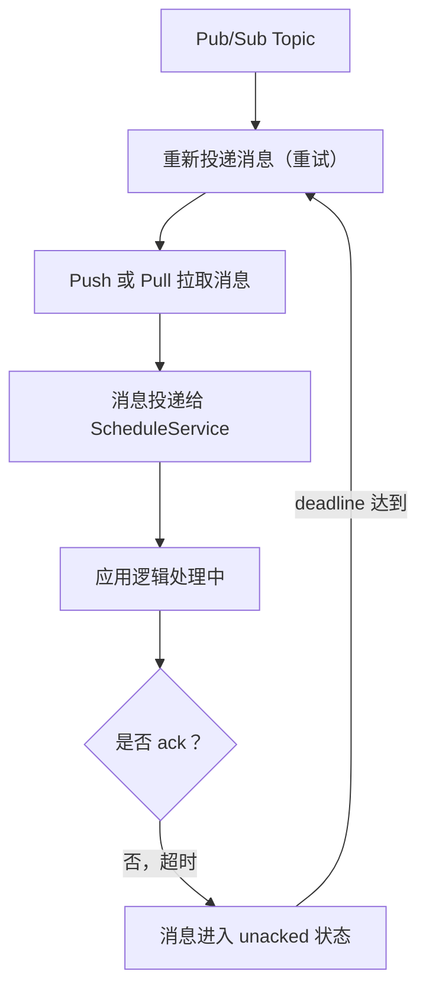
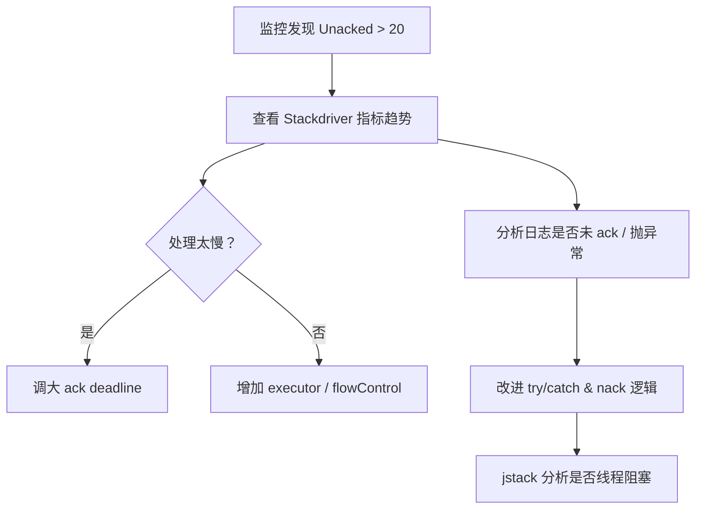
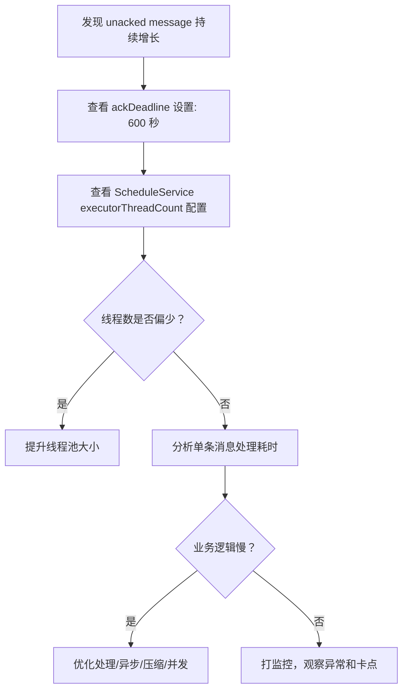

| **字段**                 | **示例值** | **说明**                                        |
| ---------------------- | ------- | --------------------------------------------- |
| **ackDeadlineSeconds** | 10      | 订阅者在这段时间（秒）内确认消息，否则消息将重新投递。默认是 10 秒。最大 600 秒。 |

我们设置为 600S
unacked 总数是否一直增长（线程/处理太慢）

观察到 unacked messages 越来越多，说明消息被拉取后，600s 内仍未 ack，或线程没有及时处理完

如果这个线程池太小（例如 2~4 个线程）\*\*

- 如果 Pub/Sub 每秒推送 50 条消息
- 但你只有 4 个线程，每个处理耗时 20 秒
- 则最多只能处理 3/min × 4 = 12 条/min，其它积压
- 剩余消息无法在 600 秒内完成消费 ⇒ 导致 \*\*unacked 增长

你提到的 **“Unacked messages by region > 20 in 5min”** 是 Google Cloud Pub/Sub 中一个非常关键的性能/健康指标，说明：

> ✅ 消费者订阅了消息，但**未在 ack deadline 时间内 ack**（确认接收），导致消息处于 **Unacked（待确认）** 状态。

---

## **✅ 一图理解：Unacked message 状态**



---

## **✅ 出现 Unacked Message 常见原因**

| **原因类型**              | **可能的指标信号 / 现象**                  | **说明**                 |
| ------------------------- | ------------------------------------------ | ------------------------ |
| ❌ ScheduleService 没 ack | 代码逻辑异常、无 consumer.ack() 或未执行到 | 未显式 ack/nack 消息     |
| ⏱ 处理超时                | ack_deadline 配置不足                      | 默认 10s，处理超时会重投 |
| 🧵 并发不足               | 消费线程不够，消息处理积压                 | executorThreadCount 太小 |
| 📦 积压太多               | 消息进来太快，处理跟不上                   | flowControlSettings 限流 |
| ❗ 抛出异常未处理         | 未 try/catch，导致处理逻辑直接 crash       | 消息未 ack，也未 nack    |
| 🚫 应用瓶颈               | CPU 忙、网络调用慢、连接池枯竭             | Java 服务本身处理慢      |

---

## **✅ 排查定位步骤（建议顺序）**

### **1️⃣ 核心监控指标分析**

使用 **Cloud Monitoring (Stackdriver)** 或 **Grafana/Prometheus** 对比以下指标：

| **指标名**                                                    | **说明**                                |
| ------------------------------------------------------------- | --------------------------------------- |
| subscription/num_undelivered_messages                         | Topic 中未被投递的消息数                |
| subscription/num_unacked_messages                             | 已投递但未 ack 的消息数（你现在关注的） |
| subscription/ack_message_count                                | 成功 ack 的总数                         |
| subscription/pull_ack_latency                                 | 消费到 ack 的耗时分布                   |
| subscription/expired_ack_deadlines_count                      | 未 ack 超时导致重新投递的次数           |
| pubsub.googleapis.com/subscription/oldest_unacked_message_age | 最老未 ack 消息等待时间                 |

👉 重点看：

- unacked 总数是否一直增长（线程/处理太慢）
- ack_latency 是否变大（慢）
- expired_ack_deadlines 是否飙升（被重新投递）

---

### **2️⃣ 查看应用日志（ScheduleService）**

定位是否存在以下异常：

```
ERROR: Exception during message processing
WARN: Retry logic failed after 3 attempts
```

> 看你是否在 try/catch 中丢失异常、未 ack、逻辑太慢（比如调用外部 HTTP 阻塞）

---

### **3️⃣** 

### **jstack**

###  **分析线程堆栈状态**

进入 Pod：

```
kubectl exec -it POD_NAME -- jstack 1 | less
```

搜索关键词：

- WAITING / BLOCKED → 线程是否被锁或阻塞
- http-nio-_ / ForkJoinPool / task-_ → 哪些线程池繁忙

---

### **4️⃣ 查看你的 Pub/Sub 消费配置（是否设置合理）**

#### **✅ FlowControl + Executor 设置是否足够：**

```java
Subscriber.newBuilder(subscriptionName, receiver)
    .setFlowControlSettings(
        FlowControlSettings.newBuilder()
            .setMaxOutstandingElementCount(1000)
            .setMaxOutstandingRequestBytes(20 * 1024 * 1024)
            .build()
    )
    .setExecutorProvider(
        InstantiatingExecutorProvider.newBuilder().setExecutorThreadCount(20).build()
    )
```

如果设置太小，会导致消息排队 → 未及时消费 → 超过 deadline → unacked 累积。

---

### **5️⃣ 检查 AckDeadline 是否需要调整**

```
gcloud pubsub subscriptions update my-sub \
  --ack-deadline=60  # 单位是秒，最长 600
```

如果你的处理逻辑较重（例如 HTTP 重试），10s 默认是远远不够的。
我们是 600S 监控的

---

### **6️⃣ 检查处理逻辑中的外部调用耗时（调用 Kong 或 BackendAPI）**

建议在消费逻辑里做如下监控埋点：

```java
long start = System.currentTimeMillis();
try {
  callBackend();
  consumer.ack();
} catch (Exception e) {
  consumer.nack();
} finally {
  metrics.timer("pubsub.processing.latency").record(System.currentTimeMillis() - start);
}
```

并对 callBackend() 做超时处理（推荐使用 Reactor/Async）

---

## **✅ 总结：快速排查流程图**



---

## **✅ 附加建议**

| **监控目标**             | **建议方案**                         |
| ------------------------ | ------------------------------------ |
| Ack 处理成功率           | Prometheus 指标：message.ack.success |
| 消息积压严重报警         | 建议配置 Cloud Alerting              |
| 自动扩缩容（消费压力大） | 使用 K8s HPA（CPU 或 自定义指标）    |

---

消费者订阅了消息，但**未在 ack deadline 时间内 ack**（确认接收），导致消息处于 **Unacked（待确认）** 状态

这个时间设置如何查看?

gcloud pubsub subscriptions describe my-subscription ?

是的，✅ **你可以通过 gcloud pubsub subscriptions describe 命令查看 ackDeadlineSeconds** 的当前设置值，也就是消息从 Pub/Sub 投递给消费者后，**在多久之内必须 ack，否则会被重新投递**。

---

## **✅ 查看 Ack Deadline 设置的命令：**

```
gcloud pubsub subscriptions describe my-subscription
```

---

## **✅ 输出字段说明（重点字段）**

示例输出：

```
ackDeadlineSeconds: 10
expirationPolicy:
  ttl: 2678400s
messageRetentionDuration: 604800s
name: projects/my-project/subscriptions/my-subscription
pushConfig: {}
topic: projects/my-project/topics/my-topic
```

| **字段名**               | **含义**                                                |
| ------------------------ | ------------------------------------------------------- |
| ackDeadlineSeconds       | ✅ **当前 ack deadline 配置（单位秒）**（默认是 10 秒） |
| messageRetentionDuration | 未被 ack 消息在 Pub/Sub 系统中保留多久（默认 7 天）     |
| pushConfig               | 如果是 push 模式会显示 endpoint 信息                    |
| topic                    | 当前订阅对应的 topic                                    |

---

## **✅ 如果需要修改这个值（比如改为 60 秒）**

```
gcloud pubsub subscriptions update my-subscription \
  --ack-deadline=60
```

注意：

- 最小值：10 秒（默认）
- 最大值：600 秒（10 分钟）

---

## **✅ 修改建议**

| **处理逻辑场景**           | **建议 ack deadline 时间** |
| -------------------------- | -------------------------- |
| 简单逻辑，快速处理（< 5s） | 保持默认 10 秒             |
| 调用外部 API，有重试逻辑   | 设置为 30 ~ 60 秒          |
| 调用依赖系统慢或 IO 密集   | 可设为 120 ~ 300 秒        |

---

是否需要我也帮你整理一个脚本，自动批量查看多个 subscription 的 ackDeadline 设置？

消费者订阅了消息，但**未在 ack deadline 时间内 ack**（确认接收），导致消息处于 **Unacked（待确认）** 状态

我们设置为 600S

unacked 总数是否一直增长（线程/处理太慢）

那么我如何优化这个问题,如果从线程来说 这里特指什么?

是 Schedule Service 去 pub /sub  subscription 取消息的 线程么?

你理解得完全正确，下面我们一步步拆解你的问题，并**精确解释这个“线程”指的是谁”、“如何优化”**。

---

## **✅ 问题背景再梳理一下：**

- 你使用 **Pull 模式** 从 **Pub/Sub Subscription** 拉取消息。
- 你设置了 ackDeadlineSeconds = 600（最大值）。
- **但你观察到 unacked messages 越来越多，说明消息被拉取后，600s 内仍未 ack，或线程没有及时处理完。**

---

## **✅ 问题本质：消息被 Schedule Service 拉到了，但没有及时处理完或 ack**

所以：

> **这里的线程特指：**

> ✅ Schedule Service 中，负责执行拉取消息后的 **回调函数（MessageReceiver 接口）** 中业务逻辑的线程，也就是 **“消息处理线程池”**。

---

## **✅ 示例：你当前 Schedule Service 消费 Pub/Sub 的代码结构（Java）**

```java
Subscriber subscriber = Subscriber.newBuilder(subscriptionName, receiver)
    .setExecutorProvider(InstantiatingExecutorProvider.newBuilder()
        .setExecutorThreadCount(4) // 👈 就是这里控制线程数
        .build())
    .build();

subscriber.startAsync().awaitRunning();
```

### **回调逻辑：**

```java
MessageReceiver receiver = (message, consumer) -> {
    try {
        // 👇 你的业务逻辑：例如 HTTP 调用 Kong、重试、回写等
        processMessage(message);

        consumer.ack(); // 👈 成功就 ack
    } catch (Exception e) {
        consumer.nack(); // 👈 失败 nack
    }
};
```

---

## **✅ 如果这个线程池太小（例如 2~4 个线程）**

- 如果 Pub/Sub 每秒推送 50 条消息
- 但你只有 4 个线程，每个处理耗时 20 秒
- 则最多只能处理 3/min × 4 = 12 条/min，其它积压
- 剩余消息无法在 600 秒内完成消费 ⇒ 导致 **unacked 增长**

---

## **✅ 优化建议清单（从线程与处理角度）**

| **优化维度**          | **建议方法**                                       |
| --------------------- | -------------------------------------------------- |
| **增加并发线程数**    | 提高 executorThreadCount，如从 4 增加到 20         |
| **限制拉取流量**      | 使用 FlowControlSettings 控制积压数量/体积         |
| **优化处理逻辑耗时**  | 减少 HTTP 请求、使用连接池、异步处理               |
| **使用批处理/线程池** | 结合 ThreadPoolExecutor 对高耗时逻辑并行执行       |
| **监控耗时指标**      | 打埋点监控每条消息处理耗时（用于判断是否线程耗尽） |

---

## **✅ 推荐设置举例**

```java
Subscriber.newBuilder(subscriptionName, receiver)
    .setExecutorProvider(
        InstantiatingExecutorProvider.newBuilder()
            .setExecutorThreadCount(20) // 👈 提升线程数
            .build()
    )
    .setFlowControlSettings(
        FlowControlSettings.newBuilder()
            .setMaxOutstandingElementCount(1000) // 👈 限制同时积压消息数量
            .setMaxOutstandingRequestBytes(50 * 1024 * 1024) // 50MB
            .build()
    )
    .build();
```

---

## **✅ 排查流程图（基于 unacked 增长）**



---

## **✅ 示例指标建议（Prometheus）**

| **指标名称**                  | **含义**           |
| ----------------------------- | ------------------ |
| pubsub.consumer.message.count | 每分钟处理多少条   |
| pubsub.consumer.latency       | 每条处理耗时       |
| pubsub.consumer.pending       | 当前处理中的数量   |
| executor.active_threads       | 线程池当前占用情况 |
| pubsub.consumer.failed.count  | nack 的数量        |

---

## **✅ 总结关键点**

| **问题点**   | **解法**                                                |
| ------------ | ------------------------------------------------------- |
| unacked 增长 | 说明线程处理不过来，或者处理太慢                        |
| 哪些线程？   | 是 Schedule Service 中 MessageReceiver 回调内部执行线程 |
| 如何控制？   | executorThreadCount + Flow Control                      |
| 如何优化？   | 提升并发 + 监控处理耗时 + 业务逻辑瘦身                  |

---

如果你愿意，也可以给我你目前的线程池配置、messageReceiver 中的主要逻辑，我可以帮你评估一个具体线程数推荐 + 最大拉取速率模型。是否需要我生成一个可观测的 Prometheus 指标模板 YAML 用于 Grafana？
