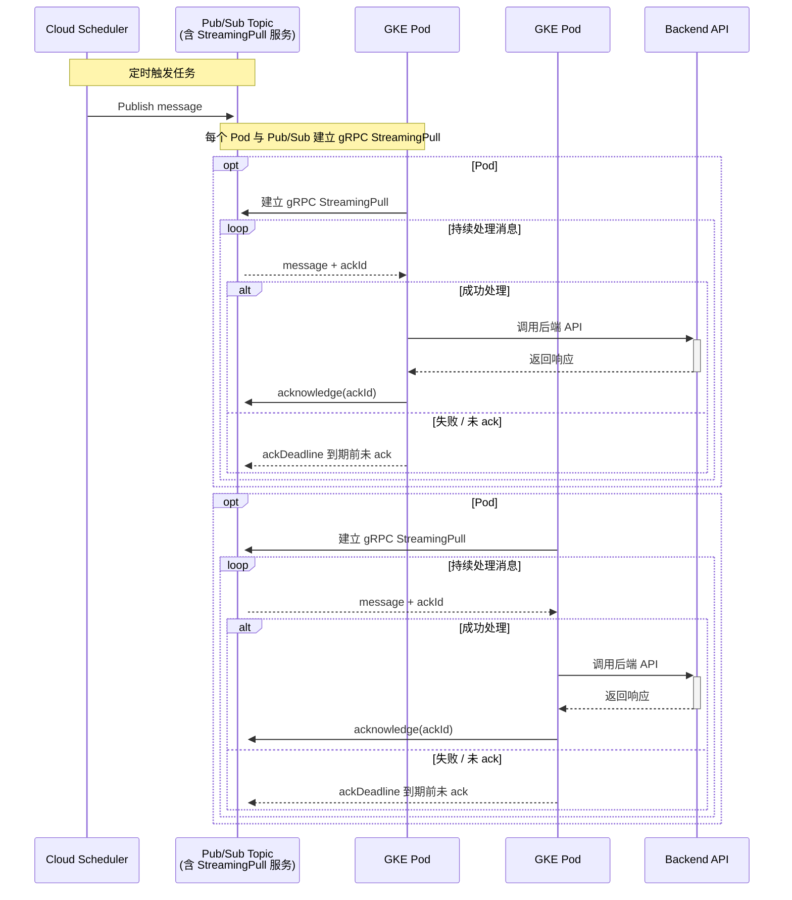
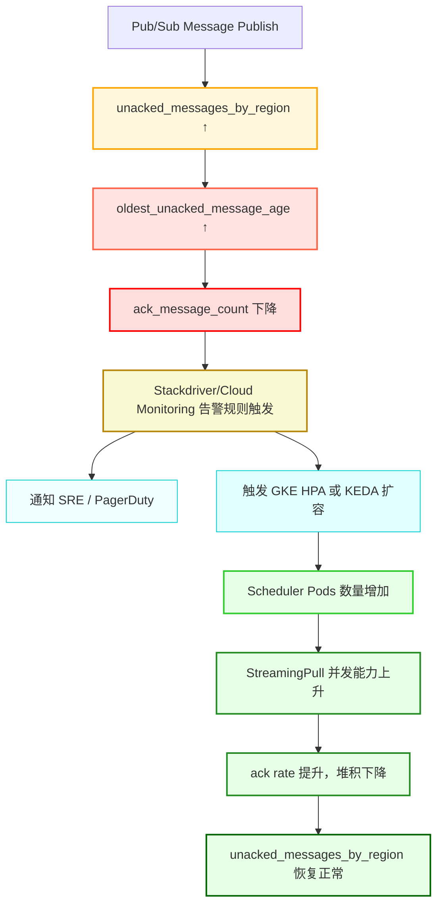

1. **Pub/Sub PULL 模式完整流程图**
2. **StreamingPull 并发机制详解**
3. **消费堆积 ➝ 指标异常 ➝ 告警 ➝ 自动扩容 ➝ 恢复** 全链路演化图
4. 建议告警阈值表格

---

## **📡 Google Pub/Sub PULL 模式 + GKE StreamingPull 架构说明**

### **1️⃣ 消费流程图（含 StreamingPull 细节）**

    Note over Pod1,Pod2:
    - 每个 Pod 是独立的 Subscriber Client\n
    - 每个 Pod 维护自己的 StreamingPull 会话与 ack 逻辑\n
    - 每条消息都有独立的 ackDeadline（由拉取方管理）\n
    - 某个 Pod 崩溃或处理失败不会影响其他 Pod 的消费\n
    - Pub/Sub 会在 ackDeadline 到期后将消息重新分发给其他 Pod\n
    - 扩容 Pod 数量 == 横向扩展 StreamingPull 并发能力，提升吞吐并降低堆积

---

### **2️⃣ 指标异常 ➝ 告警 ➝ 自动修复流程图**

---

### **3️⃣ 推荐告警指标与阈值配置表格**

| **指标名**                             | **建议阈值**                       | **告警等级** | **含义说明**             |
| -------------------------------------- | ---------------------------------- | ------------ | ------------------------ |
| unacked_messages_by_region             | ≥ 500 持续 5 分钟                  | 高           | 消费端积压               |
| oldest_unacked_message_age             | ≥ 60 秒                            | 高           | ack 过慢导致重试延迟     |
| ack_message_count / send_message_count | < 60% 比例维持 5 分钟              | 中           | ack 成功率下降           |
| GKE Pod CPU 使用率                     | < 40% 持续 10 分钟（但堆积在增长） | 提醒         | 可能过限流或客户端未扩容 |

---

