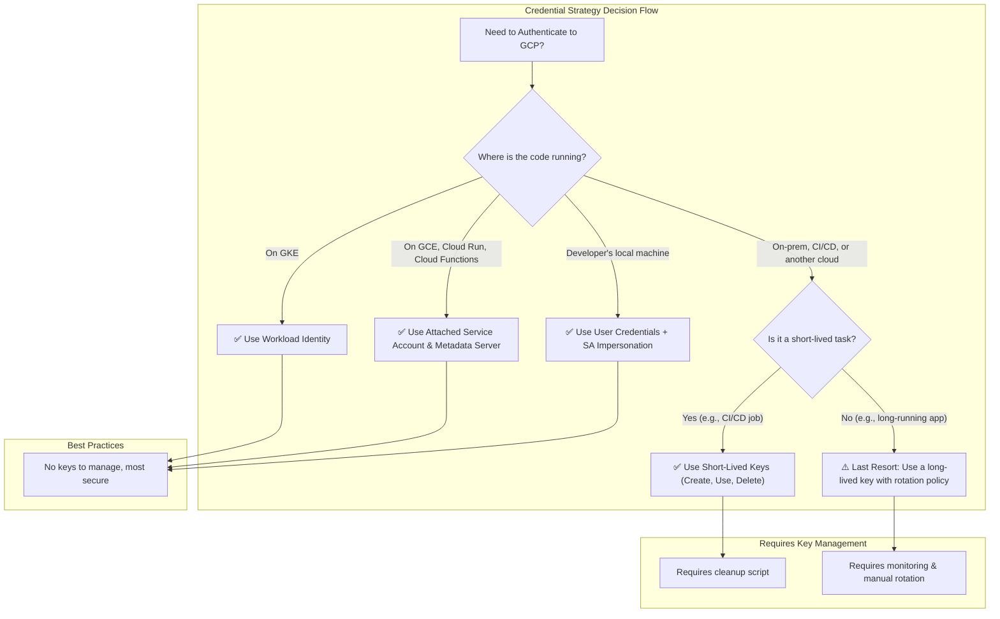

# GCP Service Account Key Housekeeping: Best Practices and Automation

## 1. Problem Statement

GCP Service Accounts are limited to a maximum of **10 keys** per account. When this limit is reached, any attempt to create a new key will fail. This can halt deployments, break CI/CD pipelines, and disrupt applications that rely on acquiring new keys for authentication.

The core issue is not the limit itself, but a lack of proper **key lifecycle management**. Keys are often created but not deleted, treating them as permanent, long-lived credentials when they should be temporary and ephemeral.

## 2. The Golden Rule: Avoid Service Account Keys When Possible

The most effective way to prevent key management issues is to avoid using keys altogether. GCP provides modern, more secure alternatives.



### 2.1. Workload Identity (For GKE)

This is the **recommended best practice** for GKE. It binds a Kubernetes Service Account (KSA) to a GCP Service Account (GSA). Pods running with the KSA can automatically assume the identity of the GSA without needing a key file.

- **How it works**: The GKE metadata server provides short-lived tokens to the pod.
- **Benefit**: No keys to create, manage, download, or rotate. It's the most secure and convenient method for GKE.

### 2.2. Service Account Impersonation

For developers on a local machine or applications running outside GCP, instead of downloading a key, they can use their own user credentials (or another SA) to impersonate the target Service Account.

- **How it works**: A user with the `iam.serviceAccountTokenCreator` role can generate short-lived OAuth 2.0 tokens for an SA.
- **Benefit**: Avoids distributing and securing long-lived static keys. Access is tied to a user's identity, which can be easily revoked.

```bash
# Example: A developer authenticates with their own account
gcloud auth application-default login

# Configure your application to use the target SA through impersonation
export GOOGLE_IMPERSONATE_SERVICE_ACCOUNT="your-sa@your-project.iam.gserviceaccount.com"

# Your application will now transparently use the impersonated SA's permissions
```

### 2.3. Attached Service Accounts (For GCP Compute)

For workloads running on GCE, Cloud Run, Cloud Functions, etc., you can attach a Service Account directly to the resource. The code running on that resource can then obtain credentials from the local metadata server.

- **Benefit**: No keys are needed. Credentials are automatically managed and rotated by Google.

## 3. Strategy: Automated Key Housekeeping

If you absolutely must use keys (e.g., for external systems or legacy CI/CD), the solution is automation. The following script identifies and deletes old keys to keep the key count below the limit.

### 3.1. Key Cleanup Script

This script deletes keys older than a specified number of days, but always keeps a minimum number of recent keys.

**File: `sa-key-cleanup.sh`**
```bash
#!/bin/bash

# Exit immediately if a command exits with a non-zero status.
set -e

# --- Configuration ---
GCP_SA_EMAIL=$1
# Number of days after which a key is considered old and can be deleted.
DAYS_TO_KEEP=30
# Minimum number of keys to keep, regardless of their age.
MIN_KEYS_TO_KEEP=2
# Set to "true" to actually delete keys. "false" will only print what would be deleted.
DRY_RUN="true"

# --- Color Codes ---
GREEN='\033[0;32m'
RED='\033[0;31m'
YELLOW='\033[1;33m'
NC='\033[0m'

# --- Validation ---
if [ -z "$GCP_SA_EMAIL" ]; then
    echo -e "${RED}Usage: $0 <gcp-service-account-email> [days_to_keep] [min_keys_to_keep]${NC}"
    echo "Example: $0 my-sa@my-project.iam.gserviceaccount.com 30 2"
    exit 1
fi

if [ ! -z "$2" ]; then
    DAYS_TO_KEEP=$2
fi
if [ ! -z "$3" ]; then
    MIN_KEYS_TO_KEEP=$3
fi

PROJECT_ID=$(echo ${GCP_SA_EMAIL} | cut -d'@' -f2 | cut -d'.' -f1)
CUTOFF_DATE=$(date -d "-${DAYS_TO_KEEP} days" -u +"%Y-%m-%dT%H:%M:%SZ")

echo -e "Running key cleanup for SA: ${GREEN}${GCP_SA_EMAIL}${NC}"
echo "Project: ${PROJECT_ID}"
echo "Deleting keys older than: ${YELLOW}${CUTOFF_DATE}${NC} (${DAYS_TO_KEEP} days)"
echo "Keeping a minimum of: ${YELLOW}${MIN_KEYS_TO_KEEP}${NC} keys"
if [ "$DRY_RUN" = "true" ]; then
    echo -e "${YELLOW}DRY RUN mode is enabled. No keys will be deleted.${NC}"
fi
echo "--------------------------------------------------"

# --- Main Logic ---

# Get all keys, sorted by creation time (oldest first)
KEYS_JSON=$(gcloud iam service-accounts keys list --iam-account="${GCP_SA_EMAIL}" --project="${PROJECT_ID}" --sort-by=validAfterTime --format=json)

KEY_IDS_TO_DELETE=()
TOTAL_KEY_COUNT=$(echo "${KEYS_JSON}" | jq 'length')
KEYS_TO_PROCESS_COUNT=$((TOTAL_KEY_COUNT - MIN_KEYS_TO_KEEP))

if [ ${KEYS_TO_PROCESS_COUNT} -le 0 ]; then
    echo -e "${GREEN}Key count (${TOTAL_KEY_COUNT}) is within the minimum to keep (${MIN_KEYS_TO_KEEP}). No keys to check for deletion.${NC}"
    exit 0
fi

echo "Found ${TOTAL_KEY_COUNT} keys. Checking the oldest ${KEYS_TO_PROCESS_COUNT} for potential deletion."

# Iterate through the oldest keys and check if they are past the cutoff date
echo "${KEYS_JSON}" | jq -c ".[:${KEYS_TO_PROCESS_COUNT}] | .[]" | while read key; do
    KEY_ID=$(echo "${key}" | jq -r '.name' | cut -d'/' -f6)
    KEY_CREATED_TIME=$(echo "${key}" | jq -r '.validAfterTime')

    if [[ "${KEY_CREATED_TIME}" < "${CUTOFF_DATE}" ]]; then
        echo -e "Key ${YELLOW}${KEY_ID}${NC} (created ${KEY_CREATED_time}) is older than cutoff. Marked for deletion."
        KEY_IDS_TO_DELETE+=("${KEY_ID}")
    else
        echo -e "Key ${YELLOW}${KEY_ID}${NC} (created ${KEY_CREATED_TIME}) is newer than cutoff. Keeping."
    fi
done

# --- Deletion Phase ---
if [ ${#KEY_IDS_TO_DELETE[@]} -eq 0 ]; then
    echo -e "\n${GREEN}No old keys found to delete.${NC}"
else
    echo -e "\nFound ${#KEY_IDS_to_DELETE[@]} keys to delete."
    for KEY_ID in "${KEY_IDS_TO_DELETE[@]}"; do
        if [ "$DRY_RUN" = "true" ]; then
            echo -e "[DRY RUN] Would delete key: ${YELLOW}${KEY_ID}${NC}"
        else
            echo -e "${RED}Deleting key: ${KEY_ID}...${NC}"
            gcloud iam service-accounts keys delete "${KEY_ID}" --iam-account="${GCP_SA_EMAIL}" --project="${PROJECT_ID}" -q
            echo -e "${GREEN}Successfully deleted key ${KEY_ID}.${NC}"
        fi
    done
fi

echo -e "\nCleanup complete."
```

### 3.2. How to Use the Script

1.  **Save the script** as `sa-key-cleanup.sh` and make it executable:
    ```bash
    chmod +x sa-key-cleanup.sh
    ```

2.  **Perform a Dry Run**: Always run in dry-run mode first to see which keys *would* be deleted.
    ```bash
    # Dry run with default settings (delete keys older than 30 days, keep at least 2)
    ./sa-key-cleanup.sh your-sa@your-project.iam.gserviceaccount.com

    # Dry run with custom settings (delete keys older than 7 days, keep at least 3)
    ./sa-key-cleanup.sh your-sa@your-project.iam.gserviceaccount.com 7 3
    ```

3.  **Execute Deletion**: Once you are confident, set `DRY_RUN="false"` inside the script and run it again.

### 3.3. Automate with Cloud Scheduler

You can run this script automatically on a schedule (e.g., daily) using Cloud Scheduler and a small GCE instance or Cloud Run job.

## 4. Monitoring and Alerting

Proactively monitor the number of keys to prevent hitting the limit unexpectedly.

1.  **Go to Google Cloud Monitoring > Metrics Explorer**.
2.  **Select the Metric**:
    *   Resource Type: `Service Account`
    *   Metric: `Key count` (`iam.googleapis.com/service_account/key/num_keys`)
3.  **Filter** by `service_account_id` to target specific, critical service accounts.
4.  **Create an Alerting Policy**:
    *   Set the threshold to a value like `8`.
    *   Configure notifications (Email, Slack, PagerDuty) to alert the responsible team when the key count gets high.

This gives you time to investigate and manually clean up keys before the limit is reached and causes an outage.
