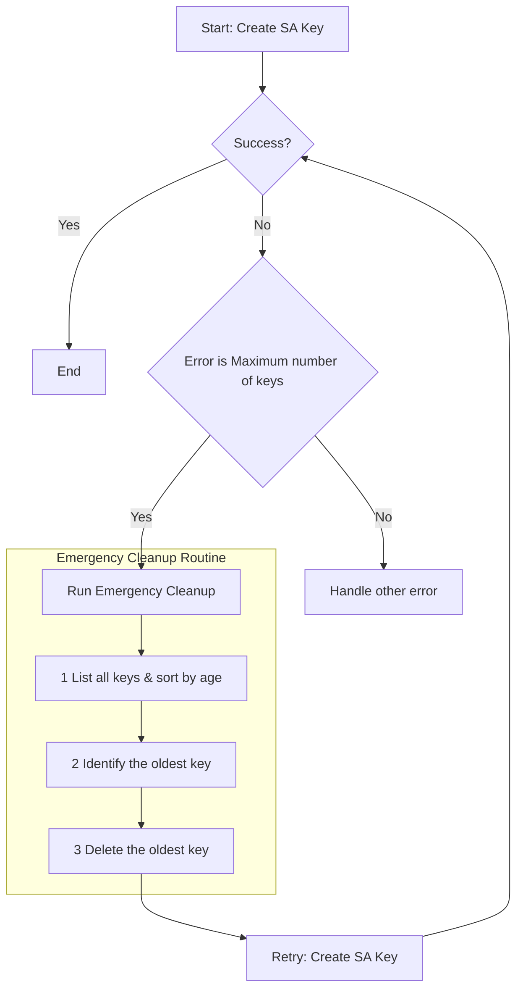

# Handling GCP Service Account Key Quota Errors

This document provides a focused guide on how to react when you encounter the "maximum number of keys" error for a GCP Service Account. This is an emergency-focused guide for immediate remediation. For long-term prevention, please refer to `gcp-sa-housekeep.md`.

## 1. The Failure Scenario: Hitting the 10-Key Limit

When you attempt to create an 11th key for a Service Account that already has 10 keys, the `gcloud` command or API call will fail.

**Example `gcloud` Error:**

```text
ERROR: (gcloud.iam.service-accounts.keys.create) FAILED_PRECONDITION: The service account has reached the maximum number of keys.
- '@type': type.googleapis.com/google.rpc.PreconditionFailure
  violations:
  - description: The service account has reached the maximum number of keys.
    subject: projects/your-project/serviceAccounts/your-sa@your-project.iam.gserviceaccount.com
    type: google.iam.v1
```

This error will block any process, such as a CI/CD pipeline, that depends on creating a new key.

## 2. Emergency Remediation Flow

When this failure occurs and you need to get unblocked immediately, follow this reactive flow.



### Step-by-Step Manual Triage

Let's say your pipeline failed trying to create a key for `your-sa@your-project.iam.gserviceaccount.com`.

**1. List All Keys to Identify the Oldest:**

Use this command to list all existing keys, sorted by their creation date (oldest first).

```bash
GCP_SA_EMAIL="your-sa@your-project.iam.gserviceaccount.com"
PROJECT_ID=$(echo ${GCP_SA_EMAIL} | cut -d'@' -f2 | cut -d'.' -f1)

gcloud iam service-accounts keys list \
    --iam-account="${GCP_SA_EMAIL}" \
    --project="${PROJECT_ID}" \
    --sort-by="validAfterTime" \
    --format="table(name.basename(), validAfterTime)"
```

**Example Output:**

```
KEY_ID                                VALID_AFTER_TIME
1234567890abcdef1234567890abcdef12345678 2024-01-15T10:00:00Z  <-- OLDEST KEY
fedcba098765fedcba098765fedcba098765fedcba 2024-03-20T11:30:00Z
...
(8 other keys)
...
```

**2. Delete the Oldest Key:**

Based on the output above, the oldest key is `1234567890abcdef1234567890abcdef12345678`. Delete it to make room.

```bash
KEY_TO_DELETE="1234567890abcdef1234567890abcdef12345678"

gcloud iam service-accounts keys delete "${KEY_TO_DELETE}" \
    --iam-account="${GCP_SA_EMAIL}" \
    --project="${PROJECT_ID}"
```

**3. Retry the Original Operation:**

Now that a slot has been freed up, re-run the failed pipeline or command that was trying to create a new key. It should now succeed.

## 3. Automated Remediation: Create-or-Cleanup Script

For critical automation, you can build the remediation logic directly into your key creation script. This script attempts to create a key, and if it fails due to the quota error, it automatically deletes the oldest key and retries.

**File: `create-key-with-cleanup.sh`**
```bash
#!/bin/bash
set -e

GCP_SA_EMAIL=$1
KEY_OUTPUT_FILE=$2

if [ -z "$GCP_SA_EMAIL" ] || [ -z "$KEY_OUTPUT_FILE" ]; then
    echo "Usage: $0 <gcp-service-account-email> <output-file.json>"
    exit 1
fi

PROJECT_ID=$(echo ${GCP_SA_EMAIL} | cut -d'@' -f2 | cut -d'.' -f1)

# --- Attempt to create the key ---
echo "Attempting to create a new key for ${GCP_SA_EMAIL}..."
if gcloud iam service-accounts keys create "${KEY_OUTPUT_FILE}" --iam-account="${GCP_SA_EMAIL}" --project="${PROJECT_ID}"; then
    echo "Successfully created new key: ${KEY_OUTPUT_FILE}"
    exit 0
fi

# --- If creation fails, check for quota error and remediate ---
echo "Key creation failed. Checking if it was a quota issue..."

# The gcloud command above will have a non-zero exit code. 
# A more robust solution would capture stderr and check the error message.
# For this example, we assume any failure is the quota error and proceed.

echo "Assuming quota limit was reached. Starting automated cleanup..."

# 1. Find the oldest key
OLDEST_KEY_ID=$(gcloud iam service-accounts keys list \
    --iam-account="${GCP_SA_EMAIL}" \
    --project="${PROJECT_ID}" \
    --sort-by="validAfterTime" \
    --limit=1 \
    --format="value(name.basename())")

if [ -z "$OLDEST_KEY_ID" ]; then
    echo "Could not find a key to delete. Exiting."
    exit 1
fi

echo "Oldest key found: ${OLDEST_KEY_ID}. Deleting it to make space..."

# 2. Delete the oldest key
gcloud iam service-accounts keys delete "${OLDEST_KEY_ID}" \
    --iam-account="${GCP_SA_EMAIL}" \
    --project="${PROJECT_ID}" -q

echo "Successfully deleted old key. Retrying key creation..."

# 3. Retry creating the key
if gcloud iam service-accounts keys create "${KEY_OUTPUT_FILE}" --iam-account="${GCP_SA_EMAIL}" --project="${PROJECT_ID}"; then
    echo "Successfully created new key on the second attempt: ${KEY_OUTPUT_FILE}"
    exit 0
else
    echo "Failed to create key even after cleanup. Please investigate manually."
    exit 1
fi
```

### How to Use the Automated Script

This script becomes your new, safer way to create keys in an automated environment.

```bash
# This will either create a key directly, or clean up an old one first and then create it.
./create-key-with-cleanup.sh your-sa@your-project.iam.gserviceaccount.com /path/to/new-key.json
```

## 4. Prevention is Better Than Cure

This reactive approach is a valuable safety net, but it should not be the primary strategy. The best solution is to avoid this problem in the first place by:

1.  **Using Keyless Methods**: Adopt **Workload Identity** on GKE or **Service Account Impersonation** where possible.
2.  **Proactive Monitoring**: Set up alerts on the `iam.googleapis.com/service_account/key/num_keys` metric to get notified *before* you hit the limit.
3.  **Scheduled Housekeeping**: Run the cleanup script from `gcp-sa-housekeep.md` on a daily or weekly schedule.

By combining proactive prevention with a reactive safety net, you can build a robust and resilient system for managing Service Account credentials.
