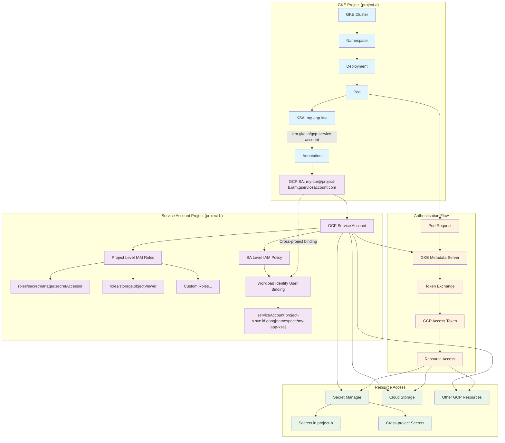
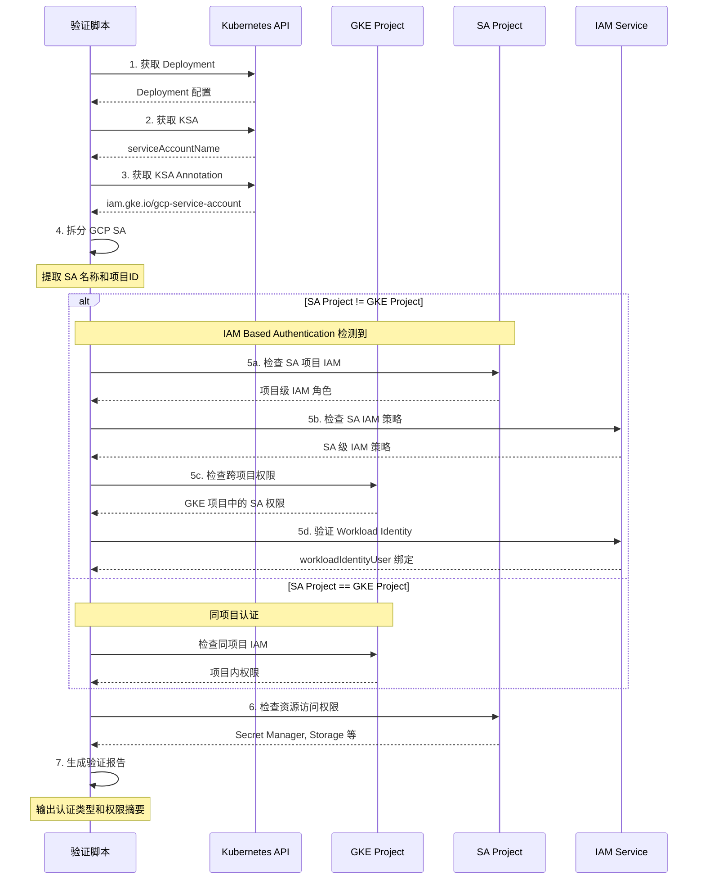
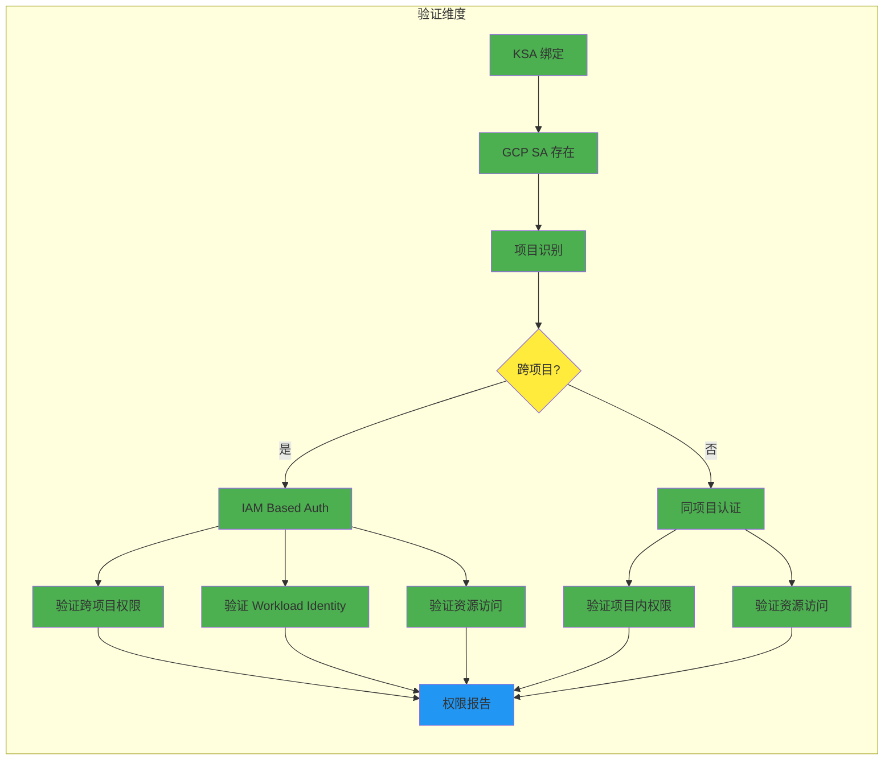

# GKE KSA IAM Based Authentication Flow

基于验证脚本逆推的 GKE Kubernetes Service Account (KSA) IAM based authentication 逻辑流程图。

## 架构流程图



## 详细验证步骤流程



## 权限验证矩阵



## 关键配置要素

### 1. KSA Annotation
```yaml
apiVersion: v1
kind: ServiceAccount
metadata:
  name: my-app-ksa
  namespace: my-namespace
  annotations:
    iam.gke.io/gcp-service-account: my-sa@project-b.iam.gserviceaccount.com
```

### 2. Workload Identity 绑定
```bash
gcloud iam service-accounts add-iam-policy-binding \
    my-sa@project-b.iam.gserviceaccount.com \
    --role roles/iam.workloadIdentityUser \
    --member "serviceAccount:project-a.svc.id.goog[my-namespace/my-app-ksa]"
```

### 3. 资源权限
```bash
gcloud projects add-iam-policy-binding project-b \
    --member "serviceAccount:my-sa@project-b.iam.gserviceaccount.com" \
    --role "roles/secretmanager.secretAccessor"
```

## 验证要点

1. **跨项目识别**: SA 邮箱中的项目ID与GKE项目ID不同
2. **Workload Identity**: 必须有正确的 workloadIdentityUser 绑定
3. **权限传递**: SA 在其所属项目中的权限会传递给 Pod
4. **资源访问**: 验证实际的资源访问权限（Secret Manager, Storage 等）