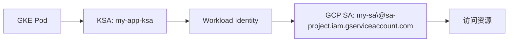

# IAM Based Authentication 详解

## 什么是 IAM Based Authentication？

IAM Based Authentication 是 Google Cloud 中一种跨项目的身份认证机制，它允许一个项目中的工作负载（如 GKE Pod、Cloud Run 服务）使用另一个项目中的 Service Account 来访问资源。

## 核心概念

### 传统认证 vs IAM Based Authentication

**传统认证（同项目）:**
```
GKE Project A
├── GKE Cluster
├── Pod (使用 KSA)
└── GCP Service Account A  ← 同一项目
    └── 访问 Project A 的资源
```

**IAM Based Authentication（跨项目）:**
```
GKE Project A                    Service Account Project B
├── GKE Cluster                  ├── GCP Service Account B
├── Pod (使用 KSA) ──────────────┤   ├── IAM 权限
└── Workload Identity 绑定        │   └── 访问 Project B/C/D 的资源
                                 └── 跨项目权限管理
```

## 为什么需要 IAM Based Authentication？

### 1. 集中化权限管理
- **问题**: 每个 GKE 项目都需要创建和管理自己的 Service Account
- **解决**: 在专门的项目中集中管理 Service Account，统一权限策略

### 2. 跨项目资源访问
- **场景**: GKE 在项目 A，但需要访问项目 B 的 Secret Manager、项目 C 的 Cloud Storage
- **传统方式**: 需要在每个资源项目中给 GKE 项目的 SA 授权
- **IAM Based**: 使用项目 B 的 SA，天然拥有项目 B 的权限，再跨项目授权给其他项目

### 3. 安全隔离
- **权限隔离**: Service Account 的管理权限与 GKE 的运维权限分离
- **最小权限**: 每个应用使用专门的 SA，避免权限过度集中

## 工作原理

### 1. 身份映射关系


### 2. 认证流程
```bash
# 1. Pod 请求访问令牌
curl -H "Metadata-Flavor: Google" \
  http://metadata.google.internal/computeMetadata/v1/instance/service-accounts/default/token

# 2. GKE 元数据服务器验证 KSA
# 3. 通过 Workload Identity 映射到 GCP SA
# 4. 返回 GCP SA 的访问令牌
# 5. 使用令牌访问 GCP 资源
```

## 配置步骤

### 1. 创建 Service Account（在 SA 项目中）
```bash
# 在专门的 SA 管理项目中创建
gcloud iam service-accounts create my-app-sa \
    --display-name="My App Service Account" \
    --project=sa-management-project
```

### 2. 授予资源权限
```bash
# 授予访问 Secret Manager 的权限
gcloud projects add-iam-policy-binding resource-project \
    --member="serviceAccount:my-app-sa@sa-management-project.iam.gserviceaccount.com" \
    --role="roles/secretmanager.secretAccessor"
```

### 3. 配置 Workload Identity 绑定
```bash
# 允许 GKE 项目的 KSA 使用这个 GCP SA
gcloud iam service-accounts add-iam-policy-binding \
    my-app-sa@sa-management-project.iam.gserviceaccount.com \
    --role="roles/iam.workloadIdentityUser" \
    --member="serviceAccount:gke-project.svc.id.goog[namespace/my-app-ksa]" \
    --project=sa-management-project
```

### 4. 配置 KSA Annotation
```yaml
apiVersion: v1
kind: ServiceAccount
metadata:
  name: my-app-ksa
  namespace: my-namespace
  annotations:
    iam.gke.io/gcp-service-account: my-app-sa@sa-management-project.iam.gserviceaccount.com
```

## 实际应用场景

### 场景 1: 多环境部署
```
开发环境 GKE (dev-project)     ──┐
测试环境 GKE (test-project)    ──┼── 使用 ──→ SA Project (sa-project)
生产环境 GKE (prod-project)    ──┘              ├── dev-app-sa
                                                ├── test-app-sa
                                                └── prod-app-sa
```

### 场景 2: 微服务架构
```
GKE Cluster (app-project)
├── Service A ──→ sa-a@sa-project.iam.gserviceaccount.com
├── Service B ──→ sa-b@sa-project.iam.gserviceaccount.com
└── Service C ──→ sa-c@sa-project.iam.gserviceaccount.com

每个服务使用专门的 SA，权限精确控制
```

### 场景 3: 跨组织资源访问
```
组织 A 的 GKE ──→ 组织 B 的 SA ──→ 访问组织 B 的资源
                              └──→ 访问组织 C 的资源（通过授权）
```

## 优势与挑战

### 优势
1. **集中管理**: 所有 SA 在一个项目中，便于管理和审计
2. **权限精确**: 每个应用使用专门的 SA，最小权限原则
3. **跨项目访问**: 天然支持跨项目资源访问
4. **安全隔离**: SA 管理权限与应用运维权限分离

### 挑战
1. **复杂性**: 配置比同项目认证复杂
2. **调试难度**: 跨项目权限问题排查困难
3. **依赖关系**: GKE 项目依赖 SA 项目的可用性
4. **权限传播**: 需要理解权限如何在项目间传播

## 最佳实践

### 1. 项目结构设计
```
├── sa-management-project (集中管理所有 SA)
├── gke-dev-project (开发环境 GKE)
├── gke-prod-project (生产环境 GKE)
├── resources-project-a (资源项目 A)
└── resources-project-b (资源项目 B)
```

### 2. 命名规范
```bash
# SA 命名: {environment}-{service}-{purpose}-sa
dev-user-service-api-sa@sa-project.iam.gserviceaccount.com
prod-order-service-db-sa@sa-project.iam.gserviceaccount.com

# KSA 命名: {service}-ksa
user-service-ksa
order-service-ksa
```

### 3. 权限管理
- 使用 IAM Conditions 进行细粒度控制
- 定期审计 SA 权限
- 实施权限最小化原则
- 使用 IAM Recommender 优化权限

### 4. 监控和审计
```bash
# 监控 SA 使用情况
gcloud logging read "protoPayload.authenticationInfo.principalEmail:*@sa-project.iam.gserviceaccount.com"

# 审计权限变更
gcloud logging read "protoPayload.serviceName=iam.googleapis.com"
```

## 总结

IAM Based Authentication 是 GCP 中一种强大的跨项目认证机制，它通过 Workload Identity 将 Kubernetes Service Account 与 Google Cloud Service Account 绑定，实现了集中化的权限管理和跨项目资源访问。虽然配置相对复杂，但在大型组织和多项目环境中，它提供了更好的安全性、可管理性和灵活性。