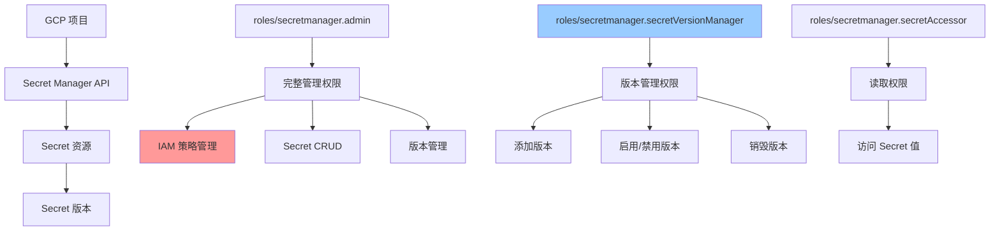
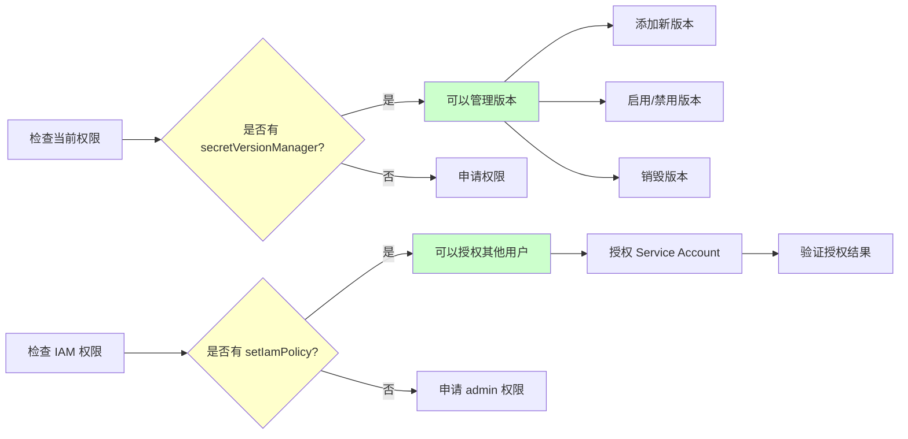

关于 GCP的 secert manager，假如我个人已经在一个对应的组里而这个组有对应的roles/secretmanager.secretVersionManager权限。 那么我是不是就可以使用  gcloud secrets add-iam-policy-binding 这个命令给对应的其他用户来授权。 如果我的想法是可以的 ，那么你可以帮我是否写一个脚本。然后让我给对应的 Service account授权。比如说我可以添加其对应的权限为 roles/secretmanager.secretAccessor 另外 ，我作为这个超级权限secretVersionManager那么是不是可以管理工程里面所有的 secret？比如说gcloud secrets versions add 来给对应的 secret的 key添加新的值。 如果这个想法可行 ，你可以帮我输出关于这个添加的命令 ，也就是说我只要打印出来如何添加就可以了。 


拥有 roles/secretmanager.secretVersionManager 权限可以管理IAM策略绑定
可以给Service Account授权 roles/secretmanager.secretAccessor 权限
可以管理所有secret的版本和值

主要功能：

给Service Account授权 - 使用 roles/secretmanager.secretAccessor 权限
给Secret添加新版本 - 支持直接输入或从文件读取
列出所有secrets - 查看项目中的所有secrets
显示常用命令 - 提供完整的命令示例
使用方式：

# 交互式使用
./gcp/secret-manage/secret-manager-admin.sh

# 直接使用特定功能
./gcp/secret-manage/secret-manager-admin.sh --grant-access
./gcp/secret-manage/secret-manager-admin.sh --add-secret-version
./gcp/secret-manage/secret-manager-admin.sh --show-commands
关于你的权限问题：

✅ 拥有 roles/secretmanager.secretVersionManager 权限确实可以使用 gcloud secrets add-iam-policy-binding 命令
✅ 可以给Service Account授权 roles/secretmanager.secretAccessor 权限
✅ 可以管理项目中所有secret的版本，使用 gcloud secrets versions add 命令
脚本已经设置为可执行，你可以直接运行使用。它会引导你完成各种操作，并显示执行的具体命令，方便你学习和调试。


# GCP Secret Manager 权限管理分析

## 问题分析

您提出了两个核心问题：

1. 拥有 `roles/secretmanager.secretVersionManager` 角色是否可以授权其他用户
2. 该角色是否可以管理项目中所有 Secret 的版本

## 权限机制说明

### roles/secretmanager.secretVersionManager 权限范围

该角色包含以下权限：

- `secretmanager.versions.add` - 添加新版本
- `secretmanager.versions.destroy` - 销毁版本
- `secretmanager.versions.disable` - 禁用版本
- `secretmanager.versions.enable` - 启用版本
- `secretmanager.versions.get` - 获取版本
- `secretmanager.versions.list` - 列出版本

**重要限制**：

- ❌ **不包含** `secretmanager.secrets.setIamPolicy` 权限
- ❌ **无法** 使用 `gcloud secrets add-iam-policy-binding` 授权
- ✅ **可以** 管理 Secret 版本（添加、启用、禁用、销毁）
- ⚠️ **仅限** 您有权限的 Secret，不是项目所有 Secret

### 权限层级关系



## 解决方案

### 方案一：授权 Service Account（需要额外权限）

**前提条件**：您需要 `roles/secretmanager.admin` 或包含 `secretmanager.secrets.setIamPolicy` 的自定义角色

#### 单个 Secret 授权脚本

```bash
#!/bin/bash

# 配置变量
PROJECT_ID="your-project-id"
SECRET_NAME="your-secret-name"
SERVICE_ACCOUNT="sa-name@project-id.iam.gserviceaccount.com"
ROLE="roles/secretmanager.secretAccessor"

# 授权命令
gcloud secrets add-iam-policy-binding ${SECRET_NAME} \
    --project=${PROJECT_ID} \
    --member="serviceAccount:${SERVICE_ACCOUNT}" \
    --role="${ROLE}"

# 验证授权
echo "验证授权结果："
gcloud secrets get-iam-policy ${SECRET_NAME} \
    --project=${PROJECT_ID} \
    --filter="bindings.members:serviceAccount:${SERVICE_ACCOUNT}"
```

#### 批量授权脚本

```bash
#!/bin/bash

# 配置变量
PROJECT_ID="your-project-id"
SERVICE_ACCOUNT="sa-name@project-id.iam.gserviceaccount.com"
ROLE="roles/secretmanager.secretAccessor"

# Secret 列表文件（每行一个 Secret 名称）
SECRET_LIST_FILE="secrets.txt"

# 检查文件是否存在
if [ ! -f "${SECRET_LIST_FILE}" ]; then
    echo "错误：${SECRET_LIST_FILE} 文件不存在"
    exit 1
fi

# 批量授权
while IFS= read -r SECRET_NAME; do
    # 跳过空行和注释
    [[ -z "${SECRET_NAME}" || "${SECRET_NAME}" =~ ^#.*$ ]] && continue
    
    echo "正在授权 Secret: ${SECRET_NAME}"
    
    gcloud secrets add-iam-policy-binding "${SECRET_NAME}" \
        --project="${PROJECT_ID}" \
        --member="serviceAccount:${SERVICE_ACCOUNT}" \
        --role="${ROLE}" \
        2>&1 | grep -v "Updated IAM policy" || echo "  ✓ 授权成功"
    
done < "${SECRET_LIST_FILE}"

echo "批量授权完成"
```

**secrets.txt 示例**：

```text
# 数据库密钥
db-password
db-connection-string

# API 密钥
api-key-prod
api-key-staging

# 证书
tls-cert
tls-key
```

### 方案二：添加 Secret 版本（可用）

✅ 您可以直接使用此功能

#### 添加新版本命令

```bash
# 方式 1：从标准输入添加
echo -n "new-secret-value" | gcloud secrets versions add SECRET_NAME \
    --project=PROJECT_ID \
    --data-file=-

# 方式 2：从文件添加
gcloud secrets versions add SECRET_NAME \
    --project=PROJECT_ID \
    --data-file=/path/to/secret/file

# 方式 3：从环境变量添加
export SECRET_VALUE="new-secret-value"
echo -n "${SECRET_VALUE}" | gcloud secrets versions add SECRET_NAME \
    --project=PROJECT_ID \
    --data-file=-
```

#### 完整版本管理脚本

```bash
#!/bin/bash

# 配置变量
PROJECT_ID="your-project-id"
SECRET_NAME="your-secret-name"

# 函数：添加新版本
add_secret_version() {
    local secret_name=$1
    local secret_value=$2
    
    echo "添加新版本到 ${secret_name}"
    echo -n "${secret_value}" | gcloud secrets versions add "${secret_name}" \
        --project="${PROJECT_ID}" \
        --data-file=- \
        2>&1
    
    if [ $? -eq 0 ]; then
        echo "✓ 版本添加成功"
        # 获取最新版本号
        local latest_version=$(gcloud secrets versions list "${secret_name}" \
            --project="${PROJECT_ID}" \
            --limit=1 \
            --format="value(name)")
        echo "最新版本号: ${latest_version}"
    else
        echo "✗ 版本添加失败"
        return 1
    fi
}

# 函数：列出所有版本
list_versions() {
    local secret_name=$1
    echo "Secret: ${secret_name} 的所有版本："
    gcloud secrets versions list "${secret_name}" \
        --project="${PROJECT_ID}" \
        --format="table(name,state,createTime)"
}

# 函数：禁用旧版本
disable_old_version() {
    local secret_name=$1
    local version_id=$2
    
    echo "禁用版本 ${version_id}"
    gcloud secrets versions disable "${version_id}" \
        --secret="${secret_name}" \
        --project="${PROJECT_ID}"
}

# 使用示例
echo "=== Secret 版本管理 ==="

# 1. 添加新版本
read -sp "请输入新的 Secret 值: " NEW_SECRET_VALUE
echo
add_secret_version "${SECRET_NAME}" "${NEW_SECRET_VALUE}"

# 2. 列出所有版本
list_versions "${SECRET_NAME}"

# 3. 可选：禁用旧版本
# disable_old_version "${SECRET_NAME}" "1"
```

## 实际操作流程



## 权限验证命令

### 验证您当前的权限

```bash
# 1. 检查项目级别权限
gcloud projects get-iam-policy PROJECT_ID \
    --flatten="bindings[].members" \
    --filter="bindings.members:user:YOUR_EMAIL"

# 2. 检查特定 Secret 的权限
gcloud secrets get-iam-policy SECRET_NAME \
    --project=PROJECT_ID

# 3. 测试是否可以添加版本
gcloud secrets versions list SECRET_NAME \
    --project=PROJECT_ID \
    --limit=1

# 4. 测试是否可以修改 IAM 策略（预期失败）
gcloud secrets get-iam-policy SECRET_NAME \
    --project=PROJECT_ID > /tmp/policy.yaml

# 尝试设置（如果失败说明没有权限）
gcloud secrets set-iam-policy SECRET_NAME \
    --project=PROJECT_ID \
    /tmp/policy.yaml
```

## 注意事项

### ⚠️ 重要限制

1. **IAM 授权限制**
    
    - `roles/secretmanager.secretVersionManager` **不能** 授权其他用户
    - 需要 `roles/secretmanager.admin` 或自定义角色包含 `secretmanager.secrets.setIamPolicy`
2. **Secret 访问范围**
    
    - 只能管理您有权限的 Secret 版本
    - 不是项目中所有 Secret
    - 需要在 Secret 级别或项目级别被授予权限
3. **版本管理**
    
    - 添加版本不会自动删除旧版本
    - 建议定期清理禁用的版本
    - 销毁操作不可逆

### 🔒 安全最佳实践

```bash
# 1. 使用最小权限原则
# 仅授予必要的权限，避免使用 admin 角色

# 2. Secret 值不要硬编码
# 使用文件或环境变量传递

# 3. 定期轮换 Secret
# 建议使用脚本自动化轮换流程

# 4. 审计日志
gcloud logging read \
    "resource.type=secretmanager.googleapis.com/Secret" \
    --project=PROJECT_ID \
    --limit=50
```

## 总结

|操作|secretVersionManager|是否可行|所需额外权限|
|---|---|---|---|
|添加 Secret 版本|✅|是|无|
|禁用/启用版本|✅|是|无|
|销毁版本|✅|是|无|
|授权其他用户|❌|否|`secretmanager.secrets.setIamPolicy`|
|管理所有 Secret|❌|否|需在项目/组织级别授权|

**建议**：

- 如需授权功能，请联系项目管理员申请 `roles/secretmanager.admin` 角色
- 当前权限足够管理 Secret 版本，可直接使用方案二的脚本


```bash
#!/bin/bash

# GCP Secret Manager 管理脚本
# 需要当前用户拥有 roles/secretmanager.secretVersionManager 权限

set -e

# 颜色定义
RED='\033[0;31m'
GREEN='\033[0;32m'
YELLOW='\033[1;33m'
BLUE='\033[0;34m'
NC='\033[0m' # No Color

# 打印带颜色的消息
print_info() {
    echo -e "${BLUE}[INFO]${NC} $1"
}

print_success() {
    echo -e "${GREEN}[SUCCESS]${NC} $1"
}

print_warning() {
    echo -e "${YELLOW}[WARNING]${NC} $1"
}

print_error() {
    echo -e "${RED}[ERROR]${NC} $1"
}

# 显示帮助信息
show_help() {
    echo "GCP Secret Manager 管理脚本"
    echo ""
    echo "用法: $0 [选项]"
    echo ""
    echo "选项:"
    echo "  -h, --help              显示帮助信息"
    echo "  --grant-access          给Service Account授权访问权限"
    echo "  --add-secret-version    给Secret添加新版本"
    echo "  --list-secrets          列出所有secrets"
    echo "  --show-commands         显示常用命令示例"
    echo ""
}

# 给Service Account授权访问Secret的权限
grant_secret_access() {
    print_info "开始给Service Account授权Secret访问权限..."
    
    read -p "请输入Secret名称: " SECRET_NAME
    read -p "请输入Service Account邮箱 (例: my-sa@project.iam.gserviceaccount.com): " SERVICE_ACCOUNT
    read -p "请输入GCP项目ID: " PROJECT_ID
    
    if [[ -z "$SECRET_NAME" || -z "$SERVICE_ACCOUNT" || -z "$PROJECT_ID" ]]; then
        print_error "所有参数都是必需的"
        return 1
    fi
    
    print_info "执行命令: gcloud secrets add-iam-policy-binding $SECRET_NAME --member=\"serviceAccount:$SERVICE_ACCOUNT\" --role=\"roles/secretmanager.secretAccessor\" --project=$PROJECT_ID"
    
    if gcloud secrets add-iam-policy-binding "$SECRET_NAME" \
        --member="serviceAccount:$SERVICE_ACCOUNT" \
        --role="roles/secretmanager.secretAccessor" \
        --project="$PROJECT_ID"; then
        print_success "成功给Service Account $SERVICE_ACCOUNT 授权访问 Secret $SECRET_NAME"
    else
        print_error "授权失败"
        return 1
    fi
}

# 给Secret添加新版本
add_secret_version() {
    print_info "开始给Secret添加新版本..."
    
    read -p "请输入Secret名称: " SECRET_NAME
    read -p "请输入GCP项目ID: " PROJECT_ID
    echo "请选择输入方式:"
    echo "1) 直接输入值"
    echo "2) 从文件读取"
    read -p "选择 (1/2): " INPUT_METHOD
    
    if [[ -z "$SECRET_NAME" || -z "$PROJECT_ID" ]]; then
        print_error "Secret名称和项目ID是必需的"
        return 1
    fi
    
    case $INPUT_METHOD in
        1)
            read -s -p "请输入Secret值: " SECRET_VALUE
            echo ""
            if [[ -z "$SECRET_VALUE" ]]; then
                print_error "Secret值不能为空"
                return 1
            fi
            
            print_info "执行命令: echo '***' | gcloud secrets versions add $SECRET_NAME --data-file=- --project=$PROJECT_ID"
            
            if echo "$SECRET_VALUE" | gcloud secrets versions add "$SECRET_NAME" \
                --data-file=- \
                --project="$PROJECT_ID"; then
                print_success "成功给Secret $SECRET_NAME 添加新版本"
            else
                print_error "添加新版本失败"
                return 1
            fi
            ;;
        2)
            read -p "请输入文件路径: " FILE_PATH
            if [[ ! -f "$FILE_PATH" ]]; then
                print_error "文件不存在: $FILE_PATH"
                return 1
            fi
            
            print_info "执行命令: gcloud secrets versions add $SECRET_NAME --data-file=$FILE_PATH --project=$PROJECT_ID"
            
            if gcloud secrets versions add "$SECRET_NAME" \
                --data-file="$FILE_PATH" \
                --project="$PROJECT_ID"; then
                print_success "成功给Secret $SECRET_NAME 添加新版本"
            else
                print_error "添加新版本失败"
                return 1
            fi
            ;;
        *)
            print_error "无效选择"
            return 1
            ;;
    esac
}

# 列出所有secrets
list_secrets() {
    read -p "请输入GCP项目ID: " PROJECT_ID
    
    if [[ -z "$PROJECT_ID" ]]; then
        print_error "项目ID是必需的"
        return 1
    fi
    
    print_info "列出项目 $PROJECT_ID 中的所有secrets..."
    
    if gcloud secrets list --project="$PROJECT_ID"; then
        print_success "成功列出所有secrets"
    else
        print_error "列出secrets失败"
        return 1
    fi
}


# 显示常用命令示例
show_commands() {
    print_info "GCP Secret Manager 常用命令示例:"
    echo ""
    echo "1. 给Service Account授权访问Secret:"
    echo "   gcloud secrets add-iam-policy-binding SECRET_NAME \\"
    echo "     --member=\"serviceAccount:SA_EMAIL\" \\"
    echo "     --role=\"roles/secretmanager.secretAccessor\" \\"
    echo "     --project=PROJECT_ID"
    echo ""
    echo "2. 给Secret添加新版本 (从标准输入):"
    echo "   echo -n 'SECRET_VALUE' | gcloud secrets versions add SECRET_NAME \\"
    echo "     --data-file=- \\"
    echo "     --project=PROJECT_ID"
    echo ""
    echo "3. 给Secret添加新版本 (从文件):"
    echo "   gcloud secrets versions add SECRET_NAME \\"
    echo "     --data-file=FILE_PATH \\"
    echo "     --project=PROJECT_ID"
    echo ""
    echo "4. 列出所有secrets:"
    echo "   gcloud secrets list --project=PROJECT_ID"
    echo ""
    echo "5. 查看Secret的IAM策略:"
    echo "   gcloud secrets get-iam-policy SECRET_NAME --project=PROJECT_ID"
    echo ""
    echo "6. 获取Secret的最新版本:"
    echo "   gcloud secrets versions access latest --secret=SECRET_NAME --project=PROJECT_ID"
    echo ""
    echo "7. 创建新的Secret:"
    echo "   gcloud secrets create SECRET_NAME --project=PROJECT_ID"
    echo ""
    echo "8. 删除Secret版本:"
    echo "   gcloud secrets versions destroy VERSION_ID --secret=SECRET_NAME --project=PROJECT_ID"
    echo ""
}

# 主函数
main() {
    case "${1:-}" in
        -h|--help)
            show_help
            ;;
        --grant-access)
            grant_secret_access
            ;;
        --add-secret-version)
            add_secret_version
            ;;
        --list-secrets)
            list_secrets
            ;;
        --show-commands)
            show_commands
            ;;
        "")
            print_info "GCP Secret Manager 管理脚本"
            echo "使用 --help 查看帮助信息"
            echo ""
            echo "快速选择:"
            echo "1) 给Service Account授权"
            echo "2) 给Secret添加新版本"
            echo "3) 列出所有secrets"
            echo "4) 显示常用命令"
            echo "5) 退出"
            read -p "请选择 (1-5): " CHOICE
            
            case $CHOICE in
                1) grant_secret_access ;;
                2) add_secret_version ;;
                3) list_secrets ;;
                4) show_commands ;;
                5) exit 0 ;;
                *) print_error "无效选择" ;;
            esac
            ;;
        *)
            print_error "未知选项: $1"
            show_help
            exit 1
            ;;
    esac
}

# 如果只是显示命令，不需要检查gcloud
if [[ "${1:-}" == "--show-commands" ]]; then
    show_commands
    exit 0
fi

# 检查gcloud是否已安装
if ! command -v gcloud &> /dev/null; then
    print_error "gcloud CLI 未安装，请先安装 Google Cloud SDK"
    print_info "如果只想查看命令示例，请使用: $0 --show-commands"
    exit 1
fi

# 检查是否已登录
if ! gcloud auth list --format="value(account)" 2>/dev/null | head -n1 | grep -q "@"; then
    print_error "请先使用 'gcloud auth login' 登录"
    # temp setting 1
    #exit 1

fi

main "$@"
```