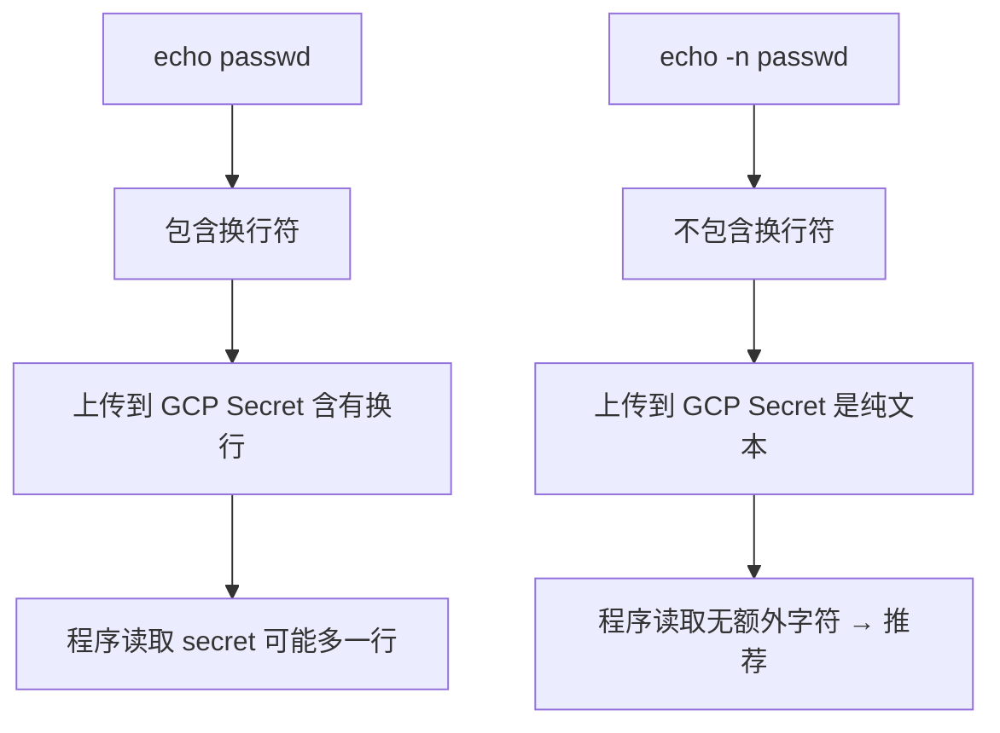

这两个命令的最大区别在于 **是否包含结尾换行符（newline \n）**，这是 echo 命令在默认行为下的典型差异：

---

### **🔍 区别解释：**

| **命令**         | **实际传入的内容** | **是否包含换行符** |
| ---------------- | ------------------ | ------------------ |
| echo -n "passwd" | passwd             | ❌ 无换行符        |
| echo "passwd"    | passwd\n           | ✅ 有换行符        |

---

### **🧪 解释细节**

#### **✅ 命令 1：**

```
echo -n "passwd" | gcloud secret versions add secret-name --data-file=-
```

- -n 参数表示 _不要输出换行符_。
- 实际上传的内容是 **纯粹的 passwd 字符串**，没有额外换行符。
- 这是 **通常推荐的方式**，用于确保 secret 精确匹配。

#### **❌ 命令 2：**

```
echo "passwd" | gcloud secret versions add secret-name --data-file=-
```

- 默认 echo 会在末尾 **自动加上换行符 \n**。
- 实际上传的是 passwd\n（也就是以换行符结尾的字符串）。
- 如果你的程序（比如 Java/Spring）读取该 secret 并对比密码，会因为末尾多了 \n 而匹配失败。

---

### **✅ 推荐做法**

如果你要把字符串 secret **精确上传（不含换行符）**，推荐使用：

```
echo -n "your-secret" | gcloud secret versions add your-secret-name --data-file=-
```

或更安全的方式使用 heredoc 结合 cat：

```
cat <<EOF | gcloud secret versions add your-secret-name --data-file=-
your-secret
EOF
```

---

### **✅ 小贴士（验证上传内容）**

你可以用以下方式验证 secret 内容是否含有换行：

```
gcloud secrets versions access latest --secret=secret-name | od -c
```

示例输出：

```
0000000   p   a   s   s   w   d  \n
```

表示有 \n。如果没有 \n：

```
0000000   p   a   s   s   w   d
```

---

### **✅ Mermaid 简图**



---

如你所发现的，“**看似相同的字符串**”，只因一个换行，就可能让认证失败。👀

需要我帮你写一段验证是否 secret 中带换行的脚本也可以继续说。

好的，以下是一段可复用的 **Shell 脚本**，用于验证 GCP Secret Manager 中某个 secret 的值是否 **包含末尾换行符 \n**，并清楚标示结果。

---

### **✅ 脚本：检查 GCP Secret 是否包含换行符**

```
#!/bin/bash

SECRET_NAME="$1"

if [ -z "$SECRET_NAME" ]; then
  echo "❗ 请输入 secret 名称作为参数"
  echo "用法: ./check_secret_newline.sh your-secret-name"
  exit 1
fi

# 获取 secret 内容（latest 版本）
SECRET_VALUE=$(gcloud secrets versions access latest --secret="$SECRET_NAME")

# 用 od 显示字符结构
echo "🔍 Secret 内容字节视图:"
echo "$SECRET_VALUE" | od -c

# 判断是否有换行符结尾
if echo "$SECRET_VALUE" | tail -c1 | grep -q $'\n'; then
  echo "⚠️ 该 Secret 结尾包含换行符 '\\n'"
else
  echo "✅ 该 Secret 没有结尾换行符"
fi
```

---

### **✅ 使用方法**

```
chmod +x check_secret_newline.sh
./check_secret_newline.sh your-secret-name
```

---

### **✅ 示例输出**

若含换行：

```
🔍 Secret 内容字节视图:
0000000   p   a   s   s   w   d  \n
⚠️ 该 Secret 结尾包含换行符 '\n'
```

若无换行：

```
🔍 Secret 内容字节视图:
0000000   p   a   s   s   w   d
✅ 该 Secret 没有结尾换行符
```

---

### **✅ 建议（修复含换行的 secret）**

如果你发现 secret 有换行，可以通过下面的命令重新上传不带 \n 的内容：

```
echo -n "your-secret" | gcloud secret versions add your-secret-name --data-file=-
```

---

需要我帮你再补充成一个自动替换含 \n 的版本也可以告诉我。
