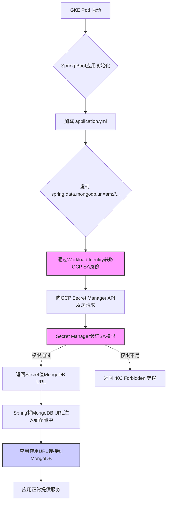
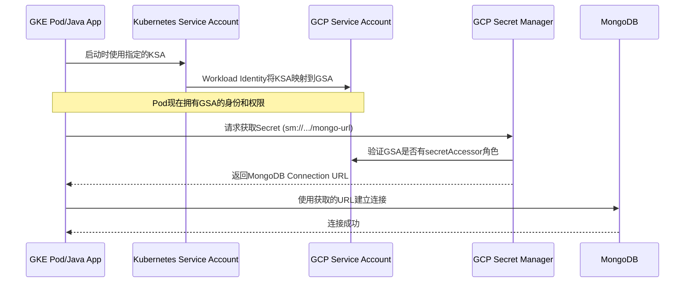
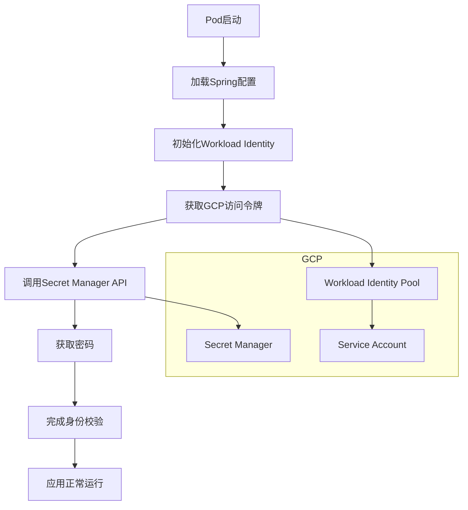
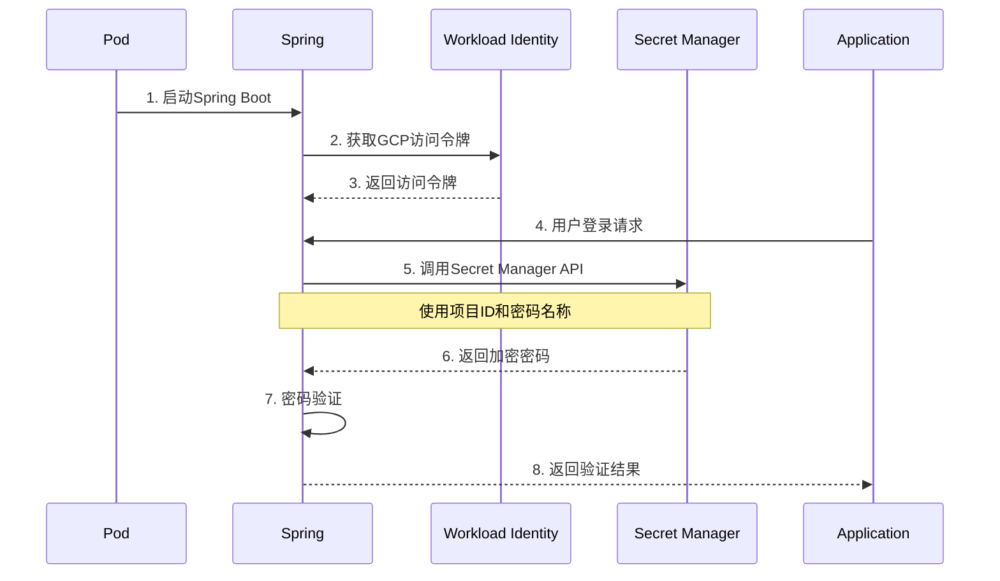

# Java Spring 应用结合 GCP Secret Manager 的工作流

本文档旨在详细阐述一个在 Google Kubernetes Engine (GKE)中运行的 Java Spring Boot 应用程序，如何安全、自动地从 GCP Secret Manager 中获取如 MongoDB 连接字符串等敏感信息，并完成服务验证的完整流程。

## 核心流程概览

整个流程的核心是利用 GKE 的 Workload Identity 机制，让 Pod 中的应用程序能够以一个指定的 GCP 服务账号（Service Account）的身份去访问 GCP 资源（如 Secret Manager），从而避免了在代码或配置文件中硬编码任何密钥。

### 流程图 (Mermaid)



### 交互时序图 (Mermaid)



## 详细步骤解析

#### 1. Pod 启动与 Workload Identity

- **GKE Pod 启动**: 当你的 Java 应用所在的 Pod 在 GKE 中被调度启动时，它会关联一个 Kubernetes Service Account (KSA)。
- **Workload Identity**: 这是 GKE 提供的一项关键功能。你需要预先配置它，将 KSA 与一个 GCP Service Account (GSA)进行绑定。这样，Pod 内的进程发出的 GCP API 请求都会使用 GSA 的身份进行认证。这是实现安全访问的基础。

#### 2. Spring Boot 配置加载

- **依赖**: 为了让 Spring Boot 能够识别`sm://`协议，你必须在`pom.xml`中添加`spring-cloud-gcp-starter-secretmanager`依赖。

    ```xml
    <dependency>
        <groupId>com.google.cloud</groupId>
        <artifactId>spring-cloud-gcp-starter-secretmanager</artifactId>
    </dependency>
    ```

- **配置文件**: 在`application.properties`或`application.yml`中，你可以像下面这样引用存储在 Secret Manager 中的密钥。

    ```yaml
    spring:
      data:
        mongodb:
          # Spring Cloud GCP会自动解析sm://协议
          uri: ${sm://projects/your-gcp-project-id/secrets/your-mongodb-secret-name/versions/latest}
    ```

#### 3. Secret Manager API 调用与权限校验

- **自动解析**: 当 Spring Boot 启动并加载上述配置时，`spring-cloud-gcp-starter-secretmanager`会自动拦截`sm://`前缀。
- **身份认证**: 应用程序（通过 Workload Identity 获得了 GSA 的身份）向 GCP Secret Manager API 发起请求。
- **权限检查**: Secret Manager 会检查这个 GSA 是否具有访问目标 Secret 的权限。**这是最容易出错的环节**。你必须确保 GSA 拥有`roles/secretmanager.secretAccessor`角色。

    你可以使用以下`gcloud`命令为服务账号授权：

    ```bash
    gcloud secrets add-iam-policy-binding your-mongodb-secret-name \
        --member="serviceAccount:your-gsa-email@your-gcp-project-id.iam.gserviceaccount.com" \
        --role="roles/secretmanager.secretAccessor" \
        --project="your-gcp-project-id"
    ```

#### 4. 获取 Secret 值并完成校验

- **获取与注入**: 如果权限验证通过，Secret Manager API 会返回存储的密钥值（即完整的 MongoDB 连接字符串）。Spring Boot 随后将这个值注入到`spring.data.mongodb.uri`属性中。
- **连接 MongoDB**: Spring Data MongoDB 模块使用这个最终的 URI 来创建与 MongoDB 数据库的连接。如果 URI 正确且网络可达，连接就会成功。

## 常见问题与排查

1.  **`ConfigurationPropertiesBindException`**:

    - **原因**: Spring Boot 无法解析`${sm://...}`。这几乎总是因为缺少`spring-cloud-gcp-starter-secretmanager`依赖，或者依赖版本与 Spring Boot 版本不兼容。
    - **解决**: 检查并添加正确的 Maven/Gradle 依赖。

2.  **`java.io.IOException: Error code 403 trying to get security access token`**:

    - **原因**: 权限不足。Pod 所使用的 GSA 没有访问目标 Secret 的`secretAccessor`角色。即使你要访问的 MongoDB 在另一个 GCP 项目中，获取其连接字符串的 Secret 所在的权限必须正确配置。
    - **解决**: 严格按照上面的`gcloud`命令，为正确的 GSA 授予正确的角色。确认 Secret 名称和项目 ID 没有错误。

3.  **跨项目访问**:
    - 如果你的 MongoDB 实例在另一个 GCP 项目中，请确保：
        - 用于运行 Pod 的 GSA 在**Secret 所在的项目**中拥有`secretAccessor`权限。
        - GKE 集群的网络（VPC）与 MongoDB 所在的 VPC 之间网络互通（例如通过 VPC Peering）。
        - MongoDB 的防火墙规则允许来自 GKE Pod IP 范围的流量。

# Cloude

我想了解比如一个 Java Spring 开发的程序如何调用 GCP secret manage 读自己的账户密码然后完成校验 整个过程,比 Pod 启动 sprintBoot 配置加载,如何 secret manage url . workload identify . secret mange API get value 等一系列动作

我来详细解释 Java Spring 应用在 GKE 中调用 GCP Secret Manager 获取密码并完成校验的完整过程。

## 整体架构流程



## 详细实现步骤

### 1. GCP 环境准备

首先需要创建必要的 GCP 资源：

```bash
# 创建Service Account
gcloud iam service-accounts create my-app-sa --display-name="My App Service Account"

# 授予Secret Manager权限
gcloud projects add-iam-policy-binding PROJECT_ID \
    --member="serviceAccount:my-app-sa@PROJECT_ID.iam.gserviceaccount.com" \
    --role="roles/secretmanager.secretAccessor"

# 创建Secret
gcloud secrets create db-password --data-file=password.txt

# 配置Workload Identity绑定
gcloud iam service-accounts add-iam-policy-binding \
    my-app-sa@PROJECT_ID.iam.gserviceaccount.com \
    --role roles/iam.workloadIdentityUser \
    --member "serviceAccount:PROJECT_ID.svc.id.goog[NAMESPACE/KSA_NAME]"
```

### 2. Kubernetes 配置

```yaml
# kubernetes-service-account.yaml
apiVersion: v1
kind: ServiceAccount
metadata:
  annotations:
    iam.gke.io/gcp-service-account: my-app-sa@PROJECT_ID.iam.gserviceaccount.com
  name: my-app-ksa
  namespace: default
---
# deployment.yaml
apiVersion: apps/v1
kind: Deployment
metadata:
  name: my-spring-app
spec:
  replicas: 1
  selector:
    matchLabels:
      app: my-spring-app
  template:
    metadata:
      labels:
        app: my-spring-app
    spec:
      serviceAccountName: my-app-ksa
      containers:
      - name: app
        image: gcr.io/PROJECT_ID/my-spring-app:latest
        env:
        - name: GOOGLE_CLOUD_PROJECT
          value: "PROJECT_ID"
        - name: SECRET_NAME
          value: "db-password"
```

### 3. Spring Boot 依赖配置

```xml
<!-- pom.xml -->
<dependency>
    <groupId>com.google.cloud</groupId>
    <artifactId>google-cloud-secretmanager</artifactId>
    <version>2.16.0</version>
</dependency>
<dependency>
    <groupId>org.springframework.boot</groupId>
    <artifactId>spring-boot-starter-web</artifactId>
</dependency>
<dependency>
    <groupId>org.springframework.boot</groupId>
    <artifactId>spring-boot-starter-security</artifactId>
</dependency>
```

### 4. Spring 配置类

```java
@Configuration
@EnableConfigurationProperties
public class SecretManagerConfig {

    @Value("${google.cloud.project}")
    private String projectId;

    @Bean
    public SecretManagerServiceClient secretManagerServiceClient() throws IOException {
        return SecretManagerServiceClient.create();
    }

    @Bean
    @ConfigurationProperties(prefix = "app.secrets")
    public SecretProperties secretProperties() {
        return new SecretProperties();
    }
}

@ConfigurationProperties(prefix = "app.secrets")
@Data
public class SecretProperties {
    private String dbPasswordSecretName;
    private String apiKeySecretName;
}
```

### 5. Secret Manager 服务类

```java
@Service
@Slf4j
public class SecretManagerService {

    private final SecretManagerServiceClient client;
    private final String projectId;
    private final Map<String, String> secretCache = new ConcurrentHashMap<>();

    public SecretManagerService(SecretManagerServiceClient client,
                              @Value("${google.cloud.project}") String projectId) {
        this.client = client;
        this.projectId = projectId;
    }

    public String getSecret(String secretName) {
        return secretCache.computeIfAbsent(secretName, this::fetchSecretFromGCP);
    }

    private String fetchSecretFromGCP(String secretName) {
        try {
            SecretVersionName secretVersionName = SecretVersionName.of(
                projectId, secretName, "latest");

            AccessSecretVersionResponse response = client.accessSecretVersion(secretVersionName);
            String secretValue = response.getPayload().getData().toStringUtf8();

            log.info("Successfully retrieved secret: {}", secretName);
            return secretValue;

        } catch (Exception e) {
            log.error("Failed to retrieve secret: {}", secretName, e);
            throw new RuntimeException("Unable to retrieve secret: " + secretName, e);
        }
    }

    @PreDestroy
    public void cleanup() {
        if (client != null) {
            client.close();
        }
    }
}
```

### 6. 身份验证服务

```java
@Service
public class AuthenticationService {

    private final SecretManagerService secretManagerService;
    private final PasswordEncoder passwordEncoder;

    public AuthenticationService(SecretManagerService secretManagerService,
                               PasswordEncoder passwordEncoder) {
        this.secretManagerService = secretManagerService;
        this.passwordEncoder = passwordEncoder;
    }

    public boolean authenticateUser(String username, String password) {
        try {
            // 从Secret Manager获取存储的密码
            String storedPassword = secretManagerService.getSecret("user-" + username + "-password");

            // 验证密码
            return passwordEncoder.matches(password, storedPassword);

        } catch (Exception e) {
            log.error("Authentication failed for user: {}", username, e);
            return false;
        }
    }
}
```

### 7. 控制器实现

```java
@RestController
@RequestMapping("/api/auth")
public class AuthController {

    private final AuthenticationService authService;

    public AuthController(AuthenticationService authService) {
        this.authService = authService;
    }

    @PostMapping("/login")
    public ResponseEntity<?> login(@RequestBody LoginRequest request) {
        boolean isAuthenticated = authService.authenticateUser(
            request.getUsername(),
            request.getPassword()
        );

        if (isAuthenticated) {
            return ResponseEntity.ok(new LoginResponse("Login successful"));
        } else {
            return ResponseEntity.status(HttpStatus.UNAUTHORIZED)
                .body(new ErrorResponse("Invalid credentials"));
        }
    }
}
```

### 8. 应用启动配置

```yaml
# application.yml
spring:
  application:
    name: my-spring-app
  profiles:
    active: gcp

google:
  cloud:
    project: ${GOOGLE_CLOUD_PROJECT}

app:
  secrets:
    db-password-secret-name: db-password
    api-key-secret-name: api-key

logging:
  level:
    com.google.cloud: INFO
    root: INFO
```

## 完整调用流程图



## 关键配置要点

| 配置项             | 说明                | 示例值                                         |
| ------------------ | ------------------- | ---------------------------------------------- |
| Workload Identity  | GKE 与 GCP IAM 集成 | `my-app-sa@PROJECT_ID.iam.gserviceaccount.com` |
| Secret Manager URL | API 端点            | `secretmanager.googleapis.com`                 |
| 项目 ID            | GCP 项目标识        | `my-project-123456`                            |
| 密码名称           | Secret 资源名称     | `db-password`                                  |
| 版本               | 密码版本            | `latest` 或具体版本号                          |

## 安全最佳实践

```java
@Component
public class SecurityConfiguration {

    @Bean
    public PasswordEncoder passwordEncoder() {
        return new BCryptPasswordEncoder(12);
    }

    @Bean
    public SecretManagerServiceSettings secretManagerSettings() {
        return SecretManagerServiceSettings.newBuilder()
            .setCredentialsProvider(NoCredentialsProvider.create()) // 使用Workload Identity
            .build();
    }
}
```

这个完整流程确保了：

1. Pod 通过 Workload Identity 安全访问 GCP 资源
2. Spring Boot 应用自动获取密码进行身份验证
3. 密码安全存储在 Secret Manager 中
4. 支持密码轮换和版本管理
5. 遵循最小权限原则

# Gemini

(1) 首先，研究并解释 GCP Secret Manager 和 Workload Identity 的核心概念。

- (a) 阐述 GCP Secret Manager 的用途，即安全地存储和管理 API 密钥、密码、证书等敏感数据。
- (b) 阐述 Workload Identity 的作用和工作原理，特别是它如何使 GKE 中的工作负载能够安全地访问 Google Cloud 服务，而无需管理服务账号密钥文件。
    (2) 详细说明在 Google Cloud Platform (GCP) 控制台中进行的前期准备工作。
- (a) 查找如何在 GCP 项目中启用 Secret Manager API。
- (b) 查找创建和配置一个密钥（Secret）的具体步骤。
- (c) 查找如何创建一个 Google 服务账号（GSA），并为其授予访问特定密钥所需的 IAM 角色（例如，Secret Manager Secret Accessor）。
    (3) 描述在 Kubernetes (GKE) 环境中为启用 Workload Identity 所需要执行的配置步骤。
- (a) 查找如何在 GKE 集群和节点池上启用 Workload Identity。
- (b) 查找如何为应用程序创建一个 Kubernetes 服务账号（KSA）。
- (c) 查找如何将 GSA 与 KSA 进行绑定，并为 KSA 添加正确的注解（annotation）。
- (4) 深入研究 Java Spring Boot 应用程序与 GCP Secret Manager 的集成方法。
- (a) 查找 Spring Cloud GCP 的官方文档，特别是关于`spring-cloud-gcp-starter-secretmanager`依赖项。
- (b) 查找如何在`pom.xml`或`build.gradle`中添加此依赖。
- (c) 查找如何在`application.properties`或`application.yml`中进行配置，以通过`sm://`协议前缀在启动时自动加载密钥。
    (5) 整合信息，按时间顺序详细描述从 Pod 启动到密钥加载的完整流程。
- (a) 描述 Pod 启动时，其指定的 KSA 如何通过 Workload Identity 机制与 GSA 关联。
- (b) 解释 Spring Boot 启动时，Spring Cloud GCP 如何拦截`sm://`格式的配置属性。
- (c) 描述应用程序如何通过 Workload Identity 提供的凭据，向 Secret Manager API 发起请求以获取密钥的实际值。
- (d) 解释获取到的密钥值如何被注入到 Spring 的运行环境中，例如作为数据库密码。
    (6) 探索除了通过配置文件自动加载之外，如何在 Java 代码中以编程方式主动调用 Secret Manager API 来获取密钥值。
- (a) 查找使用 GCP Secret Manager Java 客户端库的示例代码。
- (b) 展示如何实例化客户端，构建请求，并调用 API 来访问和解析密钥内容。
    (7) 解释获取密钥后如何完成“校验”这一步骤。
- (a) 以数据库连接为例，说明 Spring 的 DataSource 如何使用获取到的密码来尝试建立连接，连接成功即为校验通过。
- (b) 以调用外部 API 为例，说明如何将获取到的 API 密钥用于请求认证，并根据返回的成功状态码来判断校验结果。
    (8) 搜集并总结此过程中可能遇到的常见问题及其排查方法。
- (a) 查找常见的错误类型，如 IAM 权限不足（PERMISSION_DENIED）、Workload Identity 配置错误、网络策略限制等。
- (b) 总结相关的最佳实践，例如在生产环境中使用固定的密钥版本而非`latest`，以及遵循最小权限原则等。

# 构建安全的云原生Java应用：GKE Workload Identity与Secret Manager及Spring Boot集成的权威指南

## 第 1 部分：基本概念：信任的架构

在现代云原生应用开发中，安全已不再是事后添加的功能，而是必须从一开始就融入架构设计的核心支柱。对于在Google Kubernetes Engine (GKE)上运行的Java Spring Boot应用而言，管理数据库密码、API密钥和证书等敏感信息是一项严峻的挑战。将这些凭证硬编码在代码中或存储在配置文件中是不可接受的，而传统的密钥管理方法又带来了复杂的轮换和分发难题。

本文旨在提供一个端到端的权威指南，详细阐述如何利用Google Cloud的两种关键服务——Secret Manager和Workload Identity——来构建一个既安全又高效的凭证管理体系。我们将深入探讨从Pod启动、Spring Boot配置加载，到通过Workload Identity进行身份验证，并最终从Secret Manager API获取值的完整流程。这种架构范式彻底改变了应用与云服务交互的方式，从传统的“凭证管理”转向了更先进、更安全的“身份管理”。

### 1.1. GCP Secret Manager：数字保险库

Google Cloud Secret Manager是一个集中化、安全便捷的敏感数据存储系统，专为存储API密钥、密码、证书和其他机密信息而设计 1。它不仅仅是一个简单的键值存储，更是一个具备完整生命周期管理、精细化访问控制和强大审计能力的安全服务。

#### 1.1.1. 安全模型

Secret Manager的安全性是多层次的，确保了从存储到访问的每一个环节都受到严密保护。

- **加密机制**：安全性是其设计的基石。所有存储在Secret Manager中的数据在传输过程中都使用TLS进行加密，在静态存储时则默认使用AES-256位加密密钥进行加密 2。这意味着开发者无需进行任何额外配置，即可获得行业标准的加密保护。
    
- **通过IAM进行访问控制**：Secret Manager与Google Cloud的Identity and Access Management (IAM)深度集成，遵循“默认拒绝”原则。在默认情况下，只有项目所有者才有权访问项目中的密钥；任何其他用户或服务（包括应用本身）都必须通过IAM被明确授予权限 2。这种设计强制实施了
    
    **最小权限原则 (Principle of Least Privilege, PoLP)**，确保每个身份只能访问其完成任务所必需的最少资源 2。
    

#### 1.1.2. 企业级运营的关键特性

- **版本控制**：Secret Manager中的密钥数据是不可变的。任何对密钥值的修改都会创建一个新的_版本_，而旧版本则被保留 2。这一特性对于实现安全的密钥轮换和回滚策略至关重要。应用可以配置为“固定”到某个特定的、已知的良好版本（例如版本号“42”），或者使用浮动别名（如“latest”）来始终获取最新版本 2。
    
- **复制策略**：密钥的_名称_是项目内的全局资源，但密钥的_数据_（即值）则存储在特定的地理区域中 2。开发者可以选择自动复制策略，让Google在全球多个区域复制密钥数据以实现高可用性；也可以选择用户管理的复制策略，将密钥数据限制在特定的区域以满足数据主权和合规性要求。
    
- **审计**：与Cloud Audit Logs的无缝集成为Secret Manager提供了强大的审计能力。每一次对Secret Manager API的调用，无论是创建、访问还是修改密钥，都会生成一条详细的审计日志 2。这不仅是满足合规性要求的关键，也使得通过异常检测系统发现潜在的非正常访问模式成为可能。
    

### 1.2. GCP Workload Identity：GKE中的无密钥认证

Workload Identity是Google Cloud为解决云原生环境中凭证管理难题而推出的战略性解决方案。它彻底改变了GKE中运行的应用进行身份验证的方式。

#### 1.2.1. 密钥问题的根源

传统的应用认证方式依赖于静态的、长期的服务账号JSON密钥文件 5。这种方法存在固有的、严重的安全风险：

- **密钥永不过期**：一旦生成，这些密钥文件将永久有效，除非被手动吊销或轮换 6。
    
- **轮换困难**：手动轮换密钥是一项繁琐且容易出错的工作，难以大规模实施，导致密钥常常得不到及时更新。
    
- **泄露风险高**：攻击者一旦获取到密钥文件，就能在不被察觉的情况下长期冒充该服务账号的身份，可能导致安全漏洞的范围不断扩大 6。
    

Workload Identity的出现，正是为了从根本上消除这些风险，实现一种更安全的“无密钥”认证模式 5。

#### 1.2.2. 范式转移：从凭证到身份

Workload Identity的核心思想是允许一个Kubernetes服务账号 (Kubernetes Service Account, KSA) 在不使用任何JSON密钥的情况下，安全地“模拟”或“扮演”一个Google服务账号 (Google Service Account, GSA) 的身份 5。一个形象的比喻是，它就像为应用颁发了一张办公楼的员工ID卡，而不是给它一把万能钥匙。这张ID卡是临时的、有范围限制的，只能用于访问应用被授权进入的特定区域（即特定的Google Cloud API）7。

#### 1.2.3. 信任的机制（工作原理）

Workload Identity的实现依赖于GKE与GCP IAM之间建立的一套精密的信任机制，其背后涉及几个关键组件的协同工作。

- **Workload Identity池**：每个GCP项目都会自动获得一个唯一的Workload Identity池，其格式为 `$PROJECT_ID.svc.id.goog` 6。这个池充当了信任锚，使得GCP的IAM系统能够理解并信任来自该项目GKE集群的凭证。
    
- **GKE元数据服务器**：这是实现无缝认证的关键中介。它作为一个DaemonSet部署在GKE集群的每个节点上 6。当Pod中的应用尝试访问Google Cloud API时，这个请求会被节点上的GKE元数据服务器拦截 5。
    
- **令牌交换流程**：
    
    1. Pod中的应用（通过Google Cloud客户端库）向GKE元数据服务器发起请求。
        
    2. 元数据服务器获取到Pod所关联的KSA投射令牌（一种短期的、由Kubernetes签发的JWT）。
        
    3. 元数据服务器将这个KSA令牌发送给Google的Security Token Service (STS)。
        
    4. STS验证该KSA令牌，并根据预先配置好的IAM策略，确认该KSA有权模拟目标GSA。
        
    5. 验证通过后，STS返回一个短期的联合访问令牌。
        
    6. 元数据服务器再用这个联合访问令牌去调用目标Google API（如Secret Manager API），从而为应用获取一个最终的、短期的OAuth 2.0访问令牌 5。
        
    7. 最后，这个OAuth 2.0令牌被返回给应用，应用便可使用它来完成对Google Cloud API的认证调用。
        

整个过程对应用本身是完全透明的。应用代码只需像往常一样调用API，认证过程由底层的GKE基础设施和Google Cloud服务自动完成。这不仅消除了静态密钥，还实现了凭证的自动、无缝轮换。

将Secret Manager与Workload Identity相结合，代表了云原生安全实践的一次根本性飞跃。关注点不再是如何安全地分发和存储一个密钥文件，而是如何精确地定义和执行工作负载身份（KSA）与云身份（GSA）之间的信任关系。安全边界从应用的本地环境（例如，一个挂载了密钥文件的Kubernetes Secret卷）转移到了云服务提供商的IAM层。这意味着DevOps和安全团队现在必须将精力集中在制定健壮的IAM策略、审计IAM绑定关系以及确保GSA遵循最小权限原则上，而不是为密钥轮换计划和安全存储机制而烦恼。这是一种更具扩展性、更安全的架构姿态。

## 第 2 部分：环境准备：GCP和GKE基础

在将应用部署到GKE并集成Secret Manager之前，必须正确配置底层的Google Cloud项目和GKE集群。本节将提供详细的、可操作的步骤，涵盖从API启用、密钥创建到集群配置的全过程。

### 2.1. GCP项目配置

首先，确保您的Google Cloud项目已为使用Secret Manager做好准备。

#### 2.1.1. 启用Secret Manager API

这是使用Secret Manager服务的强制性前提条件。您可以通过Google Cloud控制台或`gcloud`命令行工具来完成此操作。

- 使用gcloud CLI（推荐）：
    
    打开Cloud Shell或已安装gcloud CLI的本地终端，执行以下命令：
    
    Bash
    
    ```
    gcloud services enable secretmanager.googleapis.com
    ```
    
    此命令会为当前配置的项目启用Secret Manager API 11。该操作是幂等的，即多次执行不会产生副作用。
    
- **使用Google Cloud控制台**：
    
    1. 访问Google Cloud控制台。
        
    2. 导航到“API和服务” > “库”。
        
    3. 搜索“Secret Manager API”。
        
    4. 选择该API并点击“启用”11。
        

#### 2.1.2. 验证API是否已启用

为确保API已成功启用，可以运行以下命令列出项目中所有已启用的API，并检查列表中是否包含`secretmanager.googleapis.com`：

Bash

```
gcloud services list --enabled
```

11

### 2.2. 创建和填充密钥

在Secret Manager中，创建一个可用的密钥通常分为两步：首先创建密钥的“容器”（即命名实体），然后向其添加包含实际敏感数据的第一个“版本”。

#### 2.2.1. 创建密钥容器

执行以下命令来创建一个名为`my-app-db-password`的密钥，并使用自动复制策略以实现高可用性：

Bash

```
gcloud secrets create my-app-db-password \
    --replication-policy="automatic"
```

12

#### 2.2.2. 添加第一个版本及密钥值

这是将真正的敏感数据存入Secret Manager的步骤。为了安全起见，强烈建议通过管道将密钥值从`echo`传递给`gcloud`命令，这样可以避免密钥值出现在您的shell历史记录中。

- **使用`gcloud` CLI（推荐）**：
    
    Bash
    
    ```
    echo -n "S3cr3tP@ssw0rd!" | gcloud secrets versions add my-app-db-password \
        --data-file=-
    ```
    
    这里的`-n`参数防止`echo`添加换行符，`--data-file=-`则指示`gcloud`从标准输入（stdin）读取数据 13。
    
- **使用Google Cloud控制台**：
    
    1. 导航到“安全” > “Secret Manager”页面。
        
    2. 点击“创建密钥”。
        
    3. 在“名称”字段中输入`my-app-db-password`。
        
    4. 在“密钥值”字段中输入您的密码。
        
    5. 点击“创建密钥”12。
        

### 2.3. 建立Google服务账号 (GSA)

GSA将作为您在GCP中运行的应用的身份。Workload Identity机制将把这个GSA的身份赋予您的GKE Pod。

#### 2.3.1. 创建GSA

为您的应用创建一个专用的GSA。一个良好的实践是为每个应用或微服务创建独立的GSA，以便实现精细的权限控制。

Bash

```
gcloud iam service-accounts create my-spring-app-gsa \
    --display-name="Service Account for My Spring Boot App"
```

7

#### 2.3.2. 授予GSA访问密钥的权限

这是实施最小权限原则的关键一步。您应该只授予该GSA访问其所需密钥的权限，而不是授予项目级别的广泛权限。

- **授予`secretAccessor`角色**：`roles/secretmanager.secretAccessor`角色允许身份读取密钥的版本载荷（即密钥值），而`roles/secretmanager.viewer`角色只允许查看密钥的元数据 4。对于应用来说，前者是必需的。
    
- **在特定密钥上授予权限**：执行以下命令，将`secretAccessor`角色授予我们新创建的GSA，但权限范围仅限于`my-app-db-password`这个密钥。
    
    Bash
    
    ```
    gcloud secrets add-iam-policy-binding my-app-db-password \
        --member="serviceAccount:my-spring-app-gsa@$(gcloud config get-value project).iam.gserviceaccount.com" \
        --role="roles/secretmanager.secretAccessor"
    ```
    
    18
    
    请注意，$(gcloud config get-value project)会自动获取当前项目的ID，以构建GSA的完整电子邮件地址。
    

### 2.4. 配置GKE集群

现在，我们需要配置GKE集群以启用Workload Identity。

#### 2.4.1. 在集群级别启用Workload Identity

此步骤为整个集群建立Workload Identity池，是后续所有配置的基础。

Bash

```
gcloud container jiquns update YOUR_CLUSTER_NAME \
    --region=YOUR_REGION \
    --workload-pool=$(gcloud config get-value project).svc.id.goog
```

7

请将YOUR_CLUSTER_NAME和YOUR_REGION替换为您的集群名称和区域。对于GKE Autopilot模式的集群，Workload Identity是默认启用的，无需此步骤 10。

#### 2.4.2. 在节点池级别启用Workload Identity

此步骤在节点上激活GKE元数据服务器，使其能够拦截API请求并执行令牌交换。

Bash

```
gcloud container node-pools update YOUR_NODE_POOL_NAME \
    --jiqun=YOUR_CLUSTER_NAME \
    --region=YOUR_REGION \
    --workload-metadata=GKE_METADATA
```

10

请替换相应的占位符。

#### 2.4.3. 验证OAuth范围（常见陷阱）

一个容易被忽略但至关重要的要求是，GKE节点池所使用的底层服务账号必须具有`cloud-platform`的OAuth范围。如果缺少此范围，即使Workload Identity配置完全正确，应用在调用Google Cloud API时仍会失败，并报告“请求的身份验证范围不足 (insufficient authentication scopes)”的错误 20。

在创建节点池时，请确保指定了正确的范围。对于现有节点，您可以使用以下命令进行检查和更新：

Bash

```
gcloud compute instances set-service-account YOUR_INSTANCE_NAME \
    --service-account=NODE_SERVICE_ACCOUNT_EMAIL \
    --scopes=https://www.googleapis.com/auth/cloud-platform
```

20

将这些准备步骤分开执行，并非仅仅是技术上的要求，它本身也体现了一种强大的安全设计理念。创建密钥（由密钥管理员负责）、创建身份（由IAM管理员负责）以及授予身份访问权限（由资源所有者或安全管理员负责）是三个可以分离且可审计的独立操作。这种职责分离的模式确保了没有任何一个单一角色（项目所有者除外）可以单方面地创建一个密钥并授予自己访问权限，这对于企业级的治理和合规性至关重要。

为了清晰地总结权限需求，下表列出了此架构中涉及的关键IAM角色和主体。

**表 1：必需的IAM角色和主体**

|主体 (Principal)|需要授予的角色 (Role to Grant)|授予角色的资源 (Resource to Grant On)|目的 (Purpose)|
|---|---|---|---|
|Google服务账号 (GSA)|`roles/secretmanager.secretAccessor`|特定的密钥 (例如 `my-app-db-password`)|允许应用（通过GSA）读取密钥的值。|
|Kubernetes服务账号 (KSA)|`roles/iam.workloadIdentityUser`|Google服务账号 (GSA)|允许KSA模拟GSA的身份。这是Workload Identity绑定的核心。|

## 第 3 部分：Kubernetes配置：连接应用和云身份

在GCP和GKE基础设施准备就绪后，下一步是在Kubernetes集群内部进行配置，将我们之前创建的云身份（GSA）与即将运行应用的Pod关联起来。这个过程通过Kubernetes服务账号（KSA）作为桥梁来完成。

### 3.1. 创建Kubernetes服务账号 (KSA)

KSA为在Pod中运行的进程提供了一个集群内的身份。我们将为Spring Boot应用创建一个专用的KSA。

在一个指定的命名空间（例如 my-app-ns）中创建KSA：

Bash

```
kubectl create namespace my-app-ns

kubectl create serviceaccount my-app-ksa --namespace my-app-ns
```

7

### 3.2. 绑定KSA与GSA

这是Workload Identity配置中最关键的一步。我们需要通过IAM策略，授权KSA模拟（impersonate）我们之前创建的GSA。这是通过授予KSA `roles/iam.workloadIdentityUser`角色来实现的，而该角色的授予对象是GSA。

执行以下`gcloud`命令来建立这种绑定关系：

Bash

```
gcloud iam service-accounts add-iam-policy-binding \
    my-spring-app-gsa@$(gcloud config get-value project).iam.gserviceaccount.com \
    --role="roles/iam.workloadIdentityUser" \
    --member="serviceAccount:$(gcloud config get-value project).svc.id.goog[my-app-ns/my-app-ksa]"
```

7

让我们分解`--member`参数的字符串结构：

- `serviceAccount:`：这是一个固定的前缀，表示主体类型。
    
- `$(gcloud config get-value project).svc.id.goog`：这是您项目的Workload Identity池的名称。
    
- `[my-app-ns/my-app-ksa]`：这指定了KSA所在的Kubernetes命名空间和KSA的名称。
    

这个命令的含义是：“允许来自`my-app-ns`命名空间的、名为`my-app-ksa`的Kubernetes服务账号，模拟`my-spring-app-gsa`这个Google服务账号的身份。”

### 3.3. 注解KSA

绑定关系建立后，我们还需要告诉GKE的元数据服务器，当一个Pod使用`my-app-ksa`时，应该去模拟哪一个GSA。这是通过为KSA添加一个特定的注解（annotation）来完成的。

执行以下`kubectl`命令来注解KSA：

Bash

```
kubectl annotate serviceaccount my-app-ksa \
    --namespace my-app-ns \
    iam.gke.io/gcp-service-account=my-spring-app-gsa@$(gcloud config get-value project).iam.gserviceaccount.com
```

7

这个iam.gke.io/gcp-service-account注解是GKE元数据服务器识别和执行模拟操作的关键标识。

### 3.4. 部署配置

信任链的最后一环是将应用Pod与我们精心配置的KSA关联起来。这需要在您的Kubernetes部署文件（例如 `deployment.yaml`）中明确指定。

以下是一个`deployment.yaml`文件的关键部分示例，展示了如何将Pod与`my-app-ksa`关联：

YAML

```
apiVersion: apps/v1
kind: Deployment
metadata:
  name: my-spring-boot-app
  namespace: my-app-ns
spec:
  replicas: 1
  selector:
    matchLabels:
      app: my-spring-boot-app
  template:
    metadata:
      labels:
        app: my-spring-boot-app
    spec:
      # 这是最关键的一行！
      serviceAccountName: my-app-ksa
      containers:
      - name: app
        image: gcr.io/your-project-id/my-spring-boot-app:latest
        ports:
        - containerPort: 8080
```

在Pod的`spec`中添加`serviceAccountName: my-app-ksa`是整个配置能否生效的决定性因素。如果遗漏了这一行，Pod将默认使用其命名空间下的`default`服务账号。由于`default`服务账号没有被配置Workload Identity绑定，信任链会在此中断，应用将无法获得正确的GCP身份，最终导致在尝试访问Secret Manager时收到`PERMISSION_DENIED`错误。这是实践中最常见、也最容易排查的配置失误之一 23。

## 第 4 部分：Java Spring Boot应用：消费密钥

现在，我们将焦点从基础设施转向应用代码本身。本节将详细介绍如何在Java Spring Boot应用中配置和使用`spring-cloud-gcp-starter-secretmanager`，以无缝地从Secret Manager中获取密钥。

### 4.1. 项目依赖 (Maven/Gradle)

为了让Spring Boot应用能够与GCP Secret Manager交互，需要在项目中添加相应的依赖。

#### 4.1.1. 依赖管理 (BOM)

使用Spring Cloud GCP的物料清单（Bill of Materials, BOM）是一种最佳实践，它可以帮助您统一管理所有`spring-cloud-gcp`相关依赖的版本，避免版本冲突。

- Maven (pom.xml)：
    
    在pom.xml的<dependencyManagement>部分添加BOM：
    
    XML
    
    ```
    <dependencyManagement>
        <dependencies>
            <dependency>
                <groupId>com.google.cloud</groupId>
                <artifactId>spring-cloud-gcp-dependencies</artifactId>
                <version>5.2.1</version> <type>pom</type>
                <scope>import</scope>
            </dependency>
        </dependencies>
    </dependencyManagement>
    ```
    
    24
    
- Gradle (build.gradle)：
    
    在build.gradle中应用BOM：
    
    Groovy
    
    ```
    dependencyManagement {
        imports {
            mavenBom "com.google.cloud:spring-cloud-gcp-dependencies:5.2.1" // 请使用兼容版本
        }
    }
    ```
    
    25
    

#### 4.1.2. 添加Starter依赖

添加BOM后，您就可以在不指定版本号的情况下，引入Secret Manager的starter依赖。

- **Maven (`pom.xml`)**：
    
    XML
    
    ```
    <dependencies>
        <dependency>
            <groupId>com.google.cloud</groupId>
            <artifactId>spring-cloud-gcp-starter-secretmanager</artifactId>
        </dependency>
        </dependencies>
    ```
    
    24
    
- **Gradle (`build.gradle`)**：
    
    Groovy
    
    ```
    dependencies {
        implementation 'com.google.cloud:spring-cloud-gcp-starter-secretmanager'
        // 其他依赖
    }
    ```
    
    25
    

一个常见的陷阱是`spring-cloud-gcp`的版本与Spring Boot和Spring Cloud的版本不兼容，这可能导致各种难以诊断的运行时错误，如`IllegalArgumentException`或`ConverterNotFoundException` 25。因此，在选择版本时，务必参考官方文档，确保三者之间的兼容性。

**表 2：Spring Cloud GCP版本兼容性矩阵（示例）**

|Spring Boot 版本|Spring Cloud 版本|Spring Cloud GCP 版本|
|---|---|---|
|2.7.x|2021.0.x|3.x.x|
|3.0.x|2022.0.x|4.x.x|
|3.1.x|2022.0.x|4.x.x|
|3.2.x|2023.0.x|5.x.x|

### 4.2. 应用配置 (`application.properties` / `application.yml`)

对于Spring Boot 2.4及更高版本，必须通过`spring.config.import`属性来显式启用外部配置源，如Secret Manager。这是从旧的`bootstrap.properties`机制转变而来的一个重要变化，也是升级应用时常见的困惑点。

- **`application.properties`**：
    
    Properties
    
    ```
    spring.config.import=sm://
    ```
    
    26
    
- **`application.yml`**：
    
    YAML
    
    ```
    spring:
      config:
        import: "sm://"
    ```
    
    29
    

这个`sm://`协议处理器会触发`spring-cloud-gcp-starter-secretmanager`的自动配置，使其成为Spring Environment的一个属性源。值得注意的是，由于Spring框架内部属性解析器的重写，对于更新的Spring版本（如Spring Boot 3.4+），推荐的语法可能会变为`sm@` 29。

### 4.3. 声明式密钥注入（推荐方式）

最优雅、最符合Spring理念的方式是声明式地注入密钥。应用代码完全不需要知道密钥的来源是Secret Manager。

在`application.properties`或`application.yml`中，将密钥引用赋值给一个标准的Spring属性：

Properties

```
# application.properties
spring.datasource.password=${sm://my-app-db-password}
spring.api.key=${sm://projects/YOUR_PROJECT_ID/secrets/my-third-party-api-key/versions/1}
```

29

然后，在您的Java配置类或组件中，像注入任何其他属性一样使用`@Value`注解：

Java

```
import org.springframework.beans.factory.annotation.Value;
import org.springframework.stereotype.Component;

@Component
public class AppConfig {

    private final String databasePassword;

    public AppConfig(@Value("${spring.datasource.password}") String databasePassword) {
        this.databasePassword = databasePassword;
        // 现在可以在这里使用密码来配置数据源等
    }

    //...
}
```

26

这种方式实现了完美的解耦：应用代码只关心spring.datasource.password这个属性，而其值的来源（本地文件、环境变量或云端Secret Manager）则完全由外部配置决定。

### 4.4. 程序化密钥访问（高级场景）

在某些动态场景下，应用可能需要在运行时根据特定逻辑来获取密钥。`spring-cloud-gcp`为此提供了两种方式。

- 使用SecretManagerTemplate：
    
    这是一个Spring风格的封装器，简化了API调用。您可以直接注入它：
    
    Java
    
    ```
    import org.springframework.beans.factory.annotation.Autowired;
    import org.springframework.cloud.gcp.secretmanager.SecretManagerTemplate;
    import org.springframework.stereotype.Service;
    
    @Service
    public class SecretService {
    
        @Autowired
        private SecretManagerTemplate secretManagerTemplate;
    
        public String getSecret(String secretId) {
            return this.secretManagerTemplate.getSecretString(secretId);
        }
    }
    ```
    
    25
    
- 使用SecretManagerServiceClient：
    
    这是GCP提供的原生Java客户端库。它提供了最完整的API功能和最大的控制力，但需要编写更多的样板代码。
    
    Java
    
    ```
    import com.google.cloud.secretmanager.v1.AccessSecretVersionResponse;
    import com.google.cloud.secretmanager.v1.SecretManagerServiceClient;
    import com.google.cloud.secretmanager.v1.SecretVersionName;
    import java.io.IOException;
    
    public class ManualSecretAccessor {
    
        public static String accessSecretVersion(String projectId, String secretId, String versionId) throws IOException {
            try (SecretManagerServiceClient client = SecretManagerServiceClient.create()) {
                SecretVersionName secretVersionName = SecretVersionName.of(projectId, secretId, versionId);
                AccessSecretVersionResponse response = client.accessSecretVersion(secretVersionName);
                return response.getPayload().getData().toStringUtf8();
            }
        }
    }
    ```
    
    31
    
    当使用原生客户端时，它会自动利用应用运行环境中的应用默认凭据 (Application Default Credentials, ADC)，而在GKE中，Workload Identity正是ADC的提供者。
    

## 第 5 部分：端到端流程：可视化演练

为了将前面各部分的技术点串联起来，本节将通过一个叙事性的演练和一个可视化的流程图，来完整地展示从Pod启动到密钥成功注入的全过程。

### 5.1. 叙事流程

1. **Pod启动**：Kubernetes调度器将一个配置了`serviceAccountName: my-app-ksa`的Pod调度到GKE集群的某个节点上。
    
2. **应用引导**：Pod内的容器启动，Java虚拟机加载，Spring Boot应用开始其引导过程。
    
3. **配置处理**：Spring的`Environment`在初始化时，处理`application.properties`文件，并识别出`spring.config.import=sm://`指令。
    
4. **属性解析**：当Spring的`EnvironmentPostProcessor`遇到一个需要解析的属性，例如`${sm://my-app-db-password}`时，它会调用由`spring-cloud-gcp-starter-secretmanager`注册的属性解析器。
    
5. **发起API调用**：Spring Cloud GCP的代码（底层使用GCP Java客户端库）构造一个对`secretmanager.googleapis.com`的API请求，以获取名为`my-app-db-password`的密钥。
    
6. **元数据服务器拦截**：这个从Pod发出的出站网络请求，在到达外部网络之前，被运行在该节点上的GKE元数据服务器（地址通常是`169.254.169.254`）所拦截。
    
7. **令牌交换**：GKE元数据服务器执行核心的令牌交换魔法：
    
    - 它从请求中识别出调用来自哪个Pod，并找到该Pod关联的KSA (`my-app-ksa`)。
        
    - 它获取该KSA的投射服务账号令牌。
        
    - 它使用这个KSA令牌，向Google Security Token Service (STS)发起请求，要求换取一个代表GSA (`my-spring-app-gsa`)身份的短期令牌。
        
8. **认证API调用**：GKE元数据服务器使用从STS获取到的GSA身份令牌，向Secret Manager API发起经过认证的`accessSecretVersion`请求。
    
9. **权限验证与返回密钥**：Secret Manager API接收到请求后，会查询IAM，验证发出请求的GSA (`my-spring-app-gsa`)是否对目标密钥`my-app-db-password`拥有`secretmanager.secretAccessor`角色。验证通过后，它将密钥的明文值返回给GKE元数据服务器。
    
10. **返回给应用**：GKE元数据服务器将密钥值返回给Pod内等待的Spring Boot应用。
    
11. **注入完成**：Spring `Environment`成功解析了`${sm://my-app-db-password}`，将其值注入到`spring.datasource.password`属性中。
    
12. **应用就绪**：应用继续其启动流程，此时数据库密码已安全地加载到内存中。应用现在可以使用该密码来建立与数据库的连接，整个过程没有在磁盘上留下任何永久性的凭证文件。
    

### 5.2. 交互时序图（文字描述）

一个详细的时序图可以更直观地展示这个流程。图中应包含以下参与者：

- `Pod (Spring App)`
    
- `GKE Metadata Server`
    
- `Google STS (Security Token Service)`
    
- `Google IAM`
    
- `Google Secret Manager`
    

**交互步骤如下**：

1. `Pod` -> `GKE Metadata Server`: `GET /computeMetadata/v1/...` (API调用)
    
2. `GKE Metadata Server` -> `Google STS`: `exchangeToken(ksa_token)`
    
3. `Google STS` -> `Google IAM`: `checkIamPolicy(gsa, ksa)`
    
4. `Google IAM` --> `Google STS`: `Policy Check OK`
    
5. `Google STS` --> `GKE Metadata Server`: `gsa_token`
    
6. `GKE Metadata Server` -> `Google Secret Manager`: `accessSecretVersion(secret_name)` (使用`gsa_token`认证)
    
7. `Google Secret Manager` -> `Google IAM`: `checkIamPolicy(gsa, secret)`
    
8. `Google IAM` --> `Google Secret Manager`: `Policy Check OK`
    
9. `Google Secret Manager` --> `GKE Metadata Server`: `secret_payload`
    
10. `GKE Metadata Server` --> `Pod`: `secret_payload`
    

这个流程清晰地展示了GKE元数据服务器作为核心代理，将应用内部的Kubernetes身份无缝转换为云端的IAM身份，从而实现了安全、自动化的认证。

## 第 6 部分：卓越运营：最佳实践与高级主题

实现一个“能用”的集成只是第一步。要在生产环境中稳健、高效地运行，还需要遵循一系列最佳实践，并考虑性能、成本和可维护性等高级主题。

### 6.1. 安全与轮换的最佳实践

- **坚守最小权限原则**：再次强调，只授予GSA访问其绝对需要的密钥的权限。定期使用IAM Recommender等工具审查并移除多余的权限 4。
    
- **固定版本 vs. `latest`别名**：在生产环境中，强烈建议将应用配置固定到密钥的特定版本号（例如，`sm://my-secret/versions/3`），而不是使用`latest`别名 32。
    
    - **原因**：使用`latest`虽然方便，但也引入了风险。如果一个新的、有问题的密钥版本被添加，所有使用`latest`的应用在下次重启或读取时都会自动拉取到这个坏版本，可能导致服务中断。
        
    - **最佳实践**：将密钥版本号视为应用配置的一部分。当需要轮换密钥时，先创建新版本，然后通过标准的CI/CD流程更新应用的配置，部署一个指向新版本号的新版应用。这使得密钥更新成为一个可测试、可控、可回滚的发布事件。
        
- **优雅的轮换策略**：
    
    1. 创建一个新的密钥版本。
        
    2. 部署使用新版本号的应用。
        
    3. 在新应用部署稳定并验证功能正常后，观察一段时间。
        
    4. 确认没有服务再依赖旧版本后，先“禁用 (disable)”旧版本，而不是直接“销毁 (destroy)”。禁用是可逆的，如果发现问题可以快速恢复 32。
        
    5. 在禁用一段时间（例如一周）后，再执行永久性的销毁操作 32。
        
- **避免使用环境变量**：应极力避免将从Secret Manager获取的密钥同步到Pod的环境变量中。环境变量容易通过调试端点、日志库或意外的核心转储（core dump）而泄露 32。
    

### 6.2. 性能与成本优化

Secret Manager的定价模型主要基于两个维度：活跃的密钥版本数量和API访问操作的次数（通常以每10,000次操作计费）2。对于高流量应用，频繁的API访问可能成为一笔不小的开销。

#### 6.2.1. 缓存的权衡

在应用启动时读取一次密钥，然后将其缓存在内存中（例如，一个在应用上下文中单例的bean），是降低延迟和API调用成本的常见且有效的模式 34。然而，缓存引入了新的问题：数据新鲜度。

#### 6.2.2. 缓存失效策略

当密钥在云端被轮换后，应用内存中的缓存值就变成了过时的、无效的凭证。如何处理这个问题，需要在安全性、可靠性和复杂性之间做出权衡。

- **重启即更新（最简单、最可靠）**：这是与“固定版本”最佳实践最契合的策略。轮换密钥的操作与应用的新版本部署绑定。当需要更新密钥时，更新配置中的版本号并重新部署应用。应用重启后自然会读取到新的密钥值。这种方式简单、可预测，但对于需要零停机和即时轮换的场景可能不够灵活。
    
- **基于重试的缓存失效（弹性策略）**：这是一种更具弹性的方法。应用正常使用缓存的密钥。当使用该密钥的操作失败时（例如，数据库连接因密码错误而被拒绝），应用捕获该特定异常，主动清空其内部的密钥缓存，然后重新从Secret Manager中获取一次密钥，并重试失败的操作 34。这种模式在不增加复杂性的情况下，实现了对密钥轮换的被动响应。
    
- **Pub/Sub通知（最快响应、最复杂）**：这是最高级的模式。可以为Secret Manager中的密钥配置事件通知，当密钥发生变化（如添加新版本）时，会自动向一个指定的Pub/Sub主题发送消息 34。应用可以作为一个订阅者，监听这个主题。收到通知后，应用可以主动触发其内部的缓存刷新逻辑，从Secret Manager中拉取最新的密钥版本。这种方式响应最快，但为应用架构引入了额外的复杂性（需要处理Pub/Sub消息）。
    

最终选择哪种策略，取决于应用的具体需求。安全性要求高的系统可能倾向于频繁轮换并接受重启带来的开销。对延迟敏感且成本敏感的系统可能选择缓存加重试的模式。而需要近乎实时响应密钥变更的系统，则可能需要投资于基于Pub/Sub的复杂方案。在架构设计时，必须清晰地认识到安全性（频繁轮换）、可靠性（可预测的部署）和性能/成本（缓存）这三者之间存在的内在张力，并根据业务需求做出明智的决策。

## 第 7 部分：常见问题故障排除

尽管Workload Identity和Secret Manager的集成提供了强大的安全性和便利性，但其多环节的配置链也意味着当出现问题时，定位根源可能具有挑战性。本节提供了一个系统性的故障排除指南，帮助您快速诊断和解决常见问题。

### 7.1. GKE & IAM: `PERMISSION_DENIED`

这是最常见、也最令人困惑的错误。错误信息通常类似于 `PERMISSION_DENIED: Permission 'secretmanager.secrets.access' denied for resource 'projects/...'`。这个通用错误背后几乎总是一个断开的信任链。以下是一个逻辑化的排查清单。

**表 3：`PERMISSION_DENIED` 故障排除清单**

|检查点|验证命令 / 方法|预期结果|常见错误|
|---|---|---|---|
|**1. Pod规约**|`kubectl get pod <pod-name> -n <ns> -o yaml`|Pod的 `spec.serviceAccountName` 字段被设置为您配置的KSA (例如 `my-app-ksa`)。|忘记设置 `serviceAccountName`，导致Pod使用了 `default` KSA 23。|
|**2. KSA注解**|`kubectl get sa <ksa-name> -n <ns> -o yaml`|KSA的 `annotations` 中包含 `iam.gke.io/gcp-service-account`，且其值是正确的GSA电子邮件地址。|注解不存在、拼写错误或GSA地址不正确 17。|
|**3. KSA-GSA绑定**|`gcloud iam service-accounts get-iam-policy <gsa-email>`|在返回的策略 `bindings` 中，找到 `role: roles/iam.workloadIdentityUser`，其 `members` 列表应包含 `serviceAccount:PROJECT_ID.svc.id.goog`。|绑定不存在，或 `member` 字符串中的项目ID、命名空间或KSA名称有误 17。|
|**4. GSA密钥访问权限**|`gcloud secrets get-iam-policy <secret-id>`|在返回的策略 `bindings` 中，找到 `role: roles/secretmanager.secretAccessor`，其 `members` 列表应包含 `serviceAccount:<gsa-email>`。|GSA未被授予访问该特定密钥的权限，或权限被授予到了项目级别而未生效 18。|
|**5. Workload Identity启用状态**|`gcloud container jiquns describe <jiqun-name> --region <region>`|输出中应包含 `workloadIdentityConfig.workloadPool` 字段，且值正确。同时检查节点池的 `workloadMetadataConfig.mode` 是否为 `GKE_METADATA`。|集群或节点池未启用Workload Identity 10。|
|**6. 节点OAuth范围**|`gcloud compute instances describe <node-vm-name> --zone <zone>`|输出的 `serviceAccounts.scopes` 列表中应包含 `https.www.googleapis.com/auth/cloud-platform`。|节点创建时未指定正确的OAuth范围，导致API调用因范围不足而被拒绝 20。|
|**7. 跨项目访问**|检查密钥所在项目的IAM策略。|如果密钥与GKE集群不在同一个GCP项目中，必须在密钥所在的项目中，将GKE项目中的GSA添加为具有 `secretAccessor` 角色的成员。|忘记在密钥所在项目进行跨项目授权 35。|

### 7.2. Spring Boot集成失败

这类问题通常表现为应用启动失败，或密钥属性未能正确注入。

- **依赖冲突**：这是Spring生态中一个经典问题。应用日志中可能出现 `NoSuchMethodError` 或 `ClassNotFoundException`。解决方案是严格遵循官方的兼容性矩阵（参考本文的**表 2**），使用BOM来统一管理版本 25。
    
- **`ConverterNotFoundException`**：这个错误通常发生在Spring上下文初始化早期，某个bean（例如Feign客户端）试图注入一个密钥属性，但此时`spring-cloud-gcp`的类型转换器（例如，从`ByteString`到`String`）尚未注册。一个可行的解决方案是调整bean的初始化顺序，或者在应用主类中手动注册所需的转换器 28。
    
- **属性未找到或注入了字面量**：如果您在应用中发现获取到的密码是`${sm://my-app-db-password}`这个字符串本身，而不是真正的密码值，这几乎总是由以下两个原因之一造成的：
    
    1. `application.properties`或`application.yml`中缺少`spring.config.import=sm://`这一行。
        
    2. 引用密钥的语法不正确，例如忘记了`${...}`包装 29。
        

### 7.3. 网络与连接问题

- **`Connection refused (169.254.169.254:80)`**：当Pod日志中出现这个错误时，意味着应用无法连接到节点上的GKE元数据服务器。
    
    - **常见原因**：如果您的Pod中运行了服务网格（如Istio）的sidecar代理，这个代理可能在您的主应用容器之后启动。如果主应用在代理就绪前就尝试调用GCP API，请求会被代理拦截但无法转发，导致连接被拒绝 37。
        
    - **解决方案**：为您的Pod规约添加`proxy.istio.io/config: '{ "holdApplicationUntilProxyStarts": true }'`注解，这会延迟主应用容器的启动，直到sidecar代理完全准备好 37。
        
- **VPC Service Controls**：如果您的组织使用VPC Service Controls来创建网络边界，请确保`secretmanager.googleapis.com`服务位于边界内或被配置为可访问的服务 32。
    
- **防火墙规则**：对于混合云或有严格出口策略的环境，请确保防火墙规则允许从GKE节点到Google API端点（`*.googleapis.com`）的出站HTTPS（端口443）流量。
    

## 结论

通过将GCP Secret Manager的强安全存储与GKE Workload Identity的无密钥认证机制相结合，并利用Spring Cloud GCP的无缝集成能力，开发者可以为在Kubernetes上运行的Java应用构建一个现代化、高度安全且易于管理的凭证管理体系。这一架构范式不仅消除了传统密钥管理带来的固有风险，如密钥泄露和轮换困难，还将安全管理的重心从繁琐的凭证分发转移到了更具战略意义的身份和访问策略（IAM）管理上。

成功的实施依赖于对整个流程链条的清晰理解——从云端IAM和GKE集群的正确配置，到Kubernetes服务账号的绑定与注解，再到Spring Boot应用内部的依赖和属性配置。每一个环节都是信任链条中不可或缺的一环。通过遵循本文概述的最佳实践，如坚持最小权限原则、采用固定版本号进行密钥轮换、以及根据应用需求选择合适的缓存策略，团队可以在确保最高安全标准的同时，实现卓越的运营效率和系统可靠性。最终，这种以身份为核心的安全模型，为构建真正安全、可扩展、面向未来的云原生应用奠定了坚实的基础。
