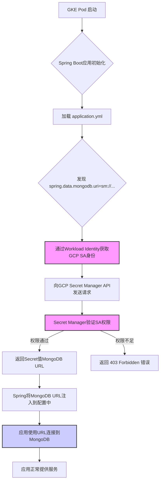
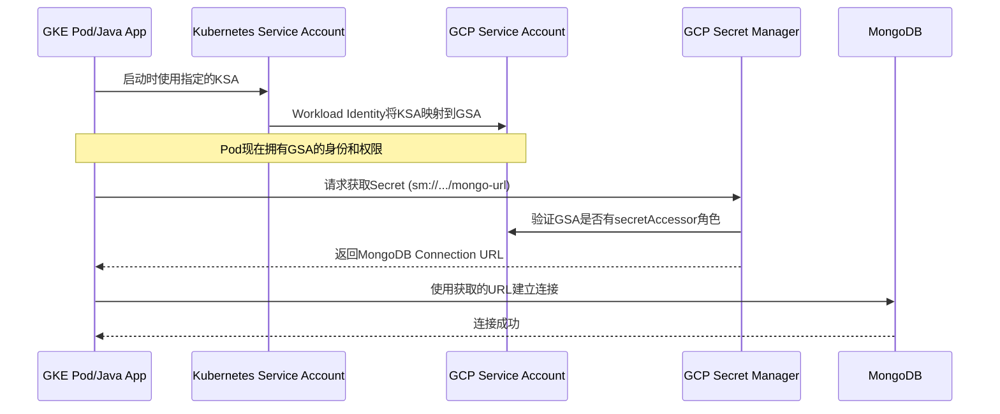

# Java Spring应用结合GCP Secret Manager的工作流

本文档旨在详细阐述一个在Google Kubernetes Engine (GKE)中运行的Java Spring Boot应用程序，如何安全、自动地从GCP Secret Manager中获取如MongoDB连接字符串等敏感信息，并完成服务验证的完整流程。

## 核心流程概览

整个流程的核心是利用GKE的Workload Identity机制，让Pod中的应用程序能够以一个指定的GCP服务账号（Service Account）的身份去访问GCP资源（如Secret Manager），从而避免了在代码或配置文件中硬编码任何密钥。

### 流程图 (Mermaid)



### 交互时序图 (Mermaid)



## 详细步骤解析

#### 1. Pod启动与Workload Identity

- **GKE Pod启动**: 当你的Java应用所在的Pod在GKE中被调度启动时，它会关联一个Kubernetes Service Account (KSA)。
- **Workload Identity**: 这是GKE提供的一项关键功能。你需要预先配置它，将KSA与一个GCP Service Account (GSA)进行绑定。这样，Pod内的进程发出的GCP API请求都会使用GSA的身份进行认证。这是实现安全访问的基础。

#### 2. Spring Boot配置加载

- **依赖**: 为了让Spring Boot能够识别`sm://`协议，你必须在`pom.xml`中添加`spring-cloud-gcp-starter-secretmanager`依赖。

  ```xml
  <dependency>
      <groupId>com.google.cloud</groupId>
      <artifactId>spring-cloud-gcp-starter-secretmanager</artifactId>
  </dependency>
  ```

- **配置文件**: 在`application.properties`或`application.yml`中，你可以像下面这样引用存储在Secret Manager中的密钥。

  ```yaml
  spring:
    data:
      mongodb:
        # Spring Cloud GCP会自动解析sm://协议
        uri: ${sm://projects/your-gcp-project-id/secrets/your-mongodb-secret-name/versions/latest}
  ```

#### 3. Secret Manager API调用与权限校验

- **自动解析**: 当Spring Boot启动并加载上述配置时，`spring-cloud-gcp-starter-secretmanager`会自动拦截`sm://`前缀。
- **身份认证**: 应用程序（通过Workload Identity获得了GSA的身份）向GCP Secret Manager API发起请求。
- **权限检查**: Secret Manager会检查这个GSA是否具有访问目标Secret的权限。**这是最容易出错的环节**。你必须确保GSA拥有`roles/secretmanager.secretAccessor`角色。

  你可以使用以下`gcloud`命令为服务账号授权：
  ```bash
  gcloud secrets add-iam-policy-binding your-mongodb-secret-name \
      --member="serviceAccount:your-gsa-email@your-gcp-project-id.iam.gserviceaccount.com" \
      --role="roles/secretmanager.secretAccessor" \
      --project="your-gcp-project-id"
  ```

#### 4. 获取Secret值并完成校验

- **获取与注入**: 如果权限验证通过，Secret Manager API会返回存储的密钥值（即完整的MongoDB连接字符串）。Spring Boot随后将这个值注入到`spring.data.mongodb.uri`属性中。
- **连接MongoDB**: Spring Data MongoDB模块使用这个最终的URI来创建与MongoDB数据库的连接。如果URI正确且网络可达，连接就会成功。

## 常见问题与排查

1.  **`ConfigurationPropertiesBindException`**:
    - **原因**: Spring Boot无法解析`${sm://...}`。这几乎总是因为缺少`spring-cloud-gcp-starter-secretmanager`依赖，或者依赖版本与Spring Boot版本不兼容。
    - **解决**: 检查并添加正确的Maven/Gradle依赖。

2.  **`java.io.IOException: Error code 403 trying to get security access token`**:
    - **原因**: 权限不足。Pod所使用的GSA没有访问目标Secret的`secretAccessor`角色。即使你要访问的MongoDB在另一个GCP项目中，获取其连接字符串的Secret所在的权限必须正确配置。
    - **解决**: 严格按照上面的`gcloud`命令，为正确的GSA授予正确的角色。确认Secret名称和项目ID没有错误。

3.  **跨项目访问**:
    - 如果你的MongoDB实例在另一个GCP项目中，请确保：
      - 用于运行Pod的GSA在**Secret所在的项目**中拥有`secretAccessor`权限。
      - GKE集群的网络（VPC）与MongoDB所在的VPC之间网络互通（例如通过VPC Peering）。
      - MongoDB的防火墙规则允许来自GKE Pod IP范围的流量。

