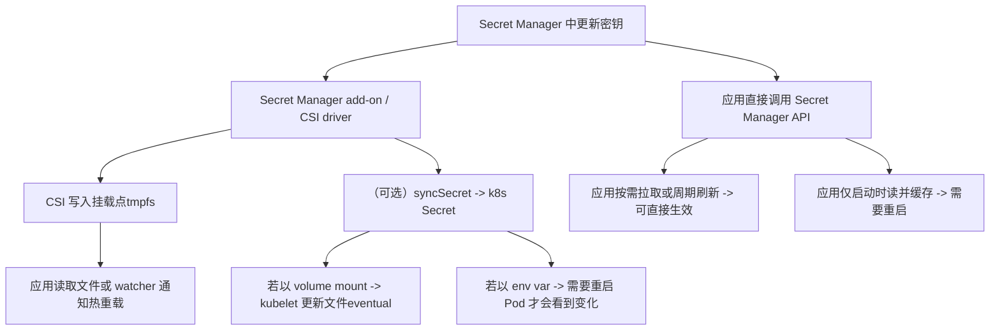
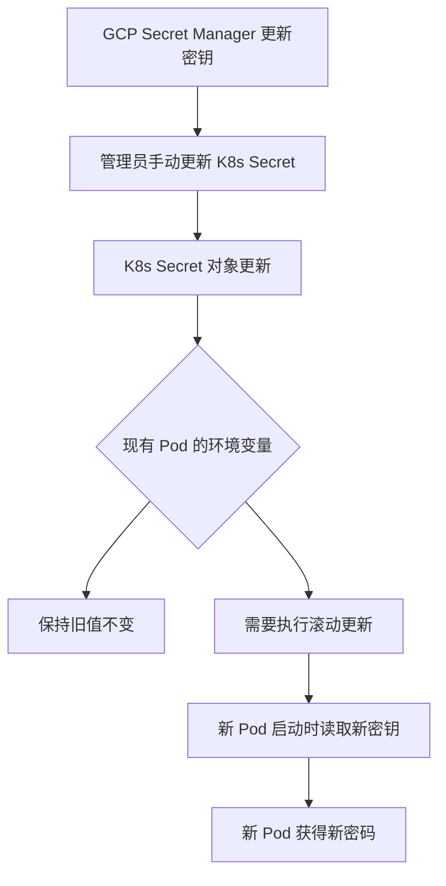
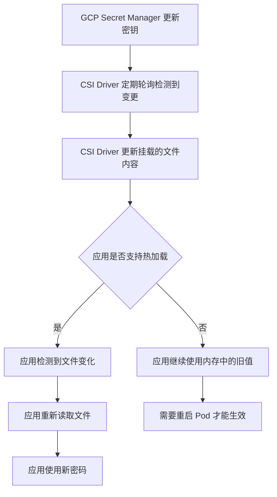
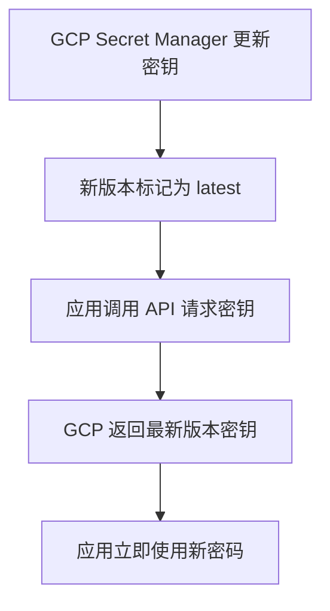
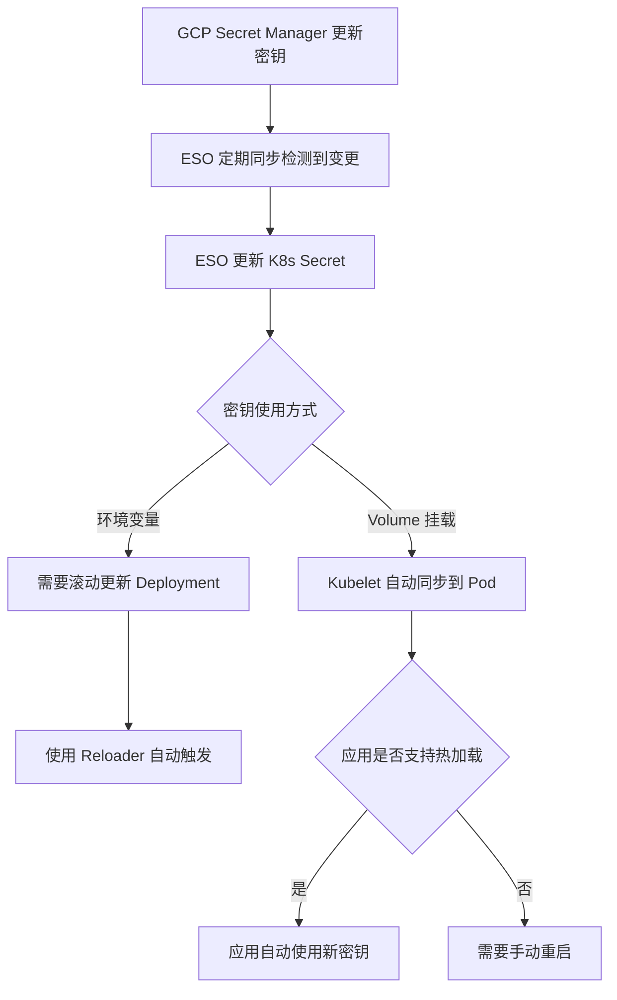
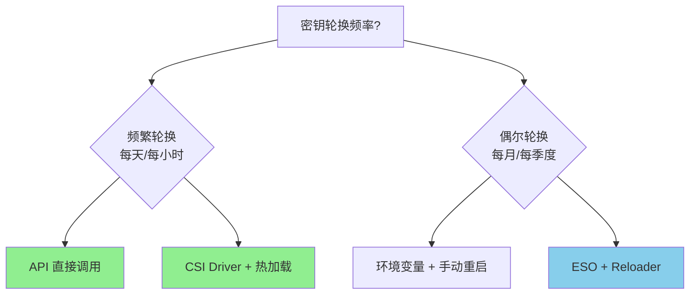

# ChatGPT 
问题分析
你问的是：当在 GCP Secret Manager 里轮换（更新）了比如数据库密码后，GKE 中的 Deployment Pod 是否需要重启才能生效？

答案是：“取决于你如何把 Secret 从 Secret Manager 注入到 Pod 以及应用如何读取这些值”。下面我把常见的集成方式逐一拆解、给出是否需要重启的结论、实现细节与实操建议（含 YAML/命令示例 + 一个流程图与最佳实践清单）。

结论速览（先看表）

|                                                                      |                                                  |                                                                                                                                      |                                                                                      |
| -------------------------------------------------------------------- | ------------------------------------------------ | ------------------------------------------------------------------------------------------------------------------------------------ | ------------------------------------------------------------------------------------ |
| 集成方式                                                             | 注入位置/机制                                    | 运行时是否自动生效（Pod 重启必要性）                                                                                                 | 备注 / 推荐做法                                                                      |
| GKE Secret Manager add-on / Secrets Store CSI Driver（mount volume） | CSI volume（tmpfs）直接把 secret 写到容器文件中  | 通常不需要重启 Pod — CSI 驱动会更新挂载文件，应用必须重新读取或热重载。                                                              | 开启 auto-rotation 可周期性下推最新值；应用需做热加载或由 sidecar/watcher 触发重读。 |
| Secrets Store CSI + syncSecret（同步成 Kubernetes Secret）           | 也可同步为 k8s Secret（open-source driver 支持） | 如果以 volume mount 使用：无需重启（文件会 eventual-consistent 更新）；如果以 env var 使用：必须重启（env 只在容器启动时注入）。     |                                                                                      |
| Kubernetes Secret（手动或外部 operator 同步） → env vars             | envFrom / valueFrom.secretKeyRef                 | 需要重启 Pod / 重建容器环境变量（K8s 不会替换运行中容器的环境变量）。                                                                |                                                                                      |
| 应用直接通过 Secret Manager API 在运行时读取                         | 应用自己调用 Secret Manager（Workload Identity） | 是否需要重启由应用决定：若应用按需/周期性读取或实现了版本检测/刷新，则不需要重启；若只在启动时读取并缓存，则需要重启或实现刷新机制。 |                                                                                      |
| Init Container 在启动时写入配置                                      | Init container 写入文件/ConfigMap/Secret         | 需要重启（只在启动时运行）                                                                                                           |                                                                                      |
| 其它（sidecar watcher / reload controller）                          | sidecar 负责轮询/watch 并通知主进程              | 无需重启主 Pod（通过信号或 HTTP API 触发热重载） — 推荐用于无法修改主应用逻辑时。                                                    |                                                                                      |

（表中结论基于 GKE / Kubernetes 官方文档与 Secrets-Store CSI driver 的行为。）

详细解析（按集成方式）

1. GKE Secret Manager add-on / Secrets-Store CSI Driver（推荐正向方案）

- 行为：GKE 的 Secret Manager add-on（基于 open-source Secrets Store CSI Driver + GCP provider）允许将 Secret Manager 的 secret 直接挂载为 Pod 的文件（tmpfs）。也支持配置 auto-rotation，把 Secret Manager 中更新后的值周期性下发到 Pod 的挂载目录。驱动本身不会重启应用容器。
- 是否需要重启？：不需要 Pod 重启来让挂载的文件内容更新。但应用必须能重新读取文件或支持热重载（例如监视文件变化、接收 SIGHUP、或提供热刷新接口）。驱动只负责把最新内容写入挂载点。
- 注意点：

- 部分 GKE 版本才支持 “自动轮换” 功能（例如文档提到 rotation feature 要求 GKE 版本 >= 1.32.2 才支持）。启用方式用 gcloud 指定 --enable-secret-manager-rotation 与 --secret-manager-rotation-interval。
- CSI 挂载是 tmpfs，写入到节点内存；Kubelet 的同步是 eventual-consistent（有同步延迟）。避免使用 subPath（subPath 不会自动更新）。

-

示例（开启集成 / rotation 的 gcloud 命令）：

# 启用 Secret Manager add-on（示例）
```bash
gcloud container clusters update CLUSTER_NAME \

--location=LOCATION \

--enable-secret-manager \

--enable-secret-manager-rotation \

--secret-manager-rotation-interval="60s"

```

（更多配置见官方文档。）

SecretProviderClass + Deployment（概念示例）：
```yaml
apiVersion: secrets-store.csi.x-k8s.io/v1

kind: SecretProviderClass

metadata:

name: gcp-sm-example

namespace: default

spec:

provider: gcp

parameters:

secrets: |

- resourceName: "projects/PROJECT_ID/secrets/DB_PASSWORD/versions/latest"

path: "db_password"

---

apiVersion: apps/v1

kind: Deployment

metadata:

name: app-with-sm

spec:

template:

spec:

containers:

- name: app

image: my-app:latest

volumeMounts:

- name: secret-vol

mountPath: /etc/secrets

readOnly: true

volumes:

- name: secret-vol

csi:

driver: secrets-store.csi.k8s.io    # 在 GKE add-on 场景可能是 secrets-store-gke.csi.k8s.io

readOnly: true

volumeAttributes:

secretProviderClass: "gcp-sm-example"

```

（示例简化，provider 与 driver 名称按集群实际情况调整。）

2. Secrets Store CSI

syncSecret

→ 同步为 Kubernetes Secret

- 行为：open-source 的 Secrets-Store CSI driver 提供 syncSecret 功能把外部 secret 同步为 Kubernetes Secret 对象。K8s Secret 被更新后：若是以 volume mount 使用，Kubelet 会将更新逐步投影到 Pod 的挂载目录（eventual-consistent）；若是以 env var 使用，则 env 在容器启动时注入，不会替换。
- 是否需要重启？：

- Volume mount → 不需要重启（但应用需重读文件）。
- Env var → 需要重启（或触发 rolling update / 重建 Pod）。

-

3. Kubernetes Secret（直接）作为 env var 注入

- 行为：Secret 变更只会在 API 层更新对象。容器内部的环境变量在进程启动时由容器运行时注入一次。Kubernetes 不会替换运行中容器的环境变量。
- 是否需要重启？：是。要让容器拿到新的 env 值，必须让 Pod 重建（rolling restart / rollout restart / patch deployment）。常见做法是 kubectl rollout restart deployment/... 或用 patch 更新 pod template（加入时间戳 env）来触发滚动更新。

示例：触发 Deployment 滚动重启

kubectl rollout restart deployment/my-deployment -n my-namespace

# 或者通过更新模板字段来触发

kubectl patch deployment my-deployment -p '{"spec":{"template":{"metadata":{"annotations":{"restartedAt":"'"$(date -u +%Y-%m-%dT%H:%M:%SZ)"'"}}}}}'

4. 应用直接调用 Secret Manager API（在运行时拉取）

- 行为：应用通过 Workload Identity（推荐）使用 Secret Manager API 在运行时读取 secret。你可以选择读取最新 latest 或指定版本。Google 官方在轮换建议中说明如何把版本绑定到应用以避免意外替换。
- 是否需要重启？：取决于应用实现：

- 若应用按每次使用/按需读取或有后台刷新逻辑 → 无需重启。
- 若应用只在启动时读取并缓存 → 需要重启或实现刷新机制。

-
- 优点/缺点：

- 优点：最灵活，能保证立即生效（只要应用实现了刷新）；避免 K8s Secret 的 API 暴露/冗余。
- 缺点：需要修改应用代码或以 sidecar/agent 方式实现刷新逻辑，增加对 Secret Manager 调用的配额/延迟考量。

-

应用端示例（伪代码） — 定期检查版本并原子替换内存中的 credentials：

# 伪代码示意

while True:

new_secret, version = secret_manager.get_secret('projects/.../secrets/DB_PASSWORD/versions/latest')

if version != cached_version:

# 原子更新

lock.acquire()

cached_secret = new_secret

cached_version = version

lock.release()

notify_connection_pool_to_rotate()

sleep(poll_interval)

5. Init container / one-time 拉取

- 只会在 Pod 启动时运行一次写文件或创建 ConfigMap 等，轮换后需要重启 Pod 才生效。

实战建议（基于上面结论）

1. 如果你可以改应用（最佳）：使用 Secret Manager add-on（CSI volume）或应用直接调用 Secret Manager API 并实现热刷新。在 CSI 场景下开启 add-on 的 auto-rotation 并在应用中实现文件变更 watch 或周期拉取。这样可以做到无停机的密钥轮换。
2. 如果不能改应用：

- 选择 sidecar watcher（小程序定期拉取 Secret 或 watch CSI 挂载目录），在检测到变化后通过 kill -HUP、HTTP 管理端点或其它方式通知主进程热重载；或
- 使用 operator / controller 在 secret 变更时触发 Deployment rolling-restart（kubectl rollout restart 或 patch pod template），保证平滑滚动更新。

4.

5.  避免把敏感信息当 env var 注入（如果需要频繁轮换），因为 env var 在运行中不可变；若要使用 env var，则必须接受 rolling restart 的成本。
6.  使用版本控制策略：在 Secret Manager 端使用版本（不要盲目用 latest）或在轮换时采用蓝绿策略：上传新版本、确保 new-version 对旧版兼容、然后在应用端切换到新版本或滚动更新。Google 的轮换建议里也有绑定版本的讨论。
7.  监控 & 审计：启用 Secret Manager 的访问审计日志、为 Pod 的 Workload Identity 做精细 IAM 控制，以及监控 CSI driver 的 SecretProviderClassPodStatus（可用于诊断为什么挂载没有刷新）。

例子：常见场景与操作命令（快速复制）

A. 启用 GKE Secret Manager add-on（并开启轮换）

# 创建/更新集群时启用 add-on 和 rotation
```bash
 gcloud container clusters update CLUSTER_NAME \

--location=LOCATION \

--enable-secret-manager \

--enable-secret-manager-rotation \

--secret-manager-rotation-interval=60s
```


（需要 GKE 版本支持 rotation 的最低版本，见文档。）

B. 强制 Deployment 滚动重启（当你只能用 env var）

kubectl rollout restart deployment/my-deployment -n my-namespace

# 或者用 patch 注入时间戳（触发模板变化）

kubectl patch deployment my-deployment -p '{"spec":{"template":{"metadata":{"annotations":{"restartedAt":"'"$(date -u +%Y-%m-%dT%H:%M:%SZ)"'"}}}}}'

（env var 注入场景常用方法）

C. 用 sidecar 监视文件并发送 SIGHUP（示意）

# watcher.sh (非常简化)

while inotifywait -e close_write /etc/secrets/db_password; do

kill -HUP $(cat /var/run/main.pid)  # 假设主进程 pid 写在此处

done

（适用于无法修改主应用但支持 SIGHUP 热重载的场景）

流程图 — Secret 轮换与 Pod 生效路径（Mermaid）



常见陷阱与注意事项

- subPath 不会自动更新：若你用 secret volume 并用 subPath 挂载单个文件，更新不会投影到 Pod 中（需避免）。
- Kubelet 的同步延迟：Secret 更新到 Pod 的文件存在 kubelet cache + sync 周期延迟（eventual-consistent），不是瞬时。
- CSI 驱动版本 & GKE 版本兼容性：确保集群的 GKE 版本支持你需要的功能（如 add-on 的 rotation 要求特定版本）。
- 权限最小化：使用 Workload Identity 给 Pod 的 KSA 最小 roles/secretmanager.secretAccessor 权限，否则容易扩大攻击面。
- 监控刷新失败：如果 CSI 驱动未能按期刷新，检查 SecretProviderClassPodStatus、driver 日志与 provider（provider-gcp）issue。历史 issue 表明 autorotation 有时需要排查。

推荐的逐步落地策略（实操路线）

1. 短期（无改应用能力）：使用 Secrets-Store CSI driver + 一个轻量 watcher sidecar（又或 operator）来监测并触发主进程重载或滚动重启。避免 env var 注入。
2. 中期（可改应用）：把关键 secret 由 env var 改为 CSI volume 或直接在代码中按需调用 Secret Manager，并实现安全的刷新逻辑（版本检测 + 重试/backoff + 原子替换）。
3. 长期：建立轮换演练（rotation playbook）、监控/报警与审计，做到密钥轮换对业务零停机或可控回滚。

参考（关键文档 / 链接摘录）

- GKE Secret Manager add-on（包含 auto-rotation、启用方法、限制）。
- Secrets Store CSI Driver — Auto rotation / usage / SecretProviderClass 概念。
- Kubernetes Secrets 文档（volume 更新的 eventual-consistency、env var 注入行为）。
- Secrets Store CSI Driver 关于自动旋转与 syncSecret 的说明。
- 轮换最佳实践与绑定版本建议（Secret Manager）。

小结（一句话）

是否需要重启 Pod 完全取决于 secret 的注入方式与应用的刷新能力： 使用 CSI volume / 应用端动态读取 / sidecar watcher，可以实现零重启；而把 secret 作为 env var 注入的场景则必须重启或做滚动更新才能生效。

如果你愿意，我可以：

- 根据你现在的 cluster 配置（GKE 版本、是否启用了 Secret Manager add-on、当前注入方式：env/volume/应用拉取）给出逐步迁移计划和具体 YAML/脚本（包括 watcher sidecar、rolling restart controller、或 Java/Go 的示例刷新逻辑）。
- 或者直接帮你写一个 轻量 watcher sidecar（bash/python）示例并生成对应 Deployment YAML。

你想先让我做哪一个？

# Claude
# GCP Secret Manager 与 GKE Pod 重启分析

## 问题分析

GCP Secret Manager 中的密钥轮换后，Pod 是否需要重启取决于**密钥的加载方式**和**访问模式**。不同的集成方案有不同的行为特性。

-----

## 核心结论

|集成方式                     |密钥更新后是否需要重启 Pod|原因                      |
|-------------------------|---------------|------------------------|
|环境变量 (Env)               |**是**          |环境变量在 Pod 启动时注入，运行时不可变  |
|Volume 挂载 (CSI Driver)   |**否**          |定期自动同步到 Volume，应用需支持热加载 |
|应用代码直接调用 API             |**否**          |每次请求实时获取最新密钥            |
|Kubernetes Secret (手动同步) |**是**          |K8s Secret 需要手动更新后重启 Pod|
|External Secrets Operator|**取决于配置**      |可自动同步并触发滚动更新            |

-----

## 各种集成方式深度分析

### 1. 环境变量方式 (Environment Variables)

#### 配置示例

```yaml
apiVersion: v1
kind: Pod
metadata:
  name: app-pod
spec:
  containers:
  - name: app
    image: myapp:latest
    env:
    - name: DB_PASSWORD
      valueFrom:
        secretKeyRef:
          name: db-secret
          key: password
```

#### 加载时机

- **Pod 创建时**：Kubelet 从 Kubernetes Secret 读取值并注入到容器的环境变量
- **仅一次性注入**：环境变量在容器启动后不会更新

#### 是否需要重启

**✅ 必须重启**

#### 原因分析

1. 环境变量是进程启动参数的一部分
2. Linux 进程的环境变量在 `execve()` 系统调用时确定
3. 运行中的进程无法修改自己的环境变量
4. 即使更新 K8s Secret，已运行的 Pod 中的环境变量不会改变

#### 流程图



#### 最佳实践

```bash
# 更新 Secret 后触发滚动更新
kubectl rollout restart deployment/myapp-deployment

# 或使用注解强制更新
kubectl patch deployment myapp-deployment \
  -p '{"spec":{"template":{"metadata":{"annotations":{"restartedAt":"'$(date +%s)'"}}}}}'
```

-----

### 2. Volume 挂载 + Secret Store CSI Driver

#### 配置示例

```yaml
apiVersion: v1
kind: Pod
metadata:
  name: app-pod
spec:
  containers:
  - name: app
    image: myapp:latest
    volumeMounts:
    - name: secrets-store
      mountPath: "/mnt/secrets"
      readOnly: true
  volumes:
  - name: secrets-store
    csi:
      driver: secrets-store.csi.k8s.io
      readOnly: true
      volumeAttributes:
        secretProviderClass: "gcp-secret-provider"
```

**SecretProviderClass 示例**：

```yaml
apiVersion: secrets-store.csi.x-k8s.io/v1
kind: SecretProviderClass
metadata:
  name: gcp-secret-provider
spec:
  provider: gcp
  parameters:
    secrets: |
      - resourceName: "projects/PROJECT_ID/secrets/db-password/versions/latest"
        path: "db-password"
```

#### 加载时机

1. **Pod 启动时**：CSI Driver 挂载 Volume，从 GCP Secret Manager 拉取密钥
2. **定期轮询**：CSI Driver 后台定期（默认 2 分钟）检查并更新挂载的文件

#### 是否需要重启

**❌ 不需要重启** (但有前提条件)

#### 原因分析

1. CSI Driver 会定期同步最新密钥到挂载的文件
2. 文件内容更新后，应用可以重新读取文件获取新值
3. **关键前提**：应用必须实现热加载机制（监听文件变化或定期重新读取）

#### 同步延迟

- 默认轮询间隔：**120 秒**
- 可通过 `rotation-poll-interval` 参数调整
- 实际生效时间 = 轮询间隔 + 应用检测时间

#### 流程图



#### 最佳实践

**配置文件监听 (Go 示例)**：

```go
package main

import (
    "log"
    "os"
    "time"
    
    "github.com/fsnotify/fsnotify"
)

func watchSecretFile(filePath string) {
    watcher, _ := fsnotify.NewWatcher()
    defer watcher.Close()
    
    watcher.Add(filePath)
    
    for {
        select {
        case event := <-watcher.Events:
            if event.Op&fsnotify.Write == fsnotify.Write {
                log.Println("密钥文件已更新，重新加载配置")
                reloadConfig(filePath)
            }
        }
    }
}

func reloadConfig(filePath string) {
    data, _ := os.ReadFile(filePath)
    // 更新数据库连接池等
    log.Printf("新密码: %s", string(data))
}
```

**配置 CSI Driver 轮询间隔**：

```yaml
apiVersion: secrets-store.csi.x-k8s.io/v1
kind: SecretProviderClass
metadata:
  name: gcp-secret-provider
spec:
  provider: gcp
  parameters:
    rotation-poll-interval: "60s"  # 设置为 60 秒
    secrets: |
      - resourceName: "projects/PROJECT_ID/secrets/db-password/versions/latest"
        path: "db-password"
```

-----

### 3. 应用代码直接调用 GCP Secret Manager API

#### 代码示例 (Python)

```python
from google.cloud import secretmanager

def get_database_password():
    client = secretmanager.SecretManagerServiceClient()
    name = "projects/PROJECT_ID/secrets/db-password/versions/latest"
    response = client.access_secret_version(request={"name": name})
    return response.payload.data.decode("UTF-8")

# 每次需要时调用
password = get_database_password()
```

#### 加载时机

- **按需实时获取**：每次调用 API 时获取最新版本

#### 是否需要重启

**❌ 不需要重启**

#### 原因分析

1. 每次请求都是实时调用 GCP API
2. 始终获取 `latest` 版本的密钥
3. 无缓存问题（除非应用层自己缓存）

#### 流程图



#### 优缺点

|优点        |缺点             |
|----------|---------------|
|密钥实时同步，零延迟|每次调用有网络开销      |
|无需重启 Pod  |需要管理 GCP 凭证    |
|实现简单      |高频调用可能触发 API 限额|

#### 最佳实践

**带缓存的实现**：

```python
import time
from google.cloud import secretmanager

class SecretCache:
    def __init__(self, ttl=300):  # 5 分钟缓存
        self.client = secretmanager.SecretManagerServiceClient()
        self.cache = {}
        self.ttl = ttl
    
    def get_secret(self, secret_name):
        now = time.time()
        
        if secret_name in self.cache:
            value, timestamp = self.cache[secret_name]
            if now - timestamp < self.ttl:
                return value
        
        # 缓存过期或不存在，重新获取
        name = f"projects/PROJECT_ID/secrets/{secret_name}/versions/latest"
        response = self.client.access_secret_version(request={"name": name})
        value = response.payload.data.decode("UTF-8")
        
        self.cache[secret_name] = (value, now)
        return value

# 使用
cache = SecretCache(ttl=300)
password = cache.get_secret("db-password")
```

-----

### 4. External Secrets Operator (ESO)

#### 架构说明

External Secrets Operator 是第三方工具，自动同步外部密钥存储（如 GCP Secret Manager）到 Kubernetes Secret。

#### 配置示例

**安装 ESO**：

```bash
helm repo add external-secrets https://charts.external-secrets.io
helm install external-secrets \
  external-secrets/external-secrets \
  -n external-secrets-system \
  --create-namespace
```

**配置 SecretStore**：

```yaml
apiVersion: external-secrets.io/v1beta1
kind: SecretStore
metadata:
  name: gcpsm-secret-store
spec:
  provider:
    gcpsm:
      projectID: "PROJECT_ID"
      auth:
        workloadIdentity:
          clusterLocation: us-central1
          clusterName: my-cluster
          serviceAccountRef:
            name: external-secrets-sa
```

**配置 ExternalSecret**：

```yaml
apiVersion: external-secrets.io/v1beta1
kind: ExternalSecret
metadata:
  name: db-credentials
spec:
  refreshInterval: 1m  # 每分钟同步一次
  secretStoreRef:
    name: gcpsm-secret-store
    kind: SecretStore
  target:
    name: db-secret
    creationPolicy: Owner
  data:
  - secretKey: password
    remoteRef:
      key: db-password
```

#### 加载时机

1. **ExternalSecret 创建时**：立即同步一次
2. **定期同步**：根据 `refreshInterval` 定期检查并更新 K8s Secret
3. **K8s Secret 更新后**：取决于 Pod 的密钥使用方式

#### 是否需要重启

**取决于配置**

|场景             |是否需要重启           |
|---------------|-----------------|
|密钥用作环境变量       |**是**            |
|密钥用作 Volume 挂载 |**否** (如果应用支持热加载)|
|配置 Reloader 等工具|**自动触发滚动更新**     |

#### 流程图



#### 配合 Reloader 自动重启

**安装 Reloader**：

```bash
helm repo add stakater https://stakater.github.io/stakater-charts
helm install reloader stakater/reloader
```

**Deployment 添加注解**：

```yaml
apiVersion: apps/v1
kind: Deployment
metadata:
  name: myapp
  annotations:
    reloader.stakater.com/auto: "true"  # 自动监听所有 Secret/ConfigMap
    # 或指定特定 Secret
    # secret.reloader.stakater.com/reload: "db-secret"
spec:
  template:
    spec:
      containers:
      - name: app
        image: myapp:latest
        env:
        - name: DB_PASSWORD
          valueFrom:
            secretKeyRef:
              name: db-secret
              key: password
```

#### 工作原理

1. ESO 更新 K8s Secret
2. Reloader 检测到 Secret 变更
3. Reloader 自动触发 Deployment 滚动更新
4. 新 Pod 使用更新后的密钥

-----

## 综合对比表

|方案            |实时性       |需要重启|网络依赖|复杂度|推荐场景          |
|--------------|----------|----|----|---|--------------|
|环境变量          |❌ 低       |✅ 是 |低   |低  |简单应用、不频繁轮换    |
|CSI Driver    |⚠️ 中 (2 分钟)|❌ 否*|中   |中  |需要自动同步、应用支持热加载|
|API 直接调用      |✅ 高 (实时)  |❌ 否 |高   |低  |高频轮换、需要实时性    |
|ESO + Reloader|⚠️ 中 (1 分钟)|🔄 自动|中   |高  |企业级、自动化运维     |

*前提是应用支持热加载

-----

## 最佳实践建议

### 1. 选择合适的集成方式



### 2. 密钥版本管理策略

```bash
# 始终使用 latest 别名
projects/PROJECT_ID/secrets/db-password/versions/latest

# 或使用固定版本（不推荐用于自动轮换）
projects/PROJECT_ID/secrets/db-password/versions/3
```

### 3. 监控与告警

```yaml
# Prometheus 监控 Secret 更新
apiVersion: v1
kind: ServiceMonitor
metadata:
  name: external-secrets
spec:
  selector:
    matchLabels:
      app: external-secrets
  endpoints:
  - port: metrics
    interval: 30s
```

### 4. 测试密钥轮换

```bash
# 1. 更新 GCP Secret
gcloud secrets versions add db-password --data-file=new_password.txt

# 2. 验证 K8s Secret 是否更新 (ESO 场景)
kubectl get secret db-secret -o jsonpath='{.data.password}' | base64 -d

# 3. 检查 Pod 是否滚动更新
kubectl rollout status deployment/myapp

# 4. 验证应用连接
kubectl exec -it myapp-pod -- curl http://localhost:8080/health
```

-----

## 注意事项

1. **环境变量方式**：

- 必须手动触发滚动更新
- 可使用 `kubectl rollout restart` 命令

1. **CSI Driver 方式**：

- 确保应用实现了文件监听或定期重载
- 注意轮询间隔的性能影响

1. **API 调用方式**：

- 注意 GCP API 配额限制（10000 次/分钟）
- 实现合理的缓存策略避免频繁调用

1. **ESO 方式**：

- 需要额外维护 ESO 和 Reloader 组件
- 注意 `refreshInterval` 不要设置过短

1. **数据库连接池**：

- 密钥更新后需要重建连接池
- 考虑使用连接池的重连机制

1. **日志安全**：

- 避免在日志中输出明文密码
- 使用 `***` 或 `[REDACTED]` 代替

-----

## 推荐方案

根据不同场景推荐：

### 场景 1：简单应用，密钥很少变更

**推荐**：环境变量 + 手动滚动更新

### 场景 2：中等规模，密钥定期轮换

**推荐**：External Secrets Operator + Reloader

### 场景 3：高安全要求，频繁轮换

**推荐**：CSI Driver + 应用热加载

### 场景 4：微服务架构，实时性要求高

**推荐**：应用直接调用 API + 缓存机制​​​​​​​​​​​​​​​​
