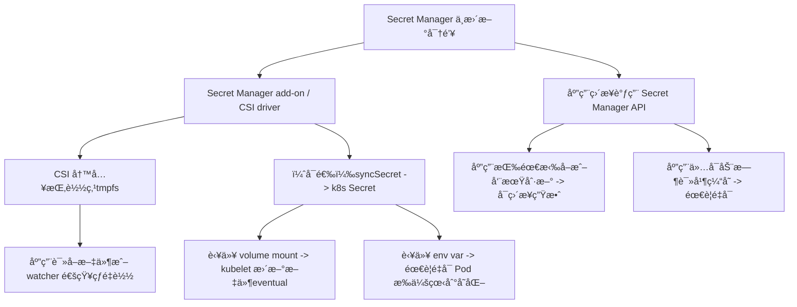
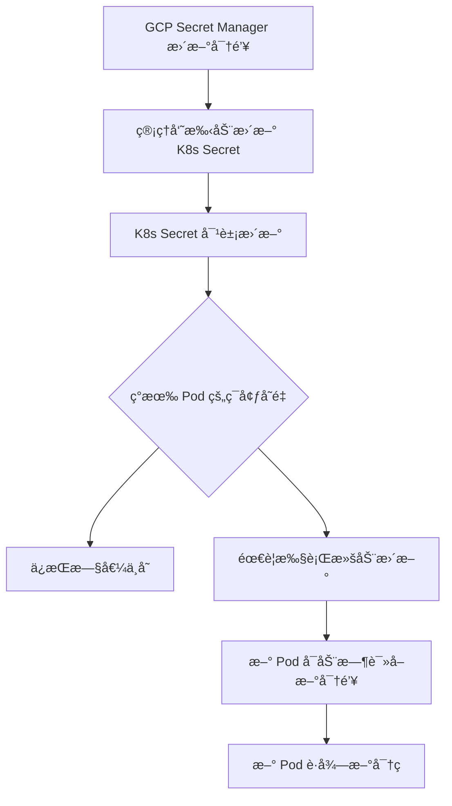
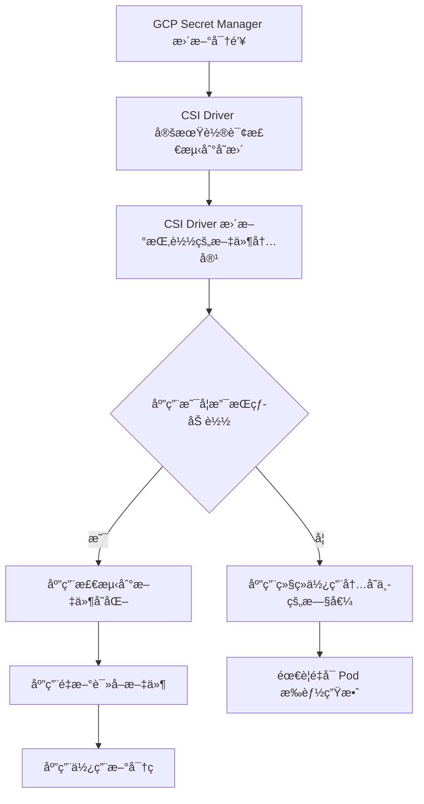
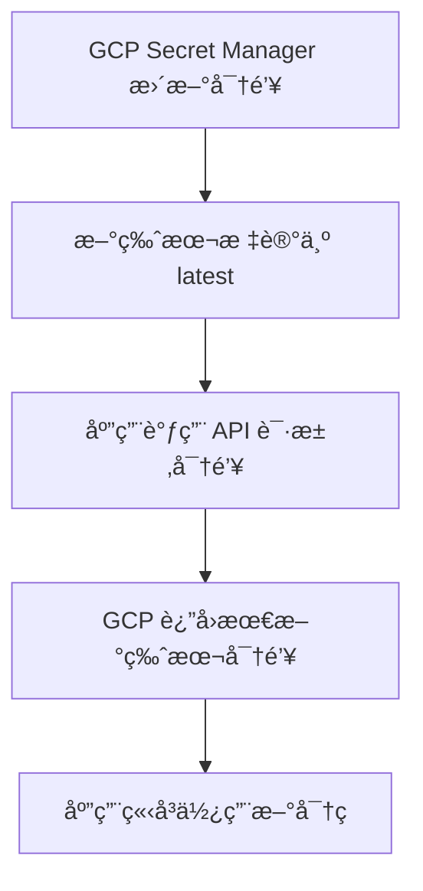
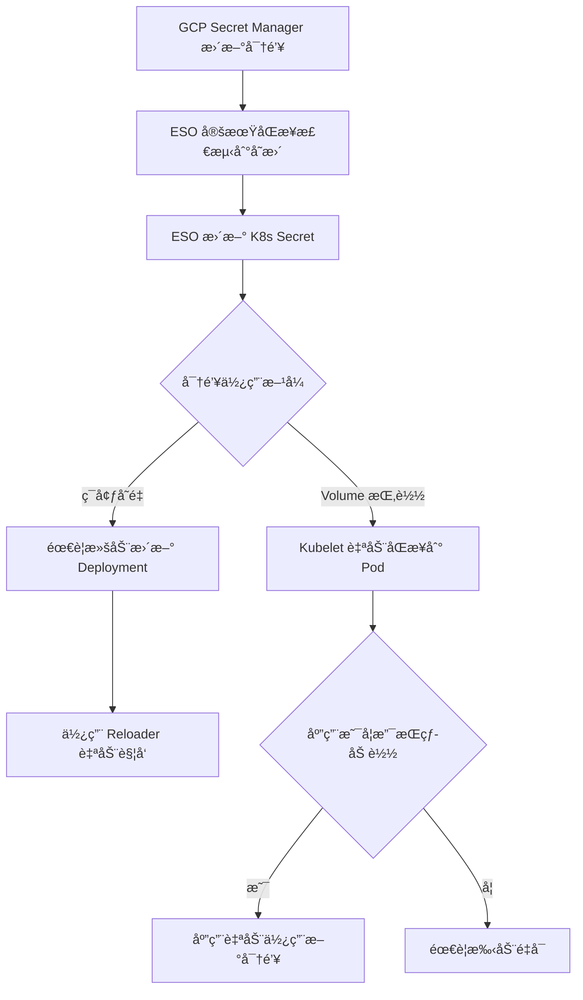
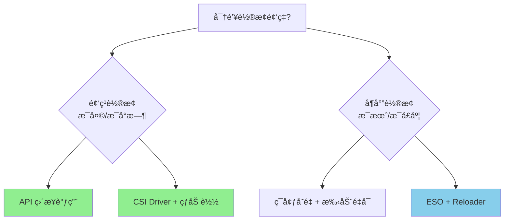

# ChatGPT 
问题分æ
你问的是：当在 GCP Secret Manager 里轮æ¢ï¼ˆæ›´æ–°ï¼‰äº†æ¯”如数æ®åº“密ç å，GKE 中的 Deployment Pod 是å¦éœ€è¦é‡å¯æ‰èƒ½ç”Ÿæ•ˆï¼Ÿ

答案是：“å–决äºä½ å¦‚何把 Secret ä» Secret Manager 注入到 Pod 以åŠåº”用如何读å–这些值â€ã€‚下é¢æˆ‘把常è§çš„集æˆæ–¹å¼é€ä¸€æ‹†è§£ã€ç»™å‡ºæ˜¯å¦éœ€è¦é‡å¯çš„结论ã€å®ç°ç»†èŠ‚ä¸å®æ“å»ºè®®ï¼ˆå« YAML/命令示例 + 一个æµç¨‹å›¾ä¸æœ€ä½³å®è·µæ¸…å•ï¼‰ã€‚

结论速览（先看表）

|                                                                      |                                                  |                                                                                                                                      |                                                                                      |
| -------------------------------------------------------------------- | ------------------------------------------------ | ------------------------------------------------------------------------------------------------------------------------------------ | ------------------------------------------------------------------------------------ |
| 集æˆæ–¹å¼                                                             | 注入ä½ç½®/机制                                    | è¿è¡Œæ—¶æ˜¯å¦è‡ªåŠ¨ç”Ÿæ•ˆï¼ˆPod é‡å¯å¿…è¦æ€§ï¼‰                                                                                                 | 备注 / æ¨èåšæ³•                                                                      |
| GKE Secret Manager add-on / Secrets Store CSI Driver（mount volume） | CSI volume（tmpfs）直æ¥æŠŠ secret 写到容器文件中  | 通常ä¸éœ€è¦é‡å¯ Pod — CSI 驱动会更新挂载文件，应用必须é‡æ–°è¯»å–或热é‡è½½ã€‚                                                              | å¼€å¯ auto-rotation å¯å‘¨æœŸæ€§ä¸‹æ¨æœ€æ–°å€¼ï¼›åº”用需åšçƒ­åŠ è½½æˆ–ç”± sidecar/watcher 触å‘é‡è¯»ã€‚ |
| Secrets Store CSI + syncSecret（åŒæ­¥æˆ Kubernetes Secret）           | 也å¯åŒæ­¥ä¸º k8s Secret（open-source driver 支æŒï¼‰ | 如æœä»¥ volume mount 使用：无需é‡å¯ï¼ˆæ–‡ä»¶ä¼š eventual-consistent 更新）；如æœä»¥ env var 使用：必须é‡å¯ï¼ˆenv åªåœ¨å®¹å™¨å¯åŠ¨æ—¶æ³¨å…¥ï¼‰ã€‚     |                                                                                      |
| Kubernetes Secret（手动或外部 operator åŒæ­¥ï¼‰ → env vars             | envFrom / valueFrom.secretKeyRef                 | 需è¦é‡å¯ Pod / é‡å»ºå®¹å™¨ç¯å¢ƒå˜é‡ï¼ˆK8s ä¸ä¼šæ›¿æ¢è¿è¡Œä¸­å®¹å™¨çš„ç¯å¢ƒå˜é‡ï¼‰ã€‚                                                                |                                                                                      |
| 应用直æ¥é€šè¿‡ Secret Manager API 在è¿è¡Œæ—¶è¯»å–                         | 应用自己调用 Secret Manager（Workload Identity） | 是å¦éœ€è¦é‡å¯ç”±åº”用决定：若应用按需/周期性读å–或å®ç°äº†ç‰ˆæœ¬æ£€æµ‹/刷新，则ä¸éœ€è¦é‡å¯ï¼›è‹¥åªåœ¨å¯åŠ¨æ—¶è¯»å–并缓存，则需è¦é‡å¯æˆ–å®ç°åˆ·æ–°æœºåˆ¶ã€‚ |                                                                                      |
| Init Container 在å¯åŠ¨æ—¶å†™å…¥é…ç½®                                      | Init container 写入文件/ConfigMap/Secret         | 需è¦é‡å¯ï¼ˆåªåœ¨å¯åŠ¨æ—¶è¿è¡Œï¼‰                                                                                                           |                                                                                      |
| 其它（sidecar watcher / reload controller）                          | sidecar 负责轮询/watch 并通知主进程              | 无需é‡å¯ä¸» Pod（通过信å·æˆ– HTTP API 触å‘热é‡è½½ï¼‰ — æ¨è用äºæ— æ³•ä¿®æ”¹ä¸»åº”用逻辑时。                                                    |                                                                                      |

ï¼ˆè¡¨ä¸­ç»“è®ºåŸºäº GKE / Kubernetes å®˜æ–¹æ–‡æ¡£ä¸ Secrets-Store CSI driver 的行为。）

详细解æ（按集æˆæ–¹å¼ï¼‰

1. GKE Secret Manager add-on / Secrets-Store CSI Driver（æ¨èæ­£å‘方案）

- 行为：GKE çš„ Secret Manager add-onï¼ˆåŸºäº open-source Secrets Store CSI Driver + GCP provider）å…许将 Secret Manager çš„ secret ç›´æ¥æŒ‚载为 Pod 的文件（tmpfs）。也支æŒé…ç½® auto-rotation，把 Secret Manager 中更新å的值周期性下å‘到 Pod 的挂载目录。驱动本身ä¸ä¼šé‡å¯åº”用容器。
- 是å¦éœ€è¦é‡å¯ï¼Ÿï¼šä¸éœ€è¦ Pod é‡å¯æ¥è®©æŒ‚载的文件内容更新。但应用必须能é‡æ–°è¯»å–文件或支æŒçƒ­é‡è½½ï¼ˆä¾‹å¦‚监视文件å˜åŒ–ã€æ¥æ”¶ SIGHUPã€æˆ–æ供热刷新æ¥å£ï¼‰ã€‚驱动åªè´Ÿè´£æŠŠæœ€æ–°å†…容写入挂载点。
- 注æ„点：

- 部分 GKE 版本æ‰æ”¯æŒ “自动轮æ¢â€ 功能（例如文档æ到 rotation feature è¦æ±‚ GKE 版本 >= 1.32.2 æ‰æ”¯æŒï¼‰ã€‚å¯ç”¨æ–¹å¼ç”¨ gcloud 指定 --enable-secret-manager-rotation ä¸ --secret-manager-rotation-interval。
- CSI 挂载是 tmpfs，写入到节点内存；Kubelet çš„åŒæ­¥æ˜¯ eventual-consistent（有åŒæ­¥å»¶è¿Ÿï¼‰ã€‚é¿å…使用 subPath（subPath ä¸ä¼šè‡ªåŠ¨æ›´æ–°ï¼‰ã€‚

-

示例（开å¯é›†æˆ / rotation çš„ gcloud 命令）：

# å¯ç”¨ Secret Manager add-on（示例）
```bash
gcloud container clusters update CLUSTER_NAME \

--location=LOCATION \

--enable-secret-manager \

--enable-secret-manager-rotation \

--secret-manager-rotation-interval="60s"

```

（更多é…ç½®è§å®˜æ–¹æ–‡æ¡£ã€‚）

SecretProviderClass + Deployment（概念示例）：
```yaml
apiVersion: secrets-store.csi.x-k8s.io/v1

kind: SecretProviderClass

metadata:

name: gcp-sm-example

namespace: default

spec:

provider: gcp

parameters:

secrets: |

- resourceName: "projects/PROJECT_ID/secrets/DB_PASSWORD/versions/latest"

path: "db_password"

---

apiVersion: apps/v1

kind: Deployment

metadata:

name: app-with-sm

spec:

template:

spec:

containers:

- name: app

image: my-app:latest

volumeMounts:

- name: secret-vol

mountPath: /etc/secrets

readOnly: true

volumes:

- name: secret-vol

csi:

driver: secrets-store.csi.k8s.io    # 在 GKE add-on 场景å¯èƒ½æ˜¯ secrets-store-gke.csi.k8s.io

readOnly: true

volumeAttributes:

secretProviderClass: "gcp-sm-example"

```

（示例简化，provider ä¸ driver å称按集群å®é™…情况调整。）

2. Secrets Store CSI

syncSecret

→ åŒæ­¥ä¸º Kubernetes Secret

- 行为：open-source çš„ Secrets-Store CSI driver æä¾› syncSecret 功能把外部 secret åŒæ­¥ä¸º Kubernetes Secret 对象。K8s Secret 被更新å：若是以 volume mount 使用，Kubelet 会将更新é€æ­¥æŠ•å½±åˆ° Pod 的挂载目录（eventual-consistent）；若是以 env var 使用，则 env 在容器å¯åŠ¨æ—¶æ³¨å…¥ï¼Œä¸ä¼šæ›¿æ¢ã€‚
- 是å¦éœ€è¦é‡å¯ï¼Ÿï¼š

- Volume mount → ä¸éœ€è¦é‡å¯ï¼ˆä½†åº”用需é‡è¯»æ–‡ä»¶ï¼‰ã€‚
- Env var → 需è¦é‡å¯ï¼ˆæˆ–è§¦å‘ rolling update / é‡å»º Pod）。

-

3. Kubernetes Secret（直æ¥ï¼‰ä½œä¸º env var 注入

- 行为：Secret å˜æ›´åªä¼šåœ¨ API 层更新对象。容器内部的ç¯å¢ƒå˜é‡åœ¨è¿›ç¨‹å¯åŠ¨æ—¶ç”±å®¹å™¨è¿è¡Œæ—¶æ³¨å…¥ä¸€æ¬¡ã€‚Kubernetes ä¸ä¼šæ›¿æ¢è¿è¡Œä¸­å®¹å™¨çš„ç¯å¢ƒå˜é‡ã€‚
- 是å¦éœ€è¦é‡å¯ï¼Ÿï¼šæ˜¯ã€‚è¦è®©å®¹å™¨æ‹¿åˆ°æ–°çš„ env 值，必须让 Pod é‡å»ºï¼ˆrolling restart / rollout restart / patch deployment）。常è§åšæ³•æ˜¯ kubectl rollout restart deployment/... 或用 patch æ›´æ–° pod template（加入时间戳 env）æ¥è§¦å‘滚动更新。

ç¤ºä¾‹ï¼šè§¦å‘ Deployment 滚动é‡å¯

kubectl rollout restart deployment/my-deployment -n my-namespace

# 或者通过更新模æ¿å­—段æ¥è§¦å‘

kubectl patch deployment my-deployment -p '{"spec":{"template":{"metadata":{"annotations":{"restartedAt":"'"$(date -u +%Y-%m-%dT%H:%M:%SZ)"'"}}}}}'

4. 应用直æ¥è°ƒç”¨ Secret Manager API（在è¿è¡Œæ—¶æ‹‰å–）

- 行为：应用通过 Workload Identity（æ¨è）使用 Secret Manager API 在è¿è¡Œæ—¶è¯»å– secret。你å¯ä»¥é€‰æ‹©è¯»å–最新 latest 或指定版本。Google 官方在轮æ¢å»ºè®®ä¸­è¯´æ˜å¦‚何把版本绑定到应用以é¿å…æ„外替æ¢ã€‚
- 是å¦éœ€è¦é‡å¯ï¼Ÿï¼šå–决äºåº”用å®ç°ï¼š

- 若应用按æ¯æ¬¡ä½¿ç”¨/按需读å–或有åå°åˆ·æ–°é€»è¾‘ → 无需é‡å¯ã€‚
- 若应用åªåœ¨å¯åŠ¨æ—¶è¯»å–并缓存 → 需è¦é‡å¯æˆ–å®ç°åˆ·æ–°æœºåˆ¶ã€‚

-
- 优点/缺点：

- 优点：最çµæ´»ï¼Œèƒ½ä¿è¯ç«‹å³ç”Ÿæ•ˆï¼ˆåªè¦åº”用å®ç°äº†åˆ·æ–°ï¼‰ï¼›é¿å… K8s Secret çš„ API 暴露/冗余。
- 缺点：需è¦ä¿®æ”¹åº”用代ç æˆ–以 sidecar/agent æ–¹å¼å®ç°åˆ·æ–°é€»è¾‘，å¢åŠ å¯¹ Secret Manager 调用的é…é¢/延迟考é‡ã€‚

-

应用端示例（伪代ç ï¼‰ — 定期检查版本并åŸå­æ›¿æ¢å†…存中的 credentials：

# 伪代ç ç¤ºæ„

while True:

new_secret, version = secret_manager.get_secret('projects/.../secrets/DB_PASSWORD/versions/latest')

if version != cached_version:

# åŸå­æ›´æ–°

lock.acquire()

cached_secret = new_secret

cached_version = version

lock.release()

notify_connection_pool_to_rotate()

sleep(poll_interval)

5. Init container / one-time 拉å–

- åªä¼šåœ¨ Pod å¯åŠ¨æ—¶è¿è¡Œä¸€æ¬¡å†™æ–‡ä»¶æˆ–创建 ConfigMap 等，轮æ¢å需è¦é‡å¯ Pod æ‰ç”Ÿæ•ˆã€‚

å®æˆ˜å»ºè®®ï¼ˆåŸºäºä¸Šé¢ç»“论）

1. 如æœä½ å¯ä»¥æ”¹åº”用（最佳）：使用 Secret Manager add-on（CSI volume）或应用直æ¥è°ƒç”¨ Secret Manager API 并å®ç°çƒ­åˆ·æ–°ã€‚在 CSI åœºæ™¯ä¸‹å¼€å¯ add-on çš„ auto-rotation 并在应用中å®ç°æ–‡ä»¶å˜æ›´ watch 或周期拉å–。这样å¯ä»¥åšåˆ°æ— åœæœºçš„密钥轮æ¢ã€‚
2. 如æœä¸èƒ½æ”¹åº”用：

- 选择 sidecar watcher（å°ç¨‹åºå®šæœŸæ‹‰å– Secret 或 watch CSI 挂载目录），在检测到å˜åŒ–å通过 kill -HUPã€HTTP 管ç†ç«¯ç‚¹æˆ–其它方å¼é€šçŸ¥ä¸»è¿›ç¨‹çƒ­é‡è½½ï¼›æˆ–
- 使用 operator / controller 在 secret å˜æ›´æ—¶è§¦å‘ Deployment rolling-restart（kubectl rollout restart 或 patch pod template），ä¿è¯å¹³æ»‘滚动更新。

4.

5.  é¿å…把æ•æ„Ÿä¿¡æ¯å½“ env var 注入（如æœéœ€è¦é¢‘ç¹è½®æ¢ï¼‰ï¼Œå› ä¸º env var 在è¿è¡Œä¸­ä¸å¯å˜ï¼›è‹¥è¦ä½¿ç”¨ env var，则必须æ¥å— rolling restart çš„æˆæœ¬ã€‚
6.  使用版本æ§åˆ¶ç­–略：在 Secret Manager 端使用版本（ä¸è¦ç›²ç›®ç”¨ latest）或在轮æ¢æ—¶é‡‡ç”¨è“绿策略：上传新版本ã€ç¡®ä¿ new-version 对旧版兼容ã€ç„¶å在应用端切æ¢åˆ°æ–°ç‰ˆæœ¬æˆ–滚动更新。Google çš„è½®æ¢å»ºè®®é‡Œä¹Ÿæœ‰ç»‘定版本的讨论。
7.  ç›‘æ§ & 审计：å¯ç”¨ Secret Manager 的访问审计日志ã€ä¸º Pod çš„ Workload Identity åšç²¾ç»† IAM æ§åˆ¶ï¼Œä»¥åŠç›‘æ§ CSI driver çš„ SecretProviderClassPodStatus（å¯ç”¨äºè¯Šæ–­ä¸ºä»€ä¹ˆæŒ‚载没有刷新）。

例å­ï¼šå¸¸è§åœºæ™¯ä¸æ“作命令（快速å¤åˆ¶ï¼‰

A. å¯ç”¨ GKE Secret Manager add-on（并开å¯è½®æ¢ï¼‰

# 创建/更新集群时å¯ç”¨ add-on å’Œ rotation
```bash
 gcloud container clusters update CLUSTER_NAME \

--location=LOCATION \

--enable-secret-manager \

--enable-secret-manager-rotation \

--secret-manager-rotation-interval=60s
```


ï¼ˆéœ€è¦ GKE ç‰ˆæœ¬æ”¯æŒ rotation 的最ä½ç‰ˆæœ¬ï¼Œè§æ–‡æ¡£ã€‚）

B. 强制 Deployment 滚动é‡å¯ï¼ˆå½“ä½ åªèƒ½ç”¨ env var）

kubectl rollout restart deployment/my-deployment -n my-namespace

# 或者用 patch 注入时间戳（触å‘模æ¿å˜åŒ–）

kubectl patch deployment my-deployment -p '{"spec":{"template":{"metadata":{"annotations":{"restartedAt":"'"$(date -u +%Y-%m-%dT%H:%M:%SZ)"'"}}}}}'

（env var 注入场景常用方法）

C. 用 sidecar 监视文件并å‘é€ SIGHUP（示æ„）

# watcher.sh (é常简化)

while inotifywait -e close_write /etc/secrets/db_password; do

kill -HUP $(cat /var/run/main.pid)  # å‡è®¾ä¸»è¿›ç¨‹ pid 写在此处

done

（适用äºæ— æ³•ä¿®æ”¹ä¸»åº”ç”¨ä½†æ”¯æŒ SIGHUP 热é‡è½½çš„场景）

æµç¨‹å›¾ — Secret è½®æ¢ä¸ Pod 生效路径（Mermaid）



常è§é™·é˜±ä¸æ³¨æ„事项

- subPath ä¸ä¼šè‡ªåŠ¨æ›´æ–°ï¼šè‹¥ä½ ç”¨ secret volume 并用 subPath 挂载å•ä¸ªæ–‡ä»¶ï¼Œæ›´æ–°ä¸ä¼šæŠ•å½±åˆ° Pod 中（需é¿å…）。
- Kubelet çš„åŒæ­¥å»¶è¿Ÿï¼šSecret 更新到 Pod 的文件存在 kubelet cache + sync 周期延迟（eventual-consistent），ä¸æ˜¯ç¬æ—¶ã€‚
- CSI 驱动版本 & GKE 版本兼容性：确ä¿é›†ç¾¤çš„ GKE 版本支æŒä½ éœ€è¦çš„功能（如 add-on çš„ rotation è¦æ±‚特定版本）。
- æƒé™æœ€å°åŒ–：使用 Workload Identity ç»™ Pod çš„ KSA æœ€å° roles/secretmanager.secretAccessor æƒé™ï¼Œå¦åˆ™å®¹æ˜“扩大攻击é¢ã€‚
- 监æ§åˆ·æ–°å¤±è´¥ï¼šå¦‚æœ CSI 驱动未能按期刷新，检查 SecretProviderClassPodStatusã€driver æ—¥å¿—ä¸ provider（provider-gcp）issue。å†å² issue è¡¨æ˜ autorotation 有时需è¦æ’查。

æ¨èçš„é€æ­¥è½åœ°ç­–略（å®æ“路线）

1. 短期（无改应用能力）：使用 Secrets-Store CSI driver + ä¸€ä¸ªè½»é‡ watcher sidecar（åˆæˆ– operator）æ¥ç›‘测并触å‘主进程é‡è½½æˆ–滚动é‡å¯ã€‚é¿å… env var 注入。
2. 中期（å¯æ”¹åº”用）：把关键 secret ç”± env var 改为 CSI volume 或直æ¥åœ¨ä»£ç ä¸­æŒ‰éœ€è°ƒç”¨ Secret Manager，并å®ç°å®‰å…¨çš„刷新逻辑（版本检测 + é‡è¯•/backoff + åŸå­æ›¿æ¢ï¼‰ã€‚
3. 长期：建立轮æ¢æ¼”练（rotation playbook）ã€ç›‘æ§/报警ä¸å®¡è®¡ï¼Œåšåˆ°å¯†é’¥è½®æ¢å¯¹ä¸šåŠ¡é›¶åœæœºæˆ–å¯æ§å›æ»šã€‚

å‚考（关键文档 / 链æ¥æ‘˜å½•ï¼‰

- GKE Secret Manager add-onï¼ˆåŒ…å« auto-rotationã€å¯ç”¨æ–¹æ³•ã€é™åˆ¶ï¼‰ã€‚
- Secrets Store CSI Driver — Auto rotation / usage / SecretProviderClass 概念。
- Kubernetes Secrets 文档（volume æ›´æ–°çš„ eventual-consistencyã€env var 注入行为）。
- Secrets Store CSI Driver å…³äºè‡ªåŠ¨æ—‹è½¬ä¸ syncSecret 的说æ˜ã€‚
- è½®æ¢æœ€ä½³å®è·µä¸ç»‘定版本建议（Secret Manager）。

å°ç»“（一å¥è¯ï¼‰

是å¦éœ€è¦é‡å¯ Pod 完全å–å†³äº secret 的注入方å¼ä¸åº”用的刷新能力： 使用 CSI volume / 应用端动æ€è¯»å– / sidecar watcher，å¯ä»¥å®ç°é›¶é‡å¯ï¼›è€ŒæŠŠ secret 作为 env var 注入的场景则必须é‡å¯æˆ–åšæ»šåŠ¨æ›´æ–°æ‰èƒ½ç”Ÿæ•ˆã€‚

如æœä½ æ„¿æ„，我å¯ä»¥ï¼š

- æ ¹æ®ä½ ç°åœ¨çš„ cluster é…置（GKE 版本ã€æ˜¯å¦å¯ç”¨äº† Secret Manager add-onã€å½“å‰æ³¨å…¥æ–¹å¼ï¼šenv/volume/应用拉å–）给出é€æ­¥è¿ç§»è®¡åˆ’和具体 YAML/脚本（包括 watcher sidecarã€rolling restart controllerã€æˆ– Java/Go 的示例刷新逻辑）。
- 或者直æ¥å¸®ä½ å†™ä¸€ä¸ª è½»é‡ watcher sidecar（bash/python）示例并生æˆå¯¹åº” Deployment YAML。

你想先让我åšå“ªä¸€ä¸ªï¼Ÿ

# Claude
# GCP Secret Manager ä¸ GKE Pod é‡å¯åˆ†æ

## 问题分æ

GCP Secret Manager 中的密钥轮æ¢å，Pod 是å¦éœ€è¦é‡å¯å–决äº**密钥的加载方å¼**å’Œ**访问模å¼**。ä¸åŒçš„集æˆæ–¹æ¡ˆæœ‰ä¸åŒçš„行为特性。

-----

## 核心结论

|集æˆæ–¹å¼                     |密钥更新å是å¦éœ€è¦é‡å¯ Pod|åŸå›                       |
|-------------------------|---------------|------------------------|
|ç¯å¢ƒå˜é‡ (Env)               |**是**          |ç¯å¢ƒå˜é‡åœ¨ Pod å¯åŠ¨æ—¶æ³¨å…¥ï¼Œè¿è¡Œæ—¶ä¸å¯å˜  |
|Volume 挂载 (CSI Driver)   |**å¦**          |定期自动åŒæ­¥åˆ° Volume，应用需支æŒçƒ­åŠ è½½ |
|应用代ç ç›´æ¥è°ƒç”¨ API             |**å¦**          |æ¯æ¬¡è¯·æ±‚å®æ—¶è·å–最新密钥            |
|Kubernetes Secret (手动åŒæ­¥) |**是**          |K8s Secret 需è¦æ‰‹åŠ¨æ›´æ–°åé‡å¯ Pod|
|External Secrets Operator|**å–决äºé…ç½®**      |å¯è‡ªåŠ¨åŒæ­¥å¹¶è§¦å‘滚动更新            |

-----

## å„ç§é›†æˆæ–¹å¼æ·±åº¦åˆ†æ

### 1. ç¯å¢ƒå˜é‡æ–¹å¼ (Environment Variables)

#### é…置示例

```yaml
apiVersion: v1
kind: Pod
metadata:
  name: app-pod
spec:
  containers:
  - name: app
    image: myapp:latest
    env:
    - name: DB_PASSWORD
      valueFrom:
        secretKeyRef:
          name: db-secret
          key: password
```

#### 加载时机

- **Pod 创建时**：Kubelet ä» Kubernetes Secret 读å–值并注入到容器的ç¯å¢ƒå˜é‡
- **仅一次性注入**：ç¯å¢ƒå˜é‡åœ¨å®¹å™¨å¯åŠ¨åä¸ä¼šæ›´æ–°

#### 是å¦éœ€è¦é‡å¯

**✅ å¿…é¡»é‡å¯**

#### åŸå› åˆ†æ

1. ç¯å¢ƒå˜é‡æ˜¯è¿›ç¨‹å¯åŠ¨å‚数的一部分
2. Linux 进程的ç¯å¢ƒå˜é‡åœ¨ `execve()` 系统调用时确定
3. è¿è¡Œä¸­çš„进程无法修改自己的ç¯å¢ƒå˜é‡
4. å³ä½¿æ›´æ–° K8s Secret，已è¿è¡Œçš„ Pod 中的ç¯å¢ƒå˜é‡ä¸ä¼šæ”¹å˜

#### æµç¨‹å›¾



#### 最佳å®è·µ

```bash
# æ›´æ–° Secret å触å‘滚动更新
kubectl rollout restart deployment/myapp-deployment

# 或使用注解强制更新
kubectl patch deployment myapp-deployment \
  -p '{"spec":{"template":{"metadata":{"annotations":{"restartedAt":"'$(date +%s)'"}}}}}'
```

-----

### 2. Volume 挂载 + Secret Store CSI Driver

#### é…置示例

```yaml
apiVersion: v1
kind: Pod
metadata:
  name: app-pod
spec:
  containers:
  - name: app
    image: myapp:latest
    volumeMounts:
    - name: secrets-store
      mountPath: "/mnt/secrets"
      readOnly: true
  volumes:
  - name: secrets-store
    csi:
      driver: secrets-store.csi.k8s.io
      readOnly: true
      volumeAttributes:
        secretProviderClass: "gcp-secret-provider"
```

**SecretProviderClass 示例**：

```yaml
apiVersion: secrets-store.csi.x-k8s.io/v1
kind: SecretProviderClass
metadata:
  name: gcp-secret-provider
spec:
  provider: gcp
  parameters:
    secrets: |
      - resourceName: "projects/PROJECT_ID/secrets/db-password/versions/latest"
        path: "db-password"
```

#### 加载时机

1. **Pod å¯åŠ¨æ—¶**：CSI Driver 挂载 Volumeï¼Œä» GCP Secret Manager 拉å–密钥
2. **定期轮询**：CSI Driver åå°å®šæœŸï¼ˆé»˜è®¤ 2 分钟）检查并更新挂载的文件

#### 是å¦éœ€è¦é‡å¯

**⌠ä¸éœ€è¦é‡å¯** (但有å‰ææ¡ä»¶)

#### åŸå› åˆ†æ

1. CSI Driver 会定期åŒæ­¥æœ€æ–°å¯†é’¥åˆ°æŒ‚载的文件
2. 文件内容更新å，应用å¯ä»¥é‡æ–°è¯»å–文件è·å–新值
3. **关键å‰æ**：应用必须å®ç°çƒ­åŠ è½½æœºåˆ¶ï¼ˆç›‘å¬æ–‡ä»¶å˜åŒ–或定期é‡æ–°è¯»å–）

#### åŒæ­¥å»¶è¿Ÿ

- 默认轮询间隔：**120 秒**
- å¯é€šè¿‡ `rotation-poll-interval` å‚数调整
- å®é™…生效时间 = 轮询间隔 + 应用检测时间

#### æµç¨‹å›¾



#### 最佳å®è·µ

**é…ç½®æ–‡ä»¶ç›‘å¬ (Go 示例)**：

```go
package main

import (
    "log"
    "os"
    "time"
    
    "github.com/fsnotify/fsnotify"
)

func watchSecretFile(filePath string) {
    watcher, _ := fsnotify.NewWatcher()
    defer watcher.Close()
    
    watcher.Add(filePath)
    
    for {
        select {
        case event := <-watcher.Events:
            if event.Op&fsnotify.Write == fsnotify.Write {
                log.Println("密钥文件已更新，é‡æ–°åŠ è½½é…ç½®")
                reloadConfig(filePath)
            }
        }
    }
}

func reloadConfig(filePath string) {
    data, _ := os.ReadFile(filePath)
    // æ›´æ–°æ•°æ®åº“è¿æ¥æ± ç­‰
    log.Printf("新密ç : %s", string(data))
}
```

**é…ç½® CSI Driver 轮询间隔**：

```yaml
apiVersion: secrets-store.csi.x-k8s.io/v1
kind: SecretProviderClass
metadata:
  name: gcp-secret-provider
spec:
  provider: gcp
  parameters:
    rotation-poll-interval: "60s"  # 设置为 60 秒
    secrets: |
      - resourceName: "projects/PROJECT_ID/secrets/db-password/versions/latest"
        path: "db-password"
```

-----

### 3. 应用代ç ç›´æ¥è°ƒç”¨ GCP Secret Manager API

#### 代ç ç¤ºä¾‹ (Python)

```python
from google.cloud import secretmanager

def get_database_password():
    client = secretmanager.SecretManagerServiceClient()
    name = "projects/PROJECT_ID/secrets/db-password/versions/latest"
    response = client.access_secret_version(request={"name": name})
    return response.payload.data.decode("UTF-8")

# æ¯æ¬¡éœ€è¦æ—¶è°ƒç”¨
password = get_database_password()
```

#### 加载时机

- **按需å®æ—¶è·å–**：æ¯æ¬¡è°ƒç”¨ API æ—¶è·å–最新版本

#### 是å¦éœ€è¦é‡å¯

**⌠ä¸éœ€è¦é‡å¯**

#### åŸå› åˆ†æ

1. æ¯æ¬¡è¯·æ±‚都是å®æ—¶è°ƒç”¨ GCP API
2. 始终è·å– `latest` 版本的密钥
3. 无缓存问题（除é应用层自己缓存）

#### æµç¨‹å›¾



#### 优缺点

|优点        |缺点             |
|----------|---------------|
|密钥å®æ—¶åŒæ­¥ï¼Œé›¶å»¶è¿Ÿ|æ¯æ¬¡è°ƒç”¨æœ‰ç½‘络开销      |
|无需é‡å¯ Pod  |需è¦ç®¡ç† GCP å‡­è¯    |
|å®ç°ç®€å•      |高频调用å¯èƒ½è§¦å‘ API é™é¢|

#### 最佳å®è·µ

**带缓存的å®ç°**：

```python
import time
from google.cloud import secretmanager

class SecretCache:
    def __init__(self, ttl=300):  # 5 分钟缓存
        self.client = secretmanager.SecretManagerServiceClient()
        self.cache = {}
        self.ttl = ttl
    
    def get_secret(self, secret_name):
        now = time.time()
        
        if secret_name in self.cache:
            value, timestamp = self.cache[secret_name]
            if now - timestamp < self.ttl:
                return value
        
        # 缓存过期或ä¸å­˜åœ¨ï¼Œé‡æ–°è·å–
        name = f"projects/PROJECT_ID/secrets/{secret_name}/versions/latest"
        response = self.client.access_secret_version(request={"name": name})
        value = response.payload.data.decode("UTF-8")
        
        self.cache[secret_name] = (value, now)
        return value

# 使用
cache = SecretCache(ttl=300)
password = cache.get_secret("db-password")
```

-----

### 4. External Secrets Operator (ESO)

#### æ¶æ„说æ˜

External Secrets Operator 是第三方工具，自动åŒæ­¥å¤–部密钥存储（如 GCP Secret Manager）到 Kubernetes Secret。

#### é…置示例

**安装 ESO**：

```bash
helm repo add external-secrets https://charts.external-secrets.io
helm install external-secrets \
  external-secrets/external-secrets \
  -n external-secrets-system \
  --create-namespace
```

**é…ç½® SecretStore**：

```yaml
apiVersion: external-secrets.io/v1beta1
kind: SecretStore
metadata:
  name: gcpsm-secret-store
spec:
  provider:
    gcpsm:
      projectID: "PROJECT_ID"
      auth:
        workloadIdentity:
          clusterLocation: us-central1
          clusterName: my-cluster
          serviceAccountRef:
            name: external-secrets-sa
```

**é…ç½® ExternalSecret**：

```yaml
apiVersion: external-secrets.io/v1beta1
kind: ExternalSecret
metadata:
  name: db-credentials
spec:
  refreshInterval: 1m  # æ¯åˆ†é’ŸåŒæ­¥ä¸€æ¬¡
  secretStoreRef:
    name: gcpsm-secret-store
    kind: SecretStore
  target:
    name: db-secret
    creationPolicy: Owner
  data:
  - secretKey: password
    remoteRef:
      key: db-password
```

#### 加载时机

1. **ExternalSecret 创建时**：立å³åŒæ­¥ä¸€æ¬¡
2. **定期åŒæ­¥**ï¼šæ ¹æ® `refreshInterval` 定期检查并更新 K8s Secret
3. **K8s Secret æ›´æ–°å**：å–å†³äº Pod 的密钥使用方å¼

#### 是å¦éœ€è¦é‡å¯

**å–决äºé…ç½®**

|场景             |是å¦éœ€è¦é‡å¯           |
|---------------|-----------------|
|密钥用作ç¯å¢ƒå˜é‡       |**是**            |
|密钥用作 Volume 挂载 |**å¦** (如æœåº”用支æŒçƒ­åŠ è½½)|
|é…ç½® Reloader 等工具|**自动触å‘滚动更新**     |

#### æµç¨‹å›¾



#### é…åˆ Reloader 自动é‡å¯

**安装 Reloader**：

```bash
helm repo add stakater https://stakater.github.io/stakater-charts
helm install reloader stakater/reloader
```

**Deployment 添加注解**：

```yaml
apiVersion: apps/v1
kind: Deployment
metadata:
  name: myapp
  annotations:
    reloader.stakater.com/auto: "true"  # 自动监å¬æ‰€æœ‰ Secret/ConfigMap
    # 或指定特定 Secret
    # secret.reloader.stakater.com/reload: "db-secret"
spec:
  template:
    spec:
      containers:
      - name: app
        image: myapp:latest
        env:
        - name: DB_PASSWORD
          valueFrom:
            secretKeyRef:
              name: db-secret
              key: password
```

#### 工作åŸç†

1. ESO æ›´æ–° K8s Secret
2. Reloader 检测到 Secret å˜æ›´
3. Reloader è‡ªåŠ¨è§¦å‘ Deployment 滚动更新
4. æ–° Pod 使用更新å的密钥

-----

## 综åˆå¯¹æ¯”表

|方案            |å®æ—¶æ€§       |需è¦é‡å¯|网络ä¾èµ–|å¤æ‚度|æ¨è场景          |
|--------------|----------|----|----|---|--------------|
|ç¯å¢ƒå˜é‡          |âŒ ä½       |✅ 是 |ä½   |ä½  |简å•åº”用ã€ä¸é¢‘ç¹è½®æ¢    |
|CSI Driver    |âš ï¸ ä¸­ (2 分钟)|⌠å¦*|中   |中  |需è¦è‡ªåŠ¨åŒæ­¥ã€åº”用支æŒçƒ­åŠ è½½|
|API ç›´æ¥è°ƒç”¨      |✅ 高 (å®æ—¶)  |âŒ å¦ |高   |ä½  |高频轮æ¢ã€éœ€è¦å®æ—¶æ€§    |
|ESO + Reloader|âš ï¸ ä¸­ (1 分钟)|🔄 自动|中   |高  |ä¼ä¸šçº§ã€è‡ªåŠ¨åŒ–è¿ç»´     |

*å‰æ是应用支æŒçƒ­åŠ è½½

-----

## 最佳å®è·µå»ºè®®

### 1. 选择åˆé€‚的集æˆæ–¹å¼



### 2. 密钥版本管ç†ç­–ç•¥

```bash
# 始终使用 latest 别å
projects/PROJECT_ID/secrets/db-password/versions/latest

# 或使用固定版本（ä¸æ¨è用äºè‡ªåŠ¨è½®æ¢ï¼‰
projects/PROJECT_ID/secrets/db-password/versions/3
```

### 3. 监æ§ä¸å‘Šè­¦

```yaml
# Prometheus ç›‘æ§ Secret æ›´æ–°
apiVersion: v1
kind: ServiceMonitor
metadata:
  name: external-secrets
spec:
  selector:
    matchLabels:
      app: external-secrets
  endpoints:
  - port: metrics
    interval: 30s
```

### 4. 测试密钥轮æ¢

```bash
# 1. æ›´æ–° GCP Secret
gcloud secrets versions add db-password --data-file=new_password.txt

# 2. éªŒè¯ K8s Secret 是å¦æ›´æ–° (ESO 场景)
kubectl get secret db-secret -o jsonpath='{.data.password}' | base64 -d

# 3. 检查 Pod 是å¦æ»šåŠ¨æ›´æ–°
kubectl rollout status deployment/myapp

# 4. 验è¯åº”用è¿æ¥
kubectl exec -it myapp-pod -- curl http://localhost:8080/health
```

-----

## 注æ„事项

1. **ç¯å¢ƒå˜é‡æ–¹å¼**：

- 必须手动触å‘滚动更新
- å¯ä½¿ç”¨ `kubectl rollout restart` 命令

1. **CSI Driver æ–¹å¼**：

- ç¡®ä¿åº”用å®ç°äº†æ–‡ä»¶ç›‘å¬æˆ–定期é‡è½½
- 注æ„轮询间隔的性能影å“

1. **API 调用方å¼**：

- æ³¨æ„ GCP API é…é¢é™åˆ¶ï¼ˆ10000 次/分钟）
- å®ç°åˆç†çš„缓存策略é¿å…频ç¹è°ƒç”¨

1. **ESO æ–¹å¼**：

- 需è¦é¢å¤–维护 ESO å’Œ Reloader 组件
- æ³¨æ„ `refreshInterval` ä¸è¦è®¾ç½®è¿‡çŸ­

1. **æ•°æ®åº“è¿æ¥æ± **：

- 密钥更新å需è¦é‡å»ºè¿æ¥æ± 
- 考虑使用è¿æ¥æ± çš„é‡è¿æœºåˆ¶

1. **日志安全**：

- é¿å…在日志中输出æ˜æ–‡å¯†ç 
- 使用 `***` 或 `[REDACTED]` 代替

-----

## æ¨è方案

æ ¹æ®ä¸åŒåœºæ™¯æ¨è：

### 场景 1：简å•åº”用，密钥很少å˜æ›´

**æ¨è**：ç¯å¢ƒå˜é‡ + 手动滚动更新

### 场景 2：中等规模，密钥定期轮æ¢

**æ¨è**：External Secrets Operator + Reloader

### 场景 3：高安全è¦æ±‚，频ç¹è½®æ¢

**æ¨è**：CSI Driver + 应用热加载

### 场景 4：微æœåŠ¡æ¶æ„，å®æ—¶æ€§è¦æ±‚高

**æ¨è**：应用直æ¥è°ƒç”¨ API + 缓存机制​​​​​​​​​​​​​​​​
