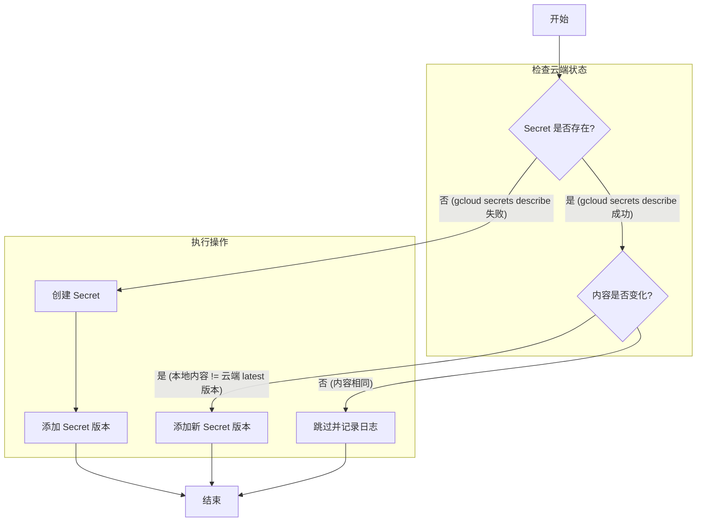

# GCP Secret Manager 版本化与幂等性管理方案

## 1. 问题背景

当前 CI/CD 流程在部署应用时，会尝试重新创建所有关联的 GCP Secret。当 Secret 数量较多时（例如 58个），此操作会导致以下问题：

- **效率低下**：不必要的重复操作，延长了部署时间。
- **容易出错**：如果 `create` 命令因 Secret 已存在而失败，可能导致整个构建中断。
- **需要手动干预**：开发人员需要手动筛选出新增的 Secret 并单独执行，破坏了自服务（Self-Service）体验。

问题的核心在于当前流程缺乏**幂等性（Idempotency）**，即无论执行多少次，结果都应保持一致，而不应因资源已存在而产生副作用。

## 2. 核心理念：利用版本管理实现幂等性

GCP Secret Manager 的设计精髓在于其**版本控制**机制。一个 Secret 资源本身是一个容器，它可以包含多个不可变的**版本（Version）**。每个版本存储着一个具体的 Secret 值。

正确的实践不是“重新创建 Secret”，而是：

- 如果 Secret 不存在，则创建它并添加第一个版本。
- 如果 Secret 已存在，并且内容需要更新，则为其**添加一个新版本**。

应用在运行时，默认会拉取 `latest` 版本的 Secret 内容。这种机制天然支持更新、审计和快速回滚。

## 3. 解决方案

我们推荐通过优化现有的 CI/CD Shell 脚本，引入幂等性逻辑来解决此问题。这是侵入性最小且能快速见效的方案。

### 3.1. 幂等化脚本核心逻辑

对于 CI/CD 流程中需要管理的每一个 Secret，执行以下判断流程：



### 3.2. Shell 脚本实现示例

以下是一个示例脚本 `upsert_secret.sh`，用于演示如何以幂等的方式创建或更新一个 Secret。

```bash
#!/bin/bash

# 脚本用途: 以幂等方式创建或更新 GCP Secret。
# 如果 Secret 不存在，则创建它并添加版本。
# 如果 Secret 已存在，则比较内容，仅在内容有变化时添加新版本。

# 参数检查
if [ "$#" -ne 2 ]; then
    echo "Usage: $0 <secret-name> <secret-value>"
    exit 1
fi

SECRET_NAME=$1
NEW_SECRET_VALUE=$2
PROJECT_ID=$(gcloud config get-value project)

# 颜色定义
GREEN='\033[0;32m'
YELLOW='\033[1;33m'
BLUE='\033[0;34m'
NC='\033[0m'

echo -e "${BLUE}Processing secret: ${SECRET_NAME}${NC}"

# 1. 检查 Secret 是否存在
if ! gcloud secrets describe "${SECRET_NAME}" --project="${PROJECT_ID}" &> /dev/null; then
    # 2a. Secret 不存在，创建它
    echo -e "${YELLOW}Secret '${SECRET_NAME}' not found. Creating it...${NC}"
    gcloud secrets create "${SECRET_NAME}" \
        --project="${PROJECT_ID}" \
        --replication-policy=\"automatic\"

    # 3a. 添加第一个版本
    echo -e "${GREEN}Adding initial version for '${SECRET_NAME}'...${NC}"
    echo -n "${NEW_SECRET_VALUE}" | gcloud secrets versions add "${SECRET_NAME}" --data-file=-
else
    # 2b. Secret 已存在，获取最新版本内容
    echo "Secret '${SECRET_NAME}' found. Checking for updates..."
    LATEST_VERSION_VALUE=$(gcloud secrets versions access latest --secret="${SECRET_NAME}" --project="${PROJECT_ID}")

    # 3b. 比较内容
    if [ "${LATEST_VERSION_VALUE}" == "${NEW_SECRET_VALUE}" ]; then
        # 内容相同，无需操作
        echo -e "${GREEN}Secret '${SECRET_NAME}' is already up-to-date. No action needed.${NC}"
    else
        # 内容不同，添加新版本
        echo -e "${YELLOW}Secret value has changed. Adding a new version for '${SECRET_NAME}'...${NC}"
        echo -n "${NEW_SECRET_VALUE}" | gcloud secrets versions add "${SECRET_NAME}" --data-file=-
    fi
fi

echo -e "${BLUE}Process for secret '${SECRET_NAME}' completed.${NC}\n"
```

### 3.3. 如何集成到 CI/CD

你可以将上述逻辑集成到你的主 CI/CD 脚本中。例如，你可以遍历一个配置文件或环境变量，对每个需要的 Secret 调用类似 `upsert_secret.sh` 的函数或脚本。

**示例：**

```bash
# 假设你的 secrets 定义在一个文件中，格式为: secret_name secret_value
# secrets.conf
# MY_API_KEY my_super_secret_value
# DB_PASSWORD another_secret

while read -r secret_name secret_value; do
    ./upsert_secret.sh "$secret_name" "$secret_value"
done < secrets.conf
```

## 4. 长期建议：转向声明式管理 (IaC)

虽然优化脚本能立即解决问题，但从长远来看，我们强烈建议采用基础设施即代码（IaC）的方式来管理 GCP 资源。

| 工具 | 优点 | 缺点 |
| :--- | :--- | :--- |
| **Terraform** | 跨云平台、生态成熟、自动管理状态、强大的计划（Plan）功能预览变更。 | 需要学习 HCL 语言和 Terraform 工作流。 |
| **Config Connector** | Kubernetes 原生、使用 YAML 定义、与 GKE 无缝集成。 | 仅适用于 GCP，强依赖于 K8s 环境。 |

采用 IaC 后，你只需在代码中声明你想要的 Secret 状态，工具会自动处理所有检查和更新的复杂逻辑，让你的 CI/CD 流程变得极其简洁和可靠。

## 5. 总结

- **短期方案**：立即优化你现有的部署脚本，引入**检查-比较-更新**的幂等逻辑，核心是利用 `gcloud secrets versions add` 而不是 `gcloud secrets create`。
- **长期方案**：规划并迁移到使用 Terraform 或 Config Connector 等 IaC 工具来声明式地管理所有云资源，包括 Secret。

通过实施以上方案，你可以彻底解决当前手动干预的问题，构建一个真正高效、可靠的自服务部署流程。
