# GCP Secret Manager Complete Flow Guide

This document provides a comprehensive overview of how Java Spring Boot applications in GKE integrate with GCP Secret Manager using Workload Identity for both key-value and file-based secrets.

Key Features of the Flow Document:
📊 Multiple Mermaid Diagrams
Architecture Overview: Shows the relationship between all components
Sequence Diagrams: Detailed step-by-step processes for setup, deployment, and secret retrieval
Flowcharts: Decision trees for error handling and troubleshooting
Component Interaction Diagrams: How different parts communicate
🔄 Three Main Phases
Infrastructure Setup: GCP configuration, IAM, Workload Identity
Application Deployment: Container building and Kubernetes deployment
Secret Retrieval: Runtime secret access and usage
🔐 Two Secret Types Covered
Key-Value Secrets: Simple strings (passwords, API keys)
File-Based Secrets: Binary content (certificates, keystores)
🛠 Practical Elements
Complete setup checklist
Troubleshooting guide with common issues
Performance optimization tips
Security best practices
Monitoring and observability guidance
📈 Visual Learning
Color-coded components for easy identification
Step-by-step sequence flows
Error handling decision trees
Permission matrix and verification steps
The document serves as both a learning resource and a practical implementation guide, showing exactly how your Java Spring Boot application running in GKE can securely access secrets from GCP Secret Manager using Workload Identity - eliminating the need for service account key files while maintaining enterprise-grade security.

## Overview

The complete process involves several key components working together:

- **GCP Secret Manager**: Stores encrypted secrets
- **Workload Identity**: Provides secure authentication without service account keys
- **GKE**: Kubernetes cluster running the application
- **Spring Boot**: Application framework with GCP integration
- **Java Application**: Consumes secrets for authentication and configuration

## Architecture Overview

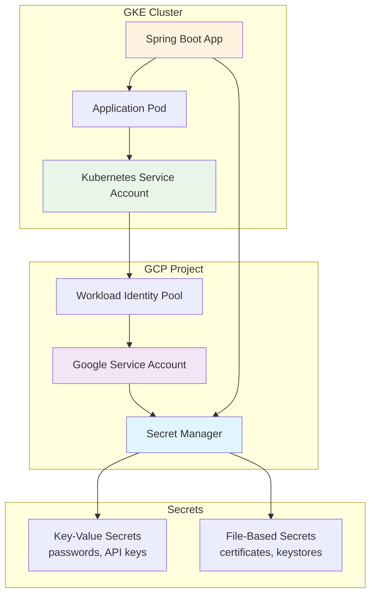

## Complete Process Flow

### Phase 1: Infrastructure Setup

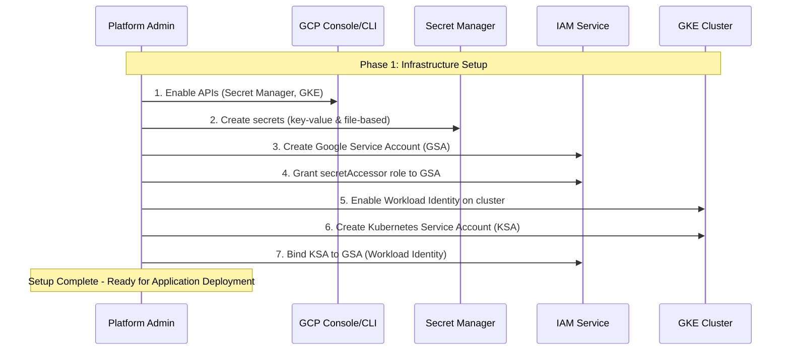

### Phase 2: Application Deployment and Startup

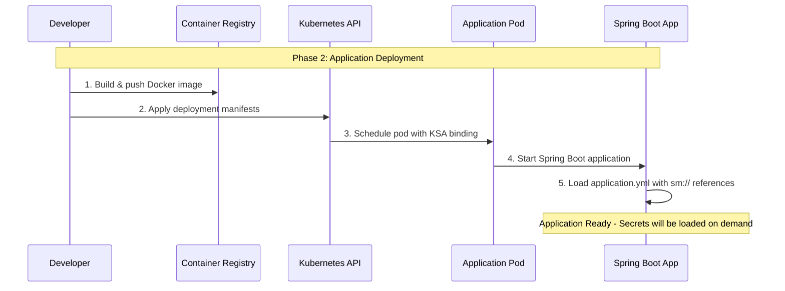

### Phase 3: Secret Retrieval Process

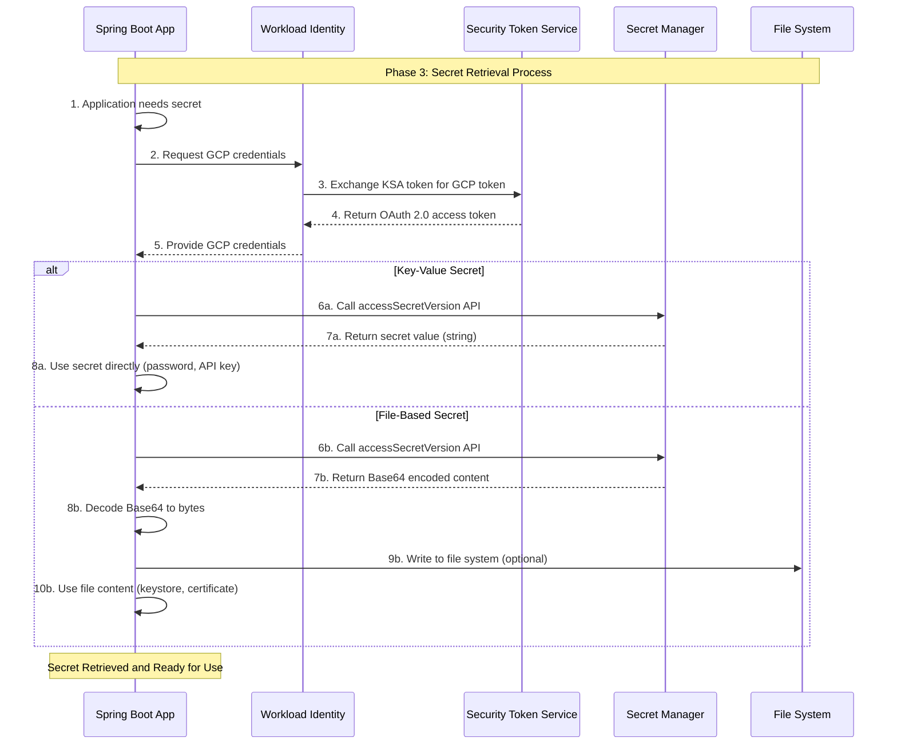

## Detailed Component Interactions

### Workload Identity Authentication Flow

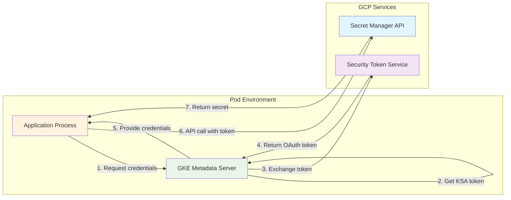

### Spring Boot Secret Integration

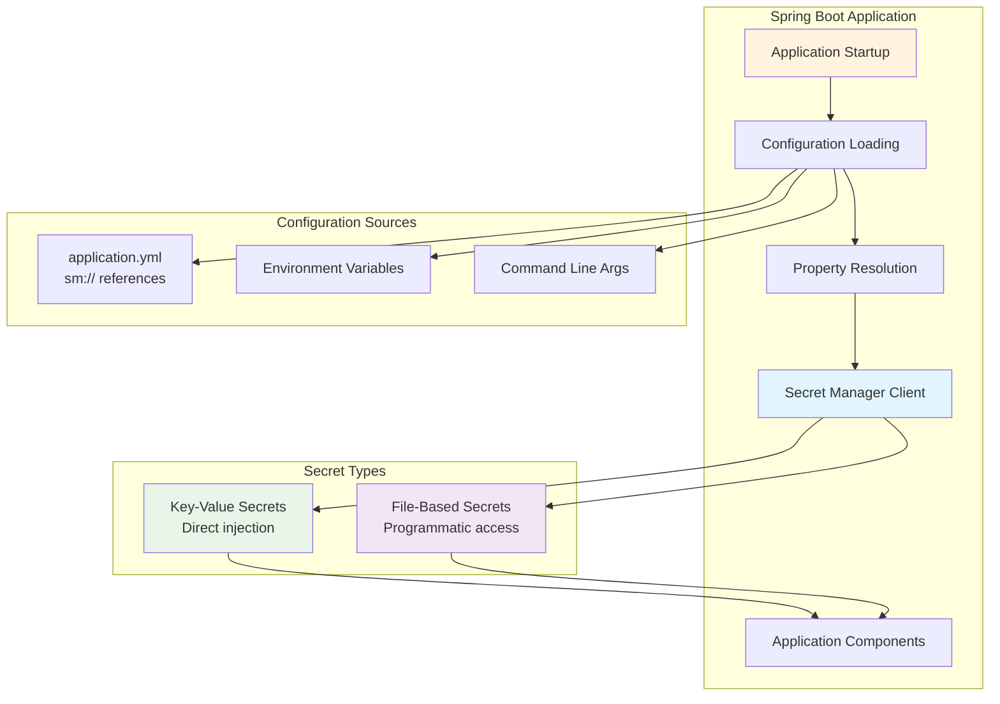

## Secret Types and Usage Patterns

### Key-Value Secrets

Key-value secrets are simple string values stored in Secret Manager, perfect for:

- Database passwords
- API keys
- JWT signing keys
- Configuration values

#### Storage Process

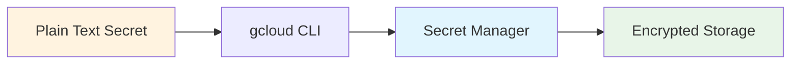

#### Retrieval Process

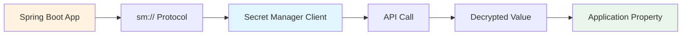

### File-Based Secrets

File-based secrets store binary content (Base64 encoded) for:

- SSL certificates
- Keystores (JKS, PKCS12)
- Private keys
- Configuration files

#### Storage Process

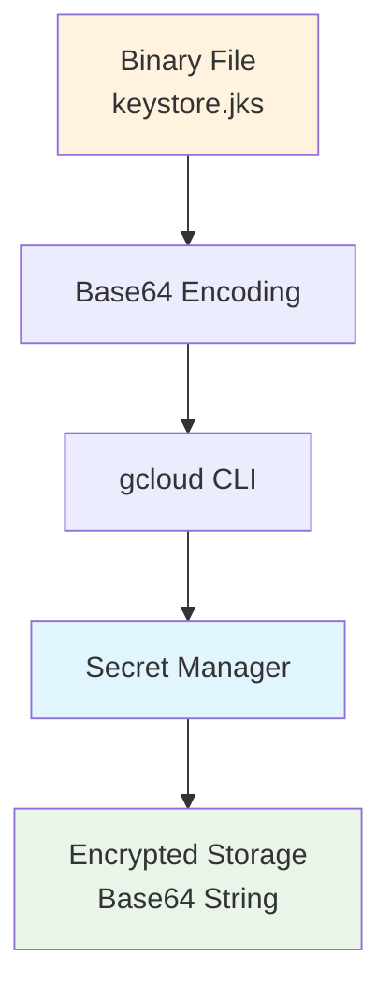

#### Retrieval Process

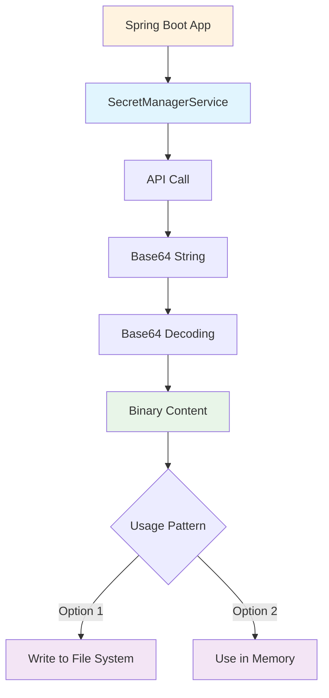

## Authentication Flow Deep Dive

### Complete Authentication Sequence

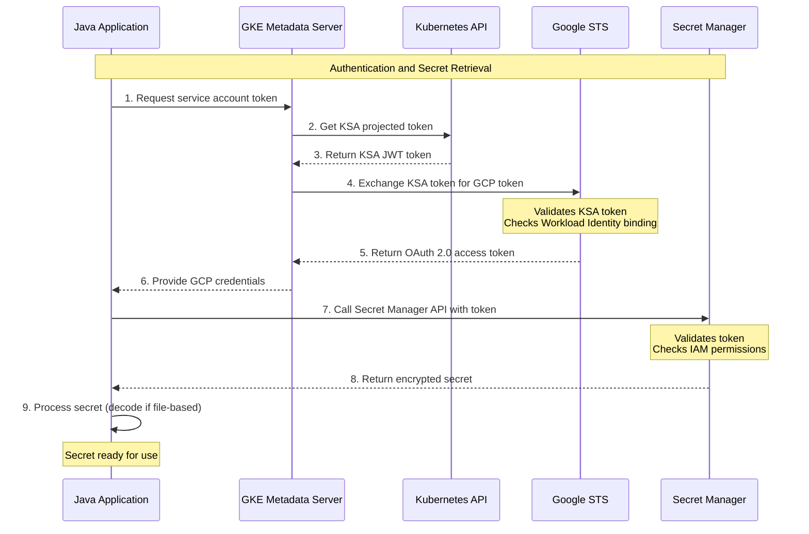

### Error Handling Flow

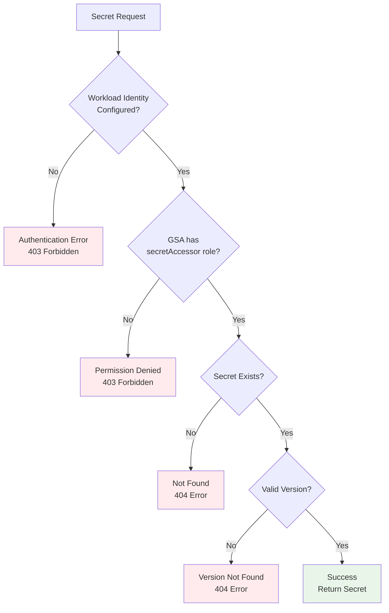

## Implementation Examples

### Key-Value Secret Implementation

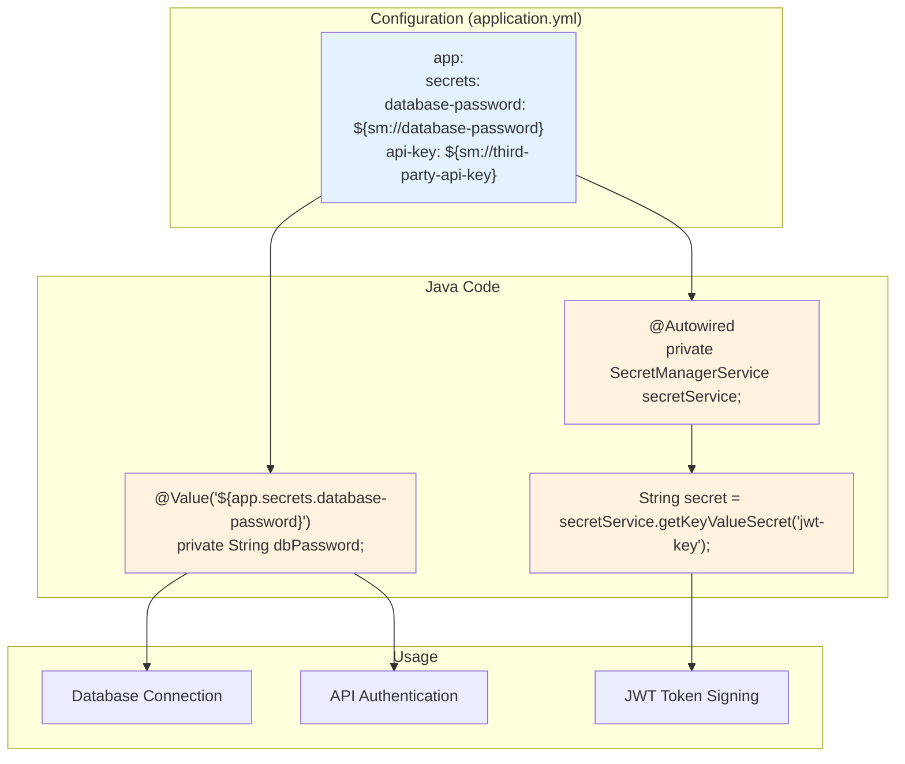

### File-Based Secret Implementation

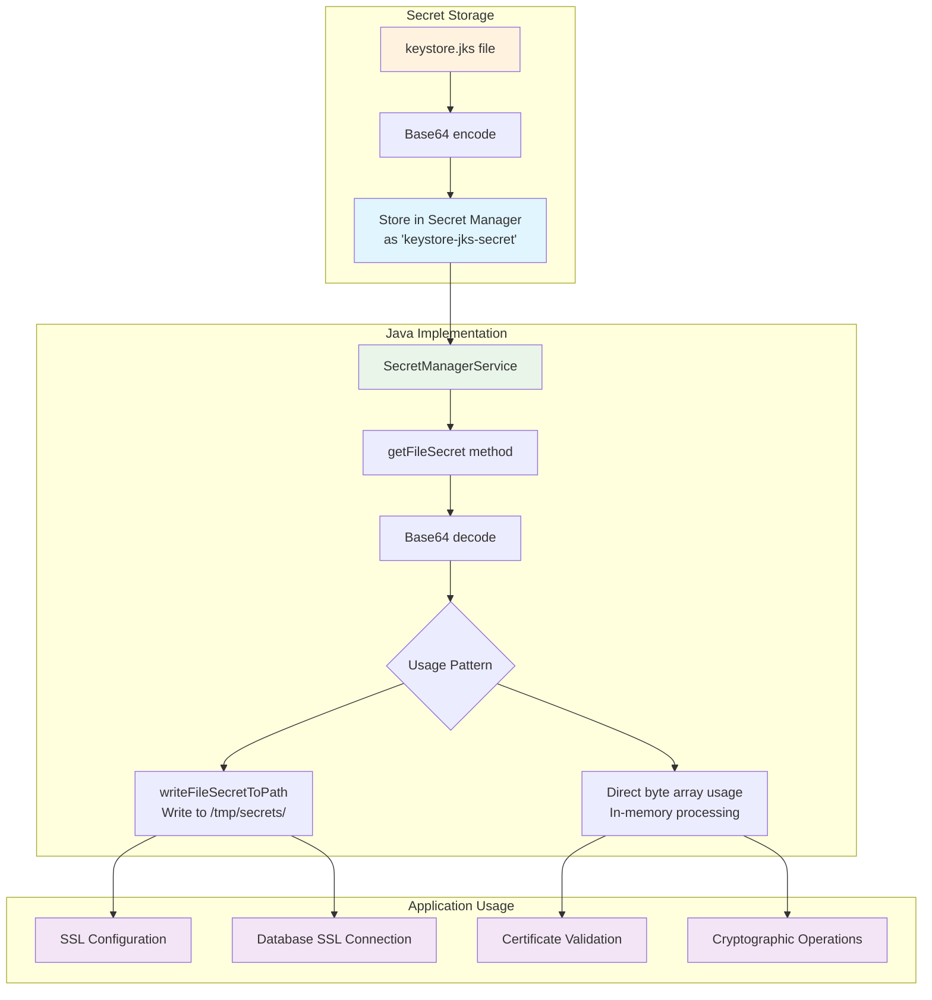

## Security and Best Practices

### Security Model

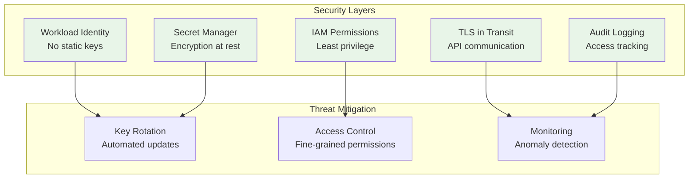

### Permission Matrix

| Component                  | Required Permissions                 | Purpose            |
| -------------------------- | ------------------------------------ | ------------------ |
| Google Service Account     | `roles/secretmanager.secretAccessor` | Read secret values |
| Kubernetes Service Account | `roles/iam.workloadIdentityUser`     | Impersonate GSA    |
| GKE Node Pool              | `cloud-platform` OAuth scope         | Access GCP APIs    |
| Secret Manager             | Project-level or secret-level IAM    | Control access     |

## Troubleshooting Guide

### Common Issues and Solutions

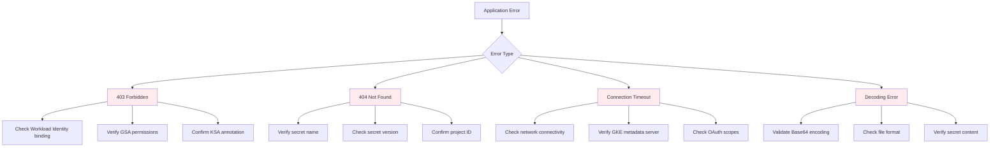

## Complete Setup Checklist

### Infrastructure Setup

```mermaid
graph LR
    A[Enable APIs] --> B[Create Secrets]
    B --> C[Create GSA]
    C --> D[Grant Permissions]
    D --> E[Setup Workload Identity]
    E --> F[Create KSA]
    F --> G[Bind KSA to GSA]
    G --> H[Deploy Application]

    style A fill:#e3f2fd
    style B fill:#e3f2fd
    style C fill:#f3e5f5
    style D fill:#f3e5f5
    style E fill:#e8f5e8
    style F fill:#e8f5e8
    style G fill:#e8f5e8
    style H fill:#fff3e0
```

### Verification Steps

1. **API Enablement**

   ```bash
   gcloud services list --enabled | grep secretmanager
   ```

2. **Secret Creation**

   ```bash
   gcloud secrets list --project=YOUR_PROJECT_ID
   ```

3. **GSA Permissions**

   ```bash
   gcloud projects get-iam-policy YOUR_PROJECT_ID
   ```

4. **Workload Identity Binding**

   ```bash
   gcloud iam service-accounts get-iam-policy GSA_EMAIL
   ```

5. **KSA Configuration**
   ```bash
   kubectl describe sa KSA_NAME -n NAMESPACE
   ```

## Performance Considerations

### Caching Strategy

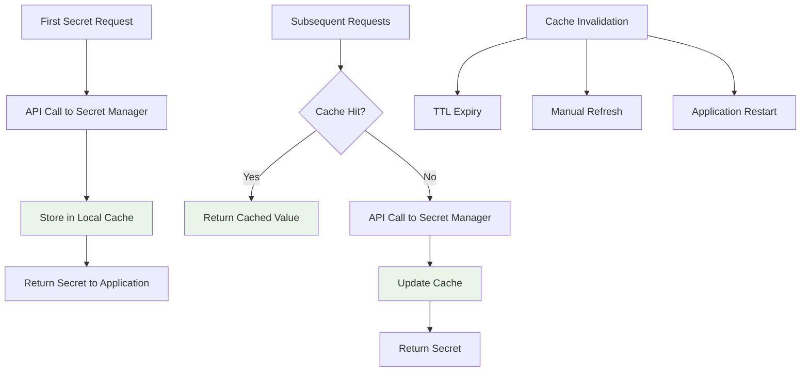

### Optimization Tips

1. **Cache Secrets**: Avoid repeated API calls
2. **Batch Operations**: Retrieve multiple secrets together
3. **Lazy Loading**: Load secrets only when needed
4. **Error Handling**: Implement retry logic with exponential backoff
5. **Monitoring**: Track API usage and performance metrics

## Monitoring and Observability

### Key Metrics to Monitor

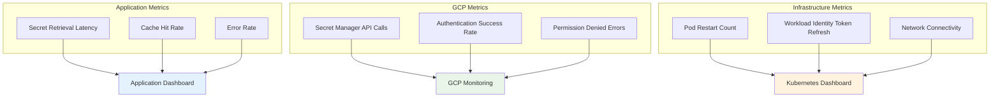

## Summary

This comprehensive flow demonstrates how GCP Secret Manager integrates with Java Spring Boot applications in GKE using Workload Identity. The key benefits include:

- **Security**: No static service account keys
- **Scalability**: Automatic credential management
- **Flexibility**: Support for both key-value and file-based secrets
- **Observability**: Full audit trail and monitoring capabilities
- **Maintainability**: Centralized secret management

The implementation provides a robust, secure, and scalable solution for managing sensitive data in cloud-native Java applications.
