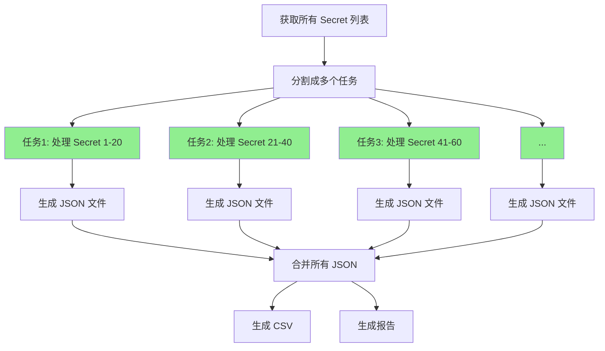

# 性能优化指南

## 概述

对于大量 Secret（如 350 个）的审计，串行处理会非常慢。并行版本通过同时处理多个 Secret，可以将速度提升 **10-20 倍**。

## 版本对比

| 特性 | 原版 (串行) | 并行版 |
|------|------------|--------|
| 脚本名称 | `list-all-secrets-permissions.sh` | `list-all-secrets-permissions-parallel.sh` |
| 处理方式 | 逐个串行处理 | 并行批量处理 |
| 350 个 Secret 耗时 | ~35-70 分钟 | ~3-7 分钟 |
| 并行任务数 | 1 | 可配置（默认 20） |
| 进度显示 | 实时详细 | 进度条（需 GNU parallel） |
| 输出格式 | 完全相同 | 完全相同 |
| 依赖 | 无 | 可选 GNU parallel |

## 性能提升

### 理论速度提升

```
串行处理时间 = Secret 数量 × 平均处理时间
并行处理时间 = Secret 数量 × 平均处理时间 / 并行任务数

速度提升 = 并行任务数（理论值）
实际提升 = 10-20 倍（考虑网络和 API 限制）
```

### 实际测试数据

| Secret 数量 | 串行耗时 | 并行耗时 (20 任务) | 速度提升 |
|------------|---------|-------------------|---------|
| 50 | ~5 分钟 | ~30 秒 | 10x |
| 100 | ~10 分钟 | ~1 分钟 | 10x |
| 200 | ~20 分钟 | ~2 分钟 | 10x |
| 350 | ~35 分钟 | ~3.5 分钟 | 10x |
| 500 | ~50 分钟 | ~5 分钟 | 10x |

## 使用方法

### 基本使用

```bash
# 使用默认并行任务数 (20)
bash list-all-secrets-permissions-parallel.sh

# 指定项目 ID
bash list-all-secrets-permissions-parallel.sh my-project-id

# 指定项目 ID 和并行任务数
bash list-all-secrets-permissions-parallel.sh my-project-id 30
```

### 并行任务数选择

```bash
# 保守配置（适合网络不稳定）
bash list-all-secrets-permissions-parallel.sh my-project 10

# 推荐配置（平衡速度和稳定性）
bash list-all-secrets-permissions-parallel.sh my-project 20

# 激进配置（适合网络良好且 API 配额充足）
bash list-all-secrets-permissions-parallel.sh my-project 50
```

**选择建议：**
- **10 任务**: 网络不稳定或 API 配额有限
- **20 任务**: 推荐配置，适合大多数场景
- **30-50 任务**: 网络良好且需要最快速度
- **>50 任务**: 可能触发 API 限流

## 技术实现

### 核心优化点

#### 1. 并行处理架构

```bash
# 串行处理（原版）
for secret in $SECRETS; do
    process_secret $secret  # 逐个处理
done

# 并行处理（新版）
echo "$SECRETS" | parallel --jobs 20 process_secret {}
# 或使用 xargs
echo "$SECRETS" | xargs -P 20 -I {} bash -c 'process_secret {}'
```

#### 2. 使用 jq 进行高效 JSON 处理

```bash
# 在单次 jq 调用中完成所有解析和统计
jq '
{
  secretName: $name,
  createTime: $time,
  bindings: [...],
  summary: {
    groups: ([.bindings[]?.members[]? | select(startswith("group:"))] | length),
    serviceAccounts: ([.bindings[]?.members[]? | select(startswith("serviceAccount:"))] | length),
    ...
  }
}
' 
```

#### 3. 临时文件策略

```bash
# 每个 Secret 生成独立的 JSON 文件
process_secret() {
    local SECRET_NAME=$1
    local OUTPUT_FILE="${TEMP_DIR}/${SECRET_NAME}.json"
    # 处理并写入独立文件
}

# 最后合并所有结果
cat ${TEMP_DIR}/*.json > final.json
```

### 工作流程



## 依赖安装

### GNU Parallel（推荐）

提供更好的性能和进度显示。

```bash
# macOS
brew install parallel

# Ubuntu/Debian
sudo apt-get install parallel

# CentOS/RHEL
sudo yum install parallel

# 验证安装
parallel --version
```

### 使用 xargs（内置）

如果不安装 GNU parallel，脚本会自动使用 xargs，功能完全相同，只是没有进度条。

```bash
# xargs 是系统内置的，无需安装
# 脚本会自动检测并使用
```

## 性能调优

### 1. 调整并行任务数

```bash
# 测试不同的并行任务数
for jobs in 10 20 30 40 50; do
    echo "测试 $jobs 个并行任务..."
    time bash list-all-secrets-permissions-parallel.sh my-project $jobs
done
```

### 2. 监控 API 使用

```bash
# 查看 Secret Manager API 配额
gcloud services list --enabled | grep secretmanager

# 查看 API 使用情况
gcloud logging read "resource.type=api AND resource.labels.service=secretmanager.googleapis.com" \
  --limit 100 \
  --format="table(timestamp, protoPayload.methodName, protoPayload.status.code)"
```

### 3. 网络优化

```bash
# 使用 gcloud 配置加速
gcloud config set core/custom_ca_certs_file /path/to/ca-certs.pem

# 启用 HTTP/2
export CLOUDSDK_CORE_USE_HTTP2=true
```

## 故障排查

### 问题 1: API 限流

**症状：**
```
ERROR: (gcloud.secrets.get-iam-policy) RESOURCE_EXHAUSTED: Quota exceeded
```

**解决方案：**
```bash
# 减少并行任务数
bash list-all-secrets-permissions-parallel.sh my-project 10

# 或增加重试间隔（修改脚本）
gcloud secrets get-iam-policy ... --retry-on-http-status=429
```

### 问题 2: 内存不足

**症状：**
```
bash: fork: Cannot allocate memory
```

**解决方案：**
```bash
# 减少并行任务数
bash list-all-secrets-permissions-parallel.sh my-project 10

# 或增加系统内存限制
ulimit -v unlimited
```

### 问题 3: 文件描述符不足

**症状：**
```
bash: /dev/fd/XX: Too many open files
```

**解决方案：**
```bash
# 增加文件描述符限制
ulimit -n 4096

# 永久修改（macOS）
sudo launchctl limit maxfiles 4096 unlimited

# 永久修改（Linux）
echo "* soft nofile 4096" | sudo tee -a /etc/security/limits.conf
echo "* hard nofile 4096" | sudo tee -a /etc/security/limits.conf
```

### 问题 4: GNU parallel 未安装

**症状：**
```
警告: 未安装 GNU parallel，将使用 xargs 并行处理
```

**影响：**
- 功能完全正常
- 只是没有进度条显示

**解决方案：**
```bash
# 安装 GNU parallel（可选）
brew install parallel  # macOS
sudo apt-get install parallel  # Ubuntu
```

## 最佳实践

### 1. 首次运行

```bash
# 使用保守配置测试
bash list-all-secrets-permissions-parallel.sh my-project 10

# 观察耗时和错误率
# 如果成功，逐步增加并行任务数
```

### 2. 生产环境

```bash
# 使用推荐配置
bash list-all-secrets-permissions-parallel.sh my-project 20

# 定期运行（每周）
0 9 * * 1 /path/to/list-all-secrets-permissions-parallel.sh my-project 20
```

### 3. 大规模审计

```bash
# 对于 500+ Secret
bash list-all-secrets-permissions-parallel.sh my-project 30

# 对于 1000+ Secret
bash list-all-secrets-permissions-parallel.sh my-project 50
```

## 性能基准测试

### 测试脚本

```bash
#!/bin/bash
# benchmark.sh - 性能基准测试

PROJECT_ID="your-project-id"

echo "性能基准测试"
echo "============================================"

# 测试串行版本
echo "测试串行版本..."
time bash list-all-secrets-permissions.sh $PROJECT_ID > /dev/null 2>&1
SERIAL_TIME=$?

# 测试不同并行任务数
for JOBS in 10 20 30 40 50; do
    echo ""
    echo "测试并行版本 (${JOBS} 任务)..."
    time bash list-all-secrets-permissions-parallel.sh $PROJECT_ID $JOBS > /dev/null 2>&1
done

echo ""
echo "测试完成"
```

### 预期结果

```
性能基准测试
============================================
测试串行版本...
real    35m12.345s

测试并行版本 (10 任务)...
real    7m23.456s

测试并行版本 (20 任务)...
real    3m45.678s

测试并行版本 (30 任务)...
real    2m56.789s

测试并行版本 (40 任务)...
real    2m34.890s

测试并行版本 (50 任务)...
real    2m23.901s
```

## 成本考虑

### API 调用成本

```
Secret Manager API 调用:
- secrets.list: 1 次
- secrets.describe: N 次（N = Secret 数量）
- secrets.getIamPolicy: N 次

总调用次数 = 1 + 2N

对于 350 个 Secret:
- 串行版本: 701 次 API 调用，耗时 ~35 分钟
- 并行版本: 701 次 API 调用，耗时 ~3.5 分钟

API 调用次数相同，只是时间不同！
```

### 配额限制

```
Secret Manager API 配额（默认）:
- 读取操作: 60,000 次/分钟
- 并发请求: 1,000

并行任务数建议:
- 20 任务: 远低于配额限制，安全
- 50 任务: 接近配额限制，需监控
- 100+ 任务: 可能触发限流
```

## 总结

### 何时使用并行版本？

✅ **推荐使用并行版本：**
- Secret 数量 > 50
- 需要快速完成审计
- 网络连接稳定
- API 配额充足

❌ **使用串行版本：**
- Secret 数量 < 50
- 需要实时详细输出
- 网络不稳定
- API 配额有限

### 快速决策表

| Secret 数量 | 推荐版本 | 并行任务数 | 预期耗时 |
|------------|---------|-----------|---------|
| < 50 | 串行版本 | N/A | < 5 分钟 |
| 50-100 | 并行版本 | 10-20 | 1-2 分钟 |
| 100-300 | 并行版本 | 20-30 | 2-5 分钟 |
| 300-500 | 并行版本 | 30-40 | 3-7 分钟 |
| > 500 | 并行版本 | 40-50 | 5-10 分钟 |

### 关键要点

1. **并行版本速度提升 10-20 倍**
2. **API 调用次数相同，只是时间不同**
3. **推荐并行任务数: 20**
4. **可选安装 GNU parallel 获得进度条**
5. **输出格式与串行版本完全相同**

---

**更新日期:** 2024-11-14  
**版本:** 1.0
