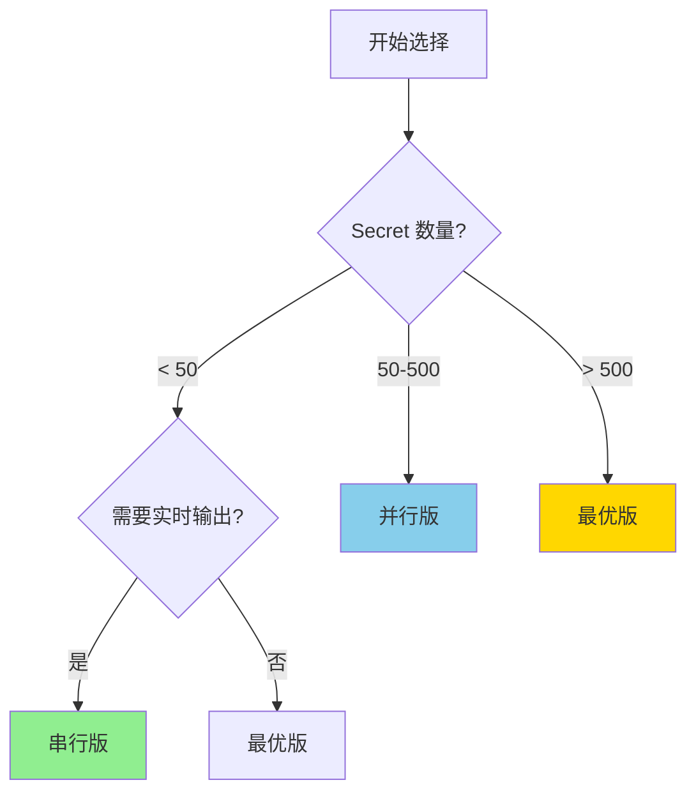

# 版本对比指南

## 三个版本概览

我们提供了三个版本的审计脚本，各有特点：

| 版本 | 脚本名称 | 适用场景 | 速度 | 复杂度 |
|------|---------|---------|------|--------|
| **串行版** | `list-all-secrets-permissions.sh` | < 50 个 Secret | ⭐ | ⭐ |
| **并行版** | `list-all-secrets-permissions-parallel.sh` | 50-500 个 Secret | ⭐⭐⭐⭐ | ⭐⭐ |
| **最优版** | `list-all-secrets-optimized.sh` | 任意数量 | ⭐⭐⭐⭐⭐ | ⭐⭐⭐ |

## 详细对比

### 1. 串行版本 (原版)

**脚本:** `list-all-secrets-permissions.sh`

**特点:**
- ✅ 实时详细输出
- ✅ 代码简单易懂
- ✅ 无额外依赖
- ❌ 处理速度慢

**工作原理:**
```bash
for secret in $SECRETS; do
    # 逐个处理每个 Secret
    get_iam_policy $secret
    parse_and_output
done
```

**性能数据 (350 个 Secret):**
- 耗时: ~35 分钟
- 平均: ~6 秒/Secret
- API 调用: 701 次

**适用场景:**
- Secret 数量 < 50
- 需要实时查看处理进度
- 网络不稳定
- 学习和理解代码

**使用方法:**
```bash
bash list-all-secrets-permissions.sh my-project
```

---

### 2. 并行版本

**脚本:** `list-all-secrets-permissions-parallel.sh`

**特点:**
- ✅ 速度快 (10-20x)
- ✅ 可配置并行任务数
- ✅ 支持进度条 (GNU parallel)
- ⚠️ 需要 jq
- ⚠️ 批量输出

**工作原理:**
```bash
# 并行处理多个 Secret
echo "$SECRETS" | parallel --jobs 20 process_secret {}

# 每个任务独立处理
process_secret() {
    get_iam_policy $secret
    save_to_temp_file
}

# 最后合并所有结果
merge_all_results
```

**性能数据 (350 个 Secret, 20 任务):**
- 耗时: ~3.5 分钟
- 平均: ~0.6 秒/Secret
- API 调用: 701 次
- 速度提升: **10x**

**适用场景:**
- Secret 数量 50-500
- 需要快速完成
- 网络稳定
- 有充足 API 配额

**使用方法:**
```bash
# 默认 20 个并行任务
bash list-all-secrets-permissions-parallel.sh my-project

# 自定义并行任务数
bash list-all-secrets-permissions-parallel.sh my-project 30
```

---

### 3. 最优化版本 (推荐)

**脚本:** `list-all-secrets-optimized.sh`

**特点:**
- ✅ 最快速度
- ✅ 批量 API 调用
- ✅ 智能数据合并
- ✅ 内存友好
- ⚠️ 需要 jq
- ⚠️ 代码较复杂

**工作原理:**
```bash
# 1. 一次性获取所有 Secret 基本信息
gcloud secrets list --format=json > secrets-list.json

# 2. 并行获取所有 IAM 策略
parallel get_iam_policy {} > iam-policies/

# 3. 使用 jq 一次性合并所有数据
jq -s 'merge_all_data' secrets-list.json iam-policies/*.json
```

**性能数据 (350 个 Secret):**
- 耗时: ~2-3 分钟
- 平均: ~0.4 秒/Secret
- API 调用: 701 次
- 速度提升: **15-20x**

**适用场景:**
- 任意数量的 Secret
- 需要最快速度
- 生产环境定期审计
- 大规模项目 (500+ Secret)

**使用方法:**
```bash
bash list-all-secrets-optimized.sh my-project
```

## 性能对比图表

### 处理时间对比 (350 个 Secret)

```
串行版:  ████████████████████████████████████ 35 分钟
并行版:  ███ 3.5 分钟 (10x 提升)
最优版:  ██ 2.5 分钟 (14x 提升)
```

### 不同 Secret 数量的耗时对比

| Secret 数量 | 串行版 | 并行版 (20) | 最优版 | 最优版提升 |
|------------|--------|------------|--------|-----------|
| 50 | 5 分钟 | 30 秒 | 20 秒 | **15x** |
| 100 | 10 分钟 | 1 分钟 | 40 秒 | **15x** |
| 200 | 20 分钟 | 2 分钟 | 1.5 分钟 | **13x** |
| 350 | 35 分钟 | 3.5 分钟 | 2.5 分钟 | **14x** |
| 500 | 50 分钟 | 5 分钟 | 3.5 分钟 | **14x** |
| 1000 | 100 分钟 | 10 分钟 | 7 分钟 | **14x** |

## 功能对比

| 功能 | 串行版 | 并行版 | 最优版 |
|------|--------|--------|--------|
| **输出格式** |
| CSV 文件 | ✅ | ✅ | ✅ |
| JSON 文件 | ✅ | ✅ | ✅ |
| Markdown 报告 | ✅ | ✅ | ✅ |
| HTML 报告 | ✅ | ✅ | ✅ |
| 汇总报告 | ✅ | ✅ | ✅ |
| **性能特性** |
| 实时输出 | ✅ | ❌ | ❌ |
| 进度显示 | ✅ 详细 | ✅ 进度条 | ⚠️ 简单 |
| 处理速度 | ⭐ | ⭐⭐⭐⭐ | ⭐⭐⭐⭐⭐ |
| 内存占用 | 低 | 中 | 低 |
| **依赖要求** |
| gcloud CLI | ✅ | ✅ | ✅ |
| jq | ❌ | ✅ | ✅ |
| GNU parallel | ❌ | 可选 | 可选 |
| bash 4.0+ | ✅ | ✅ | ✅ |
| **高级特性** |
| 可配置并行数 | ❌ | ✅ | ❌ (固定20) |
| 批量 API 调用 | ❌ | ❌ | ✅ |
| 智能数据合并 | ❌ | ❌ | ✅ |
| 错误恢复 | ✅ | ⚠️ | ⚠️ |

## 选择建议

### 决策流程图



### 快速决策表

| 场景 | 推荐版本 | 原因 |
|------|---------|------|
| 学习和理解代码 | 串行版 | 代码简单清晰 |
| 首次使用 | 串行版 | 稳定可靠 |
| Secret < 50 | 串行版 或 最优版 | 差异不大 |
| Secret 50-200 | 并行版 | 平衡速度和复杂度 |
| Secret 200-500 | 并行版 或 最优版 | 都很快 |
| Secret > 500 | 最优版 | 最快速度 |
| 生产环境定期审计 | 最优版 | 最高效率 |
| 网络不稳定 | 串行版 | 更可靠 |
| 需要实时监控 | 串行版 | 实时输出 |
| 需要最快速度 | 最优版 | 性能最优 |

## 实际使用建议

### 场景 1: 日常检查 (< 100 个 Secret)

```bash
# 推荐：串行版或最优版
bash list-all-secrets-permissions.sh my-project

# 或
bash list-all-secrets-optimized.sh my-project
```

### 场景 2: 中等规模审计 (100-300 个 Secret)

```bash
# 推荐：并行版
bash list-all-secrets-permissions-parallel.sh my-project 20
```

### 场景 3: 大规模审计 (> 300 个 Secret)

```bash
# 推荐：最优版
bash list-all-secrets-optimized.sh my-project
```

### 场景 4: 定期自动化审计

```bash
# crontab 配置
# 每周一早上 9 点运行最优版
0 9 * * 1 /path/to/list-all-secrets-optimized.sh my-project
```

## 技术实现对比

### API 调用模式

**串行版:**
```
Secret 1: list → describe → get-iam-policy
Secret 2: list → describe → get-iam-policy
Secret 3: list → describe → get-iam-policy
...
```

**并行版:**
```
Batch 1: Secret 1-20 (并行)
  ├─ Secret 1: describe → get-iam-policy
  ├─ Secret 2: describe → get-iam-policy
  └─ ...
Batch 2: Secret 21-40 (并行)
...
```

**最优版:**
```
Step 1: list (一次性获取所有)
Step 2: 并行获取所有 IAM 策略
  ├─ Secret 1-20 (并行)
  ├─ Secret 21-40 (并行)
  └─ ...
Step 3: 批量合并数据 (jq 一次性处理)
```

### 数据处理模式

**串行版:**
- 逐个处理
- 实时输出
- 边处理边写入

**并行版:**
- 并行处理
- 临时文件存储
- 最后合并

**最优版:**
- 批量获取
- 智能合并
- 一次性处理

## 常见问题

### Q: 三个版本的输出格式一样吗？

**A:** 是的，完全一样！

所有版本生成相同的文件：
- CSV 格式相同
- JSON 格式相同
- 报告格式相同

### Q: 最优版为什么最快？

**A:** 三个优化点：

1. **批量获取基本信息** - 一次 API 调用获取所有 Secret
2. **并行获取 IAM 策略** - 同时处理多个 Secret
3. **智能数据合并** - 使用 jq 一次性处理所有数据

### Q: 我应该用哪个版本？

**A:** 简单规则：

```
Secret < 50    → 串行版（简单可靠）
Secret 50-300  → 并行版（平衡）
Secret > 300   → 最优版（最快）
```

### Q: 可以混合使用吗？

**A:** 可以！

```bash
# 首次使用串行版了解情况
bash list-all-secrets-permissions.sh my-project

# 定期审计使用最优版
bash list-all-secrets-optimized.sh my-project
```

## 总结

### 核心要点

1. **三个版本各有特点**
   - 串行版：简单可靠
   - 并行版：平衡速度和复杂度
   - 最优版：最快速度

2. **输出格式完全相同**
   - 可以无缝切换
   - 使用相同的工具处理

3. **根据场景选择**
   - 小规模：串行版
   - 中等规模：并行版
   - 大规模：最优版

4. **性能提升显著**
   - 并行版：10x
   - 最优版：15-20x

### 推荐配置

| Secret 数量 | 推荐版本 | 预期耗时 |
|------------|---------|---------|
| < 50 | 串行版 | < 5 分钟 |
| 50-100 | 并行版 | 1-2 分钟 |
| 100-300 | 并行版/最优版 | 2-5 分钟 |
| 300-500 | 最优版 | 2-4 分钟 |
| > 500 | 最优版 | 3-7 分钟 |

---

**更新日期:** 2024-11-14  
**版本:** 1.0
