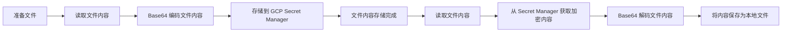
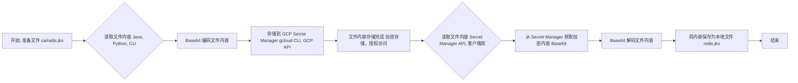

# q
我们知道GCP Secret Mange里面可以存储的文件格式是类似key value的
那么如果我是想要存储文件呢?
比如我的java的代码对应的yml中有下面这个
trustStoreFilePath: ca/redis.jks如何把文件放在gcp secret manage 里面加密
另外帮我提供对应的代码比如Java的,如何读取key value格式和文件格式的.
另外需要如何存进去这2种格式的例子

# chatgpt 
在 GCP Secret Manager 中，你可以存储文件的内容作为加密的 Secret，并通过代码动态读取它。以下是如何处理这两种情况的完整解决方案：

1. 将文件内容存储到 GCP Secret Manager

GCP Secret Manager 不直接存储文件路径或文件对象，但你可以将文件内容 Base64 编码 或直接作为字符串存储。

示例：存储文件内容到 Secret Manager

假设要存储 ca/redis.jks 文件：
	1.	Base64 编码文件内容
	•	使用命令将文件内容编码并保存为字符串：

base64 ca/redis.jks > redis.jks.b64


	2.	将文件内容存储到 Secret Manager
	•	使用 GCP CLI：

gcloud secrets create redis-jks \
  --replication-policy="automatic"
gcloud secrets versions add redis-jks --data-file=redis.jks.b64


	3.	存储 Key-Value 数据
	•	如果要存储简单的 Key-Value 数据，比如 trustStorePassword：
```bash
gcloud secrets create trustStorePassword \
  --replication-policy="automatic"
gcloud secrets versions add trustStorePassword --data-file=<(echo -n "your-password-here")
```
2. 使用 Java 读取 Secret Manager 中的内容

使用 Google Cloud Secret Manager 的客户端库读取加密的 Secret 数据。

代码示例：读取 Key-Value 数据

以下代码演示如何读取简单的 Key-Value 数据，比如 trustStorePassword：
```java
import com.google.cloud.secretmanager.v1.AccessSecretVersionResponse;
import com.google.cloud.secretmanager.v1.SecretManagerServiceClient;
import com.google.cloud.secretmanager.v1.SecretVersionName;

public class SecretManagerExample {
    public static void main(String[] args) throws Exception {
        String projectId = "your-project-id";
        String secretId = "trustStorePassword";
        String versionId = "latest";

        // Access the Secret Manager
        try (SecretManagerServiceClient client = SecretManagerServiceClient.create()) {
            SecretVersionName secretVersionName = SecretVersionName.of(projectId, secretId, versionId);
            AccessSecretVersionResponse response = client.accessSecretVersion(secretVersionName);

            // Retrieve the payload (secret value)
            String secretValue = response.getPayload().getData().toStringUtf8();
            System.out.println("Secret Value: " + secretValue);
        }
    }
}
```
代码示例：读取文件内容并解码

对于文件（如 redis.jks 的内容），假设存储时使用 Base64 编码，读取后需要解码并保存为文件：
```java
import com.google.cloud.secretmanager.v1.AccessSecretVersionResponse;
import com.google.cloud.secretmanager.v1.SecretManagerServiceClient;
import com.google.cloud.secretmanager.v1.SecretVersionName;

import java.io.FileOutputStream;
import java.nio.file.Files;
import java.util.Base64;

public class SecretManagerFileExample {
    public static void main(String[] args) throws Exception {
        String projectId = "your-project-id";
        String secretId = "redis-jks";
        String versionId = "latest";

        // Access the Secret Manager
        try (SecretManagerServiceClient client = SecretManagerServiceClient.create()) {
            SecretVersionName secretVersionName = SecretVersionName.of(projectId, secretId, versionId);
            AccessSecretVersionResponse response = client.accessSecretVersion(secretVersionName);

            // Retrieve the Base64-encoded payload
            String secretValue = response.getPayload().getData().toStringUtf8();

            // Decode Base64 and save to a file
            byte[] decodedBytes = Base64.getDecoder().decode(secretValue);
            String outputPath = "output/redis.jks"; // Path to save the decoded file
            Files.createDirectories(new java.io.File(outputPath).getParentFile().toPath());
            try (FileOutputStream fos = new FileOutputStream(outputPath)) {
                fos.write(decodedBytes);
            }

            System.out.println("File saved to: " + outputPath);
        }
    }
}
```
3. 如何将数据存入 GCP Secret Manager

存入 Key-Value 格式
	1.	使用 CLI：
```bash
gcloud secrets create my-key \
    --replication-policy="automatic"
gcloud secrets versions add my-key --data-file=<(echo -n "my-value")
```

	2.	Java 代码（可选）：
```java
import com.google.cloud.secretmanager.v1.SecretManagerServiceClient;
import com.google.cloud.secretmanager.v1.SecretName;
import com.google.cloud.secretmanager.v1.AddSecretVersionRequest;
import com.google.cloud.secretmanager.v1.SecretPayload;

public class AddSecret {
    public static void main(String[] args) throws Exception {
        String projectId = "your-project-id";
        String secretId = "my-key";

        try (SecretManagerServiceClient client = SecretManagerServiceClient.create()) {
            SecretName secretName = SecretName.of(projectId, secretId);

            SecretPayload payload = SecretPayload.newBuilder()
                    .setData(com.google.protobuf.ByteString.copyFromUtf8("my-value"))
                    .build();

            AddSecretVersionRequest request = AddSecretVersionRequest.newBuilder()
                    .setParent(secretName.toString())
                    .setPayload(payload)
                    .build();

            client.addSecretVersion(request);
            System.out.println("Secret version added.");
        }
    }
}
```
存入文件内容
	1.	存储文件内容（Base64 编码）
	•	CLI：
```bash
base64 ca/redis.jks > redis.jks.b64
gcloud secrets versions add redis-jks --data-file=redis.jks.b64
```

	2.	Java 代码存储文件内容
	•	将文件内容直接读取并添加为 Secret：

```java
import com.google.cloud.secretmanager.v1.SecretManagerServiceClient;
import com.google.cloud.secretmanager.v1.SecretName;
import com.google.cloud.secretmanager.v1.AddSecretVersionRequest;
import com.google.cloud.secretmanager.v1.SecretPayload;

import java.nio.file.Files;
import java.nio.file.Paths;
import java.util.Base64;

public class AddFileAsSecret {
    public static void main(String[] args) throws Exception {
        String projectId = "your-project-id";
        String secretId = "redis-jks";

        byte[] fileContent = Files.readAllBytes(Paths.get("ca/redis.jks"));
        String base64Content = Base64.getEncoder().encodeToString(fileContent);

        try (SecretManagerServiceClient client = SecretManagerServiceClient.create()) {
            SecretName secretName = SecretName.of(projectId, secretId);

            SecretPayload payload = SecretPayload.newBuilder()
                    .setData(com.google.protobuf.ByteString.copyFromUtf8(base64Content))
                    .build();

            AddSecretVersionRequest request = AddSecretVersionRequest.newBuilder()
                    .setParent(secretName.toString())
                    .setPayload(payload)
                    .build();

            client.addSecretVersion(request);
            System.out.println("File stored in Secret Manager.");
        }
    }
}
```

总结
	•	Key-Value 存储：直接存储简单字符串值。
	•	文件存储：将文件 Base64 编码后存储为 Secret。
	•	读取：使用 Secret Manager 的客户端库解码并处理内容。

以下是将文件内容存储到 GCP Secret Manager 的完整流程的可视化过程，包含文件读取、编码、存储以及如何读取文件并解码。

详细说明：
1.	准备文件
•	将需要存储的文件（例如 ca/redis.jks）放在指定目录下。
2.	读取文件内容
•	使用工具或代码读取文件内容，例如 Java、Python 或 CLI。
3.	Base64 编码文件内容
•	将文件内容编码成 Base64 格式，确保内容可以作为字符串存储。
4.	存储到 GCP Secret Manager
•	使用 gcloud CLI 或者 GCP API 将 Base64 编码后的文件内容存储到 Secret Manager。
5.	文件内容存储完成
•	文件已加密存储，确保只有经过授权的用户或服务可以访问。
6.	读取文件内容
•	通过 Secret Manager API 或客户端库访问存储的文件内容。
7.	从 Secret Manager 获取加密内容
•	获取加密内容，并解码为 Base64 格式。
8.	Base64 解码文件内容
•	解码后，恢复文件的原始内容。
9.	将内容保存为本地文件
•	将解码后的内容写入文件，恢复到原始文件格式（例如 .jks）。

希望这个流程图能够直观地帮助你理解文件内容在 GCP Secret Manager 中的存储与读取过程！

# gemini 
理解你的需求。GCP Secret Manager 主要用于存储和管理敏感信息，通常是小型的键值对形式的配置。虽然它本身并不直接支持“文件”的概念，但我们可以通过一些方法将文件内容存储在 Secret Manager 中，然后在需要时将其恢复为文件。

以下是如何存储和读取键值对格式和文件格式的 Secret，以及相应的 Java 代码示例：

**1. 存储键值对格式的 Secret**

键值对格式是 Secret Manager 的原生支持方式。

**存储示例 (使用 gcloud CLI):**

```bash
gcloud secrets create my-key-value-secret --replication-policy="automatic"
echo -n "mysecretvalue" | gcloud secrets versions add my-key-value-secret --data-file=-
```

* `gcloud secrets create my-key-value-secret --replication-policy="automatic"`:  创建一个名为 `my-key-value-secret` 的 Secret，并使用自动复制策略。
* `echo -n "mysecretvalue" | gcloud secrets versions add my-key-value-secret --data-file=-`: 将 "mysecretvalue" 作为新的版本添加到 `my-key-value-secret` 中。`--data-file=-` 表示从标准输入读取数据。

**存储示例 (Java):**

```java
import com.google.cloud.secretmanager.v1.AddSecretVersionRequest;
import com.google.cloud.secretmanager.v1.Replication;
import com.google.cloud.secretmanager.v1.Secret;
import com.google.cloud.secretmanager.v1.SecretData;
import com.google.cloud.secretmanager.v1.SecretManagerServiceClient;
import com.google.cloud.secretmanager.v1.SecretName;
import com.google.protobuf.ByteString;
import java.io.IOException;
import java.nio.charset.StandardCharsets;

public class StoreKeyValueSecret {

  public static void main(String[] args) throws IOException {
    // Replace with your actual project ID and secret name
    String projectId = "your-project-id";
    String secretId = "my-key-value-secret";
    String secretValue = "mysecretvalue";

    try (SecretManagerServiceClient client = SecretManagerServiceClient.create()) {
      // 创建 Secret (如果不存在)
      SecretName secretName = SecretName.of(projectId, secretId);
      try {
        client.getSecret(secretName);
        System.out.println("Secret already exists: " + secretName);
      } catch (com.google.api.gax.rpc.NotFoundException e) {
        Secret secret =
            Secret.newBuilder()
                .setReplication(Replication.newBuilder().setAutomatic(Replication.Automatic.getDefaultInstance()))
                .build();
        Secret createdSecret = client.createSecret(SecretName.of(projectId, secretId).toString(), secret);
        System.out.println("Successfully created secret: " + createdSecret.getName());
      }

      // 添加 Secret 版本
      ByteString data = ByteString.copyFromUtf8(secretValue);
      AddSecretVersionRequest addRequest =
          AddSecretVersionRequest.newBuilder()
              .setParent(secretName.toString())
              .setPayload(SecretData.newBuilder().setData(data).build())
              .build();
      client.addSecretVersion(addRequest);
      System.out.println("Successfully added secret version to: " + secretName);
    }
  }
}
```

**2. 存储文件格式的 Secret**

由于 Secret Manager 存储的是键值对，存储文件内容的一种常见方法是将其 **Base64 编码** 后存储为字符串。在读取时，再进行 Base64 解码恢复文件内容。

**存储示例 (使用 gcloud CLI):**

```bash
# 假设你的文件是 ca/redis.jks
BASE64_ENCODED=$(base64 ca/redis.jks)
gcloud secrets create my-file-secret --replication-policy="automatic"
echo -n "$BASE64_ENCODED" | gcloud secrets versions add my-file-secret --data-file=-
```

* `BASE64_ENCODED=$(base64 ca/redis.jks)`: 将 `ca/redis.jks` 文件进行 Base64 编码，并将结果存储在变量 `BASE64_ENCODED` 中。
* 后续的 `gcloud secrets` 命令与存储键值对的类似，只是存储的是 Base64 编码后的字符串。

**存储示例 (Java):**

```java
import com.google.cloud.secretmanager.v1.AddSecretVersionRequest;
import com.google.cloud.secretmanager.v1.Replication;
import com.google.cloud.secretmanager.v1.Secret;
import com.google.cloud.secretmanager.v1.SecretData;
import com.google.cloud.secretmanager.v1.SecretManagerServiceClient;
import com.google.cloud.secretmanager.v1.SecretName;
import com.google.protobuf.ByteString;
import java.io.IOException;
import java.nio.file.Files;
import java.nio.file.Path;
import java.nio.file.Paths;
import java.util.Base64;

public class StoreFileSecret {

  public static void main(String[] args) throws IOException {
    // Replace with your actual project ID and secret name
    String projectId = "your-project-id";
    String secretId = "my-file-secret";
    String filePath = "ca/redis.jks"; // 你的文件路径

    Path path = Paths.get(filePath);
    byte[] fileContent = Files.readAllBytes(path);
    String base64Encoded = Base64.getEncoder().encodeToString(fileContent);

    try (SecretManagerServiceClient client = SecretManagerServiceClient.create()) {
      // 创建 Secret (如果不存在)
      SecretName secretName = SecretName.of(projectId, secretId);
      try {
        client.getSecret(secretName);
        System.out.println("Secret already exists: " + secretName);
      } catch (com.google.api.gax.rpc.NotFoundException e) {
        Secret secret =
            Secret.newBuilder()
                .setReplication(Replication.newBuilder().setAutomatic(Replication.Automatic.getDefaultInstance()))
                .build();
        Secret createdSecret = client.createSecret(SecretName.of(projectId, secretId).toString(), secret);
        System.out.println("Successfully created secret: " + createdSecret.getName());
      }

      // 添加 Secret 版本
      ByteString data = ByteString.copyFromUtf8(base64Encoded);
      AddSecretVersionRequest addRequest =
          AddSecretVersionRequest.newBuilder()
              .setParent(secretName.toString())
              .setPayload(SecretData.newBuilder().setData(data).build())
              .build();
      client.addSecretVersion(addRequest);
      System.out.println("Successfully added secret version to: " + secretName);
    }
  }
}
```

**3. 读取 Secret (Java)**

以下代码示例演示了如何读取键值对格式和文件格式的 Secret。

```java
import com.google.cloud.secretmanager.v1.AccessSecretVersionRequest;
import com.google.cloud.secretmanager.v1.AccessSecretVersionResponse;
import com.google.cloud.secretmanager.v1.SecretManagerServiceClient;
import com.google.cloud.secretmanager.v1.SecretVersionName;
import com.google.protobuf.ByteString;
import java.io.FileOutputStream;
import java.io.IOException;
import java.nio.file.Files;
import java.nio.file.Paths;
import java.util.Base64;

public class ReadSecret {

  public static void main(String[] args) throws IOException {
    // Replace with your actual project ID and secret names
    String projectId = "your-project-id";
    String keyValueSecretId = "my-key-value-secret";
    String fileSecretId = "my-file-secret";
    String outputFile = "retrieved_redis.jks"; // 文件格式 Secret 的输出路径

    // 读取键值对格式的 Secret
    try (SecretManagerServiceClient client = SecretManagerServiceClient.create()) {
      SecretVersionName versionName = SecretVersionName.of(projectId, keyValueSecretId, "latest");
      AccessSecretVersionResponse response = client.accessSecretVersion(versionName);
      String keyValue = response.getPayload().getData().toStringUtf8();
      System.out.println("Retrieved Key-Value Secret: " + keyValue);
    }

    // 读取文件格式的 Secret
    try (SecretManagerServiceClient client = SecretManagerServiceClient.create()) {
      SecretVersionName versionName = SecretVersionName.of(projectId, fileSecretId, "latest");
      AccessSecretVersionResponse response = client.accessSecretVersion(versionName);
      String base64Encoded = response.getPayload().getData().toStringUtf8();
      byte[] fileContent = Base64.getDecoder().decode(base64Encoded);

      // 将内容写回文件
      Files.write(Paths.get(outputFile), fileContent);
      System.out.println("Retrieved File Secret and saved to: " + outputFile);
    }
  }
}
```

**代码说明:**

* **引入依赖:**  确保你的 `pom.xml` 或 `build.gradle` 文件中包含了 GCP Secret Manager 的客户端库依赖。
* **创建 `SecretManagerServiceClient`:**  这是与 Secret Manager 服务交互的主要客户端。
* **`SecretName` 和 `SecretVersionName`:** 用于标识具体的 Secret 和版本。
* **存储键值对:** 直接将字符串作为 Secret 的数据存储。
* **存储文件:**
    * 读取文件内容为字节数组。
    * 使用 `Base64.getEncoder().encodeToString()` 将字节数组编码为 Base64 字符串。
    * 将 Base64 字符串存储为 Secret 的数据。
* **读取键值对:** 使用 `response.getPayload().getData().toStringUtf8()` 获取字符串值。
* **读取文件:**
    * 使用 `response.getPayload().getData().toStringUtf8()` 获取 Base64 编码的字符串。
    * 使用 `Base64.getDecoder().decode()` 将 Base64 字符串解码为字节数组。
    * 使用 `Files.write()` 或 `FileOutputStream` 将字节数组写回文件。

**重要注意事项:**

* **文件大小限制:** Secret Manager 对单个 Secret 的大小有限制（目前是 64 KiB）。对于较大的文件，考虑使用 Google Cloud Storage (GCS) 存储，并在 Secret Manager 中存储 GCS 文件的访问凭证或路径。
* **安全性:** 不要将敏感信息硬编码在代码中。使用 Secret Manager 可以安全地管理这些信息。
* **错误处理:** 在生产环境中，务必添加适当的错误处理机制，例如捕获 `IOException` 和其他可能发生的异常。
* **权限:** 确保你的应用程序拥有访问 Secret Manager 中 Secret 的权限。这通常通过服务账号和 IAM 角色来管理。
* **Secret 版本控制:** Secret Manager 提供了版本控制功能，可以跟踪 Secret 的更改历史。

通过以上方法，你可以有效地将文件内容存储在 GCP Secret Manager 中，并在需要时安全地检索和使用它们。记住根据你的具体需求选择合适的方法，并始终关注安全性最佳实践。

好的，这是对使用 GCP Secret Manager 存储和检索文件过程的详细审查和可视化。

**流程图:**



**详细步骤说明和可视化:**

**1. 准备文件**

* **描述:** 将你需要存储的文件（例如 `ca/redis.jks`）放置在你的本地文件系统的某个目录中。这是流程的起点。
* **可视化:**

```
+-----------------+      文件: ca/redis.jks
| 本地文件系统     | <-----------------+
+-----------------+
```

**2. 读取文件内容**

* **描述:**  使用编程语言（如 Java、Python）或命令行工具（CLI）读取文件的原始字节内容。
* **可视化:**

```
+-----------------+      文件: ca/redis.jks     +-----------+
| 本地文件系统     | -------------------------> | 读取工具  |
+-----------------+                             +-----------+
                                                   |
                                                   v
                                              文件原始字节
```

**3. Base64 编码文件内容**

* **描述:** 将读取到的文件原始字节内容编码成 Base64 字符串。Base64 是一种可以将二进制数据转换为 ASCII 字符串的编码方式，使其可以安全地存储在文本格式的系统中，例如 Secret Manager 的键值对。
* **可视化:**

```
   文件原始字节      +--------------+      Base64 编码字符串
-------------------> | Base64 编码器 | ------------------->
                     +--------------+
```

**4. 存储到 GCP Secret Manager**

* **描述:** 使用 Google Cloud SDK (gcloud CLI) 或 GCP Secret Manager API，将 Base64 编码后的字符串作为 Secret 的值存储到 Secret Manager 中。你需要指定一个 Secret 的名称。
* **可视化:**

```
   Base64 编码字符串    +-----------------------+      GCP Secret Manager
-------------------> | gcloud CLI / GCP API | ------------------->
                     +-----------------------+      (存储 Base64 字符串)
```

**5. 文件内容存储完成**

* **描述:** 文件内容已成功以加密形式存储在 GCP Secret Manager 中。只有拥有适当权限的身份（例如服务账号或用户）才能访问和解密这些内容。
* **可视化:**

```
+-----------------------+      加密存储的
| GCP Secret Manager    | <-----------------+
+-----------------------+      Base64 字符串
  |
  |  安全性: 加密，授权访问
  |
```

**6. 读取文件内容**

* **描述:** 当你需要使用存储的文件时，可以通过 Secret Manager API 或客户端库（例如 Java 的 Secret Manager 库）来访问存储的 Secret。
* **可视化:**

```
+-----------------------+      请求访问
| GCP Secret Manager    | <-----------------+
+-----------------------+      (Secret Manager API, 客户端库)
```

**7. 从 Secret Manager 获取加密内容**

* **描述:**  Secret Manager 会返回存储的 Secret 的值，即 Base64 编码的字符串。
* **可视化:**

```
+-----------------------+      Base64 编码字符串
| GCP Secret Manager    | ------------------------->
+-----------------------+
```

**8. Base64 解码文件内容**

* **描述:**  接收到 Base64 编码的字符串后，使用相应的解码器将其转换回原始的字节数据。
* **可视化:**

```
   Base64 编码字符串    +--------------+      文件原始字节
-------------------> | Base64 解码器 | ------------------->
                     +--------------+
```

**9. 将内容保存为本地文件**

* **描述:** 将解码后的原始字节数据写入到本地文件系统，恢复为原始的文件格式（例如 `.jks` 文件）。
* **可视化:**

```
   文件原始字节      +-----------------+      文件: redis.jks
-------------------> | 本地文件系统     | <-----------------+
                     +-----------------+
```

**总结:**

通过这个流程，你可以将任意文件以加密的形式安全地存储在 GCP Secret Manager 中。需要使用文件时，再从 Secret Manager 中取出并解码恢复。 这种方法利用了 Secret Manager 强大的安全性和访问控制特性来保护你的敏感文件。

# About console upload 

## chatgpt 
你的观察非常细致！针对这个问题，让我们进一步解析：

说法分析：
	1.	“GCP Secret Manager 不直接存储文件路径或文件对象”
	•	这个说法的含义是：
Secret Manager 本质上是一个密钥存储服务，主要设计用于存储敏感数据（如 API 密钥、配置值、密码等）。它的底层是存储数据的值（即字符串或二进制内容），而并不专门存储文件路径或引用文件对象。
	•	换句话说，它不会直接作为文件系统的一部分来管理文件或文件路径，也就是说，它不是像 GCS（Google Cloud Storage）那样用于存储文件路径的服务。
	2.	“Console 页面中可以通过 Upload File 添加文件内容到 Secret”
	•	这个功能的原理是：
当你通过 GCP Console 的 Upload File 上传文件时，GCP Secret Manager 的客户端会读取该文件内容，并将其作为**二进制数据（Binary Data）**存储到该 Secret 的指定版本中。
	•	具体来说：
	•	它读取文件的字节内容。
	•	把文件内容存储为 Secret 的值（支持二进制或字符串格式）。
	•	文件路径本身不会存储，只有文件的实际内容被加密存储到 Secret Manager。

是否存在冲突？

这个操作与“GCP Secret Manager 不直接存储文件路径或文件对象”的说法并不冲突。
理由是：
	•	GCP Secret Manager 确实不会存储文件路径，上传文件时只是将文件的内容存储为 Secret 的值。
	•	所以，Console 中的 Upload File 功能只是方便用户直接将文件内容保存，而不是以文件路径或对象形式存储。

进一步说明：

如果你使用 GCP CLI 或 API 操作，等效的做法是手动将文件的内容读取并上传。例如：

gcloud secrets versions add my-secret --data-file=/path/to/your/file

上述命令也是将文件内容上传，而不是存储路径信息。

总结：

GCP Secret Manager 的功能是存储数据内容，Upload File 功能本质上是将文件内容读取后存储，路径信息并没有被存储，所以它与“不存储文件路径或文件对象”并不冲突。希望这个解析能帮你更好地理解！

## gemini 

你的理解是正确的。你提出的说法 "**GCP Secret Manager 不直接存储文件路径或文件对象**" 仍然是正确的，即使你在 GCP Console 中看到了 "upload file" 的选项。

**GCP Console 的 "Upload File" 功能的原理:**

当你使用 GCP Console 中的 "Upload file" 功能向 Secret Manager 的一个 Secret 版本添加内容时，实际上发生的是：

1. **读取文件内容:** Console 会读取你上传的文件的全部内容（以字节流的形式）。
2. **Base64 编码 (很可能):**  GCP Console 内部很可能会对文件的二进制内容进行 Base64 编码。这样做可以将任意二进制数据转换为文本字符串，以便符合 Secret Manager 存储字符串值的要求。
3. **将 Base64 编码后的内容存储为 Secret 版本的值:**  最终，Base64 编码后的字符串会作为 Secret 的一个新版本的 "value" 存储在 Secret Manager 中。

**为什么这与 "GCP Secret Manager 不直接存储文件路径或文件对象" 的说法不冲突:**

* **存储的是文件的 *内容*，而不是文件本身:** Secret Manager 存储的是经过编码后的文件 *内容* (很可能是 Base64)。它并不知道你上传的是一个文件，也不知道这个文件在你的本地文件系统中的路径。它只关心接收到的字符串数据。
* **没有文件系统的概念:** Secret Manager 本身并不管理文件系统。它是一个专门用于存储和管理秘密的独立服务。它不具有传统文件系统的层次结构或文件路径的概念。
* **Console 提供的便利功能:** "Upload file" 功能是 GCP Console 为了方便用户而提供的一个用户界面特性。它简化了将文件内容存储到 Secret Manager 的过程，而不需要用户手动进行 Base64 编码或其他转换。

**总结:**

* **核心原理不变:**  GCP Secret Manager 的核心机制仍然是存储键值对，其中值通常是字符串。
* **"Upload file" 是一个辅助功能:** Console 的 "Upload file" 功能是利用了 Secret Manager 存储字符串的能力，通过在后台进行编码，使得用户可以方便地将文件内容存储为 Secret 的值。
* **存储的是编码后的内容:** 最终存储在 Secret Manager 中的是文件的内容经过编码后的字符串，而不是原始的文件对象或文件路径。

**你可以这样理解:**

想象一下，你要通过信件传递一份重要的合同文件。

* **不直接传递文件对象/路径:** 你不会把你的文件柜或者电脑的某个文件夹直接寄出去。
* **类似 "Upload file" 的操作:** 你会复印合同，然后把复印件装进信封寄出去。复印的过程类似于读取文件内容，装进信封类似于存储到 Secret Manager。
* **Secret Manager 存储的是 "复印件" 的内容:** Secret Manager 存储的是文件内容的 "复印件"（Base64 编码后的字符串），而不是原始文件本身。

**因此，你的理解是正确的，GCP Secret Manager 的核心机制并没有改变。Console 的 "Upload file" 只是一个方便用户的工具，它在后台处理了文件内容的转换，最终存储的仍然是字符串数据。**


# deepseek

在GCP Secret Manager中，Secret是以key-value的形式存储的，其中value是一个字符串。因此，如果你想要存储文件（如`.jks`文件），你需要将文件内容转换为字符串（例如Base64编码），然后将其存储为Secret的value。对于YAML文件中的配置，你可以将文件路径替换为Secret Manager中的Secret名称，然后在代码中读取Secret并解码。

### 1. 存储文件到GCP Secret Manager

#### 1.1 将文件转换为Base64字符串
首先，你需要将文件内容转换为Base64字符串。你可以使用以下命令将文件转换为Base64：

```bash
base64 -i ca/redis.jks
```

#### 1.2 创建Secret并存储Base64字符串
使用GCP SDK或命令行工具将Base64字符串存储到Secret Manager中：

```bash
echo -n "base64_encoded_string" | gcloud secrets create redis_jks_secret --data-file=-
```

### 2. 读取Secret Manager中的Secret

#### 2.1 读取Key-Value格式的Secret
假设你有一个Key-Value格式的Secret，名为`my_secret_key`，你可以使用以下Java代码来读取它：

```java
import com.google.cloud.secretmanager.v1.SecretManagerServiceClient;
import com.google.cloud.secretmanager.v1.SecretVersionName;
import com.google.cloud.secretmanager.v1.AccessSecretVersionResponse;

public class ReadSecret {
    public static void main(String[] args) throws Exception {
        String projectId = "your-project-id";
        String secretId = "my_secret_key";
        String version = "latest";

        try (SecretManagerServiceClient client = SecretManagerServiceClient.create()) {
            SecretVersionName secretVersionName = SecretVersionName.of(projectId, secretId, version);
            AccessSecretVersionResponse response = client.accessSecretVersion(secretVersionName);
            String secretValue = response.getPayload().getData().toStringUtf8();
            System.out.println("Secret Value: " + secretValue);
        }
    }
}
```

#### 2.2 读取文件格式的Secret
对于文件格式的Secret（如`redis_jks_secret`），你需要读取Base64字符串并解码为文件内容：

```java
import com.google.cloud.secretmanager.v1.SecretManagerServiceClient;
import com.google.cloud.secretmanager.v1.SecretVersionName;
import com.google.cloud.secretmanager.v1.AccessSecretVersionResponse;
import java.util.Base64;

public class ReadFileSecret {
    public static void main(String[] args) throws Exception {
        String projectId = "your-project-id";
        String secretId = "redis_jks_secret";
        String version = "latest";

        try (SecretManagerServiceClient client = SecretManagerServiceClient.create()) {
            SecretVersionName secretVersionName = SecretVersionName.of(projectId, secretId, version);
            AccessSecretVersionResponse response = client.accessSecretVersion(secretVersionName);
            String base64EncodedString = response.getPayload().getData().toStringUtf8();
            byte[] fileContent = Base64.getDecoder().decode(base64EncodedString);
            
            // 将fileContent写入文件或直接使用
            System.out.println("File content length: " + fileContent.length);
        }
    }
}
```

### 3. 存储Key-Value和文件格式的Secret

#### 3.1 存储Key-Value格式的Secret
你可以使用GCP SDK或命令行工具来存储Key-Value格式的Secret：

```bash
echo -n "my_secret_value" | gcloud secrets create my_secret_key --data-file=-
```

#### 3.2 存储文件格式的Secret
如前所述，将文件转换为Base64字符串后存储：

```bash
echo -n "base64_encoded_string" | gcloud secrets create redis_jks_secret --data-file=-
```

### 4. 在Java代码中使用Secret

在你的Java代码中，你可以通过读取Secret Manager中的Secret来替换YAML文件中的配置。例如：

```yaml
trustStoreFilePath: "secret:projects/your-project-id/secrets/redis_jks_secret/versions/latest"
```

然后在代码中读取并解码：

```java
String trustStoreFilePath = "secret:projects/your-project-id/secrets/redis_jks_secret/versions/latest";
String secretId = trustStoreFilePath.split("/")[3];
String version = trustStoreFilePath.split("/")[5];

// 使用前面提到的ReadFileSecret类来读取和解码Secret
byte[] trustStoreFileContent = ReadFileSecret.readSecret(secretId, version);

// 将trustStoreFileContent写入文件或直接使用
```

### 总结
- 对于Key-Value格式的Secret，直接存储和读取即可。
- 对于文件格式的Secret，需要将文件内容转换为Base64字符串存储，读取时再解码为原始文件内容。
- 在Java代码中，可以通过GCP Secret Manager客户端库来读取Secret，并根据需要进行解码或处理。

# grok 

在Google Cloud Platform (GCP) 的Secret Manager中，默认情况下你可以存储和管理类似key-value格式的秘密信息，如API密钥、密码等。但是，存储文件（如JKS文件）需要一些额外的步骤和考虑。我们可以利用Secret Manager来存储文件内容，而不是直接存储文件：

存储文件内容在Secret Manager
文件转换为Base64编码:
将文件内容转换为Base64编码，这样可以将文件作为字符串存储在Secret Manager中。

```bash
base64 ca/redis.jks > redis.jks.base64
```
创建Secret:
使用编码后的文件内容创建一个新的Secret。

```bash
echo "your-base64-encoded-file-content" | gcloud secret-manager secrets create redis-jks-secret --data-file=- --replication-policy="automatic"
```
Java中读取Secret Manager的秘密
对于key-value格式和文件格式的秘密，在Java中可以这样读取：

读取Key-Value格式的秘密
```java
import com.google.cloud.secretmanager.v1.SecretManagerServiceClient;
import com.google.cloud.secretmanager.v1.AccessSecretVersionResponse;
import com.google.cloud.secretmanager.v1.SecretVersionName;

public class SecretManagerExample {
    public static void main(String[] args) throws Exception {
        String projectId = "your-project-id";
        String secretId = "your-secret-id";
        String versionId = "latest";

        try (SecretManagerServiceClient client = SecretManagerServiceClient.create()) {
            SecretVersionName secretVersionName = SecretVersionName.of(projectId, secretId, versionId);
            AccessSecretVersionResponse response = client.accessSecretVersion(secretVersionName);
            
            String secretString = response.getPayload().getData().toStringUtf8();
            System.out.println("Your secret value: " + secretString);
        }
    }
}
```

读取文件格式的秘密（从Base64编码中解码）
```java
import com.google.cloud.secretmanager.v1.SecretManagerServiceClient;
import com.google.cloud.secretmanager.v1.AccessSecretVersionResponse;
import com.google.cloud.secretmanager.v1.SecretVersionName;
import java.util.Base64;

public class SecretManagerFileExample {
    public static void main(String[] args) throws Exception {
        String projectId = "your-project-id";
        String secretId = "redis-jks-secret"; // 这里是我们存储文件内容的secret ID
        String versionId = "latest";

        try (SecretManagerServiceClient client = SecretManagerServiceClient.create()) {
            SecretVersionName secretVersionName = SecretVersionName.of(projectId, secretId, versionId);
            AccessSecretVersionResponse response = client.accessSecretVersion(secretVersionName);

            // 获取Base64编码的文件内容
            String encodedContent = response.getPayload().getData().toStringUtf8();
            
            // 将Base64编码的字节数组解码为文件内容
            byte[] decodedBytes = Base64.getDecoder().decode(encodedContent);
            
            // 这里你可以选择如何使用解码后的文件内容，例如保存为文件或直接使用
            // 示例：保存为文件
            java.nio.file.Files.write(java.nio.file.Paths.get("decoded_redis.jks"), decodedBytes);
            
            System.out.println("File has been decoded and saved.");
        }
    }
}
```
存入两种格式的例子
Key-Value格式: 
bash
echo -n "your-secret-value" | gcloud secret-manager secrets create your-secret-id --data-file=- --replication-policy="automatic"
文件格式（如上所述，先转为Base64再存储）:
bash
base64 ca/redis.jks > redis.jks.base64
echo "your-base64-encoded-file-content" | gcloud secret-manager secrets create redis-jks-secret --data-file=- --replication-policy="automatic"

注意，你需要确保你的Java项目中包含了Google Cloud的Secret Manager客户端库。你可以通过Maven或Gradle来添加依赖。例如，在Maven中添加：

```xml
<dependency>
    <groupId>com.google.cloud</groupId>
    <artifactId>google-cloud-secretmanager</artifactId>
    <version>2.1.0</version>
</dependency>
```
请确保在使用这些代码之前，你已经设置了适当的Google Cloud项目和权限。

