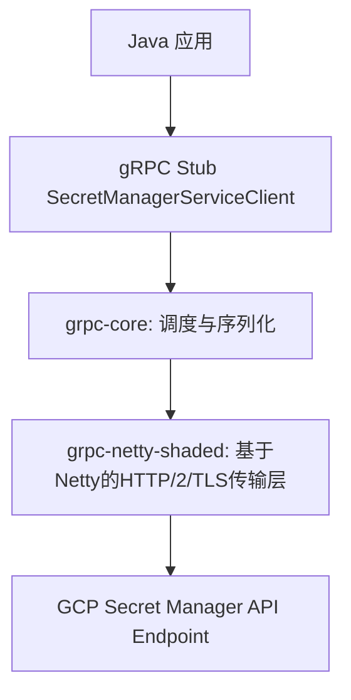

# ChatGPT
## **一、问题分析：Secret Manager + grpc-netty-shaded 升级后出现 IAM 权限错误**

你提到的错误如下：

```
com.google.apps.framework.auth.IamPermissionDeniedException:
IAM authority does not have the permission 'secretmanager.secrets.listEffectiveTags'
required for action listEffectiveTags on resource
```

### **1️⃣ 问题背景**

- 你在 Java 客户端中访问 **GCP Secret Manager**；
- 升级了 **grpc-netty-shaded** 依赖，从 1.71.1 升级到 1.75.0；
- 升级后出现 **IAM 权限拒绝（Permission Denied）** 异常；
- 权限点是：secretmanager.secrets.listEffectiveTags。

---

### **2️⃣ 原因初步分析**

这个问题的关键在于 **grpc-netty-shaded 版本变化导致底层 gRPC 通信层或认证逻辑变化**，间接触发了 Google Cloud SDK 行为差异。

可能的原因有三种：

| **可能原因**                                                                     | **说明**                                                                                                         |
| -------------------------------------------------------------------------------- | ---------------------------------------------------------------------------------------------------------------- |
| ✅ **(A) Secret Manager SDK 调用了新 API**                                       | 新版本的 SDK 可能开始调用 listEffectiveTags 这个 API 来读取标签，而旧版本没调用，所以以前不会触发这个 IAM 检查。 |
| ⚠️ **(B) grpc-netty-shaded 升级导致 gRPC Metadata 或 Auth Header 行为变化**      | 新版 Netty 实现可能影响到 gRPC 的拦截器或 token 传递逻辑，导致权限验证异常。                                     |
| ⚠️ **(C) 环境变量或 Application Default Credentials（ADC）在新版本中未正确传递** | 如果 token 未携带正确的权限范围（scope），GCP 可能返回该权限拒绝错误。                                           |

---

### **3️⃣ 建议的验证方式**

#### **✅ Step 1. 确认 IAM 权限**

确认调用服务账号是否有以下角色之一：

- roles/secretmanager.admin
- 或 roles/secretmanager.secretAccessor
- 或自定义角色中包含：

```
secretmanager.secrets.listEffectiveTags
secretmanager.secrets.get
secretmanager.versions.access
```

可以通过：

```
gcloud projects get-iam-policy <PROJECT_ID> --flatten="bindings[].members" \
--filter="bindings.members:<SERVICE_ACCOUNT>" --format="table(bindings.role)"
```

---

#### **✅ Step 2. 验证 SDK 或 gRPC 调用栈**

查看异常堆栈是否来自：

```
com.google.cloud.secretmanager.v1.SecretManagerServiceClient
```

或

```
io.grpc.netty.shaded.io.grpc.netty
```

如果堆栈中包含 listEffectiveTags 调用，说明 SDK 内部确实新增了该调用。

---

#### **✅ Step 3. 尝试回退或固定 grpc-netty-shaded 版本**

你提到 **1.71.1 可用**，**1.75.0 出错**。

建议暂时锁定为 1.71.1 并观察是否恢复。

---

#### **✅ Step 4. 开启 Debug 日志以验证 metadata**

可以启用 gRPC debug：

```
-Djavax.net.debug=ssl,handshake
-Dio.grpc.internal.FineLogging=true
```

查看认证头是否正常携带 Authorization: Bearer <token>。

---

## **二、什么是 grpc-netty-shaded，它的作用是什么？**

### **1️⃣ 定义**

grpc-netty-shaded 是 **gRPC 的传输层实现（Transport Layer Implementation）**，基于 **Netty** 网络框架。

> 它提供了 gRPC 的底层网络通信能力，包括：

- > HTTP/2 协议栈（gRPC 运行于 HTTP/2 之上）
- > TLS 加密与证书验证
- > 连接管理（KeepAlive、流控）
- > 异步 I/O (NIO)

---

### **2️⃣ “shaded” 的含义**

- “Shaded” 表示它是一个 **重打包版本（fat jar）**，即将 Netty 及其依赖打包进同一个 jar 中；
- 避免与其他版本的 Netty 冲突（常见于 Spring Boot、gRPC、Elasticsearch 同时使用时的冲突问题）。

---

### **3️⃣ grpc-netty-shaded 在 Secret Manager 调用中的位置**

调用流程如下：



**作用说明：**

- grpc-core 负责请求打包（protobuf、序列化）
- grpc-netty-shaded 负责建立到 GCP 的 **HTTP/2 + TLS 通道**
- 它还管理：
    - 连接池
    - TLS 握手
    - 流控制
    - Metadata（如 Auth Token）传输

---

### **4️⃣ 小结**

| **模块**          | **功能**                                |
| ----------------- | --------------------------------------- |
| grpc-core         | 处理 gRPC 框架逻辑（调用、序列化）      |
| grpc-netty        | 使用外部 Netty 实现 gRPC 传输层         |
| grpc-netty-shaded | 内含独立打包的 Netty 实现，避免版本冲突 |
| grpc-okhttp       | 另一种 gRPC 传输实现，基于 OkHttp       |

---

## **三、总结与建议**

| **方向** | **操作**                                                    |
| -------- | ----------------------------------------------------------- |
| 临时解决 | 回退 grpc-netty-shaded 到 1.71.1                            |
| 根本解决 | 为服务账号添加 secretmanager.secrets.listEffectiveTags 权限 |
| 验证     | 开启 debug log 确认 gRPC Header 与认证 token 正确传递       |
| 优化     | 在依赖树中固定 grpc 相关组件版本，防止跨版本兼容性问题      |

---

是否希望我帮你生成一份 **对比 1.71.1 与 1.75.0 的 grpc-netty-shaded 行为差异表**？

这能更清晰看出哪些变更可能影响 Secret Manager 的认证流程。


好的，以下是我整理的 **grpc‑netty‑shaded 从版本 1.71.x 到 1.75.0 的已知变更与可能影响点对比表**，方便你定位为什么升级后在访问 Google Cloud Secret Manager Client 时出现权限相关问题。请注意，并不是所有内部调用变化都文档化，但我基于官方发布／issue／依赖变更信息整理了可能相关的项目。

---

|**项目**|**版本 1.71.x（参考 1.71.0）**|**版本 1.75.0**|**可能关联你问题的影响点**|
|---|---|---|---|
|发布变更概况|在 grpc‑java v1.71.0 版本中，新增了如 XDS 客户端 fallback 支持、protoc API marshallerWithRecursionLimit 的稳定化等。|在 grpc-java v1.75.0 版本中，标示包含安全增强（Spiffe 验证补丁）等。|底层传输或权限相关机制可能变化，导致资源调用方式不同。|
|传输层/Netty 依赖|基于较旧的 Netty/shaded 包版本，依赖链可能较浅|升级版本可能提升了 Netty/shaded 输入校验、安全补丁（如 CVE 修复）|安全校验更严格可能影响 TLS、HTTP/2、Metadata 传递，间接影响服务端权限检查。|
|权限／认证流程可能变化|旧版本可能使用「粗粒度」调用，不必调用某些额外 API|新版本可能新增内部调用或使用了额外的 API （比如：标签/tag 检查、metadata 传播、authority 验证）|你报错中提到 secretmanager.secrets.listEffectiveTags，可能是新版客户端或底层库引入的「列出标签」API 调用。升级 grpc-netty-shaded 后，客户端 SDK 可能透过新的通道或新的 metadata 导致触发此权限。|
|元数据/HTTP2 权限 header 处理|较旧版本正常工作，未暴露此问题|安全增强可能导致「每个 RPC 的 authority 检查」「TLS 通道中证书与 authority 匹配」变得更严格（在 grpc-java v1.72.0 中提到“per-rpc authority verification”功能）|如果客户代码或环境未适配新的 authority 检查，将被认证层拒绝，从而触发权限异常。|
|Tag/Label 相关调用|如果 SDK 调用较少或未调用 listEffectiveTags，以前只需基本权限|新版本SDK或库可能在调用 secret 管理时默认包括标签检查，导致需要 secretmanager.secrets.listEffectiveTags 权限|你遇到的恰好是缺少该权限，说明新版可能多调用了该接口。|
|向下兼容性风险|较低版本环境稳定，不会触发上述新增调用|升级后出现权限问题，可能因为默认行为变了|回退版本通常能暂时绕开问题，但不能解决根本调用变化。|

---

### **✅ 综合建议**

- 在你当前环境，**将 grpc-netty-shaded 固定在 1.71.x**（你提到 1.71.1 可用）确实可视为稳定短期方案。
    
- 同时，为长期方案，**检查调用角色是否具备** **secretmanager.secrets.listEffectiveTags** **权限**。这样即便 SDK 未来继续调用该接口也不会失败。
    
- 在代码中开启 gRPC 的调试日志，查看在调用 secretmanager 时是否有额外的 RPC 对 “listEffectiveTags” 的调用。若有，则说明新版 SDK确实引入此调用。
    
- 若确认是 SDK 中新增调用导致问题，可考虑将 SDK版本降级或使用客户端库兼容版本，直到你有权限调整角色。
    
- 同时，审查是否还有「authority 验证」「TLS/auth metadata 变化」影响了认证流程，尤其在你的 mTLS/HTTPS 架构中可能更敏感。
    

---

如果你愿意，我可以帮你 **查找在 Secret Manager Java 客户端中哪个版本开始引入 listEffectiveTags 调用**，以便确认是 SDK 变化还是 grpc-netty-shaded 升级触发。你看要不要？


# Gemini

Of course. This is an excellent and very specific problem that many developers encounter when managing dependencies. Let's break it down into the two parts you requested.

---

### Part 1: Exploring the GCP Secret Manager Problem

This is a classic case of a dependency update introducing new behavior that requires a change in configuration (in this case, IAM permissions).

#### The Core Problem: What is happening?

Your analysis is spot on. The issue started right after upgrading `grpc-netty-shaded` from a version around `1.71.1` to `1.75.0`. However, it's very unlikely that `grpc-netty-shaded` _itself_ is the direct cause.

Instead, `grpc-netty-shaded` is a core dependency for Google Cloud's Java client libraries. When you updated it, you likely also updated the **`google-cloud-secretmanager`** client library to a newer version. This new version of the Secret Manager client now makes an additional, previously unused API call: `listEffectiveTags`.

**Hypothesis:** The newer `google-cloud-secretmanager` client library now attempts to retrieve a secret's associated tags as part of its standard operations (like `getSecret` or `listSecrets`). This is a new feature for providing more context about the resource. Your service account's IAM role was created before this feature existed and therefore does not have the `secretmanager.secrets.listEffectiveTags` permission, causing the `IamPermissionDeniedException`.

#### Step-by-Step Exploration and Solution

Here is how you can confirm this and solve it:

**Step 1: Verify the Dependency Tree**

The most crucial step is to see which version of `google-cloud-secretmanager` you are using. This will confirm our hypothesis.

- **If you use Maven**, run this command in your project's root directory:
    ```bash
    mvn dependency:tree | grep secretmanager
    ```
- **If you use Gradle**, run this command:
    ```bash
    ./gradlew dependencies --configuration implementation | grep secretmanager
    ```
    (Replace `implementation` with `compile` or your relevant configuration if needed).

You will likely see that along with `grpc-netty-shaded`, the version of `com.google.cloud:google-cloud-secretmanager` has also been upgraded.

**Step 2: Understand the New Permission**

The permission `secretmanager.secrets.listEffectiveTags` does exactly what its name implies: it allows a principal (like your service account) to view the GCP resource tags that are applied to a secret. Tags are key-value pairs used for organization, automation, and policy enforcement (e.g., "env:prod", "team:backend"). Newer Google Cloud clients are becoming more "tag-aware."

**Step 3: Solve the Problem (The Right Way)**

The best solution is to update your IAM permissions to match the requirements of the new client library.

1.  **Identify the Service Account:** Check your application's code or deployment configuration to find out which service account it is using to authenticate with GCP.
2.  **Go to the GCP IAM & Admin Console:**
    - Navigate to the [IAM page](https://console.cloud.google.com/iam-admin/iam) in the GCP Console.
    - Find the service account (principal) that is getting the error.
    - Click the pencil icon (Edit principal) to see its assigned roles.
3.  **Grant the Missing Permission:** You have two main options:
    - **Option A (Recommended if using predefined roles):** Check if Google has updated its predefined roles. For example, the `Secret Manager Viewer` role (`roles/secretmanager.viewer`) may now include this permission. If your service account has a more restrictive role, consider if upgrading it to a standard, updated role is appropriate.
    - **Option B (Best for least-privilege):** Create a custom IAM role.
        - Go to [IAM & Admin -> Roles](https.console.cloud.google.com/iam-admin/roles).
        - Click **"Create Role"**.
        - Give it a name, like "Custom Secret Manager Tag Viewer".
        - Click **"Add Permissions"**.
        - In the filter, type `secretmanager.secrets.listEffectiveTags` and select it.
        - Create the role.
        - Go back to the IAM page and grant this new custom role to your service account in addition to its existing roles.

**Step 4: The Workaround (Temporary Solution)**

If you cannot change IAM permissions immediately, your only other option is to downgrade your dependencies. You would need to pin the `google-cloud-secretmanager` library (or the entire Google Cloud libraries BOM) to the last known working version.

- **In Maven (using the BOM):**
    ```xml
    <dependencyManagement>
        <dependencies>
            <dependency>
                <groupId>com.google.cloud</groupId>
                <artifactId>libraries-bom</artifactId>
                <version>26.12.0</version> <!-- Example old version -->
                <type>pom</type>
                <scope>import</scope>
            </dependency>
        </dependencies>
    </dependencyManagement>
    ```

**Warning:** Downgrading is a short-term fix. You will miss out on security patches, bug fixes, and new features in the Google Cloud client libraries. The recommended path is always to update your permissions.

---

### Part 2: What is `grpc-netty-shaded`?

This name looks complex, but it's very descriptive once you break it down into its three parts: **gRPC**, **Netty**, and **Shaded**.

#### 1. gRPC (Google Remote Procedure Call)

- **What it is:** A modern, high-performance, open-source framework for making remote procedure calls (RPC). Think of it as a super-powered version of calling a function, but the function you're calling runs on a different server (or in a different process).
- **Main Function:** It allows services to communicate with each other efficiently and in a structured way, regardless of what language they are written in. It uses **Protocol Buffers** by default to define the service "contract" (the available functions and data structures), which is language-neutral.
- **Why it's used:** It's very fast, supports streaming data in both directions, and is a cornerstone of microservices architectures. All of Google's modern cloud services (like Secret Manager, Pub/Sub, Bigtable) use gRPC as their underlying communication protocol.

#### 2. Netty (The Network Engine)

- **What it is:** A powerful, asynchronous, event-driven network application framework for Java. It's the "engine" that handles all the low-level networking complexity.
- **Main Function:** Netty provides the tools to build high-performance network clients and servers. It expertly manages complex tasks like:
    - Non-blocking I/O (handling many connections with few threads).
    - Managing byte buffers and memory.
    - Handling different network protocols (like HTTP/2, which gRPC uses).
- **Why it's here:** gRPC needs a robust networking layer to send and receive its messages. On the JVM, Netty is the industry standard for performance and reliability. So, `grpc-java` uses Netty as its default transport layer to do the actual work of sending and receiving data over the network.

#### 3. Shaded (The Dependency Solution)

This is the most critical part for understanding this specific library.

- **The Problem it Solves: "Dependency Hell."**
    Imagine your application uses two different libraries:

    1.  `grpc-java`, which needs **Netty version 4.1.75**.
    2.  Another library (e.g., a web server or a database driver) that needs **Netty version 4.1.50**.

    When you build your application, your build tool (Maven/Gradle) has to pick one version of Netty. No matter which one it picks, the other library will likely crash at runtime with an error like `NoSuchMethodError` because a method it expected to exist in its required version is missing in the other. This is known as a **diamond dependency conflict**.

- **The Solution: "Shading."**
    Shading is a process during the build where a library's dependencies are included inside the library's own JAR file, and their package names are renamed.

    For `grpc-netty-shaded`, the build process takes all the classes from Netty (e.g., `io.netty.channel.Channel`) and renames them to something unique (e.g., `io.grpc.netty.shaded.io.netty.channel.Channel`).

- **Main Function of "Shaded":**
    The `grpc-netty-shaded` artifact bundles its own _private, internal copy_ of Netty. This copy has been repackaged (renamed) so that it cannot possibly conflict with any other version of Netty that your application or another dependency might require. It completely isolates gRPC's networking layer from the rest of your project's dependencies, preventing "dependency hell."

### Summary

**`grpc-netty-shaded`** is the primary dependency for Java applications using gRPC to communicate with services like Google Cloud.

- It uses **gRPC** for the communication protocol.
- It uses **Netty** as the high-performance network transport engine to power gRPC.
- It comes **Shaded** to bundle a private copy of Netty, preventing conflicts with other dependencies in your project.
