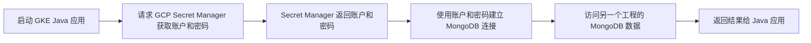
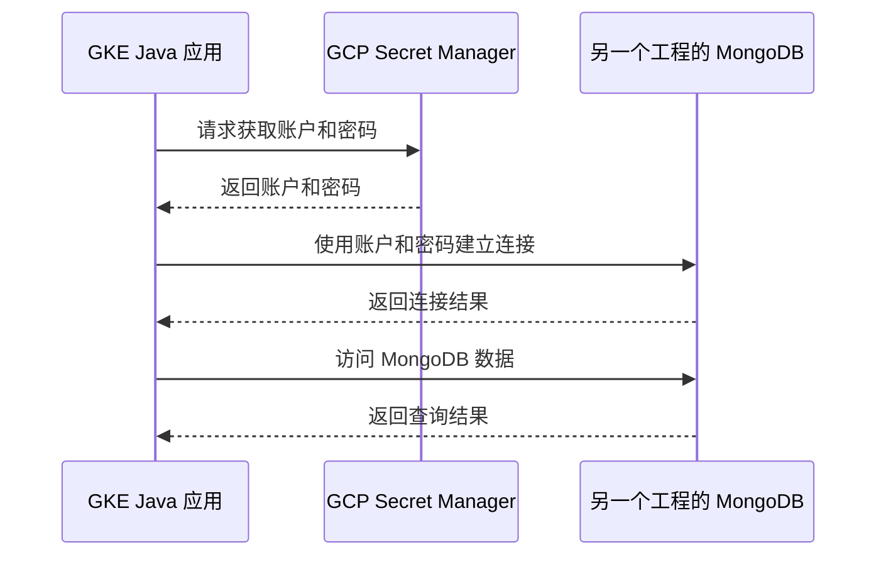

以下是描述该流程的 Mermaid 流程图，用 Markdown 格式生成。此图涵盖了 Java 应用程序从 GCP Secret Manager 获取凭据并访问另一个工程的 MongoDB 的流程：

```mermaid
graph LR;
    A[启动 GKE Java 应用] --> B[请求 GCP Secret Manager 获取账户和密码];
    B --> C[Secret Manager 返回账户和密码];
    C --> D[使用账户和密码建立 MongoDB 连接];
    D --> E[访问另一个工程的 MongoDB 数据];
    E --> F[返回结果给 Java 应用];
```
如果需要进一步调整或补充，请告诉我！

```mermaid
sequenceDiagram
    participant JavaApp as GKE Java 应用
    participant SecretManager as GCP Secret Manager
    participant MongoDB as 另一个工程的 MongoDB

    JavaApp->>SecretManager: 请求获取账户和密码
    SecretManager-->>JavaApp: 返回账户和密码
    JavaApp->>MongoDB: 使用账户和密码建立连接
    MongoDB-->>JavaApp: 返回连接结果
    JavaApp->>MongoDB: 访问 MongoDB 数据
    MongoDB-->>JavaApp: 返回查询结果
```