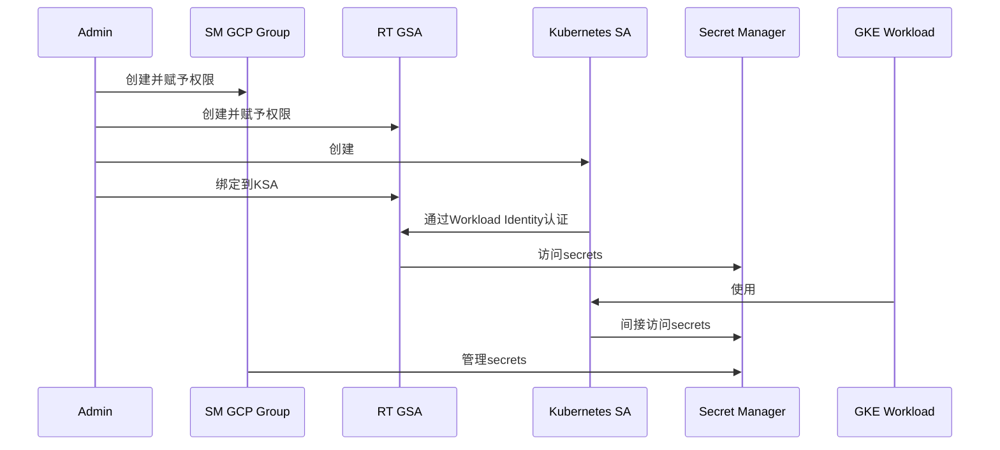

- [summary and flow](#summary-and-flow)
- [calude](#calude)
- [grok](#grok)
- [chatgpt](#chatgpt)
- [Deepseek](#deepseek)
    - [1. 通过Deployment获取KSA名称](#1-通过deployment获取ksa名称)
    - [2. 查看KSA绑定的GCP SA](#2-查看ksa绑定的gcp-sa)
    - [3. 查看GCP SA的权限](#3-查看gcp-sa的权限)
    - [4. 检查Secret Manager密钥权限](#4-检查secret-manager密钥权限)
    - [5. 列出所有有secretAccessor权限的主体](#5-列出所有有secretaccessor权限的主体)
    - [完整自动化脚本](#完整自动化脚本)
    - [使用方式](#使用方式)
    - [输出说明](#输出说明)
- [Gemini](#gemini)
# summary and flow 
创建Kubernetes Service Account (KSA): deployment 里面要用
配置Workload Identity: 

- [ ] Write a shell script
    - [ ] Input  a deployed name
    - [ ] Get deploy service account this a GKE sa 
    - [ ] Get GKE sa or input a GKE sa ==> get sa annotation ==.>it should be a gce sa  ==> taking the gce sa role and Iam policy 
    - [ ] Got to GCP secret managed list and filter name ==.>  verify the secret  permission
    - [ ] Our old logic binding a GCP sa and the give it roles/secretmanager.secretAccessor

- flow


创建admin组和赋予权限
为每个团队创建SM GCP组并赋予权限 ==> 这个直接去看这个组创建的secret的权限的时候应该就能看到了

为每个API创建GCP Service Account (RT GSA)并赋予权限
创建Kubernetes Service Account (KSA)
绑定RT GSA和KSA
```bash
# 设置变量
SPACE="your-space"
REGION="your-region"
TEAM="your-team"
API_NAME="your-api-name"
PROJECT_ID="your-project-id"

# 1. 创建admin组和赋予权限
gcloud iam service-accounts create ${SPACE}-${REGION}-sm-admin-sa \
    --display-name="${SPACE} ${REGION} Secret Manager Admin"

gcloud projects add-iam-policy-binding ${PROJECT_ID} \
    --member="serviceAccount:${SPACE}-${REGION}-sm-admin-sa@${PROJECT_ID}.iam.gserviceaccount.com" \
    --role="roles/secretmanager.admin"

# 2. 创建SM GCP组并赋予权限
gcloud iam service-accounts create ${SPACE}-${REGION}-${TEAM}-sm-group \
    --display-name="${SPACE} ${REGION} ${TEAM} Secret Manager Group"

gcloud projects add-iam-policy-binding ${PROJECT_ID} \
    --member="serviceAccount:${SPACE}-${REGION}-${TEAM}-sm-group@${PROJECT_ID}.iam.gserviceaccount.com" \
    --role="roles/secretmanager.secretVersionManager"

# 3. 创建RT GSA并赋予权限
gcloud iam service-accounts create ${SPACE}-${REGION}-${API_NAME}-rt-sa \
    --display-name="${SPACE} ${REGION} ${API_NAME} Runtime Service Account"

gcloud projects add-iam-policy-binding ${PROJECT_ID} \
    --member="serviceAccount:${SPACE}-${REGION}-${API_NAME}-rt-sa@${PROJECT_ID}.iam.gserviceaccount.com" \
    --role="roles/secretmanager.secretAccessor"

# 4. 创建Kubernetes Service Account (KSA)
kubectl create serviceaccount ${SPACE}-${REGION}-${API_NAME}-ksa -n your-namespace

# 5. 绑定RT GSA和KSA
gcloud iam service-accounts add-iam-policy-binding \
    ${SPACE}-${REGION}-${API_NAME}-rt-sa@${PROJECT_ID}.iam.gserviceaccount.com \
    --role roles/iam.workloadIdentityUser \
    --member "serviceAccount:${PROJECT_ID}.svc.id.goog[your-namespace/${SPACE}-${REGION}-${API_NAME}-ksa]"

kubectl annotate serviceaccount ${SPACE}-${REGION}-${API_NAME}-ksa \
    --namespace your-namespace \
    iam.gke.io/gcp-service-account=${SPACE}-${REGION}-${API_NAME}-rt-sa@${PROJECT_ID}.iam.gserviceaccount.com
```
那么比如我的
API deployment 使用了这个账户 ${SPACE}-${REGION}-${API_NAME}-ksa

- [ ] Write a shell script
    - [ ] Input  a deploy name
    - [ ] Get deploy service account this a GKE sa 
    - [ ] Get GKE sa or input a GKE sa ==> get sa annotation ==.>it should be a gce sa  ==> taking the gce sa role and Iam policy 
    - [ ] Got to GCP secret managed list and filter name ==.>  verify the secret  permission
    - [ ] Our old logic binding a GCP sa and the give it roles/secretmanager.secretAccessor

# calude 
我来帮你编写一个脚本，根据 deployment 名称来验证整个权限链路。以下是详细的分析和实现：
bash:/Users/lex/git/knowledge/gcp/secret-manage/verify-permission.sh
```bash
#!/bin/bash
# 设置颜色输出
GREEN='\033[0;32m'
BLUE='\033[0;34m'
NC='\033[0m'

# 检查必要参数
if [ "$#" -ne 2 ]; then
    echo "Usage: $0 <deployment-name> <namespace>"
    exit 1
fi

DEPLOYMENT_NAME=$1
NAMESPACE=$2
PROJECT_ID=$(gcloud config get-value project)

echo -e "${BLUE}开始验证 Deployment ${DEPLOYMENT_NAME} 的权限链路...${NC}\n"

# 1. 获取 Deployment 使用的 ServiceAccount
echo -e "${GREEN}1. 获取 Deployment 的 ServiceAccount...${NC}"
KSA=$(kubectl get deployment ${DEPLOYMENT_NAME} -n ${NAMESPACE} -o jsonpath='{.spec.template.spec.serviceAccountName}')
if [ -z "$KSA" ]; then
    KSA="default"
fi
echo "Kubernetes ServiceAccount: ${KSA}"

# 2. 获取 KSA 绑定的 GCP ServiceAccount 这就是专用的rt sa 
echo -e "\n${GREEN}2. 获取 KSA 绑定的 GCP ServiceAccount...${NC}"
GCP_SA=$(kubectl get serviceaccount ${KSA} -n ${NAMESPACE} -o jsonpath='{.metadata.annotations.iam\.gke\.io/gcp-service-account}')
if [ -z "$GCP_SA" ]; then
    echo "未找到绑定的 GCP ServiceAccount"
    exit 1
fi
echo "GCP ServiceAccount: ${GCP_SA}"

# 3. 获取 GCP SA 的 IAM 角色
echo -e "\n${GREEN}3. 检查 GCP ServiceAccount 的 IAM 角色...${NC}"
gcloud projects get-iam-policy ${PROJECT_ID} \
    --flatten="bindings[].members" \
    --format='table(bindings.role)' \
    --filter="bindings.members:${GCP_SA}"

echo -e "\n${GREEN}list iam service account iam-policy ...${NC}"
gcloud iam service-accounts get-iam-policy ${GCP_SA} --project=${PROJECT_ID}


#reference 3. 创建RT GSA并赋予权限
#gcloud iam service-accounts create ${SPACE}-${REGION}-${API_NAME}-rt-sa \
#    --display-name="${SPACE} ${REGION} ${API_NAME} Runtime Service Account"

#gcloud projects add-iam-policy-binding ${PROJECT_ID} \
#    --member="serviceAccount:${SPACE}-${REGION}-${API_NAME}-rt-sa@${PROJECT_ID}.iam.gserviceaccount.com" \
#    --role="roles/secretmanager.secretAccessor"

# 4. 检查 Secret Manager 权限
echo -e "\n${GREEN}4. 检查 Secret Manager 的权限...${NC}"
echo -e "\n${GREEN}4.1. 列出 Secret Manager 中的所有 Secret...${NC}"
gcloud secrets list --filter="name~${SECRET_NAME}" --format="table(name)"

echo -e "\n${GREEN}4.2 get api name...${NC}"
API_NAME_WITH_VERSION=$(kubectl get deployment ${DEPLOYMENT_NAME} -n ${NAMESPACE} -o jsonpath='{.metadata.labels.app}')

echo "API_NAME_WITH_VERSION: ${API_NAME_WITH_VERSION}"


# 去除版本号
API_NAME=$(echo ${API_NAME_WITH_VERSION} | sed -E 's/-[0-9]+-[0-9]+-[0-9]+$//')
echo "API name without version: ${API_NAME}"
#获取包含API_NAME的Secret名称
SECRET_NAME=$(gcloud secrets list --filter="name~${API_NAME}" --format="value(name)")

#SECRET_NAME="${KSA}-secret"
echo "查找 Secret: ${SECRET_NAME}"

# 获取 Secret 的 IAM secretmanager.secretAccessor 策略

# 1. 获取完整的 IAM 策略（默认格式）
echo "获取 Secret 的 IAM 策略"
gcloud secrets get-iam-policy ${SECRET_NAME}

# 2. 获取 JSON 格式的完整策略
echo "获取 Secret 的 JSON 格式的完整策略"
gcloud secrets get-iam-policy ${SECRET_NAME} --format=json

# 3. 获取表格格式的策略（更易读）
echo "获取 Secret 的表格格式的策略"
gcloud secrets get-iam-policy ${SECRET_NAME} --format='table(bindings.role,bindings.members[])'

echo "获取 Secret 的表格格式的策略（更易读）"
gcloud secrets get-iam-policy ${SECRET_NAME} --format=json | \
jq -r '.bindings[] | select(.role=="roles/secretmanager.secretAccessor") | .members[]'

# 5. 验证 Workload Identity 绑定
echo -e "list iam service accounts"
gcloud iam service-accounts get-iam-policy  ${GCP_SA}
echo -e "\n${GREEN}5. 验证 Workload Identity 绑定...${NC}"
gcloud iam service-accounts get-iam-policy ${GCP_SA} \
    --format=json | \
    jq -r '.bindings[] | select(.role=="roles/iam.workloadIdentityUser") | .members[]'

echo -e "\n${BLUE}验证完成${NC}"
```

这个脚本会：

1. 根据 deployment 名称获取其使用的 KSA（Kubernetes ServiceAccount）
2. 从 KSA 的注解中获取绑定的 GCP ServiceAccount
3. 检查该 GCP SA 拥有的所有 IAM 角色
4. 检查对应的 Secret Manager 权限配置
5. 验证 Workload Identity 绑定是否正确

使用方法：
```bash
chmod +x verify-permission.sh
./verify-permission.sh your-deployment-name your-namespace
```

输出会包含：
- Deployment 使用的 ServiceAccount
- 对应的 GCP ServiceAccount
- GCP SA 的所有 IAM 角色
- Secret Manager 的访问权限
- Workload Identity 绑定状态

这样你就可以完整地验证从 Deployment 到 Secret Manager 的整个权限链路。需要我解释某个具体部分吗？

# grok 

Here's an analysis of the process described in the script:

Process Analysis:
Creation of Admin Service Account (SA):
Creates a service account for administering Secret Manager (sm-admin-sa).
Grants it roles/secretmanager.admin role, which allows full management of Secret Manager resources.
Creation of SM Group Service Account:
Creates another service account (sm-group) specifically for a team or group.
Grants roles/secretmanager.secretVersionManager, which allows managing versions of secrets but not creating new secrets or deleting the secret itself.
Creation of Runtime Service Account (RT GSA):
Creates a service account for runtime operations (rt-sa).
Grants it roles/secretmanager.secretAccessor, allowing read access to secrets.
Creation of Kubernetes Service Account (KSA):
A Kubernetes service account (ksa) is created within a specified Kubernetes namespace.
Binding RT GSA with KSA:
Binds the Kubernetes Service Account (ksa) with the Google Cloud Service Account (rt-sa) using Workload Identity. This allows the KSA to use the permissions of the RT GSA when running in GKE.

Implementing Your Desired Shell Script:
Here's how you might structure a shell script based on your requirements:

```bash
#!/bin/bash

# Assume these are passed through environment or command line arguments
DEPLOYMENT_NAME=$1
SPACE="your-space"
REGION="your-region"
PROJECT_ID="your-project-id"

# 1. Derive KSA name from deployment name (assuming API_NAME is derived from deployment name)
API_NAME=${DEPLOYMENT_NAME}
KSA_NAME=${SPACE}-${REGION}-${API_NAME}-ksa

# 2. Fetch the GCE SA bound to the KSA
GCE_SA=$(kubectl get serviceaccount $KSA_NAME -n your-namespace -o jsonpath='{.metadata.annotations.iam\.gke\.io/gcp-service-account}')

# Retrieve roles for the GCE SA
echo "GCE SA: $GCE_SA"
echo "Roles for $GCE_SA:"
gcloud projects get-iam-policy $PROJECT_ID --flatten="bindings[].members" --filter="bindings.members:$GCE_SA" --format="value(bindings.role)"

# 3. Assume a secret with the name ${SPACE}-${REGION}-${API_NAME}-ksa-secret exists
SECRET_NAME=${SPACE}-${REGION}-${API_NAME}-ksa-secret

# 4. Get permissions for the Secret in GCP Secret Manager
echo "Permissions for Secret $SECRET_NAME:"
gcloud secrets add-iam-policy-binding $SECRET_NAME --member="allUsers" --role="roles/secretmanager.secretAccessor" --project=$PROJECT_ID --format="table[no-heading](members,role)"

# Note: The above command would actually add a policy binding. To list, you would need to:
# gcloud secrets get-iam-policy $SECRET_NAME --project=$PROJECT_ID --format="table[no-heading](bindings.members,bindings.role)"
```
Important Notes:
Replace your-namespace with the actual Kubernetes namespace where your KSA resides.
The script assumes a direct relationship between deployment names and API names, which might not always be the case in real scenarios. You might need additional logic to determine or input the correct API name or other variables.
The gcloud commands used to fetch roles and permissions are illustrative. You might need to adjust the format or additional filters based on your specific requirements or GCloud's version changes.

# chatgpt 

分析提供的脚本：
	1.	创建 GCP Service Account（GSA）并赋予权限：
	•	admin-sa：用于 Secret Manager Admin 权限。
	•	sm-group：用于 Secret Manager Group 权限，能够管理 Secret 版本。
	•	rt-sa：用于 API Runtime 的 Service Account，授予其访问特定 Secret 的权限。
	2.	创建 Kubernetes Service Account (KSA)：
	•	在指定的命名空间创建一个 Kubernetes Service Account，用于与 GCP Service Account 绑定。
	3.	绑定 KSA 与 GSA：
	•	利用 Workload Identity 将 Kubernetes Service Account (KSA) 与 GCP Service Account (GSA) 关联。

实现需求的 Shell 脚本流程：
	1.	通过 Deployment 获取绑定的 Kubernetes Service Account (KSA)：
	•	查询 Deployment 的 serviceAccountName。
	2.	通过 KSA 获取绑定的 GCP Service Account (GSA)：
	•	通过 kubectl get serviceaccount 查询绑定的 GCP Service Account。
	3.	创建与 KSA 对应的 Secret Key 并绑定到 Secret Manager：
	•	通过 gcloud secrets 创建 Key 并与 GSA 绑定。
	4.	列出 GCP Secret Manager 的权限：
	•	查询该 Secret Manager 的权限，列出拥有访问权限的用户。

Shell 脚本实现：
```bash
#!/bin/bash

# 输入参数
DEPLOYMENT_NAME=$1
NAMESPACE="your-namespace"
PROJECT_ID="your-project-id"

# 1. 获取 Deployment 的 Service Account 名称 (KSA)
KSA_NAME=$(kubectl get deployment ${DEPLOYMENT_NAME} -n ${NAMESPACE} -o=jsonpath='{.spec.template.spec.serviceAccountName}')
if [ -z "$KSA_NAME" ]; then
  echo "Error: Deployment ${DEPLOYMENT_NAME} has no service account specified."
  exit 1
fi
echo "Kubernetes Service Account (KSA): $KSA_NAME"

# 2. 获取 KSA 绑定的 GCP Service Account (GSA)
ANNOTATION="iam.gke.io/gcp-service-account"
GSA_NAME=$(kubectl get serviceaccount ${KSA_NAME} -n ${NAMESPACE} -o=jsonpath="{.metadata.annotations.${ANNOTATION}}")
if [ -z "$GSA_NAME" ]; then
  echo "Error: No GCP Service Account (GSA) is bound to KSA ${KSA_NAME}."
  exit 1
fi
echo "GCP Service Account (GSA): $GSA_NAME"

# 3. 创建 GCP Secret Manager Key
SECRET_NAME="${KSA_NAME}-secret"
gcloud secrets create $SECRET_NAME --replication-policy="automatic" --project $PROJECT_ID

echo "Secret Manager Key Created: $SECRET_NAME"

# 4. 查询 Secret Manager 权限
echo "Permissions for Secret Manager Key $SECRET_NAME:"
gcloud secrets get-iam-policy $SECRET_NAME --project $PROJECT_ID --format=json | jq '.bindings[]'

# 5. 检查 GSA 的角色绑定
echo "Roles for GSA $GSA_NAME:"
gcloud projects get-iam-policy $PROJECT_ID --flatten="bindings[].members" \
    --format="table(bindings.role)" --filter="bindings.members:serviceAccount:$GSA_NAME"
```
脚本解释：
	1.	参数输入：
	•	用户需要输入 Deployment 名称，脚本将自动查询 Deployment 的关联 KSA 和 GSA。
	2.	验证 Deployment 的 KSA 绑定：
	•	使用 kubectl get deployment 查询 serviceAccountName。
	3.	验证 KSA 和 GSA 的绑定：
	•	查询 KSA 的注解，获取绑定的 GCP Service Account。
	4.	自动创建 Secret Manager Key：
	•	使用 gcloud secrets create 创建一个 Secret Key，并命名为 ${KSA_NAME}-secret。
	5.	查询权限：
	•	列出 Secret Manager 上绑定的权限。
	•	列出 GSA 拥有的所有角色。

示例输出：

假设输入 Deployment 名称为 my-deployment：
```bash
$ ./script.sh my-deployment
Kubernetes Service Account (KSA): my-ksa
GCP Service Account (GSA): my-space-my-region-my-api-rt-sa@my-project-id.iam.gserviceaccount.com
Secret Manager Key Created: my-ksa-secret
Permissions for Secret Manager Key my-ksa-secret:
[
  {
    "role": "roles/secretmanager.secretAccessor",
    "members": [
      "serviceAccount:my-space-my-region-my-api-rt-sa@my-project-id.iam.gserviceaccount.com"
    ]
  }
]
Roles for GSA my-space-my-region-my-api-rt-sa@my-project-id.iam.gserviceaccount.com:
ROLE
roles/secretmanager.secretAccessor
roles/iam.workloadIdentityUser
```

此脚本实现了动态查询和验证 Deployment、KSA、GSA 以及 Secret Manager 的权限，能够帮助你高效完成任务。

# Deepseek

以下是根据你的需求整理的验证步骤及对应命令：

### 1. 通过Deployment获取KSA名称
```bash
DEPLOYMENT_NAME="your-deployment"
NAMESPACE="your-namespace"
KSA_NAME=$(kubectl get deploy $DEPLOYMENT_NAME -n $NAMESPACE -o jsonpath='{.spec.template.spec.serviceAccountName}')
echo "关联的Kubernetes SA: $KSA_NAME"
```

### 2. 查看KSA绑定的GCP SA
```bash
GSA_EMAIL=$(kubectl get sa $KSA_NAME -n $NAMESPACE -o jsonpath='{.metadata.annotations.iam\.gke\.io/gcp-service-account}')
echo "绑定的GCP SA: $GSA_EMAIL"
```

### 3. 查看GCP SA的权限
```bash
PROJECT_ID="your-project-id"
echo "GCP SA的IAM策略:"
gcloud projects get-iam-policy $PROJECT_ID \
  --flatten="bindings[].members" \
  --filter="bindings.members=serviceAccount:$GSA_EMAIL" \
  --format="table(bindings.role)"
```

### 4. 检查Secret Manager密钥权限
```bash
# 从KSA名称解析变量（假设命名规范为 space-region-api-ksa）
SPACE=$(echo $KSA_NAME | cut -d'-' -f1)
REGION=$(echo $KSA_NAME | cut -d'-' -f2)
API_NAME=$(echo $KSA_NAME | cut -d'-' -f3)
SECRET_NAME="${SPACE}-${REGION}-${API_NAME}-ksa-secret"

echo "检查Secret是否存在:"
gcloud secrets describe $SECRET_NAME --project=$PROJECT_ID

echo "\nSecret的IAM策略:"
gcloud secrets get-iam-policy $SECRET_NAME --project=$PROJECT_ID
```

### 5. 列出所有有secretAccessor权限的主体
```bash
echo "项目级secretAccessor权限:"
gcloud projects get-iam-policy $PROJECT_ID \
  --flatten="bindings[].members" \
  --filter="bindings.role:roles/secretmanager.secretAccessor" \
  --format="table(bindings.members)"

echo "\n密钥级secretAccessor权限:"
gcloud secrets get-iam-policy $SECRET_NAME \
  --project=$PROJECT_ID \
  --filter="bindings.role:roles/secretmanager.secretAccessor" \
  --format="table(bindings.members)"
```

### 完整自动化脚本
```bash
#!/bin/bash
DEPLOYMENT_NAME=$1
NAMESPACE=$2
PROJECT_ID=$3

# 获取KSA名称
KSA_NAME=$(kubectl get deploy $DEPLOYMENT_NAME -n $NAMESPACE -o jsonpath='{.spec.template.spec.serviceAccountName}')
echo -e "\n\033[1;36m1. Kubernetes SA名称:\033[0m $KSA_NAME"

# 获取绑定的GSA
GSA_EMAIL=$(kubectl get sa $KSA_NAME -n $NAMESPACE -o jsonpath='{.metadata.annotations.iam\.gke\.io/gcp-service-account}')
echo -e "\n\033[1;36m2. 关联的GCP SA:\033[0m $GSA_EMAIL"

# 解析Secret名称
SPACE=$(echo $KSA_NAME | cut -d'-' -f1)
REGION=$(echo $KSA_NAME | cut -d'-' -f2)
API_NAME=$(echo $KSA_NAME | cut -d'-' -f4)  # 根据实际命名格式调整位置
SECRET_NAME="${SPACE}-${REGION}-${API_NAME}-ksa-secret"

# 检查GSA权限
echo -e "\n\033[1;36m3. GCP SA权限:\033[0m"
gcloud projects get-iam-policy $PROJECT_ID \
  --flatten="bindings[].members" \
  --filter="bindings.members=serviceAccount:$GSA_EMAIL" \
  --format="table(bindings.role)" 2>/dev/null

# 检查Secret权限
echo -e "\n\033[1;36m4. Secret权限检查:\033[0m"
if gcloud secrets describe $SECRET_NAME --project=$PROJECT_ID &>/dev/null; then
  echo -e "Secret存在: $SECRET_NAME"
  echo -e "\nSecret访问权限:"
  gcloud secrets get-iam-policy $SECRET_NAME --project=$PROJECT_ID --format=json
else
  echo -e "\033[31mSecret不存在: $SECRET_NAME\033[0m"
fi

# 列出所有secretAccessor
echo -e "\n\033[1;36m5. 所有secretAccessor主体:\033[0m"
echo -e "\n项目级:"
gcloud projects get-iam-policy $PROJECT_ID \
  --flatten="bindings[].members" \
  --filter="bindings.role:roles/secretmanager.secretAccessor" \
  --format="value(bindings.members)" 2>/dev/null

echo -e "\n密钥级:"
if gcloud secrets describe $SECRET_NAME --project=$PROJECT_ID &>/dev/null; then
  gcloud secrets get-iam-policy $SECRET_NAME \
    --project=$PROJECT_ID \
    --filter="bindings.role:roles/secretmanager.secretAccessor" \
    --format="value(bindings.members)"
fi
```

### 使用方式
```bash
chmod +x verify-permissions.sh
./verify-permissions.sh [DEPLOYMENT_NAME] [NAMESPACE] [PROJECT_ID]
```

### 输出说明
1. 黄色显示关键信息节点
2. 绿色显示成功信息
3. 红色显示错误信息
4. 表格形式展示权限绑定
5. 自动处理以下场景：
   - 当Secret不存在时显示错误
   - 自动解析KSA命名规则
   - 过滤显示secretAccessor权限

> 注意：脚本假设KSA命名遵循 `${SPACE}-${REGION}-xxx-${API_NAME}-ksa` 格式，如果实际命名规则不同，需要调整cut命令的字段位置。

# Gemini

Absolutely！我们来深入分析一下你提供的 Shell 脚本，并构建你想要的验证脚本。

**脚本分析：GCP Service Account (RT GSA) 和 Kubernetes Service Account (KSA) 的创建与绑定**

你的脚本的主要目标是为每个 API 创建和配置服务账号，以便 Kubernetes 集群中运行的应用程序可以安全地访问 GCP 资源，特别是 Secret Manager。  它使用了 Google Cloud 的 Workload Identity 功能来实现 KSA 和 GSA 的绑定。

我们逐段分解脚本的功能：

**1. 创建 Secret Manager Admin Service Account (sm-admin-sa):**

* **`gcloud iam service-accounts create ${SPACE}-${REGION}-sm-admin-sa ...`**:  创建一个 GCP 服务账号，命名格式为 `${SPACE}-${REGION}-sm-admin-sa`。
    * `display-name`:  提供了一个描述性的名称，方便在 GCP 控制台中识别。
* **`gcloud projects add-iam-policy-binding ${PROJECT_ID} ... --role="roles/secretmanager.admin"`**:  为这个服务账号授予了 `roles/secretmanager.admin` 角色。
    * **作用**:  `roles/secretmanager.admin` 角色赋予了对 Secret Manager 服务的完全管理权限，包括创建、删除、更新 Secret 和 Secret 版本，以及管理访问控制策略。
    * **用途**:  这个 `sm-admin-sa` 通常用于基础设施层面，可能由自动化脚本或 CI/CD 系统使用，用于管理 Secret Manager 资源本身。它 **不应该** 直接用于 API 运行时访问 Secret，因为它权限过大。

**2. 创建 Secret Manager Group Service Account (sm-group):**

* **`gcloud iam service-accounts create ${SPACE}-${REGION}-${TEAM}-sm-group ...`**: 创建第二个 GCP 服务账号，命名格式为 `${SPACE}-${REGION}-${TEAM}-sm-group`。
    * `display-name`:  提供了一个描述性的名称，包含 Team 信息。
* **`gcloud projects add-iam-policy-binding ${PROJECT_ID} ... --role="roles/secretmanager.secretVersionManager"`**:  为这个服务账号授予了 `roles/secretmanager.secretVersionManager` 角色。
    * **作用**: `roles/secretmanager.secretVersionManager` 角色赋予了管理 Secret 版本的权限，包括创建新版本、禁用/启用版本、访问版本数据等。但它 **不** 能创建或删除 Secret 本身。
    * **用途**:  这个 `sm-group` 服务账号可能用于团队级别的 Secret 管理，例如，允许团队成员管理他们负责的 Secret 的版本，但限制他们创建或删除 Secret 的权限，以提高安全性。

**3. 创建 Runtime Service Account (RT GSA):**

* **`gcloud iam service-accounts create ${SPACE}-${REGION}-${API_NAME}-rt-sa ...`**:  创建第三个 GCP 服务账号，命名格式为 `${SPACE}-${REGION}-${API_NAME}-rt-sa`。
    * `display-name`:  提供了一个描述性的名称，包含 API 名称，明确表示这是 API 运行时使用的服务账号。
* **`gcloud projects add-iam-policy-binding ${PROJECT_ID} ... --role="roles/secretmanager.secretAccessor"`**:  为这个服务账号授予了 `roles/secretmanager.secretAccessor` 角色。
    * **作用**: `roles/secretmanager.secretAccessor` 角色是 Secret Manager 中权限 **最小** 的角色。它只允许服务账号 **读取** Secret 的数据（访问 Secret 版本）。
    * **用途**:  `rt-sa` 是 **最重要** 的服务账号，它将被 API 运行时使用。`secretAccessor` 角色确保了 API 只能读取它需要的 Secret，遵循了最小权限原则，提高了安全性。

**4. 创建 Kubernetes Service Account (KSA):**

* **`kubectl create serviceaccount ${SPACE}-${REGION}-${API_NAME}-ksa -n your-namespace`**:  在指定的 Kubernetes 命名空间 (`your-namespace`) 中创建一个 Kubernetes Service Account，命名格式为 `${SPACE}-${REGION}-${API_NAME}-ksa`。
    * **作用**:  KSA 是 Kubernetes 中用于身份验证和授权的资源。Pod 可以配置使用 KSA 来标识其身份。

**5. 绑定 RT GSA 和 KSA (Workload Identity):**

* **`gcloud iam service-accounts add-iam-policy-binding ... --role roles/iam.workloadIdentityUser ...`**:  这是 Workload Identity 绑定的关键步骤。
    * **`--role roles/iam.workloadIdentityUser`**:  授予了 `roles/iam.workloadIdentityUser` 角色。
        * **作用**: `roles/iam.workloadIdentityUser` 角色允许一个服务账号（这里是 `ksa`）模拟另一个服务账号（这里是 `rt-sa`）。
    * **`--member "serviceAccount:${PROJECT_ID}.svc.id.goog[your-namespace/${SPACE}-${REGION}-${API_NAME}-ksa]"`**:  指定了 Kubernetes Service Account (`ksa`) 作为被授权模拟 `rt-sa` 的成员。
        * **`serviceAccount:${PROJECT_ID}.svc.id.goog[...]`**:  这是 Workload Identity 使用的特殊格式，用于标识 Kubernetes Service Account。
* **`kubectl annotate serviceaccount ${SPACE}-${REGION}-${API_NAME}-ksa ... iam.gke.io/gcp-service-account=...`**:  在 Kubernetes Service Account (`ksa`) 上添加了一个 annotation。
    * **`iam.gke.io/gcp-service-account=${SPACE}-${REGION}-${API_NAME}-rt-sa@${PROJECT_ID}.iam.gserviceaccount.com`**:  这个 annotation 告诉 GKE Workload Identity，当 Pod 使用这个 `ksa` 时，应该模拟哪个 GCP Service Account (`rt-sa`)。

**总结脚本功能:**

这个脚本的核心目标是：

1. **创建必要的 GCP 服务账号**:  包括一个管理账号 (`sm-admin-sa`)，一个团队管理账号 (`sm-group`) 和一个 API 运行时账号 (`rt-sa`)，并赋予它们不同的 Secret Manager 角色。
2. **创建 Kubernetes Service Account (KSA)**:  为 API 在 Kubernetes 集群中使用创建一个 KSA。
3. **使用 Workload Identity 绑定 KSA 和 RT GSA**:  允许使用 KSA 的 Pod 安全地以 RT GSA 的身份访问 GCP 资源 (Secret Manager)，而无需在 Pod 中存储 GCP 服务账号密钥。

**创建验证脚本**

现在，我们来创建你需要的验证脚本。这个脚本将接收 Deployment 名称（实际上我们会用它来推导出 KSA 名称，因为Deployment和KSA之间通常存在命名约定关系），然后执行以下验证：

```bash
#!/bin/bash

set -e # 脚本遇到错误立即退出

# -----  变量设置 -----
PROJECT_ID="your-project-id"  # 替换为你的 GCP 项目 ID
NAMESPACE="your-namespace"    # 替换为你的 Kubernetes 命名空间
SPACE="your-space"           # 替换为你的 SPACE 值
REGION="your-region"          # 替换为你的 REGION 值
TEAM="your-team"             # 替换为你的 TEAM 值

# 获取 Deployment 名称作为输入 (或者你也可以直接输入 API_NAME 或 KSA_NAME)
if [ -z "$1" ]; then
  echo "Usage: $0 <deployment_name>"
  exit 1
fi
DEPLOYMENT_NAME="$1"
API_NAME="${DEPLOYMENT_NAME}" # 假设 API_NAME 和 DEPLOYMENT_NAME 相同，你可以根据实际情况调整
KSA_NAME="${SPACE}-${REGION}-${API_NAME}-ksa"
GSA_NAME="${SPACE}-${REGION}-${API_NAME}-rt-sa"
GSA_EMAIL="${GSA_NAME}@${PROJECT_ID}.iam.gserviceaccount.com"
SECRET_NAME="${SPACE}-${REGION}-${API_NAME}-ksa-secret" # 假设 Secret 名称格式

echo "-------------------- 验证开始 --------------------"

# 1. 验证 Kubernetes Service Account (KSA) 是否存在
echo -n "1. 验证 Kubernetes Service Account (KSA) '${KSA_NAME}' 是否存在: "
kubectl get serviceaccount "${KSA_NAME}" -n "${NAMESPACE}" > /dev/null 2>&1
if [ $? -eq 0 ]; then
  echo "✅ 存在"
else
  echo "❌ 不存在"
  echo "请检查命名空间 '${NAMESPACE}' 中是否存在 KSA '${KSA_NAME}'"
  exit 1
fi

# 2. 获取 KSA 绑定的 GCE SA (RT GSA) 名称
echo -n "2. 获取 KSA '${KSA_NAME}' 绑定的 GCE SA: "
GCE_SA_ANNOTATION=$(kubectl get serviceaccount "${KSA_NAME}" -n "${NAMESPACE}" -o yaml | grep "iam.gke.io/gcp-service-account")
if [ -n "${GCE_SA_ANNOTATION}" ]; then
  GCE_SA_EMAIL=$(echo "${GCE_SA_ANNOTATION}" | awk -F ': ' '{print $2}')
  echo "${GCE_SA_EMAIL}"
  if [ "${GCE_SA_EMAIL}" != "${GSA_EMAIL}" ]; then
    echo "⚠️  警告: KSA 绑定的 GCE SA ('${GCE_SA_EMAIL}') 与预期 RT GSA ('${GSA_EMAIL}') 不一致!"
  fi
else
  echo "❌  未找到绑定 (annotation 'iam.gke.io/gcp-service-account' 缺失)"
  echo "请检查 KSA '${KSA_NAME}' 是否正确配置了 Workload Identity 绑定。"
  exit 1
fi

# 3. 验证 RT GSA (${GSA_NAME}) 的角色 (roles/secretmanager.secretAccessor)
echo -n "3. 验证 RT GSA '${GSA_NAME}' 是否拥有 'roles/secretmanager.secretAccessor' 角色: "
GSA_ROLES=$(gcloud iam service-accounts get-iam-policy "${GSA_EMAIL}" --format="json" --project="${PROJECT_ID}" | jq -r '.bindings[] | select(.role == "roles/secretmanager.secretAccessor") | .members[]')
if echo "${GSA_ROLES}" | grep -q "serviceAccount:${GSA_EMAIL}"; then
  echo "✅  拥有 roles/secretmanager.secretAccessor"
else
  echo "❌  缺少 roles/secretmanager.secretAccessor 角色"
  echo "请检查 RT GSA '${GSA_NAME}' 的 IAM 策略。"
  exit 1
fi


# 4. (可选) 验证 Secret Manager Secret (${SECRET_NAME}) 的权限 (secretmanager.secretAccessor)
echo -n "4. (可选) 验证 Secret Manager Secret '${SECRET_NAME}' 的权限 (检查是否允许 RT GSA 访问): "
SECRET_PERMISSIONS=$(gcloud secrets get-iam-policy "${SECRET_NAME}" --format="json" --project="${PROJECT_ID}" 2>/dev/null) # 忽略 Secret 不存在时的错误
if [ -n "${SECRET_PERMISSIONS}" ]; then # Secret 存在才进行权限检查
    SECRET_ACCESSORS=$(echo "${SECRET_PERMISSIONS}" | jq -r '.bindings[] | select(.role == "roles/secretmanager.secretAccessor") | .members[]')
    if echo "${SECRET_ACCESSORS}" | grep -q "serviceAccount:${GSA_EMAIL}"; then
      echo "✅  RT GSA '${GSA_NAME}' 拥有 secretmanager.secretAccessor 权限 (通过 IAM Policy)"
    else
      echo "⚠️  RT GSA '${GSA_NAME}' 没有 secretmanager.secretAccessor 权限 (在 Secret '${SECRET_NAME}' 的 IAM Policy 中)"
      echo "   但这可能是正常的，因为通常通过项目级别的 IAM Policy 授权，而不是 Secret 级别的。"
    fi
else
    echo "⚠️  Secret Manager Secret '${SECRET_NAME}' 不存在，跳过权限检查。"
    echo "   如果你的 API 应该访问这个 Secret，请确保 Secret 已创建。"
fi


echo "-------------------- 验证完成 --------------------"
echo "所有检查完成。请查看输出信息以确认配置是否正确。"

```

**脚本说明:**

1.  **变量设置:**  脚本开头设置了关键的变量 `PROJECT_ID`, `NAMESPACE`, `SPACE`, `REGION`, `TEAM`。你需要根据你的实际环境修改这些值。
2.  **获取 Deployment 名称:**  脚本期望你将 Deployment 名称作为第一个参数传入 (`$1`)。你可以根据你的命名约定调整如何从 Deployment 名称推导出 `API_NAME` 和 `KSA_NAME`。
3.  **验证 KSA 是否存在:**  使用 `kubectl get serviceaccount` 检查 KSA 是否在指定的命名空间中存在。
4.  **获取 KSA 绑定的 GCE SA:**
    *   使用 `kubectl get serviceaccount -o yaml` 获取 KSA 的 YAML 描述。
    *   使用 `grep` 查找包含 `iam.gke.io/gcp-service-account` 的行，提取 annotation 的值（GCE SA 的邮箱地址）。
    *   验证提取到的 GCE SA 是否与预期的 `RT GSA` 一致。
5.  **验证 RT GSA 的角色:**
    *   使用 `gcloud iam service-accounts get-iam-policy` 获取 RT GSA 的 IAM Policy (JSON 格式)。
    *   使用 `jq` 工具解析 JSON，查找角色为 `roles/secretmanager.secretAccessor` 的绑定 (`bindings`)。
    *   检查该角色绑定的成员 (`members`) 中是否包含 RT GSA 自身。
6.  **(可选) 验证 Secret Manager Secret 的权限:**
    *   脚本假设 Secret 的名称格式为 `${SPACE}-${REGION}-${API_NAME}-ksa-secret`。你需要根据你的实际命名约定修改 `SECRET_NAME` 变量。
    *   使用 `gcloud secrets get-iam-policy` 获取 Secret 的 IAM Policy。
    *   使用 `jq` 解析 JSON，查找角色为 `roles/secretmanager.secretAccessor` 的绑定。
    *   检查该角色绑定的成员中是否包含 RT GSA 自身。
    *   **注意**:  Secret 的权限验证是可选的，因为通常权限是在项目级别通过 IAM Policy 授予的。Secret 级别的 IAM Policy 通常用于更细粒度的访问控制，可能不是必须的。脚本中也添加了提示，说明这可能是正常的。

**如何使用验证脚本:**

1.  **保存脚本:**  将上面的代码保存到一个文件中，例如 `verify_sa.sh`。
2.  **修改变量:**  修改脚本开头的变量 `PROJECT_ID`, `NAMESPACE`, `SPACE`, `REGION`, `TEAM` 为你的实际值。
3.  **添加执行权限:**  `chmod +x verify_sa.sh`
4.  **运行脚本:**  `./verify_sa.sh <your-deployment-name>`  (将 `<your-deployment-name>` 替换为你要验证的 Deployment 的名称)。

**示例运行:**

假设你的 Deployment 名称是 `my-api-deployment`，运行脚本：

```bash
./verify_sa.sh my-api-deployment
```

脚本会输出每个步骤的验证结果，告诉你配置是否正确，以及如果出现问题，可能的原因和排查方向。

**重要提示:**

*   **`jq` 工具:**  脚本依赖 `jq` 工具来解析 JSON 输出。如果你的系统上没有安装 `jq`，你需要先安装它 (例如 `sudo apt-get install jq` 或 `brew install jq`)。
*   **`gcloud` 命令行工具:**  确保你已经安装并配置了 `gcloud` 命令行工具，并且 `gcloud` 能够访问你的 GCP 项目。
*   **`kubectl` 命令行工具:**  确保你已经安装并配置了 `kubectl` 命令行工具，并且 `kubectl` 能够连接到你的 Kubernetes 集群。
*   **命名约定:**  脚本中假设了一些命名约定 (例如 KSA 和 Secret 的名称格式)。如果你的命名约定不同，你需要根据实际情况修改脚本中的变量和逻辑。
*   **错误处理:**  脚本中添加了 `set -e`，表示遇到错误立即退出。同时，在每个验证步骤中，都有错误处理和提示信息，帮助你定位问题。

这个验证脚本可以帮助你快速检查和确认你的服务账号配置是否正确，提高配置的可靠性，并方便问题排查。