# GCP TLS 公共负载均衡流程图

以下是GCP中典型的TLS公共负载均衡到后端服务再到MIG的完整流程图：

```mermaid
flowchart LR
    subgraph Client ["客户端层"]
        CL["客户端请求<br/>HTTPS流量"]
        style CL fill:#f5f5f5,stroke:#616161
    end

    subgraph Security ["安全层"]
        FW["Cloud Armor<br/>安全策略<br/>DDoS防护<br/>WAF规则"]
        style FW fill:#ffecb3,stroke:#ffa000
    end

    subgraph External ["外部访问层"]
        FR["转发规则 Forward Rule<br/>协议: HTTPS<br/>端口: 443<br/>全局静态IP"]
        style FR fill:#bbdefb,stroke:#1976d2
    end

    subgraph TLS ["TLS处理层"]
        CERT["SSL证书<br/>Google管理证书/自定义证书<br/>TLS版本: 1.2/1.3"]
        style CERT fill:#d1c4e9,stroke:#673ab7
    end

    subgraph LoadBalancing ["负载均衡层"]
        LB["全局外部HTTPS负载均衡器<br/>类型: Global External<br/>算法: Round Robin/Weighted"]
        style LB fill:#c8e6c9,stroke:#388e3c
    end

    subgraph URLMap ["URL映射层"]
        UM["URL映射<br/>路径匹配规则<br/>主机匹配规则"]
        style UM fill:#b2dfdb,stroke:#00796b
    end

    subgraph Services ["服务层"]
        TS["目标HTTPS代理<br/>TLS终止<br/>会话亲和性"]
        BS["后端服务 Backend Service<br/>会话亲和性<br/>容量扩缩配置<br/>超时设置"]
        style TS fill:#e1bee7,stroke:#7b1fa2
        style BS fill:#e1bee7,stroke:#7b1fa2
    end

    subgraph Infrastructure ["基础设施层"]
        HC["健康检查 Health Check<br/>检查间隔: 5s<br/>超时阈值: 3次<br/>协议: HTTPS"]
        MIG["实例组 MIG<br/>自动扩缩容<br/>最小实例数: 2<br/>目标CPU利用率: 75%<br/>区域分布"]
        style HC fill:#ffccbc,stroke:#e64a19
        style MIG fill:#ffccbc,stroke:#e64a19
    end

    CL --> |"发起HTTPS请求"| FW
    FW --> |"过滤恶意流量"| FR
    FR --> |"转发HTTPS流量"| CERT
    CERT --> |"TLS握手<br/>证书验证"| LB
    LB --> |"基于URL分发"| UM
    UM --> |"路由到目标代理"| TS
    TS --> |"TLS终止<br/>解密HTTPS流量"| BS
    BS --> |"定期检测<br/>HTTPS健康状态"| HC
    HC --> |"动态伸缩<br/>实例管理"| MIG

    classDef default fill:#f9f9f9,stroke:#333,stroke-width:2px
    linkStyle default stroke:#666,stroke-width:2px,stroke-dasharray: 5 5
```

## 流程说明

### 1. 客户端请求
- 用户通过HTTPS协议访问应用
- 使用443端口进行安全连接

### 2. 安全层 (Cloud Armor)
- 提供DDoS防护
- 应用Web应用防火墙(WAF)规则
- 过滤恶意流量和攻击

### 3. 转发规则 (Forward Rule)
- 将流量从外部IP地址转发到负载均衡器
- 指定HTTPS协议和443端口
- 使用全局静态IP地址

### 4. TLS处理
- 管理SSL/TLS证书(Google管理或自定义)
- 处理TLS握手过程
- 支持TLS 1.2和1.3版本

### 5. 负载均衡器 (Load Balancer)
- 全局外部HTTPS负载均衡器
- 分发流量到多个区域的后端
- 支持多种负载均衡算法

### 6. URL映射
- 基于URL路径将请求路由到不同后端
- 支持主机名和路径匹配规则
- 可配置重定向和重写规则

### 7. 目标HTTPS代理
- 终止TLS连接
- 解密HTTPS流量
- 管理会话亲和性

### 8. 后端服务 (Backend Service)
- 定义后端实例组
- 配置会话亲和性
- 设置容量扩缩和超时参数

### 9. 健康检查 (Health Check)
- 定期检查后端实例健康状态
- 使用HTTPS协议进行健康检查
- 配置检查间隔和失败阈值

### 10. 托管实例组 (MIG)
- 管理一组相同配置的VM实例
- 提供自动扩展和自愈能力
- 跨区域分布以提高可用性
- 基于CPU利用率等指标自动扩缩

## 优势

- **高安全性**: TLS加密和Cloud Armor保护
- **全球可用性**: 全局负载均衡支持多区域部署
- **高性能**: Google全球网络优化路由
- **自动扩展**: 基于负载自动调整实例数量
- **高可用性**: 健康检查和自愈能力确保服务稳定
