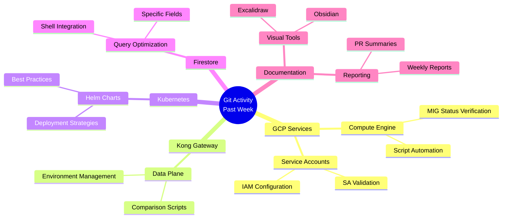

# Weekly Git Log Analysis

## Overview
Analysis of git commits from the past week, categorizing modified files by technical domain and summarizing key knowledge points.

## Commit Summary (Last Week)
- Total commits: 11
- Most active day: February 2nd (6 commits)
- Primary author: Lex

## Technical Domains

### 1. Google Cloud Platform (GCP)
**Files Modified:**
- `gcp/gce/verify-mig-status.sh` (4 times)
- `gcp/gce/verify-mig-status.md` (4 times)
- `gcp/gce/merged-scripts.md` (3 times)
- `gcp/sa/verify-gce-sa.sh` (1 time)
- `gcp/sa/merged-scripts.md` (1 time)
- `gcp/sa/serviceaccountuser-securityreviewer.md` (1 time)

**Knowledge Points:**
- Managing Managed Instance Groups (MIGs) in GCP
- Verifying GCE service account configurations
- Script automation for GCP resource validation
- Identity and Access Management (IAM) for service accounts

### 2. Kong API Gateway
**Files Modified:**
- `kong/kongdp/compare-dp.sh` (2 times)
- `kong/kongdp/merged-scripts.md` (2 times)
- `kong/kongdp/compare-dp.md` (1 time)
- `kong/kongdp/compare-dp-eng.sh` (1 time)

**Knowledge Points:**
- Kong Data Plane comparison scripts
- API gateway configuration management
- DevOps practices for API infrastructure
- Scripting for Kong DP environments

### 3. Kubernetes (K8s)
**Files Modified:**
- `k8s/docs/helm-best-practices.md` (1 time)

**Knowledge Points:**
- Helm chart best practices
- Kubernetes deployment strategies
- Container orchestration patterns

### 4. Firestore Database
**Files Modified:**
- `firestore/scripts/README.md` (1 time)
- `firestore/scripts/firestore-get-specific-fields.sh` (1 time)
- `firestore/scripts/merged-scripts.md` (1 time)
- `firestore/scripts/queries-example.txt` (1 time)

**Knowledge Points:**
- Firestore querying techniques
- Shell scripting for database operations
- Query optimization for specific fields
- NoSQL database management

### 5. Drawing/Documentation Tools
**Files Modified:**
- `Excalidraw/first.md` (1 time)
- `draw/docs/obsidian-excalidraw.md` (1 time)
- Various `.canvas` and `.base` files (multiple)

**Knowledge Points:**
- Visual documentation creation
- Obsidian integration with Excalidraw
- Diagramming for technical documentation

### 6. General Scripts and Reports
**Files Modified:**
- `weekly-report.md` (2 times)
- `pr-summary-2025-08-23.md` (1 time)
- Various temporary/todo files

**Knowledge Points:**
- Automated reporting systems
- Development workflow tracking
- Task management and planning

## Mermaid Mindmap

## Key Insights

1. **GCP Focus**: The most activity was in GCP-related scripts, particularly around MIG status verification and service account management, indicating ongoing cloud infrastructure work.

2. **Automation Emphasis**: Multiple script files were modified, showing a focus on automating routine tasks in cloud and API management.

3. **Documentation**: Consistent updates to documentation files suggest an emphasis on maintaining knowledge bases and best practices.

4. **Multi-Platform Skills**: The variety of technologies (GCP, Kong, K8s, Firestore) indicates work across multiple platforms and services.

5. **DevOps Practices**: The combination of scripts, documentation, and infrastructure files reflects strong DevOps practices with attention to both operational and documentation aspects.