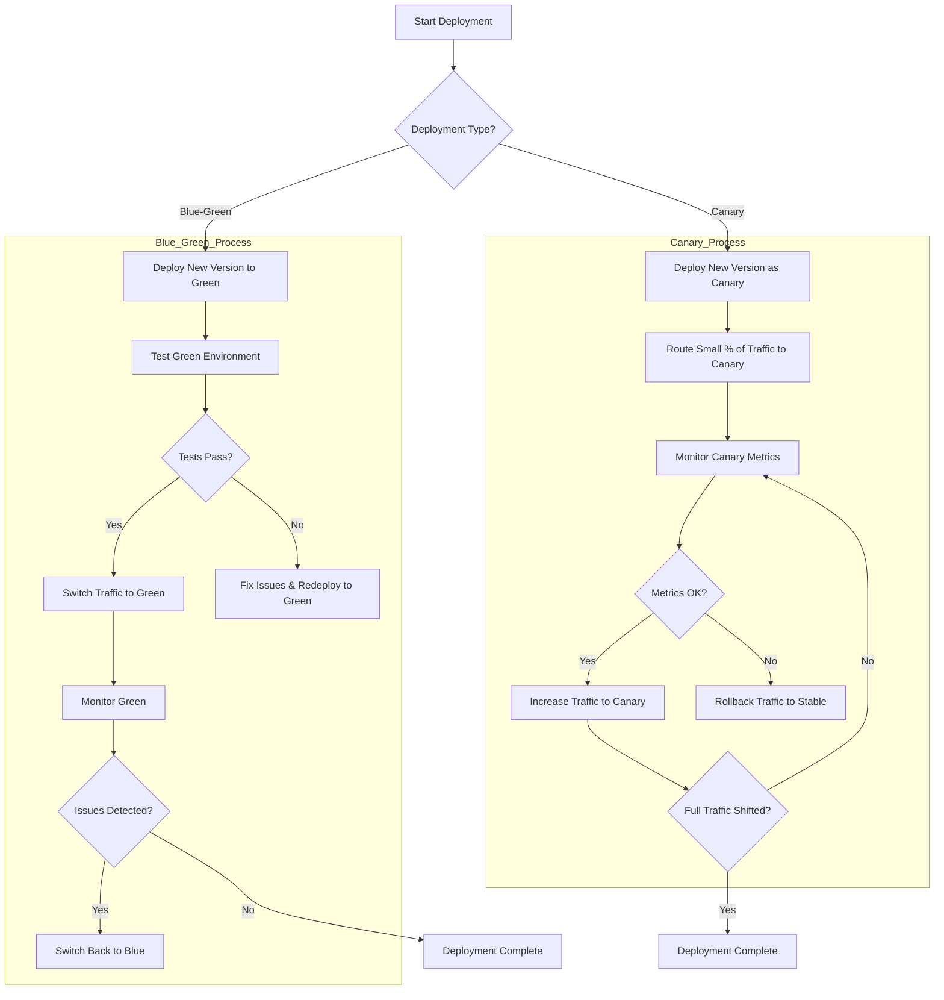

<think>
好的，我现在需要帮助用户解释Blue Green和金丝雀部署各自的侧重点。首先，我得先回忆一下这两种部署方法的定义和应用场景。

用户可能对DevOps或云计算有一定了解，但想更深入理解这两种部署策略的区别。他们可能是技术人员或者正在学习相关知识的学生，需要清晰的对比来应用到实际项目中。

首先，我应该从Blue Green和金丝雀部署的基本概念入手。Blue Green主要是通过两个完全相同的环境，一个用于生产，另一个作为备用，这样切换时几乎零停机时间。而金丝雀部署则是逐步将流量导向新版本，同时保留回滚能力。

接下来要考虑它们的侧重点。Blue Green强调的是快速切换和零停机，适合需要高可用性的场景，比如金融或电商应用。而金丝雀部署更注重于逐步验证和减少风险，适合需要测试新版本稳定性的情况。

用户可能关心的是在什么情况下选择哪种策略。比如，Blue Green的缺点是需要两倍的资源和存储空间，而金丝雀部署可能在测试覆盖范围上不足。这时候需要指出各自的优缺点。

另外，用户可能想知道实际应用中的例子，比如Blue Green用于数据库切换，金丝雀用于A/B测试。这些具体的例子能让解释更生动。

还要注意用户可能的误区，比如Blue Green是否真的完全无停机时间，或者金丝雀是否适合所有场景。这时候需要说明每个策略的适用条件和注意事项。

最后，确保解释结构清晰，分点列出各自的侧重点，并给出对比总结，帮助用户快速抓住核心差异。
</think>

在软件部署中，**Blue-Green Deployment** 和 **Canary Release（金丝雀发布）** 是两种常见的部署策略，它们各有侧重点和适用场景。以下是它们的详细对比：

---

### **一、Blue-Green Deployment（蓝绿部署）**
#### **核心侧重点**：
1. **快速切换，零停机时间**  
   通过维护两个完全相同的生产环境（Blue和Green），在部署新版本时，将流量从Blue切换到Green，无需停机。  
   - **优点**：实现近乎无感知的更新（如用户无缝切换），适合对可用性要求极高的场景。
   - **缺点**：需要两倍的资源（如服务器、存储空间），切换过程需确保Green环境已完全准备好。

2. **回滚简单**  
   若新版本出现故障，只需将流量切换回Blue环境即可快速回滚。  
   - **适用场景**：关键业务系统（如金融、医疗）、需要高可用性或零容忍失败的场景。

3. **依赖镜像和一致性**  
   Blue和Green环境需完全一致（如相同的配置、数据库版本），确保切换时无差异。

#### **实际案例**：
- **电商平台**：在促销期间部署新版本，通过Blue-Green切换避免服务中断。
- **数据库迁移**：将旧数据库（Blue）的流量切换到新数据库（Green），确保查询无损。

---

### **二、Canary Release（金丝雀发布）**
#### **核心侧重点**：
1. **逐步验证，降低风险**  
   将新版本逐渐推送给部分用户或流量（如10%），观察其表现后再全面上线。  
   - **优点**：通过小范围测试验证稳定性，避免全量发布失败。
   - **缺点**：需要复杂的流量管理（如API网关、路由规则），且可能增加监控复杂度。

2. **灵活的流量分割**  
   支持按用户分片（如特定用户组）、按地理区域、或按请求比例分配流量。  
   - **适用场景**：需要测试新功能（如A/B测试）、或对新版本稳定性不确定的场景。

3. **动态回滚**  
   若部分用户反馈问题，可快速将流量切回旧版本。但需注意：某些情况下（如用户数据已部分处理），回滚可能有副作用。

#### **实际案例**：
- **新功能测试**：将新版本推送给10%的用户，收集反馈后再决定是否全量上线。
- **灰度发布**：在云服务中，通过Canary逐步将流量从旧服务（A）切换到新服务（B），避免影响所有用户。

---

### **三、Blue-Green vs. Canary 的关键对比**
| 维度                | Blue-Green Deployment             | Canary Release                   |
|---------------------|-----------------------------------|----------------------------------|
| **核心目标**        | 快速切换、零停机                 | 逐步验证、最小化风险             |
| **流量管理方式**    | 直接切换环境（Blue→Green）       | 按比例或用户分片分配流量         |
| **回滚复杂度**      | 简单（切换环境即可）             | 复杂（需确保未覆盖所有用户）     |
| **资源占用**        | 需两倍环境（Blue + Green）       | 单环境，按需扩展                 |
| **适用场景**        | 高可用性要求极高的系统           | 新功能测试、灰度发布             |
| **稳定性依赖**      | 环境一致性要求高               | 需严格监控流量分割和回滚机制     |

---

### **四、选择建议**
- **Blue-Green**：适合需要**快速上线且无停机时间**的场景，尤其是对稳定性要求极高、难以容忍失败的业务（如金融交易系统）。
- **Canary**：适合需要**逐步验证新功能或服务**的场景，尤其是希望降低风险、收集用户反馈的情况（如新特性发布）。

---

### **五、结合使用**
在实际应用中，两者可以相互补充：
1. 首先通过 **Canary Release** 测试新版本，确认无误后；
2. 再使用 **Blue-Green Deployment** 快速切换到新环境，确保零停机。

例如：某电商平台先用Canary将新版本推送给10%用户，验证无异常后，再通过Blue-Green切换全量流量。

# Blue-Green and Canary Deployment: Key Focus Areas

Below, I’ll explain the key concepts and focus areas of Blue-Green Deployment and Canary Deployment, two popular strategies used in modern DevOps and Kubernetes (K8S) environments for rolling out updates with minimal risk. Both approaches aim to reduce downtime and mitigate risks during deployment, but they differ in their methods and focus.

---

## Blue-Green Deployment

### Overview
Blue-Green Deployment is a release strategy that involves running two identical production environments, referred to as "Blue" and "Green." At any given time, only one environment (e.g., Blue) is live and serving traffic, while the other (e.g., Green) is idle or used for staging the new release.

### Key Focus Areas
- **Zero Downtime:** The primary focus of Blue-Green Deployment is to ensure zero downtime during releases. By switching traffic from the Blue environment to the Green environment only after thorough validation, users experience no interruption.
- **Risk Mitigation through Isolation:** Since the new version (Green) is fully deployed and tested in an isolated environment before going live, the risk of introducing bugs or issues to users is minimized.
- **Instant Rollback:** If an issue is detected after switching to the Green environment, traffic can be instantly rerouted back to the Blue environment, providing a fast and safe rollback mechanism.
- **Environment Consistency:** Emphasis is placed on maintaining identical environments for Blue and Green to ensure that the behavior in staging (Green) matches what will happen in production.

### How It Works in K8S
In a Kubernetes environment (like GKE), Blue-Green Deployment can be achieved using services and labels. For instance:
- Two sets of pods are deployed with different labels (e.g., `env=blue` and `env=green`).
- A Kubernetes Service initially routes traffic to the Blue pods.
- After deploying and testing the new version on Green pods, the Service selector is updated to route traffic to `env=green`.

### Example Scenario
Imagine deploying a web application on GKE:
- Blue environment (current version v1.0) serves live traffic.
- Green environment (new version v2.0) is deployed and undergoes testing (e.g., automated tests, manual checks).
- Once validated, traffic is switched to Green by updating the Service selector.
- If issues arise in v2.0, traffic can be switched back to Blue instantly.

---

## Canary Deployment

### Overview
Canary Deployment is a strategy where a small subset of users or traffic is routed to the new version of an application while the majority continues to use the stable version. This approach allows real-world testing of the new version with minimal impact.

### Key Focus Areas
- **Gradual Validation with Real Traffic:** The primary focus of Canary Deployment is to test the new version in a production environment with a small, controlled group of users or traffic to observe behavior under real-world conditions.
- **Risk Minimization through Limited Exposure:** By exposing only a small percentage of users to the new version, the impact of potential issues is limited, protecting the broader user base.
- **Monitoring and Feedback:** Emphasis is placed on monitoring the canary release for errors, performance issues, or user feedback. Metrics like error rates, latency, and user satisfaction are critical.
- **Incremental Rollout or Rollback:** If the canary performs well, traffic can be gradually shifted to the new version. If issues are detected, the canary traffic can be redirected back to the stable version with minimal disruption.

### How It Works in K8S
In Kubernetes (e.g., GKE), Canary Deployment can be implemented using traffic management tools like Istio, Linkerd, or native Kubernetes features with Ingress controllers:
- Deploy the new version as a separate set of pods with a small traffic percentage routed to them (e.g., via Istio’s traffic shifting rules).
- Use an Ingress or Service Mesh to split traffic (e.g., 5% to the new version, 95% to the stable version).
- Monitor the new version’s performance using tools like Prometheus and Grafana.
- Gradually increase traffic to the new version if metrics are satisfactory, or rollback by redirecting traffic to the stable version.

### Example Scenario
For a web application on GKE:
- Stable version (v1.0) serves 100% of traffic initially.
- Deploy the new version (v2.0) as a canary release and route 5% of traffic to it using an Istio Virtual Service.
- Monitor error rates, latency, and user feedback for the canary pods.
- If successful, incrementally increase traffic to v2.0 (e.g., 25%, 50%, 100%). If issues occur, revert traffic to v1.0.

---

## Comparison of Focus Areas

| **Aspect**                | **Blue-Green Deployment**                     | **Canary Deployment**                       |
|---------------------------|----------------------------------------------|--------------------------------------------|
| **Primary Goal**          | Zero downtime and safe rollback.             | Gradual testing with real user traffic.    |
| **Risk Management**       | Complete isolation of new version until validated. | Limited exposure to new version.          |
| **Testing Environment**   | Separate, identical environment (Green).     | Production environment with small traffic. |
| **Rollback Speed**        | Instant (switch back to Blue).               | Fast but requires traffic rerouting.       |
| **User Impact**           | None until switch (post-validation).         | Small subset of users may experience issues. |
| **Monitoring Focus**      | Pre-switch validation and testing.           | Real-time metrics during canary phase.     |

---

## Mermaid Flowchart for Blue-Green and Canary Deployment Processes

This flowchart illustrates the decision-making and process flow for both Blue-Green and Canary Deployments, highlighting their distinct approaches to validation and traffic management.

---

## Summary
- **Blue-Green Deployment** focuses on zero downtime and risk mitigation by maintaining two identical environments and switching traffic only after full validation. It’s ideal for scenarios where stability is paramount and you can afford the resource overhead of duplicate environments.
- **Canary Deployment** emphasizes gradual validation with real user traffic, minimizing risk by limiting exposure to the new version. It’s well-suited for applications where real-world feedback is critical and resource efficiency is a concern.

Both strategies are widely used in Kubernetes environments like GKE, often in conjunction with tools like Istio for advanced traffic management. If you’re looking to implement either in a specific context or need help with configurations (e.g., K8S manifests or GKE setup), feel free to ask!